# 路由守卫机制

<cite>
**本文档引用的文件**
- [beforeEach.ts](file://src/router/guards/beforeEach.ts)
- [useAuth.ts](file://src/hooks/core/useAuth.ts)
- [loading.ts](file://src/utils/ui/loading.ts)
- [user.ts](file://src/store/modules/user.ts)
- [RouteRegistry.ts](file://src/router/core/RouteRegistry.ts)
- [staticRoutes.ts](file://src/router/routes/staticRoutes.ts)
- [router.ts](file://src/utils/router.ts)
- [routesAlias.ts](file://src/router/routesAlias.ts)
- [MenuProcessor.ts](file://src/router/core/MenuProcessor.ts)
- [auth.ts](file://src/api/auth.ts)
- [useCommon.ts](file://src/hooks/core/useCommon.ts)
</cite>

## 目录
1. [概述](#概述)
2. [架构设计](#架构设计)
3. [核心组件分析](#核心组件分析)
4. [全局前置守卫实现](#全局前置守卫实现)
5. [登录状态验证机制](#登录状态验证机制)
6. [动态路由注册流程](#动态路由注册流程)
7. [加载状态管理](#加载状态管理)
8. [错误处理与异常跳转](#错误处理与异常跳转)
9. [实际应用场景](#实际应用场景)
10. [性能优化考虑](#性能优化考虑)
11. [总结](#总结)

## 概述

Art Design Pro 的路由守卫机制是一个完整的全局前置守卫系统，负责在路由跳转过程中进行权限验证、动态路由注册、用户状态管理等关键操作。该系统采用模块化设计，通过 `setupBeforeEachGuard` 函数注册全局守卫，并通过 `handleRouteGuard` 函数实现详细的守卫逻辑。

### 主要功能特性

- **登录状态验证**：确保用户在访问受保护路由前已登录
- **动态路由注册**：根据用户权限动态加载和注册路由
- **菜单数据管理**：获取和处理用户菜单数据
- **进度条集成**：与 NProgress 进度条无缝集成
- **加载状态管理**：精确控制页面加载状态
- **错误处理机制**：完善的异常处理和跳转逻辑
- **静态路由识别**：智能识别和处理静态路由

## 架构设计

路由守卫系统采用分层架构设计，各组件职责明确，相互协作完成复杂的路由管理任务。

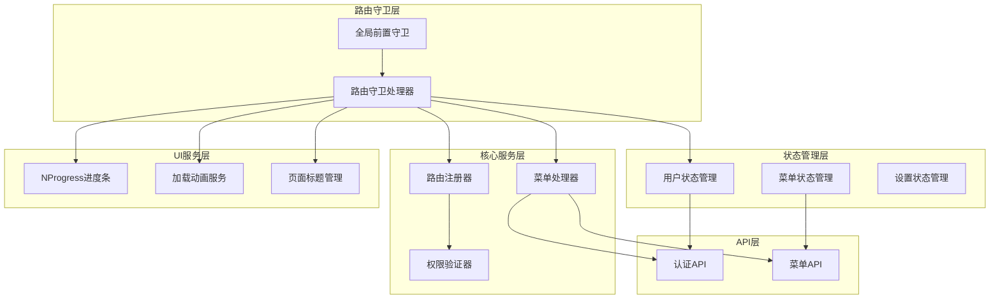
```mermaid
graph TB
subgraph "路由守卫层"
Guard[全局前置守卫]
Handler[路由守卫处理器]
end
subgraph "状态管理层"
UserStore[用户状态管理]
MenuStore[菜单状态管理]
SettingStore[设置状态管理]
end
subgraph "核心服务层"
Registry[路由注册器]
Processor[菜单处理器]
Validator[权限验证器]
end
subgraph "UI服务层"
Progress[NProgress进度条]
Loading[加载动画服务]
Title[页面标题管理]
end
subgraph "API层"
AuthAPI[认证API]
MenuAPI[菜单API]
end
Guard --> Handler
Handler --> UserStore
Handler --> Registry
Handler --> Processor
Handler --> Progress
Handler --> Loading
Handler --> Title
Registry --> Validator
Processor --> AuthAPI
Processor --> MenuAPI
UserStore --> AuthAPI
MenuStore --> MenuAPI
```

**图表来源**
- [beforeEach.ts](file://src/router/guards/beforeEach.ts#L82-L101)
- [RouteRegistry.ts](file://src/router/core/RouteRegistry.ts#L16-L91)
- [MenuProcessor.ts](file://src/router/core/MenuProcessor.ts#L18-L242)

## 核心组件分析

### 路由注册器 (RouteRegistry)

路由注册器是动态路由管理的核心组件，负责路由的注册、验证和移除操作。

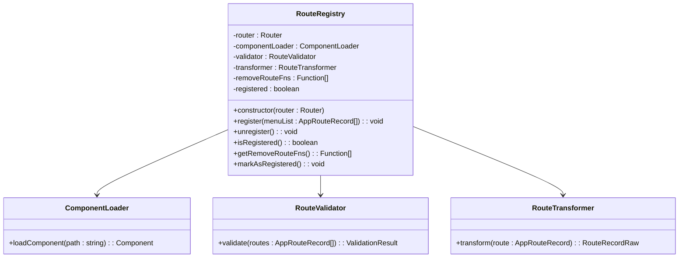
```mermaid
classDiagram
class RouteRegistry {
-router : Router
-componentLoader : ComponentLoader
-validator : RouteValidator
-transformer : RouteTransformer
-removeRouteFns : Function[]
-registered : boolean
+constructor(router : Router)
+register(menuList : AppRouteRecord[]) : void
+unregister() : void
+isRegistered() : boolean
+getRemoveRouteFns() : Function[]
+markAsRegistered() : void
}
class ComponentLoader {
+loadComponent(path : string) : Component
}
class RouteValidator {
+validate(routes : AppRouteRecord[]) : ValidationResult
}
class RouteTransformer {
+transform(route : AppRouteRecord) : RouteRecordRaw
}
RouteRegistry --> ComponentLoader
RouteRegistry --> RouteValidator
RouteRegistry --> RouteTransformer
```

**图表来源**
- [RouteRegistry.ts](file://src/router/core/RouteRegistry.ts#L16-L91)

### 菜单处理器 (MenuProcessor)

菜单处理器负责菜单数据的获取、过滤和处理，支持前端和后端两种权限控制模式。

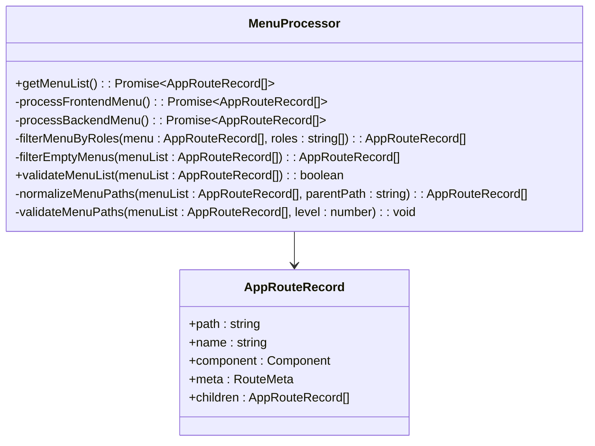
```mermaid
classDiagram
class MenuProcessor {
+getMenuList() : Promise~AppRouteRecord[]~
-processFrontendMenu() : Promise~AppRouteRecord[]~
-processBackendMenu() : Promise~AppRouteRecord[]~
-filterMenuByRoles(menu : AppRouteRecord[], roles : string[]) : AppRouteRecord[]
-filterEmptyMenus(menuList : AppRouteRecord[]) : AppRouteRecord[]
+validateMenuList(menuList : AppRouteRecord[]) : boolean
-normalizeMenuPaths(menuList : AppRouteRecord[], parentPath : string) : AppRouteRecord[]
-validateMenuPaths(menuList : AppRouteRecord[], level : number) : void
}
class AppRouteRecord {
+path : string
+name : string
+component : Component
+meta : RouteMeta
+children : AppRouteRecord[]
}
MenuProcessor --> AppRouteRecord
```

**图表来源**
- [MenuProcessor.ts](file://src/router/core/MenuProcessor.ts#L18-L242)

**章节来源**
- [RouteRegistry.ts](file://src/router/core/RouteRegistry.ts#L16-L91)
- [MenuProcessor.ts](file://src/router/core/MenuProcessor.ts#L18-L242)

## 全局前置守卫实现

### setupBeforeEachGuard 函数

`setupBeforeEachGuard` 是路由守卫的入口函数，负责初始化守卫系统并注册全局前置守卫。

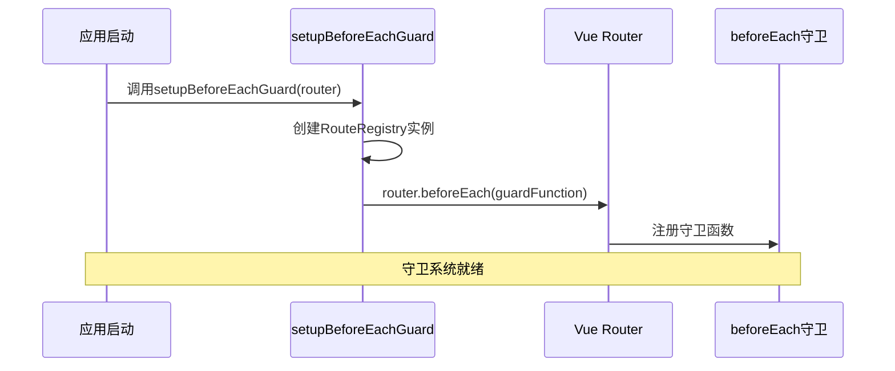
```mermaid
sequenceDiagram
participant App as 应用启动
participant Setup as setupBeforeEachGuard
participant Router as Vue Router
participant Guard as beforeEach守卫
App->>Setup : 调用setupBeforeEachGuard(router)
Setup->>Setup : 创建RouteRegistry实例
Setup->>Router : router.beforeEach(guardFunction)
Router->>Guard : 注册守卫函数
Note over App,Guard : 守卫系统就绪
```

**图表来源**
- [beforeEach.ts](file://src/router/guards/beforeEach.ts#L82-L101)

### handleRouteGuard 函数执行流程

`handleRouteGuard` 是守卫的核心处理函数，按照严格的顺序执行各个检查步骤。

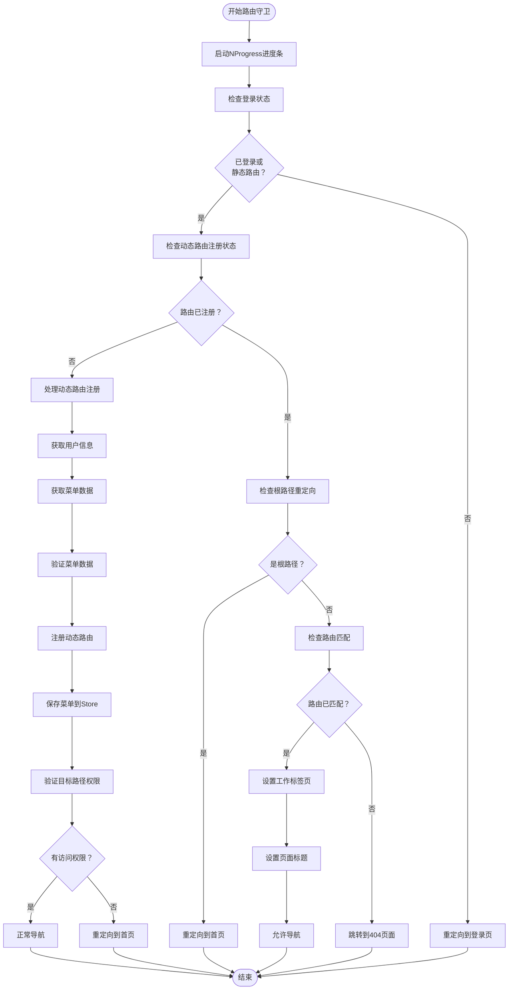
```mermaid
flowchart TD
Start([开始路由守卫]) --> Progress["启动NProgress进度条"]
Progress --> LoginCheck["检查登录状态"]
LoginCheck --> IsLoggedIn{"已登录或<br/>静态路由？"}
IsLoggedIn --> |是| DynamicCheck["检查动态路由注册状态"]
IsLoggedIn --> |否| RedirectLogin["重定向到登录页"]
DynamicCheck --> IsRegistered{"路由已注册？"}
IsRegistered --> |否| RegisterRoutes["处理动态路由注册"]
IsRegistered --> |是| RootCheck["检查根路径重定向"]
RegisterRoutes --> FetchUser["获取用户信息"]
FetchUser --> GetMenu["获取菜单数据"]
GetMenu --> ValidateMenu["验证菜单数据"]
ValidateMenu --> RegisterMenu["注册动态路由"]
RegisterMenu --> SaveMenu["保存菜单到Store"]
SaveMenu --> ValidatePath["验证目标路径权限"]
ValidatePath --> HasPermission{"有访问权限？"}
HasPermission --> |是| Navigate["正常导航"]
HasPermission --> |否| RedirectHome["重定向到首页"]
RootCheck --> IsRoot{"是根路径？"}
IsRoot --> |是| RedirectHome2["重定向到首页"]
IsRoot --> |否| MatchCheck["检查路由匹配"]
MatchCheck --> IsMatched{"路由已匹配？"}
IsMatched --> |是| SetWorktab["设置工作标签页"]
SetWorktab --> SetTitle["设置页面标题"]
SetTitle --> AllowNavigate["允许导航"]
IsMatched --> |否| NotFound["跳转到404页面"]
RedirectLogin --> End([结束])
RedirectHome --> End
RedirectHome2 --> End
Navigate --> End
AllowNavigate --> End
NotFound --> End
```

**图表来源**
- [beforeEach.ts](file://src/router/guards/beforeEach.ts#L118-L157)

**章节来源**
- [beforeEach.ts](file://src/router/guards/beforeEach.ts#L82-L157)

## 登录状态验证机制

### handleLoginStatus 函数

登录状态验证是路由守卫的第一道防线，确保只有已登录用户才能访问受保护的路由。

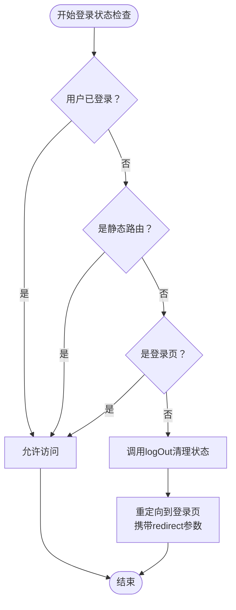
```mermaid
flowchart TD
Start([开始登录状态检查]) --> IsLoggedIn{"用户已登录？"}
IsLoggedIn --> |是| AllowAccess["允许访问"]
IsLoggedIn --> |否| IsStaticRoute{"是静态路由？"}
IsStaticRoute --> |是| AllowAccess
IsStaticRoute --> |否| IsLoginPage{"是登录页？"}
IsLoginPage --> |是| AllowAccess
IsLoginPage --> |否| Logout["调用logOut清理状态"]
Logout --> Redirect["重定向到登录页<br/>携带redirect参数"]
AllowAccess --> End([结束])
Redirect --> End
```

**图表来源**
- [beforeEach.ts](file://src/router/guards/beforeEach.ts#L164-L180)

### 静态路由识别机制

系统通过 `isStaticRoute` 函数识别哪些路由不需要权限验证：

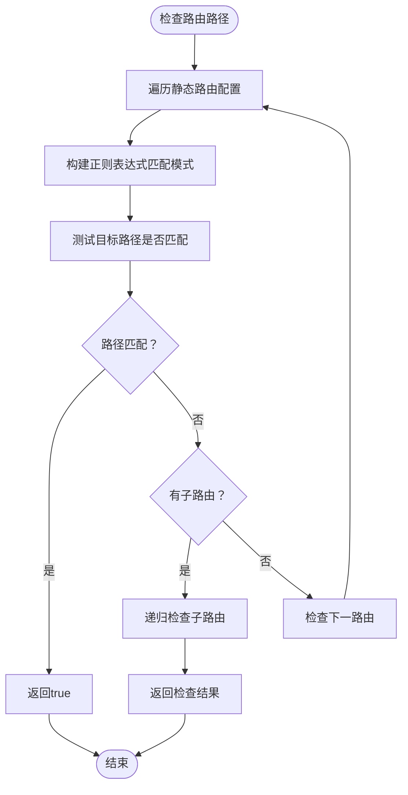
```mermaid
flowchart TD
Start([检查路由路径]) --> IterateRoutes["遍历静态路由配置"]
IterateRoutes --> CheckPattern["构建正则表达式匹配模式"]
CheckPattern --> TestRegex["测试目标路径是否匹配"]
TestRegex --> IsMatch{"路径匹配？"}
IsMatch --> |是| ReturnTrue["返回true"]
IsMatch --> |否| HasChildren{"有子路由？"}
HasChildren --> |是| RecursiveCheck["递归检查子路由"]
HasChildren --> |否| NextRoute["检查下一路由"]
RecursiveCheck --> ReturnResult["返回检查结果"]
NextRoute --> IterateRoutes
ReturnTrue --> End([结束])
ReturnResult --> End
```

**图表来源**
- [beforeEach.ts](file://src/router/guards/beforeEach.ts#L183-L205)

**章节来源**
- [beforeEach.ts](file://src/router/guards/beforeEach.ts#L164-L180)
- [beforeEach.ts](file://src/router/guards/beforeEach.ts#L183-L205)

## 动态路由注册流程

### handleDynamicRoutes 函数详解

动态路由注册是路由守卫的核心功能，涉及用户信息获取、菜单数据处理、路由注册等多个步骤。

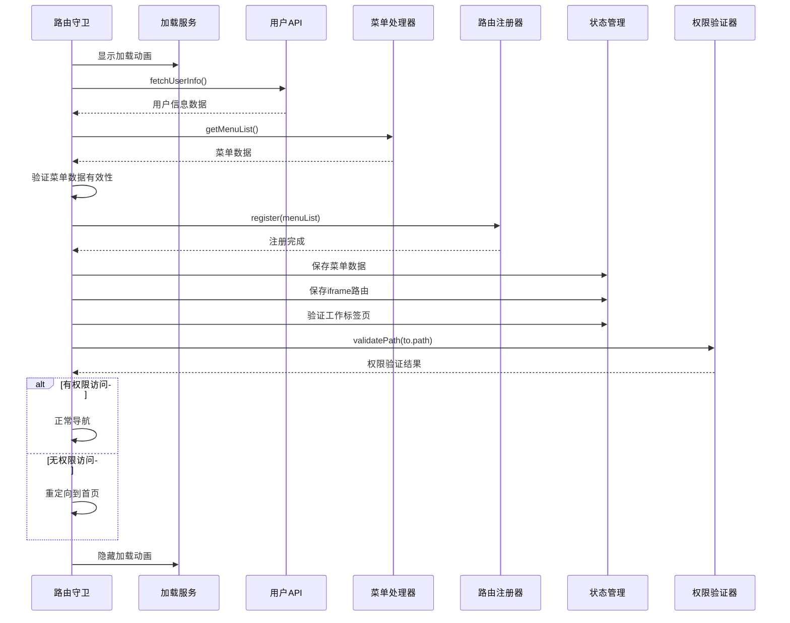
```mermaid
sequenceDiagram
participant Guard as 路由守卫
participant Loading as 加载服务
participant UserAPI as 用户API
participant MenuProc as 菜单处理器
participant Registry as 路由注册器
participant Store as 状态管理
participant Validator as 权限验证器
Guard->>Loading : 显示加载动画
Guard->>UserAPI : fetchUserInfo()
UserAPI-->>Guard : 用户信息数据
Guard->>MenuProc : getMenuList()
MenuProc-->>Guard : 菜单数据
Guard->>Guard : 验证菜单数据有效性
Guard->>Registry : register(menuList)
Registry-->>Guard : 注册完成
Guard->>Store : 保存菜单数据
Guard->>Store : 保存iframe路由
Guard->>Store : 验证工作标签页
Guard->>Validator : validatePath(to.path)
Validator-->>Guard : 权限验证结果
alt 有权限访问
Guard->>Guard : 正常导航
else 无权限访问
Guard->>Guard : 重定向到首页
end
Guard->>Loading : 隐藏加载动画
```

**图表来源**
- [beforeEach.ts](file://src/router/guards/beforeEach.ts#L209-L296)

### 用户信息获取策略

系统采用每次动态路由注册时重新获取用户信息的策略，确保数据的实时性和准确性：

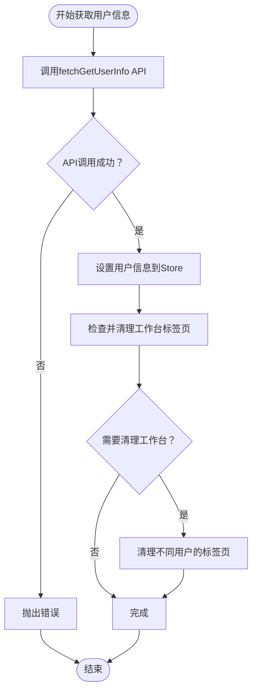
```mermaid
flowchart TD
Start([开始获取用户信息]) --> CallAPI["调用fetchGetUserInfo API"]
CallAPI --> Success{"API调用成功？"}
Success --> |是| SetStore["设置用户信息到Store"]
Success --> |否| Error["抛出错误"]
SetStore --> CheckWorktab["检查并清理工作台标签页"]
CheckWorktab --> ClearLogic{"需要清理工作台？"}
ClearLogic --> |是| ClearTabs["清理不同用户的标签页"]
ClearLogic --> |否| Complete["完成"]
ClearTabs --> Complete
Error --> End([结束])
Complete --> End
```

**图表来源**
- [beforeEach.ts](file://src/router/guards/beforeEach.ts#L299-L314)

**章节来源**
- [beforeEach.ts](file://src/router/guards/beforeEach.ts#L209-L296)
- [beforeEach.ts](file://src/router/guards/beforeEach.ts#L299-L314)

## 加载状态管理

### pendingLoading 状态机制

系统通过 `pendingLoading` 变量跟踪加载状态，确保加载动画的正确显示和隐藏。

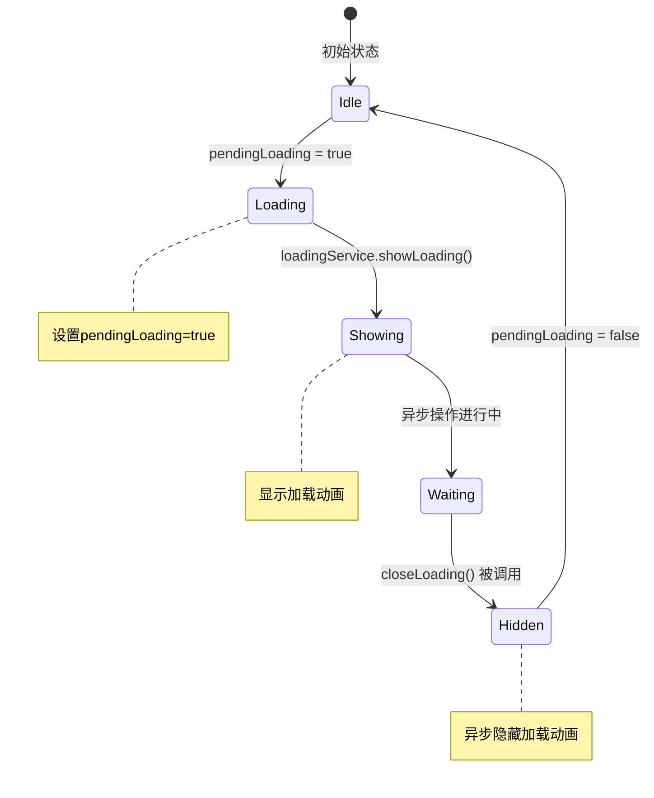
```mermaid
stateDiagram-v2
[*] --> Idle : 初始状态
Idle --> Loading : pendingLoading = true
Loading --> Showing : loadingService.showLoading()
Showing --> Waiting : 异步操作进行中
Waiting --> Hidden : closeLoading() 被调用
Hidden --> Idle : pendingLoading = false
note right of Loading : 设置pendingLoading=true
note right of Showing : 显示加载动画
note right of Hidden : 异步隐藏加载动画
```

**图表来源**
- [beforeEach.ts](file://src/router/guards/beforeEach.ts#L62-L113)

### closeLoading 函数实现

`closeLoading` 函数采用异步处理逻辑，确保加载动画的平滑过渡：

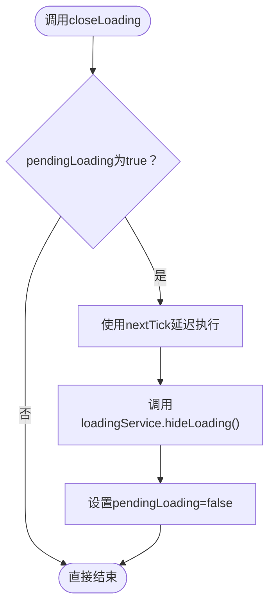
```mermaid
flowchart TD
Start([调用closeLoading]) --> CheckPending{"pendingLoading为true？"}
CheckPending --> |否| End([直接结束])
CheckPending --> |是| NextTick["使用nextTick延迟执行"]
NextTick --> HideLoading["调用loadingService.hideLoading()"]
HideLoading --> ResetFlag["设置pendingLoading=false"]
ResetFlag --> End
```

**图表来源**
- [beforeEach.ts](file://src/router/guards/beforeEach.ts#L106-L113)

### loadingService 服务

加载动画服务提供了完整的加载状态管理功能：

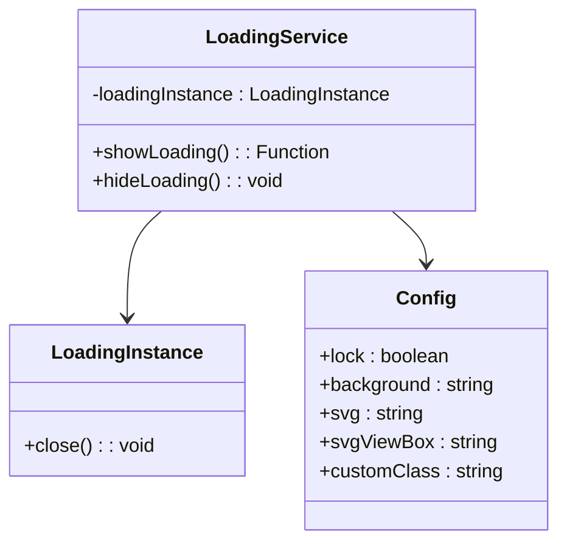
```mermaid
classDiagram
class LoadingService {
-loadingInstance : LoadingInstance
+showLoading() : Function
+hideLoading() : void
}
class LoadingInstance {
+close() : void
}
class Config {
+lock : boolean
+background : string
+svg : string
+svgViewBox : string
+customClass : string
}
LoadingService --> LoadingInstance
LoadingService --> Config
```

**图表来源**
- [loading.ts](file://src/utils/ui/loading.ts#L58-L84)

**章节来源**
- [beforeEach.ts](file://src/router/guards/beforeEach.ts#L62-L113)
- [loading.ts](file://src/utils/ui/loading.ts#L58-L84)

## 错误处理与异常跳转

### 异常处理机制

系统实现了完善的异常处理机制，能够根据不同类型的错误采取相应的处理策略。

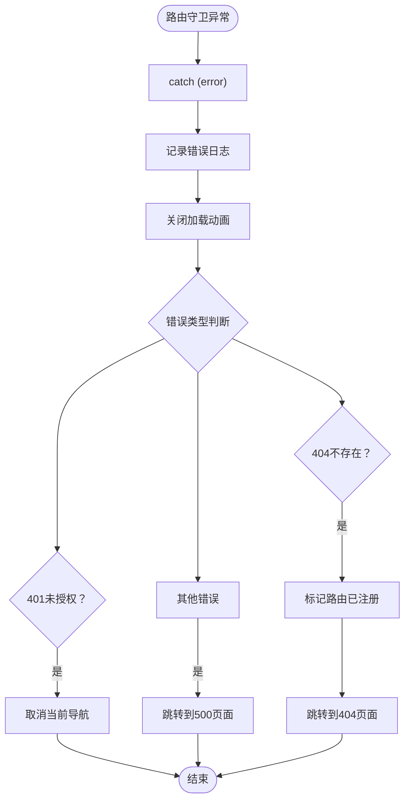
```mermaid
flowchart TD
Start([路由守卫异常]) --> CatchError["catch (error)"]
CatchError --> LogError["记录错误日志"]
LogError --> CloseLoading["关闭加载动画"]
CloseLoading --> ErrorType{"错误类型判断"}
ErrorType --> IsUnauthorized{"401未授权？"}
ErrorType --> IsNotFound{"404不存在？"}
ErrorType --> OtherError["其他错误"]
IsUnauthorized --> |是| CancelNavigation["取消当前导航"]
IsNotFound --> |是| MarkRegistered["标记路由已注册"]
OtherError --> |是| Exception500["跳转到500页面"]
CancelNavigation --> End([结束])
MarkRegistered --> Exception404["跳转到404页面"]
Exception500 --> End
Exception404 --> End
```

**图表来源**
- [beforeEach.ts](file://src/router/guards/beforeEach.ts#L92-L98)

### 错误类型判断函数

系统提供了专门的错误类型判断函数：

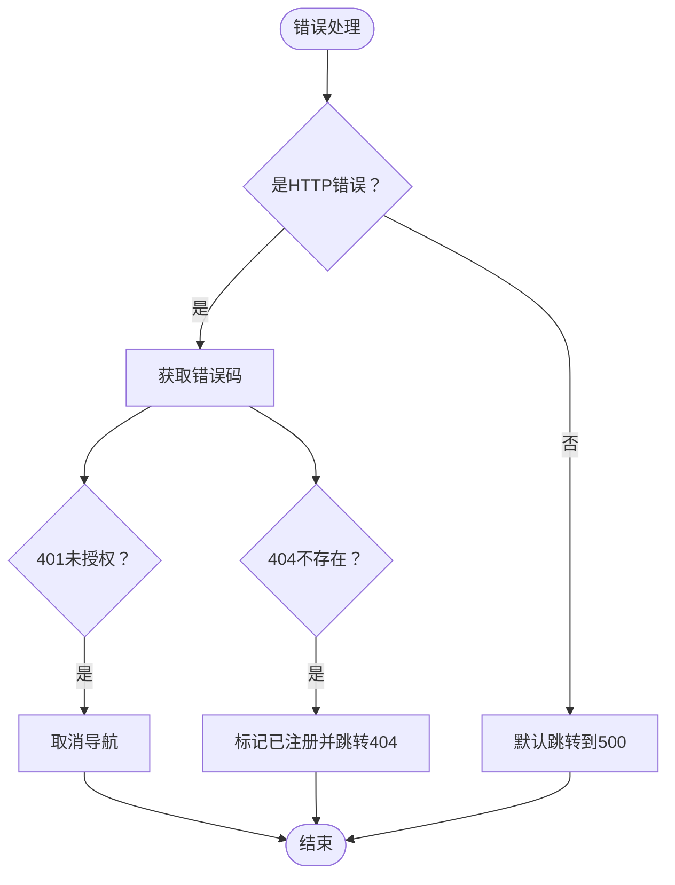
```mermaid
flowchart TD
Start([错误处理]) --> IsHttpError{"是HTTP错误？"}
IsHttpError --> |否| DefaultException["默认跳转到500"]
IsHttpError --> |是| ErrorCode["获取错误码"]
ErrorCode --> Is401{"401未授权？"}
ErrorCode --> Is404{"404不存在？"}
Is401 --> |是| UnauthorizedAction["取消导航"]
Is404 --> |是| NotFoundAction["标记已注册并跳转404"]
UnauthorizedAction --> End([结束])
NotFoundAction --> End
DefaultException --> End
```

**图表来源**
- [beforeEach.ts](file://src/router/guards/beforeEach.ts#L349-L360)

### 异常页面跳转

系统支持多种异常页面的跳转：

| 异常类型 | 页面名称 | 跳转条件 |
|---------|---------|---------|
| 401未授权 | Exception500 | 用户认证失败 |
| 404不存在 | Exception404 | 路由不存在或接口不存在 |
| 其他错误 | Exception500 | 系统内部错误 |

**章节来源**
- [beforeEach.ts](file://src/router/guards/beforeEach.ts#L92-L98)
- [beforeEach.ts](file://src/router/guards/beforeEach.ts#L349-L360)

## 实际应用场景

### 场景一：未登录用户访问受保护路由

当未登录用户尝试访问需要权限的路由时，系统会执行以下流程：

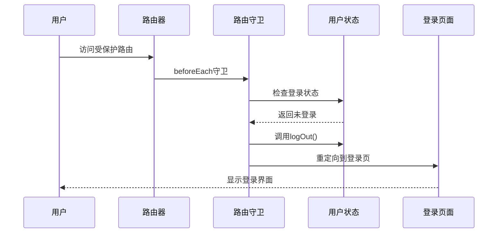
```mermaid
sequenceDiagram
participant User as 用户
participant Router as 路由器
participant Guard as 路由守卫
participant Store as 用户状态
participant Login as 登录页面
User->>Router : 访问受保护路由
Router->>Guard : beforeEach守卫
Guard->>Store : 检查登录状态
Store-->>Guard : 返回未登录
Guard->>Store : 调用logOut()
Guard->>Login : 重定向到登录页
Login-->>User : 显示登录界面
```

**图表来源**
- [beforeEach.ts](file://src/router/guards/beforeEach.ts#L164-L180)

### 场景二：首次访问获取动态路由

新用户首次访问系统时，需要获取动态路由：

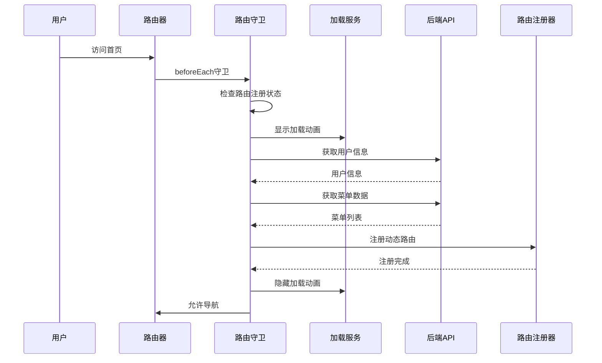
```mermaid
sequenceDiagram
participant User as 用户
participant Router as 路由器
participant Guard as 路由守卫
participant Loading as 加载服务
participant API as 后端API
participant Registry as 路由注册器
User->>Router : 访问首页
Router->>Guard : beforeEach守卫
Guard->>Guard : 检查路由注册状态
Guard->>Loading : 显示加载动画
Guard->>API : 获取用户信息
API-->>Guard : 用户信息
Guard->>API : 获取菜单数据
API-->>Guard : 菜单列表
Guard->>Registry : 注册动态路由
Registry-->>Guard : 注册完成
Guard->>Loading : 隐藏加载动画
Guard->>Router : 允许导航
```

**图表来源**
- [beforeEach.ts](file://src/router/guards/beforeEach.ts#L209-L296)

### 场景三：权限变更后的路由访问

当用户权限发生变化时，系统会重新获取路由并验证访问权限：

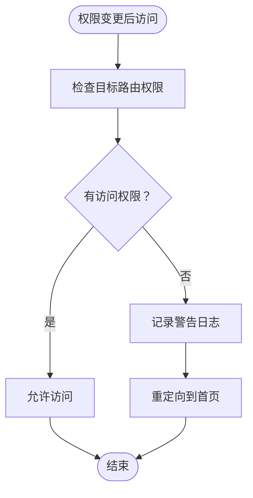
```mermaid
flowchart TD
Start([权限变更后访问]) --> CheckPermission["检查目标路由权限"]
CheckPermission --> HasPermission{"有访问权限？"}
HasPermission --> |是| AllowAccess["允许访问"]
HasPermission --> |否| LogWarning["记录警告日志"]
LogWarning --> RedirectHome["重定向到首页"]
AllowAccess --> End([结束])
RedirectHome --> End
```

**图表来源**
- [beforeEach.ts](file://src/router/guards/beforeEach.ts#L246-L274)

**章节来源**
- [beforeEach.ts](file://src/router/guards/beforeEach.ts#L164-L180)
- [beforeEach.ts](file://src/router/guards/beforeEach.ts#L209-L296)

## 性能优化考虑

### 路由注册状态缓存

系统通过 `routeRegistry.registered` 状态避免重复注册路由，提高性能：

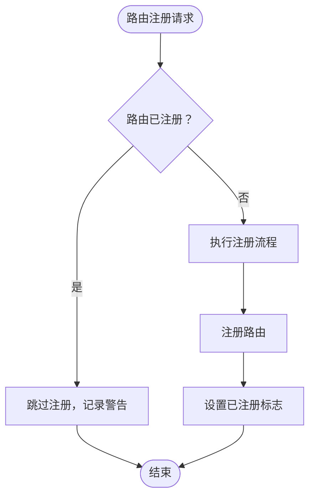
```mermaid
flowchart TD
Start([路由注册请求]) --> CheckRegistered{"路由已注册？"}
CheckRegistered --> |是| SkipRegistration["跳过注册，记录警告"]
CheckRegistered --> |否| PerformRegistration["执行注册流程"]
SkipRegistration --> End([结束])
PerformRegistration --> RegisterRoutes["注册路由"]
RegisterRoutes --> SetFlag["设置已注册标志"]
SetFlag --> End
```

**图表来源**
- [RouteRegistry.ts](file://src/router/core/RouteRegistry.ts#L34-L38)

### 异步加载优化

系统采用异步加载策略，避免阻塞路由导航：

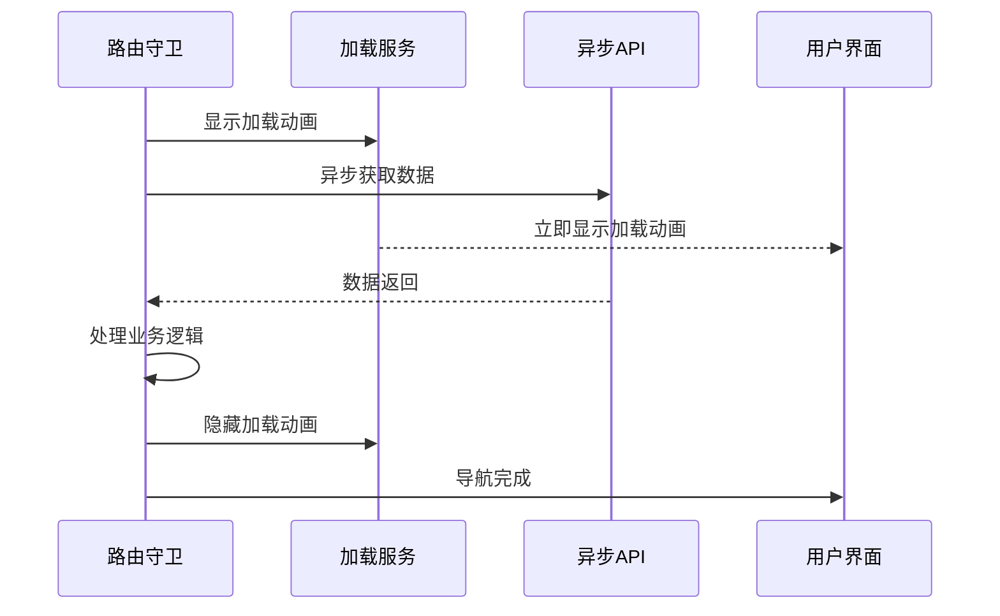
```mermaid
sequenceDiagram
participant Guard as 路由守卫
participant Loading as 加载服务
participant API as 异步API
participant UI as 用户界面
Guard->>Loading : 显示加载动画
Guard->>API : 异步获取数据
Loading-->>UI : 立即显示加载动画
API-->>Guard : 数据返回
Guard->>Guard : 处理业务逻辑
Guard->>Loading : 隐藏加载动画
Guard->>UI : 导航完成
```

### 内存管理优化

系统通过 `resetRouterState` 函数及时清理路由相关资源：

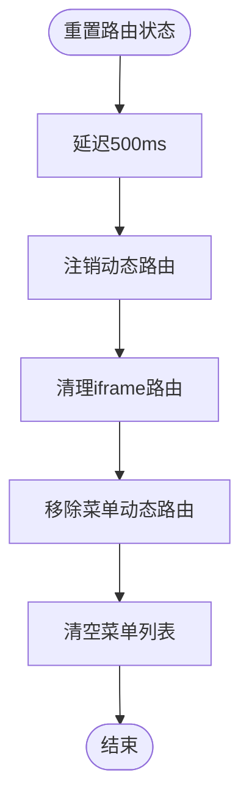
```mermaid
flowchart TD
Start([重置路由状态]) --> Delay["延迟500ms"]
Delay --> UnregisterRoutes["注销动态路由"]
UnregisterRoutes --> ClearIframe["清理iframe路由"]
ClearIframe --> RemoveMenu["移除菜单动态路由"]
RemoveMenu --> ClearMenu["清空菜单列表"]
ClearMenu --> End([结束])
```

**图表来源**
- [beforeEach.ts](file://src/router/guards/beforeEach.ts#L319-L327)

**章节来源**
- [RouteRegistry.ts](file://src/router/core/RouteRegistry.ts#L34-L38)
- [beforeEach.ts](file://src/router/guards/beforeEach.ts#L319-L327)

## 总结

Art Design Pro 的路由守卫机制是一个设计精良、功能完备的全局路由管理系统。它通过模块化的架构设计，实现了登录状态验证、动态路由注册、权限控制、加载状态管理等核心功能。

### 主要优势

1. **完整性**：覆盖了路由守卫的所有关键场景和需求
2. **可靠性**：完善的错误处理和异常跳转机制
3. **性能**：合理的异步处理和状态缓存策略
4. **可维护性**：清晰的模块划分和职责分离
5. **用户体验**：流畅的加载动画和进度条集成

### 最佳实践建议

1. **合理使用静态路由**：将不需要权限验证的路由配置为静态路由
2. **优化加载体验**：在复杂操作中始终显示加载动画
3. **错误处理**：确保所有异常都有相应的处理逻辑
4. **性能监控**：定期检查路由注册和权限验证的性能表现
5. **状态管理**：合理使用状态管理工具，避免内存泄漏

这个路由守卫系统为现代单页应用提供了强大的路由管理能力，是构建复杂业务系统的重要基础设施。