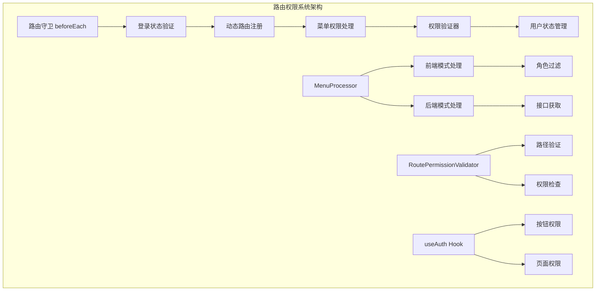
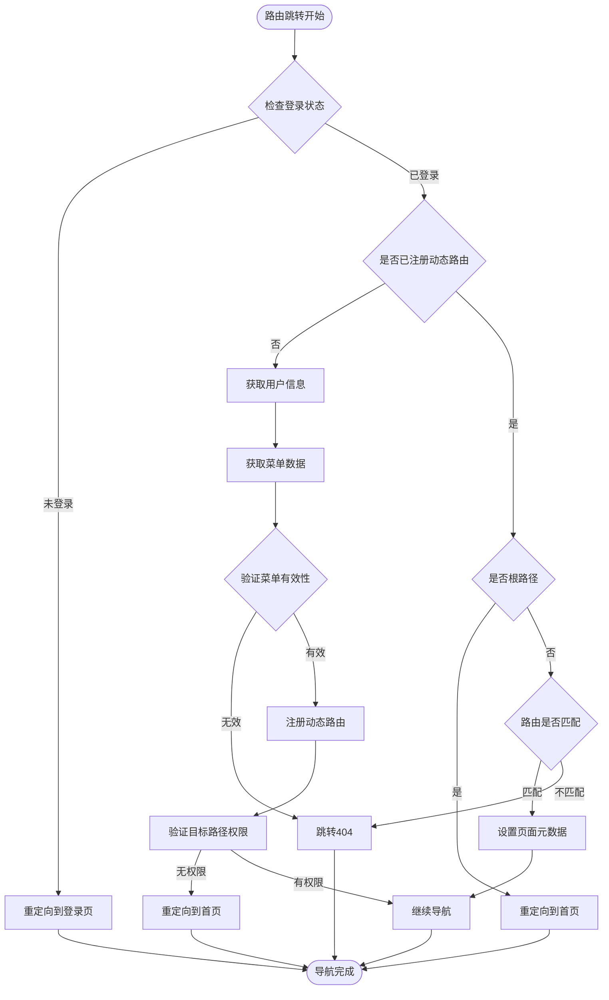
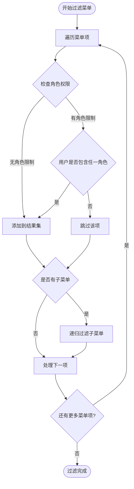
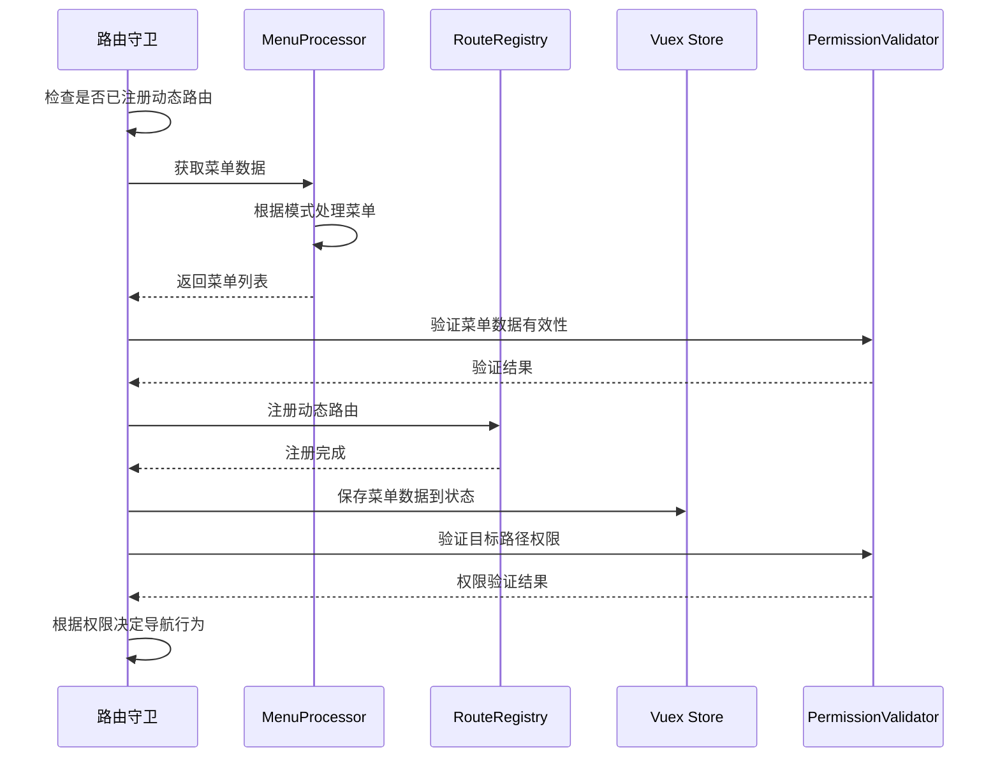
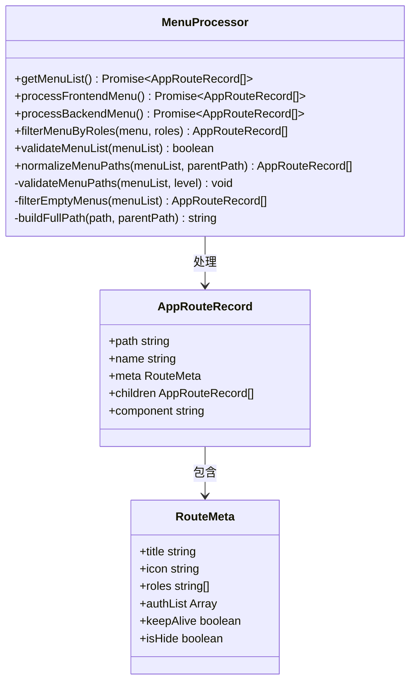
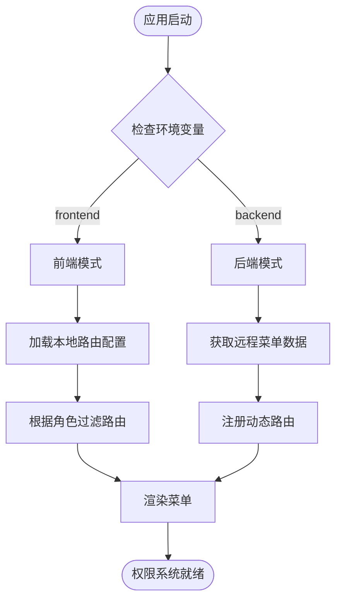

# 路由权限控制详细文档

<cite>
**本文档引用的文件**
- [beforeEach.ts](file://src/router/guards/beforeEach.ts)
- [MenuProcessor.ts](file://src/router/core/MenuProcessor.ts)
- [RoutePermissionValidator.ts](file://src/router/core/RoutePermissionValidator.ts)
- [useAuth.ts](file://src/hooks/core/useAuth.ts)
- [useAppMode.ts](file://src/hooks/core/useAppMode.ts)
- [user.ts](file://src/store/modules/user.ts)
- [auth.ts](file://src/directives/core/auth.ts)
- [index.ts](file://src/types/router/index.ts)
- [dashboard.ts](file://src/router/modules/dashboard.ts)
- [system.ts](file://src/router/modules/system.ts)
- [examples.ts](file://src/router/modules/examples.ts)
- [page-visibility/index.vue](file://src/views/examples/permission/page-visibility/index.vue)
- [button-auth/index.vue](file://src/views/examples/permission/button-auth/index.vue)
</cite>

## 目录
1. [概述](#概述)
2. [系统架构](#系统架构)
3. [核心组件分析](#核心组件分析)
4. [路由守卫机制](#路由守卫机制)
5. [菜单权限处理](#菜单权限处理)
6. [权限验证流程](#权限验证流程)
7. [前端与后端模式](#前端与后端模式)
8. [权限配置示例](#权限配置示例)
9. [最佳实践](#最佳实践)
10. [安全考虑](#安全考虑)
11. [常见问题解决](#常见问题解决)
12. [总结](#总结)

## 概述

Art Design Pro 采用基于角色的路由权限控制系统，提供完整的前端路由权限验证机制。系统支持两种权限控制模式：前端模式和后端模式，能够根据用户角色动态过滤菜单和路由，确保用户只能访问授权的页面资源。

### 主要特性

- **双重权限模式**：支持前端路由配置权限和后端接口权限控制
- **动态路由注册**：根据用户权限动态加载和注册路由
- **菜单权限过滤**：基于角色权限过滤显示的菜单项
- **多层次权限验证**：路由级别、页面级别、按钮级别的权限控制
- **智能缓存管理**：防止权限缓存失效和重复请求
- **安全防护机制**：防止路由劫持和权限绕过

## 系统架构



**图表来源**
- [beforeEach.ts](file://src/router/guards/beforeEach.ts#L82-L101)
- [MenuProcessor.ts](file://src/router/core/MenuProcessor.ts#L18-L37)
- [RoutePermissionValidator.ts](file://src/router/core/RoutePermissionValidator.ts#L28-L46)

## 核心组件分析

### 路由守卫 (beforeEach.ts)

路由守卫是整个权限系统的核心入口，负责在路由跳转前执行权限验证和动态路由注册。

#### 主要功能模块

1. **登录状态检查**：验证用户是否已登录
2. **动态路由注册**：首次访问时获取用户信息和菜单数据
3. **权限验证**：检查目标路由的访问权限
4. **错误处理**：处理各种异常情况并重定向

#### 核心流程图



**图表来源**
- [beforeEach.ts](file://src/router/guards/beforeEach.ts#L118-L157)

**章节来源**
- [beforeEach.ts](file://src/router/guards/beforeEach.ts#L1-L361)

### 菜单处理器 (MenuProcessor.ts)

MenuProcessor 负责菜单数据的获取、过滤和处理，是权限系统的重要组成部分。

#### 核心方法分析

1. **getMenuList()**：获取菜单数据，支持前端和后端两种模式
2. **filterMenuByRoles()**：根据用户角色过滤菜单项
3. **validateMenuList()**：验证菜单数据的有效性
4. **normalizeMenuPaths()**：规范化菜单路径

#### 角色过滤算法



**图表来源**
- [MenuProcessor.ts](file://src/router/core/MenuProcessor.ts#L67-L81)

**章节来源**
- [MenuProcessor.ts](file://src/router/core/MenuProcessor.ts#L1-L242)

### 权限验证器 (RoutePermissionValidator.ts)

RoutePermissionValidator 提供路由权限验证功能，支持精确匹配和前缀匹配。

#### 核心算法

1. **路径集合构建**：将菜单路径扁平化处理
2. **权限检查**：支持精确匹配和前缀匹配
3. **路径验证**：验证目标路径是否在权限范围内

**章节来源**
- [RoutePermissionValidator.ts](file://src/router/core/RoutePermissionValidator.ts#L1-L120)

## 路由守卫机制

### 登录状态验证

路由守卫首先检查用户的登录状态，确保只有已登录用户才能访问受保护的路由。

#### 验证规则

1. **已登录用户**：直接放行
2. **访问登录页**：直接放行
3. **静态路由**：直接放行
4. **其他情况**：重定向到登录页并携带当前路径作为重定向参数

### 动态路由注册流程



**图表来源**
- [beforeEach.ts](file://src/router/guards/beforeEach.ts#L210-L274)

**章节来源**
- [beforeEach.ts](file://src/router/guards/beforeEach.ts#L118-L274)

## 菜单权限处理

### 前端模式 vs 后端模式

系统支持两种权限控制模式，适应不同的应用场景需求。

#### 前端模式特点

- **权限配置**：在路由配置文件中定义 `meta.roles` 字段
- **数据来源**：使用本地预定义的路由配置
- **优势**：开发效率高，适合小型项目
- **劣势**：权限不够灵活，需要重新打包部署

#### 后端模式特点

- **权限配置**：通过后端接口返回菜单数据
- **数据来源**：实时从服务器获取菜单配置
- **优势**：权限灵活，支持动态调整
- **劣势**：需要额外的接口开发

### MenuProcessor 实现机制



**图表来源**
- [MenuProcessor.ts](file://src/router/core/MenuProcessor.ts#L18-L81)
- [index.ts](file://src/types/router/index.ts#L29-L80)

**章节来源**
- [MenuProcessor.ts](file://src/router/core/MenuProcessor.ts#L22-L61)
- [useAppMode.ts](file://src/hooks/core/useAppMode.ts#L20-L45)

## 权限验证流程

### 页面级权限控制

页面级权限控制通过路由配置中的 `meta.roles` 字段实现，支持基于角色的访问控制。

#### 权限验证步骤

1. **提取角色信息**：从用户状态中获取用户角色列表
2. **解析路由权限**：读取目标路由的 `meta.roles` 配置
3. **权限匹配**：检查用户角色是否包含路由要求的角色
4. **访问决策**：根据匹配结果决定是否允许访问

### 按钮级权限控制

系统提供两种按钮权限控制方式：基于角色的前端控制和基于权限标识的后端控制。

#### 前端模式按钮权限

```typescript
// 用户状态中的按钮权限列表
const buttons = ['add', 'edit', 'delete', 'export']

// 权限检查
function hasAuth(auth: string): boolean {
  return frontendAuthList.includes(auth)
}
```

#### 后端模式按钮权限

```typescript
// 路由配置中的权限列表
meta: {
  authList: [
    { title: '新增', authMark: 'add' },
    { title: '编辑', authMark: 'edit' },
    { title: '删除', authMark: 'delete' }
  ]
}

// 权限检查
function hasAuth(auth: string): boolean {
  return backendAuthList.some(item => item.authMark === auth)
}
```

**章节来源**
- [useAuth.ts](file://src/hooks/core/useAuth.ts#L1-L75)
- [auth.ts](file://src/directives/core/auth.ts#L1-L69)

## 前端与后端模式

### 模式切换机制

系统通过环境变量 `VITE_ACCESS_MODE` 自动识别当前运行模式。



**图表来源**
- [useAppMode.ts](file://src/hooks/core/useAppMode.ts#L20-L45)

### 模式对比表

| 特性 | 前端模式 | 后端模式 |
|------|----------|----------|
| 权限来源 | 本地路由配置 | 后端接口返回 |
| 配置方式 | 修改路由文件 | 后端管理系统 |
| 更新频率 | 需要重新打包 | 实时生效 |
| 安全性 | 较低，可被逆向 | 较高，服务端控制 |
| 开发成本 | 低，前端配置 | 高，需要接口开发 |
| 适用场景 | 小型项目、演示系统 | 企业级应用 |

**章节来源**
- [useAppMode.ts](file://src/hooks/core/useAppMode.ts#L1-L46)

## 权限配置示例

### 路由权限配置

#### 基础路由配置

```typescript
// 系统管理路由配置示例
export const systemRoutes: AppRouteRecord = {
  path: '/system',
  name: 'System',
  component: '/index/index',
  meta: {
    title: 'menus.system.title',
    icon: 'ri:user-3-line',
    roles: ['R_SUPER', 'R_ADMIN']  // 仅超级管理员和管理员可访问
  },
  children: [
    {
      path: 'user',
      name: 'User',
      component: '/system/user',
      meta: {
        title: 'menus.system.user',
        icon: 'ri:user-line',
        keepAlive: true,
        roles: ['R_SUPER', 'R_ADMIN']  // 继承父级角色权限
      }
    }
  ]
}
```

#### 按钮权限配置

```typescript
// 按钮权限配置示例
export const systemRoutes: AppRouteRecord = {
  path: '/system/menu',
  name: 'Menus',
  component: '/system/menu',
  meta: {
    title: 'menus.system.menu',
    icon: 'ri:menu-line',
    keepAlive: true,
    roles: ['R_SUPER'],
    authList: [
      { title: '新增', authMark: 'add' },
      { title: '编辑', authMark: 'edit' },
      { title: '删除', authMark: 'delete' }
    ]
  }
}
```

### 权限验证示例

#### 页面级权限验证

```vue
<template>
  <div>
    <!-- 页面级权限控制 -->
    <div v-if="hasRole(['R_SUPER'])">
      <h2>超级管理员可见内容</h2>
    </div>
    
    <!-- 按钮级权限控制 -->
    <el-button v-if="hasAuth('add')" type="primary">新增</el-button>
    <el-button v-if="hasAuth('edit')" type="warning">编辑</el-button>
    <el-button v-if="hasAuth('delete')" type="danger">删除</el-button>
  </div>
</template>

<script setup>
import { useAuth } from '@/hooks/core/useAuth'

const { hasAuth, hasRole } = useAuth()

// 角色权限检查
function hasRole(requiredRoles: string[]): boolean {
  const userRoles = userStore.info?.roles || []
  return requiredRoles.some(role => userRoles.includes(role))
}
</script>
```

**章节来源**
- [system.ts](file://src/router/modules/system.ts#L1-L60)
- [dashboard.ts](file://src/router/modules/dashboard.ts#L1-L46)
- [page-visibility/index.vue](file://src/views/examples/permission/page-visibility/index.vue#L39-L70)

## 最佳实践

### 权限设计原则

1. **最小权限原则**：用户只获得完成任务所需的最小权限
2. **职责分离**：不同角色承担不同的职责，权限相互独立
3. **权限继承**：合理利用父子路由的权限继承关系
4. **权限分层**：建立清晰的权限层级结构

### 路由配置规范

```typescript
// 推荐的路由配置格式
const routeConfig: AppRouteRecord = {
  path: '/business/module',
  name: 'ModuleName',
  component: '/business/module/index',
  meta: {
    // 必填：菜单标题
    title: '模块名称',
    
    // 可选：菜单图标
    icon: 'ri:business-icon',
    
    // 可选：角色权限
    roles: ['R_ADMIN', 'R_USER'],
    
    // 可选：按钮权限
    authList: [
      { title: '新增', authMark: 'add' },
      { title: '编辑', authMark: 'edit' },
      { title: '删除', authMark: 'delete' }
    ],
    
    // 可选：页面配置
    keepAlive: true,  // 是否缓存页面
    isHide: false,    // 是否在菜单中隐藏
    isHideTab: false, // 是否在标签页中隐藏
    fixedTab: false   // 是否固定标签页
  }
}
```

### 权限验证最佳实践

1. **多层验证**：在路由守卫、页面组件、按钮指令等多个层次进行权限验证
2. **及时更新**：用户权限变更时及时更新相关状态
3. **错误处理**：妥善处理权限验证失败的情况
4. **用户体验**：提供友好的权限提示信息

## 安全考虑

### 防护措施

1. **服务端验证**：前端权限控制只是辅助手段，必须在服务端进行严格的权限验证
2. **令牌安全**：妥善保管访问令牌，防止令牌泄露
3. **权限缓存**：避免过度依赖客户端缓存，定期刷新权限信息
4. **路由劫持**：防止恶意修改路由配置

### 安全建议

1. **HTTPS传输**：确保所有敏感数据通过HTTPS传输
2. **令牌过期**：设置合理的令牌过期时间
3. **权限审计**：记录用户权限变更和访问日志
4. **输入验证**：对所有用户输入进行严格验证

## 常见问题解决

### 权限缓存失效

**问题描述**：用户权限变更后，前端仍然显示旧的权限状态。

**解决方案**：
1. 在用户权限变更时调用 `fetchUserInfo()` 重新获取用户信息
2. 使用 `userStore.checkAndClearWorktabs()` 清理工作台标签页
3. 调用 `resetRouterState()` 重置路由状态

### 动态权限更新

**问题描述**：用户权限动态变更后，页面权限没有及时更新。

**解决方案**：
```typescript
// 权限更新处理
async function updatePermissions() {
  // 1. 重新获取用户信息
  await fetchUserInfo()
  
  // 2. 重置路由状态
  resetRouterState(0)
  
  // 3. 强制刷新页面
  router.go(0)
}
```

### 路由劫持防护

**问题描述**：恶意用户尝试通过修改URL访问未授权的页面。

**解决方案**：
1. 在路由守卫中进行严格的权限验证
2. 使用 `RoutePermissionValidator` 验证目标路径权限
3. 对于无权限的访问，重定向到首页或错误页面

### 权限配置错误

**问题描述**：菜单路径配置错误导致权限验证失败。

**解决方案**：
1. 使用 `MenuProcessor` 的路径验证功能
2. 检查路径是否以 `/` 开头的合法性
3. 确保路径配置的一致性和正确性

**章节来源**
- [beforeEach.ts](file://src/router/guards/beforeEach.ts#L300-L314)
- [beforeEach.ts](file://src/router/guards/beforeEach.ts#L317-L327)

## 总结

Art Design Pro 的路由权限控制系统提供了完整而灵活的权限管理解决方案。通过双重权限模式、动态路由注册、多层次权限验证等机制，系统能够满足从小型项目到企业级应用的不同需求。

### 系统优势

1. **灵活性**：支持前端和后端两种权限控制模式
2. **完整性**：覆盖路由级别、页面级别、按钮级别的权限控制
3. **安全性**：提供多重防护机制，防止权限绕过
4. **易用性**：提供简洁的API和直观的配置方式

### 发展方向

1. **权限中心**：建立统一的权限管理中心
2. **细粒度控制**：支持更细粒度的权限控制
3. **性能优化**：优化权限验证的性能表现
4. **监控告警**：增加权限访问的监控和告警功能

通过合理使用这套权限控制系统，开发者可以构建安全、可靠、易维护的权限管理功能，为用户提供良好的使用体验。