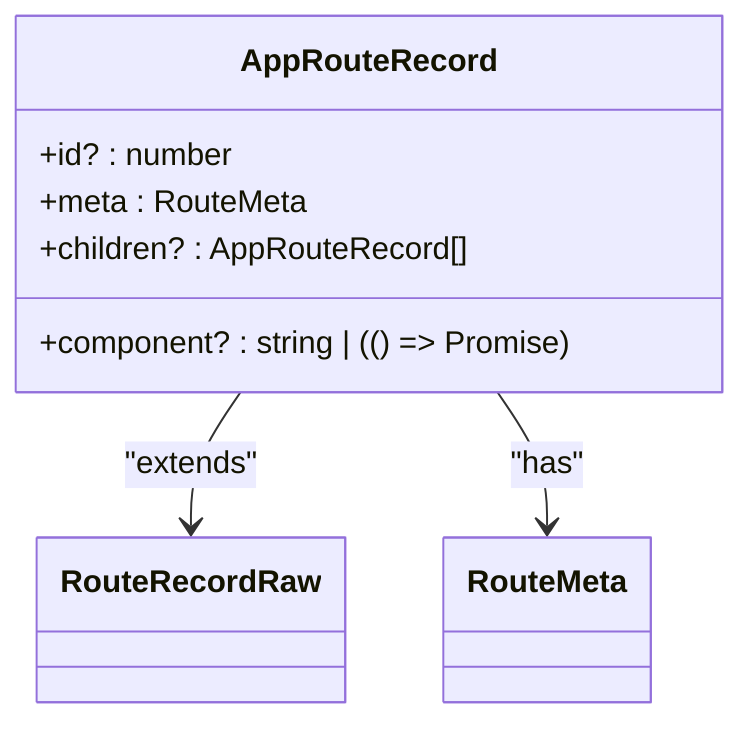
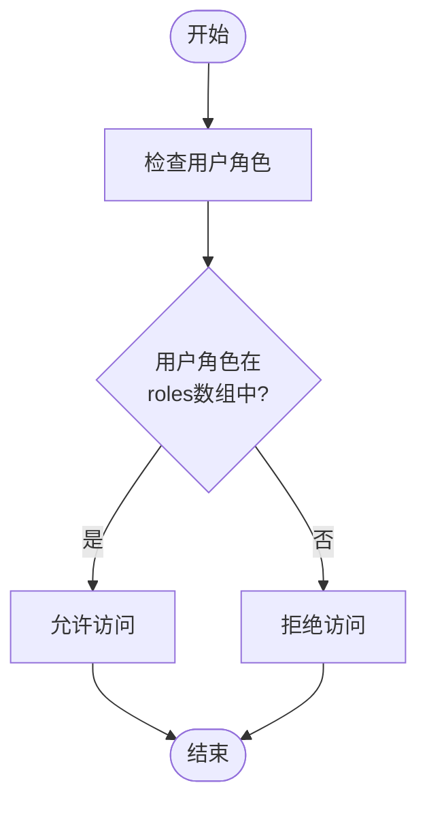
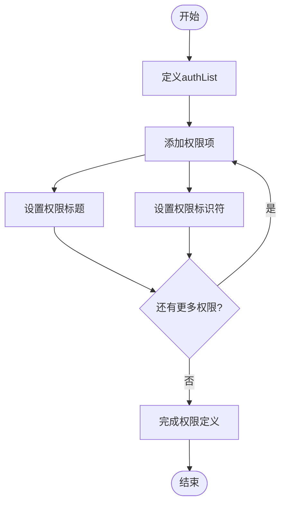
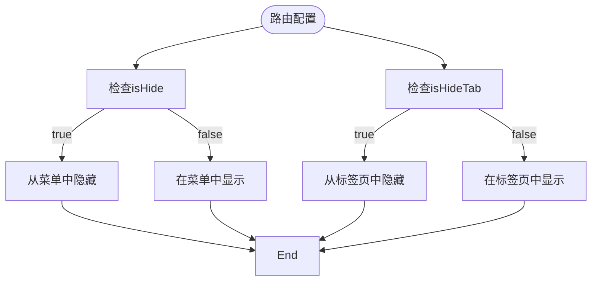
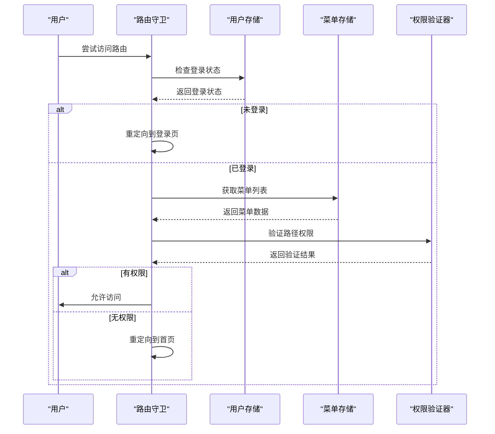
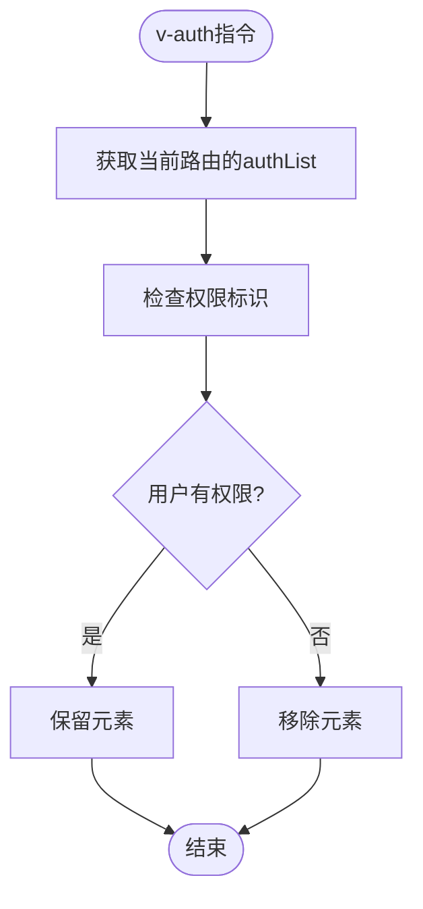
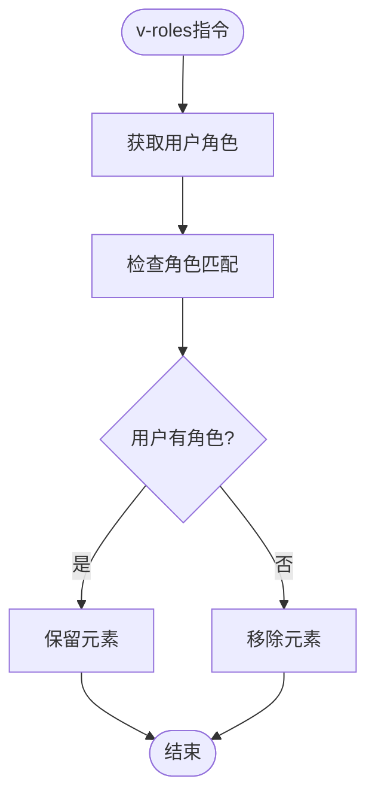

# 路由权限数据模型

<cite>
**本文档引用的文件**
- [index.ts](file://src/types/router/index.ts)
- [beforeEach.ts](file://src/router/guards/beforeEach.ts)
- [RoutePermissionValidator.ts](file://src/router/core/RoutePermissionValidator.ts)
- [auth.ts](file://src/directives/core/auth.ts)
- [roles.ts](file://src/directives/core/roles.ts)
- [user.ts](file://src/store/modules/user.ts)
- [api.d.ts](file://src/types/api/api.d.ts)
- [menu.ts](file://src/store/modules/menu.ts)
- [staticRoutes.ts](file://src/router/routes/staticRoutes.ts)
- [system.ts](file://src/router/modules/system.ts)
- [examples.ts](file://src/router/modules/examples.ts)
- [button-auth/index.vue](file://src/views/examples/permission/button-auth/index.vue)
</cite>

## 目录
1. [简介](#简介)
2. [核心数据模型](#核心数据模型)
3. [权限字段详解](#权限字段详解)
4. [权限验证流程](#权限验证流程)
5. [实际应用示例](#实际应用示例)
6. [权限指令](#权限指令)
7. [类型安全的重要性](#类型安全的重要性)
8. [最佳实践](#最佳实践)

## 简介
本文档全面解析路由权限相关的数据模型定义，详细说明RouteMeta接口中与权限控制相关的关键字段，包括roles数组用于角色权限控制，authList用于操作权限定义，authMark作为权限标识符，isHide和isHideTab控制菜单与标签页的可见性。文档将解释AppRouteRecord类型如何扩展Vue Router的RouteRecordRaw，实现更丰富的元数据支持，并通过实际路由配置示例展示这些字段的使用方式。

**Section sources**
- [index.ts](file://src/types/router/index.ts)

## 核心数据模型

### RouteMeta接口
RouteMeta接口是路由权限系统的核心，它扩展了Vue Router的元数据功能，提供了丰富的权限控制属性。该接口定义了路由的各种配置属性，包括标题、图标、权限控制等。

```mermaid
classDiagram
class RouteMeta {
+title : string
+icon? : string
+showBadge? : boolean
+showTextBadge? : string
+isHide? : boolean
+isHideTab? : boolean
+link? : string
+isIframe? : boolean
+keepAlive? : boolean
+authList? : Array<{title : string, authMark : string}>
+isFirstLevel? : boolean
+roles? : string[]
+fixedTab? : boolean
+activePath? : string
+isFullPage? : boolean
+isAuthButton? : boolean
+authMark? : string
+parentPath? : string
}
```

**Diagram sources**
- [index.ts](file://src/types/router/index.ts#L28-L68)

### AppRouteRecord类型
AppRouteRecord类型扩展了Vue Router的RouteRecordRaw，通过Omit工具类型排除了meta、children和component属性，然后重新定义这些属性以支持更丰富的元数据。这种设计模式确保了类型安全，同时提供了灵活性。



**Diagram sources**
- [index.ts](file://src/types/router/index.ts#L74-L79)

**Section sources**
- [index.ts](file://src/types/router/index.ts#L74-L79)

## 权限字段详解

### 角色权限控制（roles）
roles字段是一个字符串数组，用于实现基于角色的访问控制（RBAC）。只有当用户的角色包含在roles数组中时，才能访问对应的路由。这是一个粗粒度的权限控制机制，适用于控制整个页面或模块的访问。



**Diagram sources**
- [index.ts](file://src/types/router/index.ts#L56)
- [system.ts](file://src/router/modules/system.ts#L10)

### 操作权限定义（authList）
authList字段是一个对象数组，每个对象包含title和authMark属性，用于定义细粒度的操作权限。这种设计允许在同一个页面内控制不同操作的可见性，如新增、编辑、删除等按钮。



**Diagram sources**
- [index.ts](file://src/types/router/index.ts#L49-L52)
- [examples.ts](file://src/router/modules/examples.ts#L39-L48)

### 权限标识符（authMark）
authMark字段是权限系统的唯一标识符，用于精确识别特定的权限。在v-auth指令中，通过比较authMark值来决定DOM元素的显示或隐藏，确保了权限验证的准确性和可靠性。

### 可见性控制（isHide和isHideTab）
isHide和isHideTab字段用于控制路由在不同场景下的可见性。isHide控制菜单中的可见性，而isHideTab控制标签页中的可见性。这两个字段为路由提供了灵活的显示控制能力。



**Diagram sources**
- [index.ts](file://src/types/router/index.ts#L39-L41)
- [system.ts](file://src/router/modules/system.ts#L42-L45)

**Section sources**
- [index.ts](file://src/types/router/index.ts#L28-L68)

## 权限验证流程

### 路由守卫流程
路由权限验证主要通过Vue Router的全局前置守卫实现。当用户尝试访问某个路由时，系统会执行一系列验证步骤，确保用户具有相应的权限。



**Diagram sources**
- [beforeEach.ts](file://src/router/guards/beforeEach.ts)
- [RoutePermissionValidator.ts](file://src/router/core/RoutePermissionValidator.ts)

### 权限验证器
RoutePermissionValidator类提供了核心的权限验证功能，包括路径权限检查、菜单路径集合构建和路径前缀匹配等功能。

```mermaid
classDiagram
class RoutePermissionValidator {
+hasPermission(targetPath : string, menuList : AppRouteRecord[]) : boolean
+buildMenuPathSet(menuList : AppRouteRecord[], pathSet : Set<string>) : Set<string>
+checkPathPrefix(targetPath : string, pathSet : Set<string>) : boolean
+validatePath(targetPath : string, menuList : AppRouteRecord[], homePath : string) : {path : string, hasPermission : boolean}
}
```

**Diagram sources**
- [RoutePermissionValidator.ts](file://src/router/core/RoutePermissionValidator.ts)

**Section sources**
- [RoutePermissionValidator.ts](file://src/router/core/RoutePermissionValidator.ts)

## 实际应用示例

### 系统管理模块
系统管理模块的路由配置展示了角色权限和操作权限的综合应用。超级管理员和普通管理员具有不同的权限级别，通过roles字段进行控制。

```mermaid
erDiagram
ROUTE ||--o{ ROLE : "has"
ROUTE ||--o{ PERMISSION : "defines"
ROUTE {
string path
string name
object meta
}
ROLE {
string roleCode
string roleName
}
PERMISSION {
string authMark
string title
}
ROUTE }o-- ROLE : "roles"
ROUTE }o-- PERMISSION : "authList"
```

**Diagram sources**
- [system.ts](file://src/router/modules/system.ts)

### 示例模块
示例模块展示了按钮级别的权限控制，通过authList字段定义了多个操作权限，如新增、编辑、删除等，实现了细粒度的权限管理。

**Section sources**
- [examples.ts](file://src/router/modules/examples.ts)

## 权限指令

### v-auth指令
v-auth指令用于后端权限控制模式，基于权限标识控制DOM元素的显示和隐藏。如果用户没有对应权限，元素将从DOM中移除。



**Diagram sources**
- [auth.ts](file://src/directives/core/auth.ts)

### v-roles指令
v-roles指令基于用户角色控制DOM元素的显示和隐藏。只要用户拥有指定角色中的任意一个，元素就会显示，否则从DOM中移除。



**Diagram sources**
- [roles.ts](file://src/directives/core/roles.ts)

**Section sources**
- [auth.ts](file://src/directives/core/auth.ts)
- [roles.ts](file://src/directives/core/roles.ts)

## 类型安全的重要性
类型安全在权限系统中至关重要。通过TypeScript的接口和类型定义，可以确保路由配置的正确性，避免运行时错误。AppRouteRecord和RouteMeta接口提供了编译时检查，确保所有必要的权限字段都正确配置。

**Section sources**
- [index.ts](file://src/types/router/index.ts)

## 最佳实践
1. 使用roles字段进行页面级别的粗粒度权限控制
2. 使用authList字段进行按钮级别的细粒度权限控制
3. 为每个权限设置清晰的authMark标识符
4. 合理使用isHide和isHideTab控制路由的可见性
5. 在开发过程中充分利用TypeScript的类型检查功能

**Section sources**
- [index.ts](file://src/types/router/index.ts)
- [beforeEach.ts](file://src/router/guards/beforeEach.ts)
- [auth.ts](file://src/directives/core/auth.ts)
- [roles.ts](file://src/directives/core/roles.ts)