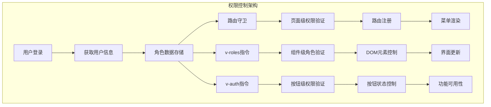
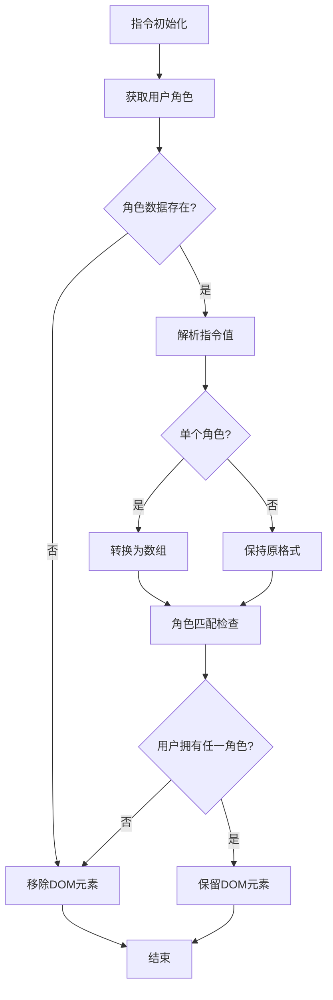
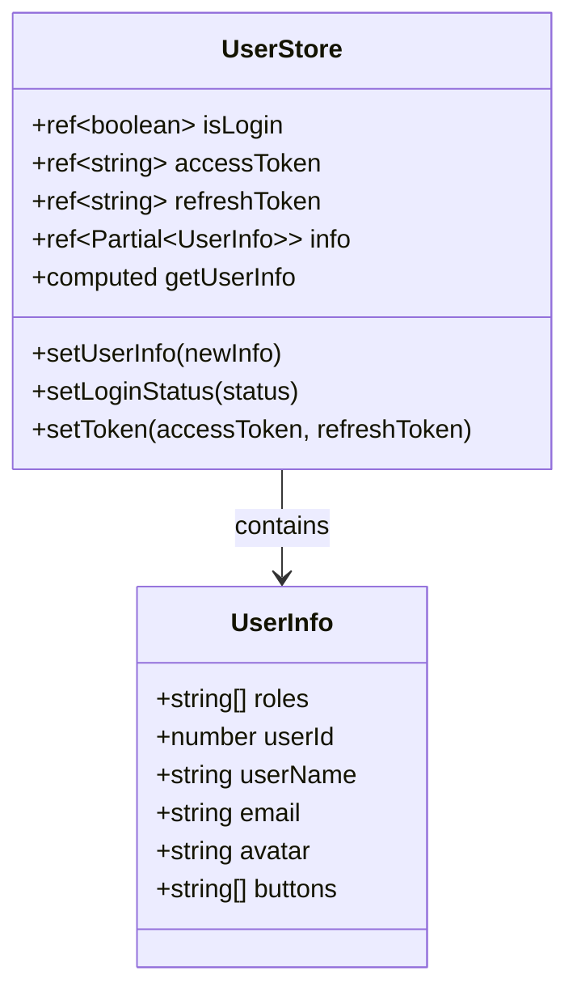
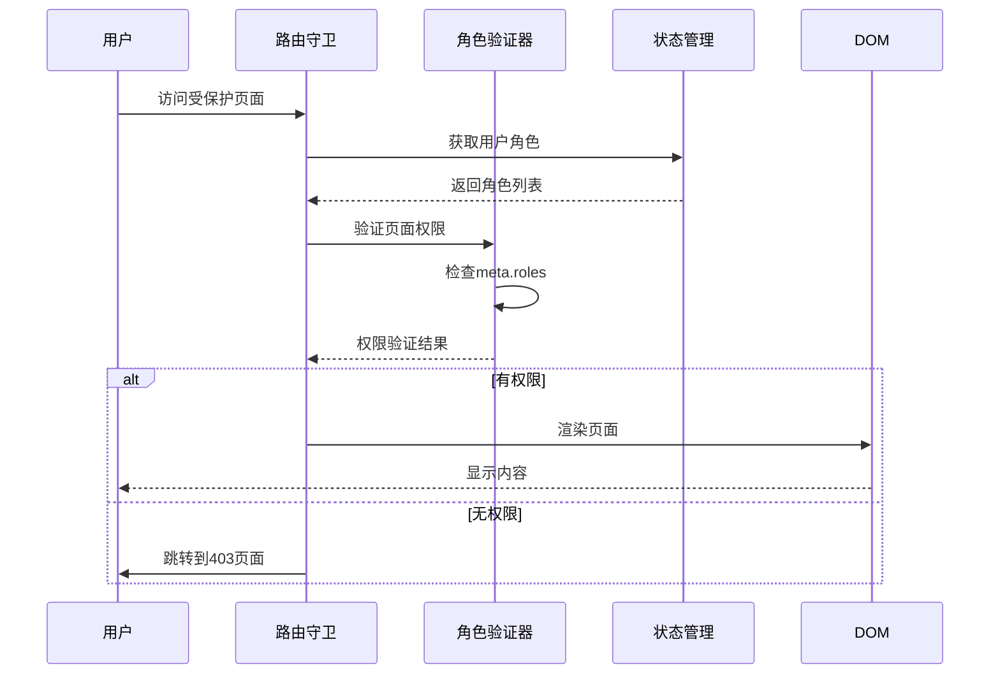

# 页面可见性控制详细文档

<cite>
**本文档中引用的文件**
- [roles.ts](file://src/directives/core/roles.ts)
- [user.ts](file://src/store/modules/user.ts)
- [index.vue](file://src/views/examples/permission/page-visibility/index.vue)
- [button-auth/index.vue](file://src/views/examples/permission/button-auth/index.vue)
- [beforeEach.ts](file://src/router/guards/beforeEach.ts)
- [RoutePermissionValidator.ts](file://src/router/core/RoutePermissionValidator.ts)
- [api.d.ts](file://src/types/api/api.d.ts)
- [auth.ts](file://src/directives/core/auth.ts)
- [index.ts](file://src/directives/index.ts)
</cite>

## 目录
1. [概述](#概述)
2. [核心架构](#核心架构)
3. [v-roles指令实现机制](#v-roles指令实现机制)
4. [用户角色数据管理](#用户角色数据管理)
5. [权限验证流程](#权限验证流程)
6. [页面级权限控制](#页面级权限控制)
7. [组件级权限控制](#组件级权限控制)
8. [最佳实践](#最佳实践)
9. [安全考虑](#安全考虑)
10. [常见问题解决方案](#常见问题解决方案)
11. [总结](#总结)

## 概述

Art Design Pro 提供了一套完整的页面可见性控制系统，通过多种权限控制机制确保系统的安全性。该系统主要包含两个核心指令：`v-roles`（基于角色的权限控制）和`v-auth`（基于权限标识的控制），以及配套的路由守卫和状态管理机制。

### 主要特性

- **多层级权限控制**：支持页面级、组件级、按钮级的细粒度权限控制
- **前后端分离模式**：支持前端控制模式和后端控制模式
- **响应式更新**：角色变更时自动更新界面元素
- **DOM优化**：无权限时直接移除DOM元素而非隐藏
- **安全性优先**：遵循最小权限原则

## 核心架构



**图表来源**
- [beforeEach.ts](file://src/router/guards/beforeEach.ts#L86-L361)
- [roles.ts](file://src/directives/core/roles.ts#L54-L74)
- [auth.ts](file://src/directives/core/auth.ts#L42-L52)

## v-roles指令实现机制

### 指令核心功能

`v-roles`指令是基于角色的权限控制核心，它能够根据用户的实际角色决定DOM元素的显示与否。



**图表来源**
- [roles.ts](file://src/directives/core/roles.ts#L54-L74)

### checkRolePermission函数详解

该函数是`v-roles`指令的核心逻辑实现：

#### 数据获取流程
1. **用户状态获取**：通过`useUserStore()`获取用户状态管理实例
2. **角色数据提取**：从`userStore.getUserInfo.roles`中获取用户角色数组
3. **数据验证**：检查角色数组是否有效

#### 权限验证逻辑
1. **角色格式标准化**：确保指令值始终为数组格式
2. **角色匹配算法**：使用`Array.prototype.some()`方法检查用户是否拥有任一指定角色
3. **权限决策**：只要用户拥有指定角色中的任意一个，就允许显示元素

#### DOM操作机制
- **元素移除**：当用户无权限时，通过`removeElement()`函数直接从DOM树中移除元素
- **内存释放**：确保被移除的元素不会占用不必要的内存

**章节来源**
- [roles.ts](file://src/directives/core/roles.ts#L54-L74)

## 用户角色数据管理

### 数据结构设计

用户角色信息存储在Pinia状态管理中，通过`userStore`进行统一管理：



**图表来源**
- [user.ts](file://src/store/modules/user.ts#L50-L236)
- [api.d.ts](file://src/types/api/api.d.ts#L77-L85)

### 角色数据来源

#### 1. 登录时获取
- **接口调用**：登录成功后调用`fetchGetUserInfo()`接口
- **数据解析**：后端返回的用户信息包含`roles`字段
- **状态更新**：通过`userStore.setUserInfo()`更新角色数据

#### 2. 动态更新机制
- **路由守卫触发**：每次动态路由注册时重新获取用户信息
- **权限变更检测**：确保角色变更能及时反映在界面上
- **数据一致性**：避免localStorage中过期数据的影响

#### 3. 数据持久化
- **存储位置**：使用localStorage进行持久化
- **存储键名**：`sys-v{version}-user`
- **清理机制**：登出时自动清理相关数据

**章节来源**
- [user.ts](file://src/store/modules/user.ts#L308-L314)
- [beforeEach.ts](file://src/router/guards/beforeEach.ts#L308-L314)

## 权限验证流程

### 前端控制模式

前端控制模式是最常用的权限控制方式，通过路由配置中的`meta.roles`字段实现：



**图表来源**
- [beforeEach.ts](file://src/router/guards/beforeEach.ts#L246-L274)
- [RoutePermissionValidator.ts](file://src/router/core/RoutePermissionValidator.ts#L35-L46)

### 后端控制模式

后端控制模式通过动态菜单接口实现更灵活的权限管理：

#### 菜单接口流程
1. **菜单获取**：前端调用`getMenuList()`接口获取用户可访问的菜单
2. **路由注册**：根据菜单数据动态注册路由
3. **权限过滤**：菜单中不存在的页面无法访问

#### 权限验证步骤
1. **路径构建**：将菜单路径扁平化处理成集合
2. **精确匹配**：检查目标路径是否在权限集合中
3. **前缀匹配**：支持动态路由参数的权限控制

**章节来源**
- [RoutePermissionValidator.ts](file://src/router/core/RoutePermissionValidator.ts#L42-L96)

## 页面级权限控制

### 路由配置示例

页面级权限控制通过路由配置中的`meta.roles`字段实现：

```typescript
// 页面级权限配置示例
{
  path: 'page-visibility',
  name: 'PermissionPageVisibility',
  component: '/examples/permission/page-visibility',
  meta: {
    title: 'menus.permission.pageVisibility',
    roles: ['R_SUPER'], // 仅超级管理员可访问
    keepAlive: true
  }
}
```

### 权限验证机制

#### 1. 路由守卫验证
- **时机**：在`beforeEach`守卫中进行权限检查
- **过程**：比较用户角色与路由配置的角色列表
- **结果**：权限不足时跳转到403页面

#### 2. 动态路由注册
- **触发条件**：首次访问或用户信息变更时
- **执行流程**：获取菜单数据 → 验证权限 → 注册路由
- **错误处理**：401错误自动登出，404错误标记路由已注册

**章节来源**
- [beforeEach.ts](file://src/router/guards/beforeEach.ts#L246-L274)

## 组件级权限控制

### v-roles指令使用

#### 单角色权限控制
```vue
<el-button v-roles="'R_SUPER'">超级管理员功能</el-button>
```

#### 多角色权限控制
```vue
<el-button v-roles="['R_SUPER', 'R_ADMIN']">管理员功能</el-button>
```

#### 任意元素权限控制
```vue
<div v-roles="['R_SUPER', 'R_ADMIN', 'R_USER']">
  所有登录用户可见的内容
</div>
```

### v-auth指令使用

`v-auth`指令适用于后端权限控制模式：

```vue
<el-button v-auth="'add'">新增</el-button>
<el-button v-auth="'edit'">编辑</el-button>
<el-button v-auth="'delete'">删除</el-button>
```

### 权限指令对比

| 特性 | v-roles | v-auth |
|------|---------|--------|
| **权限来源** | 用户角色数组 | 路由meta.authList |
| **适用模式** | 前端控制模式 | 后端控制模式 |
| **数据格式** | 字符串或字符串数组 | 字符串 |
| **DOM行为** | 移除元素 | 移除元素 |
| **响应式** | 是 | 是 |

**章节来源**
- [roles.ts](file://src/directives/core/roles.ts#L16-L28)
- [auth.ts](file://src/directives/core/auth.ts#L16-L24)

## 最佳实践

### 1. 权限设计原则

#### RBAC模型应用
- **角色定义**：基于业务功能划分角色
- **权限聚合**：将相关权限组合到角色中
- **继承关系**：建立角色间的层次关系

#### 角色命名规范
```typescript
// 推荐的角色代码命名
const ROLES = {
  SUPER_ADMIN: 'R_SUPER',    // 超级管理员
  ADMIN: 'R_ADMIN',         // 管理员
  USER: 'R_USER',           // 普通用户
  FINANCE: 'R_FINANCE',     // 财务人员
  SUPPORT: 'R_SUPPORT'      // 客服人员
}
```

### 2. 组件权限设计

#### 分层权限控制
```vue
<!-- 页面级权限 -->
<template v-roles="['R_SUPER']">
  <div>
    <!-- 组件级权限 -->
    <el-button v-roles="['R_ADMIN']">管理功能</el-button>
    
    <!-- 按钮级权限 -->
    <el-button v-auth="'add'">新增</el-button>
    <el-button v-auth="'edit'">编辑</el-button>
  </div>
</template>
```

#### 条件渲染策略
- **优先级**：页面级 > 组件级 > 按钮级
- **性能**：无权限时直接移除DOM，减少渲染开销
- **用户体验**：避免显示无意义的功能按钮

### 3. 路由权限配置

#### 动态路由权限
```typescript
// 动态路由配置示例
const dynamicRoutes = [
  {
    path: '/system',
    name: 'SystemManagement',
    component: 'Layout',
    meta: {
      title: '系统管理',
      roles: ['R_SUPER', 'R_ADMIN'],
      icon: 'setting'
    },
    children: [
      {
        path: 'user',
        name: 'UserManagement',
        component: 'system/user/index',
        meta: {
          title: '用户管理',
          roles: ['R_SUPER'],
          icon: 'user'
        }
      }
    ]
  }
]
```

**章节来源**
- [index.vue](file://src/views/examples/permission/page-visibility/index.vue#L50-L70)

## 安全考虑

### 1. 前端安全防护

#### 多层验证机制
- **前端验证**：提供良好的用户体验
- **后端验证**：确保安全性，防止恶意绕过
- **数据库验证**：最终的安全保障

#### 隐私数据保护
- **敏感信息隐藏**：无权限时完全移除相关DOM
- **数据脱敏**：避免在前端暴露敏感数据
- **访问日志**：记录权限访问情况

### 2. 后端安全要求

#### 接口权限验证
```typescript
// 示例：后端接口权限验证
function checkPermission(userId: number, requiredRole: string): boolean {
  const user = userRepository.findById(userId);
  return user.roles.includes(requiredRole);
}
```

#### 数据权限控制
- **行级权限**：限制用户只能访问自己的数据
- **列级权限**：控制用户能看到哪些字段
- **操作权限**：限制用户能执行的操作类型

### 3. 客户端安全措施

#### 令牌安全管理
- **令牌轮换**：定期更新访问令牌
- **刷新令牌**：安全存储和传输
- **令牌失效**：登出时立即失效

#### 状态管理安全
- **数据加密**：敏感数据本地加密存储
- **状态清理**：登出时彻底清理状态
- **内存保护**：及时释放敏感数据引用

**章节来源**
- [beforeEach.ts](file://src/router/guards/beforeEach.ts#L275-L296)

## 常见问题解决方案

### 1. 角色继承问题

#### 问题描述
用户同时拥有多个角色，但某些角色的权限被覆盖或丢失。

#### 解决方案
```typescript
// 角色权限合并策略
function getCombinedPermissions(userRoles: string[]): string[] {
  const permissionsMap = new Map<string, boolean>();
  
  // 按角色优先级排序
  const sortedRoles = userRoles.sort((a, b) => {
    const priorities = { R_SUPER: 3, R_ADMIN: 2, R_USER: 1 };
    return priorities[b] - priorities[a];
  });
  
  // 合并权限
  sortedRoles.forEach(role => {
    const rolePermissions = getRolePermissions(role);
    rolePermissions.forEach(permission => {
      permissionsMap.set(permission, true);
    });
  });
  
  return Array.from(permissionsMap.keys());
}
```

### 2. 角色变更响应式更新

#### 问题描述
用户角色发生变更后，界面元素没有及时更新。

#### 解决方案
```typescript
// 响应式角色更新机制
watch(() => userStore.getUserInfo.roles, (newRoles) => {
  // 强制重新渲染相关组件
  triggerRoleUpdate();
}, { deep: true });

// 或者在路由守卫中强制刷新
router.beforeEach(async (to, from, next) => {
  if (shouldRefreshPermissions()) {
    await refreshUserPermissions();
  }
  next();
});
```

### 3. 权限粒度控制

#### 问题描述
需要实现更细粒度的权限控制，如按钮级、字段级权限。

#### 解决方案
```typescript
// 细粒度权限控制示例
interface PermissionControl {
  element: HTMLElement;
  requiredPermission: string;
  fallbackBehavior: 'hide' | 'disable' | 'show';
}

const permissionControls: PermissionControl[] = [
  {
    element: document.getElementById('advancedButton'),
    requiredPermission: 'advanced_feature',
    fallbackBehavior: 'hide'
  }
];

function applyFineGrainedPermissions() {
  permissionControls.forEach(control => {
    const hasPermission = checkUserPermission(control.requiredPermission);
    
    if (!hasPermission) {
      switch (control.fallbackBehavior) {
        case 'hide':
          control.element.style.display = 'none';
          break;
        case 'disable':
          control.element.disabled = true;
          break;
        case 'show':
          // 保持显示，但可能需要添加水印或其他提示
          break;
      }
    }
  });
}
```

### 4. 性能优化

#### 问题描述
大量权限检查导致页面性能下降。

#### 解决方案
```typescript
// 权限缓存机制
class PermissionCache {
  private cache = new Map<string, boolean>();
  
  checkPermission(userId: number, permission: string): boolean {
    const cacheKey = `${userId}:${permission}`;
    
    if (this.cache.has(cacheKey)) {
      return this.cache.get(cacheKey)!;
    }
    
    // 缓存未命中，执行权限检查
    const hasPermission = this.performPermissionCheck(userId, permission);
    this.cache.set(cacheKey, hasPermission);
    
    return hasPermission;
  }
  
  clearCache() {
    this.cache.clear();
  }
}
```

### 5. 权限调试

#### 问题描述
权限控制出现问题时难以定位原因。

#### 解决方案
```typescript
// 权限调试工具
class PermissionDebugger {
  static logPermissionCheck(
    userId: number, 
    requiredPermission: string, 
    hasPermission: boolean
  ): void {
    console.group(`权限检查 - 用户ID: ${userId}`);
    console.log('所需权限:', requiredPermission);
    console.log('用户权限:', this.getUserPermissions(userId));
    console.log('检查结果:', hasPermission ? '通过' : '拒绝');
    console.groupEnd();
  }
  
  static getUserPermissions(userId: number): string[] {
    // 获取用户权限的逻辑
    return [];
  }
}
```

**章节来源**
- [roles.ts](file://src/directives/core/roles.ts#L54-L74)
- [beforeEach.ts](file://src/router/guards/beforeEach.ts#L246-L274)

## 总结

Art Design Pro 的页面可见性控制系统提供了完整而灵活的权限管理解决方案。通过`v-roles`和`v-auth`指令的配合使用，结合路由守卫和状态管理，实现了从前端到后端的全方位权限控制。

### 核心优势

1. **多层次控制**：支持页面级、组件级、按钮级的细粒度权限控制
2. **灵活模式**：兼容前端控制和后端控制两种模式
3. **响应式更新**：角色变更时自动更新界面状态
4. **性能优化**：无权限时直接移除DOM元素，提升性能
5. **安全可靠**：遵循最小权限原则，提供多重安全防护

### 实施建议

1. **合理规划角色**：基于业务需求设计清晰的角色体系
2. **分层权限设计**：在不同层级应用合适的权限控制策略
3. **持续监控**：建立权限使用的监控和审计机制
4. **定期审查**：定期审查权限配置，确保符合安全要求

通过正确实施这套权限控制系统，可以有效保护系统资源，提升用户体验，同时确保系统的安全性和可维护性。