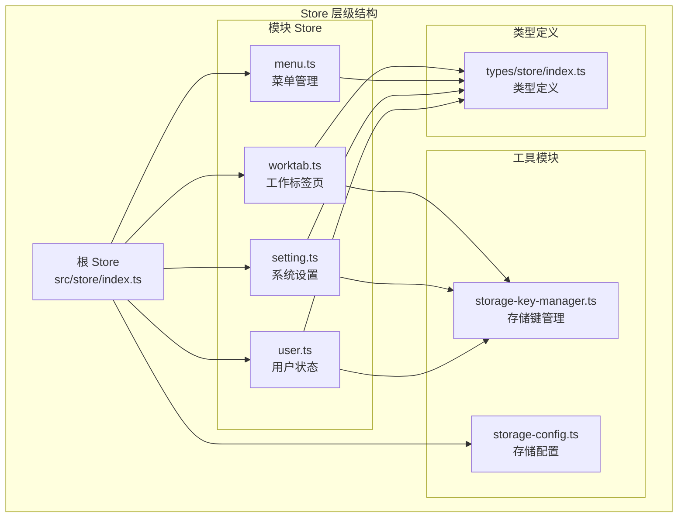
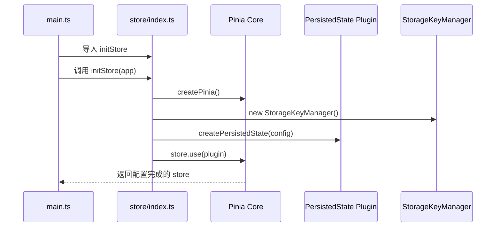
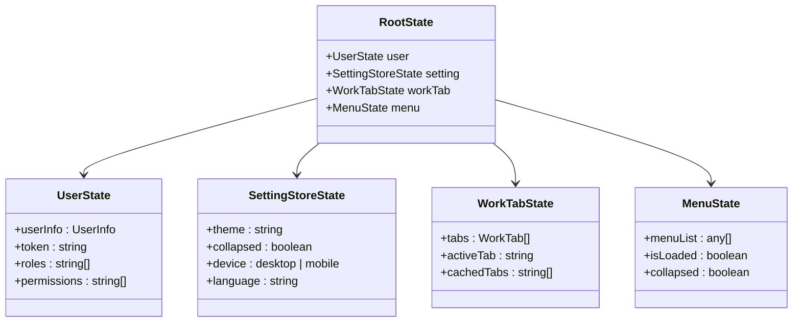
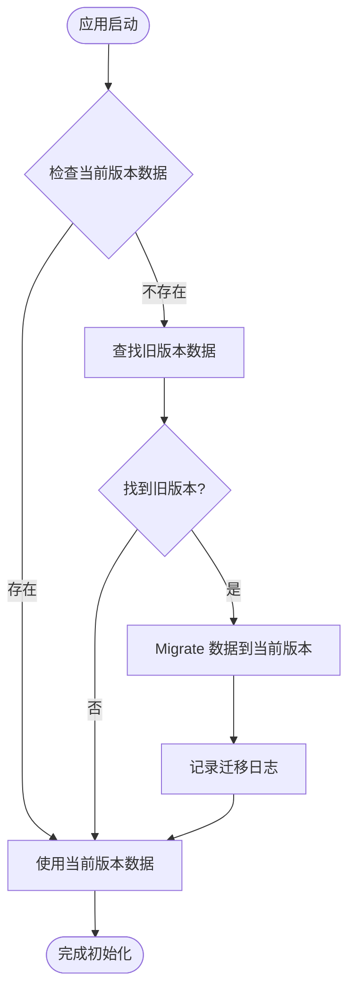
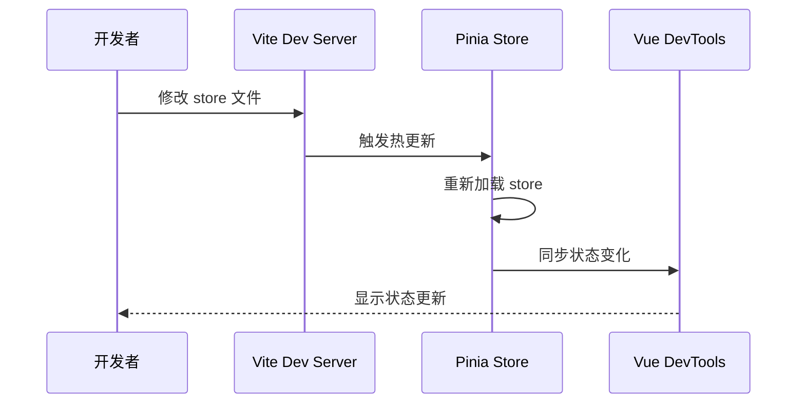

# Pinia 状态管理框架使用指南

<cite>
**本文档中引用的文件**
- [src/store/index.ts](file://src/store/index.ts)
- [src/main.ts](file://src/main.ts)
- [package.json](file://package.json)
- [src/store/modules/user.ts](file://src/store/modules/user.ts)
- [src/store/modules/setting.ts](file://src/store/modules/setting.ts)
- [src/store/modules/menu.ts](file://src/store/modules/menu.ts)
- [src/store/modules/worktab.ts](file://src/store/modules/worktab.ts)
- [src/types/store/index.ts](file://src/types/store/index.ts)
- [src/utils/storage/storage-key-manager.ts](file://src/utils/storage/storage-key-manager.ts)
- [src/utils/storage/storage-config.ts](file://src/utils/storage/storage-config.ts)
- [src/config/setting.ts](file://src/config/setting.ts)
- [vite.config.ts](file://vite.config.ts)
</cite>

## 目录
1. [简介](#简介)
2. [项目架构](#项目架构)
3. [根 Store 初始化](#根-store-初始化)
4. [Store 定义方式](#store-定义方式)
5. [组件中使用 Store](#组件中使用-store)
6. [类型安全与 TypeScript](#类型安全与-typescript)
7. [持久化配置](#持久化配置)
8. [开发环境支持](#开发环境支持)
9. [调试技巧](#调试技巧)
10. [常见问题解决](#常见问题解决)
11. [最佳实践](#最佳实践)

## 简介

Pinia 是 Vue 3 的官方状态管理库，提供了更简洁、类型安全的状态管理模式。本文档基于一个完整的 Vue 3 + TypeScript 项目，展示了 Pinia 在实际项目中的使用方式，包括根 store 初始化、模块定义、持久化配置、类型安全等核心功能。

## 项目架构

该项目采用模块化的 store 架构，每个功能模块都有独立的 store 文件：



**图表来源**
- [src/store/index.ts](file://src/store/index.ts#L1-L53)
- [src/store/modules/user.ts](file://src/store/modules/user.ts#L1-L236)
- [src/store/modules/setting.ts](file://src/store/modules/setting.ts#L1-L451)
- [src/store/modules/menu.ts](file://src/store/modules/menu.ts#L1-L110)
- [src/store/modules/worktab.ts](file://src/store/modules/worktab.ts#L1-L569)

**章节来源**
- [src/store/index.ts](file://src/store/index.ts#L1-L53)
- [src/store/modules/user.ts](file://src/store/modules/user.ts#L1-L236)
- [src/store/modules/setting.ts](file://src/store/modules/setting.ts#L1-L451)

## 根 Store 初始化

### 插件安装与配置

Pinia 的初始化过程包括创建 store 实例、安装持久化插件和配置序列化器：



**图表来源**
- [src/main.ts](file://src/main.ts#L18-L25)
- [src/store/index.ts](file://src/store/index.ts#L30-L52)

### 持久化插件配置

持久化插件使用 `pinia-plugin-persistedstate`，支持版本化存储键和自动数据迁移：

| 配置项 | 类型 | 说明 | 默认值 |
|--------|------|------|--------|
| `key` | `(storeId: string) => string` | 存储键生成函数 | `storageKeyManager.getStorageKey()` |
| `storage` | `Storage` | 存储介质 | `localStorage` |
| `serializer` | `Serializer` | 序列化器 | `{serialize: JSON.stringify, deserialize: JSON.parse}` |

**章节来源**
- [src/store/index.ts](file://src/store/index.ts#L35-L45)
- [src/utils/storage/storage-key-manager.ts](file://src/utils/storage/storage-key-manager.ts#L80-L96)

## Store 定义方式

### 声明式语法 vs 组合式语法

项目同时使用两种语法风格，根据具体需求选择合适的方式：

#### 声明式语法（推荐）

适用于简单的状态管理，代码更加直观：

```typescript
// 用户状态管理 - 声明式语法
export const useUserStore = defineStore(
  'userStore',
  () => {
    // 状态定义
    const language = ref(LanguageEnum.ZH)
    const isLogin = ref(false)
    const info = ref<Partial<Api.Auth.UserInfo>>({})
    
    // 计算属性
    const getUserInfo = computed(() => info.value)
    
    // Actions
    const setUserInfo = (newInfo: Api.Auth.UserInfo) => {
      info.value = newInfo
    }
    
    return {
      language,
      isLogin,
      info,
      getUserInfo,
      setUserInfo
    }
  },
  {
    persist: {
      key: 'user',
      storage: localStorage
    }
  }
)
```

#### 组合式语法

适用于复杂的业务逻辑，提供更大的灵活性：

```typescript
// 工作标签页状态管理 - 组合式语法
export const useWorktabStore = defineStore(
  'worktabStore',
  () => {
    const current = ref<Partial<WorkTab>>({})
    const opened = ref<WorkTab[]>([])
    const keepAliveExclude = ref<string[]>([])
    
    // 计算属性
    const hasOpenedTabs = computed(() => opened.value.length > 0)
    
    // 方法
    const openTab = (tab: WorkTab): void => {
      // 复杂的标签页逻辑
    }
    
    return {
      current,
      opened,
      keepAliveExclude,
      hasOpenedTabs,
      openTab
    }
  }
)
```

### State、Getters 和 Actions 的组织

| 类型 | 语法 | 用途 | 示例 |
|------|------|------|------|
| State | `ref()` / `reactive()` | 定义响应式状态 | `const count = ref(0)` |
| Getters | `computed()` | 派生状态和计算属性 | `const doubleCount = computed(() => count.value * 2)` |
| Actions | 函数定义 | 状态修改和异步操作 | `const increment = () => count.value++` |

**章节来源**
- [src/store/modules/user.ts](file://src/store/modules/user.ts#L50-L227)
- [src/store/modules/worktab.ts](file://src/store/modules/worktab.ts#L56-L560)

## 组件中使用 Store

### 基本使用方式

在 Vue 组件中使用 store 的标准方式：

```typescript
<script setup>
import { useUserStore } from '@/store/modules/user'
import { useSettingStore } from '@/store/modules/setting'

// 获取 store 实例
const userStore = useUserStore()
const settingStore = useSettingStore()

// 访问状态
console.log(userStore.isLogin)
console.log(settingStore.systemThemeType)

// 调用 Action
userStore.setLoginStatus(true)
settingStore.setGlopTheme(SystemThemeEnum.DARK, SystemThemeEnum.DARK)
</script>
```

### 响应式状态监听

```typescript
<script setup>
import { useWorktabStore } from '@/store/modules/worktab'

const worktabStore = useWorktabStore()

// 监听状态变化
watch(
  () => worktabStore.opened,
  (newTabs) => {
    console.log('标签页发生变化:', newTabs)
  }
)

// 计算属性
const activeTab = computed(() => worktabStore.current)
</script>
```

### 在模板中使用

```vue
<template>
  <div>
    <!-- 状态显示 -->
    <p>登录状态: {{ userStore.isLogin ? '已登录' : '未登录' }}</p>
    <p>当前主题: {{ settingStore.systemThemeType }}</p>
    
    <!-- 按钮操作 -->
    <button @click="userStore.setLoginStatus(false)">
      退出登录
    </button>
    
    <!-- 条件渲染 -->
    <div v-if="worktabStore.hasOpenedTabs">
      <p>当前有 {{ worktabStore.opened.length }} 个标签页</p>
    </div>
  </div>
</template>
```

**章节来源**
- [src/store/modules/user.ts](file://src/store/modules/user.ts#L206-L227)
- [src/store/modules/setting.ts](file://src/store/modules/setting.ts#L378-L442)

## 类型安全与 TypeScript

### 根状态类型定义

项目提供了完整的类型定义，确保类型安全：



**图表来源**
- [src/types/store/index.ts](file://src/types/store/index.ts#L147-L157)

### 类型推导机制

TypeScript 通过以下方式实现类型安全：

| 特性 | 实现方式 | 优势 |
|------|----------|------|
| 自动类型推导 | `defineStore` 返回类型 | 编译时类型检查 |
| 接口定义 | `RootState` 和各模块状态接口 | 结构化类型定义 |
| 泛型支持 | `ref<T>` 和 `computed<T>` | 强类型约束 |
| 智能提示 | VS Code IntelliSense | 开发时自动补全 |

### 类型安全的最佳实践

1. **明确的状态类型定义**
```typescript
interface UserInfo {
  userId: string
  username: string
  avatar?: string
}

const info = ref<UserInfo>({
  userId: '',
  username: ''
})
```

2. **严格的 Action 参数类型**
```typescript
const updateUser = (newInfo: Partial<UserInfo>) => {
  info.value = { ...info.value, ...newInfo }
}
```

3. **计算属性的类型约束**
```typescript
const isAdmin = computed<boolean>(() => {
  return userStore.permissions.includes('admin')
})
```

**章节来源**
- [src/types/store/index.ts](file://src/types/store/index.ts#L1-L158)

## 持久化配置

### 版本化存储策略

项目实现了智能的版本化存储和数据迁移机制：



**图表来源**
- [src/utils/storage/storage-key-manager.ts](file://src/utils/storage/storage-key-manager.ts#L80-L96)

### 存储键命名规则

| 组件 | 格式 | 示例 | 说明 |
|------|------|------|------|
| 存储键前缀 | `sys-v{version}-` | `sys-v1.0.0-` | 版本化标识 |
| 用户数据 | `sys-v{version}-user` | `sys-v1.0.0-user` | 用户相关信息 |
| 设置数据 | `sys-v{version}-setting` | `sys-v1.0.0-setting` | 系统设置配置 |
| 工作标签页 | `sys-v{version}-worktab` | `sys-v1.0.0-worktab` | 标签页状态 |

### 数据迁移机制

```typescript
// 自动数据迁移实现
private migrateData(fromKey: string, toKey: string): void {
  try {
    const existingData = localStorage.getItem(fromKey)
    if (existingData) {
      localStorage.setItem(toKey, existingData)
      console.info(`[Storage] 已迁移数据: ${fromKey} → ${toKey}`)
    }
  } catch (error) {
    console.warn(`[Storage] 数据迁移失败: ${fromKey}`, error)
  }
}
```

**章节来源**
- [src/utils/storage/storage-key-manager.ts](file://src/utils/storage/storage-key-manager.ts#L64-L76)
- [src/utils/storage/storage-config.ts](file://src/utils/storage/storage-config.ts#L23-L25)

## 开发环境支持

### Vue DevTools 集成

项目集成了 Vue DevTools，提供强大的调试功能：

```typescript
// vite.config.ts 中的 DevTools 配置
plugins: [
  vue(),
  vueDevTools(), // 启用 Vue DevTools
  // 其他插件...
]
```

### 热更新支持

开发环境下，Pinia 支持热模块替换（HMR），无需刷新页面即可看到状态变化：



**图表来源**
- [vite.config.ts](file://vite.config.ts#L100)

### 开发环境优化

| 优化项 | 配置 | 效果 |
|--------|------|------|
| 状态持久化 | 开发环境启用 | 保留状态变化 |
| 类型检查 | TypeScript 配置 | 编译时错误检测 |
| 调试信息 | 控制台日志 | 运行时状态追踪 |
| 性能监控 | DevTools 集成 | 状态变化可视化 |

**章节来源**
- [vite.config.ts](file://vite.config.ts#L100)

## 调试技巧

### 使用 Vue DevTools 进行状态追踪

1. **安装和启用 DevTools**
   - 浏览器扩展：Chrome/Firefox Vue DevTools
   - 项目集成：`vueDevTools()` 插件

2. **状态查看面板**
   - Store 树形结构浏览
   - 状态值实时更新
   - Action 调用历史记录

3. **时间旅行调试**
   - 回溯状态变化
   - 重放 Action 操作
   - 分析状态演进过程

### 常见调试场景

```typescript
// 调试工具函数
function debugStoreState(storeName: string, store: any) {
  console.group(`${storeName} 状态调试`)
  console.log('当前状态:', store.$state)
  console.log('计算属性:', Object.keys(store).filter(key => 
    typeof store[key] === 'function' && key.startsWith('get')
  ))
  console.log('Actions:', Object.keys(store).filter(key => 
    typeof store[key] === 'function' && !key.startsWith('get')
  ))
  console.groupEnd()
}

// 在组件中使用
onMounted(() => {
  debugStoreState('UserStore', useUserStore())
})
```

### 日志记录和监控

```typescript
// 状态变化监听器
const userStore = useUserStore()
userStore.$subscribe((mutation, state) => {
  console.log('状态变化:', mutation.type, mutation.events)
  console.log('新状态:', state)
})
```

**章节来源**
- [vite.config.ts](file://vite.config.ts#L100)

## 常见问题解决

### 状态未响应问题

**问题现象**：状态变化后视图不更新

**解决方案**：
1. 确保使用 `ref()` 或 `reactive()` 创建状态
2. 避免直接修改嵌套对象：使用 `toRefs()` 解构
3. 正确使用计算属性和响应式引用

```typescript
// 错误做法
const user = reactive({ name: 'John', age: 25 })
user.age = 26 // 直接修改可能失效

// 正确做法
const user = ref({ name: 'John', age: 25 })
user.value.age = 26 // 通过 .value 访问
```

### Action 未绑定问题

**问题现象**：Action 中 `this` 指向错误

**解决方案**：
1. 使用箭头函数定义 Action
2. 确保正确导入 store 实例

```typescript
// 错误：this 指向问题
const store = defineStore('test', {
  actions: {
    badAction() {
      this.state // this 可能指向错误
    }
  }
})

// 正确：箭头函数确保 this 正确
const store = defineStore('test', {
  actions: {
    goodAction: () => {
      const localStore = useTestStore()
      localStore.state // 正确访问
    }
  }
})
```

### 类型推导失败

**问题现象**：TypeScript 报错，类型不匹配

**解决方案**：
1. 明确类型定义
2. 使用类型断言
3. 检查接口继承关系

```typescript
// 明确类型定义
interface User {
  id: string
  name: string
  email?: string
}

const user = ref<User>({
  id: '1',
  name: 'John'
})

// 类型断言
const store = useUserStore() as UserStore
```

### 持久化失效

**问题现象**：状态刷新后丢失

**解决方案**：
1. 检查持久化配置
2. 验证存储键生成
3. 确认序列化器设置

```typescript
// 检查持久化配置
const store = defineStore('test', {
  persist: {
    key: 'test-key', // 确保键名唯一
    storage: localStorage, // 确认存储介质
    serializer: {
      serialize: JSON.stringify,
      deserialize: JSON.parse
    }
  }
})
```

**章节来源**
- [src/store/modules/user.ts](file://src/store/modules/user.ts#L206-L227)
- [src/store/modules/worktab.ts](file://src/store/modules/worktab.ts#L56-L560)

## 最佳实践

### Store 设计原则

1. **单一职责**：每个 store 只负责一个业务领域
2. **状态最小化**：只存储必要的状态数据
3. **计算属性优先**：优先使用计算属性而非派生状态
4. **Action 封装**：复杂逻辑封装在 Action 中

### 性能优化建议

```typescript
// 使用计算属性缓存结果
const userStore = useUserStore()
const userPermissions = computed(() => {
  return userStore.info.permissions || []
})

// 避免不必要的状态订阅
watchEffect(() => {
  // 只监听需要的状态
  const { isLogin, info } = userStore
  // 复杂计算逻辑
})
```

### 错误处理策略

```typescript
// Action 中的错误处理
const userStore = useUserStore()

const login = async (credentials: LoginCredentials) => {
  try {
    const response = await api.login(credentials)
    userStore.setToken(response.accessToken, response.refreshToken)
    userStore.setUserInfo(response.user)
  } catch (error) {
    console.error('登录失败:', error)
    // 显示用户友好的错误消息
    throw new Error('登录失败，请检查用户名和密码')
  }
}
```

### 测试友好设计

```typescript
// 便于测试的 store 设计
export const useTestableStore = (mockData?: any) => {
  const store = useUserStore()
  
  // 提供测试数据覆盖
  if (mockData) {
    store.$patch(mockData)
  }
  
  return store
}
```

### 代码组织规范

| 文件类型 | 命名规范 | 示例 |
|----------|----------|------|
| Store 文件 | `{模块名}.ts` | `user.ts`, `setting.ts` |
| Store 名称 | `use{模块名}Store` | `useUserStore`, `useSettingStore` |
| 状态变量 | `camelCase` | `userInfo`, `isLogin` |
| Action 方法 | `camelCase` | `setUserInfo`, `logOut` |
| Getter 方法 | `get{属性名}` | `getUserInfo`, `getSettingState` |

**章节来源**
- [src/store/modules/user.ts](file://src/store/modules/user.ts#L1-L236)
- [src/store/modules/setting.ts](file://src/store/modules/setting.ts#L1-L451)
- [src/store/modules/worktab.ts](file://src/store/modules/worktab.ts#L1-L569)