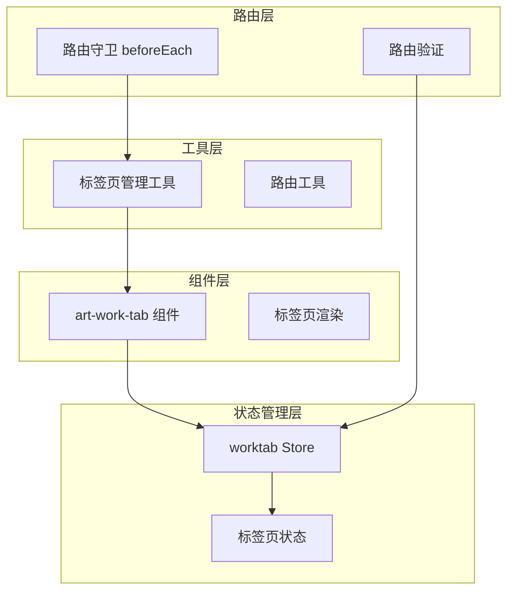
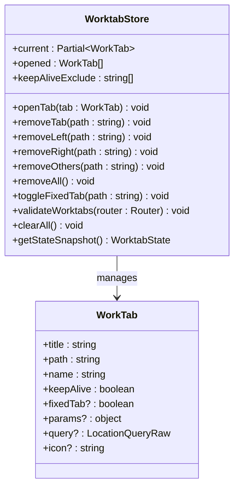
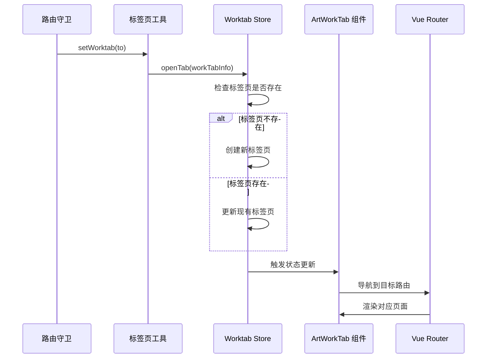
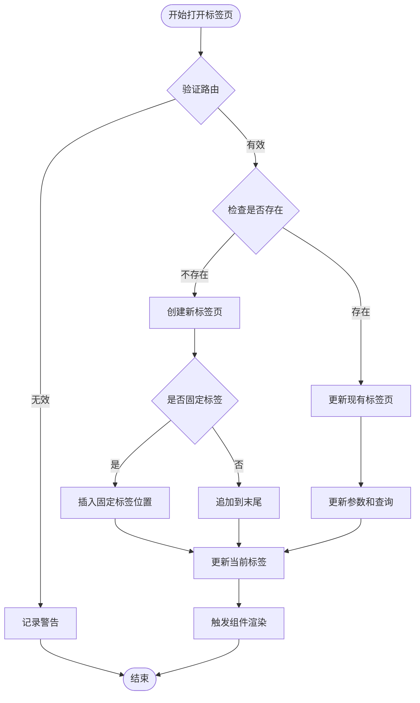
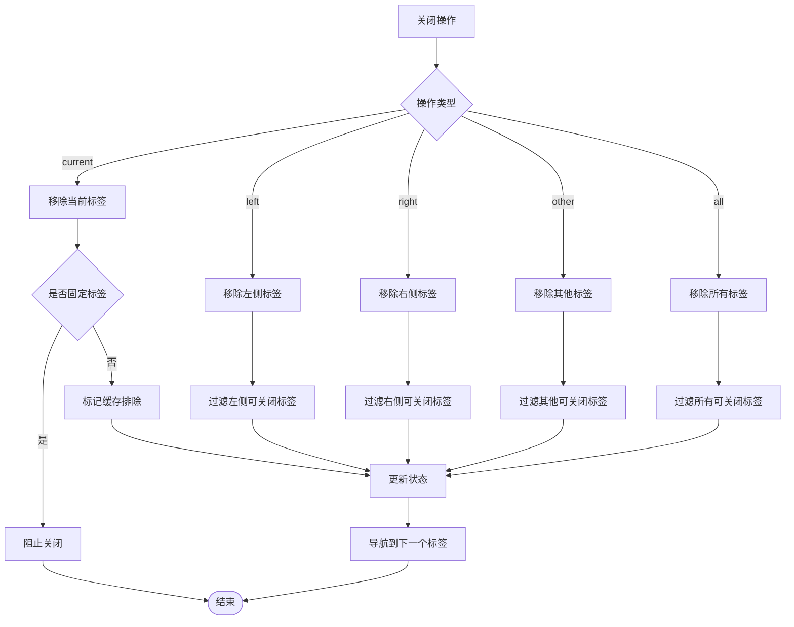
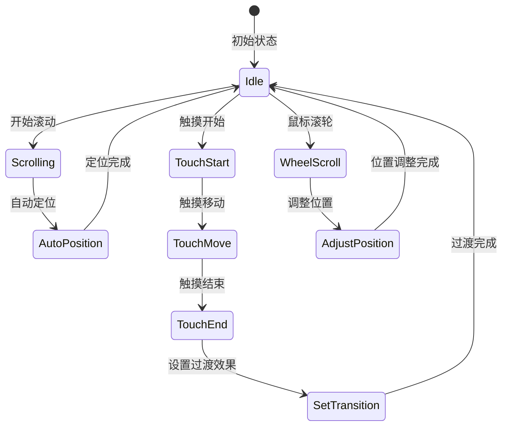
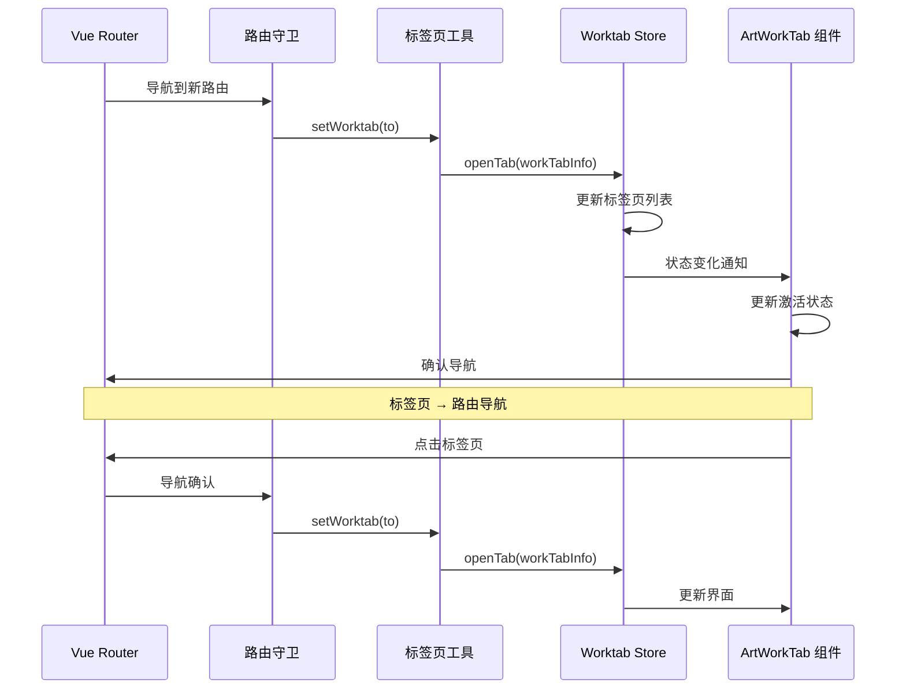
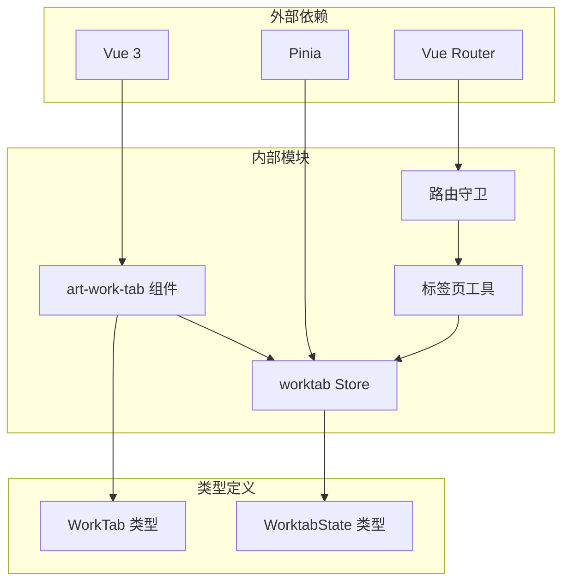

# 工作标签模块 (worktab)

<cite>
**本文档中引用的文件**
- [src/store/modules/worktab.ts](file://src/store/modules/worktab.ts)
- [src/components/core/layouts/art-work-tab/index.vue](file://src/components/core/layouts/art-work-tab/index.vue)
- [src/utils/navigation/worktab.ts](file://src/utils/navigation/worktab.ts)
- [src/router/guards/beforeEach.ts](file://src/router/guards/beforeEach.ts)
- [src/types/store/index.ts](file://src/types/store/index.ts)
- [src/utils/ui/tabs.ts](file://src/utils/ui/tabs.ts)
</cite>

## 目录
1. [简介](#简介)
2. [项目结构](#项目结构)
3. [核心组件](#核心组件)
4. [架构概览](#架构概览)
5. [详细组件分析](#详细组件分析)
6. [依赖关系分析](#依赖关系分析)
7. [性能考虑](#性能考虑)
8. [故障排除指南](#故障排除指南)
9. [结论](#结论)

## 简介

工作标签模块 (worktab) 是 Art Design Pro 项目中的核心多标签页功能实现，提供了完整的标签页管理解决方案。该模块通过 Vue 3 和 Pinia 状态管理，实现了智能的标签页打开、关闭、切换、刷新及拖拽排序等功能，同时支持标签页的缓存管理和路由同步机制。

### 主要特性

- **智能标签页复用**：基于路由名称的标签页复用机制，避免相同路由的重复打开
- **固定标签页保护**：支持固定常用页面，防止意外关闭
- **批量关闭操作**：支持左侧、右侧、其他、全部标签页的批量关闭
- **KeepAlive 缓存管理**：智能的页面缓存排除和管理机制
- **路由验证机制**：确保标签页路由的有效性和一致性
- **持久化存储**：使用 localStorage 实现标签页状态的持久化
- **响应式设计**：支持移动端触摸手势和桌面端鼠标交互

## 项目结构

工作标签模块采用分层架构设计，主要包含以下几个层次：



**图表来源**
- [src/router/guards/beforeEach.ts](file://src/router/guards/beforeEach.ts#L149-L151)
- [src/utils/navigation/worktab.ts](file://src/utils/navigation/worktab.ts#L35-L67)
- [src/components/core/layouts/art-work-tab/index.vue](file://src/components/core/layouts/art-work-tab/index.vue#L117-L123)

**章节来源**
- [src/store/modules/worktab.ts](file://src/store/modules/worktab.ts#L1-L569)
- [src/components/core/layouts/art-work-tab/index.vue](file://src/components/core/layouts/art-work-tab/index.vue#L1-L585)

## 核心组件

### WorkTab 类型定义

工作标签模块的核心数据结构是 `WorkTab` 接口，它定义了标签页的所有属性：

```typescript
interface WorkTab {
  title: string          // 标签标题
  customTitle?: string   // 自定义标题
  path: string          // 路由路径
  name: string          // 路由名称
  keepAlive: boolean    // 是否缓存
  fixedTab?: boolean    // 是否固定标签
  params?: object       // 路由参数
  query?: LocationQueryRaw  // 路由查询参数
  icon?: string         // 图标
  isActive?: boolean    // 是否激活
}
```

### 状态管理 Store

`useWorktabStore` 是工作标签模块的状态管理核心，提供了完整的标签页生命周期管理：



**图表来源**
- [src/store/modules/worktab.ts](file://src/store/modules/worktab.ts#L47-L568)
- [src/types/store/index.ts](file://src/types/store/index.ts#L80-L102)

**章节来源**
- [src/store/modules/worktab.ts](file://src/store/modules/worktab.ts#L47-L568)
- [src/types/store/index.ts](file://src/types/store/index.ts#L80-L102)

## 架构概览

工作标签模块采用 MVVM 架构模式，通过 Pinia 状态管理实现组件间的数据共享和状态同步：



**图表来源**
- [src/router/guards/beforeEach.ts](file://src/router/guards/beforeEach.ts#L149-L151)
- [src/utils/navigation/worktab.ts](file://src/utils/navigation/worktab.ts#L35-L67)
- [src/store/modules/worktab.ts](file://src/store/modules/worktab.ts#L114-L163)

## 详细组件分析

### 标签页打开逻辑

标签页的打开过程是整个模块的核心，涉及路由验证、标签页复用和状态更新：



**图表来源**
- [src/store/modules/worktab.ts](file://src/store/modules/worktab.ts#L114-L163)

### 标签页关闭机制

标签页关闭支持多种模式，每种模式都有相应的逻辑处理：



**图表来源**
- [src/store/modules/worktab.ts](file://src/store/modules/worktab.ts#L183-L365)

### 右键菜单功能

art-work-tab 组件提供了丰富的右键菜单功能，支持标签页的各种操作：

| 功能 | 描述 | 条件限制 |
|------|------|----------|
| 刷新 | 刷新当前标签页内容 | 当前标签页 |
| 固定/取消固定 | 切换标签页固定状态 | 无 |
| 关闭左侧 | 关闭当前标签页左侧的所有可关闭标签 | 不是第一个标签且左侧有可关闭标签 |
| 关闭右侧 | 关闭当前标签页右侧的所有可关闭标签 | 不是最后一个标签且右侧有可关闭标签 |
| 关闭其他 | 关闭除当前标签页外的所有可关闭标签 | 至少有两个标签且有可关闭标签 |
| 关闭全部 | 关闭所有可关闭标签 | 有可关闭标签 |

**章节来源**
- [src/components/core/layouts/art-work-tab/index.vue](file://src/components/core/layouts/art-work-tab/index.vue#L182-L221)

### 滚动和拖拽功能

art-work-tab 组件实现了智能的滚动和触摸交互功能：



**图表来源**
- [src/components/core/layouts/art-work-tab/index.vue](file://src/components/core/layouts/art-work-tab/index.vue#L227-L368)

**章节来源**
- [src/components/core/layouts/art-work-tab/index.vue](file://src/components/core/layouts/art-work-tab/index.vue#L227-L368)

### 路由同步机制

工作标签模块实现了标签页与路由的双向同步：



**图表来源**
- [src/router/guards/beforeEach.ts](file://src/router/guards/beforeEach.ts#L149-L151)
- [src/utils/navigation/worktab.ts](file://src/utils/navigation/worktab.ts#L35-L67)

**章节来源**
- [src/router/guards/beforeEach.ts](file://src/router/guards/beforeEach.ts#L149-L151)
- [src/utils/navigation/worktab.ts](file://src/utils/navigation/worktab.ts#L35-L67)

## 依赖关系分析

工作标签模块的依赖关系体现了清晰的分层架构：



**图表来源**
- [src/store/modules/worktab.ts](file://src/store/modules/worktab.ts#L40-L46)
- [src/components/core/layouts/art-work-tab/index.vue](file://src/components/core/layouts/art-work-tab/index.vue#L87-L98)

### 持久化存储

工作标签模块使用 Pinia 的持久化插件实现状态的持久化：

```typescript
persist: {
  key: 'worktab',
  storage: localStorage
}
```

存储的键格式为：`sys-v{version}-worktab`，其中 version 是应用版本号。

**章节来源**
- [src/store/modules/worktab.ts](file://src/store/modules/worktab.ts#L562-L567)

## 性能考虑

### 标签页复用优化

工作标签模块通过路由名称进行标签页复用，避免了相同路由的重复创建：

- **路由名称优先**：优先使用 `tab.name` 进行标签页查找
- **路径回退**：当路由名称无法找到时，回退到路径匹配
- **参数更新**：动态路由参数变化时，复用现有标签页

### KeepAlive 缓存管理

智能的缓存排除机制确保了内存使用的最优性：

- **按需排除**：关闭标签时自动添加到缓存排除列表
- **组件级管理**：基于组件名称的精确缓存控制
- **自动清理**：定期清理无效的缓存排除项

### 路由验证机制

定期的路由验证确保了标签页状态的一致性：

- **动态路由校验**：使用 `router.getRoutes()` 验证路由有效性
- **参数化路径匹配**：支持动态路由参数的正确匹配
- **自动清理**：移除无效的标签页和修复激活状态

## 故障排除指南

### 常见问题及解决方案

#### 标签页无法正常关闭

**问题现象**：点击关闭按钮后标签页仍然存在

**可能原因**：
1. 标签页被固定（`fixedTab: true`）
2. 路由验证失败
3. 状态同步问题

**解决步骤**：
1. 检查标签页的 `fixedTab` 属性
2. 验证路由配置的有效性
3. 重新初始化工作标签状态

#### 标签页标题不显示

**问题现象**：标签页显示为空白或显示路径

**可能原因**：
1. 路由元信息缺失
2. 自定义标题未设置
3. 国际化配置问题

**解决步骤**：
1. 检查路由的 `meta.title` 配置
2. 使用 `updateTabTitle` 方法设置自定义标题
3. 验证国际化资源文件

#### 标签页状态丢失

**问题现象**：页面刷新后标签页状态恢复默认

**可能原因**：
1. localStorage 存储失败
2. 版本兼容性问题
3. 存储空间不足

**解决步骤**：
1. 检查浏览器的 localStorage 容量
2. 验证存储键的版本兼容性
3. 手动备份和恢复标签页状态

**章节来源**
- [src/store/modules/worktab.ts](file://src/store/modules/worktab.ts#L433-L476)

## 结论

工作标签模块 (worktab) 是一个功能完善、架构清晰的多标签页管理系统。它通过合理的分层设计、智能的状态管理和丰富的交互功能，为用户提供了优秀的多标签页体验。

### 主要优势

1. **智能复用机制**：基于路由名称的标签页复用避免了重复创建
2. **灵活的操作方式**：支持右键菜单、快捷键等多种操作方式
3. **完善的缓存管理**：智能的 KeepAlive 缓存排除机制
4. **强大的扩展性**：清晰的接口设计便于功能扩展
5. **良好的用户体验**：流畅的动画效果和响应式交互

### 技术亮点

- **双向路由同步**：标签页状态与路由导航的完美同步
- **智能固定机制**：支持固定常用页面的保护机制
- **批量操作支持**：丰富的批量关闭操作选项
- **持久化存储**：页面刷新后状态自动恢复
- **响应式设计**：支持桌面端和移动端的不同交互方式

该模块的设计充分体现了现代前端开发的最佳实践，为构建复杂的单页应用提供了可靠的基础组件。