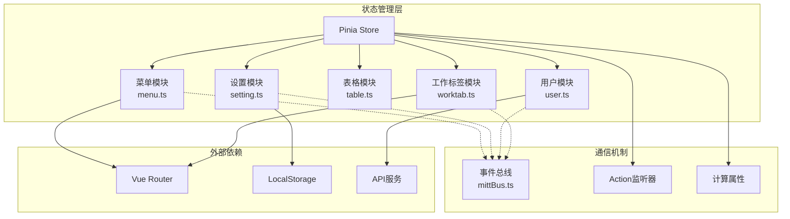
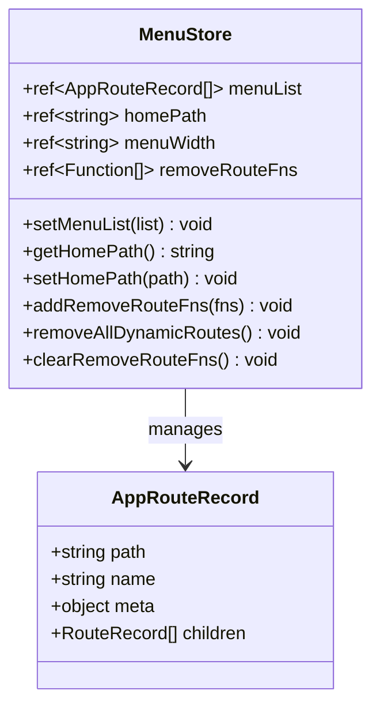
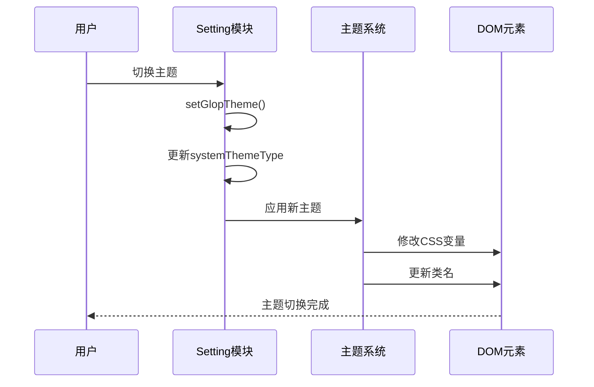
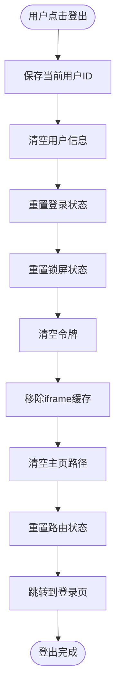
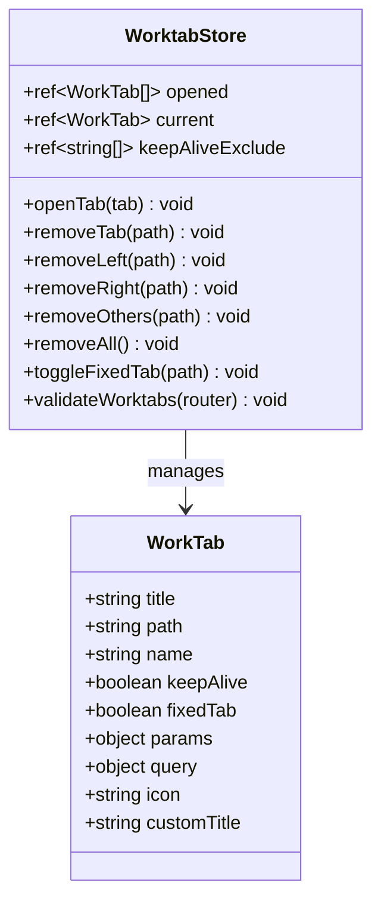
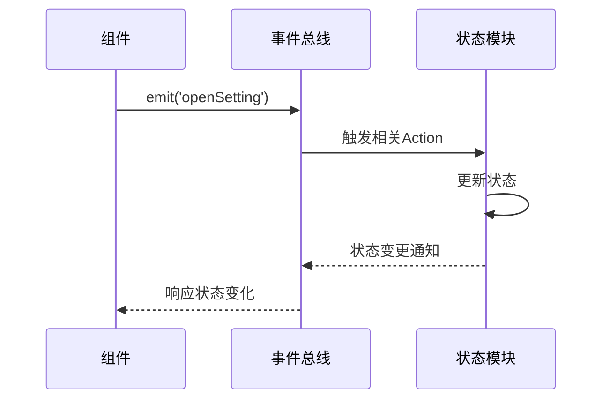
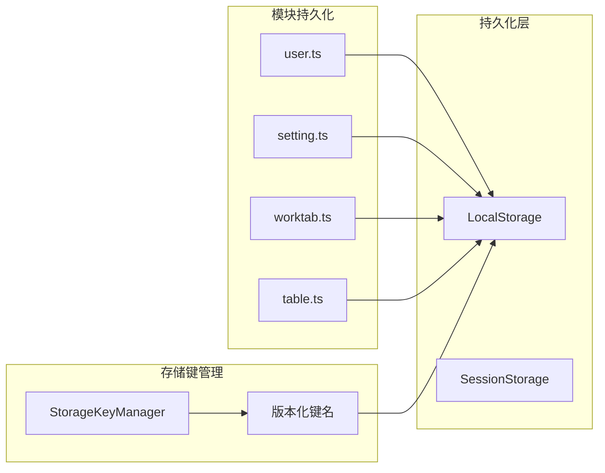
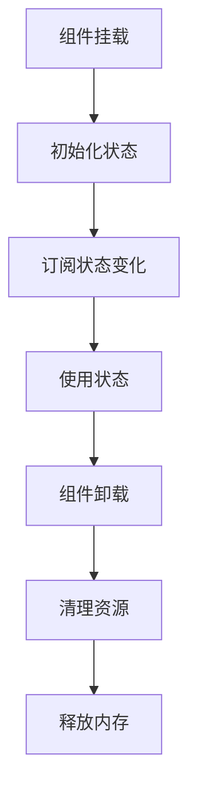

# 模块化状态管理

<cite>
**本文档引用的文件**
- [src/store/modules/menu.ts](file://src/store/modules/menu.ts)
- [src/store/modules/setting.ts](file://src/store/modules/setting.ts)
- [src/store/modules/table.ts](file://src/store/modules/table.ts)
- [src/store/modules/user.ts](file://src/store/modules/user.ts)
- [src/store/modules/worktab.ts](file://src/store/modules/worktab.ts)
- [src/store/index.ts](file://src/store/index.ts)
- [src/config/setting.ts](file://src/config/setting.ts)
- [src/enums/appEnum.ts](file://src/enums/appEnum.ts)
- [src/utils/sys/mittBus.ts](file://src/utils/sys/mittBus.ts)
- [src/hooks/core/useTable.ts](file://src/hooks/core/useTable.ts)
- [src/router/index.ts](file://src/router/index.ts)
- [src/utils/navigation/worktab.ts](file://src/utils/navigation/worktab.ts)
- [src/components/core/layouts/art-settings-panel/composables/useSettingsState.ts](file://src/components/core/layouts/art-settings-panel/composables/useSettingsState.ts)
- [src/types/store/index.ts](file://src/types/store/index.ts)
- [src/types/common/index.ts](file://src/types/common/index.ts)
</cite>

## 目录
1. [概述](#概述)
2. [架构设计](#架构设计)
3. [核心模块详解](#核心模块详解)
4. [模块间通信机制](#模块间通信机制)
5. [持久化策略](#持久化策略)
6. [最佳实践](#最佳实践)
7. [性能优化](#性能优化)
8. [测试策略](#测试策略)
9. [总结](#总结)

## 概述

Art Design Pro 采用基于 Pinia 的模块化状态管理架构，通过五个核心模块实现完整的状态管理解决方案。该架构遵循单一职责原则，每个模块负责特定的功能领域，通过清晰的接口和通信机制实现模块间的协作。

### 核心设计理念

- **模块化分离**：每个模块专注于特定的业务领域
- **类型安全**：全面的 TypeScript 类型定义
- **持久化支持**：自动状态持久化和跨版本兼容
- **响应式设计**：基于 Vue 3 的响应式状态管理
- **事件驱动**：支持模块间松耦合通信

## 架构设计



**图表来源**
- [src/store/index.ts](file://src/store/index.ts#L1-L53)
- [src/store/modules/menu.ts](file://src/store/modules/menu.ts#L1-L110)
- [src/store/modules/setting.ts](file://src/store/modules/setting.ts#L1-L451)
- [src/store/modules/table.ts](file://src/store/modules/table.ts#L1-L98)
- [src/store/modules/user.ts](file://src/store/modules/user.ts#L1-L236)
- [src/store/modules/worktab.ts](file://src/store/modules/worktab.ts#L1-L569)

## 核心模块详解

### Menu 模块 - 动态菜单管理

Menu 模块负责管理应用的动态菜单数据结构和路由系统联动。

#### 核心功能

- **菜单列表管理**：存储和管理菜单路由记录数组
- **首页路径配置**：动态设置和获取首页路径
- **路由注册管理**：注册动态路由并保存移除函数
- **路由清理机制**：登出时清理动态路由

#### 状态结构



**图表来源**
- [src/store/modules/menu.ts](file://src/store/modules/menu.ts#L41-L108)

#### 路由系统联动

Menu 模块与 Vue Router 紧密集成，通过以下机制实现联动：

1. **动态路由注册**：在用户登录后注册动态路由
2. **路由移除管理**：保存路由移除函数以便登出时清理
3. **首页路径管理**：根据菜单结构动态设置首页路径

**章节来源**
- [src/store/modules/menu.ts](file://src/store/modules/menu.ts#L1-L110)
- [src/utils/navigation/worktab.ts](file://src/utils/navigation/worktab.ts#L32-L68)

### Setting 模块 - 全局UI配置管理

Setting 模块提供完整的系统设置状态管理，涵盖布局、主题、动画等多个方面。

#### 功能分类

| 功能类别 | 配置项 | 描述 |
|---------|--------|------|
| **菜单布局** | menuType, menuOpenWidth, menuOpen | 控制菜单显示方式和尺寸 |
| **主题系统** | systemThemeType, systemThemeMode, menuThemeType | 管理亮色/暗色主题切换 |
| **界面显示** | showMenuButton, showWorkTab, showCrumbs | 控制界面元素的可见性 |
| **功能开关** | autoClose, uniqueOpened, colorWeak | 开启/关闭特定功能 |
| **样式配置** | boxBorderMode, pageTransition, customRadius | 自定义界面样式 |

#### 主题切换机制



**图表来源**
- [src/store/modules/setting.ts](file://src/store/modules/setting.ts#L179-L204)

**章节来源**
- [src/store/modules/setting.ts](file://src/store/modules/setting.ts#L1-L451)
- [src/config/setting.ts](file://src/config/setting.ts#L1-L110)

### Table 模块 - 表格状态统一管理

Table 模块专门管理表格相关的状态配置，提供统一的表格样式和行为控制。

#### 核心配置

- **表格尺寸**：紧凑、默认、宽松三种尺寸模式
- **视觉效果**：斑马纹、边框、表头背景开关
- **交互功能**：全屏模式控制

#### 状态管理模式

```mermaid
stateDiagram-v2
[*] --> Compact : setTableSize(COMPACT)
[*] --> Default : setTableSize(DEFAULT)
[*] --> Large : setTableSize(LARGE)
Compact --> WithZebra : setIsZebra(true)
Default --> WithBorder : setIsBorder(true)
Large --> FullScreen : setIsFullScreen(true)
WithZebra --> Default : setIsZebra(false)
WithBorder --> Default : setIsBorder(false)
FullScreen --> Default : setIsFullScreen(false)
Default --> [*]
```

**图表来源**
- [src/store/modules/table.ts](file://src/store/modules/table.ts#L48-L76)

**章节来源**
- [src/store/modules/table.ts](file://src/store/modules/table.ts#L1-L98)
- [src/hooks/core/useTable.ts](file://src/hooks/core/useTable.ts#L1-L737)

### User 模块 - 认证与用户信息管理

User 模块负责用户认证状态、个人信息和权限数据的管理。

#### 核心职责

- **认证状态管理**：登录/登出状态跟踪
- **用户信息存储**：用户基本信息和权限数据
- **令牌管理**：访问令牌和刷新令牌的生命周期
- **语言设置**：多语言切换支持
- **搜索历史**：用户搜索记录管理

#### 登出清理流程



**图表来源**
- [src/store/modules/user.ts](file://src/store/modules/user.ts#L139-L175)

**章节来源**
- [src/store/modules/user.ts](file://src/store/modules/user.ts#L1-L236)

### Worktab 模块 - 多标签页管理

Worktab 模块实现完整的多标签页功能，包括标签页的打开、切换、缓存和批量操作。

#### 核心特性

- **智能复用**：同路由名称的标签页复用机制
- **固定保护**：固定标签页不可关闭的保护机制
- **KeepAlive 管理**：动态的组件缓存排除管理
- **批量操作**：支持左侧、右侧、其他、全部关闭操作

#### 标签页状态管理



**图表来源**
- [src/store/modules/worktab.ts](file://src/store/modules/worktab.ts#L47-L560)

#### 缓存管理机制

Worktab 模块实现了智能的缓存管理策略：

1. **KeepAlive 排除**：标签页关闭时自动加入缓存排除列表
2. **动态复用**：相同路由名称的标签页复用现有实例
3. **固定标签保护**：固定标签页的特殊缓存策略

**章节来源**
- [src/store/modules/worktab.ts](file://src/store/modules/worktab.ts#L1-L569)

## 模块间通信机制

### 事件总线通信

项目使用基于 mitt 的类型安全事件总线实现模块间的松耦合通信。

#### 事件定义

```typescript
type Events = {
  triggerFireworks: string | undefined
  openSetting: void
  openSearchDialog: void
  openChat: void
  openLockScreen: void
}
```

#### 通信模式



**图表来源**
- [src/utils/sys/mittBus.ts](file://src/utils/sys/mittBus.ts#L47-L61)

### Action 监听器

Pinia 提供了强大的 Action 监听器机制，允许模块监听其他模块的状态变化。

#### 监听器使用示例

```typescript
// 在 Setting 模块中监听用户状态变化
settingStore.$onAction(({ name, args, after, onError }) => {
  if (name === 'setGlopTheme') {
    after((result) => {
      // 主题切换后的处理逻辑
    });
  }
});
```

**章节来源**
- [src/utils/sys/mittBus.ts](file://src/utils/sys/mittBus.ts#L1-L64)

## 持久化策略

### 存储架构



**图表来源**
- [src/store/index.ts](file://src/store/index.ts#L28-L45)

### 版本化存储策略

系统采用版本化的存储键管理，确保跨版本的数据兼容性：

- **键名格式**：`sys-v{version}-{moduleId}`
- **自动迁移**：支持旧版本数据到新版本的自动迁移
- **序列化配置**：JSON 序列化和反序列化配置

**章节来源**
- [src/store/index.ts](file://src/store/index.ts#L1-L53)
- [src/config/setting.ts](file://src/config/setting.ts#L1-L110)

## 最佳实践

### 模块命名规范

1. **模块命名**：使用小写字母和连字符，如 `menu-store.ts`
2. **导出命名**：使用 PascalCase，如 `useMenuStore`
3. **状态属性**：使用驼峰命名法
4. **常量定义**：使用 UPPER_SNAKE_CASE

### 代码组织建议

#### 模块结构模板

```typescript
// 模块头部注释
/**
 * 模块功能描述
 * @module store/modules/moduleName
 */

import { defineStore } from 'pinia'
import { ref, computed } from 'vue'

// 类型定义
export interface ModuleState {
  // 状态属性定义
}

// 模块定义
export const useModuleNameStore = defineStore('moduleName', () => {
  // 状态定义
  const state = ref<ModuleState>({ /* 初始状态 */ })
  
  // 计算属性
  const computedProperty = computed(() => { /* 计算逻辑 */ })
  
  // 方法定义
  const actionMethod = (params: any) => { /* 方法逻辑 */ }
  
  return {
    state,
    computedProperty,
    actionMethod
  }
})
```

### 类型安全实践

#### 接口定义

```typescript
// 状态接口
export interface ModuleState {
  property1: string
  property2: number
  property3: boolean
}

// Action 参数接口
export interface ActionParams {
  param1: string
  param2?: number
}

// 返回值接口
export interface ActionResult {
  success: boolean
  message: string
  data?: any
}
```

**章节来源**
- [src/types/store/index.ts](file://src/types/store/index.ts#L1-L158)
- [src/types/common/index.ts](file://src/types/common/index.ts#L1-L96)

## 性能优化

### 响应式优化

1. **计算属性缓存**：合理使用 `computed` 缓存复杂计算结果
2. **状态分割**：将大型状态对象分割为更小的独立状态
3. **懒加载**：按需加载模块状态

### 内存管理



### 缓存策略

- **智能缓存**：基于使用频率的缓存策略
- **过期清理**：定期清理过期的缓存数据
- **内存监控**：监控内存使用情况

## 测试策略

### 单元测试

#### 模块测试模板

```typescript
import { describe, it, expect, vi } from 'vitest'
import { setActivePinia, createPinia } from 'pinia'
import { useTestModule } from '@/store/modules/testModule'

describe('Test Module', () => {
  beforeEach(() => {
    setActivePinia(createPinia())
  })

  it('should initialize state correctly', () => {
    const store = useTestModule()
    expect(store.state).toBeDefined()
  })

  it('should update state properly', () => {
    const store = useTestModule()
    store.updateState('newValue')
    expect(store.state).toBe('newValue')
  })
})
```

### 集成测试

#### 模块间通信测试

```typescript
it('should communicate between modules', async () => {
  const userStore = useUserStore()
  const settingStore = useSettingStore()
  
  // 模拟用户登录
  userStore.setLoginStatus(true)
  
  // 验证设置模块响应
  expect(settingStore.isDark).toBe(false)
})
```

### 端到端测试

- **路由导航测试**：测试模块在路由变化时的行为
- **状态持久化测试**：验证刷新后状态保持正确
- **错误处理测试**：测试异常情况下的状态恢复

## 总结

Art Design Pro 的模块化状态管理架构体现了现代前端应用的最佳实践：

### 核心优势

1. **清晰的职责分离**：每个模块专注特定功能领域
2. **强类型支持**：全面的 TypeScript 类型定义
3. **持久化能力**：自动状态持久化和跨版本兼容
4. **事件驱动通信**：模块间松耦合的通信机制
5. **性能优化**：响应式状态管理和智能缓存策略

### 技术特色

- **基于 Pinia**：现代化的状态管理库
- **模块化设计**：遵循单一职责原则
- **类型安全**：完整的 TypeScript 支持
- **事件总线**：灵活的模块间通信
- **持久化策略**：智能的本地存储管理

### 应用价值

这套模块化状态管理方案不仅适用于当前项目，还可以作为企业级应用状态管理的参考实现，为开发者提供了可扩展、可维护的状态管理解决方案。

通过合理的模块划分、清晰的接口设计和完善的通信机制，该架构能够有效支撑复杂业务场景的需求，同时保持代码的可读性和可测试性。