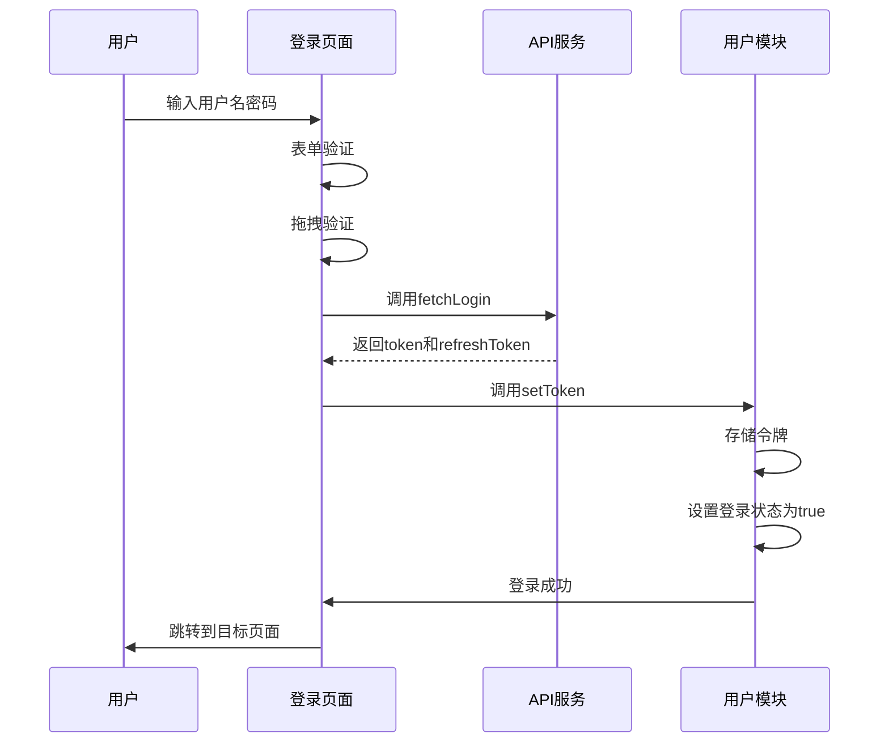
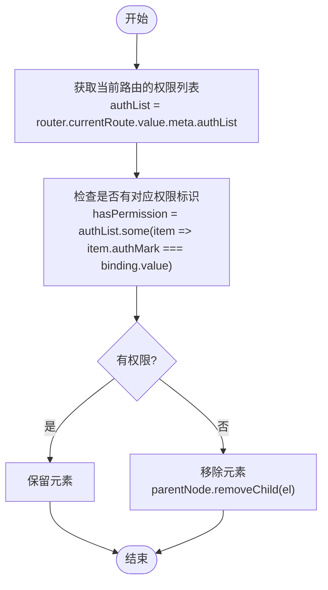
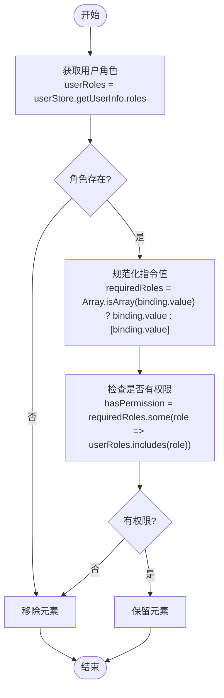
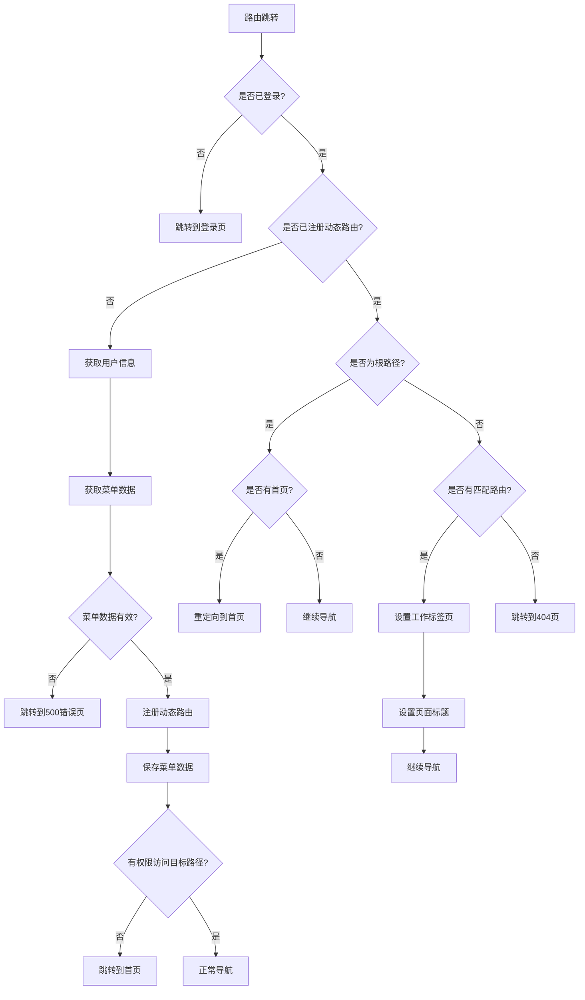
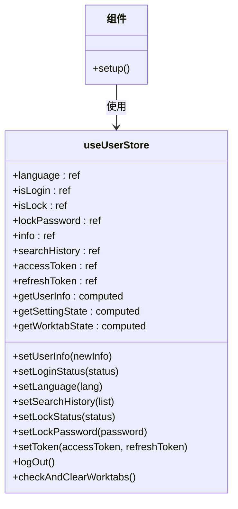

# 用户模块 (user)

<cite>
**本文档引用文件**  
- [user.ts](file://src/store/modules/user.ts)
- [auth.ts](file://src/api/auth.ts)
- [beforeEach.ts](file://src/router/guards/beforeEach.ts)
- [auth.ts](file://src/directives/core/auth.ts)
- [roles.ts](file://src/directives/core/roles.ts)
- [index.vue](file://src/views/auth/login/index.vue)
- [api.d.ts](file://src/types/api/api.d.ts)
- [storage.ts](file://src/utils/storage/storage.ts)
</cite>

## 目录
1. [用户模块概述](#用户模块概述)
2. [用户状态管理](#用户状态管理)
3. [登录与登出流程](#登录与登出流程)
4. [权限控制机制](#权限控制机制)
5. [权限指令实现](#权限指令实现)
6. [路由守卫与权限验证](#路由守卫与权限验证)
7. [使用示例](#使用示例)

## 用户模块概述

用户模块是系统认证与权限体系的核心组件，负责管理用户登录状态、基本信息存储、Token 持久化与刷新、角色权限列表维护等关键功能。该模块通过 Pinia 状态管理库实现，提供了完整的用户会话管理解决方案。

**Section sources**
- [user.ts](file://src/store/modules/user.ts#L1-L33)

## 用户状态管理

用户模块通过 `useUserStore` 状态管理器集中管理用户相关状态，包括登录状态、用户信息、访问令牌、刷新令牌、语言设置等。状态数据通过 localStorage 持久化存储，确保页面刷新后用户状态不丢失。

核心状态包括：
- **登录状态 (isLogin)**：布尔值，标识用户是否已登录
- **用户信息 (info)**：存储用户基本信息，包括用户ID、用户名、邮箱、头像、角色列表等
- **访问令牌 (accessToken)**：用于API请求的身份验证令牌
- **刷新令牌 (refreshToken)**：用于获取新的访问令牌
- **语言设置 (language)**：当前用户选择的语言
- **锁屏状态 (isLock)**：标识用户是否启用了锁屏功能

状态管理器还提供了相应的计算属性和方法，如 `getUserInfo` 计算属性用于获取用户信息，`setLoginStatus` 方法用于设置登录状态等。

**Section sources**
- [user.ts](file://src/store/modules/user.ts#L50-L235)

## 登录与登出流程

### 登录流程

用户登录流程通过登录页面组件和API调用协同完成：

1. 用户在登录页面输入用户名和密码
2. 前端进行表单验证和拖拽验证
3. 调用 `fetchLogin` API 发送登录请求
4. 服务器验证成功后返回访问令牌和刷新令牌
5. 前端调用 `useUserStore.setToken` 和 `setLoginStatus` 方法存储令牌并设置登录状态
6. 跳转到目标页面或首页

登录成功后，系统会获取用户信息并存储到状态管理器中，同时根据用户角色和权限动态生成菜单和路由。

### 登出流程

登出流程通过 `logOut` 方法实现，执行以下操作：
- 保存当前用户ID，用于判断是否为同一用户重新登录
- 清空用户信息
- 重置登录状态
- 重置锁屏状态
- 清空访问令牌和刷新令牌
- 移除iframe路由缓存
- 重置路由状态
- 跳转到登录页面

登出时会保留工作台标签页，以便在用户重新登录时判断是否为同一用户，从而决定是否清空标签页。



**Diagram sources**
- [index.vue](file://src/views/auth/login/index.vue#L204-L243)
- [user.ts](file://src/store/modules/user.ts#L143-L176)

**Section sources**
- [index.vue](file://src/views/auth/login/index.vue#L204-L256)
- [user.ts](file://src/store/modules/user.ts#L143-L176)
- [auth.ts](file://src/api/auth.ts#L8-L14)

## 权限控制机制

系统采用基于角色和权限标识的双重权限控制机制，实现页面级和按钮级的访问控制。

### 角色权限

用户角色存储在用户信息的 `roles` 字段中，系统预定义了多种角色，如：
- `R_SUPER`：超级管理员
- `R_ADMIN`：管理员
- `R_USER`：普通用户

角色权限用于粗粒度的访问控制，如控制特定功能模块的访问。

### 按钮权限

按钮权限存储在用户信息的 `buttons` 字段中，表示用户具有的具体操作权限，如 'add'、'edit'、'delete' 等。这些权限用于细粒度的按钮级控制。

权限数据在用户登录后通过 `fetchGetUserInfo` API 获取，并存储在 `useUserStore` 中，供权限指令和路由守卫使用。

**Section sources**
- [api.d.ts](file://src/types/api/api.d.ts#L78-L85)
- [user.ts](file://src/store/modules/user.ts#L62-L68)

## 权限指令实现

系统提供了两个核心权限指令：`v-auth` 和 `v-roles`，用于在模板中声明式地控制元素的显示。

### v-auth 指令

`v-auth` 指令基于权限标识进行控制，适用于后端权限控制模式。指令会根据当前路由的 meta.authList 中的权限列表验证用户权限。



**Diagram sources**
- [auth.ts](file://src/directives/core/auth.ts#L42-L53)

### v-roles 指令

`v-roles` 指令基于用户角色进行控制，支持单个角色或多个角色（满足其一即可）。指令会检查用户是否拥有指定角色中的任意一个。



**Diagram sources**
- [roles.ts](file://src/directives/core/roles.ts#L54-L73)

**Section sources**
- [auth.ts](file://src/directives/core/auth.ts#L42-L64)
- [roles.ts](file://src/directives/core/roles.ts#L54-L84)

## 路由守卫与权限验证

路由全局前置守卫 `beforeEach` 是权限验证的核心组件，负责在路由跳转前进行权限检查。

### 守卫工作流程

1. **登录状态检查**：检查用户是否已登录，未登录则跳转到登录页
2. **动态路由注册**：首次访问时获取用户信息和菜单数据，动态注册路由
3. **权限验证**：验证目标路径的访问权限
4. **页面设置**：设置页面标题和工作标签页

### 登录状态验证

当用户访问需要权限的页面时，守卫会检查登录状态。如果用户未登录且访问的不是登录页或静态路由，则会重定向到登录页，并携带当前路由作为 redirect 参数。

### 动态路由处理

系统支持动态路由注册，根据用户权限动态生成菜单和路由。在用户首次访问时，守卫会：
1. 显示加载状态
2. 获取用户信息
3. 获取菜单数据
4. 验证菜单数据
5. 注册动态路由
6. 保存菜单数据到 store
7. 验证目标路径权限



**Diagram sources**
- [beforeEach.ts](file://src/router/guards/beforeEach.ts#L118-L275)

**Section sources**
- [beforeEach.ts](file://src/router/guards/beforeEach.ts#L118-L361)

## 使用示例

### 在组件中使用 useUserStore 进行权限判断



**Diagram sources**
- [user.ts](file://src/store/modules/user.ts#L50-L235)

在Vue组件中使用权限判断的示例：

```typescript
import { useUserStore } from '@/store/modules/user'

// 在组件中
const userStore = useUserStore()

// 判断用户是否具有特定角色
const hasAdminRole = userStore.getUserInfo.roles?.includes('R_ADMIN')

// 判断用户是否具有特定按钮权限
const canEdit = userStore.getUserInfo.buttons?.includes('edit')

// 监听登录状态变化
watch(() => userStore.isLogin, (isLoggedIn) => {
  if (isLoggedIn) {
    console.log('用户已登录')
  } else {
    console.log('用户已登出')
  }
})
```

### 权限指令使用示例

```vue
<template>
  <!-- 基于权限标识的按钮控制 -->
  <el-button v-auth="'add'">新增</el-button>
  <el-button v-auth="'edit'">编辑</el-button>
  <el-button v-auth="'delete'">删除</el-button>

  <!-- 基于角色的按钮控制 -->
  <el-button v-roles="'R_SUPER'">超级管理员功能</el-button>
  <el-button v-roles="['R_SUPER', 'R_ADMIN']">管理员功能</el-button>
  <div v-roles="['R_SUPER', 'R_ADMIN', 'R_USER']">
    所有登录用户可见的内容
  </div>
</template>
```

**Section sources**
- [user.ts](file://src/store/modules/user.ts#L50-L235)
- [auth.ts](file://src/directives/core/auth.ts#L61-L64)
- [roles.ts](file://src/directives/core/roles.ts#L82-L85)