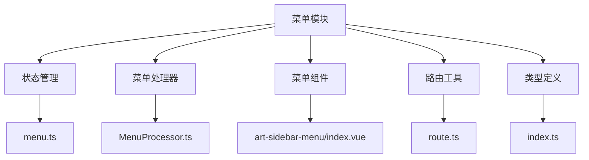
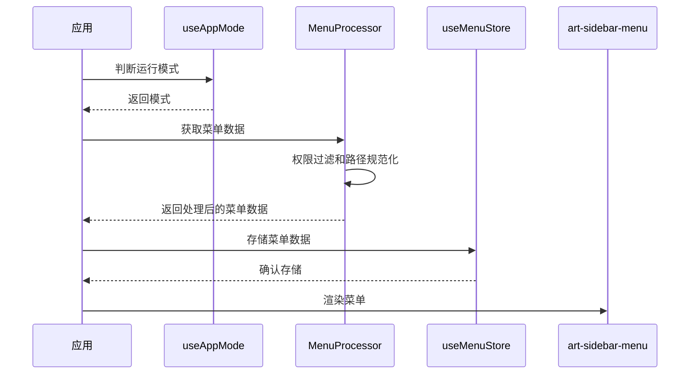
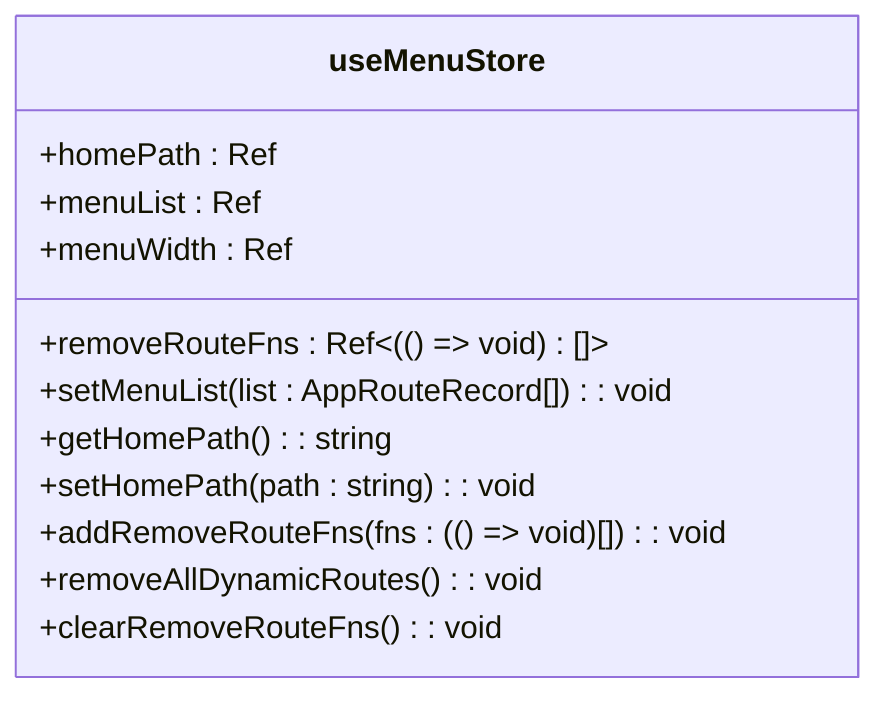
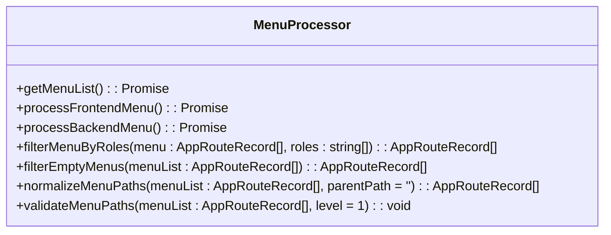
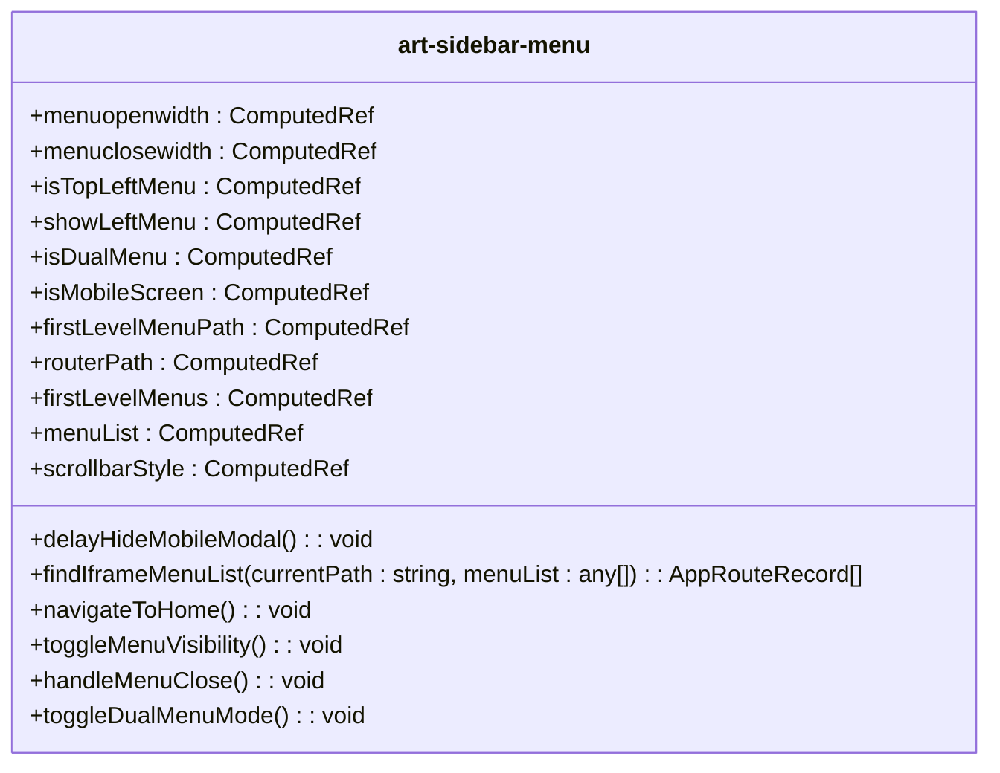
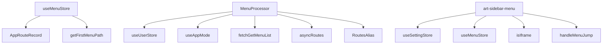

# 菜单模块 (menu)

<cite>
**本文档引用文件**  
- [menu.ts](file://src/store/modules/menu.ts)
- [MenuProcessor.ts](file://src/router/core/MenuProcessor.ts)
- [index.ts](file://src/router/index.ts)
- [router.ts](file://src/utils/router.ts)
- [route.ts](file://src/utils/navigation/route.ts)
- [art-sidebar-menu/index.vue](file://src/components/core/layouts/art-menus/art-sidebar-menu/index.vue)
- [system.ts](file://src/router/modules/system.ts)
- [user.ts](file://src/store/modules/user.ts)
- [useAppMode.ts](file://src/hooks/core/useAppMode.ts)
- [beforeEach.ts](file://src/router/guards/beforeEach.ts)
- [RouteRegistry.ts](file://src/router/core/RouteRegistry.ts)
</cite>

## 目录
1. [简介](#简介)
2. [项目结构](#项目结构)
3. [核心组件](#核心组件)
4. [架构概述](#架构概述)
5. [详细组件分析](#详细组件分析)
6. [依赖分析](#依赖分析)
7. [性能考虑](#性能考虑)
8. [故障排除指南](#故障排除指南)
9. [结论](#结论)

## 简介
本文档深入分析了菜单模块的实现机制，重点阐述其如何管理动态路由生成的菜单树结构。文档详细说明了该模块与路由模块的交互方式，如何通过路由元信息（meta）构建前端菜单数据，以及菜单折叠状态、当前激活项、缓存路径的管理策略。同时提供了在组件中使用 useMenuStore 获取菜单数据的代码示例，并展示了如何动态更新菜单。最后，文档包含了常见问题如菜单不显示、权限错乱的排查方法。

## 项目结构
菜单模块主要由以下几个部分组成：
- **store/modules/menu.ts**: 菜单状态管理模块，负责菜单数据和动态路由的状态管理。
- **router/core/MenuProcessor.ts**: 菜单处理器，负责菜单数据的获取、过滤和处理。
- **components/core/layouts/art-menus/art-sidebar-menu/index.vue**: 左侧菜单组件，负责菜单的渲染和交互。
- **utils/navigation/route.ts**: 路由工具模块，提供路由处理和菜单路径相关的工具函数。
- **types/router/index.ts**: 路由类型定义模块，提供路由相关的类型定义。

**Diagram sources**
- [menu.ts](file://src/store/modules/menu.ts)
- [MenuProcessor.ts](file://src/router/core/MenuProcessor.ts)
- [art-sidebar-menu/index.vue](file://src/components/core/layouts/art-menus/art-sidebar-menu/index.vue)
- [route.ts](file://src/utils/navigation/route.ts)
- [index.ts](file://src/types/router/index.ts)

**Section sources**
- [menu.ts](file://src/store/modules/menu.ts)
- [MenuProcessor.ts](file://src/router/core/MenuProcessor.ts)
- [art-sidebar-menu/index.vue](file://src/components/core/layouts/art-menus/art-sidebar-menu/index.vue)
- [route.ts](file://src/utils/navigation/route.ts)
- [index.ts](file://src/types/router/index.ts)

## 核心组件

### 菜单状态管理
菜单状态管理模块 `useMenuStore` 负责管理应用的菜单列表、首页路径、菜单宽度和动态路由移除函数。该模块通过 Pinia 实现状态管理，提供了设置菜单列表、获取首页路径、设置主页路径、添加路由移除函数、移除所有动态路由和清空路由移除函数等方法。

**Section sources**
- [menu.ts](file://src/store/modules/menu.ts)

### 菜单处理器
菜单处理器 `MenuProcessor` 负责菜单数据的获取、过滤和处理。它根据应用模式（前端模式或后端模式）获取菜单数据，并进行权限过滤和路径规范化处理。前端模式下，菜单数据从 `asyncRoutes` 获取，并根据用户角色进行过滤；后端模式下，菜单数据通过 API 接口 `fetchGetMenuList` 获取。

**Section sources**
- [MenuProcessor.ts](file://src/router/core/MenuProcessor.ts)

### 菜单组件
左侧菜单组件 `art-sidebar-menu` 负责菜单的渲染和交互。它根据菜单类型（左侧菜单、顶部左侧菜单或双列菜单）和当前路由状态，动态显示相应的菜单项。组件还支持移动端模式下的菜单折叠和展开。

**Section sources**
- [art-sidebar-menu/index.vue](file://src/components/core/layouts/art-menus/art-sidebar-menu/index.vue)

## 架构概述

### 菜单生成流程
菜单生成流程如下：
1. 应用启动时，通过 `useAppMode` 判断当前运行模式（前端模式或后端模式）。
2. 根据运行模式，调用 `MenuProcessor` 的 `getMenuList` 方法获取菜单数据。
3. 对获取的菜单数据进行权限过滤和路径规范化处理。
4. 将处理后的菜单数据存储到 `useMenuStore` 中。
5. 菜单组件 `art-sidebar-menu` 从 `useMenuStore` 获取菜单数据并渲染。

**Diagram sources**
- [useAppMode.ts](file://src/hooks/core/useAppMode.ts)
- [MenuProcessor.ts](file://src/router/core/MenuProcessor.ts)
- [menu.ts](file://src/store/modules/menu.ts)
- [art-sidebar-menu/index.vue](file://src/components/core/layouts/art-menus/art-sidebar-menu/index.vue)

## 详细组件分析

### 菜单状态管理分析
`useMenuStore` 模块通过 Pinia 实现状态管理，提供了以下主要功能：
- **菜单列表存储和管理**: 通过 `setMenuList` 方法设置菜单列表，`menuList` 为响应式数据。
- **首页路径配置**: 通过 `setHomePath` 和 `getHomePath` 方法设置和获取首页路径。
- **动态路由注册和移除**: 通过 `addRemoveRouteFns` 和 `removeAllDynamicRoutes` 方法管理动态路由的移除函数。
- **菜单宽度配置**: 通过 `menuWidth` 管理菜单宽度。

**Diagram sources**
- [menu.ts](file://src/store/modules/menu.ts)

### 菜单处理器分析
`MenuProcessor` 类负责菜单数据的获取、过滤和处理，主要方法包括：
- **getMenuList**: 获取菜单数据，根据运行模式调用 `processFrontendMenu` 或 `processBackendMenu`。
- **processFrontendMenu**: 处理前端模式下的菜单数据，根据用户角色进行过滤。
- **processBackendMenu**: 处理后端模式下的菜单数据，通过 API 接口获取。
- **filterMenuByRoles**: 根据角色过滤菜单，递归处理子菜单。
- **filterEmptyMenus**: 递归过滤空菜单项，保留有子菜单、外链或有效组件的菜单项。
- **normalizeMenuPaths**: 规范化菜单路径，将相对路径转换为完整路径。
- **validateMenuPaths**: 验证菜单路径配置，检测非一级菜单是否错误使用了 `/` 开头的路径。

**Diagram sources**
- [MenuProcessor.ts](file://src/router/core/MenuProcessor.ts)

### 菜单组件分析
`art-sidebar-menu` 组件负责菜单的渲染和交互，主要功能包括：
- **菜单类型判断**: 根据 `menuType` 判断菜单类型（左侧菜单、顶部左侧菜单或双列菜单）。
- **移动端模式支持**: 根据窗口宽度判断是否为移动端模式，支持菜单的折叠和展开。
- **菜单数据获取**: 从 `useMenuStore` 获取菜单数据，并根据当前路由状态动态显示相应的菜单项。
- **路由跳转处理**: 通过 `handleMenuJump` 方法处理菜单项的点击事件，实现路由跳转。

**Diagram sources**
- [art-sidebar-menu/index.vue](file://src/components/core/layouts/art-menus/art-sidebar-menu/index.vue)

## 依赖分析

### 组件依赖关系
菜单模块的组件依赖关系如下：
- `useMenuStore` 依赖于 `AppRouteRecord` 类型定义和 `getFirstMenuPath` 工具函数。
- `MenuProcessor` 依赖于 `useUserStore`、`useAppMode`、`fetchGetMenuList` API 接口、`asyncRoutes` 和 `RoutesAlias`。
- `art-sidebar-menu` 依赖于 `useSettingStore`、`useMenuStore`、`isIframe` 和 `handleMenuJump` 工具函数。

**Diagram sources**
- [menu.ts](file://src/store/modules/menu.ts)
- [MenuProcessor.ts](file://src/router/core/MenuProcessor.ts)
- [art-sidebar-menu/index.vue](file://src/components/core/layouts/art-menus/art-sidebar-menu/index.vue)

### 外部依赖
菜单模块还依赖于以下外部模块：
- **Pinia**: 用于状态管理。
- **Vue Router**: 用于路由管理。
- **VueUse**: 用于窗口尺寸监听和定时器。
- **Element Plus**: 用于 UI 组件。

**Section sources**
- [menu.ts](file://src/store/modules/menu.ts)
- [MenuProcessor.ts](file://src/router/core/MenuProcessor.ts)
- [art-sidebar-menu/index.vue](file://src/components/core/layouts/art-menus/art-sidebar-menu/index.vue)

## 性能考虑
菜单模块在设计时考虑了以下性能优化：
- **响应式数据**: 使用 Pinia 的响应式数据，确保菜单数据的高效更新和渲染。
- **计算属性**: 使用 Vue 的计算属性，避免重复计算，提高性能。
- **路径规范化**: 在菜单数据获取后立即进行路径规范化处理，避免在渲染时进行复杂的路径计算。
- **权限过滤**: 在菜单数据获取时进行权限过滤，减少无效菜单项的渲染。

## 故障排除指南

### 菜单不显示
如果菜单不显示，可能的原因包括：
- **菜单数据未获取**: 检查 `MenuProcessor` 的 `getMenuList` 方法是否正确获取了菜单数据。
- **权限过滤问题**: 检查用户角色是否正确，确保用户有权限访问菜单项。
- **路径配置错误**: 检查菜单项的路径配置，确保非一级菜单的路径不以 `/` 开头。

**Section sources**
- [MenuProcessor.ts](file://src/router/core/MenuProcessor.ts)
- [menu.ts](file://src/store/modules/menu.ts)

### 权限错乱
如果权限错乱，可能的原因包括：
- **角色信息错误**: 检查 `useUserStore` 中的用户角色信息是否正确。
- **权限过滤逻辑错误**: 检查 `MenuProcessor` 的 `filterMenuByRoles` 方法，确保权限过滤逻辑正确。
- **缓存问题**: 清除浏览器缓存，重新登录系统。

**Section sources**
- [user.ts](file://src/store/modules/user.ts)
- [MenuProcessor.ts](file://src/router/core/MenuProcessor.ts)

## 结论
菜单模块通过 `useMenuStore`、`MenuProcessor` 和 `art-sidebar-menu` 等组件，实现了动态路由生成的菜单树结构的管理。模块支持前端和后端两种权限控制模式，能够根据用户角色进行权限过滤，并通过路由元信息（meta）构建前端菜单数据。菜单折叠状态、当前激活项、缓存路径的管理策略也得到了有效实现。通过使用 `useMenuStore`，开发者可以方便地获取和更新菜单数据，确保菜单的动态性和灵活性。常见问题如菜单不显示、权限错乱的排查方法也提供了有效的解决方案，确保系统的稳定运行。