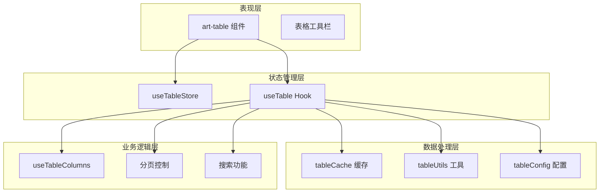
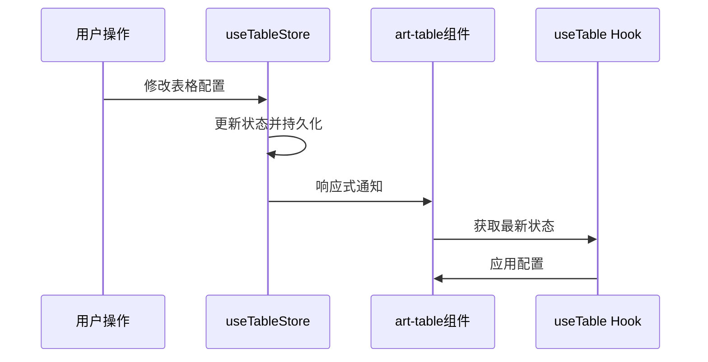
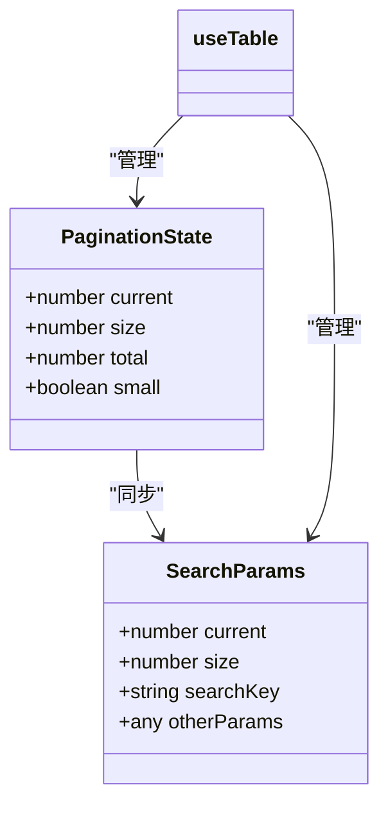
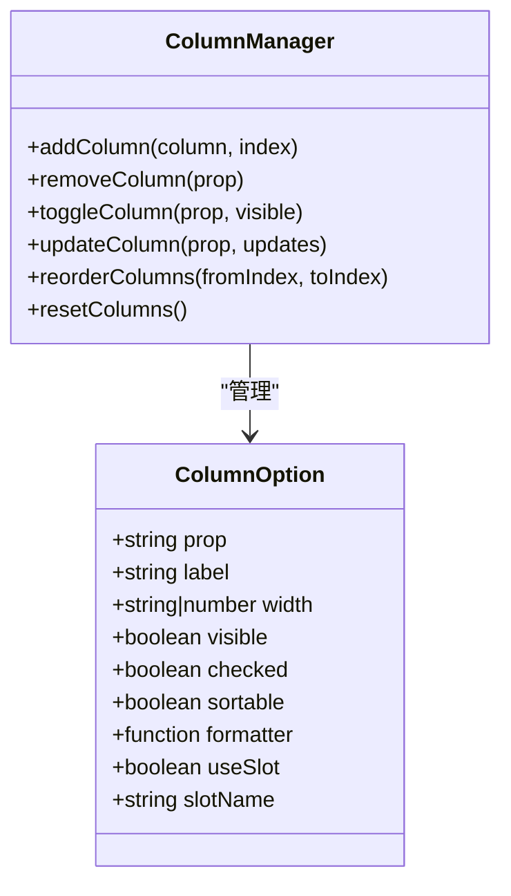
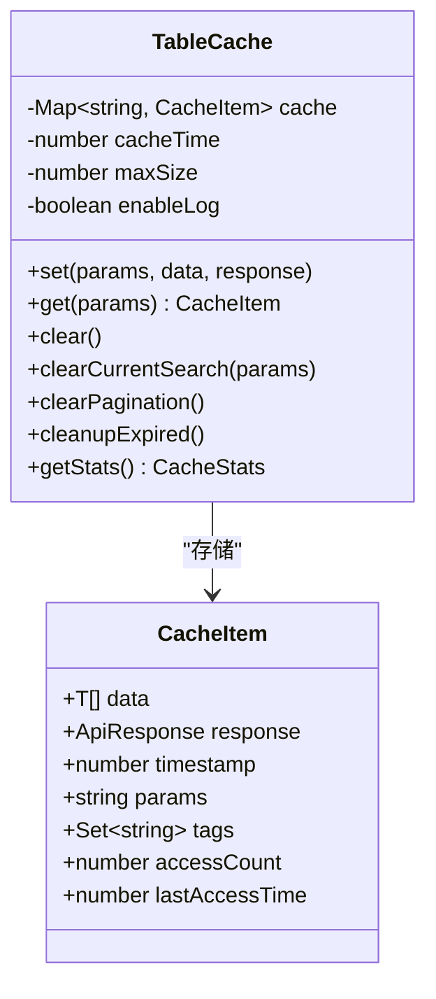
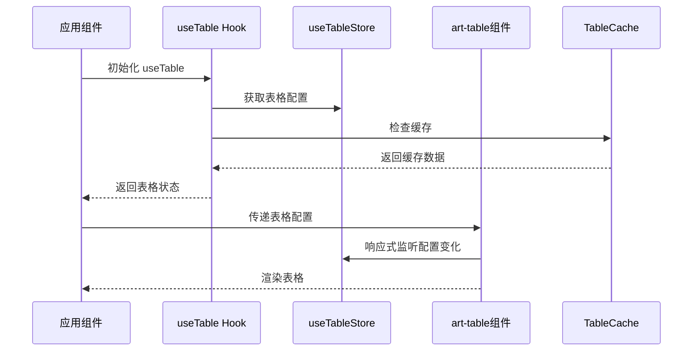
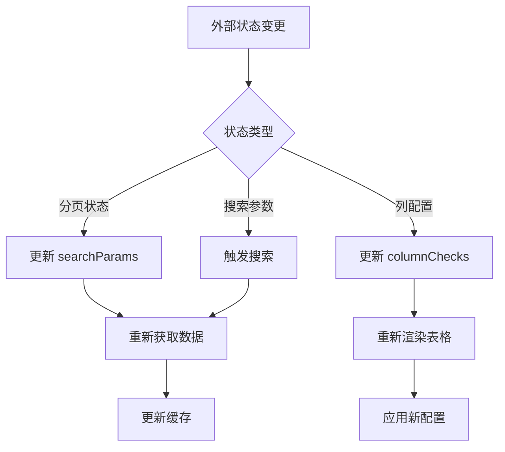
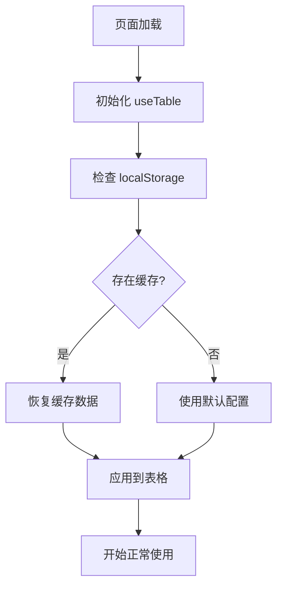

# 表格模块 (table)

<cite>
**本文档中引用的文件**
- [useTable.ts](file://src/hooks/core/useTable.ts)
- [table.ts](file://src/store/modules/table.ts)
- [tableCache.ts](file://src/utils/table/tableCache.ts)
- [tableConfig.ts](file://src/utils/table/tableConfig.ts)
- [tableUtils.ts](file://src/utils/table/tableUtils.ts)
- [useTableColumns.ts](file://src/hooks/core/useTableColumns.ts)
- [art-table/index.vue](file://src/components/core/tables/art-table/index.vue)
- [basic.vue](file://src/views/examples/tables/basic.vue)
- [index.vue](file://src/views/examples/tables/index.vue)
- [tree.vue](file://src/views/examples/tables/tree.vue)
- [index.ts](file://src/types/component/index.ts)
</cite>

## 目录
1. [概述](#概述)
2. [核心架构](#核心架构)
3. [表格状态管理](#表格状态管理)
4. [分页参数管理](#分页参数管理)
5. [列配置管理](#列配置管理)
6. [缓存系统](#缓存系统)
7. [与 art-table 组件的协同](#与-art-table-组件的协同)
8. [状态共享与隔离](#状态共享与隔离)
9. [高级缓存策略](#高级缓存策略)
10. [最佳实践](#最佳实践)

## 概述

表格模块是 Art Design Pro 框架中的核心功能模块，提供了一套完整的企业级表格数据管理解决方案。该模块通过 `useTable` Hook 和 `useTableStore` 状态管理，实现了对表格状态的统一管理和外部控制，支持复杂的业务场景需求。

### 主要特性

- **统一状态管理**：通过 Pinia Store 实现表格显示配置的持久化管理
- **智能缓存系统**：基于 LRU 策略的高性能缓存机制
- **灵活的列配置**：支持动态显示/隐藏、排序、宽度记忆等功能
- **多场景刷新策略**：针对不同业务场景提供专门的刷新方法
- **外部控制能力**：支持表格状态的外部控制与内部同步

## 核心架构

表格模块采用分层架构设计，包含以下核心组件：



**图表来源**
- [art-table/index.vue](file://src/components/core/tables/art-table/index.vue#L1-L50)
- [useTable.ts](file://src/hooks/core/useTable.ts#L1-L100)
- [table.ts](file://src/store/modules/table.ts#L1-L50)

## 表格状态管理

### useTableStore 状态管理

`useTableStore` 是表格显示配置的状态管理模块，提供以下核心功能：

#### 核心状态配置

| 状态属性 | 类型 | 默认值 | 描述 |
|---------|------|--------|------|
| tableSize | TableSizeEnum | DEFAULT | 表格尺寸配置（紧凑/默认/宽松） |
| isZebra | boolean | false | 斑马纹显示开关 |
| isBorder | boolean | false | 边框显示开关 |
| isHeaderBackground | boolean | false | 表头背景显示开关 |
| isFullScreen | boolean | false | 全屏模式开关 |

#### 状态持久化

表格状态通过 Pinia 的持久化功能存储在 `localStorage` 中，存储键为 `table`，确保用户配置跨页面保持。

**章节来源**
- [table.ts](file://src/store/modules/table.ts#L30-L98)

### 状态同步机制



**图表来源**
- [art-table/index.vue](file://src/components/core/tables/art-table/index.vue#L89-L95)
- [table.ts](file://src/store/modules/table.ts#L78-L90)

## 分页参数管理

### 分页状态结构

表格模块通过 `searchParams` 和 `pagination` 两个响应式对象管理分页状态：



**图表来源**
- [useTable.ts](file://src/hooks/core/useTable.ts#L214-L227)

### 分页参数配置

| 参数 | 类型 | 默认值 | 描述 |
|------|------|--------|------|
| current | number | 1 | 当前页码 |
| size | number | 10 | 每页条数 |
| total | number | 0 | 总条数 |

### 移动端适配

表格模块自动检测屏幕宽度，为移动端提供优化的分页布局：

- **移动端 (< 768px)**: `prev, pager, next, sizes, jumper, total`
- **平板端 (768px-1024px)**: `prev, pager, next, jumper, total`
- **桌面端 (> 1024px)**: `total, prev, pager, next, sizes, jumper`

**章节来源**
- [useTable.ts](file://src/hooks/core/useTable.ts#L222-L227)
- [art-table/index.vue](file://src/components/core/tables/art-table/index.vue#L154-L178)

## 列配置管理

### useTableColumns 功能

`useTableColumns` 提供了完整的列配置管理能力：

#### 核心功能

1. **动态显示控制**: 支持运行时动态显示/隐藏列
2. **列排序**: 支持拖拽或编程方式重新排列列顺序
3. **列配置管理**: 支持新增、删除、更新列配置
4. **特殊列支持**: 自动处理 selection、expand、index 等特殊列

#### 列配置接口



**图表来源**
- [useTableColumns.ts](file://src/hooks/core/useTableColumns.ts#L82-L136)
- [index.ts](file://src/types/component/index.ts#L49-L89)

### 列状态持久化

列配置通过 `columnChecks` 实现状态持久化，支持：

- **显示状态记忆**: 记住用户的列显示偏好
- **列顺序保持**: 保持用户调整的列顺序
- **配置重置**: 提供恢复默认配置的功能

**章节来源**
- [useTableColumns.ts](file://src/hooks/core/useTableColumns.ts#L143-L166)

## 缓存系统

### TableCache 架构

表格模块的缓存系统基于 `TableCache` 类实现，提供高性能的缓存管理：



**图表来源**
- [tableCache.ts](file://src/utils/table/tableCache.ts#L73-L267)

### 缓存策略

#### 失效策略枚举

| 策略 | 描述 | 使用场景 |
|------|------|----------|
| CLEAR_ALL | 清空所有缓存 | 全局数据更新 |
| CLEAR_CURRENT | 清空当前查询条件的缓存 | 单条数据更新 |
| CLEAR_PAGINATION | 清空所有分页缓存 | 批量操作 |
| KEEP_ALL | 保持缓存不变 | 只读操作 |

#### LRU 淘汰策略

缓存系统采用 LRU（最近最少使用）算法进行缓存淘汰：

1. **访问计数**: 记录每个缓存项的访问次数
2. **时间戳**: 跟踪最后访问时间
3. **容量限制**: 当缓存超过最大容量时，优先淘汰最少使用的项

### 缓存统计

缓存系统提供详细的统计信息：

- **总缓存数**: 当前缓存的总数量
- **缓存大小**: 估算的缓存占用空间（KB）
- **平均命中率**: 平均每次访问的缓存命中次数

**章节来源**
- [tableCache.ts](file://src/utils/table/tableCache.ts#L37-L47)
- [tableCache.ts](file://src/utils/table/tableCache.ts#L230-L267)

## 与 art-table 组件的协同

### 组件集成架构



**图表来源**
- [art-table/index.vue](file://src/components/core/tables/art-table/index.vue#L77-L95)
- [useTable.ts](file://src/hooks/core/useTable.ts#L132-L230)

### 外部控制机制

#### 状态外部控制

表格模块支持通过外部状态控制表格行为：

1. **分页控制**: 外部可以直接修改 `pagination.current` 和 `pagination.size`
2. **搜索参数**: 通过 `searchParams` 控制搜索条件
3. **列配置**: 通过 `columnChecks` 控制列显示状态

#### 内部同步机制



**图表来源**
- [useTable.ts](file://src/hooks/core/useTable.ts#L442-L533)

**章节来源**
- [art-table/index.vue](file://src/components/core/tables/art-table/index.vue#L142-L152)
- [useTable.ts](file://src/hooks/core/useTable.ts#L636-L731)

## 状态共享与隔离

### 多表格状态管理

#### 状态共享方案

对于需要在多个表格间共享状态的场景：

1. **全局状态共享**: 使用 `useTableStore` 管理表格显示配置
2. **缓存共享**: 通过自定义缓存键实现缓存共享
3. **配置同步**: 通过事件总线同步表格配置

#### 状态隔离方案

对于需要隔离状态的场景：

1. **独立 Hook 实例**: 为每个表格创建独立的 `useTable` 实例
2. **命名空间缓存**: 使用不同的缓存键前缀
3. **本地状态管理**: 在组件内维护独立的状态

### 实践方案对比

| 方案 | 优点 | 缺点 | 适用场景 |
|------|------|------|----------|
| 全局状态 | 配置一致性强 | 可能影响其他表格 | 相同配置的表格群 |
| 独立实例 | 完全隔离 | 配置不一致 | 不同业务的表格 |
| 命名空间 | 平衡一致性与隔离 | 实现复杂度高 | 复杂的业务场景 |

**章节来源**
- [useTable.ts](file://src/hooks/core/useTable.ts#L132-L140)

## 高级缓存策略

### useTableStore 恢复用户上次操作

#### 缓存恢复流程



**图表来源**
- [table.ts](file://src/store/modules/table.ts#L91-L97)

#### 恢复策略配置

| 恢复时机 | 恢复内容 | 恢复范围 |
|----------|----------|----------|
| 页面初始化 | 表格显示配置 | 全局配置 |
| 表格重置 | 默认配置 | 当前表格 |
| 用户操作 | 用户偏好设置 | 用户相关配置 |

### 高级缓存策略实现

#### 自定义缓存键生成

```typescript
// 基于参数的智能缓存键生成
private generateKey(params: unknown): string {
    return hash(params)
}

// 基于标签的缓存分组管理
private generateTags(params: Record<string, unknown>): Set<string> {
    const tags = new Set<string>()
    
    // 添加搜索条件标签
    const searchKeys = Object.keys(params).filter(
        (key) => !['current', 'size', 'total'].includes(key)
    )
    
    if (searchKeys.length > 0) {
        const searchTag = searchKeys.map(key => `${key}:${String(params[key])}`).join('|')
        tags.add(`search:${searchTag}`)
    }
    
    // 添加分页标签
    tags.add(`pagination:${params.size || 10}`)
    tags.add('pagination')
    
    return tags
}
```

#### 缓存清理策略

1. **定时清理**: 每隔缓存时间的一半自动清理过期缓存
2. **容量清理**: 当缓存数量超过限制时触发 LRU 清理
3. **手动清理**: 提供多种清理策略满足不同业务需求

**章节来源**
- [tableCache.ts](file://src/utils/table/tableCache.ts#L94-L125)
- [tableCache.ts](file://src/utils/table/tableCache.ts#L59-L71)

## 最佳实践

### 性能优化建议

1. **合理设置缓存时间**: 根据数据更新频率设置合适的缓存时间
2. **控制缓存大小**: 限制最大缓存条数避免内存溢出
3. **使用防抖搜索**: 对频繁的搜索操作使用防抖优化
4. **懒加载数据**: 对大数据集使用虚拟滚动或分页加载

### 状态管理最佳实践

1. **分离关注点**: 将表格状态、搜索状态、列配置分开管理
2. **使用组合式 API**: 充分利用 Vue 3 的组合式 API 特性
3. **提供默认配置**: 为所有配置提供合理的默认值
4. **错误处理**: 完善的错误处理和降级机制

### 开发规范

1. **类型安全**: 充分利用 TypeScript 提供的类型系统
2. **命名规范**: 使用清晰的变量和函数命名
3. **文档注释**: 为复杂逻辑提供详细的文档注释
4. **单元测试**: 为关键功能编写单元测试

### 常见问题解决

1. **缓存不生效**: 检查缓存键生成逻辑和参数序列化
2. **状态不更新**: 确保响应式数据的正确更新方式
3. **内存泄漏**: 及时清理定时器和事件监听器
4. **性能问题**: 优化大数据量的渲染和缓存策略

**章节来源**
- [useTable.ts](file://src/hooks/core/useTable.ts#L1-L737)
- [tableCache.ts](file://src/utils/table/tableCache.ts#L1-L267)