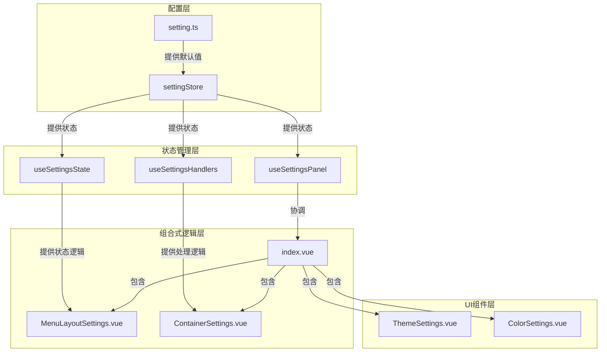
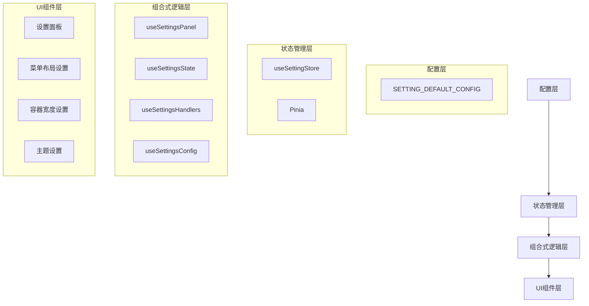
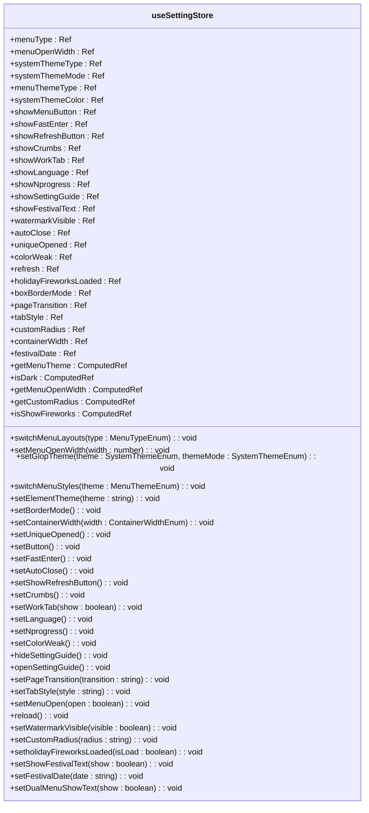
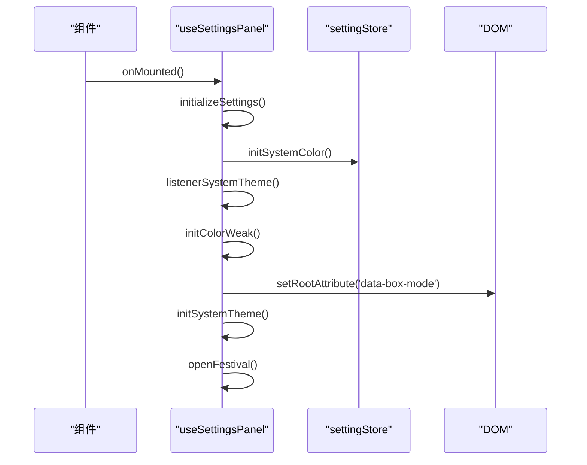
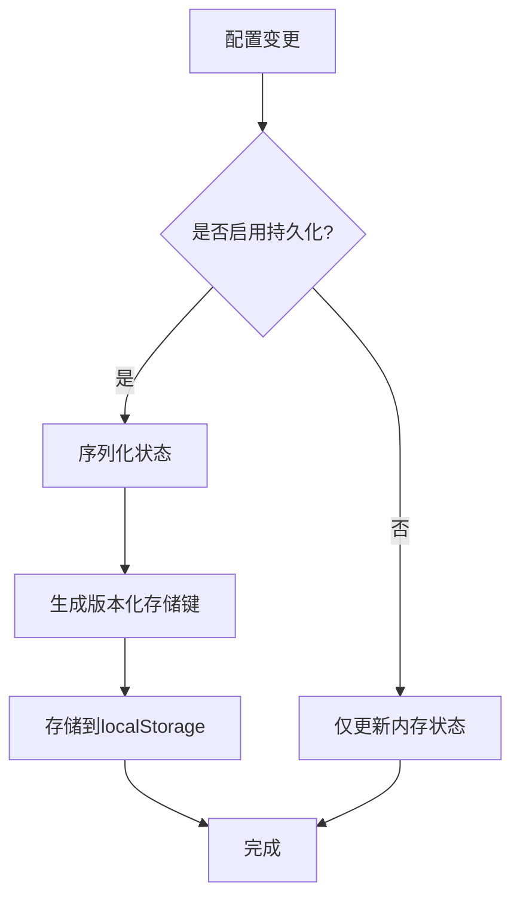
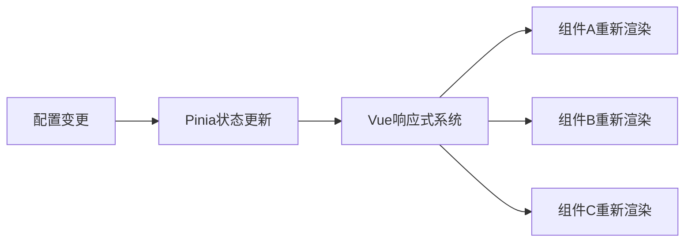
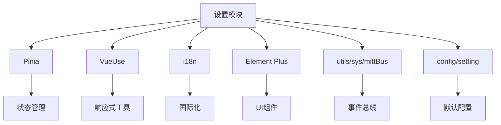

# 设置模块 (setting)

<cite>
**本文档引用的文件**
- [setting.ts](file://src/store/modules/setting.ts)
- [setting.ts](file://src/config/setting.ts)
- [index.ts](file://src/store/index.ts)
- [useSettingsPanel.ts](file://src/components/core/layouts/art-settings-panel/composables/useSettingsPanel.ts)
- [useSettingsState.ts](file://src/components/core/layouts/art-settings-panel/composables/useSettingsState.ts)
- [useSettingsHandlers.ts](file://src/components/core/layouts/art-settings-panel/composables/useSettingsHandlers.ts)
- [useSettingsConfig.ts](file://src/components/core/layouts/art-settings-panel/composables/useSettingsConfig.ts)
- [index.vue](file://src/components/core/layouts/art-settings-panel/index.vue)
- [MenuLayoutSettings.vue](file://src/components/core/layouts/art-settings-panel/widget/MenuLayoutSettings.vue)
- [ContainerSettings.vue](file://src/components/core/layouts/art-settings-panel/widget/ContainerSettings.vue)
- [art-header-bar/index.vue](file://src/components/core/layouts/art-header-bar/index.vue)
- [mittBus.ts](file://src/utils/sys/mittBus.ts)
</cite>

## 目录
1. [简介](#简介)
2. [项目结构](#项目结构)
3. [核心组件](#核心组件)
4. [架构概述](#架构概述)
5. [详细组件分析](#详细组件分析)
6. [依赖分析](#依赖分析)
7. [性能考虑](#性能考虑)
8. [故障排除指南](#故障排除指南)
9. [结论](#结论)

## 简介
设置模块是整个应用的核心配置中心，负责集中管理全局 UI 配置状态。该模块通过 Pinia 状态管理库实现，提供了完整的系统设置状态管理功能，包括菜单布局配置、主题管理、界面显示开关、功能开关、样式配置等。模块采用模块化设计，通过组合式 API 将不同功能分离到不同的可组合函数中，实现了高内聚低耦合的架构。配置项通过 localStorage 进行持久化存储，确保用户偏好设置在页面刷新后依然保持。模块还提供了响应式更新机制，当配置变更时，相关组件能够自动更新以反映最新的设置。

## 项目结构
设置模块的文件组织遵循清晰的分层架构，主要分为配置定义、状态管理、组合式逻辑和 UI 组件四个层次。核心配置定义位于 `src/config/setting.ts`，包含所有设置项的默认值；状态管理位于 `src/store/modules/setting.ts`，使用 Pinia 实现全局状态管理；组合式逻辑分散在 `src/components/core/layouts/art-settings-panel/composables/` 目录下，按功能划分为多个可组合函数；UI 组件则位于 `src/components/core/layouts/art-settings-panel/widget/` 目录下，每个组件负责特定设置项的展示和交互。

**Diagram sources**
- [setting.ts](file://src/config/setting.ts)
- [setting.ts](file://src/store/modules/setting.ts)
- [useSettingsPanel.ts](file://src/components/core/layouts/art-settings-panel/composables/useSettingsPanel.ts)
- [useSettingsState.ts](file://src/components/core/layouts/art-settings-panel/composables/useSettingsState.ts)
- [useSettingsHandlers.ts](file://src/components/core/layouts/art-settings-panel/composables/useSettingsHandlers.ts)
- [index.vue](file://src/components/core/layouts/art-settings-panel/index.vue)

**Section sources**
- [setting.ts](file://src/config/setting.ts)
- [setting.ts](file://src/store/modules/setting.ts)
- [useSettingsPanel.ts](file://src/components/core/layouts/art-settings-panel/composables/useSettingsPanel.ts)
- [useSettingsState.ts](file://src/components/core/layouts/art-settings-panel/composables/useSettingsState.ts)
- [useSettingsHandlers.ts](file://src/components/core/layouts/art-settings-panel/composables/useSettingsHandlers.ts)
- [index.vue](file://src/components/core/layouts/art-settings-panel/index.vue)

## 核心组件
设置模块的核心组件包括状态管理器 `useSettingStore`、配置默认值 `SETTING_DEFAULT_CONFIG` 和设置面板组合式逻辑。`useSettingStore` 是基于 Pinia 的状态管理器，负责管理所有 UI 配置状态，包括菜单类型、主题模式、界面显示开关等。`SETTING_DEFAULT_CONFIG` 定义了所有配置项的默认值，确保应用在首次加载时有合理的初始状态。设置面板的组合式逻辑通过多个可组合函数（composables）实现，将不同功能分离，提高了代码的可维护性和复用性。

**Section sources**
- [setting.ts](file://src/store/modules/setting.ts)
- [setting.ts](file://src/config/setting.ts)
- [useSettingsPanel.ts](file://src/components/core/layouts/art-settings-panel/composables/useSettingsPanel.ts)

## 架构概述
设置模块采用分层架构设计，从下到上分为配置层、状态管理层、组合式逻辑层和 UI 组件层。配置层定义了所有设置项的默认值，为整个模块提供基础配置。状态管理层使用 Pinia 实现全局状态管理，确保配置状态的集中管理和响应式更新。组合式逻辑层通过多个可组合函数将不同功能分离，实现了高内聚低耦合的设计。UI 组件层负责具体的用户界面展示和交互，通过组合式逻辑与状态管理层进行通信。

**Diagram sources**
- [setting.ts](file://src/config/setting.ts)
- [setting.ts](file://src/store/modules/setting.ts)
- [useSettingsPanel.ts](file://src/components/core/layouts/art-settings-panel/composables/useSettingsPanel.ts)
- [useSettingsState.ts](file://src/components/core/layouts/art-settings-panel/composables/useSettingsState.ts)
- [useSettingsHandlers.ts](file://src/components/core/layouts/art-settings-panel/composables/useSettingsHandlers.ts)
- [useSettingsConfig.ts](file://src/components/core/layouts/art-settings-panel/composables/useSettingsConfig.ts)
- [index.vue](file://src/components/core/layouts/art-settings-panel/index.vue)

## 详细组件分析
设置模块的详细组件分析主要集中在状态管理、配置初始化、持久化存储和跨组件响应式更新等方面。通过分析核心组件的实现细节，可以深入了解模块的工作原理和设计思路。

### 状态管理分析
设置模块的状态管理基于 Pinia 实现，通过 `defineStore` 创建名为 `settingStore` 的全局状态管理器。状态管理器包含了所有 UI 配置状态，如菜单类型、主题模式、界面显示开关等。每个状态都通过 `ref` 定义，并提供了相应的计算属性和方法来操作这些状态。

**Diagram sources**
- [setting.ts](file://src/store/modules/setting.ts)

**Section sources**
- [setting.ts](file://src/store/modules/setting.ts)

### 配置初始化逻辑
设置模块的配置初始化逻辑主要在 `useSettingsPanel` 组合式函数中实现。当设置面板组件挂载时，会调用 `initializeSettings` 方法进行初始化，该方法会执行一系列初始化操作，包括监听系统主题变化、初始化颜色弱化模式、设置盒子模式等。

**Diagram sources**
- [useSettingsPanel.ts](file://src/components/core/layouts/art-settings-panel/composables/useSettingsPanel.ts)
- [setting.ts](file://src/store/modules/setting.ts)

**Section sources**
- [useSettingsPanel.ts](file://src/components/core/layouts/art-settings-panel/composables/useSettingsPanel.ts)

### 持久化存储机制
设置模块的持久化存储机制基于 `pinia-plugin-persistedstate` 插件实现，通过 localStorage 存储用户配置。存储键采用版本化命名策略，格式为 `sys-v{version}-{storeId}`，确保跨版本数据迁移的兼容性。当配置项发生变化时，插件会自动将最新的状态序列化并存储到 localStorage 中。

**Diagram sources**
- [index.ts](file://src/store/index.ts)
- [setting.ts](file://src/store/modules/setting.ts)

**Section sources**
- [index.ts](file://src/store/index.ts)
- [setting.ts](file://src/store/modules/setting.ts)

### 跨组件响应式更新
设置模块通过 Pinia 的响应式系统实现跨组件的配置更新。当配置项发生变化时，所有依赖该配置项的组件都会自动更新。这种机制通过 Vue 的响应式系统和 Pinia 的状态管理相结合实现，确保了 UI 的一致性和实时性。

**Diagram sources**
- [setting.ts](file://src/store/modules/setting.ts)
- [art-header-bar/index.vue](file://src/components/core/layouts/art-header-bar/index.vue)

**Section sources**
- [setting.ts](file://src/store/modules/setting.ts)
- [art-header-bar/index.vue](file://src/components/core/layouts/art-header-bar/index.vue)

## 依赖分析
设置模块与其他模块和组件存在紧密的依赖关系。主要依赖包括 Pinia 状态管理库、VueUse 工具库、i18n 国际化库等。模块通过 `useSettingStore` 在各个组件中读取配置，并通过组合式函数提供配置修改的方法。设置面板组件依赖于多个可组合函数来实现不同的功能，如状态管理、事件处理、配置选项等。

**Diagram sources**
- [setting.ts](file://src/store/modules/setting.ts)
- [useSettingsPanel.ts](file://src/components/core/layouts/art-settings-panel/composables/useSettingsPanel.ts)
- [useSettingsState.ts](file://src/components/core/layouts/art-settings-panel/composables/useSettingsState.ts)
- [useSettingsHandlers.ts](file://src/components/core/layouts/art-settings-panel/composables/useSettingsHandlers.ts)
- [useSettingsConfig.ts](file://src/components/core/layouts/art-settings-panel/composables/useSettingsConfig.ts)
- [index.vue](file://src/components/core/layouts/art-settings-panel/index.vue)

**Section sources**
- [setting.ts](file://src/store/modules/setting.ts)
- [useSettingsPanel.ts](file://src/components/core/layouts/art-settings-panel/composables/useSettingsPanel.ts)
- [useSettingsState.ts](file://src/components/core/layouts/art-settings-panel/composables/useSettingsState.ts)
- [useSettingsHandlers.ts](file://src/components/core/layouts/art-settings-panel/composables/useSettingsHandlers.ts)
- [useSettingsConfig.ts](file://src/components/core/layouts/art-settings-panel/composables/useSettingsConfig.ts)
- [index.vue](file://src/components/core/layouts/art-settings-panel/index.vue)

## 性能考虑
设置模块在设计时充分考虑了性能优化。通过使用 VueUse 的 breakpoints 优化响应式布局的性能，避免不必要的计算。持久化存储采用版本化键名，减少数据迁移的开销。事件总线使用类型安全的 mitt 实现，提高事件处理的效率。组合式函数的设计避免了逻辑的重复，提高了代码的复用性。

## 故障排除指南
当设置模块出现问题时，可以从以下几个方面进行排查：检查 localStorage 中的存储键是否正确，确认 Pinia 状态是否正常更新，验证事件总线的订阅和发布是否正常工作，检查组合式函数的导入和使用是否正确。对于配置不生效的问题，需要确认相关组件是否正确使用了 `useSettingStore` 并正确监听了状态变化。

**Section sources**
- [setting.ts](file://src/store/modules/setting.ts)
- [useSettingsPanel.ts](file://src/components/core/layouts/art-settings-panel/composables/useSettingsPanel.ts)
- [mittBus.ts](file://src/utils/sys/mittBus.ts)

## 结论
设置模块通过精心设计的分层架构和组合式 API，实现了全局 UI 配置状态的集中管理。模块采用 Pinia 进行状态管理，通过 localStorage 实现持久化存储，利用组合式函数分离关注点，提高了代码的可维护性和复用性。配置项的初始化逻辑完善，持久化机制可靠，跨组件响应式更新流畅。通过 useSettingStore 可以在任何组件中方便地读取和修改配置，设置面板提供了直观的用户界面来管理所有配置项。整体设计体现了现代前端应用的最佳实践，为用户提供了一致且可定制的用户体验。