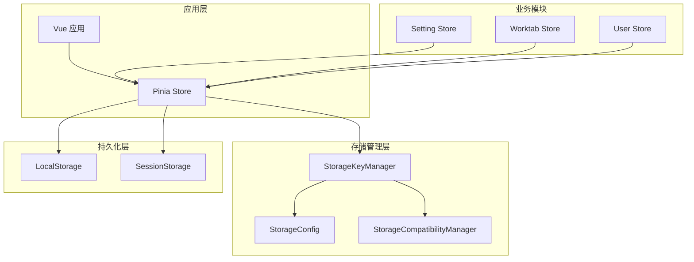
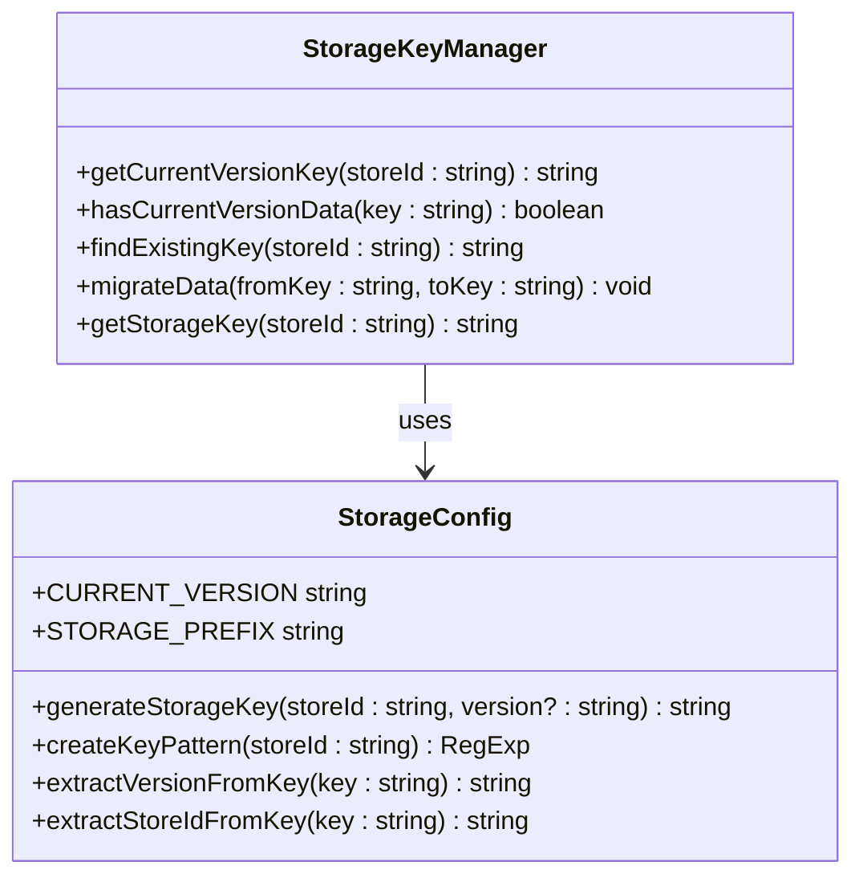
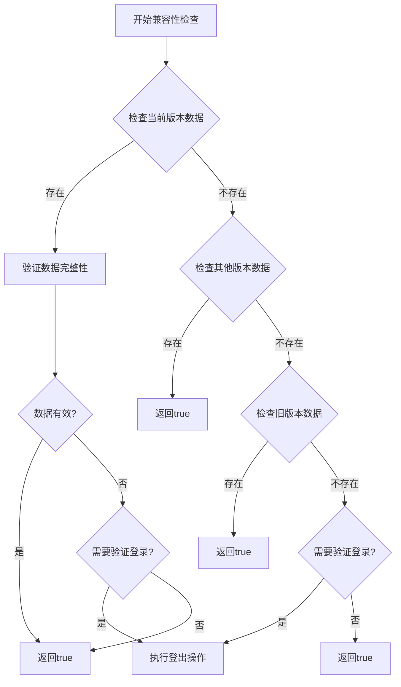
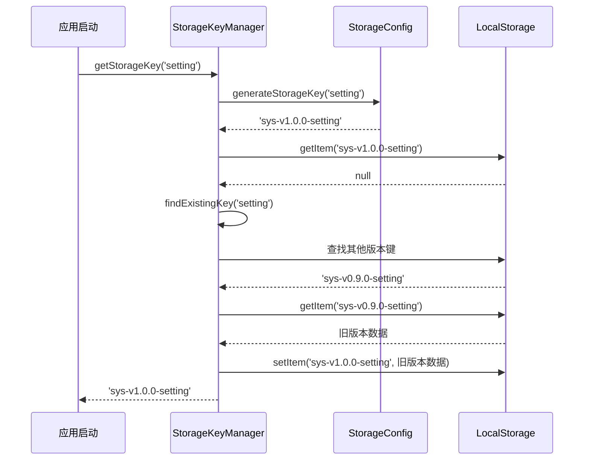
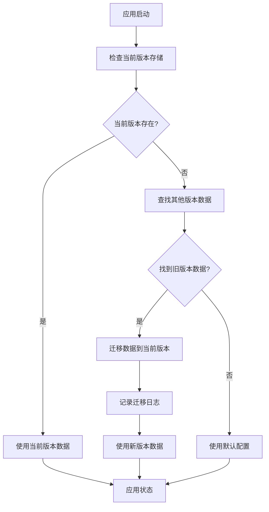
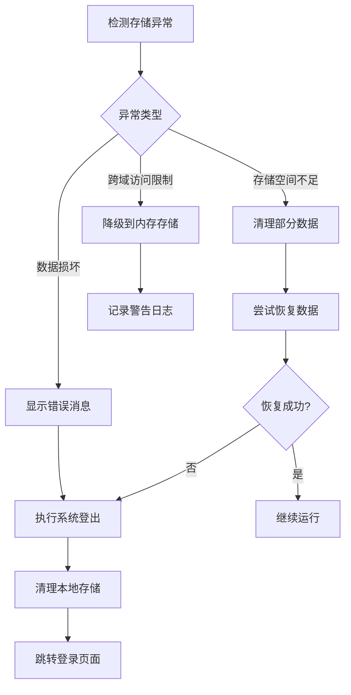

# 状态持久化

<cite>
**本文档中引用的文件**
- [src/utils/storage/index.ts](file://src/utils/storage/index.ts)
- [src/utils/storage/storage-config.ts](file://src/utils/storage/storage-config.ts)
- [src/utils/storage/storage-key-manager.ts](file://src/utils/storage/storage-key-manager.ts)
- [src/utils/storage/storage.ts](file://src/utils/storage/storage.ts)
- [src/store/index.ts](file://src/store/index.ts)
- [src/store/modules/setting.ts](file://src/store/modules/setting.ts)
- [src/store/modules/worktab.ts](file://src/store/modules/worktab.ts)
- [src/store/modules/user.ts](file://src/store/modules/user.ts)
- [src/utils/sys/upgrade.ts](file://src/utils/sys/upgrade.ts)
- [src/main.ts](file://src/main.ts)
- [src/config/setting.ts](file://src/config/setting.ts)
</cite>

## 目录
1. [概述](#概述)
2. [项目架构](#项目架构)
3. [核心组件分析](#核心组件分析)
4. [存储配置策略](#存储配置策略)
5. [版本化存储管理](#版本化存储管理)
6. [状态持久化集成](#状态持久化集成)
7. [数据迁移机制](#数据迁移机制)
8. [异常处理与安全](#异常处理与安全)
9. [性能优化策略](#性能优化策略)
10. [最佳实践指南](#最佳实践指南)

## 概述

Art Design Pro 采用了一套完整的状态持久化解决方案，通过本地存储（localStorage）实现用户设置、主题偏好、工作标签状态等关键数据的持久化保存。该系统具备版本化管理、自动迁移、异常恢复等高级特性，确保数据的安全性和兼容性。

### 主要特性

- **版本化存储键管理**：采用 `sys-v{version}-{storeId}` 格式的存储键，支持多版本数据隔离
- **自动数据迁移**：跨版本数据无缝迁移，避免用户数据丢失
- **兼容性检查**：完善的存储数据验证和异常恢复机制
- **插件化架构**：基于 Pinia 持久化插件的灵活扩展
- **安全性保障**：多层次的异常处理和数据保护机制

## 项目架构



**图表来源**
- [src/store/index.ts](file://src/store/index.ts#L1-L53)
- [src/utils/storage/storage-key-manager.ts](file://src/utils/storage/storage-key-manager.ts#L1-L98)

## 核心组件分析

### StorageKeyManager - 存储键管理器

StorageKeyManager 是整个存储系统的核心组件，负责智能的版本化存储键管理和数据迁移。



**图表来源**
- [src/utils/storage/storage-key-manager.ts](file://src/utils/storage/storage-key-manager.ts#L38-L97)
- [src/utils/storage/storage-config.ts](file://src/utils/storage/storage-config.ts#L29-L122)

#### 工作流程

1. **优先使用当前版本数据**：首先检查当前版本的存储键是否存在
2. **查找旧版本数据**：如果当前版本无数据，查找其他版本的同名存储数据
3. **自动迁移**：找到旧版本数据后自动迁移到当前版本
4. **返回存储键**：返回当前版本的存储键供使用

**章节来源**
- [src/utils/storage/storage-key-manager.ts](file://src/utils/storage/storage-key-manager.ts#L80-L96)

### StorageConfig - 存储配置管理

StorageConfig 提供统一的本地存储配置和工具方法，支持版本化存储键管理。

#### 核心配置项

| 配置项 | 类型 | 默认值 | 描述 |
|--------|------|--------|------|
| CURRENT_VERSION | string | `__APP_VERSION__` | 当前应用版本 |
| STORAGE_PREFIX | string | `'sys-v'` | 存储键前缀 |
| VERSION_KEY | string | `'sys-version'` | 版本键名 |
| THEME_KEY | string | `'sys-theme'` | 主题键名 |
| LAST_USER_ID_KEY | string | `'sys-last-user-id'` | 最后用户ID键名 |
| UPGRADE_DELAY | number | `1000` | 升级处理延迟（毫秒） |
| LOGOUT_DELAY | number | `1000` | 登出延迟（毫秒） |

**章节来源**
- [src/utils/storage/storage-config.ts](file://src/utils/storage/storage-config.ts#L30-L52)

### StorageCompatibilityManager - 存储兼容性管理

负责处理不同版本间的存储兼容性检查和数据验证。



**图表来源**
- [src/utils/storage/storage.ts](file://src/utils/storage/storage.ts#L136-L173)

**章节来源**
- [src/utils/storage/storage.ts](file://src/utils/storage/storage.ts#L43-L250)

## 存储配置策略

### Pinia 持久化插件配置

系统通过 Pinia 持久化插件实现自动的状态持久化：

```typescript
// 存储插件配置
store.use(
  createPersistedState({
    key: (storeId: string) => storageKeyManager.getStorageKey(storeId),
    storage: localStorage,
    serializer: {
      serialize: JSON.stringify,
      deserialize: JSON.parse
    }
  })
)
```

### 存储键命名规范

采用版本化存储键命名规范，格式为：`sys-v{version}-{storeId}`

#### 示例存储键

| StoreId | 当前版本 | 旧版本 | 描述 |
|---------|----------|--------|------|
| setting | `sys-v1.0.0-setting` | `sys-v1.0.0-setting` | 系统设置 |
| worktab | `sys-v1.0.0-worktab` | `sys-v1.0.0-worktab` | 工作标签页 |
| user | `sys-v1.0.0-user` | `sys-v1.0.0-user` | 用户信息 |

**章节来源**
- [src/store/index.ts](file://src/store/index.ts#L36-L44)

## 版本化存储管理

### 版本检测与迁移



**图表来源**
- [src/utils/storage/storage-key-manager.ts](file://src/utils/storage/storage-key-manager.ts#L80-L96)

### 正则表达式匹配

系统提供了多种正则表达式来匹配不同类型的存储键：

| 匹配类型 | 正则表达式 | 用途 |
|----------|------------|------|
| 当前版本 | `^sys-v1\.0\.0-` | 匹配当前版本的存储键 |
| 任意版本 | `^sys-v` | 匹配所有版本的存储键 |
| 特定StoreId | `^sys-v[^-]+-setting$` | 匹配特定StoreId的存储键 |

**章节来源**
- [src/utils/storage/storage-config.ts](file://src/utils/storage/storage-config.ts#L71-L90)

## 状态持久化集成

### Setting Store 集成

系统设置模块通过 Pinia 的持久化配置实现状态持久化：

```typescript
{
  persist: {
    key: 'setting',
    storage: localStorage
  }
}
```

#### 支持的设置项

- **菜单布局配置**：左侧、顶部、混合、双栏菜单
- **主题管理**：亮色、暗色、自动主题切换
- **界面显示开关**：面包屑、标签页、语言切换等
- **功能开关**：手风琴模式、色弱模式、水印等
- **样式配置**：边框、圆角、容器宽度、页面过渡

**章节来源**
- [src/store/modules/setting.ts](file://src/store/modules/setting.ts#L444-L450)

### Worktab Store 集成

工作标签页模块同样实现了持久化存储：

```typescript
{
  persist: {
    key: 'worktab',
    storage: localStorage
  }
}
```

#### 标签页状态管理

- **标签页打开和关闭**：自动保存打开的标签页列表
- **标签页固定和取消固定**：保存固定的标签页状态
- **批量关闭操作**：左侧、右侧、其他、全部关闭
- **KeepAlive 缓存管理**：管理页面缓存排除列表

**章节来源**
- [src/store/modules/worktab.ts](file://src/store/modules/worktab.ts#L562-L568)

### User Store 集成

用户信息模块也实现了持久化存储：

```typescript
{
  persist: {
    key: 'user',
    storage: localStorage
  }
}
```

#### 用户状态持久化

- **用户登录状态**：保存用户的登录状态和令牌
- **用户信息**：保存用户的基本信息
- **搜索历史**：保存用户的搜索历史记录
- **锁屏状态**：保存用户的锁屏设置

**章节来源**
- [src/store/modules/user.ts](file://src/store/modules/user.ts#L230-L234)

## 数据迁移机制

### 自动迁移流程



**图表来源**
- [src/utils/storage/storage-key-manager.ts](file://src/utils/storage/storage-key-manager.ts#L80-L96)

### 版本升级处理

系统在版本升级时会自动清理旧版本数据并进行迁移：

#### 升级检测流程

1. **获取存储版本号**：检查本地存储的版本号
2. **版本比较**：与当前应用版本进行对比
3. **查找旧数据**：定位需要清理的旧版本数据
4. **执行清理**：清理过期的存储键
5. **显示通知**：向用户展示升级信息

**章节来源**
- [src/utils/sys/upgrade.ts](file://src/utils/sys/upgrade.ts#L54-L101)

## 异常处理与安全

### 存储异常恢复机制



**图表来源**
- [src/utils/storage/storage.ts](file://src/utils/storage/storage.ts#L98-L130)

### 安全防护措施

#### 1. 数据完整性验证
- JSON 解析异常捕获
- 数据格式校验
- 版本兼容性检查

#### 2. 异常自动恢复
- 存储空间不足时的清理策略
- 跨域访问限制的降级处理
- 数据损坏时的自动修复

#### 3. 用户体验保障
- 延迟处理机制（1秒延迟）
- 渐进式错误提示
- 自动登出前的通知

**章节来源**
- [src/utils/storage/storage.ts](file://src/utils/storage/storage.ts#L98-L130)

## 性能优化策略

### 写入优化

#### 1. 批量更新策略
- 合并多个状态变更到单次存储写入
- 避免频繁的 localStorage 操作
- 减少浏览器重绘和回流

#### 2. 防抖处理
- 对频繁的状态变更进行防抖处理
- 在适当的时间窗口内合并写入操作
- 减少不必要的存储访问

### 读取优化

#### 1. 缓存机制
- 内存中缓存常用的存储数据
- 避免重复的 localStorage 访问
- 提供异步加载机制

#### 2. 懒加载策略
- 按需加载存储数据
- 分离核心数据和非核心数据
- 优化初始加载性能

### 存储空间管理

#### 1. 数据压缩
- 对大型数据进行序列化优化
- 移除冗余的存储键
- 定期清理过期数据

#### 2. 存储监控
- 监控存储空间使用情况
- 提供存储空间预警机制
- 自动清理策略

## 最佳实践指南

### 开发建议

#### 1. 存储键设计原则
- 使用语义化的存储键名称
- 遵循版本化命名规范
- 避免使用过于通用的键名

#### 2. 数据结构设计
- 保持数据结构的简洁性
- 避免过深的嵌套结构
- 考虑数据的序列化成本

#### 3. 异常处理
- 为所有存储操作添加异常处理
- 提供优雅的降级方案
- 记录详细的错误日志

### 部署考虑

#### 1. 浏览器兼容性
- 测试不同浏览器的存储能力
- 提供存储能力检测机制
- 实现渐进式增强策略

#### 2. 安全配置
- 避免存储敏感信息
- 使用适当的存储类型
- 实施数据加密策略

#### 3. 性能监控
- 监控存储操作的性能指标
- 设置存储空间使用阈值
- 实施定期的存储健康检查

### 维护建议

#### 1. 版本管理
- 建立清晰的版本升级策略
- 制定数据迁移计划
- 测试跨版本兼容性

#### 2. 数据备份
- 定期备份重要存储数据
- 实施增量备份策略
- 提供数据恢复机制

#### 3. 监控告警
- 监控存储异常情况
- 设置性能告警阈值
- 建立故障响应机制

通过这套完整的状态持久化解决方案，Art Design Pro 实现了可靠、高效、安全的用户数据持久化存储，为用户提供稳定的应用体验。