# 状态管理

<cite>
**本文档中引用的文件**
- [src/store/index.ts](file://src/store/index.ts)
- [src/store/modules/menu.ts](file://src/store/modules/menu.ts)
- [src/store/modules/setting.ts](file://src/store/modules/setting.ts)
- [src/store/modules/user.ts](file://src/store/modules/user.ts)
- [src/store/modules/table.ts](file://src/store/modules/table.ts)
- [src/store/modules/worktab.ts](file://src/store/modules/worktab.ts)
- [src/utils/storage/storage-key-manager.ts](file://src/utils/storage/storage-key-manager.ts)
- [src/utils/storage/storage-config.ts](file://src/utils/storage/storage-config.ts)
- [src/config/setting.ts](file://src/config/setting.ts)
- [src/types/store/index.ts](file://src/types/store/index.ts)
- [src/enums/appEnum.ts](file://src/enums/appEnum.ts)
</cite>

## 目录
1. [简介](#简介)
2. [项目结构](#项目结构)
3. [核心组件](#核心组件)
4. [架构概览](#架构概览)
5. [详细组件分析](#详细组件分析)
6. [依赖关系分析](#依赖关系分析)
7. [性能考虑](#性能考虑)
8. [故障排除指南](#故障排除指南)
9. [结论](#结论)

## 简介

Art Design Pro 采用基于 Pinia 的现代化状态管理架构，提供了完整的应用状态管理解决方案。该架构通过模块化设计实现了状态的清晰分离，支持持久化存储、版本化数据迁移和响应式更新机制。系统涵盖了菜单管理、用户认证、系统设置、表格配置和工作标签页等多个核心功能模块。

## 项目结构

状态管理系统采用模块化架构，主要包含以下核心文件：

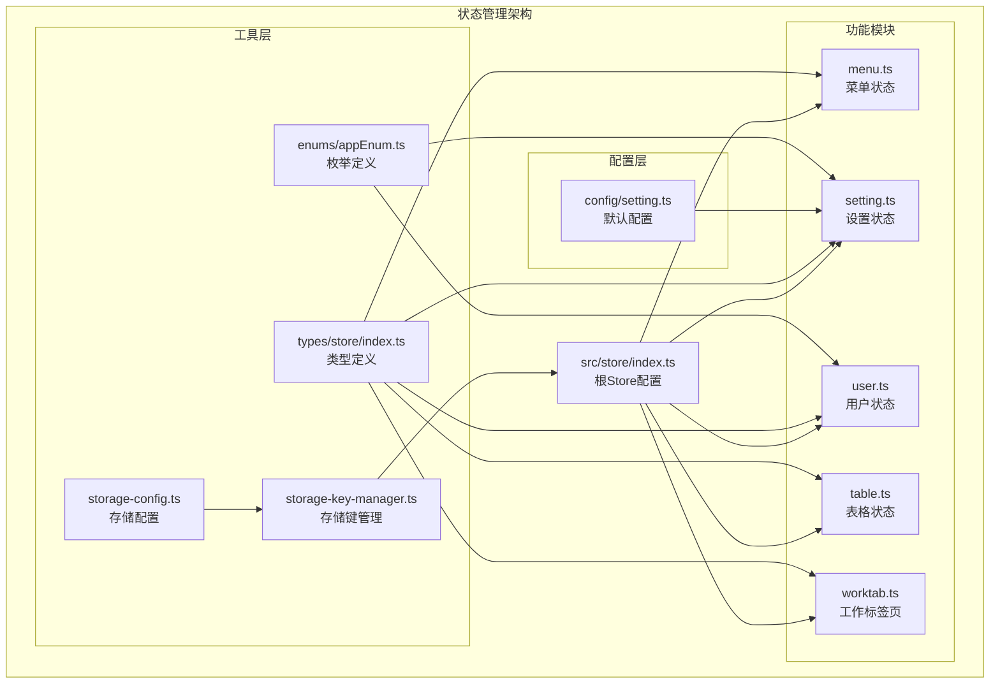

**图表来源**
- [src/store/index.ts](file://src/store/index.ts#L1-L53)
- [src/store/modules/menu.ts](file://src/store/modules/menu.ts#L1-L110)
- [src/store/modules/setting.ts](file://src/store/modules/setting.ts#L1-L451)
- [src/store/modules/user.ts](file://src/store/modules/user.ts#L1-L236)
- [src/store/modules/table.ts](file://src/store/modules/table.ts#L1-L98)
- [src/store/modules/worktab.ts](file://src/store/modules/worktab.ts#L1-L569)

**章节来源**
- [src/store/index.ts](file://src/store/index.ts#L1-L53)
- [src/store/modules/menu.ts](file://src/store/modules/menu.ts#L1-L110)
- [src/store/modules/setting.ts](file://src/store/modules/setting.ts#L1-L451)
- [src/store/modules/user.ts](file://src/store/modules/user.ts#L1-L236)
- [src/store/modules/table.ts](file://src/store/modules/table.ts#L1-L98)
- [src/store/modules/worktab.ts](file://src/store/modules/worktab.ts#L1-L569)

## 核心组件

### 根Store配置 (index.ts)

根Store负责整个状态管理系统的初始化和配置，主要功能包括：

- **Pinia实例创建**：使用 `createPinia()` 创建全局状态管理实例
- **持久化插件配置**：集成 `pinia-plugin-persistedstate` 实现状态持久化
- **版本化存储键管理**：通过 `StorageKeyManager` 实现跨版本数据迁移
- **序列化配置**：使用JSON格式进行状态序列化和反序列化

### 模块化组织

系统采用功能导向的模块化设计，每个模块专注于特定的功能领域：

- **菜单模块**：管理应用菜单、动态路由和导航状态
- **设置模块**：处理系统主题、界面配置和用户偏好
- **用户模块**：维护用户认证、个人信息和会话状态
- **表格模块**：配置表格显示样式和行为
- **工作标签页模块**：管理多标签页功能和页面缓存

**章节来源**
- [src/store/index.ts](file://src/store/index.ts#L1-L53)

## 架构概览

### 状态管理架构图

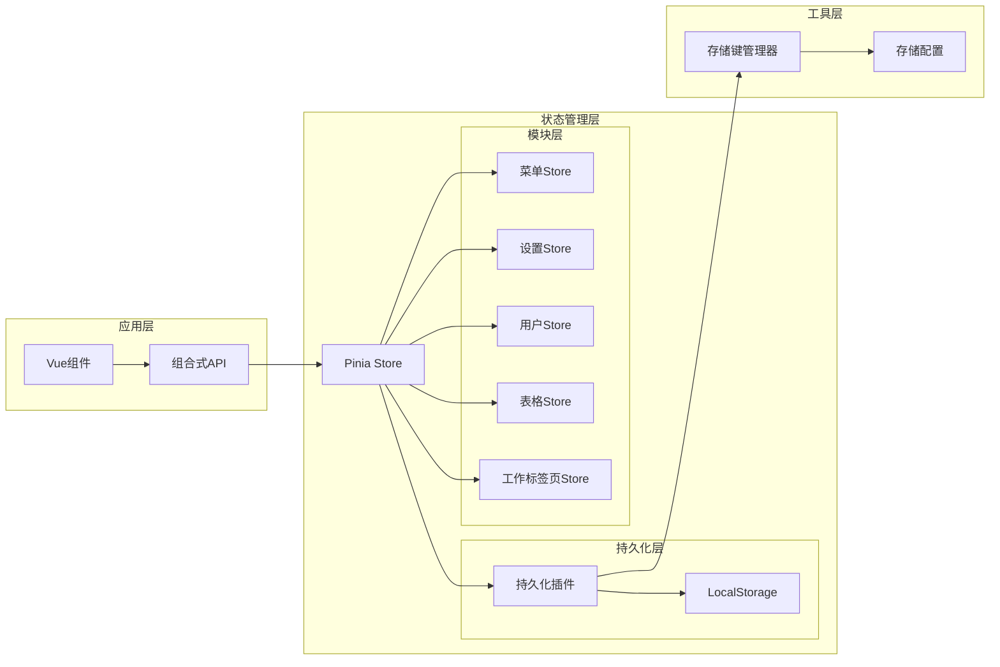

**图表来源**
- [src/store/index.ts](file://src/store/index.ts#L25-L52)
- [src/utils/storage/storage-key-manager.ts](file://src/utils/storage/storage-key-manager.ts#L38-L98)

### 状态流图

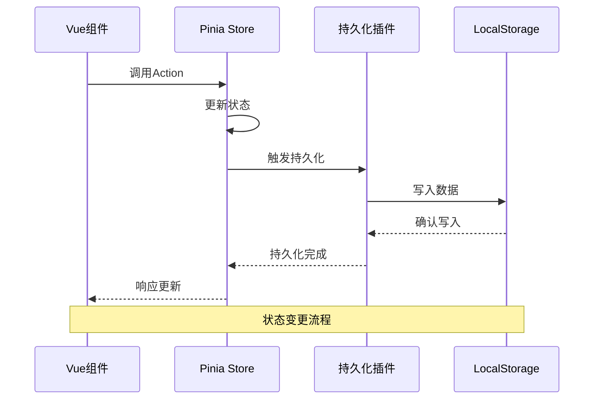

**图表来源**
- [src/store/index.ts](file://src/store/index.ts#L35-L45)

## 详细组件分析

### 菜单状态管理模块

菜单模块负责管理应用的导航结构和动态路由，提供完整的菜单状态管理功能。

#### 核心状态定义

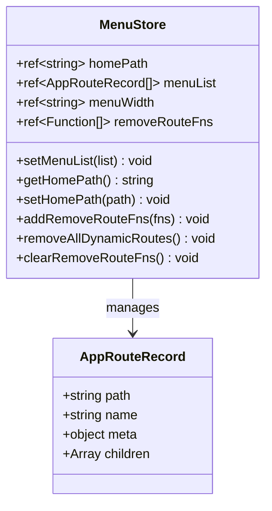

**图表来源**
- [src/store/modules/menu.ts](file://src/store/modules/menu.ts#L41-L108)

#### 功能特性

- **菜单列表管理**：存储和管理应用菜单结构
- **首页路径配置**：动态设置和获取应用首页路径
- **动态路由管理**：注册和移除动态路由，支持路由清理
- **路由移除函数管理**：存储路由移除函数以便统一清理

#### 工作流程

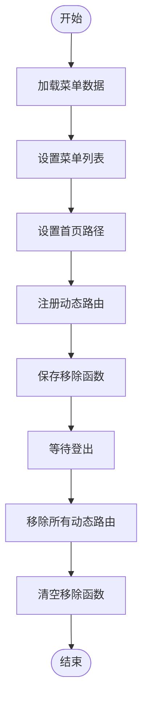

**图表来源**
- [src/store/modules/menu.ts](file://src/store/modules/menu.ts#L23-L26)

**章节来源**
- [src/store/modules/menu.ts](file://src/store/modules/menu.ts#L1-L110)

### 设置状态管理模块

设置模块提供完整的系统配置管理，涵盖主题、界面、功能和样式等各个方面。

#### 状态分类架构

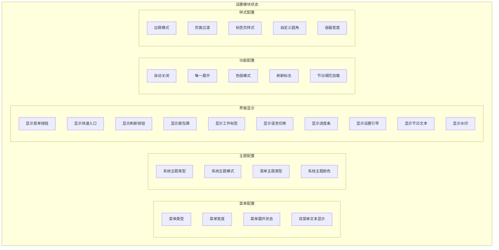

**图表来源**
- [src/store/modules/setting.ts](file://src/store/modules/setting.ts#L47-L120)

#### 计算属性和响应式机制

设置模块大量使用计算属性实现响应式更新：

- **getMenuTheme**：根据主题类型和暗色模式返回对应的菜单主题
- **isDark**：判断当前是否为暗色主题
- **getMenuOpenWidth**：获取菜单展开宽度的CSS值
- **getCustomRadius**：获取自定义圆角的CSS值
- **isShowFireworks**：根据节日日期判断是否显示烟花效果

#### 持久化配置

设置模块配置了完整的持久化策略：

```typescript
{
  persist: {
    key: 'setting',
    storage: localStorage
  }
}
```

**章节来源**
- [src/store/modules/setting.ts](file://src/store/modules/setting.ts#L1-L451)

### 用户状态管理模块

用户模块负责管理用户认证状态、个人信息和会话相关功能。

#### 状态结构

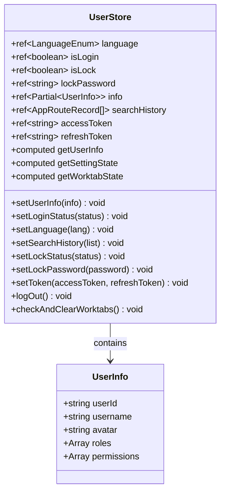

**图表来源**
- [src/store/modules/user.ts](file://src/store/modules/user.ts#L50-L234)

#### 登出流程

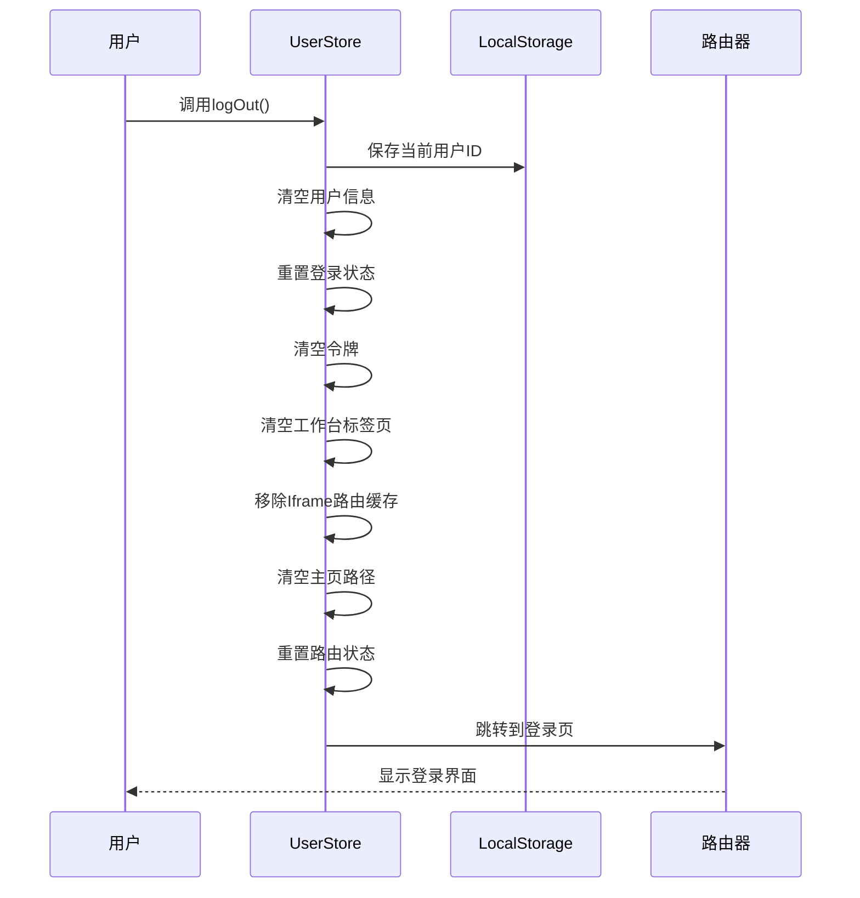

**图表来源**
- [src/store/modules/user.ts](file://src/store/modules/user.ts#L139-L175)

#### 用户身份验证流程

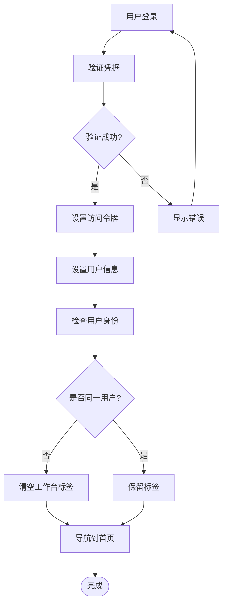

**图表来源**
- [src/store/modules/user.ts](file://src/store/modules/user.ts#L183-L204)

**章节来源**
- [src/store/modules/user.ts](file://src/store/modules/user.ts#L1-L236)

### 表格状态管理模块

表格模块专门管理表格组件的显示配置，提供灵活的表格样式定制功能。

#### 配置选项

| 配置项 | 类型 | 默认值 | 描述 |
|--------|------|--------|------|
| tableSize | TableSizeEnum | DEFAULT | 表格尺寸（紧凑/默认/宽松） |
| isZebra | boolean | false | 是否显示斑马纹 |
| isBorder | boolean | false | 是否显示边框 |
| isHeaderBackground | boolean | false | 是否显示表头背景 |
| isFullScreen | boolean | false | 是否全屏模式 |

#### 状态管理特点

- **简单直接**：仅包含表格相关的显示配置
- **易于扩展**：可根据需求添加更多表格配置选项
- **持久化存储**：配置跨页面保持不变

**章节来源**
- [src/store/modules/table.ts](file://src/store/modules/table.ts#L1-L98)

### 工作标签页状态管理模块

工作标签页模块是最复杂的状态管理模块，负责管理多标签页功能和页面缓存。

#### 核心状态结构

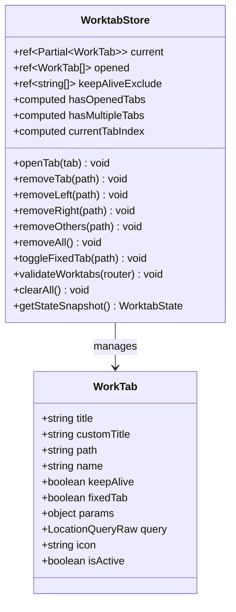

**图表来源**
- [src/store/modules/worktab.ts](file://src/store/modules/worktab.ts#L47-L567)

#### 标签页操作流程

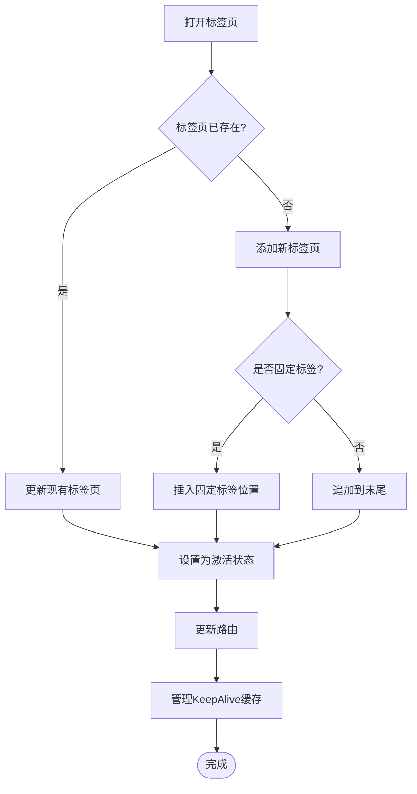

**图表来源**
- [src/store/modules/worktab.ts](file://src/store/modules/worktab.ts#L112-L164)

#### 批量标签页操作

工作标签页模块支持多种批量操作：

- **左侧关闭**：关闭当前标签页左侧的所有可关闭标签
- **右侧关闭**：关闭当前标签页右侧的所有可关闭标签  
- **其他关闭**：关闭除当前标签页外的所有可关闭标签
- **全部关闭**：关闭所有可关闭的标签页

#### KeepAlive缓存管理

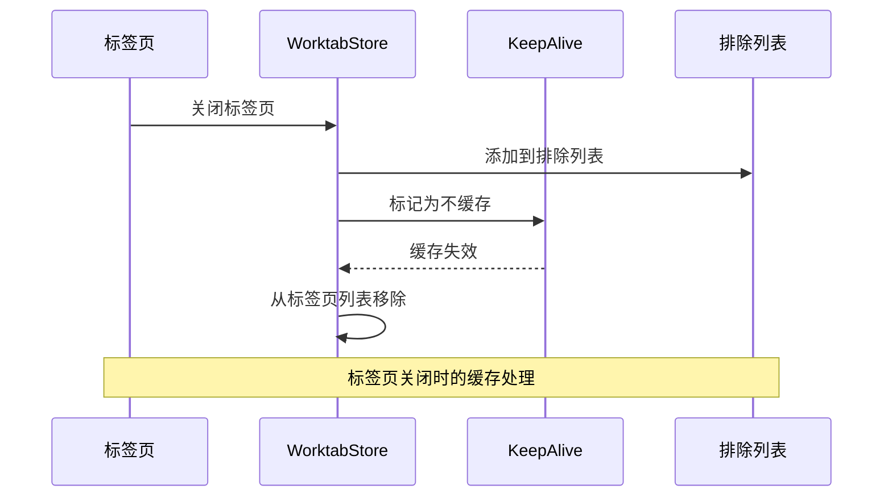

**图表来源**
- [src/store/modules/worktab.ts](file://src/store/modules/worktab.ts#L368-L385)

**章节来源**
- [src/store/modules/worktab.ts](file://src/store/modules/worktab.ts#L1-L569)

## 依赖关系分析

### 模块间依赖关系

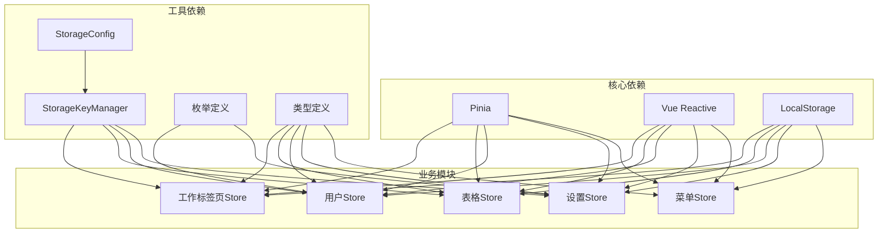

**图表来源**
- [src/store/index.ts](file://src/store/index.ts#L25-L52)
- [src/utils/storage/storage-key-manager.ts](file://src/utils/storage/storage-key-manager.ts#L32-L98)

### 状态共享模式

系统采用多种状态共享模式：

1. **直接访问**：模块间直接导入其他模块的store实例
2. **计算属性**：通过计算属性访问其他模块的状态
3. **事件总线**：使用mitt进行模块间的松耦合通信

**章节来源**
- [src/store/modules/user.ts](file://src/store/modules/user.ts#L70-L76)
- [src/store/modules/setting.ts](file://src/store/modules/setting.ts#L124-L131)

## 性能考虑

### 状态更新优化

1. **细粒度更新**：每个模块独立管理自己的状态，避免不必要的全局更新
2. **计算属性缓存**：合理使用计算属性缓存复杂的状态计算结果
3. **懒加载**：非关键状态按需加载和初始化

### 内存管理

1. **及时清理**：登出时彻底清理相关状态和缓存
2. **缓存策略**：合理管理KeepAlive缓存，避免内存泄漏
3. **数据压缩**：对大型状态进行适当的序列化优化

### 持久化性能

1. **增量更新**：仅持久化发生变化的状态
2. **异步处理**：持久化操作采用异步方式进行
3. **版本控制**：通过版本化存储避免数据冲突

## 故障排除指南

### 常见问题及解决方案

#### 状态不持久化

**问题描述**：页面刷新后状态丢失

**可能原因**：
- 持久化插件未正确配置
- LocalStorage被禁用
- 存储键冲突

**解决方案**：
1. 检查 `pinia-plugin-persistedstate` 插件配置
2. 验证浏览器LocalStorage功能
3. 确认存储键的唯一性

#### 状态不同步

**问题描述**：组件中显示的状态与实际状态不一致

**可能原因**：
- 响应式更新延迟
- 状态更新时机不当
- 组件未正确订阅状态变化

**解决方案**：
1. 使用 `nextTick` 确保DOM更新完成
2. 在正确的生命周期钩子中更新状态
3. 检查组件的响应式依赖

#### 内存泄漏

**问题描述**：长时间使用后内存占用过高

**可能原因**：
- KeepAlive缓存过多组件
- 事件监听器未正确清理
- 循环引用

**解决方案**：
1. 合理设置KeepAlive缓存策略
2. 在组件卸载时清理事件监听器
3. 检查并修复循环引用

### 调试技巧

1. **使用Vue DevTools**：监控状态变化和组件更新
2. **添加日志输出**：在关键状态更新点添加console.log
3. **状态快照**：定期保存状态快照用于问题重现
4. **单元测试**：为关键状态逻辑编写单元测试

**章节来源**
- [src/utils/storage/storage-key-manager.ts](file://src/utils/storage/storage-key-manager.ts#L66-L76)

## 结论

Art Design Pro 的状态管理系统展现了现代前端应用的最佳实践。通过基于 Pinia 的模块化架构，系统实现了：

1. **清晰的职责分离**：每个模块专注特定功能领域
2. **完善的持久化机制**：支持跨版本数据迁移和状态恢复
3. **灵活的配置管理**：提供丰富的系统配置选项
4. **强大的标签页功能**：支持复杂的多标签页操作
5. **优秀的性能表现**：通过合理的缓存和更新策略优化性能

该架构不仅满足了当前的功能需求，还为未来的功能扩展提供了良好的基础。开发者可以基于现有的模式轻松添加新的状态管理模块，同时保持整体架构的一致性和可维护性。