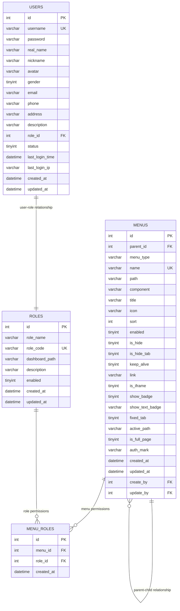
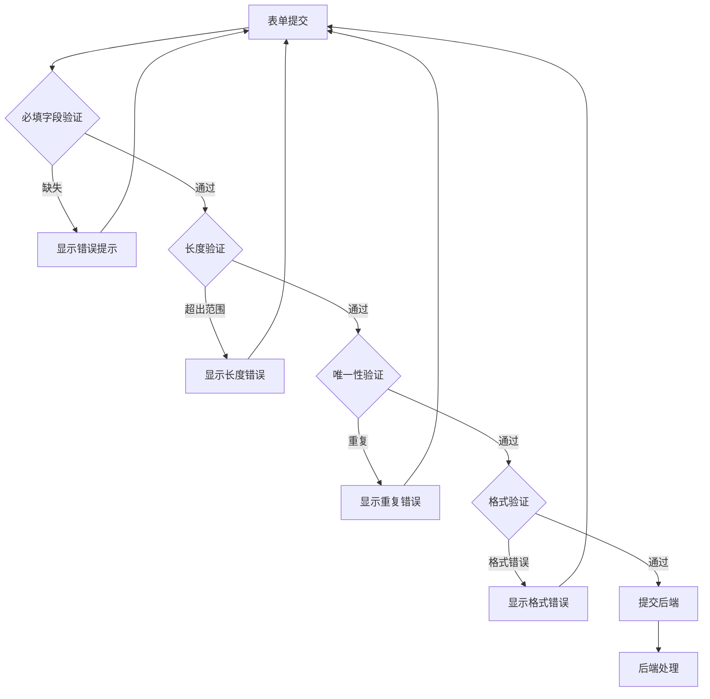
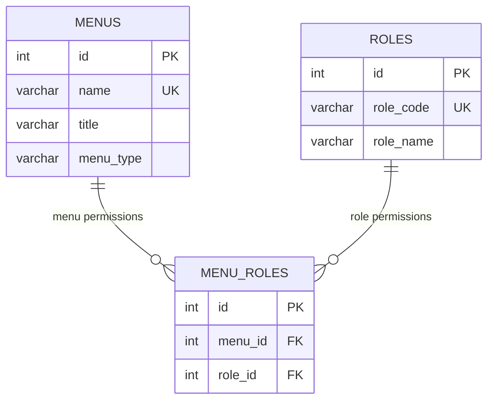
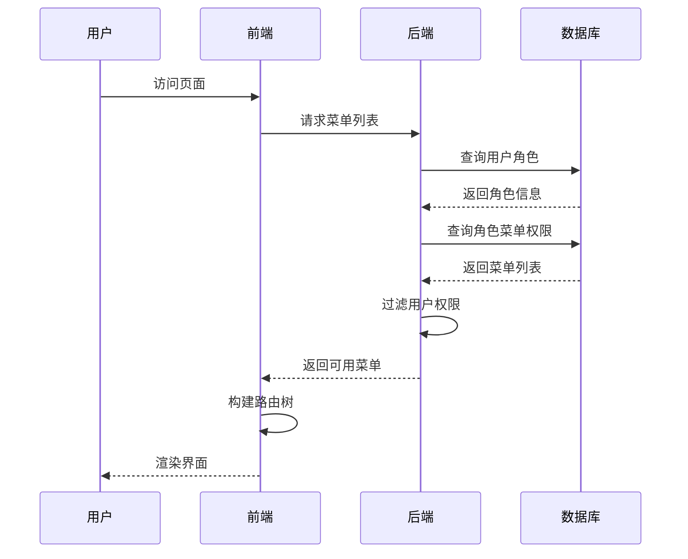

# 菜单管理字段说明

<cite>
**本文档引用的文件**
- [menu.controller.ts](file://backend/src/controllers/menu.controller.ts)
- [menu.routes.ts](file://backend/src/routes/menu.routes.ts)
- [menu.util.ts](file://backend/src/utils/menu.util.ts)
- [menu.ts](file://src/store/modules/menu.ts)
- [index.vue](file://src/views/system/menu/index.vue)
- [menu-dialog.vue](file://src/views/system/menu/modules/menu-dialog.vue)
- [init-database.sql](file://scripts/init-database.sql)
- [system-manage.ts](file://src/api/system-manage.ts)
- [菜单管理字段说明.md](file://项目文档/菜单管理字段说明.md)
</cite>

## 目录

1. [概述](#概述)
2. [数据库架构](#数据库架构)
3. [菜单类型说明](#菜单类型说明)
4. [核心字段详解](#核心字段详解)
5. [字段验证规则](#字段验证规则)
6. [前后端字段映射](#前后端字段映射)
7. [权限控制机制](#权限控制机制)
8. [实际应用场景](#实际应用场景)
9. [常见问题解答](#常见问题解答)

## 概述

Art Design Pro 的菜单管理系统是一个完整的权限控制解决方案，支持树形菜单结构、角色权限分配、动态路由生成等功能。系统采用前后端分离架构，后端使用 Express + MySQL，前端使用 Vue 3 + TypeScript。

### 系统特性

- **树形菜单结构**: 支持无限层级的菜单组织
- **角色权限控制**: 基于角色的细粒度权限管理
- **动态路由生成**: 根据用户权限动态生成路由
- **多种菜单类型**: 支持菜单、按钮、外部链接等多种类型
- **实时权限验证**: 前后端双重权限验证机制

## 数据库架构

### 菜单表 (menus)

菜单表是整个权限系统的核心，存储所有菜单和按钮的信息。



**图表来源**

- [init-database.sql](file://scripts/init-database.sql#L99-L132)

### 字段详细说明

| 字段名          | 类型     | 长度 | 必填 | 默认值            | 说明                             |
| --------------- | -------- | ---- | ---- | ----------------- | -------------------------------- |
| id              | INT      | -    | 是   | 自增              | 菜单唯一标识符                   |
| parent_id       | INT      | -    | 否   | NULL              | 父菜单ID，NULL表示顶级菜单       |
| menu_type       | VARCHAR  | 20   | 是   | 'menu'            | 菜单类型：menu-菜单，button-按钮 |
| name            | VARCHAR  | 100  | 是   | -                 | 路由名称（唯一标识），如 User    |
| path            | VARCHAR  | 255  | 否   | NULL              | 路由路径，按钮类型为NULL         |
| component       | VARCHAR  | 255  | 否   | NULL              | 组件路径                         |
| title           | VARCHAR  | 100  | 是   | -                 | 菜单标题（支持国际化键名）       |
| icon            | VARCHAR  | 100  | 否   | NULL              | 图标名称                         |
| sort            | INT      | -    | 是   | 1                 | 排序号，数字越小越靠前           |
| enabled         | TINYINT  | -    | 是   | 1                 | 启用状态：1-启用，0-禁用         |
| is_hide         | TINYINT  | -    | 是   | 0                 | 是否隐藏菜单：1-是，0-否         |
| is_hide_tab     | TINYINT  | -    | 是   | 0                 | 是否隐藏标签页：1-是，0-否       |
| keep_alive      | TINYINT  | -    | 是   | 0                 | 是否缓存页面：1-是，0-否         |
| link            | VARCHAR  | 500  | 否   | NULL              | 外部链接URL                      |
| is_iframe       | TINYINT  | -    | 是   | 0                 | 是否内嵌页面：1-是，0-否         |
| show_badge      | TINYINT  | -    | 是   | 0                 | 是否显示徽章：1-是，0-否         |
| show_text_badge | VARCHAR  | 50   | 否   | NULL              | 文本徽章内容                     |
| fixed_tab       | TINYINT  | -    | 是   | 0                 | 是否固定标签：1-是，0-否         |
| active_path     | VARCHAR  | 255  | 否   | NULL              | 激活菜单路径                     |
| is_full_page    | TINYINT  | -    | 是   | 0                 | 是否全屏页面：1-是，0-否         |
| auth_mark       | VARCHAR  | 100  | 否   | NULL              | 权限标识（按钮类型使用）         |
| created_at      | DATETIME | -    | 是   | CURRENT_TIMESTAMP | 创建时间                         |
| updated_at      | DATETIME | -    | 是   | CURRENT_TIMESTAMP | 更新时间                         |
| create_by       | INT      | -    | 否   | NULL              | 创建人ID                         |
| update_by       | INT      | -    | 否   | NULL              | 更新人ID                         |

**节来源**

- [init-database.sql](file://scripts/init-database.sql#L99-L132)

## 菜单类型说明

系统支持三种主要的菜单类型，每种类型都有不同的用途和配置方式。

### 1. 菜单类型 (menu)

**用途**: 创建可点击跳转的菜单项，包括目录菜单、页面菜单、外部链接等

**特点**:

- 会在侧边栏显示
- 可以有子菜单
- 支持完整的路由配置
- 可以设置各种显示属性

**适用场景**:

- 主要功能入口
- 页面导航
- 目录分类
- 外部链接集成

### 2. 按钮类型 (button)

**用途**: 创建页面内的操作权限标识（如"新增"、"编辑"、"删除"按钮）

**特点**:

- 不显示在菜单栏
- 用于控制页面内按钮的权限
- 只包含权限相关的字段
- 可以附加到任何菜单下

**适用场景**:

- 页面内操作权限
- 功能按钮权限控制
- 细粒度权限管理

### 3. 目录类型

**用途**: 用于组织和分类其他菜单项

**特点**:

- 不可直接跳转
- 可以包含子菜单
- 通常没有组件路径
- 用于逻辑分组

## 核心字段详解

### 1. 必填字段

#### 菜单标题 (title)

- **数据库字段**: `title` (VARCHAR 100)
- **作用**: 菜单显示的标题文本
- **验证规则**: 必填，2-100个字符
- **存储**: 中文标题或国际化键名
- **示例**: `区块链`、`钱包管理`、`menus.blockchain.title`

#### 路由名称 (name)

- **数据库字段**: `name` (VARCHAR 100)
- **作用**: 路由的唯一标识符
- **验证规则**: 必填，2-20个字符，全局唯一
- **命名规范**: 使用英文，采用 PascalCase 命名
- **示例**: `Blockchain`、`WalletManage`、`UserCenter`

#### 路由地址 (path)

- **数据库字段**: `path` (VARCHAR 255)
- **作用**: 前端路由路径
- **验证规则**: 必填
- **路径规则**:
  - 一级菜单: 必须以 `/` 开头的绝对路径
  - 二级及以下: 使用相对路径
  - 目录菜单: 同样需要路径
- **示例**:
  ```
  一级菜单: /blockchain
  二级菜单: wallet（完整路径为 /blockchain/wallet）
  三级菜单: detail（完整路径为 /blockchain/wallet/detail）
  ```

### 2. 路径配置字段

#### 组件路径 (component)

- **数据库字段**: `component` (VARCHAR 255)
- **作用**: 指定该路由对应的 Vue 组件文件路径
- **填写规则**:
  - 一级父级菜单: 填写 `/index/index`（固定值）
  - 具体页面: 填写相对于 `src/views/` 的组件路径
  - 目录菜单: 留空（只做分组不加载组件）
- **示例**:
  ```
  一级菜单（有首页）: /index/index
  具体页面: /blockchain/wallet
  目录菜单: 留空
  ```

#### 外部链接 (link)

- **数据库字段**: `link` (VARCHAR 500)
- **作用**: 配置外部链接 URL
- **配合字段**: 需配合 "是否内嵌" 字段使用
- **示例**: `https://www.blockchain.com`

#### 激活路径 (activePath)

- **数据库字段**: `active_path` (VARCHAR 255)
- **作用**: 用于详情页等隐藏菜单，指定高亮显示的父级菜单路径
- **使用场景**: 详情页隐藏在菜单中，但希望高亮显示其父级菜单
- **示例**: `/blockchain/wallet`（在钱包详情页高亮显示"钱包管理"菜单）

### 3. 显示控制字段

#### 图标 (icon)

- **数据库字段**: `icon` (VARCHAR 100)
- **作用**: 菜单项显示的图标
- **格式**: 使用 Remix Icon 或 Element Plus Icon 图标名称
- **示例**:
  - `ri:bitcoin-line`（比特币图标）
  - `ri:wallet-3-line`（钱包图标）
  - `ri:user-line`（用户图标）

#### 菜单排序 (sort)

- **数据库字段**: `sort` (INT)
- **作用**: 控制菜单在同级中的显示顺序
- **默认值**: 1
- **规则**: 数字越小越靠前
- **示例**:
  ```
  首页: 1
  区块链: 2
  系统管理: 99
  ```

#### 文本徽章 (showTextBadge)

- **数据库字段**: `show_text_badge` (VARCHAR 50)
- **作用**: 在菜单项右侧显示文本标签
- **示例**: `New`、`Hot`、`Beta`

### 4. 高级功能字段

#### 是否启用 (enabled)

- **数据库字段**: `enabled` (TINYINT)
- **作用**: 控制菜单是否启用
- **默认值**: 启用 (true → 1)
- **效果**: 禁用后该菜单及其子菜单不会显示

#### 页面缓存 (keepAlive)

- **数据库字段**: `keep_alive` (TINYINT)
- **作用**: 控制页面组件是否缓存（使用 Vue 的 keep-alive）
- **默认值**: 启用 (true → 1)
- **效果**: 启用后切换页面时会保留页面状态

#### 隐藏菜单 (isHide)

- **数据库字段**: `is_hide` (TINYINT)
- **作用**: 控制菜单是否在侧边栏显示
- **默认值**: 不隐藏 (false → 0)
- **使用场景**: 详情页、编辑页等不需要在菜单中显示的页面

## 字段验证规则

### 前端验证规则

前端表单提供了实时的字段验证，确保数据的完整性和正确性。



**图表来源**

- [menu-dialog.vue](file://src/views/system/menu/modules/menu-dialog.vue#L215-L224)

### 后端验证规则

后端实现了更严格的验证机制，确保数据的一致性和安全性。

#### 1. 权限验证

- **超级管理员权限**: 仅 R_SUPER 角色可操作
- **操作限制**: 创建、编辑、删除菜单都需要管理员权限

#### 2. 唯一性验证

- **路由名称唯一**: `name` 字段全局唯一
- **数据库约束**: 通过 UNIQUE KEY 约束保证唯一性

#### 3. 数据完整性验证

- **必填字段检查**: 必填字段不能为空
- **类型转换**: 自动进行数据类型转换
- **格式验证**: 路径格式、图标格式等验证

**节来源**

- [menu.controller.ts](file://backend/src/controllers/menu.controller.ts#L215-L234)

## 前后端字段映射

### 数据库字段与 TypeScript 类型映射

| 数据库字段 | MySQL类型 | TypeScript字段 | TS类型 | 转换规则 | 说明 |
| --- | --- | --- | --- | --- | --- |
| id | INT | id | number | 直接映射 | 菜单ID |
| parent_id | INT | parentId | number \| null | 直接映射，NULL→null | 父菜单ID |
| menu_type | VARCHAR(20) | menuType | string | 直接映射 | 菜单类型 |
| name | VARCHAR(100) | name | string | 直接映射 | 路由名称/Tree key |
| path | VARCHAR(255) | path | string \| null | 直接映射，NULL→null | 路由路径 |
| component | VARCHAR(255) | component | string \| null | 直接映射，NULL→null | 组件路径 |
| title | VARCHAR(100) | title | string | 直接映射 | 菜单标题 |
| icon | VARCHAR(100) | icon | string \| undefined | 直接映射，NULL→undefined | 图标 |
| sort | INT | order | number \| undefined | 直接映射 | 排序号 |
| enabled | TINYINT | enabled | boolean | 1→true, 0→false | 启用状态 |
| is_hide | TINYINT | hide | boolean \| undefined | 1→true, 0→false | 是否隐藏菜单 |
| is_hide_tab | TINYINT | hideInTab | boolean \| undefined | 1→true, 0→false | 是否隐藏标签页 |
| keep_alive | TINYINT | keepAlive | boolean \| undefined | 1→true, 0→false | 是否缓存页面 |
| link | VARCHAR(500) | link | string \| undefined | 直接映射，NULL→undefined | 外部链接URL |
| is_iframe | TINYINT | iframe | boolean \| undefined | 1→true, 0→false | 是否内嵌页面 |
| show_badge | TINYINT | badge | boolean \| number | 1→true, 0→false | 是否显示徽章 |
| show_text_badge | VARCHAR(50) | textBadge | string \| undefined | 直接映射，NULL→undefined | 文本徽章内容 |
| fixed_tab | TINYINT | fixedTab | boolean \| undefined | 1→true, 0→false | 是否固定标签 |
| active_path | VARCHAR(255) | activeMenu | string \| undefined | 直接映射 | 激活菜单路径 |
| is_full_page | TINYINT | fullPage | boolean \| undefined | 1→true, 0→false | 是否全屏页面 |
| auth_mark | VARCHAR(100) | authMark | string \| undefined | 直接映射，NULL→undefined | 权限标识 |
| created_at | DATETIME | createdAt | string | ISO 8601格式 | 创建时间 |
| updated_at | DATETIME | updatedAt | string | ISO 8601格式 | 更新时间 |
| create_by | INT | createBy | number \| null | 直接映射，NULL→null | 创建人ID |
| update_by | INT | updateBy | number \| null | 直接映射，NULL→null | 更新人ID |

### 数据转换规则

系统在前后端交互过程中会自动进行数据转换：

1. **驼峰转下划线**: `camelCase → snake_case`

   ```javascript
   isHide → is_hide
   keepAlive → keep_alive
   ```

2. **布尔值转整数**: `boolean → TINYINT`

   ```javascript
   true → 1
   false → 0
   ```

3. **整数转布尔值**: `TINYINT → boolean`
   ```javascript
   1 → true
   0 → false
   ```

**节来源**

- [menu.util.ts](file://backend/src/utils/menu.util.ts#L6-L171)

## 权限控制机制

### 角色权限关联

系统通过 `menu_roles` 表实现菜单与角色的多对多关联关系。



**图表来源**

- [init-database.sql](file://scripts/init-database.sql#L139-L148)

### 权限验证流程



**图表来源**

- [menu.controller.ts](file://backend/src/controllers/menu.controller.ts#L17-L164)

### 权限控制策略

1. **超级管理员**: 拥有所有菜单的完全访问权限
2. **角色权限**: 基于角色分配的菜单访问权限
3. **动态权限**: 根据用户角色动态生成可访问的菜单树
4. **按钮级权限**: 支持页面内按钮的细粒度权限控制

**节来源**

- [menu.controller.ts](file://backend/src/controllers/menu.controller.ts#L215-L234)

## 实际应用场景

### 1. 一级菜单示例：区块链

**场景**: 创建一个顶级菜单"区块链"

**配置参数**:

```yaml
菜单类型: 菜单
菜单名称: 区块链
路由地址: /blockchain
权限标识: Blockchain
组件路径: /index/index
图标: ri:bitcoin-line
菜单排序: 2
```

**后端存储**:

```sql
-- menus 表记录
title = '区块链'              -- 中文标题
name = 'Blockchain'           -- 英文唯一标识
path = '/blockchain'          -- 绝对路径
component = '/index/index'
icon = 'ri:bitcoin-line'
sort = 2
keep_alive = 1
```

### 2. 二级菜单示例：钱包管理

**场景**: 在"区块链"菜单下创建"钱包管理"子菜单

**配置参数**:

```yaml
菜单类型: 菜单
菜单名称: 钱包管理
路由地址: wallet
权限标识: WalletManage
组件路径: /blockchain/wallet
图标: ri:wallet-3-line
菜单排序: 1
文本徽章: New
页面缓存: 启用
```

**后端存储**:

```sql
-- menus 表记录
title = '钱包管理'              -- 中文标题
name = 'WalletManage'           -- 英文唯一标识
path = 'wallet'                 -- 相对路径
component = '/blockchain/wallet'
icon = 'ri:wallet-3-line'
sort = 1
keep_alive = 1
show_text_badge = 'New'
parent_id = 7                   -- 指向父菜单（区块链）的ID
```

### 3. 按钮权限示例

**场景**: 为"钱包管理"页面添加操作按钮权限

**配置参数**:

```yaml
菜单类型: 按钮
权限名称: 新增钱包
权限标识: AddWallet
权限排序: 1
```

**后端存储**:

```sql
-- menus 表记录
menu_type = 'button'
title = '新增钱包'
name = 'AddWallet'
auth_mark = 'add'
sort = 1
parent_id = 8                   -- 指向父菜单（钱包管理）的ID
```

**节来源**

- [菜单管理字段说明.md](file://项目文档/菜单管理字段说明.md#L299-L635)

## 常见问题解答

### Q1: 如何正确设置菜单路径？

**A**:

- 一级菜单必须使用绝对路径，以 `/` 开头
- 二级及以下菜单使用相对路径
- 路径应简洁明了，避免过长
- 避免使用特殊字符和空格

### Q2: 菜单类型如何选择？

**A**:

- 使用"菜单"类型创建可点击的导航项
- 使用"按钮"类型创建页面内操作权限
- 目录类型用于逻辑分组，不提供跳转功能

### Q3: 权限标识的作用是什么？

**A**: 权限标识是菜单的唯一标识符，用于：

- Vue Router 的路由名称
- 权限控制验证
- 国际化支持
- 前端路由匹配

### Q4: 如何实现菜单的隐藏功能？

**A**: 有两种方式：

1. 设置"隐藏菜单"选项，菜单不在侧边栏显示
2. 设置"隐藏标签页"选项，菜单在侧边栏显示但不显示在标签栏

### Q5: 菜单缓存有什么作用？

**A**: 页面缓存（keepAlive）的作用：

- 保留页面状态，包括表单数据、滚动位置等
- 提升用户体验，避免重复加载
- 减少服务器请求，提高性能

### Q6: 如何配置外部链接菜单？

**A**: 配置步骤：

1. 设置菜单类型为"菜单"
2. 填写外部链接 URL
3. 设置"是否内嵌"选项
4. 配置适当的图标和标题

### Q7: 菜单删除时会发生什么？

**A**: 菜单删除具有级联效应：

- 删除父菜单会自动删除所有子菜单
- 清理相关的角色权限关联
- 删除操作不可逆，请谨慎操作

**节来源**

- [菜单管理字段说明.md](file://项目文档/菜单管理字段说明.md#L614-L635)

## 总结

Art Design Pro 的菜单管理系统提供了完整的权限控制解决方案，通过合理的字段设计和严格的验证机制，确保了系统的安全性和易用性。系统支持灵活的菜单配置、细粒度的权限控制和动态的路由生成，能够满足复杂业务场景的需求。

关键特性包括：

- 完整的树形菜单结构支持
- 基于角色的权限控制机制
- 前后端双重验证保障
- 灵活的配置选项
- 完善的权限继承和隔离

通过合理使用这些字段和功能，开发者可以构建出功能丰富、安全可靠的权限管理系统。
