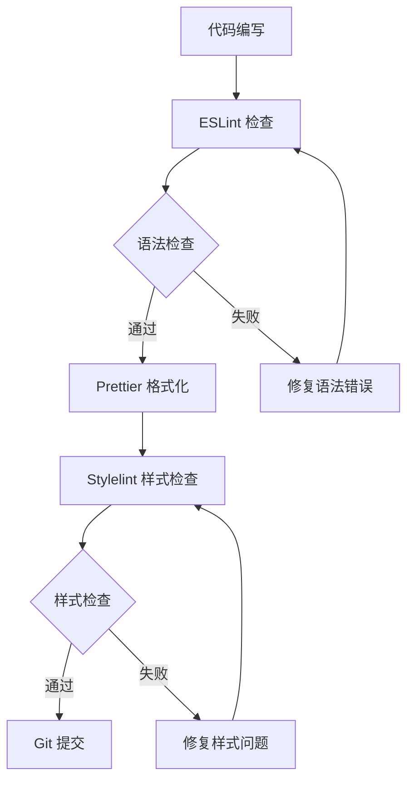
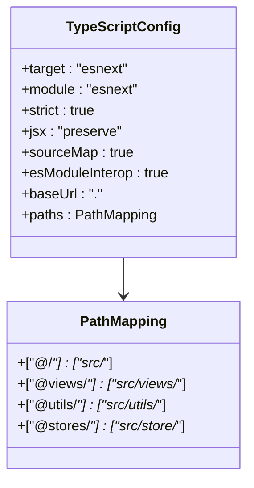
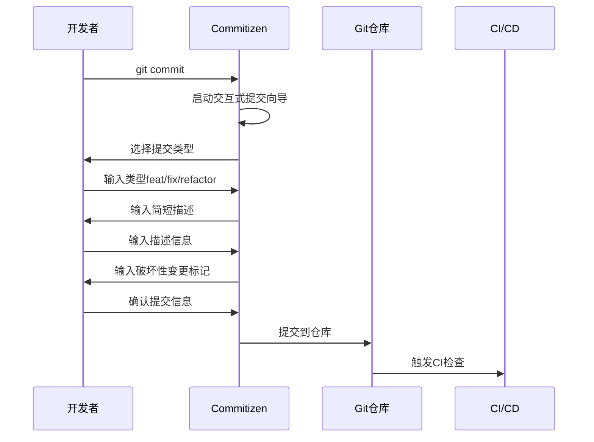
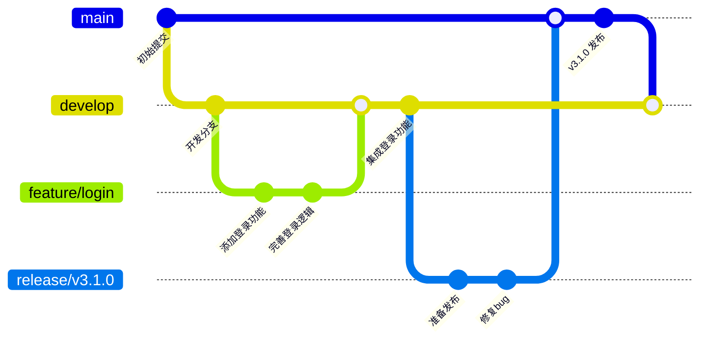
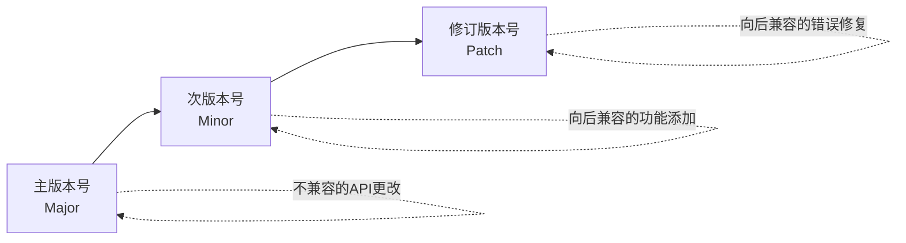
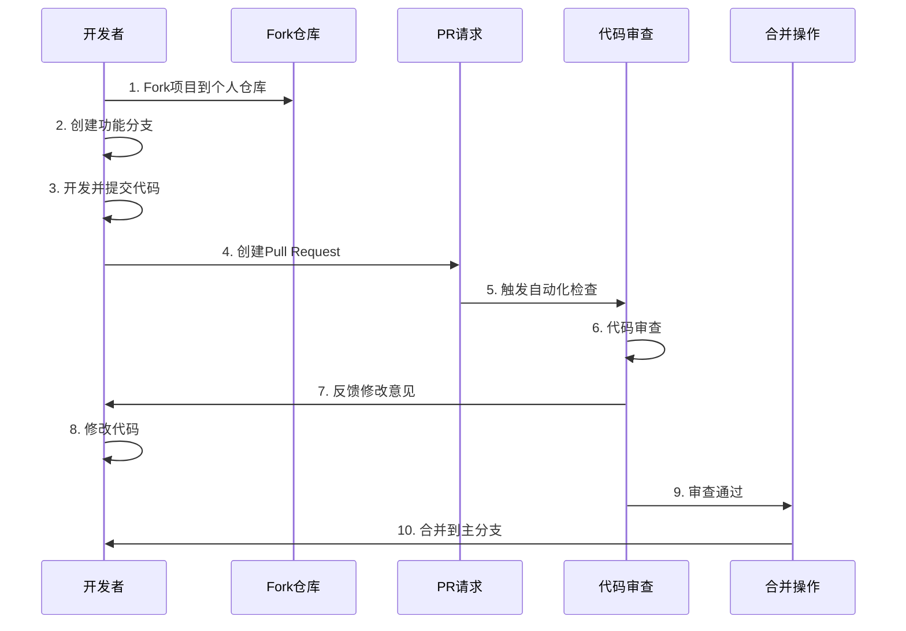
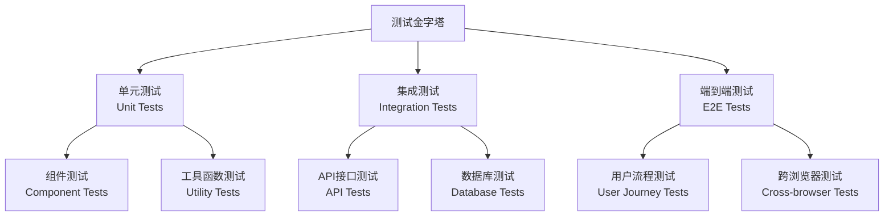
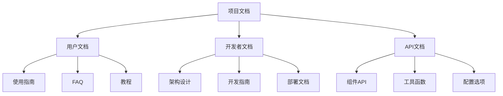

# 贡献指南

<cite>
**本文档引用的文件**
- [package.json](file://package.json)
- [README.md](file://README.md)
- [CHANGELOG.md](file://CHANGELOG.md)
- [eslint.config.mjs](file://eslint.config.mjs)
- [vite.config.ts](file://vite.config.ts)
- [tsconfig.json](file://tsconfig.json)
- [scripts/clean-dev.ts](file://scripts/clean-dev.ts)
- [src/config/setting.ts](file://src/config/setting.ts)
- [src/types/index.ts](file://src/types/index.ts)
</cite>

## 目录
1. [项目简介](#项目简介)
2. [开发环境搭建](#开发环境搭建)
3. [代码风格规范](#代码风格规范)
4. [提交规范](#提交规范)
5. [分支管理策略](#分支管理策略)
6. [Pull Request 流程](#pull-request-流程)
7. [问题报告机制](#问题报告机制)
8. [测试指南](#测试指南)
9. [文档贡献](#文档贡献)
10. [社区行为准则](#社区行为准则)
11. [常见问题解答](#常见问题解答)

## 项目简介

Art Design Pro 是一个结合设计美学与高效开发的后台系统模板，采用 Vue3、TypeScript、Vite、Element-Plus 和 Tailwind CSS 技术栈构建。项目致力于为开发者提供专业级的应用开发解决方案，具有以下特色：

- **现代界面设计**：注重用户体验和视觉设计的平滑交互
- **快速启动**：清晰的架构 + 完整的文档，便于后端开发者使用
- **丰富组件库**：内置高质量组件用于数据展示、表单处理等
- **流畅交互体验**：按钮点击、主题切换、页面过渡、图表动画等
- **高效开发**：内置实用 API 如 useTable 和 ArtForm 显著提升开发效率
- **清洁脚本**：内置一键清理脚本快速移除演示数据

**章节来源**
- [README.md](file://README.md#L1-L105)
- [package.json](file://package.json#L1-L124)

## 开发环境搭建

### 系统要求

项目对开发环境有以下要求：

| 组件 | 最低版本 | 推荐版本 |
|------|----------|----------|
| Node.js | ≥20.19.0 | 最新 LTS 版本 |
| pnpm | ≥8.8.0 | 最新稳定版本 |

### 安装步骤

1. **克隆项目**
```bash
git clone https://github.com/Daymychen/art-design-pro.git
cd art-design-pro
```

2. **安装依赖**
```bash
# 推荐安装方式
pnpm install

# 如果安装失败，可尝试忽略脚本
pnpm install --ignore-scripts
```

3. **启动开发服务器**
```bash
pnpm dev
```

4. **构建生产版本**
```bash
pnpm build
```

### 清洁开发环境

项目提供一键清理脚本，快速移除演示数据并准备干净的开发环境：

```bash
pnpm clean:dev
```

该脚本会：
- 删除演示页面和组件
- 清理路由模块和配置
- 移除演示数据和图片资源
- 重置语言文件和配置

**章节来源**
- [README.md](file://README.md#L50-L72)
- [scripts/clean-dev.ts](file://scripts/clean-dev.ts#L1-L839)

## 代码风格规范

### ESLint 配置

项目采用严格的 ESLint 配置确保代码质量：



**图表来源**
- [eslint.config.mjs](file://eslint.config.mjs#L1-L84)
- [package.json](file://package.json#L13-L17)

### 代码规范要点

| 规范类型 | 规则 | 示例 |
|----------|------|------|
| 引号使用 | 单引号优先 | `'single-quote'` |
| 分号使用 | 不使用分号 | `const foo = 'bar'` |
| 缩进 | 2个空格 | 使用空格而非制表符 |
| 命名规范 | 驼峰命名法 | `camelCase` |
| 注释规范 | JSDoc 格式 | `/** @param {type} name */` |

### TypeScript 配置

项目使用严格的 TypeScript 配置：



**图表来源**
- [tsconfig.json](file://tsconfig.json#L1-L29)

**章节来源**
- [eslint.config.mjs](file://eslint.config.mjs#L41-L62)
- [tsconfig.json](file://tsconfig.json#L2-L28)

## 提交规范

### Commitizen 工具

项目使用 Commitizen 结合 cz-git 工具确保提交信息的标准化：



**图表来源**
- [package.json](file://package.json#L18-L20)

### 提交信息格式

遵循 Conventional Commits 标准：

```
<type>(<scope>): <subject>

<body>

<footer>
```

#### 提交类型 (Type)

| 类型 | 描述 | 示例 |
|------|------|------|
| feat | 新功能 | `feat(auth): 添加用户登录功能` |
| fix | 错误修复 | `fix(table): 修复分页显示问题` |
| docs | 文档更新 | `docs(readme): 更新安装说明` |
| style | 代码格式 | `style(css): 优化样式文件` |
| refactor | 代码重构 | `refactor(utils): 优化工具函数` |
| test | 测试相关 | `test(unit): 添加单元测试` |
| chore | 构建过程 | `chore(deps): 更新依赖版本` |

#### 提交范围 (Scope)

可选字段，用于指定受影响的模块：
- `auth`: 认证相关
- `table`: 表格组件
- `form`: 表单组件
- `ui`: 用户界面
- `api`: API 接口
- `config`: 配置文件

### 提交前检查

项目配置了 Husky 和 lint-staged，在提交前自动执行以下检查：

1. **ESLint 检查**：确保代码语法正确
2. **Prettier 格式化**：统一代码风格
3. **Stylelint 检查**：验证样式文件
4. **TypeScript 编译**：确保类型安全

**章节来源**
- [package.json](file://package.json#L18-L20)
- [package.json](file://package.json#L27-L52)

## 分支管理策略

### Git Flow 工作流

项目采用标准的 Git Flow 分支管理策略：



### 分支命名规范

| 分支类型 | 命名格式 | 示例 |
|----------|----------|------|
| 功能分支 | `feature/<功能名称>` | `feature/user-management` |
| 修复分支 | `fix/<问题描述>` | `fix/table-pagination` |
| 热修复分支 | `hotfix/<紧急修复>` | `hotfix/security-patch` |
| 发布分支 | `release/<版本号>` | `release/v3.1.0` |
| 开发分支 | `develop` | `develop` |
| 主分支 | `main` | `main` |

### 版本发布策略

项目遵循语义化版本控制 (SemVer)：



**图表来源**
- [CHANGELOG.md](file://CHANGELOG.md#L612-L637)

**章节来源**
- [CHANGELOG.md](file://CHANGELOG.md#L612-L637)

## Pull Request 流程

### PR 创建流程



### PR 模板要求

创建 Pull Request 时，请按照以下模板填写：

#### 标题格式
```
[类型]: 简短描述 (例如: feat: 添加用户认证功能)
```

#### 描述模板
```markdown
## 变更类型
- [ ] 新功能 (feat:)
- [ ] 修复bug (fix:)
- [ ] 性能优化 (perf:)
- [ ] 代码重构 (refactor:)
- [ ] 文档更新 (docs:)
- [ ] 样式调整 (style:)
- [ ] 测试改进 (test:)
- [ ] 其他 (chore:)

## 变更说明
详细描述本次变更的内容和目的。

## 测试情况
- [ ] 已添加单元测试
- [ ] 已进行手动测试
- [ ] 测试覆盖率符合要求

## 破坏性变更
如果存在破坏性变更，请在此说明影响范围。

## 检查清单
- [ ] 代码符合项目规范
- [ ] 已更新相关文档
- [ ] 已添加必要的测试
- [ ] 已清理无用代码
```

### 代码审查标准

1. **功能性**：代码是否实现了预期功能
2. **性能**：是否存在性能瓶颈
3. **安全性**：是否有安全漏洞
4. **可维护性**：代码是否易于理解和维护
5. **测试覆盖**：是否包含适当的测试

### 合并要求

- 所有自动化检查必须通过
- 至少一名维护者的代码审查同意
- 解决所有审查提出的问题
- 保持提交历史的整洁

**章节来源**
- [README.md](file://README.md#L82-L90)

## 问题报告机制

### 问题报告模板

当遇到问题或发现 bug 时，请使用以下模板提交 Issue：

#### Bug 报告模板
```markdown
## 问题描述
简洁清晰地描述遇到的问题。

## 复现步骤
1. 执行操作 A
2. 点击按钮 B
3. 出现错误 C

## 预期行为
描述期望的正确行为。

## 实际行为
描述实际发生的错误行为。

## 环境信息
- 浏览器: [例如: Chrome 120.0.0.0]
- 操作系统: [例如: Windows 11]
- 项目版本: [例如: v3.0.1]
- Node.js 版本: [例如: v20.19.0]

## 截图/视频
如有必要，请提供截图或录屏。

## 附加信息
其他可能有助于问题解决的信息。
```

#### 功能建议模板
```markdown
## 功能描述
详细描述建议的功能。

## 使用场景
说明该功能的应用场景。

## 实现方案（可选）
如果有想法，可以提供实现建议。

## 替代方案
是否还有其他替代方案？
```

### 问题分类

| 类型 | 标签 | 描述 |
|------|------|------|
| Bug | `bug` | 代码缺陷或功能异常 |
| 功能请求 | `enhancement` | 新功能建议 |
| 性能问题 | `performance` | 性能相关问题 |
| 文档问题 | `documentation` | 文档相关问题 |
| 重构需求 | `refactor` | 代码重构需求 |

### 响应时间承诺

- **Bug 报告**：24小时内确认
- **功能请求**：48小时内评估
- **文档问题**：1个工作日内响应

**章节来源**
- [README.md](file://README.md#L82-L90)

## 测试指南

### 测试策略

项目采用多层次的测试策略：



### 测试工具配置

项目使用以下测试工具：

| 工具 | 用途 | 配置位置 |
|------|------|----------|
| Vitest | 单元测试框架 | `vitest.config.ts` |
| Playwright | E2E 测试 | `playwright.config.ts` |
| Cypress | UI 测试 | `cypress.config.ts` |
| Jest | 测试运行器 | `jest.config.js` |

### 测试最佳实践

1. **测试覆盖率**：保持至少 80% 的代码覆盖率
2. **测试命名**：使用描述性的测试名称
3. **测试隔离**：每个测试应该独立运行
4. **断言清晰**：使用有意义的断言语句
5. **模拟外部依赖**：合理使用 Mock 和 Stub

### 运行测试

```bash
# 运行所有测试
pnpm test

# 运行特定测试文件
pnpm test <文件路径>

# 监视模式运行测试
pnpm test:watch

# 生成测试覆盖率报告
pnpm test:coverage
```

## 文档贡献

### 文档结构

项目文档分为多个层次：



### 文档编写规范

1. **Markdown 格式**：使用标准 Markdown 语法
2. **标题层级**：合理使用标题层级
3. **代码示例**：提供可运行的代码示例
4. **图片说明**：为图片添加描述性文字
5. **链接规范**：使用相对链接而非绝对链接

### 文档更新流程

1. **本地预览**：在本地构建文档
2. **同行评审**：邀请其他贡献者审阅
3. **格式检查**：确保文档格式正确
4. **翻译同步**：更新多语言版本

**章节来源**
- [README.md](file://README.md#L47-L49)

## 社区行为准则

### 核心价值观

我们致力于营造一个包容、尊重和协作的开源社区环境：

1. **尊重他人**：尊重不同的观点和经验
2. **友善沟通**：使用友好、清晰的语言
3. **建设性反馈**：提供建设性的意见和建议
4. **包容性**：欢迎所有背景的贡献者
5. **学习精神**：乐于分享知识和经验

### 行为标准

#### 可接受的行为
- 尊重不同观点和经验
- 专业且礼貌地讨论
- 接受建设性批评
- 关注对社区最有利的事情
- 对其他社区成员表示友好

#### 不可接受的行为
- 使用性别化语言或图像
- 恶意评论或人身攻击
- 公开或私下骚扰
- 发布他人私人信息
- 其他不专业的行为

### 执行机制

1. **自我约束**：鼓励社区成员自我监督
2. **举报渠道**：通过私信或邮件举报不当行为
3. **调查处理**：维护团队将及时调查并处理
4. **后果措施**：根据严重程度采取相应措施

### 贡献形式

项目欢迎多种形式的贡献：

| 贡献类型 | 描述 | 价值 |
|----------|------|------|
| 代码贡献 | 编写和优化代码 | 提升项目功能和性能 |
| 文档改进 | 完善文档和教程 | 降低使用门槛 |
| 问题报告 | 发现和报告bug | 提高软件质量 |
| 功能建议 | 提出新功能想法 | 指导发展方向 |
| 社区支持 | 帮助其他用户 | 建设友好社区 |
| 设计贡献 | 改进UI/UX设计 | 提升用户体验 |

**章节来源**
- [README.md](file://README.md#L82-L90)

## 常见问题解答

### 开发环境问题

**Q: pnpm install 失败怎么办？**
A: 尝试使用 `pnpm install --ignore-scripts` 忽略安装脚本，或者检查 Node.js 版本是否符合要求。

**Q: 为什么需要运行 clean:dev 脚本？**
A: 该脚本移除演示数据和组件，为你提供干净的开发环境，便于开始自己的项目开发。

**Q: 如何配置开发环境代理？**
A: 在 `.env` 文件中配置 `VITE_API_PROXY_URL` 来设置 API 代理地址。

### 代码贡献问题

**Q: 提交信息格式有什么要求？**
A: 使用 Commitizen 工具自动生成符合 Conventional Commits 标准的提交信息。

**Q: 代码风格检查失败怎么办？**
A: 运行 `pnpm fix` 自动修复大部分格式问题，复杂问题需要手动修改。

**Q: 如何处理分支冲突？**
A: 在合并前先 rebase 或 merge 主分支的最新更改。

### 测试和部署问题

**Q: 如何运行测试？**
A: 使用 `pnpm test` 运行测试套件，使用 `pnpm test:coverage` 查看覆盖率。

**Q: 生产环境构建失败？**
A: 检查 Node.js 版本和依赖安装，确保使用正确的构建命令。

**Q: 如何部署项目？**
A: 使用 `pnpm build` 构建生产版本，然后部署到静态文件服务器。

### 社区参与问题

**Q: 如何获得技术支持？**
A: 加入 QQ 群 821834289 或在 GitHub Issues 中提问。

**Q: 如何参与社区讨论？**
A: 关注 GitHub Discussions，积极参与话题讨论。

**Q: 如何成为项目维护者？**
A: 通过持续高质量的贡献积累社区认可，维护团队会主动邀请。

**章节来源**
- [README.md](file://README.md#L74-L81)
- [scripts/clean-dev.ts](file://scripts/clean-dev.ts#L1-L839)

## 结语

感谢您对 Art Design Pro 项目的关注和支持！我们相信通过完善的贡献指南，能够帮助更多开发者参与到这个优秀的开源项目中来。无论您是初学者还是经验丰富的开发者，都可以在这里找到适合自己的贡献方式。

如果您在使用过程中遇到任何问题，或者有任何改进建议，请随时通过 GitHub Issues 或社区群组与我们联系。让我们一起努力，将 Art Design Pro 打造得更加完善！

**项目官网**: [https://www.artd.pro](https://www.artd.pro)  
**官方文档**: [https://www.artd.pro/docs](https://www.artd.pro/docs)  
**Live Demo**: [https://www.artd.pro](https://www.artd.pro)

期待您的精彩贡献！🚀