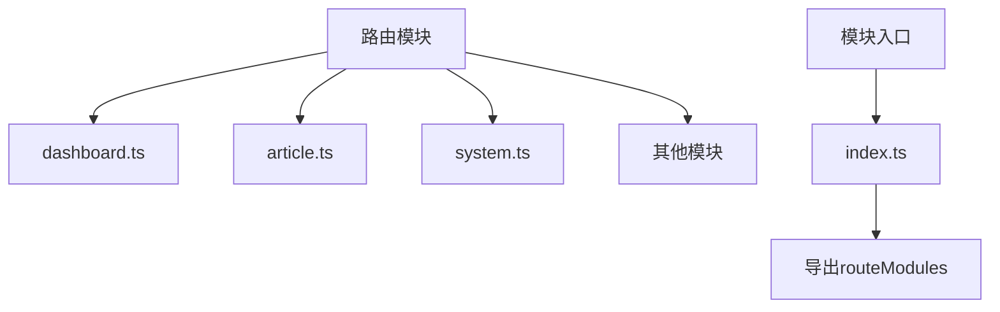
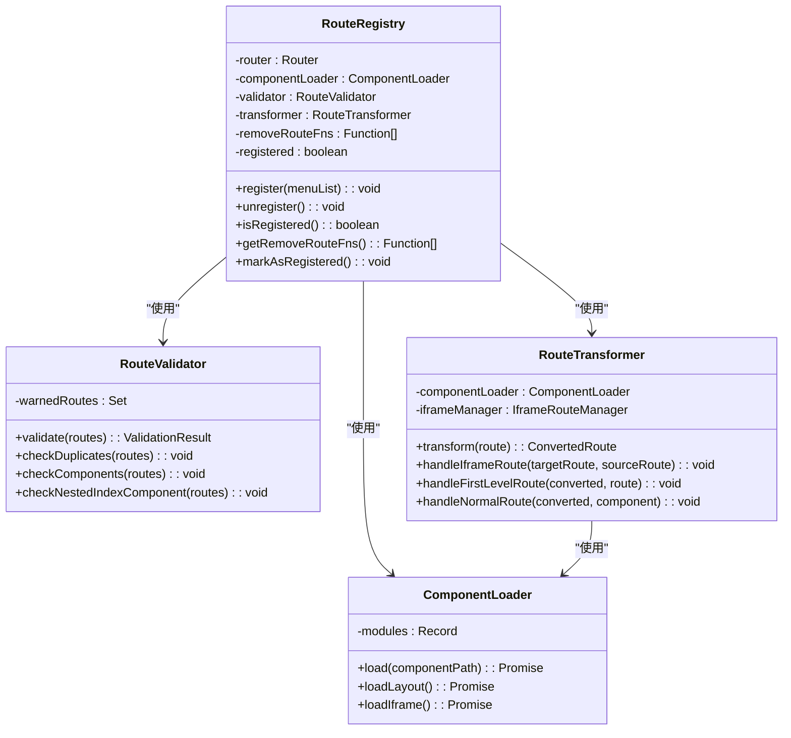
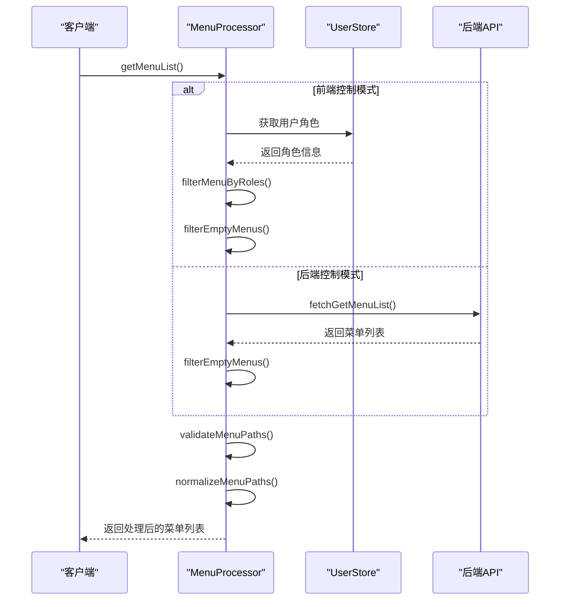
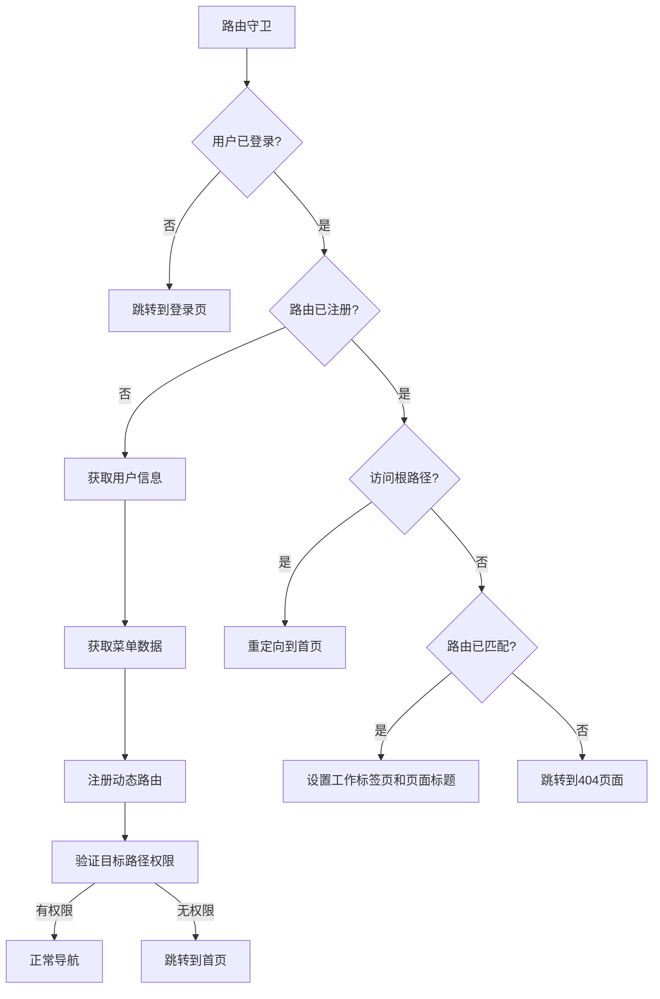
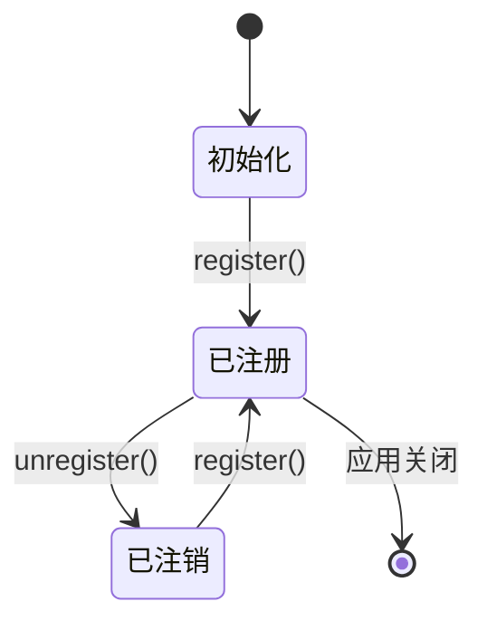

# 动态路由

<cite>
**本文档引用的文件**
- [RouteRegistry.ts](file://src/router/core/RouteRegistry.ts)
- [MenuProcessor.ts](file://src/router/core/MenuProcessor.ts)
- [dashboard.ts](file://src/router/modules/dashboard.ts)
- [article.ts](file://src/router/modules/article.ts)
- [system.ts](file://src/router/modules/system.ts)
- [asyncRoutes.ts](file://src/router/routes/asyncRoutes.ts)
- [index.ts](file://src/router/modules/index.ts)
- [ComponentLoader.ts](file://src/router/core/ComponentLoader.ts)
- [RouteValidator.ts](file://src/router/core/RouteValidator.ts)
- [RouteTransformer.ts](file://src/router/core/RouteTransformer.ts)
- [beforeEach.ts](file://src/router/guards/beforeEach.ts)
- [user.ts](file://src/store/modules/user.ts)
- [router/index.ts](file://src/router/index.ts)
</cite>

## 目录
1. [简介](#简介)
2. [模块化路由设计](#模块化路由设计)
3. [动态路由注册机制](#动态路由注册机制)
4. [菜单数据处理](#菜单数据处理)
5. [权限控制集成](#权限控制集成)
6. [使用示例](#使用示例)
7. [生命周期管理](#生命周期管理)
8. [总结](#总结)

## 简介
本项目采用模块化设计的动态路由机制，通过将路由配置分散到不同的功能模块中，实现了灵活的路由管理和权限控制。系统在运行时根据用户权限动态注册路由，确保用户只能访问其有权限的页面。这种设计不仅提高了代码的可维护性，还增强了系统的安全性和灵活性。

## 模块化路由设计
项目采用模块化路由设计，将不同功能模块的路由配置分离到独立的文件中，便于管理和维护。



**Diagram sources**
- [dashboard.ts](file://src/router/modules/dashboard.ts)
- [article.ts](file://src/router/modules/article.ts)
- [system.ts](file://src/router/modules/system.ts)
- [index.ts](file://src/router/modules/index.ts)

**Section sources**
- [dashboard.ts](file://src/router/modules/dashboard.ts#L1-L46)
- [article.ts](file://src/router/modules/article.ts#L1-L61)
- [system.ts](file://src/router/modules/system.ts#L1-L150)
- [index.ts](file://src/router/modules/index.ts#L1-L28)

### 功能模块路由定义
每个功能模块（如dashboard、article、system）都定义了其专属的路由配置，并通过命名导出的方式暴露给系统。

#### 仪表盘模块
仪表盘模块定义了控制台、分析和电子商务等子路由，每个路由都包含了路径、名称、组件和元数据信息。

**Section sources**
- [dashboard.ts](file://src/router/modules/dashboard.ts#L1-L46)

#### 文章模块
文章模块包含了文章列表、详情、评论和发布等路由，支持动态参数和权限控制。

**Section sources**
- [article.ts](file://src/router/modules/article.ts#L1-L61)

#### 系统管理模块
系统管理模块定义了用户、角色、菜单等管理功能的路由，支持多级嵌套路由结构。

**Section sources**
- [system.ts](file://src/router/modules/system.ts#L1-L150)

## 动态路由注册机制
动态路由注册机制是系统的核心，通过RouteRegistry类在运行时动态注册路由。



**Diagram sources**
- [RouteRegistry.ts](file://src/router/core/RouteRegistry.ts#L1-L91)
- [ComponentLoader.ts](file://src/router/core/ComponentLoader.ts#L1-L83)
- [RouteValidator.ts](file://src/router/core/RouteValidator.ts#L1-L188)
- [RouteTransformer.ts](file://src/router/core/RouteTransformer.ts#L1-L133)

**Section sources**
- [RouteRegistry.ts](file://src/router/core/RouteRegistry.ts#L1-L91)
- [ComponentLoader.ts](file://src/router/core/ComponentLoader.ts#L1-L83)
- [RouteValidator.ts](file://src/router/core/RouteValidator.ts#L1-L188)
- [RouteTransformer.ts](file://src/router/core/RouteTransformer.ts#L1-L133)

### RouteRegistry类
RouteRegistry类负责动态路由的注册、验证和管理，是动态路由系统的核心组件。

#### 注册流程
1. 验证路由配置的合法性
2. 转换路由配置
3. 注册路由到Vue Router
4. 记录移除函数以便后续注销

**Section sources**
- [RouteRegistry.ts](file://src/router/core/RouteRegistry.ts#L34-L59)

#### 组件加载
ComponentLoader类负责动态加载Vue组件，通过import.meta.glob自动扫描views目录下的所有.vue文件。

**Section sources**
- [ComponentLoader.ts](file://src/router/core/ComponentLoader.ts#L1-L83)

#### 路由验证
RouteValidator类负责验证路由配置的合法性，包括检测重复路由、组件配置和嵌套菜单的Layout组件使用。

**Section sources**
- [RouteValidator.ts](file://src/router/core/RouteValidator.ts#L26-L43)

#### 路由转换
RouteTransformer类负责将菜单数据转换为Vue Router的路由配置，处理不同类型的路由（iframe、一级菜单、普通路由）。

**Section sources**
- [RouteTransformer.ts](file://src/router/core/RouteTransformer.ts#L33-L57)

## 菜单数据处理
MenuProcessor类负责处理菜单数据，包括获取、过滤和规范化路径。



**Diagram sources**
- [MenuProcessor.ts](file://src/router/core/MenuProcessor.ts#L1-L242)
- [user.ts](file://src/store/modules/user.ts#L1-L236)

**Section sources**
- [MenuProcessor.ts](file://src/router/core/MenuProcessor.ts#L1-L242)
- [user.ts](file://src/store/modules/user.ts#L1-L236)

### 处理流程
1. 根据应用模式（前端控制或后端控制）获取菜单数据
2. 根据用户角色过滤菜单
3. 过滤空菜单项
4. 验证菜单路径配置
5. 规范化菜单路径

**Section sources**
- [MenuProcessor.ts](file://src/router/core/MenuProcessor.ts#L22-L37)

### 权限过滤
在前端控制模式下，根据用户角色过滤菜单，确保用户只能看到其有权限的菜单项。

**Section sources**
- [MenuProcessor.ts](file://src/router/core/MenuProcessor.ts#L67-L82)

### 路径规范化
将相对路径转换为完整路径，确保菜单跳转正确。同时验证路径配置，防止非一级菜单错误使用以/开头的路径。

**Section sources**
- [MenuProcessor.ts](file://src/router/core/MenuProcessor.ts#L132-L147)

## 权限控制集成
动态路由与权限控制深度集成，确保用户只能访问其有权限的路由。



**Diagram sources**
- [beforeEach.ts](file://src/router/guards/beforeEach.ts#L1-L361)
- [user.ts](file://src/store/modules/user.ts#L1-L236)

**Section sources**
- [beforeEach.ts](file://src/router/guards/beforeEach.ts#L1-L361)
- [user.ts](file://src/store/modules/user.ts#L1-L236)

### 集成方式
1. 在路由前置守卫中检查用户登录状态
2. 未登录时跳转到登录页
3. 登录后获取用户信息和菜单数据
4. 根据用户权限动态注册路由
5. 验证目标路径的访问权限

**Section sources**
- [beforeEach.ts](file://src/router/guards/beforeEach.ts#L118-L158)

### 权限验证
通过用户角色和路由配置中的roles字段进行权限匹配，只有角色匹配的用户才能访问相应的路由。

**Section sources**
- [MenuProcessor.ts](file://src/router/core/MenuProcessor.ts#L67-L82)

## 使用示例
以下是如何添加新的功能模块路由的示例。

### 添加新模块
1. 在src/router/modules目录下创建新的路由模块文件
2. 定义路由配置并导出
3. 在index.ts中导入并添加到routeModules数组中


**Section sources**
- [index.ts](file://src/router/modules/index.ts#L1-L28)

### 示例代码结构
```typescript
// 新模块文件：src/router/modules/newModule.ts
import { AppRouteRecord } from '@/types/router'

export const newModuleRoutes: AppRouteRecord = {
  path: '/new-module',
  name: 'NewModule',
  component: '/index/index',
  meta: {
    title: 'menus.newModule.title',
    icon: 'ri:new-icon',
    roles: ['R_SUPER', 'R_ADMIN']
  },
  children: [
    {
      path: 'list',
      name: 'NewModuleList',
      component: '/new-module/list',
      meta: {
        title: 'menus.newModule.list',
        icon: 'ri:list-icon',
        keepAlive: true
      }
    }
  ]
}
```

**Section sources**
- [dashboard.ts](file://src/router/modules/dashboard.ts#L1-L46)

## 生命周期管理
动态路由的生命周期管理包括路由注册、注销和内存泄漏防范措施。

### 注册与注销
RouteRegistry类提供了register和unregister方法，用于注册和注销动态路由。



**Section sources**
- [RouteRegistry.ts](file://src/router/core/RouteRegistry.ts#L34-L69)

### 内存泄漏防范
1. 记录路由移除函数，在注销时调用
2. 清理相关状态和缓存
3. 重置注册状态

**Section sources**
- [RouteRegistry.ts](file://src/router/core/RouteRegistry.ts#L64-L68)
- [beforeEach.ts](file://src/router/guards/beforeEach.ts#L319-L327)

## 总结
本项目的动态路由系统采用模块化设计，通过RouteRegistry类在运行时动态注册路由，实现了灵活的路由管理和权限控制。系统通过MenuProcessor类处理菜单数据，与权限控制深度集成，确保用户只能访问其有权限的页面。整个系统具有良好的可维护性和扩展性，为应用提供了安全可靠的路由管理机制。