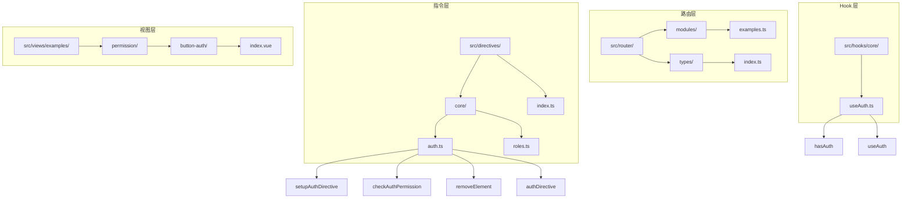
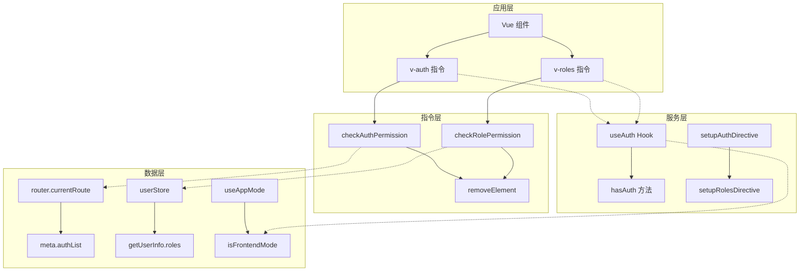
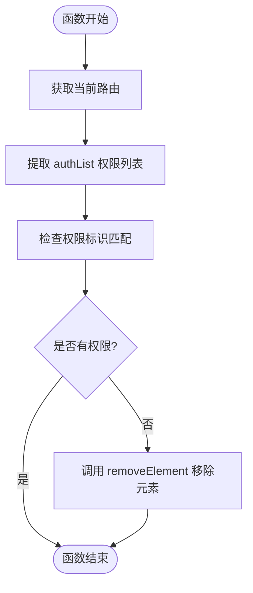
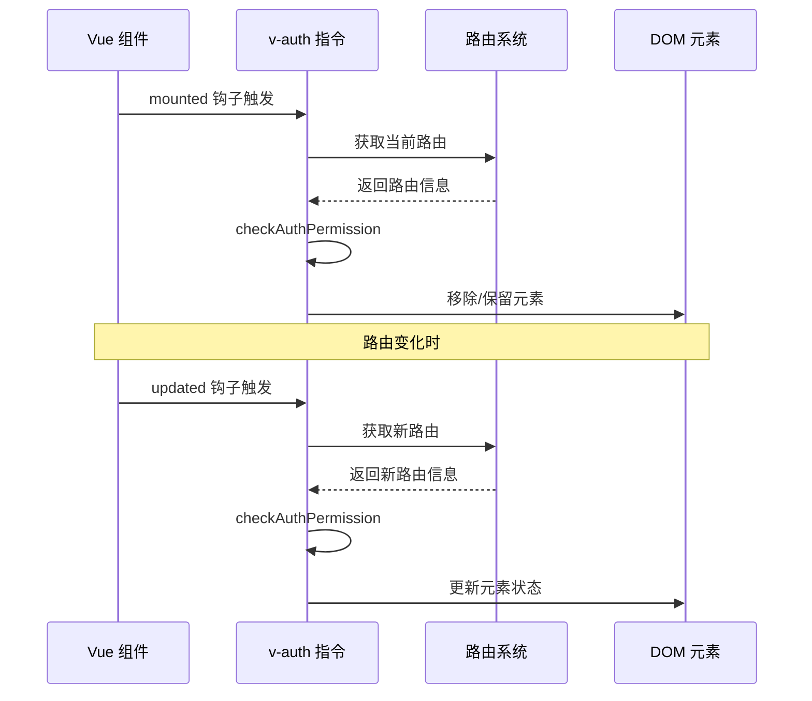
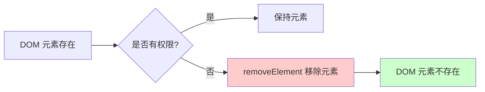
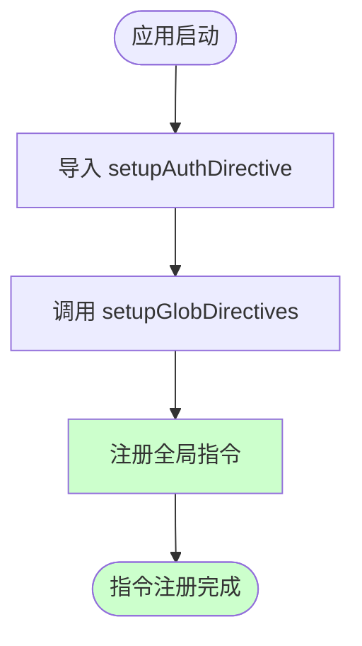
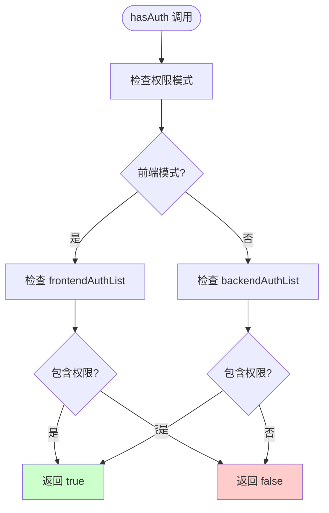
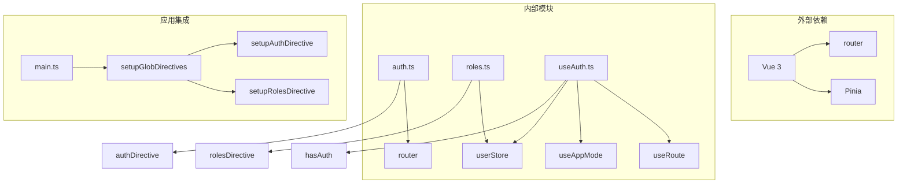

# 权限指令实现

<cite>
**本文档引用的文件**
- [src/directives/core/auth.ts](file://src/directives/core/auth.ts)
- [src/directives/core/roles.ts](file://src/directives/core/roles.ts)
- [src/directives/index.ts](file://src/directives/index.ts)
- [src/hooks/core/useAuth.ts](file://src/hooks/core/useAuth.ts)
- [src/main.ts](file://src/main.ts)
- [src/views/examples/permission/button-auth/index.vue](file://src/views/examples/permission/button-auth/index.vue)
- [src/router/modules/examples.ts](file://src/router/modules/examples.ts)
- [src/types/router/index.ts](file://src/types/router/index.ts)
</cite>

## 目录
1. [简介](#简介)
2. [项目结构](#项目结构)
3. [核心组件](#核心组件)
4. [架构概览](#架构概览)
5. [详细组件分析](#详细组件分析)
6. [依赖关系分析](#依赖关系分析)
7. [性能考虑](#性能考虑)
8. [故障排除指南](#故障排除指南)
9. [结论](#结论)

## 简介

Art Design Pro 提供了一套完整的权限控制系统，其中 v-auth 指令是基于后端权限控制模式的核心组件。该指令通过直接移除 DOM 元素而非隐藏的方式来实现权限控制，确保了更高的安全性和性能表现。

权限指令系统支持两种主要的权限控制模式：
- **前端模式**：基于用户状态中的按钮权限列表进行权限验证
- **后端模式**：基于路由元数据中的权限配置进行权限验证

## 项目结构

权限指令相关文件的组织结构如下：



**图表来源**
- [src/directives/core/auth.ts](file://src/directives/core/auth.ts#L1-L69)
- [src/directives/index.ts](file://src/directives/index.ts#L1-L13)
- [src/hooks/core/useAuth.ts](file://src/hooks/core/useAuth.ts#L1-L74)

**章节来源**
- [src/directives/core/auth.ts](file://src/directives/core/auth.ts#L1-L69)
- [src/directives/index.ts](file://src/directives/index.ts#L1-L13)

## 核心组件

### v-auth 权限指令

v-auth 指令是基于后端权限控制模式的核心权限验证组件，专门用于控制 DOM 元素的显示和隐藏。

#### 主要特性

1. **权限验证**：根据路由 meta 中的权限列表验证用户权限
2. **DOM 控制**：无权限时自动移除元素，而非隐藏
3. **响应式更新**：权限变化时自动更新元素状态

#### 接口定义

```typescript
interface AuthBinding extends DirectiveBinding {
  value: string
}
```

**章节来源**
- [src/directives/core/auth.ts](file://src/directives/core/auth.ts#L38-L40)

### v-roles 角色权限指令

v-roles 指令基于用户角色进行权限控制，支持单个角色或多角色的权限验证。

#### 主要特性

1. **角色验证**：检查用户是否拥有指定角色
2. **多角色支持**：支持单个角色或多个角色（满足其一即可）
3. **DOM 控制**：无权限时自动移除元素
4. **响应式更新**：角色变化时自动更新元素状态

**章节来源**
- [src/directives/core/roles.ts](file://src/directives/core/roles.ts#L1-L89)

## 架构概览

权限指令系统的整体架构采用分层设计，确保了良好的可维护性和扩展性：



**图表来源**
- [src/directives/core/auth.ts](file://src/directives/core/auth.ts#L42-L68)
- [src/directives/core/roles.ts](file://src/directives/core/roles.ts#L54-L89)
- [src/hooks/core/useAuth.ts](file://src/hooks/core/useAuth.ts#L43-L74)

## 详细组件分析

### v-auth 指令实现分析

#### checkAuthPermission 函数

checkAuthPermission 是 v-auth 指令的核心验证函数，负责从当前路由的 meta.authList 中获取权限列表并进行权限标识匹配。



**图表来源**
- [src/directives/core/auth.ts](file://src/directives/core/auth.ts#L42-L52)

#### mounted 和 updated 生命周期钩子

v-auth 指令在 mounted 和 updated 生命周期钩子中都调用 checkAuthPermission 函数，确保：

1. **初始验证**：组件挂载时立即验证权限
2. **响应式更新**：当路由变化或权限状态改变时重新验证



**图表来源**
- [src/directives/core/auth.ts](file://src/directives/core/auth.ts#L61-L64)

#### removeElement 函数设计考量

removeElement 函数直接移除 DOM 元素而非隐藏的设计具有以下优势：

1. **安全性提升**：防止通过开发者工具查看被隐藏的元素
2. **性能优化**：减少 DOM 节点数量，提高渲染性能
3. **内存管理**：及时释放不需要的 DOM 资源
4. **SEO 友好**：搜索引擎无法抓取被移除的元素内容



**图表来源**
- [src/directives/core/auth.ts](file://src/directives/core/auth.ts#L55-L59)

**章节来源**
- [src/directives/core/auth.ts](file://src/directives/core/auth.ts#L42-L68)

### setupAuthDirective 函数

setupAuthDirective 函数负责在应用实例上注册全局指令，是权限指令系统初始化的关键步骤。

#### 注册流程



**图表来源**
- [src/directives/index.ts](file://src/directives/index.ts#L7-L12)
- [src/main.ts](file://src/main.ts#L21)

**章节来源**
- [src/directives/core/auth.ts](file://src/directives/core/auth.ts#L66-L68)
- [src/directives/index.ts](file://src/directives/index.ts#L7-L12)

### useAuth Hook 分析

useAuth Hook 提供了编程式的权限验证功能，支持前端和后端两种权限模式。

#### 权限验证逻辑



**图表来源**
- [src/hooks/core/useAuth.ts](file://src/hooks/core/useAuth.ts#L61-L69)

**章节来源**
- [src/hooks/core/useAuth.ts](file://src/hooks/core/useAuth.ts#L43-L74)

## 依赖关系分析

权限指令系统的依赖关系体现了清晰的分层架构：



**图表来源**
- [src/directives/core/auth.ts](file://src/directives/core/auth.ts#L35-L36)
- [src/hooks/core/useAuth.ts](file://src/hooks/core/useAuth.ts#L33-L37)
- [src/main.ts](file://src/main.ts#L19-L21)

**章节来源**
- [src/directives/core/auth.ts](file://src/directives/core/auth.ts#L35-L36)
- [src/hooks/core/useAuth.ts](file://src/hooks/core/useAuth.ts#L33-L37)

## 性能考虑

### 权限验证性能优化

1. **懒加载策略**：权限验证仅在需要时执行
2. **缓存机制**：利用 Vue 的响应式系统避免重复计算
3. **DOM 操作优化**：直接移除而非隐藏元素

### 内存管理

1. **及时清理**：移除不需要的 DOM 元素
2. **事件监听器管理**：避免内存泄漏
3. **组件销毁**：正确处理组件生命周期

## 故障排除指南

### 常见问题及解决方案

#### 1. v-auth 指令不生效

**可能原因**：
- 当前处于前端模式
- 路由配置中缺少 authList
- 权限标识拼写错误

**解决方案**：
- 检查 isFrontendMode 状态
- 验证路由 meta.authList 配置
- 确认权限标识的一致性

#### 2. 权限验证结果不准确

**可能原因**：
- 路由切换时权限状态未更新
- 权限数据加载延迟

**解决方案**：
- 确保在 updated 钩子中重新验证
- 添加权限数据加载状态检查

#### 3. DOM 元素移除异常

**可能原因**：
- 父节点不存在
- 元素已被其他逻辑修改

**解决方案**：
- 添加父节点存在性检查
- 确保元素移除的时机正确

**章节来源**
- [src/views/examples/permission/button-auth/index.vue](file://src/views/examples/permission/button-auth/index.vue#L105-L125)

## 结论

Art Design Pro 的权限指令系统提供了一套完整、高效且安全的权限控制解决方案。v-auth 指令通过直接移除 DOM 元素的方式实现了更高的安全性，同时通过响应式更新机制确保了良好的用户体验。

### 主要优势

1. **安全性**：直接移除 DOM 元素防止信息泄露
2. **性能**：减少不必要的 DOM 节点，提高渲染效率
3. **灵活性**：支持多种权限控制模式
4. **易用性**：简洁的 API 设计，易于集成

### 最佳实践建议

1. **权限标识命名**：使用语义化的权限标识，如 'add_user', 'edit_product'
2. **组合使用**：结合 v-if 和 v-show 实现更复杂的权限控制逻辑
3. **错误处理**：添加适当的错误边界和降级处理
4. **测试覆盖**：确保权限验证逻辑的充分测试

通过合理使用这些权限指令，开发者可以构建出既安全又高效的权限控制系统，满足各种复杂的业务需求。