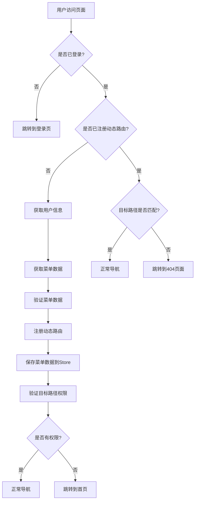
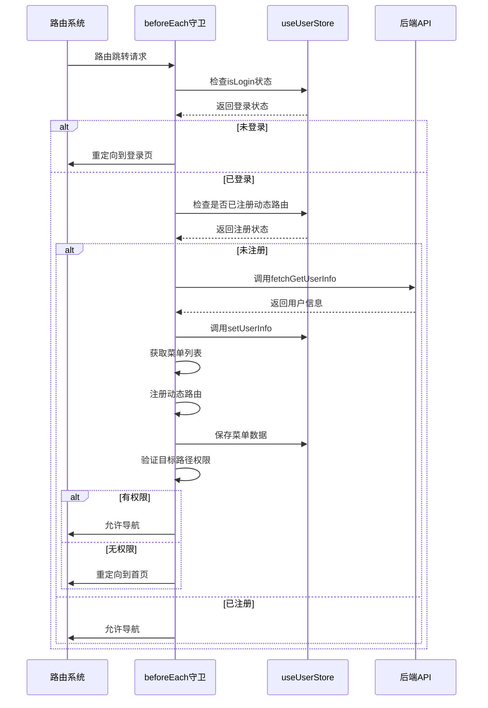
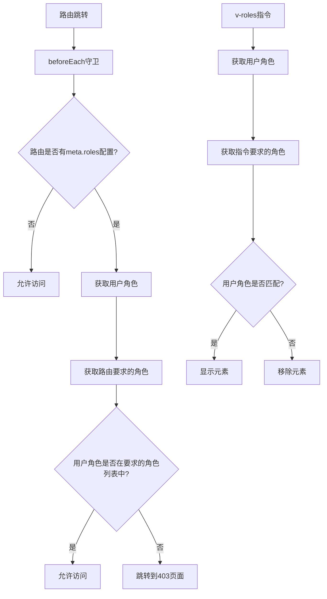
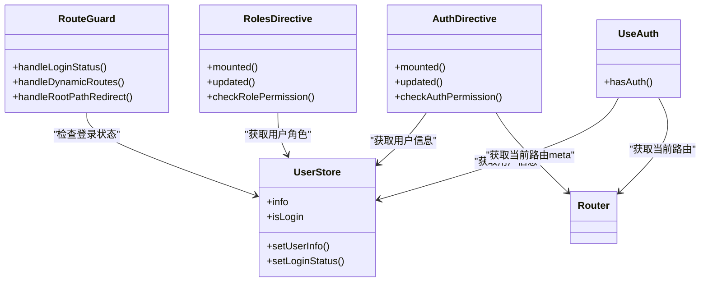
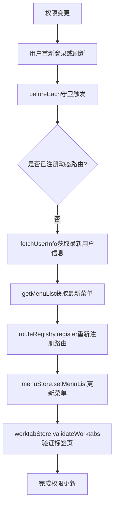
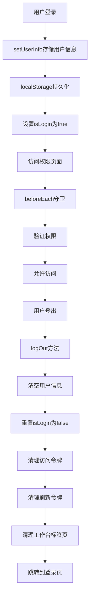

# 权限集成方案

<cite>
**本文档引用的文件**  
- [beforeEach.ts](file://src/router/guards/beforeEach.ts)
- [auth.ts](file://src/directives/core/auth.ts)
- [roles.ts](file://src/directives/core/roles.ts)
- [user.ts](file://src/store/modules/user.ts)
- [RoutePermissionValidator.ts](file://src/router/core/RoutePermissionValidator.ts)
- [useAuth.ts](file://src/hooks/core/useAuth.ts)
- [menu.ts](file://src/store/modules/menu.ts)
- [index.vue](file://src/views/examples/permission/button-auth/index.vue)
- [index.vue](file://src/views/examples/permission/page-visibility/index.vue)
- [index.vue](file://src/views/examples/permission/switch-role/index.vue)
- [asyncRoutes.ts](file://src/router/routes/asyncRoutes.ts)
- [staticRoutes.ts](file://src/router/routes/staticRoutes.ts)
- [index.ts](file://src/router/modules/index.ts)
- [router/index.ts](file://src/types/router/index.ts)
</cite>

## 目录
1. [权限集成方案概述](#权限集成方案概述)
2. [动态路由与权限系统整合机制](#动态路由与权限系统整合机制)
3. [路由守卫与用户权限数据交互](#路由守卫与用户权限数据交互)
4. [基于角色的权限验证流程](#基于角色的权限验证流程)
5. [按钮级别与路由级别权限协同](#按钮级别与路由级别权限协同)
6. [权限变更后动态更新路由](#权限变更后动态更新路由)
7. [权限缓存与刷新策略](#权限缓存与刷新策略)
8. [常见权限问题排查指南](#常见权限问题排查指南)

## 权限集成方案概述

本方案详细阐述了项目中权限系统的完整实现机制，包括动态路由注册、路由守卫、基于角色的访问控制、按钮级别权限控制等核心功能。系统支持前端控制模式和后端控制模式两种权限管理方式，通过灵活的配置满足不同场景的需求。

**权限集成方案概述**
- [beforeEach.ts](file://src/router/guards/beforeEach.ts#L1-L361)
- [user.ts](file://src/store/modules/user.ts#L1-L236)
- [menu.ts](file://src/store/modules/menu.ts#L1-L110)

## 动态路由与权限系统整合机制

系统通过动态路由注册机制实现权限控制，核心流程如下：

1. **路由分类**：将路由分为静态路由和动态路由。静态路由（如登录页、404页面）无需权限即可访问，而动态路由需要权限验证。

2. **动态路由注册**：在用户登录后，通过`RouteRegistry`类动态注册路由。该类负责验证路由配置、转换路由格式并注册到Vue Router中。

3. **菜单数据获取**：通过`MenuProcessor`处理器获取用户可访问的菜单列表，该列表由后端接口返回或前端根据用户角色过滤生成。

4. **路由注册与验证**：将获取的菜单列表转换为路由配置并注册，同时使用`RoutePermissionValidator`验证目标路径的访问权限。

**图示来源**
- [beforeEach.ts](file://src/router/guards/beforeEach.ts#L82-L361)
- [RouteRegistry.ts](file://src/router/core/RouteRegistry.ts#L1-L91)
- [RoutePermissionValidator.ts](file://src/router/core/RoutePermissionValidator.ts#L1-L120)

**权限集成方案概述**
- [beforeEach.ts](file://src/router/guards/beforeEach.ts#L1-L361)
- [RouteRegistry.ts](file://src/router/core/RouteRegistry.ts#L1-L91)
- [RoutePermissionValidator.ts](file://src/router/core/RoutePermissionValidator.ts#L1-L120)

## 路由守卫与用户权限数据交互

系统通过`beforeEach`全局前置守卫实现访问控制，与`useUserStore`进行深度交互：

1. **登录状态检查**：在路由跳转前检查用户登录状态，未登录用户将被重定向到登录页。

2. **用户信息获取**：每次动态路由注册时都会重新获取用户信息，确保数据最新，避免权限变更后前端不同步的问题。

3. **权限验证**：结合用户角色和路由配置中的权限要求进行验证，决定是否允许访问。

4. **状态管理**：通过Pinia store管理用户状态，包括登录状态、用户信息、角色、权限码等。

**图示来源**
- [beforeEach.ts](file://src/router/guards/beforeEach.ts#L82-L361)
- [user.ts](file://src/store/modules/user.ts#L1-L236)

**路由守卫与用户权限数据交互**
- [beforeEach.ts](file://src/router/guards/beforeEach.ts#L82-L361)
- [user.ts](file://src/store/modules/user.ts#L1-L236)

## 基于角色的权限验证流程

系统实现了基于角色的权限验证机制，主要通过`meta.roles`字段和权限匹配算法实现：

1. **路由配置**：在路由元数据中配置`roles`字段，指定允许访问该路由的角色列表。

2. **权限匹配**：在`beforeEach`守卫中，比较用户角色与路由要求的角色，只要有匹配即可访问。

3. **权限验证器**：`RoutePermissionValidator`类提供路径权限验证功能，支持精确匹配和前缀匹配。

4. **角色指令**：`v-roles`指令用于控制DOM元素的显示，基于用户角色决定是否渲染元素。

**图示来源**
- [beforeEach.ts](file://src/router/guards/beforeEach.ts#L164-L181)
- [roles.ts](file://src/directives/core/roles.ts#L1-L90)
- [RoutePermissionValidator.ts](file://src/router/core/RoutePermissionValidator.ts#L1-L120)

**基于角色的权限验证流程**
- [beforeEach.ts](file://src/router/guards/beforeEach.ts#L164-L181)
- [roles.ts](file://src/directives/core/roles.ts#L1-L90)
- [RoutePermissionValidator.ts](file://src/router/core/RoutePermissionValidator.ts#L1-L120)

## 按钮级别与路由级别权限协同

系统实现了按钮级别和路由级别的权限控制协同工作：

1. **路由级别权限**：控制页面级别的访问，通过`beforeEach`守卫和`meta.roles`配置实现。

2. **按钮级别权限**：控制页面内元素的显示，通过`v-auth`和`v-roles`指令实现。

3. **权限来源**：
   - 前端模式：权限来源于用户信息中的`buttons`字段
   - 后端模式：权限来源于路由`meta.authList`配置

4. **编程式权限检查**：通过`useAuth` Hook提供`hasAuth`方法，支持在代码中进行权限判断。

**图示来源**
- [auth.ts](file://src/directives/core/auth.ts#L1-L69)
- [roles.ts](file://src/directives/core/roles.ts#L1-L90)
- [useAuth.ts](file://src/hooks/core/useAuth.ts#L1-L75)
- [user.ts](file://src/store/modules/user.ts#L1-L236)

**按钮级别与路由级别权限协同**
- [auth.ts](file://src/directives/core/auth.ts#L1-L69)
- [roles.ts](file://src/directives/core/roles.ts#L1-L90)
- [useAuth.ts](file://src/hooks/core/useAuth.ts#L1-L75)

## 权限变更后动态更新路由

当用户权限发生变更时，系统提供动态更新路由的机制：

1. **重新获取用户信息**：每次动态路由注册时都会调用`fetchGetUserInfo`重新获取用户信息，确保权限数据最新。

2. **重新注册路由**：通过`RouteRegistry`重新注册动态路由，根据最新的权限数据生成路由配置。

3. **菜单数据更新**：更新`menuStore`中的菜单列表，触发菜单组件重新渲染。

4. **工作标签页验证**：验证并清理无效的工作标签页，保持标签页状态与权限一致。

**图示来源**
- [beforeEach.ts](file://src/router/guards/beforeEach.ts#L308-L314)
- [RouteRegistry.ts](file://src/router/core/RouteRegistry.ts#L34-L58)
- [menu.ts](file://src/store/modules/menu.ts#L55-L57)

**权限变更后动态更新路由**
- [beforeEach.ts](file://src/router/guards/beforeEach.ts#L308-L314)
- [RouteRegistry.ts](file://src/router/core/RouteRegistry.ts#L34-L58)
- [menu.ts](file://src/store/modules/menu.ts#L55-L57)

## 权限缓存与刷新策略

系统实现了完善的权限缓存与刷新策略：

1. **持久化存储**：使用localStorage持久化存储用户信息，包括用户角色、权限码等。

2. **缓存键管理**：通过`StorageConfig`统一管理存储键，避免命名冲突。

3. **缓存清理**：登出时清理用户相关缓存，包括用户信息、访问令牌、刷新令牌等。

4. **缓存验证**：登录时检查用户ID，不同用户登录时清理工作台标签页缓存。

5. **动态刷新**：每次访问需要权限的页面时，都会重新验证权限，确保安全性。

**图示来源**
- [user.ts](file://src/store/modules/user.ts#L230-L234)
- [beforeEach.ts](file://src/router/guards/beforeEach.ts#L143-L176)
- [user.ts](file://src/store/modules/user.ts#L143-L176)

**权限缓存与刷新策略**
- [user.ts](file://src/store/modules/user.ts#L230-L234)
- [beforeEach.ts](file://src/router/guards/beforeEach.ts#L143-L176)

## 常见权限问题排查指南

### 权限更新不生效

**问题现象**：修改用户权限后，前端页面权限未及时更新。

**解决方案**：
1. 确认后端接口返回的用户信息是否包含最新的权限数据
2. 检查`fetchGetUserInfo`接口是否被正确调用
3. 确认`useUserStore.setUserInfo`是否被正确执行
4. 尝试刷新页面，触发`beforeEach`守卫重新获取权限

**相关代码**：
- [beforeEach.ts](file://src/router/guards/beforeEach.ts#L308-L314) - 获取用户信息逻辑
- [user.ts](file://src/store/modules/user.ts#L81-L83) - 设置用户信息

### 菜单显示异常

**问题现象**：菜单项显示不符合预期，应该显示的菜单未显示，或不应该显示的菜单显示了。

**解决方案**：
1. 检查后端返回的菜单列表是否正确过滤了无权限的菜单项
2. 确认前端`menuStore.setMenuList`是否正确设置了菜单数据
3. 检查路由配置中的`isHide`属性设置是否正确
4. 验证`MenuProcessor`是否正确处理了菜单数据

**相关代码**：
- [menu.ts](file://src/store/modules/menu.ts#L55-L57) - 设置菜单列表
- [beforeEach.ts](file://src/router/guards/beforeEach.ts#L224-L237) - 获取和处理菜单数据

### 按钮权限不生效

**问题现象**：`v-auth`或`v-roles`指令未正确控制按钮显示。

**解决方案**：
1. 确认当前处于正确的权限模式（前端模式或后端模式）
2. 检查`useAuth.hasAuth`方法的权限来源是否正确
3. 验证用户信息中的`buttons`字段或路由`meta.authList`配置是否正确
4. 确认指令值与权限标识完全匹配（区分大小写）

**相关代码**：
- [auth.ts](file://src/directives/core/auth.ts#L42-L53) - v-auth指令逻辑
- [roles.ts](file://src/directives/core/roles.ts#L54-L73) - v-roles指令逻辑
- [useAuth.ts](file://src/hooks/core/useAuth.ts#L61-L69) - hasAuth方法实现

### 路由访问被拦截

**问题现象**：有权限的用户无法访问特定页面，被重定向到首页或403页面。

**解决方案**：
1. 检查路由配置中的`meta.roles`是否包含用户角色
2. 验证`RoutePermissionValidator.hasPermission`的匹配逻辑
3. 确认用户角色信息是否正确加载
4. 检查是否存在路由路径匹配问题（如动态参数）

**相关代码**：
- [RoutePermissionValidator.ts](file://src/router/core/RoutePermissionValidator.ts#L35-L46) - 权限验证逻辑
- [beforeEach.ts](file://src/router/guards/beforeEach.ts#L247-L256) - 路径权限验证

**常见权限问题排查指南**
- [beforeEach.ts](file://src/router/guards/beforeEach.ts#L164-L181)
- [auth.ts](file://src/directives/core/auth.ts#L42-L53)
- [roles.ts](file://src/directives/core/roles.ts#L54-L73)
- [RoutePermissionValidator.ts](file://src/router/core/RoutePermissionValidator.ts#L35-L46)