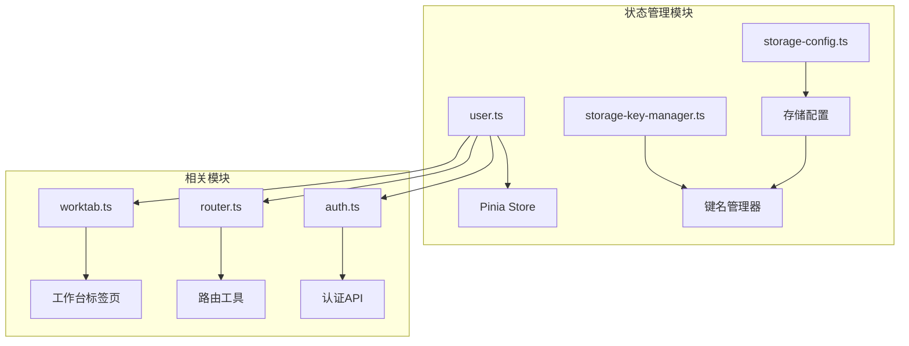
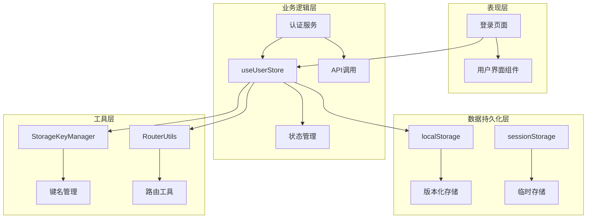
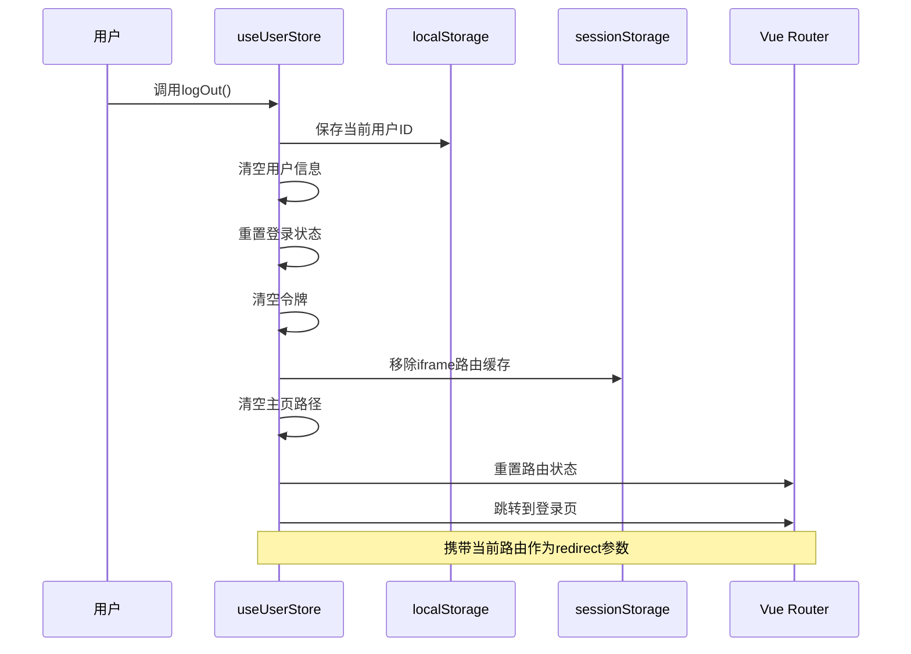
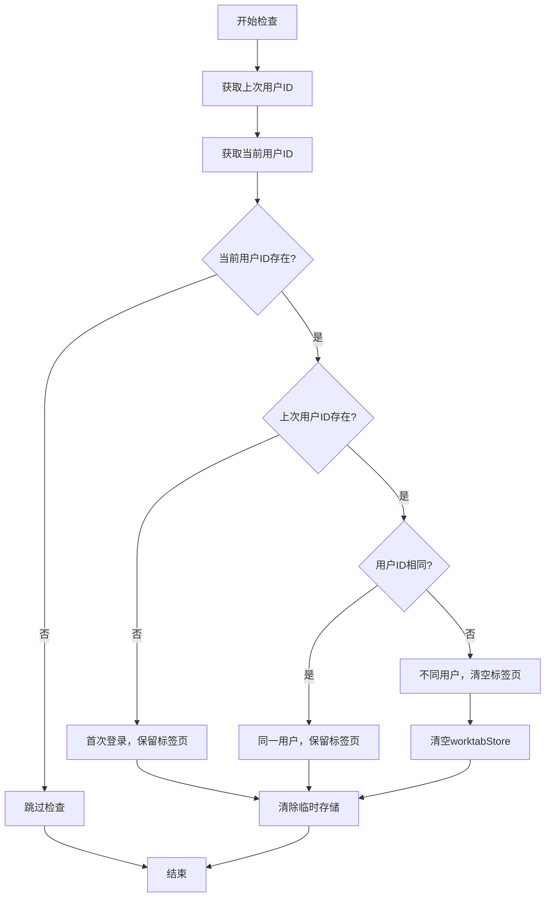
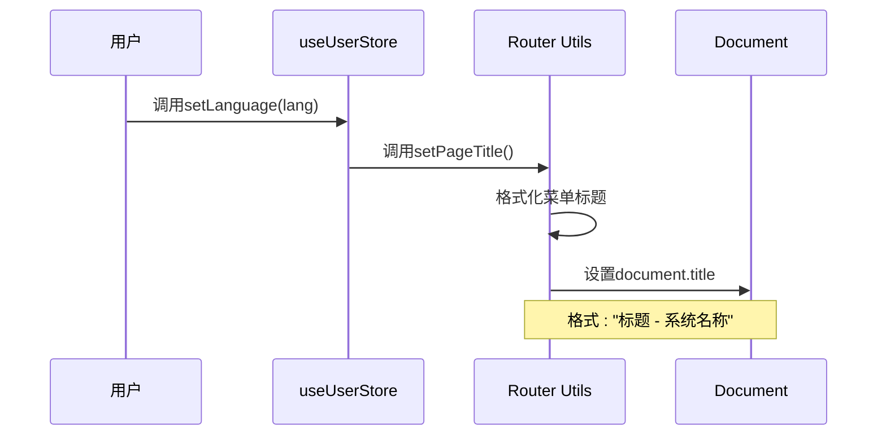
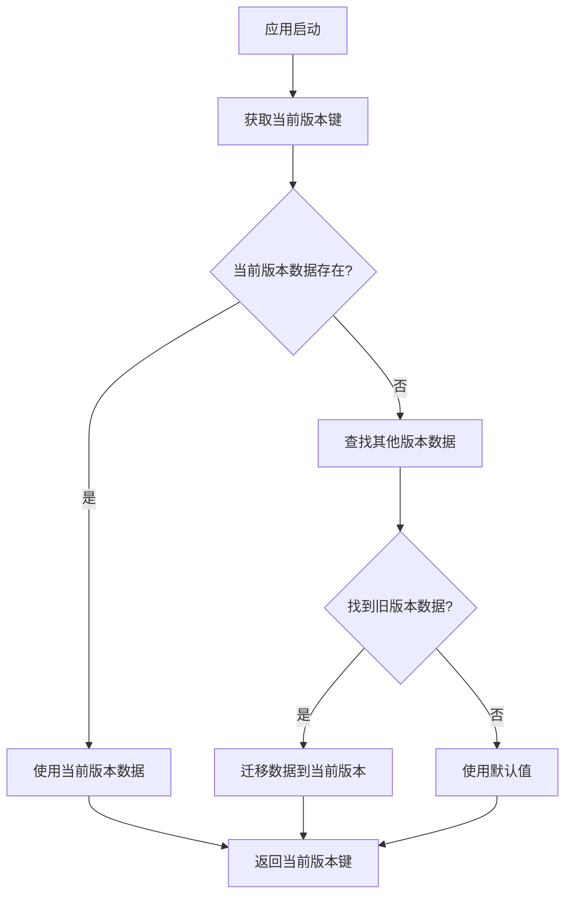
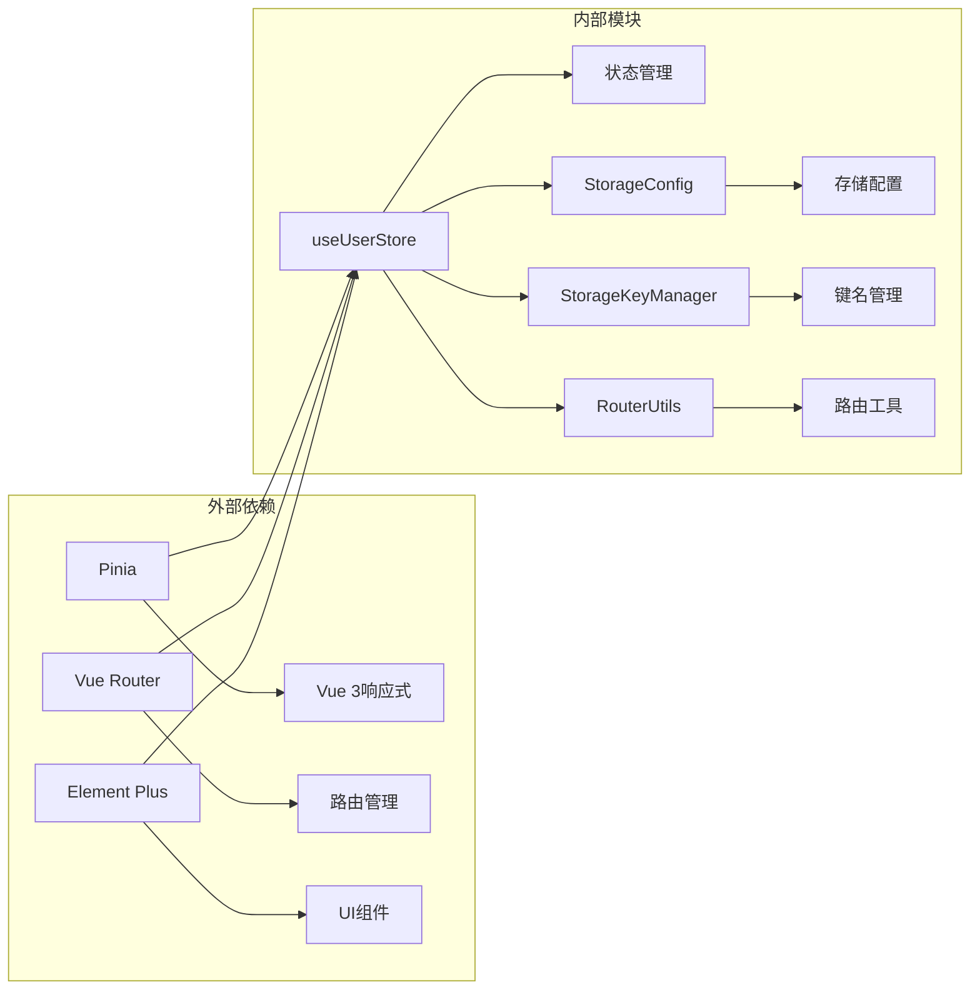

# 用户状态管理

<cite>
**本文档中引用的文件**
- [src/store/modules/user.ts](file://src/store/modules/user.ts)
- [src/utils/storage/storage-key-manager.ts](file://src/utils/storage/storage-key-manager.ts)
- [src/utils/storage/storage-config.ts](file://src/utils/storage/storage-config.ts)
- [src/utils/router.ts](file://src/utils/router.ts)
- [src/store/modules/worktab.ts](file://src/store/modules/worktab.ts)
- [src/views/auth/login/index.vue](file://src/views/auth/login/index.vue)
- [src/api/auth.ts](file://src/api/auth.ts)
- [CHANGELOG.md](file://CHANGELOG.md)
</cite>

## 目录
1. [简介](#简介)
2. [项目结构](#项目结构)
3. [核心组件](#核心组件)
4. [架构概览](#架构概览)
5. [详细组件分析](#详细组件分析)
6. [依赖关系分析](#依赖关系分析)
7. [性能考虑](#性能考虑)
8. [故障排除指南](#故障排除指南)
9. [结论](#结论)

## 简介

用户状态管理系统是Art Design Pro框架的核心组成部分，基于Pinia状态管理库构建，提供了完整的用户认证、会话管理和状态持久化功能。该系统采用响应式设计，支持多语言切换、工作台标签页管理、锁屏功能等高级特性，并实现了智能的数据迁移和版本管理机制。

## 项目结构

用户状态管理模块主要包含以下关键文件：

**图表来源**
- [src/store/modules/user.ts](file://src/store/modules/user.ts#L1-L236)
- [src/utils/storage/storage-config.ts](file://src/utils/storage/storage-config.ts#L1-L122)

**章节来源**
- [src/store/modules/user.ts](file://src/store/modules/user.ts#L1-L50)

## 核心组件

### useUserStore Pinia Store

useUserStore是用户状态管理的核心组件，基于Vue 3的Composition API和Pinia构建，提供以下核心功能：

#### 响应式状态定义

| 状态属性 | 类型 | 默认值 | 作用 |
|---------|------|--------|------|
| isLogin | Ref<boolean> | false | 用户登录状态标识 |
| info | Ref<Partial<Api.Auth.UserInfo>> | {} | 用户基本信息存储 |
| accessToken | Ref<string> | '' | JWT访问令牌 |
| refreshToken | Ref<string> | '' | 刷新令牌 |
| language | Ref<LanguageEnum> | LanguageEnum.ZH | 当前语言设置 |
| isLock | Ref<boolean> | false | 锁屏状态 |
| lockPassword | Ref<string> | '' | 锁屏密码 |
| searchHistory | Ref<AppRouteRecord[]> | [] | 搜索历史记录 |

#### 状态更新方法

系统提供了完整的状态更新接口：

- **setUserInfo(newInfo: Api.Auth.UserInfo)**: 设置用户信息
- **setToken(newAccessToken: string, newRefreshToken?: string)**: 设置访问令牌
- **setLoginStatus(status: boolean)**: 设置登录状态
- **setLanguage(lang: LanguageEnum)**: 设置语言
- **setSearchHistory(list: AppRouteRecord[])**: 设置搜索历史
- **setLockStatus(status: boolean)**: 设置锁屏状态
- **setLockPassword(password: string)**: 设置锁屏密码

**章节来源**
- [src/store/modules/user.ts](file://src/store/modules/user.ts#L50-L136)

## 架构概览

用户状态管理系统采用分层架构设计，确保各组件职责清晰、耦合度低：

**图表来源**
- [src/store/modules/user.ts](file://src/store/modules/user.ts#L34-L45)
- [src/utils/storage/storage-key-manager.ts](file://src/utils/storage/storage-key-manager.ts#L38-L98)

## 详细组件分析

### 登出流程分析

logOut方法实现了完整的用户登出清理流程：

**图表来源**
- [src/store/modules/user.ts](file://src/store/modules/user.ts#L143-L175)

#### 登出清理步骤详解

1. **用户ID保存**: 将当前用户ID保存到localStorage，用于后续的用户变更检测
2. **状态重置**: 清空所有用户相关状态，包括用户信息、令牌、锁屏状态等
3. **缓存清理**: 移除iframe路由缓存和主页路径
4. **路由重置**: 重置路由状态，为新用户登录做准备
5. **页面跳转**: 跳转到登录页面，携带当前路由作为重定向参数

**章节来源**
- [src/store/modules/user.ts](file://src/store/modules/user.ts#L143-L175)

### 用户变更检测机制

checkAndClearWorktabs方法实现了智能的工作台标签页清理机制：

**图表来源**
- [src/store/modules/user.ts](file://src/store/modules/user.ts#L183-L203)

#### 检测逻辑说明

- **首次登录**: 如果上次用户ID不存在，认为是首次登录，保留现有标签页
- **同一用户**: 如果用户ID相同，认为是同一用户的重新登录，保留标签页
- **不同用户**: 如果用户ID不同，认为是另一个用户的登录，清空工作台标签页

**章节来源**
- [src/store/modules/user.ts](file://src/store/modules/user.ts#L183-L203)

### 语言切换与页面标题更新

setLanguage方法实现了语言切换时的页面标题更新机制：

**图表来源**
- [src/store/modules/user.ts](file://src/store/modules/user.ts#L97-L100)
- [src/utils/router.ts](file://src/utils/router.ts#L33-L39)

#### 页面标题格式化规则

页面标题采用"标题 - 系统名称"的格式，其中：
- **标题**: 从路由元信息中获取，支持国际化
- **系统名称**: 来自应用配置的systemInfo.name

**章节来源**
- [src/store/modules/user.ts](file://src/store/modules/user.ts#L97-L100)
- [src/utils/router.ts](file://src/utils/router.ts#L33-L39)

### 状态持久化配置

系统采用智能的版本化存储策略：

#### 存储键生成规则

存储键采用`sys-v{version}-{storeId}`的格式：
- `sys-v`: 固定前缀，表示系统版本化存储
- `{version}`: 当前应用版本号
- `{storeId}`: 存储模块标识符

示例：`sys-v3.0.1-user`

#### 版本管理策略

**图表来源**
- [src/utils/storage/storage-key-manager.ts](file://src/utils/storage/storage-key-manager.ts#L81-L96)

**章节来源**
- [src/utils/storage/storage-config.ts](file://src/utils/storage/storage-config.ts#L55-L61)
- [src/utils/storage/storage-key-manager.ts](file://src/utils/storage/storage-key-manager.ts#L81-L96)

## 依赖关系分析

用户状态管理模块的依赖关系图：

**图表来源**
- [src/store/modules/user.ts](file://src/store/modules/user.ts#L34-L45)

### 关键依赖说明

| 依赖模块 | 用途 | 版本要求 |
|---------|------|----------|
| Pinia | 状态管理库 | ^2.0.0 |
| Vue Router | 路由管理 | ^4.0.0 |
| Element Plus | UI组件库 | ^2.0.0 |
| Vue I18n | 国际化支持 | ^9.0.0 |

**章节来源**
- [src/store/modules/user.ts](file://src/store/modules/user.ts#L34-L45)

## 性能考虑

### 响应式优化

- **细粒度状态**: 将用户状态拆分为多个独立的响应式变量，避免不必要的重渲染
- **计算属性**: 使用computed属性缓存派生状态，提高性能
- **懒加载**: 工作台标签页等大型状态采用懒加载策略

### 存储优化

- **增量更新**: 只更新发生变化的状态，减少存储操作
- **批量操作**: 在登出等场景下进行批量状态重置
- **内存管理**: 及时清理不再需要的临时数据

### 网络优化

- **令牌预加载**: 在应用启动时预加载用户令牌
- **请求去重**: 避免重复的用户信息获取请求
- **缓存策略**: 合理利用浏览器缓存和应用内缓存

## 故障排除指南

### 常见问题及解决方案

#### 登录状态异常

**问题**: 用户已登录但状态显示未登录
**原因**: 令牌过期或存储损坏
**解决**: 
1. 检查localStorage中的令牌数据
2. 重新登录获取新的令牌
3. 清理浏览器缓存

#### 工作台标签页混乱

**问题**: 登录后看到其他用户的标签页
**原因**: 用户ID检测失效
**解决**:
1. 检查LAST_USER_ID_KEY的存储
2. 手动清理localStorage中的用户数据
3. 重新登录

#### 语言切换失效

**问题**: 切换语言后页面标题未更新
**原因**: setPageTitle调用失败
**解决**:
1. 检查路由元信息中的title字段
2. 验证国际化配置
3. 重启应用

**章节来源**
- [src/store/modules/user.ts](file://src/store/modules/user.ts#L183-L203)
- [src/utils/router.ts](file://src/utils/router.ts#L33-L39)

## 结论

Art Design Pro的用户状态管理系统是一个设计精良、功能完备的状态管理解决方案。它不仅提供了基础的用户认证和会话管理功能，还包含了高级特性如智能数据迁移、版本管理、工作台标签页管理等。

### 主要优势

1. **完整性**: 覆盖了用户生命周期的所有状态管理需求
2. **扩展性**: 支持功能扩展和定制化开发
3. **可靠性**: 实现了完善的错误处理和数据恢复机制
4. **性能**: 采用响应式设计和优化策略，确保良好的用户体验

### 最佳实践建议

1. **定期备份**: 定期备份用户的重要状态数据
2. **监控告警**: 监控状态管理模块的运行状态
3. **版本兼容**: 在版本升级时注意向后兼容性
4. **安全防护**: 对敏感状态数据进行适当的加密保护

该系统为现代Web应用提供了坚实的状态管理基础，能够满足复杂业务场景下的各种需求。