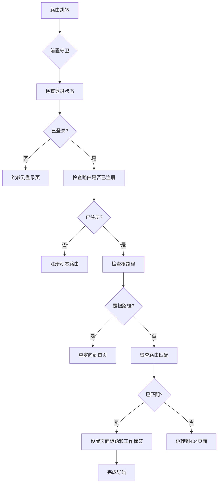
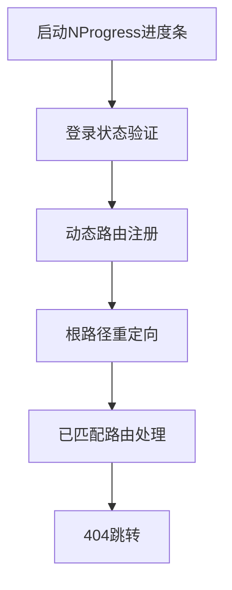
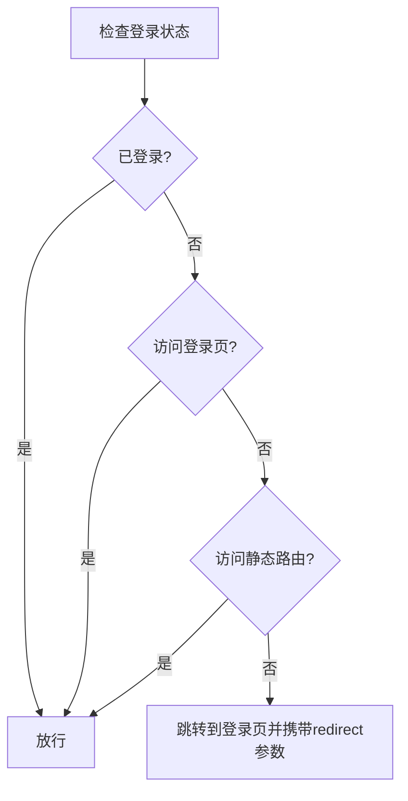
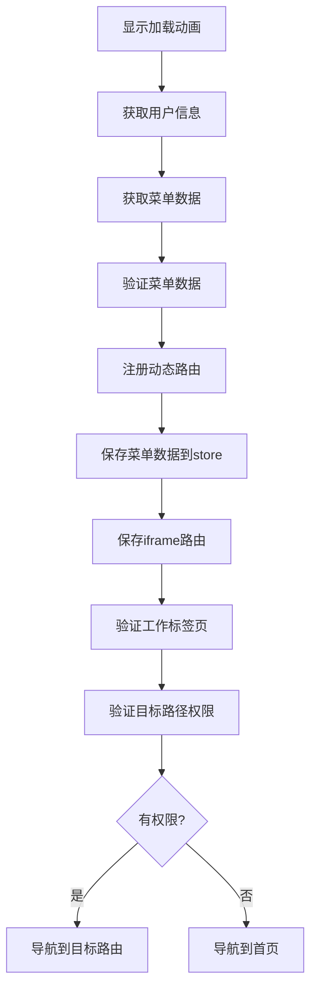
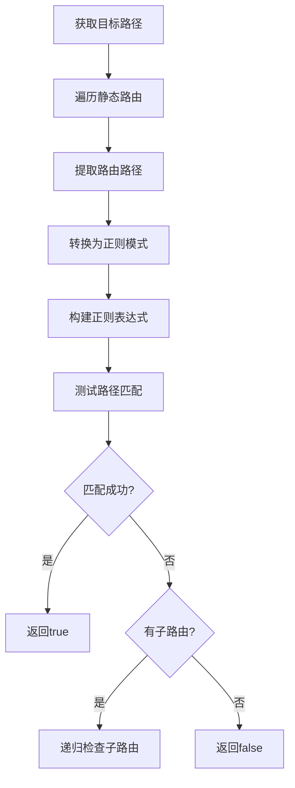
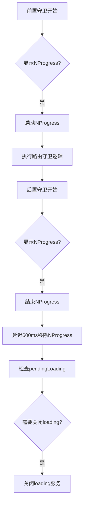
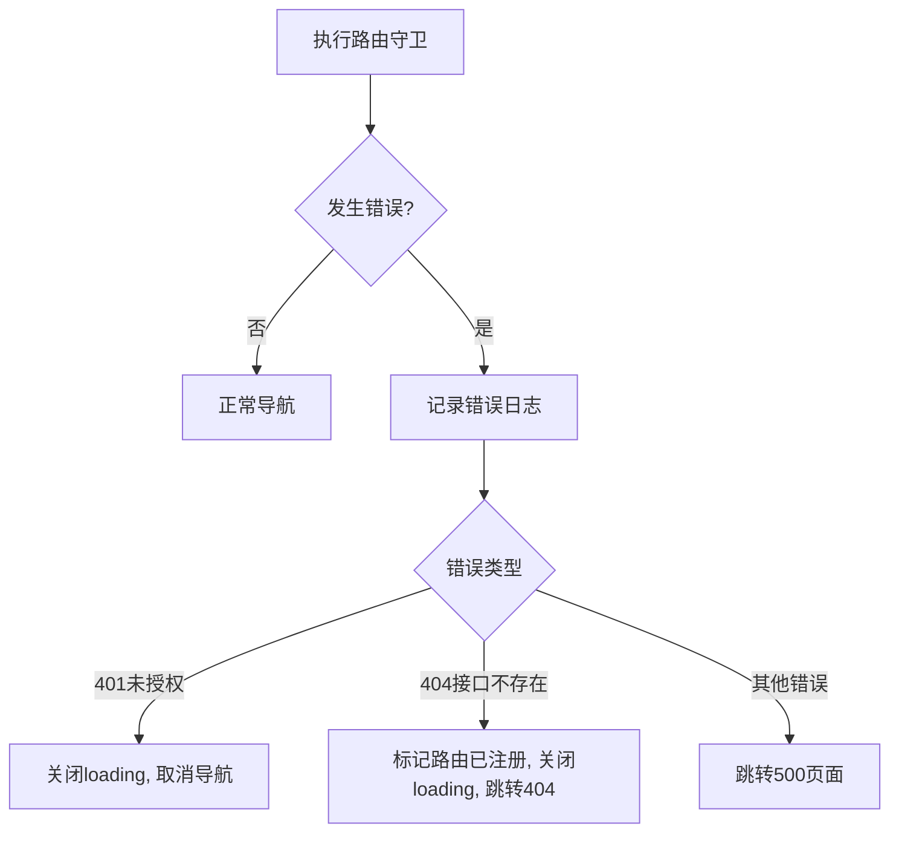
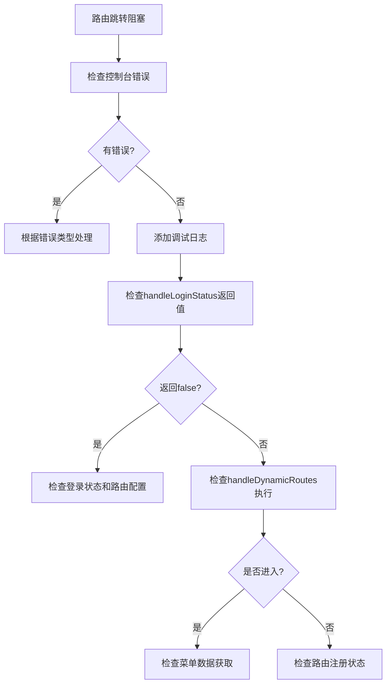

# 路由守卫机制

<cite>
**本文档引用的文件**   
- [beforeEach.ts](file://src/router/guards/beforeEach.ts)
- [afterEach.ts](file://src/router/guards/afterEach.ts)
- [index.ts](file://src/router/index.ts)
- [RouteRegistry.ts](file://src/router/core/RouteRegistry.ts)
- [MenuProcessor.ts](file://src/router/core/MenuProcessor.ts)
- [RoutePermissionValidator.ts](file://src/router/core/RoutePermissionValidator.ts)
- [staticRoutes.ts](file://src/router/routes/staticRoutes.ts)
- [loading.ts](file://src/utils/ui/loading.ts)
- [user.ts](file://src/store/modules/user.ts)
- [useCommon.ts](file://src/hooks/core/useCommon.ts)
- [routesAlias.ts](file://src/router/routesAlias.ts)
</cite>

## 目录
1. [路由守卫概述](#路由守卫概述)
2. [前置守卫主流程](#前置守卫主流程)
3. [登录状态验证](#登录状态验证)
4. [动态路由注册](#动态路由注册)
5. [静态路由识别](#静态路由识别)
6. [进度条与加载控制](#进度条与加载控制)
7. [异常处理机制](#异常处理机制)
8. [路由守卫调试技巧](#路由守卫调试技巧)

## 路由守卫概述

路由守卫机制是系统权限控制的核心组件，负责在路由跳转前进行一系列验证和处理。该机制通过Vue Router的全局前置守卫实现，确保用户访问的每个页面都经过权限验证。

系统路由分为静态路由和动态路由两种类型。静态路由在应用启动时就已注册，包括登录页、注册页、忘记密码页以及各种异常页面（403、404、500）。动态路由则根据用户权限在用户登录后动态注册，实现细粒度的权限控制。

路由守卫的初始化在`src/router/index.ts`中完成，通过`initRouter`函数注册前置守卫和后置守卫。前置守卫负责权限验证和路由处理，后置守卫负责清理工作和状态重置。

**Diagram sources**
- [beforeEach.ts](file://src/router/guards/beforeEach.ts#L82-L101)
- [index.ts](file://src/router/index.ts#L15-L19)

**Section sources**
- [beforeEach.ts](file://src/router/guards/beforeEach.ts#L1-L361)
- [index.ts](file://src/router/index.ts#L1-L24)

## 前置守卫主流程

前置守卫主流程`handleRouteGuard`函数是路由守卫的核心，按照五个阶段处理路由跳转请求。这五个阶段构成了完整的路由导航验证流程，确保每个页面访问都符合系统的安全要求。

第一阶段是登录状态验证，检查用户是否已登录或访问的是公共页面。第二阶段是动态路由注册，在用户首次登录后获取菜单数据并注册相应的路由。第三阶段是根路径重定向，将根路径`/`重定向到配置的首页。第四阶段是已匹配路由处理，为已匹配的路由设置页面标题和工作标签。第五阶段是404跳转，当路由未匹配时跳转到404页面。

**Diagram sources**
- [beforeEach.ts](file://src/router/guards/beforeEach.ts#L118-L158)

**Section sources**
- [beforeEach.ts](file://src/router/guards/beforeEach.ts#L118-L158)

## 登录状态验证

登录状态验证是路由守卫的第一道防线，由`handleLoginStatus`函数实现。该函数根据用户的登录状态和目标路由的性质决定是否放行导航请求。

验证逻辑遵循"放行优先"原则：当用户已登录、访问登录页或访问静态路由时，直接放行。这种设计避免了已登录用户被错误地重定向到登录页，也确保了公共页面的可访问性。

验证过程中，如果用户未登录且尝试访问需要权限的页面，系统会调用`userStore.logOut()`方法清理可能存在的残留状态，然后重定向到登录页，并在查询参数中携带原始访问路径，以便登录成功后能自动跳转回原页面。

**Diagram sources**
- [beforeEach.ts](file://src/router/guards/beforeEach.ts#L164-L181)

**Section sources**
- [beforeEach.ts](file://src/router/guards/beforeEach.ts#L164-L181)
- [user.ts](file://src/store/modules/user.ts#L143-L176)

## 动态路由注册

动态路由注册是实现权限控制的关键环节，由`handleDynamicRoutes`函数处理。该过程在用户首次登录后执行，根据用户的权限获取相应的菜单数据，并动态注册路由。

注册流程包含多个步骤：首先显示加载动画，然后获取用户信息和菜单数据，验证菜单数据的有效性，注册动态路由，保存菜单数据到store，保存iframe路由，验证工作标签页，最后验证目标路径权限并重新导航。

路由注册由`RouteRegistry`类管理，该类负责路由的注册、注销和状态跟踪。注册过程中会使用`RouteValidator`验证路由配置，`RouteTransformer`转换路由配置，确保注册的路由符合系统要求。

**Diagram sources**
- [beforeEach.ts](file://src/router/guards/beforeEach.ts#L210-L275)
- [RouteRegistry.ts](file://src/router/core/RouteRegistry.ts#L16-L90)

**Section sources**
- [beforeEach.ts](file://src/router/guards/beforeEach.ts#L210-L275)
- [RouteRegistry.ts](file://src/router/core/RouteRegistry.ts#L16-L90)
- [MenuProcessor.ts](file://src/router/core/MenuProcessor.ts#L18-L241)

## 静态路由识别

静态路由识别由`isStaticRoute`函数实现，用于判断一个路径是否属于静态路由。该函数通过正则表达式匹配来处理动态路由参数和通配符路径，确保静态路由的准确识别。

识别过程采用递归方式遍历静态路由配置，对每个路由路径进行模式匹配。首先将路由路径中的动态参数（如`:id`）替换为`[^/]+`，将通配符`*`替换为`.*`，然后构建正则表达式进行测试。

静态路由配置在`staticRoutes.ts`文件中定义，包括登录、注册、忘记密码以及各种异常页面。这些路由在应用启动时就已注册，不需要权限验证即可访问。

**Diagram sources**
- [beforeEach.ts](file://src/router/guards/beforeEach.ts#L186-L205)
- [staticRoutes.ts](file://src/router/routes/staticRoutes.ts#L13-L72)

**Section sources**
- [beforeEach.ts](file://src/router/guards/beforeEach.ts#L186-L205)
- [staticRoutes.ts](file://src/router/routes/staticRoutes.ts#L13-L72)

## 进度条与加载控制

系统采用NProgress进度条和自定义loading服务协同控制页面加载状态，为用户提供流畅的导航体验。NProgress提供顶部进度条，loading服务提供全屏遮罩，两者配合使用确保用户感知到系统状态。

NProgress的配置在`utils/router.ts`中完成，设置了缓动效果、速度、不显示spinner等参数。进度条在前置守卫开始时启动，在后置守卫中结束。为了确保进度条完全移除，系统在`NProgress.done()`后添加了600毫秒的延迟调用`NProgress.remove()`。

loading服务由`loadingService`对象提供，采用单例模式确保同时只有一个loading实例。服务会根据当前主题自动适配背景色，暗色主题使用深色背景，亮色主题使用白色背景。loading动画使用自定义的SVG四点旋转动画，提供良好的视觉效果。

**Diagram sources**
- [beforeEach.ts](file://src/router/guards/beforeEach.ts#L128-L130)
- [afterEach.ts](file://src/router/guards/afterEach.ts#L17-L23)
- [loading.ts](file://src/utils/ui/loading.ts#L58-L84)

**Section sources**
- [beforeEach.ts](file://src/router/guards/beforeEach.ts#L128-L130)
- [afterEach.ts](file://src/router/guards/afterEach.ts#L17-L23)
- [loading.ts](file://src/utils/ui/loading.ts#L1-L85)
- [router.ts](file://src/utils/router.ts#L20-L27)

## 异常处理机制

异常处理机制确保路由守卫在遇到错误时能够优雅地降级，避免应用崩溃。系统采用try-catch包裹整个守卫逻辑，并在catch块中进行统一的错误处理。

当守卫处理失败时，系统会关闭loading效果，并跳转到Exception500页面。对于动态路由注册过程中的特定错误，系统会进行更精细的处理：401未授权错误会取消导航，404接口不存在错误会标记路由已注册避免重复请求并跳转到404页面。

错误处理还考虑了用户体验，对于权限不足的访问，系统会输出警告信息到控制台，并跳转到首页而不是直接拒绝。这种设计避免了用户陷入无法访问任何页面的困境。

**Diagram sources**
- [beforeEach.ts](file://src/router/guards/beforeEach.ts#L92-L98)
- [beforeEach.ts](file://src/router/guards/beforeEach.ts#L276-L296)

**Section sources**
- [beforeEach.ts](file://src/router/guards/beforeEach.ts#L92-L98)
- [beforeEach.ts](file://src/router/guards/beforeEach.ts#L276-L296)
- [exception.ts](file://src/router/modules/exception.ts#L3-L45)

## 路由守卫调试技巧

路由守卫调试是开发过程中的重要环节，掌握正确的调试技巧可以快速定位和解决问题。以下是常见的调试场景和解决方案。

### 定位守卫阻塞问题

当路由跳转被阻塞时，首先检查控制台是否有错误日志。如果没有明显错误，可以通过在`beforeEach`守卫中添加调试日志来追踪执行流程。重点关注`handleLoginStatus`和`handleDynamicRoutes`函数的执行结果。

### 权限验证失败原因

权限验证失败通常由以下原因导致：用户角色配置错误、菜单数据获取失败、路由路径配置错误。检查`MenuProcessor`中的角色过滤逻辑，确保用户角色与菜单权限匹配。

对于路径配置错误，特别注意子菜单路径不能以`/`开头，否则会导致路径拼接错误。系统在`MenuProcessor`中提供了路径验证功能，会在开发环境下输出详细的错误信息，帮助开发者快速定位问题。

### 调试工具使用

利用浏览器的调试工具，可以在`beforeEach`守卫中设置断点，逐步执行并观察各个状态的变化。重点关注`userStore.isLogin`、`routeRegistry.isRegistered()`等关键状态，以及`to`和`from`路由对象的属性。

通过`localStorage`检查持久化存储的状态，特别是`user`存储，确认用户信息是否正确保存。使用Vue Devtools检查Pinia store的状态，确保`userStore`、`menuStore`等状态管理正确。

**Section sources**
- [beforeEach.ts](file://src/router/guards/beforeEach.ts#L1-L361)
- [MenuProcessor.ts](file://src/router/core/MenuProcessor.ts#L18-L241)
- [user.ts](file://src/store/modules/user.ts#L50-L235)