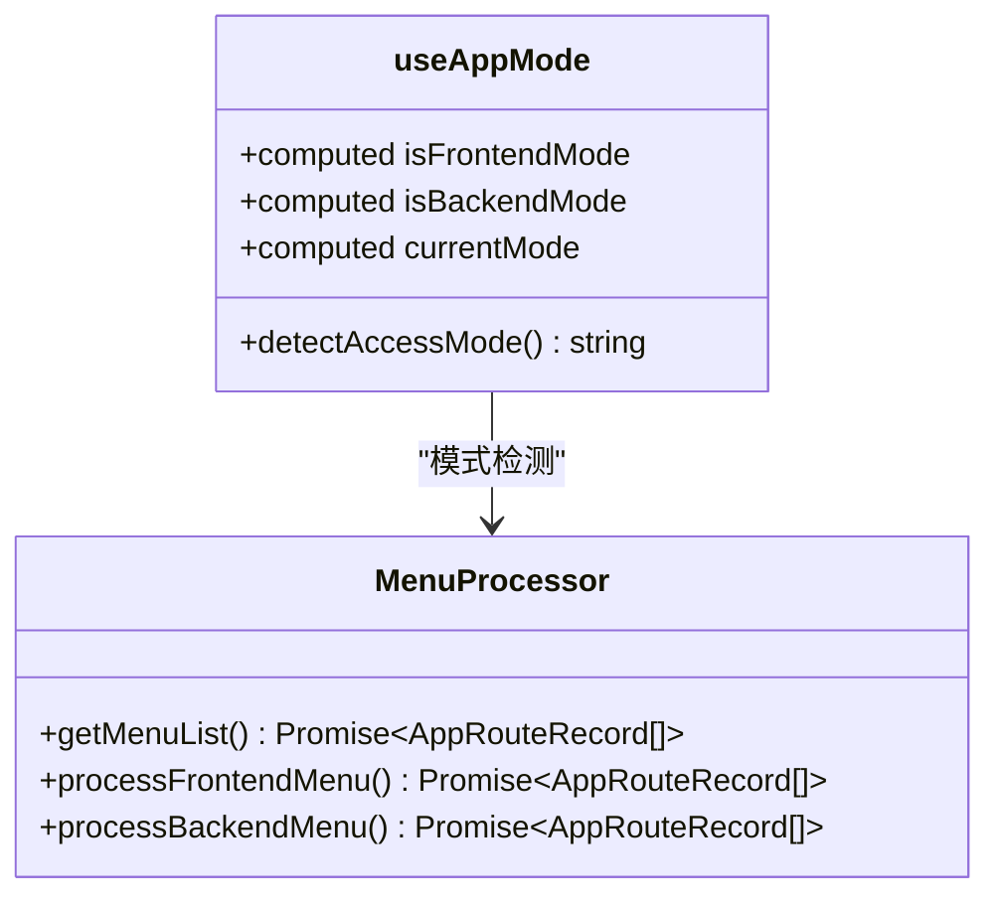
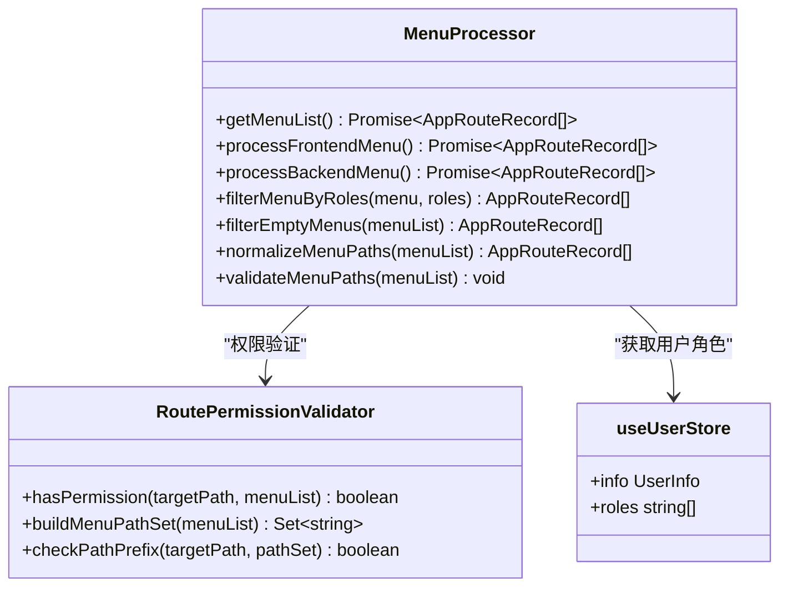
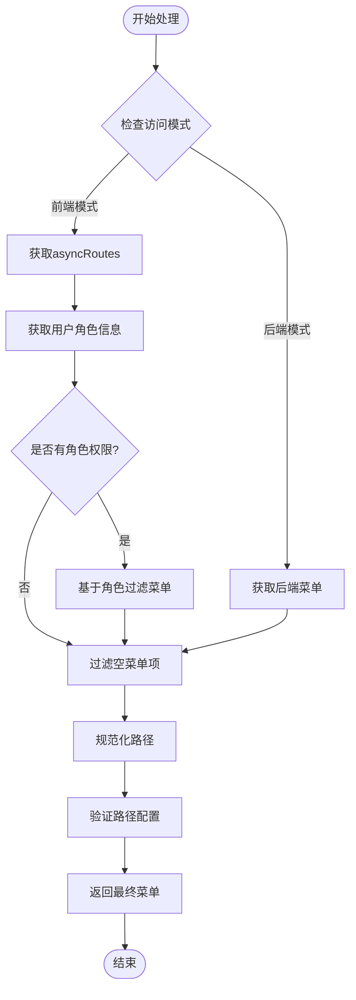
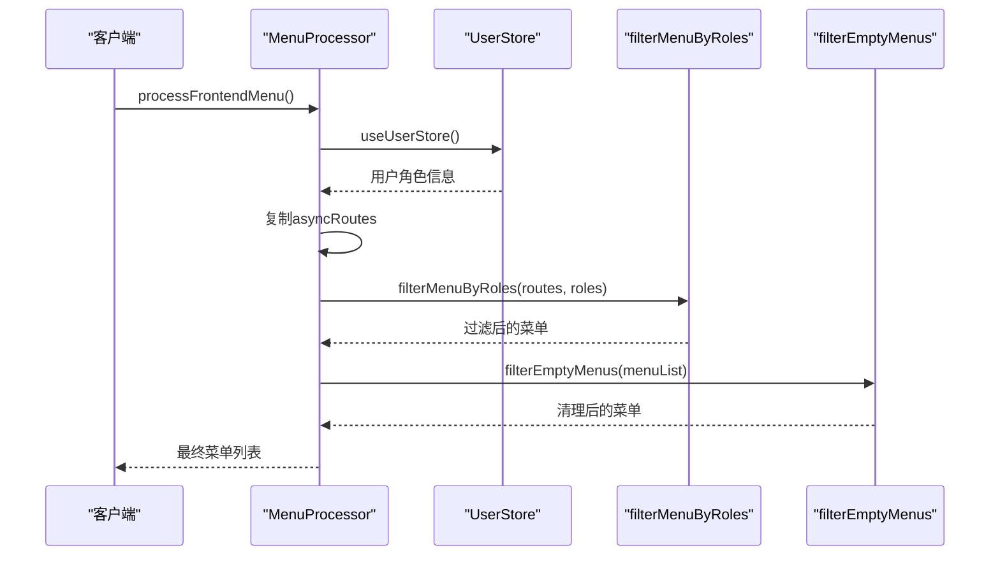
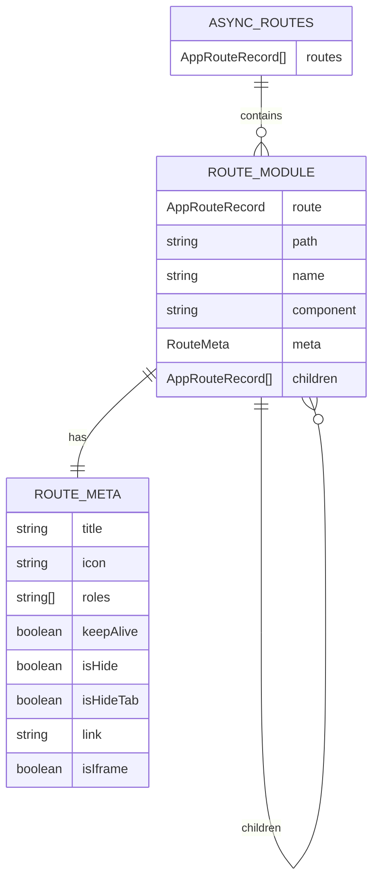
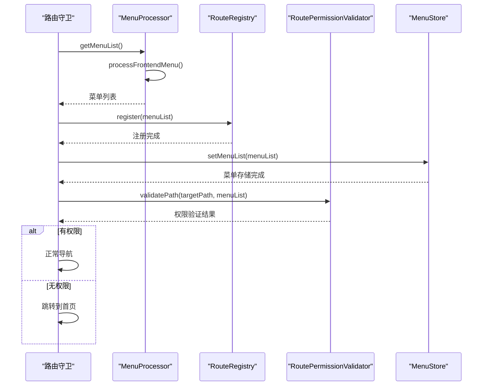

# 前端控制模式

<cite>
**本文档引用的文件**
- [MenuProcessor.ts](file://src/router/core/MenuProcessor.ts)
- [useAppMode.ts](file://src/hooks/core/useAppMode.ts)
- [asyncRoutes.ts](file://src/router/routes/asyncRoutes.ts)
- [index.ts](file://src/router/modules/index.ts)
- [dashboard.ts](file://src/router/modules/dashboard.ts)
- [system.ts](file://src/router/modules/system.ts)
- [user.ts](file://src/store/modules/user.ts)
- [beforeEach.ts](file://src/router/guards/beforeEach.ts)
- [RoutePermissionValidator.ts](file://src/router/core/RoutePermissionValidator.ts)
- [vite.config.ts](file://vite.config.ts)
- [index.ts](file://src/types/router/index.ts)
</cite>

## 目录
1. [概述](#概述)
2. [前端控制模式配置](#前端控制模式配置)
3. [MenuProcessor核心架构](#menuprocessor核心架构)
4. [前端模式菜单处理流程](#前端模式菜单处理流程)
5. [权限过滤机制](#权限过滤机制)
6. [菜单结构与配置](#菜单结构与配置)
7. [路由注册与权限校验](#路由注册与权限校验)
8. [实际应用场景](#实际应用场景)
9. [最佳实践与注意事项](#最佳实践与注意事项)

## 概述

前端控制模式是一种基于前端路由配置实现权限控制的应用模式。在这种模式下，菜单权限由前端路由配置文件中的角色标识决定，无需依赖后端接口返回的菜单数据。这种模式特别适用于开发环境快速迭代、权限结构固定的场景，以及小型项目或演示环境。

前端控制模式的核心特点：
- **权限配置集中化**：所有路由权限配置都位于前端路由文件中
- **开发效率高**：无需后端配合即可完成权限控制
- **结构固定**：权限层级和菜单结构在前端定义后不易变动
- **实时生效**：修改前端配置后立即生效，无需重启应用

## 前端控制模式配置

### 环境变量配置

前端控制模式通过环境变量 `VITE_ACCESS_MODE` 进行配置：

```typescript
// vite.config.ts 中的环境变量配置示例
export default defineConfig(({ mode }) => {
  const env = loadEnv(mode, process.cwd())
  
  return {
    define: {
      // 设置访问模式为前端控制
      'import.meta.env.VITE_ACCESS_MODE': JSON.stringify('frontend')
    }
  }
})
```

### useAppMode组合式函数

系统提供了 `useAppMode` 组合式函数来检测和管理应用模式：



**图表来源**
- [useAppMode.ts](file://src/hooks/core/useAppMode.ts#L20-L45)
- [MenuProcessor.ts](file://src/router/core/MenuProcessor.ts#L22-L37)

**章节来源**
- [useAppMode.ts](file://src/hooks/core/useAppMode.ts#L1-L46)
- [vite.config.ts](file://vite.config.ts#L1-L157)

## MenuProcessor核心架构

MenuProcessor 是前端控制模式的核心处理器，负责菜单数据的获取、过滤和处理：



**图表来源**
- [MenuProcessor.ts](file://src/router/core/MenuProcessor.ts#L18-L242)
- [RoutePermissionValidator.ts](file://src/router/core/RoutePermissionValidator.ts#L28-L46)

### 核心方法说明

1. **getMenuList()**：统一的菜单获取入口，根据模式选择处理方式
2. **processFrontendMenu()**：前端模式专用的菜单处理流程
3. **filterMenuByRoles()**：基于角色权限过滤菜单项
4. **filterEmptyMenus()**：递归清理无效的菜单节点

**章节来源**
- [MenuProcessor.ts](file://src/router/core/MenuProcessor.ts#L18-L242)

## 前端模式菜单处理流程

前端模式的菜单处理遵循以下执行流程：



**图表来源**
- [MenuProcessor.ts](file://src/router/core/MenuProcessor.ts#L22-L37)
- [MenuProcessor.ts](file://src/router/core/MenuProcessor.ts#L42-L54)

### processFrontendMenu 方法详解

该方法是前端模式的核心处理逻辑：



**图表来源**
- [MenuProcessor.ts](file://src/router/core/MenuProcessor.ts#L42-L54)

**章节来源**
- [MenuProcessor.ts](file://src/router/core/MenuProcessor.ts#L42-L54)

## 权限过滤机制

### 基于角色的权限过滤

前端控制模式通过 `meta.roles` 字段实现基于角色的权限控制：

```typescript
// 角色权限过滤逻辑
private filterMenuByRoles(menu: AppRouteRecord[], roles: string[]): AppRouteRecord[] {
  return menu.reduce((acc: AppRouteRecord[], item) => {
    const itemRoles = item.meta?.roles
    // 如果没有配置roles，则默认有权限
    const hasPermission = !itemRoles || itemRoles.some((role) => roles?.includes(role))
    
    if (hasPermission) {
      const filteredItem = { ...item }
      // 递归处理子菜单
      if (filteredItem.children?.length) {
        filteredItem.children = this.filterMenuByRoles(filteredItem.children, roles)
      }
      acc.push(filteredItem)
    }
    
    return acc
  }, [])
}
```

### 权限配置示例

以下是典型的菜单权限配置：

```typescript
// 超级管理员权限
meta: {
  title: '系统管理',
  icon: 'ri:user-3-line',
  roles: ['R_SUPER']  // 仅超级管理员可见
}

// 管理员和超级管理员权限
meta: {
  title: '用户管理',
  icon: 'ri:user-line',
  roles: ['R_ADMIN', 'R_SUPER']  // 管理员和超级管理员可见
}

// 公共菜单（无权限限制）
meta: {
  title: '仪表板',
  icon: 'ri:pie-chart-line'
  // 未配置roles字段，表示所有人都可见
}
```

**章节来源**
- [MenuProcessor.ts](file://src/router/core/MenuProcessor.ts#L67-L82)
- [dashboard.ts](file://src/router/modules/dashboard.ts#L7-L11)
- [system.ts](file://src/router/modules/system.ts#L7-L11)

## 菜单结构与配置

### asyncRoutes 结构

前端控制模式的菜单数据来源于 `asyncRoutes` 数组，该数组包含了所有需要权限控制的路由：



**图表来源**
- [asyncRoutes.ts](file://src/router/routes/asyncRoutes.ts#L1-L10)
- [index.ts](file://src/router/modules/index.ts#L16-L27)
- [index.ts](file://src/types/router/index.ts#L29-L79)

### 菜单配置规范

每个菜单项必须包含以下关键配置：

| 配置项 | 类型 | 必填 | 说明 |
|--------|------|------|------|
| `path` | string | 是 | 路由路径，一级菜单需以 `/` 开头 |
| `name` | string | 是 | 路由名称，唯一标识 |
| `component` | string | 是 | 组件路径，目录菜单可留空 |
| `meta.title` | string | 是 | 菜单标题，支持国际化 |
| `meta.icon` | string | 否 | 菜单图标，使用图标库标识符 |
| `meta.roles` | string[] | 否 | 角色权限数组，未配置则公开 |

**章节来源**
- [asyncRoutes.ts](file://src/router/routes/asyncRoutes.ts#L1-L10)
- [index.ts](file://src/router/modules/index.ts#L1-L28)
- [dashboard.ts](file://src/router/modules/dashboard.ts#L1-L46)

## 路由注册与权限校验

### 动态路由注册流程

前端控制模式下的路由注册遵循严格的权限校验流程：



**图表来源**
- [beforeEach.ts](file://src/router/guards/beforeEach.ts#L210-L274)
- [MenuProcessor.ts](file://src/router/core/MenuProcessor.ts#L22-L37)

### 权限校验机制

系统提供了多层权限校验机制：

1. **路由守卫级别**：在路由跳转前进行权限验证
2. **组件级别**：通过指令或组合式函数进行细粒度权限控制
3. **API级别**：后端接口层面的权限验证

**章节来源**
- [beforeEach.ts](file://src/router/guards/beforeEach.ts#L210-L274)
- [RoutePermissionValidator.ts](file://src/router/core/RoutePermissionValidator.ts#L28-L46)

## 实际应用场景

### 开发环境快速迭代

前端控制模式特别适合开发阶段的快速迭代：

```typescript
// 开发环境配置
defineConfig({
  define: {
    'import.meta.env.VITE_ACCESS_MODE': JSON.stringify('frontend')
  }
})

// 快速修改权限配置
// src/router/modules/system.ts
export const systemRoutes: AppRouteRecord = {
  path: '/system',
  name: 'System',
  component: '/index/index',
  meta: {
    title: '系统管理',
    icon: 'ri:settings-line',
    roles: ['R_SUPER', 'R_ADMIN']  // 修改角色权限
  }
}
```

### 权限结构固定的场景

适用于权限结构相对稳定的项目：

```typescript
// 固定的权限结构
const FIXED_PERMISSIONS = {
  SUPER_ADMIN: ['R_SUPER'],
  ADMIN: ['R_ADMIN'],
  USER: ['R_USER'],
  GUEST: []  // 无特殊权限
}

// 在路由配置中使用
meta: {
  roles: FIXED_PERMISSIONS.SUPER_ADMIN
}
```

### 演示环境配置

前端控制模式非常适合演示环境：

```typescript
// 演示环境的简化配置
const demoRoutes = [
  {
    path: '/',
    name: 'Home',
    component: '/dashboard',
    meta: {
      title: '首页',
      icon: 'ri:home-line'
      // 无roles配置，所有人可见
    }
  },
  {
    path: '/admin',
    name: 'Admin',
    component: '/admin',
    meta: {
      title: '管理',
      icon: 'ri:admin-line',
      roles: ['R_SUPER']  // 仅超级管理员可见
    }
  }
]
```

## 最佳实践与注意事项

### 权限设计原则

1. **最小权限原则**：只授予用户完成任务所需的最小权限
2. **角色分离**：避免单一角色拥有过多权限
3. **权限继承**：高级角色自动继承低级角色的权限
4. **定期审查**：定期检查和优化权限配置

### 性能优化建议

1. **懒加载组件**：对大型模块使用异步组件加载
2. **菜单缓存**：合理利用浏览器缓存减少重复请求
3. **权限预计算**：在用户登录时预先计算好权限列表

### 常见问题与解决方案

1. **路径配置错误**
   ```typescript
   // 错误：二级菜单使用了绝对路径
   path: '/user/list'  // ❌
   
   // 正确：使用相对路径
   path: 'list'  // ✅
   ```

2. **角色权限不生效**
   ```typescript
   // 确保用户角色正确设置
   // src/store/modules/user.ts
   setUserInfo({
     userId: '1',
     username: 'admin',
     roles: ['R_SUPER']  // 必须包含正确的角色标识
   })
   ```

3. **菜单显示异常**
   ```typescript
   // 检查菜单配置的完整性
   meta: {
     title: '菜单标题',  // 必填
     icon: 'ri:icon-name',  // 可选
     roles: ['R_SUPER']  // 可选，未配置则公开
   }
   ```

### 安全注意事项

1. **敏感操作二次确认**：对于重要操作添加二次确认机制
2. **权限边界检查**：在业务逻辑层面再次验证权限
3. **日志审计**：记录权限相关的操作日志
4. **防止权限绕过**：确保前端权限控制不会被轻易绕过

**章节来源**
- [MenuProcessor.ts](file://src/router/core/MenuProcessor.ts#L158-L240)
- [beforeEach.ts](file://src/router/guards/beforeEach.ts#L220-L230)