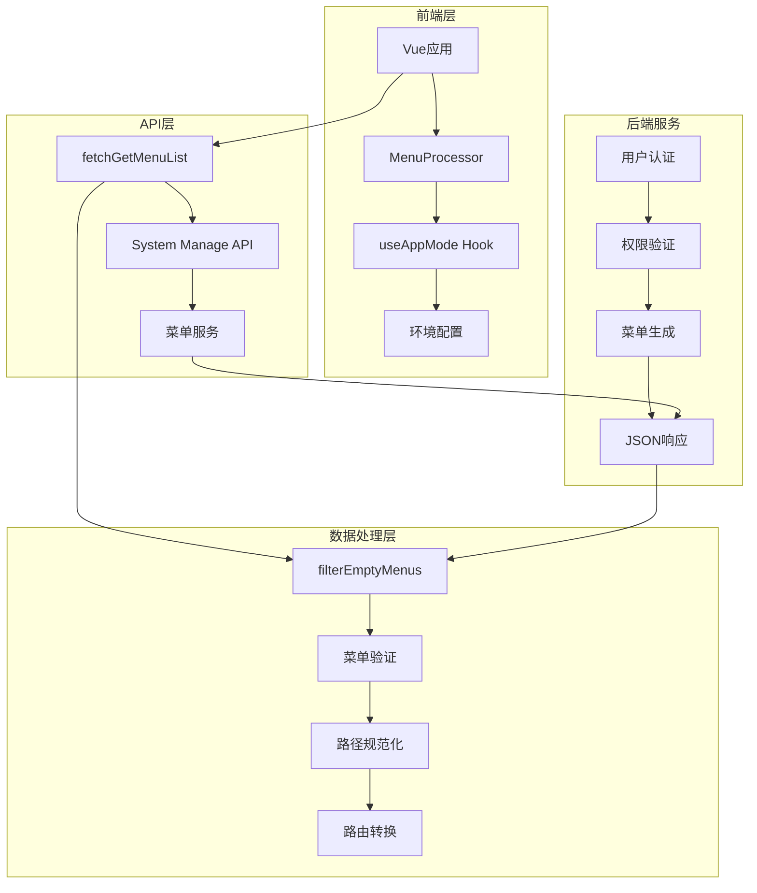
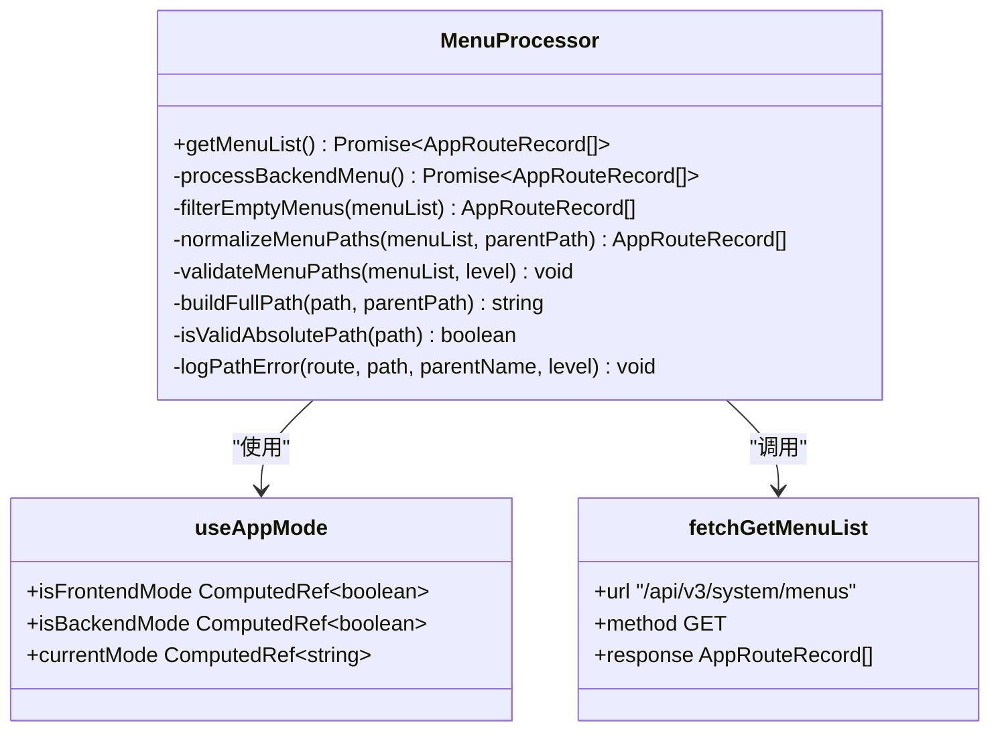
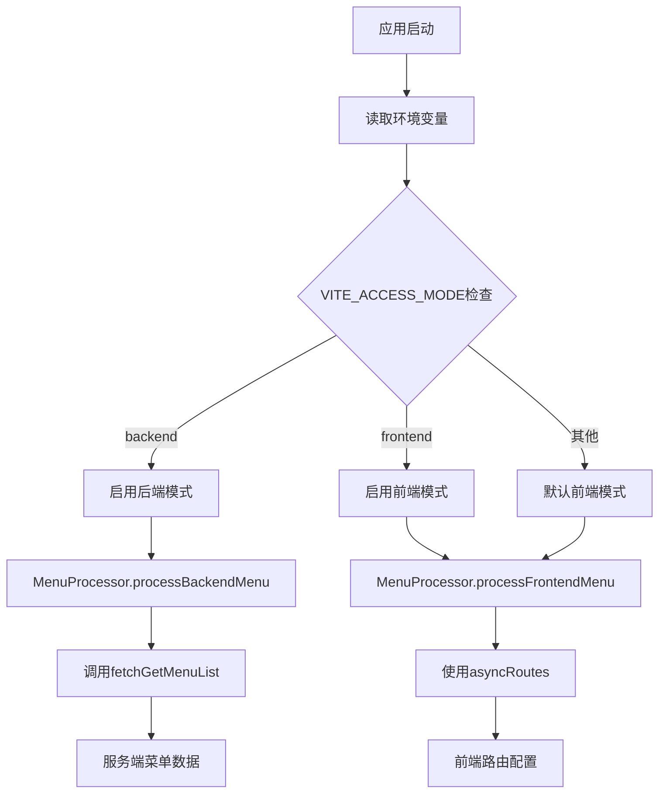
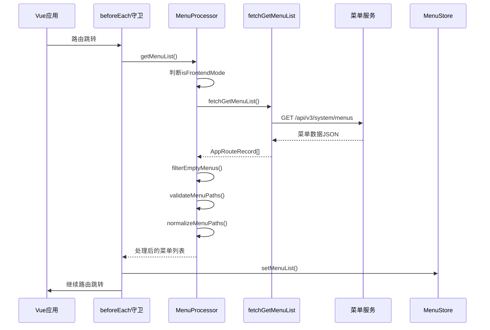
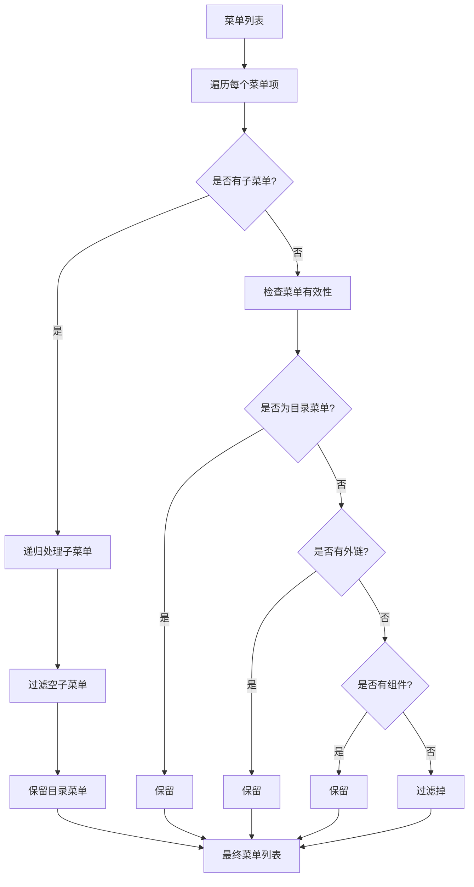
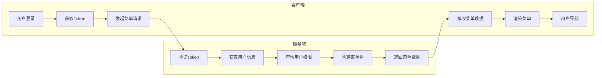
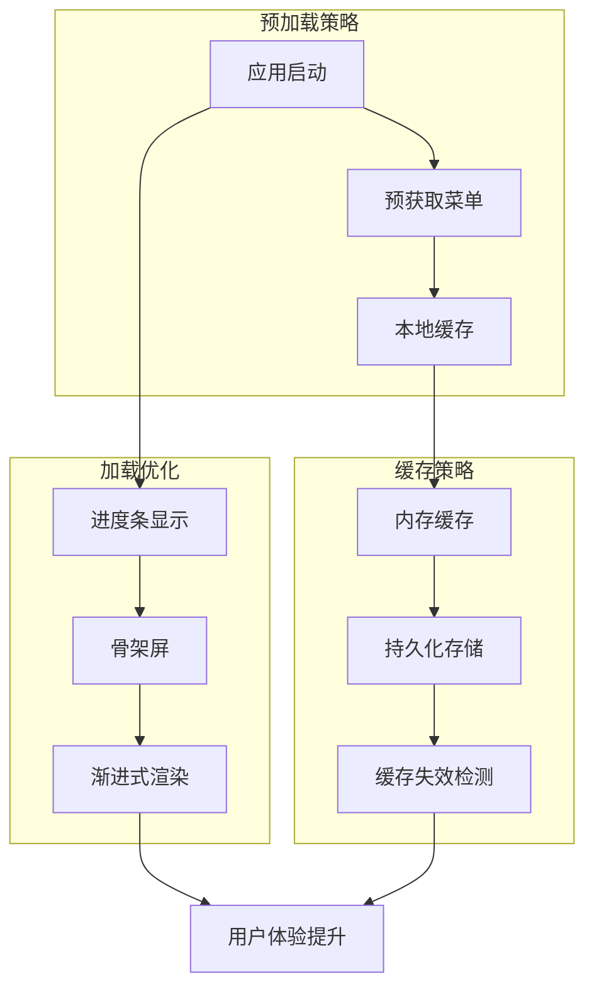
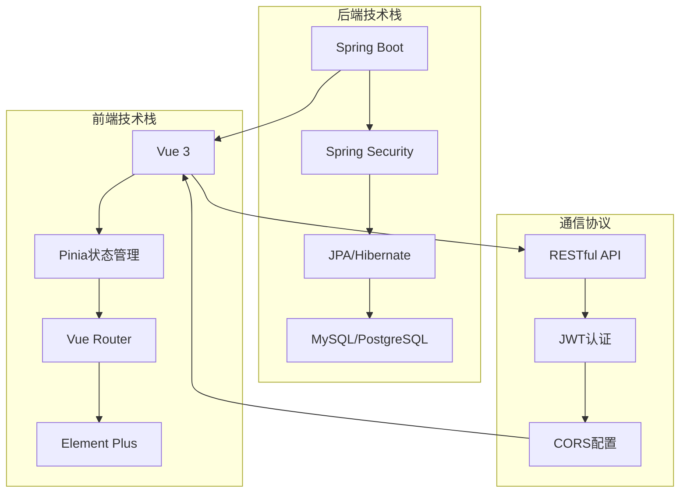

# 后端控制模式

<cite>
**本文档引用的文件**
- [MenuProcessor.ts](file://src/router/core/MenuProcessor.ts)
- [useAppMode.ts](file://src/hooks/core/useAppMode.ts)
- [system-manage.ts](file://src/api/system-manage.ts)
- [beforeEach.ts](file://src/router/guards/beforeEach.ts)
- [menu.ts](file://src/store/modules/menu.ts)
- [index.ts](file://src/types/router/index.ts)
- [response.ts](file://src/types/common/response.ts)
- [api.d.ts](file://src/types/api/api.d.ts)
- [asyncRoutes.ts](file://src/router/routes/asyncRoutes.ts)
- [RouteTransformer.ts](file://src/router/core/RouteTransformer.ts)
- [RouteRegistry.ts](file://src/router/core/RouteRegistry.ts)
</cite>

## 目录
1. [概述](#概述)
2. [系统架构](#系统架构)
3. [核心组件分析](#核心组件分析)
4. [后端模式配置](#后端模式配置)
5. [API交互流程](#api交互流程)
6. [菜单数据处理](#菜单数据处理)
7. [权限逻辑实现](#权限逻辑实现)
8. [性能优化策略](#性能优化策略)
9. [集成方案](#集成方案)
10. [故障排除指南](#故障排除指南)

## 概述

后端控制模式是Art Design Pro框架中的高级权限管理模式，它将菜单权限控制完全交由服务端处理，前端仅负责菜单的渲染和基础导航功能。这种模式特别适用于需要精细化权限管理、菜单动态调整的企业级应用场景。

### 核心特性

- **服务端权限控制**：菜单权限由后端根据用户身份动态生成
- **动态菜单更新**：支持运行时菜单结构的动态调整
- **前后端分离**：严格的前后端职责分离
- **安全性增强**：敏感权限信息不暴露在前端
- **灵活配置**：支持多种菜单布局和主题

## 系统架构



**图表来源**
- [MenuProcessor.ts](file://src/router/core/MenuProcessor.ts#L18-L240)
- [useAppMode.ts](file://src/hooks/core/useAppMode.ts#L19-L44)
- [system-manage.ts](file://src/api/system-manage.ts#L21-L24)

## 核心组件分析

### MenuProcessor类详解

MenuProcessor是后端控制模式的核心处理器，负责菜单数据的获取、过滤和处理。



**图表来源**
- [MenuProcessor.ts](file://src/router/core/MenuProcessor.ts#L18-L240)
- [useAppMode.ts](file://src/hooks/core/useAppMode.ts#L19-L44)
- [system-manage.ts](file://src/api/system-manage.ts#L21-L24)

**章节来源**
- [MenuProcessor.ts](file://src/router/core/MenuProcessor.ts#L18-L240)
- [useAppMode.ts](file://src/hooks/core/useAppMode.ts#L19-L44)

### useAppMode组合式函数

useAppMode提供了应用模式的判断和管理功能，是区分前后端模式的关键。

| 属性 | 类型 | 描述 | 默认值 |
|------|------|------|--------|
| isFrontendMode | ComputedRef\<boolean\> | 是否为前端控制模式 | - |
| isBackendMode | ComputedRef\<boolean\> | 是否为后端控制模式 | - |
| currentMode | ComputedRef\<string\> | 当前应用模式 | VITE_ACCESS_MODE |

**章节来源**
- [useAppMode.ts](file://src/hooks/core/useAppMode.ts#L19-L44)

## 后端模式配置

### 环境变量配置

后端模式通过环境变量`VITE_ACCESS_MODE`进行配置：

```typescript
// .env.production
VITE_ACCESS_MODE=backend
```

### 配置验证流程



**图表来源**
- [useAppMode.ts](file://src/hooks/core/useAppMode.ts#L21-L23)
- [MenuProcessor.ts](file://src/router/core/MenuProcessor.ts#L22-L30)

**章节来源**
- [useAppMode.ts](file://src/hooks/core/useAppMode.ts#L21-L23)

## API交互流程

### 异步请求流程

后端模式下的菜单获取遵循严格的异步处理流程：



**图表来源**
- [beforeEach.ts](file://src/router/guards/beforeEach.ts#L210-L237)
- [MenuProcessor.ts](file://src/router/core/MenuProcessor.ts#L22-L36)
- [system-manage.ts](file://src/api/system-manage.ts#L21-L24)

### API响应数据结构

后端模式下的菜单数据遵循严格的数据结构规范：

| 字段名 | 类型 | 必填 | 描述 |
|--------|------|------|------|
| id | number | 否 | 菜单唯一标识符 |
| path | string | 是 | 路由路径 |
| name | string | 是 | 菜单名称 |
| component | string \| function | 否 | 组件路径或函数 |
| meta | RouteMeta | 是 | 菜单元数据 |
| children | AppRouteRecord[] | 否 | 子菜单列表 |

**章节来源**
- [system-manage.ts](file://src/api/system-manage.ts#L21-L24)
- [MenuProcessor.ts](file://src/router/core/MenuProcessor.ts#L22-L36)

## 菜单数据处理

### filterEmptyMenus方法详解

filterEmptyMenus是菜单数据处理的核心方法，负责移除无效的菜单项：



**图表来源**
- [MenuProcessor.ts](file://src/router/core/MenuProcessor.ts#L87-L118)

### 路径规范化处理

MenuProcessor实现了智能的路径规范化机制：

| 路径类型 | 处理规则 | 示例 |
|----------|----------|------|
| 绝对路径 | 直接返回 | `/dashboard` |
| 外部链接 | 直接返回 | `https://example.com` |
| 相对路径 | 拼接父路径 | `console` → `/system/console` |
| 空路径 | 返回空字符串 | - |

**章节来源**
- [MenuProcessor.ts](file://src/router/core/MenuProcessor.ts#L87-L118)
- [MenuProcessor.ts](file://src/router/core/MenuProcessor.ts#L216-L240)

## 权限逻辑实现

### 后端权限控制原理

在后端模式下，权限逻辑完全由服务端实现：



**图表来源**
- [MenuProcessor.ts](file://src/router/core/MenuProcessor.ts#L59-L61)
- [beforeEach.ts](file://src/router/guards/beforeEach.ts#L220-L223)

### 权限验证流程

| 步骤 | 操作 | 验证内容 |
|------|------|----------|
| 1 | Token验证 | JWT有效性、过期时间 |
| 2 | 用户信息获取 | 用户身份、角色信息 |
| 3 | 权限查询 | 用户拥有的菜单权限 |
| 4 | 菜单构建 | 根据权限生成菜单树 |
| 5 | 数据返回 | 结构化的菜单JSON |

**章节来源**
- [MenuProcessor.ts](file://src/router/core/MenuProcessor.ts#L59-L61)
- [beforeEach.ts](file://src/router/guards/beforeEach.ts#L220-L223)

## 性能优化策略

### 网络延迟优化

为了应对可能的网络延迟，系统实现了多层次的优化策略：



### 缓存机制

| 缓存层级 | 存储位置 | 生命周期 | 更新策略 |
|----------|----------|----------|----------|
| 内存缓存 | 浏览器内存 | 页面会话 | 登出时清除 |
| 本地存储 | localStorage | 持久化 | Token过期时更新 |
| 服务端缓存 | Redis/Memory | 可配置 | 实时更新 |

**章节来源**
- [menu.ts](file://src/store/modules/menu.ts#L45-L49)
- [beforeEach.ts](file://src/router/guards/beforeEach.ts#L216-L218)

## 集成方案

### 前后端分离架构

后端控制模式完美契合现代前后端分离架构：



### 部署配置建议

| 环境 | 配置要点 | 注意事项 |
|------|----------|----------|
| 开发环境 | VITE_ACCESS_MODE=backend | 使用Mock数据 |
| 测试环境 | VITE_ACCESS_MODE=backend | 配置测试用户 |
| 生产环境 | VITE_ACCESS_MODE=backend | 启用HTTPS |

**章节来源**
- [useAppMode.ts](file://src/hooks/core/useAppMode.ts#L21-L23)
- [MenuProcessor.ts](file://src/router/core/MenuProcessor.ts#L22-L30)

## 故障排除指南

### 常见问题及解决方案

| 问题类型 | 症状 | 可能原因 | 解决方案 |
|----------|------|----------|----------|
| 菜单加载失败 | 白屏或空白菜单 | API请求失败 | 检查网络连接和API端点 |
| 权限错误 | 无权限访问 | 服务端权限配置错误 | 验证用户角色和权限映射 |
| 路径错误 | 导航失效 | 路径格式不正确 | 检查路径规范化逻辑 |
| 性能问题 | 加载缓慢 | 网络延迟或数据量大 | 实施缓存和分页策略 |

### 调试工具

```typescript
// 调试菜单处理过程
const debugMenuProcessing = async () => {
  const processor = new MenuProcessor();
  
  // 获取原始菜单数据
  const rawMenu = await fetchGetMenuList();
  console.log('原始菜单数据:', rawMenu);
  
  // 处理菜单
  const processedMenu = await processor.getMenuList();
  console.log('处理后的菜单:', processedMenu);
  
  return processedMenu;
};
```

**章节来源**
- [MenuProcessor.ts](file://src/router/core/MenuProcessor.ts#L158-L212)
- [beforeEach.ts](file://src/router/guards/beforeEach.ts#L92-L98)

## 总结

后端控制模式代表了现代Web应用权限管理的最佳实践，它通过将权限决策权交给服务端，实现了更高的安全性和灵活性。虽然相比前端模式增加了网络交互开销，但在企业级应用场景中，其带来的安全性和可维护性优势远远超过了性能损失。

对于开发者而言，理解后端控制模式的工作原理和最佳实践，是构建高质量企业级应用的重要基础。随着微服务架构和云原生技术的发展，这种模式的应用价值将会更加凸显。