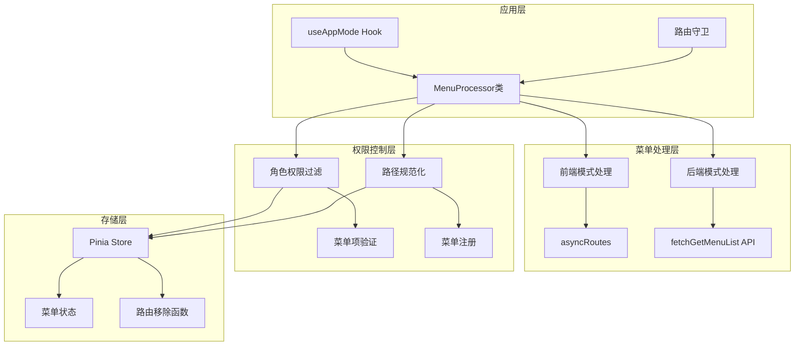
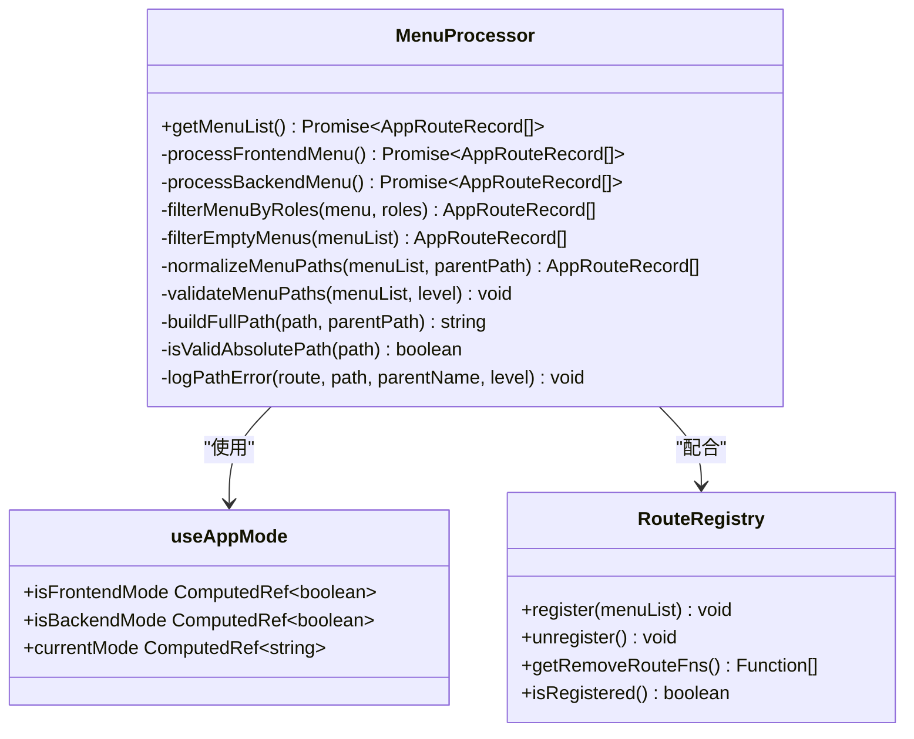
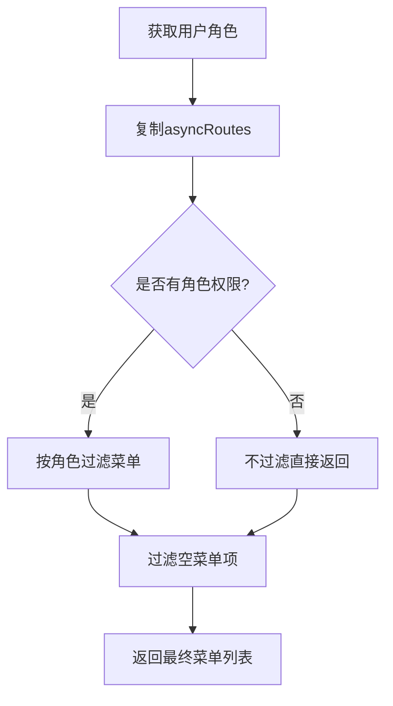
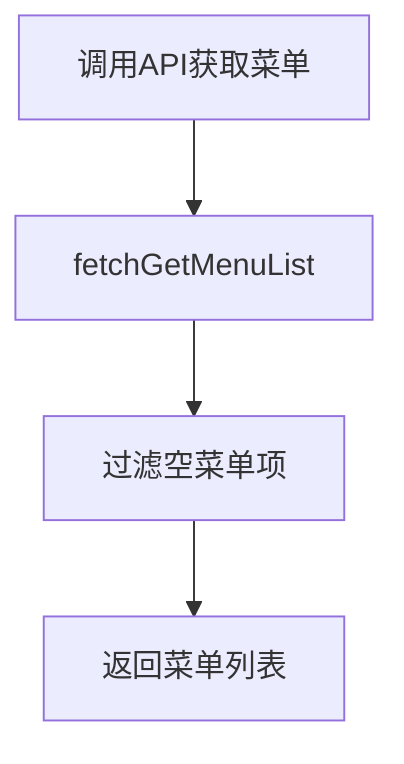
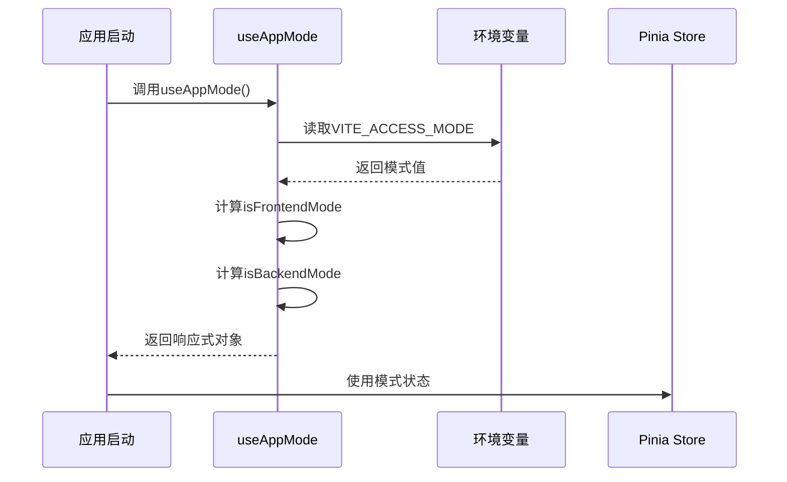
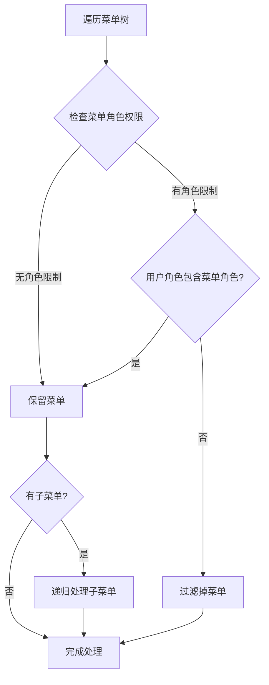
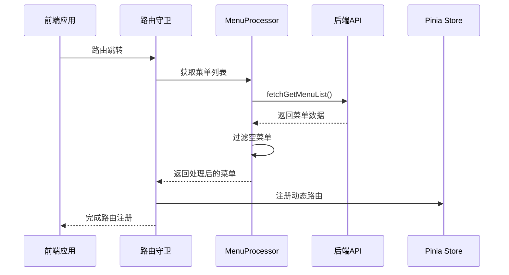
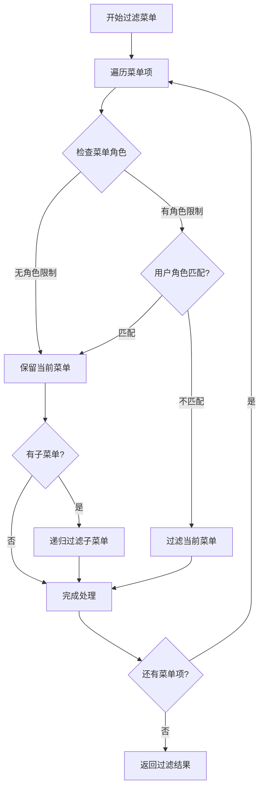
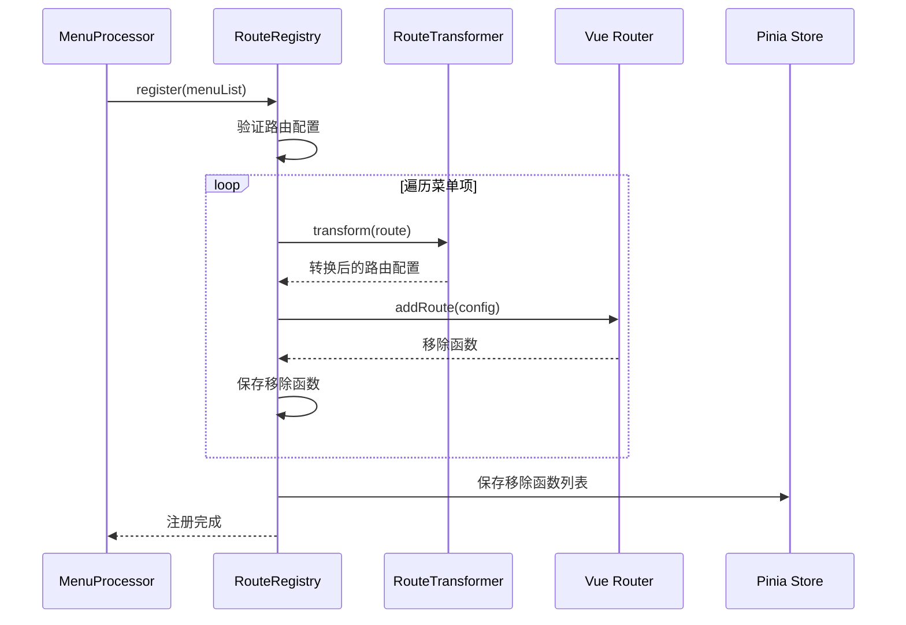

# 菜单处理模式

<cite>
**本文档引用的文件**
- [MenuProcessor.ts](file://src/router/core/MenuProcessor.ts)
- [useAppMode.ts](file://src/hooks/core/useAppMode.ts)
- [asyncRoutes.ts](file://src/router/routes/asyncRoutes.ts)
- [system-manage.ts](file://src/api/system-manage.ts)
- [menu.ts](file://src/store/modules/menu.ts)
- [RouteRegistry.ts](file://src/router/core/RouteRegistry.ts)
- [beforeEach.ts](file://src/router/guards/beforeEach.ts)
- [dashboard.ts](file://src/router/modules/dashboard.ts)
- [system.ts](file://src/router/modules/system.ts)
</cite>

## 目录
1. [概述](#概述)
2. [系统架构](#系统架构)
3. [MenuProcessor核心类详解](#menuprocessor核心类详解)
4. [应用模式管理](#应用模式管理)
5. [前端控制模式](#前端控制模式)
6. [后端控制模式](#后端控制模式)
7. [权限控制机制](#权限控制机制)
8. [路由注册与管理](#路由注册与管理)
9. [实际应用场景](#实际应用场景)
10. [配置与切换](#配置与切换)
11. [最佳实践](#最佳实践)
12. [故障排除](#故障排除)

## 概述

Art Design Pro框架提供了灵活的菜单处理模式，支持前端控制和后端控制两种权限管理模式。这种设计使得开发者可以根据项目需求选择最适合的权限控制策略，既适用于小型演示项目，也满足企业级应用的复杂权限需求。

### 核心特性

- **双模式支持**：前端模式和后端模式的无缝切换
- **响应式管理**：基于Vue 3的响应式状态管理
- **智能权限过滤**：基于角色的动态菜单权限控制
- **路径规范化**：自动处理路由路径的标准化
- **错误检测**：内置的路径配置错误检测机制

## 系统架构



**图表来源**
- [MenuProcessor.ts](file://src/router/core/MenuProcessor.ts#L17-L240)
- [useAppMode.ts](file://src/hooks/core/useAppMode.ts#L19-L44)

## MenuProcessor核心类详解

MenuProcessor是菜单处理的核心类，负责统一管理两种不同的菜单获取和处理流程。

### 类结构概览



**图表来源**
- [MenuProcessor.ts](file://src/router/core/MenuProcessor.ts#L17-L240)
- [useAppMode.ts](file://src/hooks/core/useAppMode.ts#L19-L44)
- [RouteRegistry.ts](file://src/router/core/RouteRegistry.ts#L16-L91)

### 核心方法分析

#### getMenuList方法

这是菜单处理的入口方法，根据当前应用模式决定使用哪种处理流程：

**节来源**
- [MenuProcessor.ts](file://src/router/core/MenuProcessor.ts#L22-L36)

#### 前端模式处理流程



**图表来源**
- [MenuProcessor.ts](file://src/router/core/MenuProcessor.ts#L42-L53)

#### 后端模式处理流程



**图表来源**
- [MenuProcessor.ts](file://src/router/core/MenuProcessor.ts#L59-L61)

## 应用模式管理

useAppMode组合式函数提供了应用模式的响应式管理能力，是整个菜单处理模式切换的核心。

### 模式识别机制



**图表来源**
- [useAppMode.ts](file://src/hooks/core/useAppMode.ts#L19-L44)

### 模式状态管理

| 模式类型 | 环境变量值 | 权限控制方式 | 适用场景 |
|---------|-----------|-------------|----------|
| 前端模式 | `frontend` | 前端路由配置控制 | 小型项目、演示环境 |
| 后端模式 | `backend` | 后端接口返回控制 | 企业级应用、复杂权限 |

**节来源**
- [useAppMode.ts](file://src/hooks/core/useAppMode.ts#L21-L44)

## 前端控制模式

前端控制模式将权限控制逻辑完全放在前端，通过路由配置中的角色字段实现权限管理。

### 实现原理

前端模式的核心在于利用asyncRoutes作为基础菜单库，结合用户的角色信息进行动态过滤。

#### 角色权限过滤算法



**图表来源**
- [MenuProcessor.ts](file://src/router/core/MenuProcessor.ts#L67-L82)

### 菜单配置示例

以下是一个典型的前端权限菜单配置：

**节来源**
- [dashboard.ts](file://src/router/modules/dashboard.ts#L3-L11)
- [system.ts](file://src/router/modules/system.ts#L3-L11)

### 优势特点

1. **性能优异**：无需额外的API调用
2. **离线可用**：不依赖后端服务
3. **开发便捷**：权限配置集中管理
4. **调试简单**：前端可直接查看权限配置

### 适用场景

- 小型团队项目
- 内部管理系统
- 演示和原型项目
- 对权限要求不复杂的场景

## 后端控制模式

后端控制模式将权限决策权交给后端服务，前端只负责展示后端返回的菜单结构。

### 数据流架构



**图表来源**
- [MenuProcessor.ts](file://src/router/core/MenuProcessor.ts#L59-L61)
- [beforeEach.ts](file://src/router/guards/beforeEach.ts#L223-L237)

### 后端API集成

后端模式通过fetchGetMenuList API与后端服务交互：

**节来源**
- [system-manage.ts](file://src/api/system-manage.ts#L20-L25)

### 权限控制优势

1. **集中管理**：权限规则统一在后端维护
2. **实时更新**：权限变更立即生效
3. **安全可靠**：敏感权限逻辑在服务端执行
4. **灵活扩展**：支持复杂的业务权限逻辑

### 适用场景

- 企业级管理系统
- 多租户应用
- 对安全性要求高的系统
- 需要动态权限调整的场景

## 权限控制机制

### 角色权限过滤

MenuProcessor实现了基于角色的权限过滤机制，支持多层级菜单的权限控制。

#### 过滤算法详解



**图表来源**
- [MenuProcessor.ts](file://src/router/core/MenuProcessor.ts#L67-L82)

### 菜单项验证

系统提供了完善的菜单项验证机制，确保菜单配置的正确性：

**节来源**
- [MenuProcessor.ts](file://src/router/core/MenuProcessor.ts#L84-L119)

### 路径规范化

为了确保路由跳转的正确性，系统实现了智能的路径规范化机制：

**节来源**
- [MenuProcessor.ts](file://src/router/core/MenuProcessor.ts#L132-L148)

## 路由注册与管理

### 动态路由注册

RouteRegistry类负责动态路由的注册和管理，是菜单系统与Vue Router集成的关键组件。

#### 注册流程



**图表来源**
- [RouteRegistry.ts](file://src/router/core/RouteRegistry.ts#L46-L58)

### 路由移除机制

系统提供了完整的路由清理机制，确保用户登出时能够正确清理动态注册的路由：

**节来源**
- [RouteRegistry.ts](file://src/router/core/RouteRegistry.ts#L62-L70)
- [menu.ts](file://src/store/modules/menu.ts#L83-L96)

### 路由状态管理

MenuStore提供了完整的菜单状态管理功能：

**节来源**
- [menu.ts](file://src/store/modules/menu.ts#L41-L109)

## 实际应用场景

### 小型项目场景

对于小型项目或内部管理系统，推荐使用前端控制模式：

**优势**：
- 开发成本低
- 部署简单
- 性能优异
- 调试方便

**配置示例**：
```typescript
// vite.config.ts
define: {
  'import.meta.env.VITE_ACCESS_MODE': '"frontend"'
}
```

### 企业级场景

大型企业应用建议采用后端控制模式：

**优势**：
- 权限集中管理
- 安全性高
- 可扩展性强
- 支持复杂业务逻辑

**配置示例**：
```typescript
// vite.config.ts
define: {
  'import.meta.env.VITE_ACCESS_MODE': '"backend"'
}
```

### 混合场景

某些项目可能需要混合模式，可以根据具体需求灵活配置：

- **核心功能**：后端控制模式
- **辅助功能**：前端控制模式
- **演示功能**：前端控制模式

## 配置与切换

### 环境变量配置

菜单处理模式通过环境变量VITE_ACCESS_MODE进行控制：

**节来源**
- [useAppMode.ts](file://src/hooks/core/useAppMode.ts#L22)

### 切换步骤

1. **修改环境变量**：
   ```bash
   # 前端模式
   VITE_ACCESS_MODE=frontend
   
   # 后端模式  
   VITE_ACCESS_MODE=backend
   ```

2. **重启开发服务器**：
   ```bash
   npm run dev
   ```

3. **验证切换效果**：
   - 检查菜单是否正常加载
   - 验证权限控制是否生效
   - 测试路由跳转功能

### 运行时切换

虽然推荐在构建时确定模式，但系统也支持运行时的模式切换：

**节来源**
- [useAppMode.ts](file://src/hooks/core/useAppMode.ts#L38-L44)

## 最佳实践

### 前端模式最佳实践

1. **角色命名规范**：
   ```typescript
   // 推荐的角色标识格式
   const ROLES = {
     SUPER_ADMIN: 'R_SUPER',
     ADMIN: 'R_ADMIN',
     EDITOR: 'R_EDITOR',
     VIEWER: 'R_VIEWER'
   }
   ```

2. **菜单层次设计**：
   - 一级菜单：系统功能模块
   - 二级菜单：具体功能页面
   - 三级菜单：细分子功能

3. **权限粒度控制**：
   - 使用精确的角色权限
   - 避免过度细分
   - 保持权限体系清晰

### 后端模式最佳实践

1. **API设计原则**：
   - 返回标准化的菜单结构
   - 支持动态权限配置
   - 提供完整的菜单元数据

2. **权限设计**：
   - 基于RBAC模型
   - 支持权限继承
   - 提供权限缓存机制

3. **性能优化**：
   - 实现菜单数据缓存
   - 支持增量更新
   - 优化网络传输

### 通用最佳实践

1. **错误处理**：
   ```typescript
   // 完善的错误处理机制
   try {
     const menuList = await menuProcessor.getMenuList()
     // 处理菜单数据
   } catch (error) {
     console.error('菜单加载失败:', error)
     // 显示错误提示
   }
   ```

2. **性能监控**：
   - 监控菜单加载时间
   - 跟踪权限过滤性能
   - 分析路由注册效率

3. **用户体验**：
   - 提供菜单加载状态
   - 实现平滑的权限切换
   - 优化首次加载体验

## 故障排除

### 常见问题及解决方案

#### 1. 菜单不显示问题

**症状**：菜单为空或部分菜单不显示

**排查步骤**：
1. 检查环境变量配置
2. 验证用户角色权限
3. 确认菜单配置正确性

**解决方案**：
```typescript
// 检查菜单配置
console.log('当前菜单配置:', menuList)
console.log('用户角色:', userStore.info?.roles)
```

#### 2. 路由跳转失败

**症状**：点击菜单后页面空白或报错

**排查步骤**：
1. 检查路由路径配置
2. 验证组件是否存在
3. 确认路由注册状态

**解决方案**：
```typescript
// 路径规范化检查
const fullPath = processor.buildFullPath(item.path, parentPath)
console.log('规范化路径:', fullPath)
```

#### 3. 权限控制失效

**症状**：权限控制不生效或错误

**排查步骤**：
1. 检查角色权限配置
2. 验证权限过滤逻辑
3. 确认用户角色数据

**解决方案**：
```typescript
// 权限验证调试
const hasPermission = processor.filterMenuByRoles([menu], userRoles)
console.log('权限过滤结果:', hasPermission)
```

### 调试工具

系统提供了丰富的调试工具帮助开发者快速定位问题：

1. **路径配置错误检测**：
   - 自动检测非法的绝对路径
   - 提供详细的错误信息
   - 建议正确的路径配置

2. **菜单验证工具**：
   - 验证菜单结构完整性
   - 检查必填字段缺失
   - 确保菜单层级正确

3. **权限过滤调试**：
   - 显示权限过滤过程
   - 提供过滤结果统计
   - 支持权限配置测试

**节来源**
- [MenuProcessor.ts](file://src/router/core/MenuProcessor.ts#L158-L212)

### 性能优化建议

1. **菜单数据优化**：
   - 减少不必要的菜单层级
   - 优化菜单项数量
   - 使用懒加载机制

2. **权限过滤优化**：
   - 实现权限缓存
   - 优化角色匹配算法
   - 减少重复计算

3. **路由注册优化**：
   - 批量注册路由
   - 实现路由去重
   - 优化内存使用

通过合理运用这些菜单处理模式，开发者可以构建出既安全又高效的权限控制系统，满足不同规模项目的多样化需求。