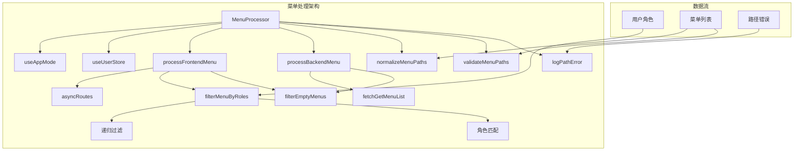
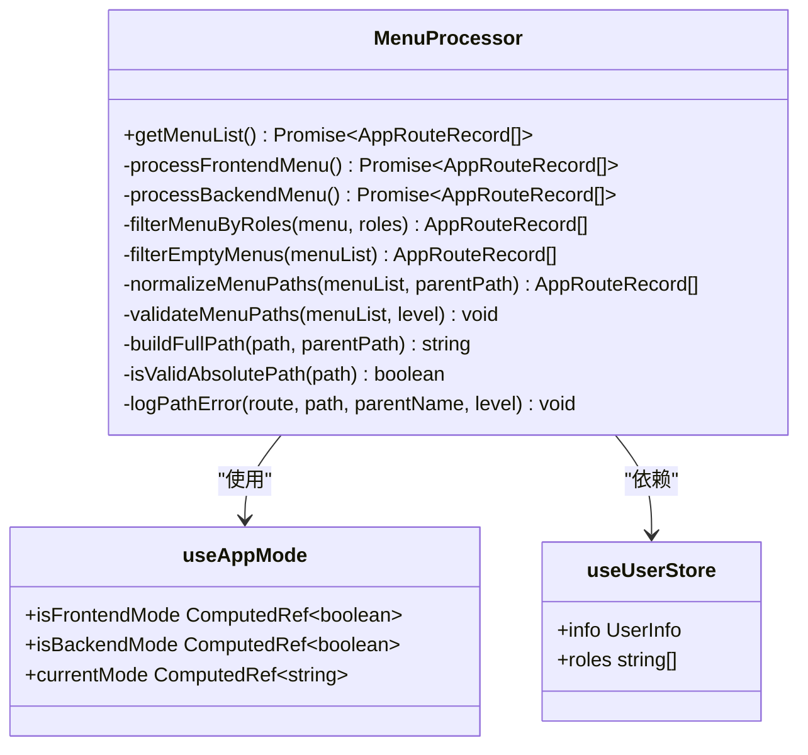
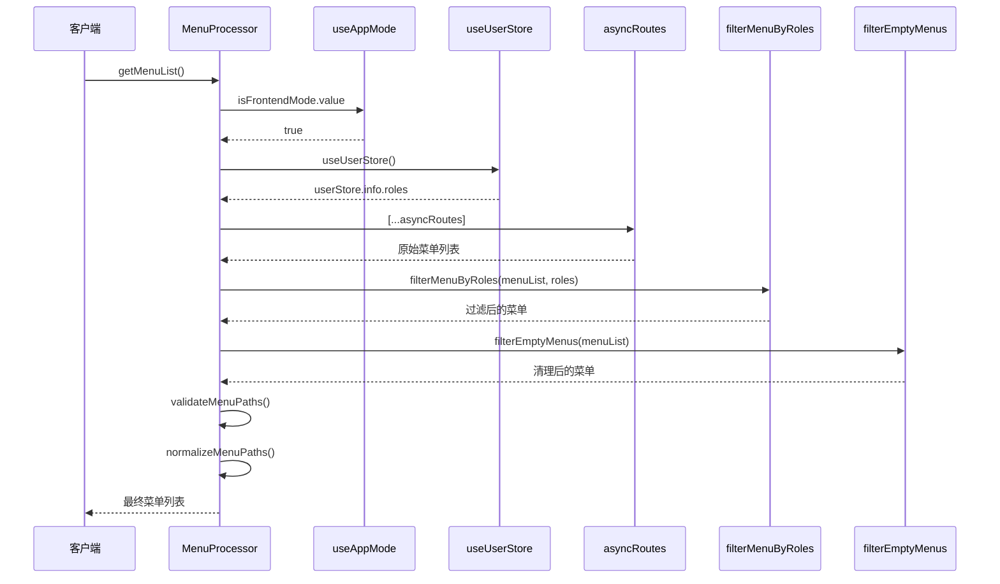
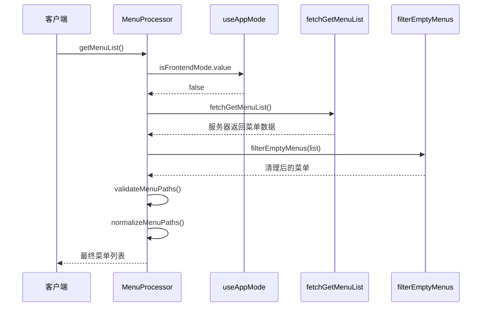
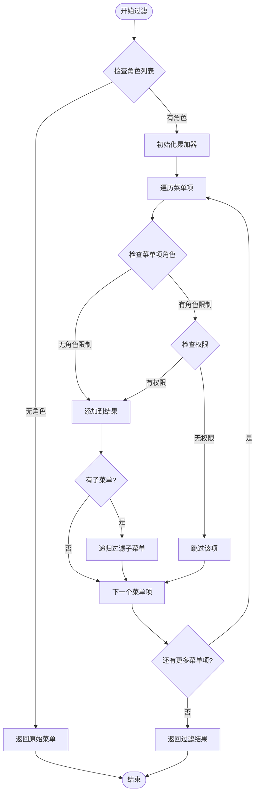
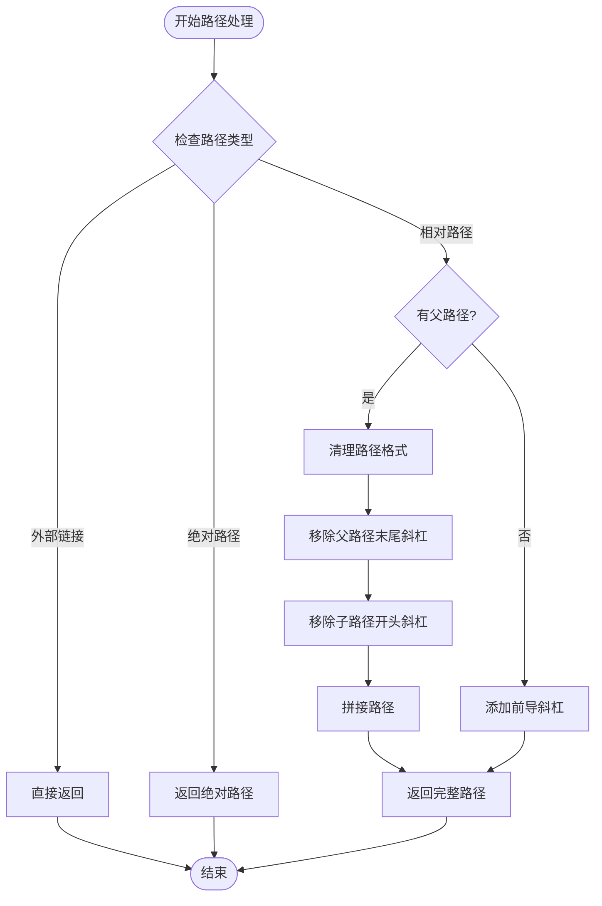
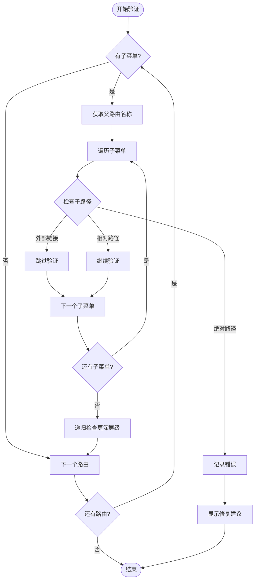

# 菜单处理流程

<cite>
**本文档引用的文件**
- [MenuProcessor.ts](file://src/router/core/MenuProcessor.ts)
- [useAppMode.ts](file://src/hooks/core/useAppMode.ts)
- [asyncRoutes.ts](file://src/router/routes/asyncRoutes.ts)
- [system-manage.ts](file://src/api/system-manage.ts)
- [user.ts](file://src/store/modules/user.ts)
- [dashboard.ts](file://src/router/modules/dashboard.ts)
- [system.ts](file://src/router/modules/system.ts)
- [index.ts](file://src/types/router/index.ts)
- [route.ts](file://src/utils/navigation/route.ts)
</cite>

## 目录
1. [概述](#概述)
2. [系统架构](#系统架构)
3. [核心组件分析](#核心组件分析)
4. [前端控制模式详解](#前端控制模式详解)
5. [后端控制模式详解](#后端控制模式详解)
6. [权限过滤机制](#权限过滤机制)
7. [路径处理流程](#路径处理流程)
8. [错误检测与修复](#错误检测与修复)
9. [性能优化考虑](#性能优化考虑)
10. [故障排除指南](#故障排除指南)

## 概述

Art Design Pro 的菜单处理系统是一个高度灵活且功能完善的权限控制框架，支持前端控制和后端控制两种模式。该系统通过 `MenuProcessor` 类实现了复杂的菜单数据获取、过滤和处理流程，确保用户只能访问其具有权限的菜单项，并提供完善的路径规范化和错误检测机制。

### 主要特性

- **双模式支持**：前端控制模式和后端控制模式的无缝切换
- **递归权限过滤**：基于用户角色的深度菜单权限控制
- **智能路径处理**：自动规范化菜单路径，确保正确跳转
- **严格路径验证**：检测并提示路径配置错误
- **多层级支持**：支持无限层级的菜单嵌套结构

## 系统架构

**图表来源**
- [MenuProcessor.ts](file://src/router/core/MenuProcessor.ts#L18-L242)
- [useAppMode.ts](file://src/hooks/core/useAppMode.ts#L20-L45)

## 核心组件分析

### MenuProcessor 类结构

`MenuProcessor` 是整个菜单处理系统的核心类，负责协调各个处理步骤：

**图表来源**
- [MenuProcessor.ts](file://src/router/core/MenuProcessor.ts#L18-L242)
- [useAppMode.ts](file://src/hooks/core/useAppMode.ts#L20-L45)
- [user.ts](file://src/store/modules/user.ts#L50-L91)

**章节来源**
- [MenuProcessor.ts](file://src/router/core/MenuProcessor.ts#L18-L242)
- [useAppMode.ts](file://src/hooks/core/useAppMode.ts#L20-L45)

## 前端控制模式详解

前端控制模式是 Art Design Pro 的默认权限控制方式，权限由前端路由配置决定。

### 处理流程

**图表来源**
- [MenuProcessor.ts](file://src/router/core/MenuProcessor.ts#L22-L37)
- [MenuProcessor.ts](file://src/router/core/MenuProcessor.ts#L42-L54)

### 前端模式特点

1. **本地权限控制**：所有权限逻辑在前端完成
2. **快速响应**：无需网络请求，菜单加载速度快
3. **离线支持**：可以在没有网络连接的情况下正常工作
4. **安全性限制**：权限信息暴露在前端，可能存在安全风险

**章节来源**
- [MenuProcessor.ts](file://src/router/core/MenuProcessor.ts#L42-L54)
- [asyncRoutes.ts](file://src/router/routes/asyncRoutes.ts#L1-L10)

## 后端控制模式详解

后端控制模式将权限决策完全交给服务器，提供更高的安全性。

### 处理流程

**图表来源**
- [MenuProcessor.ts](file://src/router/core/MenuProcessor.ts#L22-L37)
- [MenuProcessor.ts](file://src/router/core/MenuProcessor.ts#L59-L62)
- [system-manage.ts](file://src/api/system-manage.ts#L21-L25)

### 后端模式优势

1. **高安全性**：权限信息不暴露在前端
2. **集中管理**：权限策略统一在服务器端维护
3. **实时更新**：权限变更立即生效
4. **复杂权限**：支持更复杂的权限逻辑

**章节来源**
- [MenuProcessor.ts](file://src/router/core/MenuProcessor.ts#L59-L62)
- [system-manage.ts](file://src/api/system-manage.ts#L21-L25)

## 权限过滤机制

### 角色过滤算法

`filterMenuByRoles` 方法实现了递归的角色权限过滤：

**图表来源**
- [MenuProcessor.ts](file://src/router/core/MenuProcessor.ts#L67-L82)

### 权限匹配规则

1. **无角色限制**：如果菜单项没有定义 `roles` 属性，则视为公共菜单
2. **角色匹配**：菜单项的 `roles` 数组必须包含用户的一个角色
3. **递归处理**：子菜单继承父菜单的权限控制逻辑

**章节来源**
- [MenuProcessor.ts](file://src/router/core/MenuProcessor.ts#L67-L82)

## 路径处理流程

### 路径规范化机制

**图表来源**
- [MenuProcessor.ts](file://src/router/core/MenuProcessor.ts#L217-L240)

### 路径处理步骤

1. **外部链接检测**：识别 HTTP/HTTPS 链接直接返回
2. **绝对路径验证**：检查是否已经是绝对路径
3. **相对路径处理**：构建完整路径
4. **格式标准化**：确保路径格式一致性

**章节来源**
- [MenuProcessor.ts](file://src/router/core/MenuProcessor.ts#L132-L240)

## 错误检测与修复

### 路径配置错误检测

系统实现了严格的路径配置验证机制：

**图表来源**
- [MenuProcessor.ts](file://src/router/core/MenuProcessor.ts#L158-L178)

### 错误类型与修复方案

| 错误类型 | 描述 | 修复方案 |
|---------|------|----------|
| 绝对路径错误 | 非一级菜单使用 `/` 开头路径 | 移除路径开头的 `/` 符号 |
| 路径为空 | 菜单项缺少 path 属性 | 添加正确的相对路径 |
| 路径重复 | 多个菜单项使用相同路径 | 修改其中一个路径 |
| 路径冲突 | 父子路径不匹配 | 调整子路径为相对路径 |

**章节来源**
- [MenuProcessor.ts](file://src/router/core/MenuProcessor.ts#L158-L212)

## 性能优化考虑

### 内存使用优化

1. **惰性加载**：菜单数据按需加载，避免一次性加载过多数据
2. **对象复用**：使用对象浅拷贝减少内存分配
3. **递归优化**：采用尾递归优化避免栈溢出

### 计算性能优化

1. **角色匹配缓存**：缓存用户角色信息，避免重复计算
2. **路径标准化**：提前标准化路径格式，减少运行时计算
3. **早期退出**：在不满足条件时尽早退出循环

### 网络优化

1. **后端模式**：减少前端路由配置大小
2. **懒加载**：菜单组件按需加载
3. **压缩传输**：菜单数据进行压缩传输

## 故障排除指南

### 常见问题诊断

#### 1. 菜单权限不生效

**症状**：用户应该能看到的菜单项被过滤掉了

**排查步骤**：
1. 检查用户角色配置是否正确
2. 验证菜单项的 `roles` 属性设置
3. 确认 `useAppMode` 的模式配置

**解决方案**：
- 更新用户角色信息
- 修改菜单项权限配置
- 切换应用模式

#### 2. 路径跳转失败

**症状**：点击菜单项无法正确跳转

**排查步骤**：
1. 检查路径配置是否正确
2. 验证组件是否存在
3. 确认路由注册是否成功

**解决方案**：
- 修正路径配置
- 创建缺失的组件
- 重新注册路由

#### 3. 菜单显示异常

**症状**：菜单项显示不正确或缺失

**排查步骤**：
1. 检查菜单数据结构
2. 验证权限过滤逻辑
3. 确认路径规范化过程

**解决方案**：
- 修复菜单数据结构
- 调整权限过滤规则
- 重新配置路径处理

### 调试工具

系统提供了完善的调试功能：

- **控制台日志**：详细的路径配置错误提示
- **类型检查**：编译时的类型安全保证
- **运行时验证**：动态的菜单有效性检查

**章节来源**
- [MenuProcessor.ts](file://src/router/core/MenuProcessor.ts#L121-L242)

## 结论

Art Design Pro 的菜单处理系统是一个设计精良、功能完备的权限控制框架。它通过灵活的双模式支持、强大的权限过滤机制和完善的路径处理流程，为开发者提供了一个可靠的基础架构。系统的模块化设计使得各个组件职责清晰，易于维护和扩展。

对于开发者而言，理解这套菜单处理流程对于构建安全、高效的权限控制系统至关重要。通过合理配置前端或后端模式，结合适当的权限策略，可以构建出既安全又易用的管理系统。