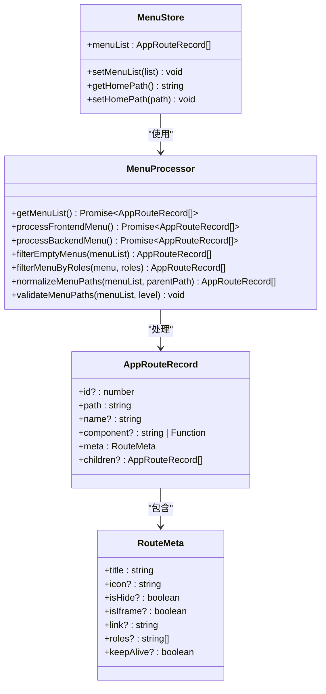
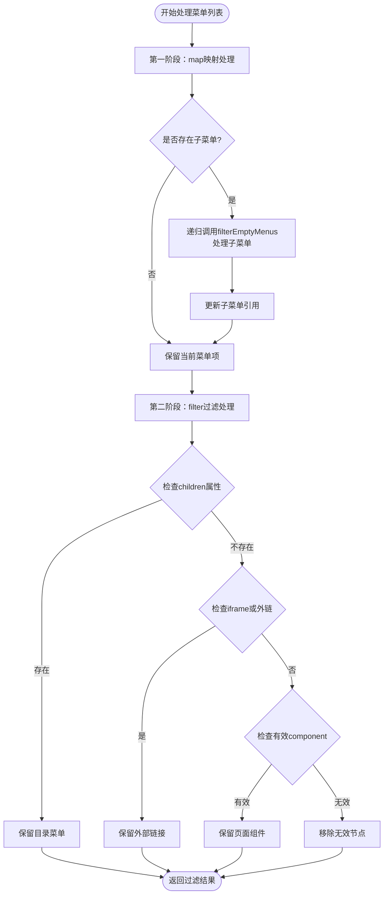
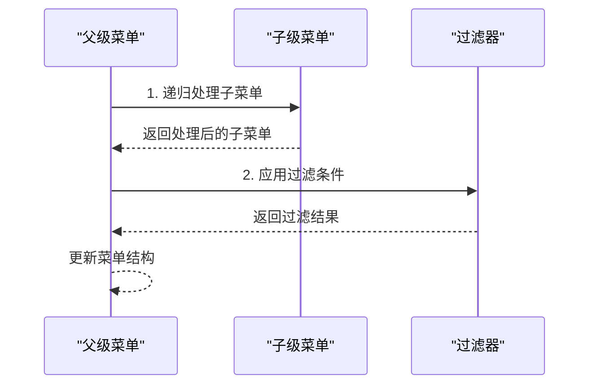
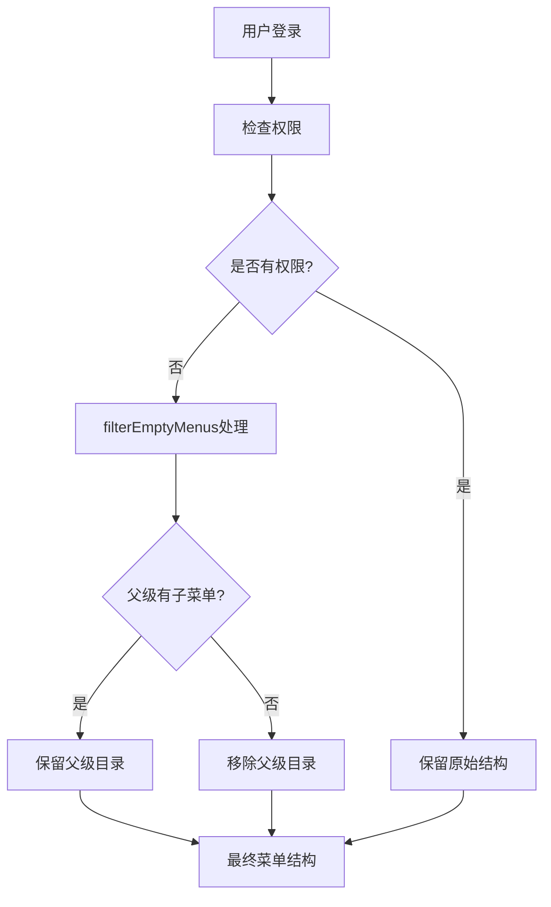
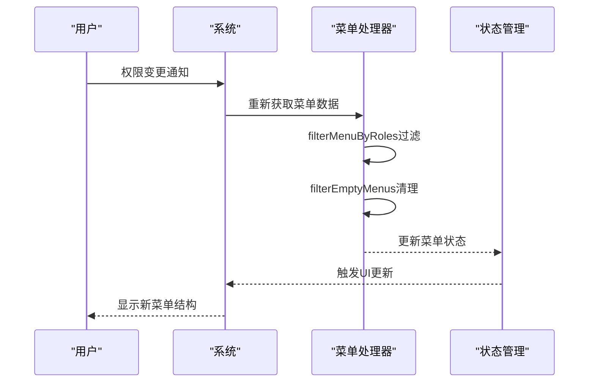

# 空菜单项清理流程

<cite>
**本文档引用的文件**
- [MenuProcessor.ts](file://src/router/core/MenuProcessor.ts)
- [asyncRoutes.ts](file://src/router/routes/asyncRoutes.ts)
- [index.ts](file://src/router/modules/index.ts)
- [system.ts](file://src/router/modules/system.ts)
- [examples.ts](file://src/router/modules/examples.ts)
- [menu.ts](file://src/store/modules/menu.ts)
- [index.ts](file://src/types/router/index.ts)
- [routesAlias.ts](file://src/router/routesAlias.ts)
- [route.ts](file://src/utils/navigation/route.ts)
</cite>

## 目录
1. [概述](#概述)
2. [核心架构](#核心架构)
3. [filterEmptyMenus方法详解](#filteremptymenus方法详解)
4. [双重处理机制](#双重处理机制)
5. [四项保留条件](#四项保留条件)
6. [执行顺序的重要性](#执行顺序的重要性)
7. [实际应用场景](#实际应用场景)
8. [动态权限变更处理](#动态权限变更处理)
9. [测试验证方法](#测试验证方法)
10. [性能考虑](#性能考虑)

## 概述

空菜单项清理流程是Art Design Pro系统中负责优化菜单结构的核心机制。该流程通过`MenuProcessor`类中的`filterEmptyMenus`方法实现，采用双重处理机制确保菜单树的完整性和有效性。该机制能够智能识别并保留具有业务价值的菜单项，同时自动过滤掉无效的空节点，从而提升用户体验和系统性能。

## 核心架构



**图表来源**
- [MenuProcessor.ts](file://src/router/core/MenuProcessor.ts#L17-L242)
- [index.ts](file://src/types/router/index.ts#L74-L81)
- [menu.ts](file://src/store/modules/menu.ts#L41-L108)

**章节来源**
- [MenuProcessor.ts](file://src/router/core/MenuProcessor.ts#L17-L242)
- [index.ts](file://src/types/router/index.ts#L74-L81)

## filterEmptyMenus方法详解

`filterEmptyMenus`方法是空菜单项清理流程的核心算法，采用递归处理和条件过滤相结合的方式实现菜单树的优化。

### 方法签名与参数

该方法接收一个`AppRouteRecord[]`类型的菜单列表作为输入参数，返回经过过滤处理后的菜单数组。方法签名体现了其纯函数特性，不修改原始数据结构。

### 处理流程图



**图表来源**
- [MenuProcessor.ts](file://src/router/core/MenuProcessor.ts#L87-L118)

**章节来源**
- [MenuProcessor.ts](file://src/router/core/MenuProcessor.ts#L87-L118)

## 双重处理机制

空菜单项清理流程采用独特的双重处理机制，确保菜单树结构的完整性和有效性：

### 第一阶段：map递归处理

在第一阶段，`map`方法遍历菜单列表并对每个菜单项进行预处理：

1. **子菜单递归处理**：对于包含子菜单的菜单项，先递归调用`filterEmptyMenus`处理子菜单
2. **结构更新**：将处理后的子菜单重新赋值给当前菜单项的`children`属性
3. **原样保留**：对于没有子菜单的菜单项，保持原样不变

### 第二阶段：filter条件过滤

在第二阶段，`filter`方法根据四个业务条件对菜单项进行最终筛选：

1. **目录菜单保留**：定义了`children`属性的菜单项被视为目录菜单，即使为空也予以保留
2. **外部链接保留**：包含`isIframe`或`link`属性的菜单项被保留
3. **页面组件保留**：具有有效`component`属性且不是布局组件的菜单项被保留
4. **无效节点移除**：不符合上述条件的菜单项被过滤掉

**章节来源**
- [MenuProcessor.ts](file://src/router/core/MenuProcessor.ts#L89-L118)

## 四项保留条件

### 1. 目录菜单条件

```typescript
// 条件：如果定义了 children 属性（即使是空数组）
if ('children' in item) {
  return true
}
```

**业务含义**：
- 目录菜单作为导航结构的重要组成部分，即使没有子菜单也应保留
- 空目录菜单可以为用户提供清晰的导航层次感
- 防止误删重要的导航结构节点

### 2. 外链或iframe菜单项条件

```typescript
// 条件：如果有外链或 iframe
if (item.meta?.isIframe === true || item.meta?.link) {
  return true
}
```

**业务含义**：
- 外链菜单指向系统外部资源，必须保留以保证功能完整性
- iframe菜单集成第三方服务，需要保持可用性
- 这些菜单项通常具有特定的业务价值，不应被过滤

### 3. 有效component页面组件条件

```typescript
// 条件：如果有有效的 component
if (item.component && item.component !== '' && item.component !== RoutesAlias.Layout) {
  return true
}
```

**业务含义**：
- 页面组件是系统的核心功能载体，必须保留
- 排除空字符串和布局组件，避免重复计算
- 确保只有真正有意义的页面组件被保留

### 4. Layout布局组件特殊处理

```typescript
// 特殊处理：排除Layout布局组件
item.component !== RoutesAlias.Layout
```

**业务含义**：
- Layout组件作为页面容器，本身不作为菜单项显示
- 避免将布局组件误认为普通页面组件
- 保持菜单结构的简洁性和功能性

**章节来源**
- [MenuProcessor.ts](file://src/router/core/MenuProcessor.ts#L101-L117)
- [routesAlias.ts](file://src/router/routesAlias.ts#L4-L7)

## 执行顺序的重要性

空菜单项清理流程的执行顺序至关重要，必须遵循以下原则：

### 递归处理优先于过滤



**图表来源**
- [MenuProcessor.ts](file://src/router/core/MenuProcessor.ts#L90-L98)

### 顺序原因分析

1. **结构完整性保障**：先递归处理子菜单确保所有层级都被正确处理
2. **依赖关系维护**：子菜单的处理结果直接影响父菜单的过滤决策
3. **数据一致性保证**：递归处理完成后，过滤阶段才能基于完整的菜单结构做出准确判断

### 错误顺序的影响

如果过滤阶段先于递归处理执行，会导致：
- 子菜单未被正确处理就参与过滤决策
- 父菜单可能错误地保留或移除
- 菜单树结构出现不一致或损坏

**章节来源**
- [MenuProcessor.ts](file://src/router/core/MenuProcessor.ts#L89-L118)

## 实际应用场景

### 场景一：用户无任何子菜单权限

当用户没有任何子菜单权限时，父级目录菜单的保留与隐藏逻辑：



**图表来源**
- [MenuProcessor.ts](file://src/router/core/MenuProcessor.ts#L41-L53)

**具体表现**：
- 用户无任何子菜单权限时，父级目录菜单会被移除
- 系统只保留用户有权限访问的菜单项
- 保持菜单结构的简洁性和可用性

### 场景二：部分权限场景

当用户拥有部分子菜单权限时：

- 父级目录保留：因为包含有效子菜单
- 子菜单过滤：只保留用户有权限的子菜单
- 结构保持：菜单树层次结构完整

### 场景三：完全权限场景

当用户拥有所有菜单权限时：

- 所有菜单项都符合保留条件
- 菜单结构保持不变
- 用户体验最佳

**章节来源**
- [MenuProcessor.ts](file://src/router/core/MenuProcessor.ts#L41-L53)
- [MenuProcessor.ts](file://src/router/core/MenuProcessor.ts#L67-L82)

## 动态权限变更处理

### 权限变更触发机制

系统支持动态权限变更，当用户权限发生变化时：

1. **权限检测**：系统定期或实时检测用户权限变化
2. **菜单重建**：重新调用`MenuProcessor`的菜单获取流程
3. **增量更新**：只更新发生变化的部分，提高性能

### 权限变更流程



**图表来源**
- [MenuProcessor.ts](file://src/router/core/MenuProcessor.ts#L41-L53)
- [MenuProcessor.ts](file://src/router/core/MenuProcessor.ts#L67-L82)
- [menu.ts](file://src/store/modules/menu.ts#L55-L58)

### 状态管理集成

菜单状态管理与权限系统的深度集成：

- **自动更新**：权限变更时自动更新菜单状态
- **持久化**：菜单状态持久化存储，支持会话恢复
- **响应式**：Vue响应式系统自动更新UI

**章节来源**
- [MenuProcessor.ts](file://src/router/core/MenuProcessor.ts#L41-L53)
- [MenuProcessor.ts](file://src/router/core/MenuProcessor.ts#L67-L82)
- [menu.ts](file://src/store/modules/menu.ts#L55-L58)

## 测试验证方法

### 单元测试设计

针对空菜单项清理流程的测试应覆盖以下场景：

#### 测试用例1：空菜单处理

```typescript
// 测试空菜单列表的处理
test('should handle empty menu list', () => {
  const processor = new MenuProcessor()
  const result = processor.filterEmptyMenus([])
  expect(result).toEqual([])
})
```

#### 测试用例2：目录菜单保留

```typescript
// 测试目录菜单的保留逻辑
test('should preserve directory menus', () => {
  const menu = [{
    path: 'system',
    name: 'System',
    component: '',
    meta: { title: '系统管理' },
    children: []
  }]
  
  const processor = new MenuProcessor()
  const result = processor.filterEmptyMenus(menu)
  expect(result).toHaveLength(1)
})
```

#### 测试用例3：外部链接处理

```typescript
// 测试外部链接的保留
test('should preserve external links', () => {
  const menu = [{
    path: 'external',
    name: 'External',
    meta: { 
      title: '外部链接', 
      link: 'https://example.com',
      isIframe: false
    }
  }]
  
  const processor = new MenuProcessor()
  const result = processor.filterEmptyMenus(menu)
  expect(result).toHaveLength(1)
})
```

#### 测试用例4：页面组件过滤

```typescript
// 测试页面组件的有效性过滤
test('should filter invalid components', () => {
  const menu = [
    // 有效组件
    { path: 'valid', name: 'Valid', component: '/pages/valid.vue' },
    // 无效组件
    { path: 'invalid', name: 'Invalid', component: '' },
    // 布局组件
    { path: 'layout', name: 'Layout', component: RoutesAlias.Layout }
  ]
  
  const processor = new MenuProcessor()
  const result = processor.filterEmptyMenus(menu)
  expect(result).toHaveLength(1)
  expect(result[0].name).toBe('Valid')
})
```

### 集成测试设计

#### 测试用例5：完整菜单树处理

```typescript
// 测试复杂菜单树的递归处理
test('should handle complex menu tree', () => {
  const complexMenu = [
    {
      path: 'parent',
      name: 'Parent',
      component: '',
      children: [
        {
          path: 'child1',
          name: 'Child1',
          component: '/pages/child1.vue'
        },
        {
          path: 'child2',
          name: 'Child2',
          component: '',
          children: []
        }
      ]
    }
  ]
  
  const processor = new MenuProcessor()
  const result = processor.filterEmptyMenus(complexMenu)
  
  // 父级保留（有子菜单）
  // 子级1保留（有效组件）
  // 子级2移除（空目录）
  expect(result).toHaveLength(1)
  expect(result[0].children).toHaveLength(1)
})
```

### 性能测试

#### 大型菜单树测试

```typescript
// 测试大型菜单树的处理性能
test('should handle large menu trees efficiently', () => {
  const largeMenu = createLargeMenuStructure(1000)
  const startTime = performance.now()
  
  const processor = new MenuProcessor()
  const result = processor.filterEmptyMenus(largeMenu)
  
  const endTime = performance.now()
  expect(endTime - startTime).toBeLessThan(100) // 100ms内完成
})
```

**章节来源**
- [MenuProcessor.ts](file://src/router/core/MenuProcessor.ts#L87-L118)

## 性能考虑

### 时间复杂度分析

空菜单项清理流程的时间复杂度为O(n)，其中n为菜单项总数：

- **map阶段**：O(n) - 遍历所有菜单项
- **filter阶段**：O(n) - 对每个菜单项应用过滤条件
- **递归处理**：最坏情况下O(h)，其中h为菜单树的最大深度

总体时间复杂度：O(n)

### 空间复杂度分析

空间复杂度主要来自递归调用栈和结果数组：

- **递归栈**：O(h)，其中h为菜单树的最大深度
- **结果数组**：O(k)，其中k为保留的菜单项数量
- **临时对象**：O(n) - 创建新的菜单对象

总体空间复杂度：O(n)

### 优化策略

1. **早期过滤**：在递归处理前尽可能过滤掉无效节点
2. **引用复用**：对未修改的菜单项复用原始引用
3. **批量处理**：对于大量菜单项，考虑分批处理
4. **缓存机制**：对静态菜单结构进行缓存

### 内存使用优化

```typescript
// 优化建议：使用迭代替代递归处理深层菜单
private optimizeDeepMenuProcessing(menuList: AppRouteRecord[]): AppRouteRecord[] {
  // 使用栈结构实现迭代处理
  const stack: { item: AppRouteRecord, parent?: AppRouteRecord }[] = 
    menuList.map(item => ({ item }))
  const result: AppRouteRecord[] = []
  
  while (stack.length > 0) {
    const { item, parent } = stack.pop()!
    
    // 处理当前节点
    if (this.shouldKeepItem(item)) {
      const processedItem = this.processItem(item)
      
      // 添加到结果
      if (parent) {
        parent.children = parent.children || []
        parent.children.push(processedItem)
      } else {
        result.push(processedItem)
      }
      
      // 将子节点压入栈
      if (processedItem.children) {
        processedItem.children.reverse().forEach(child => 
          stack.push({ item: child, parent: processedItem })
        )
      }
    }
  }
  
  return result
}
```

**章节来源**
- [MenuProcessor.ts](file://src/router/core/MenuProcessor.ts#L87-L118)

## 总结

空菜单项清理流程是Art Design Pro系统中不可或缺的核心功能，通过`filterEmptyMenus`方法的双重处理机制，实现了菜单树的智能优化。该流程不仅保证了菜单结构的完整性和有效性，还为用户提供了简洁、直观的导航体验。

关键特性包括：
- **智能过滤**：基于业务规则的四重保留条件
- **递归处理**：确保多层级菜单结构的完整性
- **动态适应**：支持权限变更的实时响应
- **性能优化**：高效的算法设计和内存使用

通过深入理解这一流程的设计原理和实现细节，开发者可以更好地维护和扩展系统功能，为用户提供更加优质的使用体验。