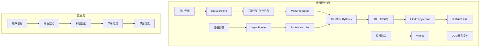
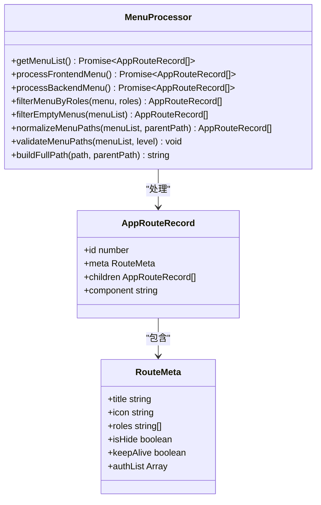
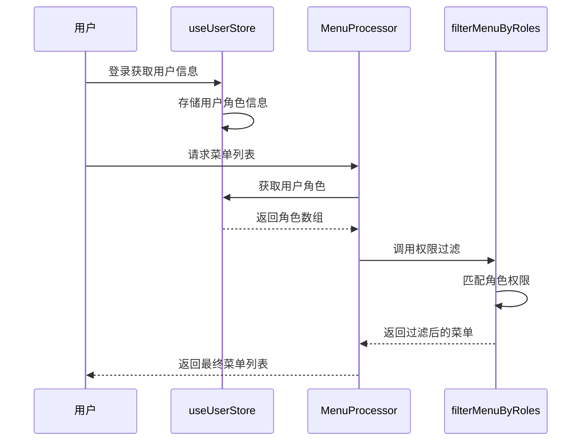
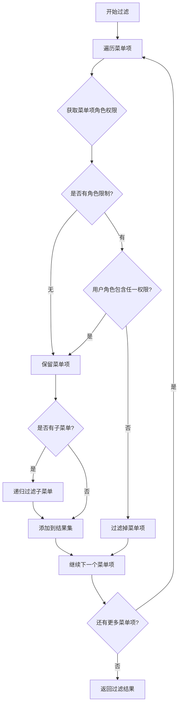
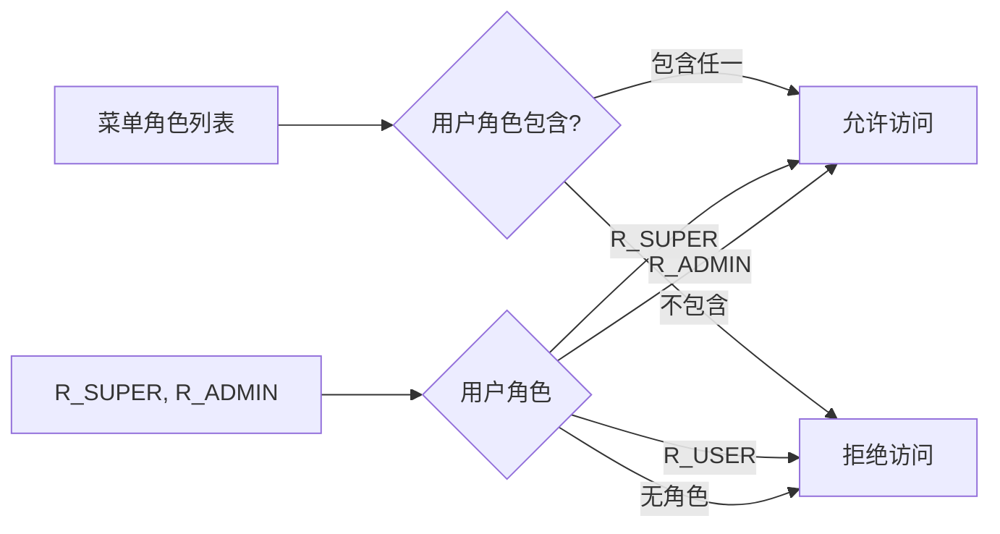
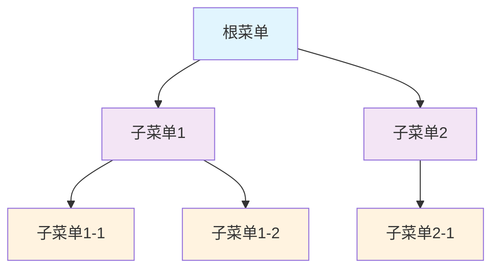
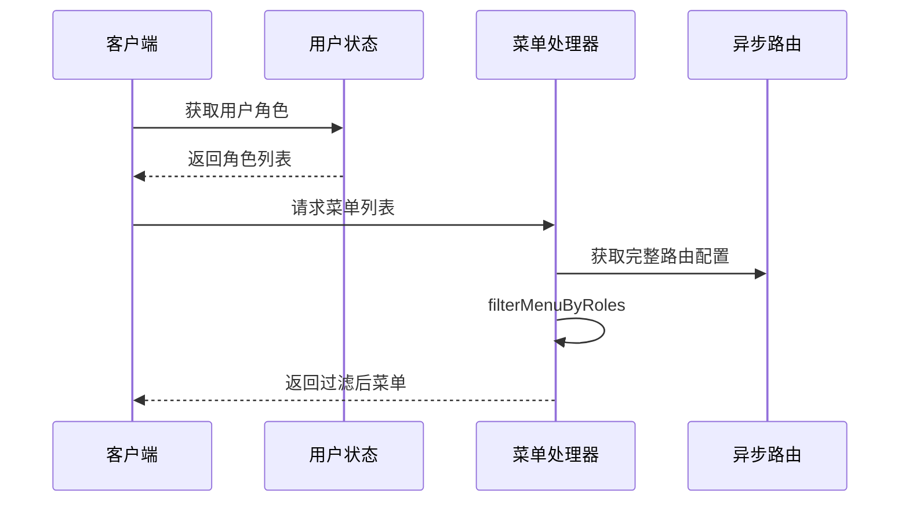
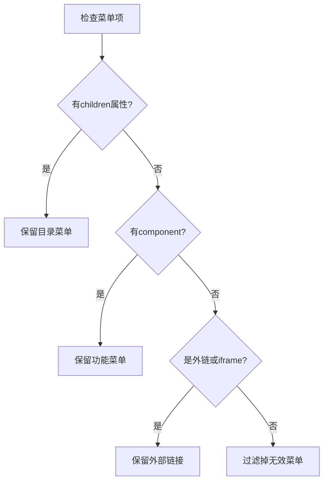

# 菜单权限过滤

<cite>
**本文档引用的文件**
- [MenuProcessor.ts](file://src/router/core/MenuProcessor.ts)
- [user.ts](file://src/store/modules/user.ts)
- [index.ts](file://src/types/router/index.ts)
- [asyncRoutes.ts](file://src/router/routes/asyncRoutes.ts)
- [system.ts](file://src/router/modules/system.ts)
- [dashboard.ts](file://src/router/modules/dashboard.ts)
- [roles.ts](file://src/directives/core/roles.ts)
- [menu.ts](file://src/store/modules/menu.ts)
- [switch-role/index.vue](file://src/views/examples/permission/switch-role/index.vue)
- [button-auth/index.vue](file://src/views/examples/permission/button-auth/index.vue)
</cite>

## 目录
1. [简介](#简介)
2. [系统架构概览](#系统架构概览)
3. [核心组件分析](#核心组件分析)
4. [filterMenuByRoles方法详解](#filtermenubyroles方法详解)
5. [角色权限匹配逻辑](#角色权限匹配逻辑)
6. [递归过滤机制](#递归过滤机制)
7. [前端控制模式](#前端控制模式)
8. [权限过滤最佳实践](#权限过滤最佳实践)
9. [常见问题排查](#常见问题排查)
10. [总结](#总结)

## 简介

Art Design Pro框架实现了一套完整的前端菜单权限过滤系统，通过`filterMenuByRoles`方法基于用户角色信息实现菜单项的递归过滤。该系统采用Vue 3 + TypeScript技术栈，结合Pinia状态管理和Vue Router路由系统，提供了灵活而强大的权限控制机制。

权限过滤系统的核心价值在于：
- **安全性**：确保用户只能访问授权的功能模块
- **灵活性**：支持多层级菜单的细粒度权限控制
- **可维护性**：通过配置化的权限设置简化权限管理
- **性能优化**：前端预过滤减少不必要的路由加载

## 系统架构概览



**图表来源**
- [MenuProcessor.ts](file://src/router/core/MenuProcessor.ts#L17-L242)
- [user.ts](file://src/store/modules/user.ts#L50-L236)

## 核心组件分析

### MenuProcessor类

MenuProcessor是菜单权限过滤的核心处理器，负责整个菜单数据的获取、过滤和处理流程。



**图表来源**
- [MenuProcessor.ts](file://src/router/core/MenuProcessor.ts#L17-L242)
- [index.ts](file://src/types/router/index.ts#L29-L80)

**章节来源**
- [MenuProcessor.ts](file://src/router/core/MenuProcessor.ts#L17-L242)
- [index.ts](file://src/types/router/index.ts#L29-L80)

### 用户状态管理

用户状态管理模块通过useUserStore提供用户角色信息的获取和管理功能。



**图表来源**
- [user.ts](file://src/store/modules/user.ts#L50-L236)
- [MenuProcessor.ts](file://src/router/core/MenuProcessor.ts#L42-L53)

**章节来源**
- [user.ts](file://src/store/modules/user.ts#L50-L236)
- [MenuProcessor.ts](file://src/router/core/MenuProcessor.ts#L42-L53)

## filterMenuByRoles方法详解

`filterMenuByRoles`方法是菜单权限过滤的核心算法，采用reduce方法实现树形结构的递归遍历和过滤。

### 方法签名与参数

```typescript
private filterMenuByRoles(menu: AppRouteRecord[], roles: string[]): AppRouteRecord[]
```

### 过滤逻辑实现



**图表来源**
- [MenuProcessor.ts](file://src/router/core/MenuProcessor.ts#L66-L81)

### 关键实现细节

1. **角色匹配逻辑**：`!itemRoles || itemRoles.some((role) => roles?.includes(role))`
2. **深拷贝处理**：`const filteredItem = { ...item }`避免修改原始数据
3. **递归调用**：对子菜单进行相同的角色过滤处理
4. **累加器模式**：使用reduce方法构建新的菜单数组

**章节来源**
- [MenuProcessor.ts](file://src/router/core/MenuProcessor.ts#L66-L81)

## 角色权限匹配逻辑

### 权限匹配规则

系统采用"任一匹配"原则，即只要用户拥有菜单项角色列表中的任意一个角色，就允许访问该菜单项。



**图表来源**
- [MenuProcessor.ts](file://src/router/core/MenuProcessor.ts#L69-L70)

### 权限配置示例

#### 系统管理菜单配置
```typescript
// 超级管理员和管理员可访问
meta: {
  title: '系统管理',
  icon: 'ri:user-3-line',
  roles: ['R_SUPER', 'R_ADMIN']
}
```

#### 用户管理菜单配置
```typescript
// 仅超级管理员可访问
meta: {
  title: '用户管理',
  icon: 'ri:user-line',
  roles: ['R_SUPER']
}
```

#### 权限按钮配置
```typescript
meta: {
  title: '菜单管理',
  icon: 'ri:menu-line',
  roles: ['R_SUPER'],
  authList: [
    { title: '新增', authMark: 'add' },
    { title: '编辑', authMark: 'edit' },
    { title: '删除', authMark: 'delete' }
  ]
}
```

**章节来源**
- [system.ts](file://src/router/modules/system.ts#L8-L60)
- [dashboard.ts](file://src/router/modules/dashboard.ts#L8-L45)

## 递归过滤机制

### 树形结构遍历

系统采用深度优先遍历策略，对菜单树进行递归过滤：



**图表来源**
- [MenuProcessor.ts](file://src/router/core/MenuProcessor.ts#L73-L76)

### 过滤流程

1. **叶子节点处理**：直接进行角色匹配
2. **父节点处理**：递归处理子节点，然后合并结果
3. **空节点清理**：移除无子节点的空目录菜单

**章节来源**
- [MenuProcessor.ts](file://src/router/core/MenuProcessor.ts#L66-L81)

## 前端控制模式

### 前端模式特点

前端控制模式下，菜单权限完全在客户端进行验证和过滤：



**图表来源**
- [MenuProcessor.ts](file://src/router/core/MenuProcessor.ts#L42-L53)

### 后端控制模式对比

| 特性 | 前端控制模式 | 后端控制模式 |
|------|-------------|-------------|
| 权限验证位置 | 客户端 | 服务端 |
| 菜单数据量 | 包含所有路由 | 仅返回授权路由 |
| 安全级别 | 中等 | 高 |
| 性能开销 | 减少网络请求 | 增加服务器负载 |
| 实时性 | 较高 | 较低 |

**章节来源**
- [MenuProcessor.ts](file://src/router/core/MenuProcessor.ts#L22-L36)

## 权限过滤最佳实践

### 菜单配置规范

1. **角色配置原则**
   - 明确指定每个菜单的角色要求
   - 避免遗漏角色配置
   - 合理设计角色层次结构

2. **权限继承规则**
   - 子菜单默认继承父菜单角色
   - 特殊权限需求单独配置
   - 避免重复的角色配置

3. **菜单组织结构**
   - 按功能模块分组
   - 合理设置菜单层级
   - 使用清晰的命名规范

### 性能优化建议

1. **路由懒加载**
   ```typescript
   component: () => import('/system/user')
   ```

2. **权限缓存策略**
   - 缓存用户角色信息
   - 避免重复的角色查询
   - 合理设置缓存过期时间

3. **菜单预加载**
   - 预加载常用菜单
   - 异步加载特殊菜单
   - 实现菜单增量更新

**章节来源**
- [system.ts](file://src/router/modules/system.ts#L1-L150)
- [dashboard.ts](file://src/router/modules/dashboard.ts#L1-L46)

## 常见问题排查

### 权限配置错误

#### 问题现象
- 用户无法访问预期的菜单项
- 权限切换后菜单显示异常
- 空菜单项仍然显示

#### 排查步骤

1. **检查用户角色配置**
   ```typescript
   // 确认用户角色是否正确设置
   console.log(userStore.info.roles)
   ```

2. **验证菜单权限配置**
   ```typescript
   // 检查菜单的roles配置
   console.log(menuItem.meta.roles)
   ```

3. **调试过滤过程**
   ```typescript
   // 在filterMenuByRoles中添加调试信息
   console.log('Processing item:', item.meta.title, 'Roles:', item.meta.roles)
   ```

#### 常见错误类型

| 错误类型 | 症状 | 解决方案 |
|---------|------|----------|
| 角色配置错误 | 用户无权限访问 | 检查roles数组配置 |
| 路径配置错误 | 菜单显示但无法点击 | 验证component路径 |
| 权限继承问题 | 子菜单权限异常 | 检查父子菜单关系 |
| 缓存问题 | 权限切换无效 | 清除浏览器缓存 |

### 空菜单项清理

系统提供`filterEmptyMenus`方法自动清理无效的空菜单项：



**图表来源**
- [MenuProcessor.ts](file://src/router/core/MenuProcessor.ts#L86-L118)

**章节来源**
- [MenuProcessor.ts](file://src/router/core/MenuProcessor.ts#L86-L118)

## 总结

Art Design Pro的菜单权限过滤系统通过`filterMenuByRoles`方法实现了高效、灵活的前端权限控制。该系统的主要优势包括：

1. **算法简洁高效**：使用reduce方法实现递归过滤，代码简洁易懂
2. **权限控制精确**：支持多层级菜单的细粒度权限管理
3. **用户体验良好**：前端预过滤减少等待时间，提升响应速度
4. **扩展性强**：支持多种权限配置方式和自定义扩展

通过合理配置角色权限和遵循最佳实践，开发者可以构建安全可靠的权限控制系统，为用户提供个性化的功能访问体验。