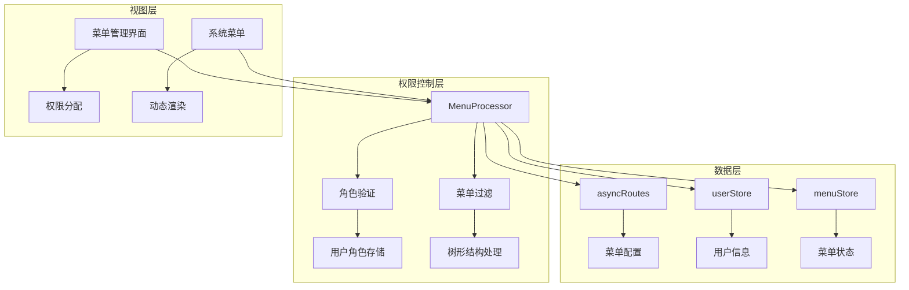
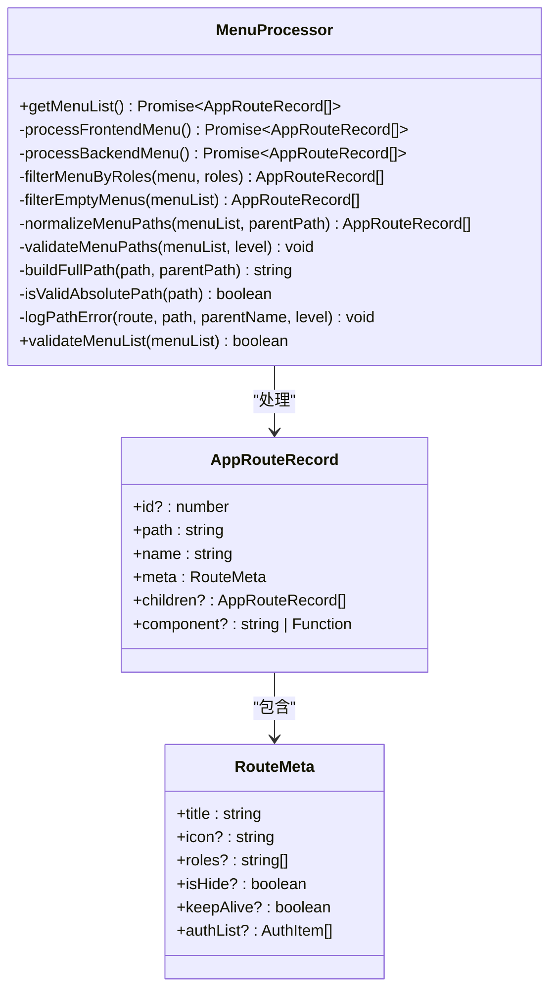
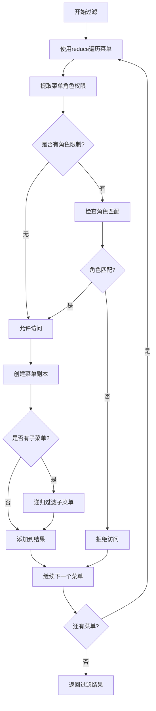
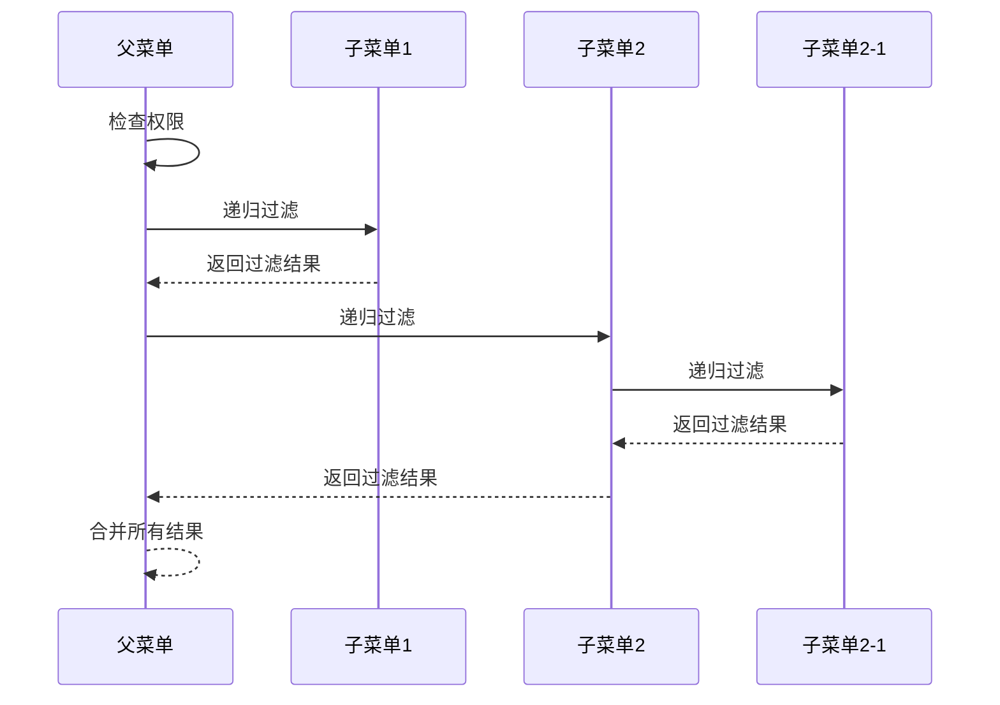
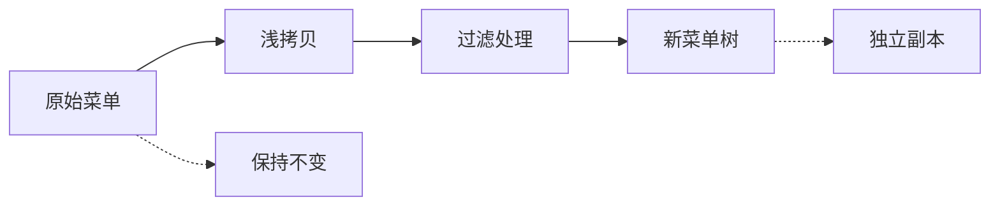
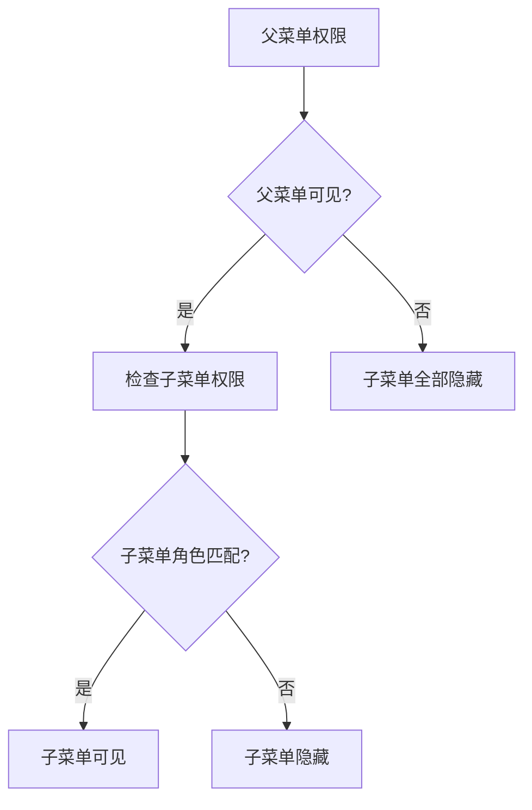
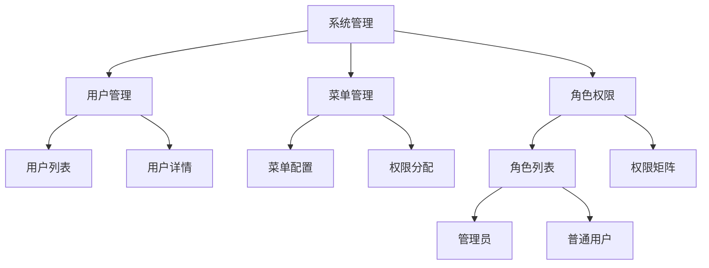
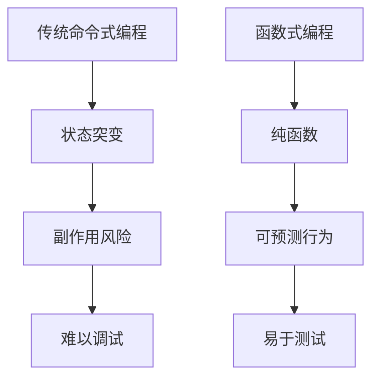
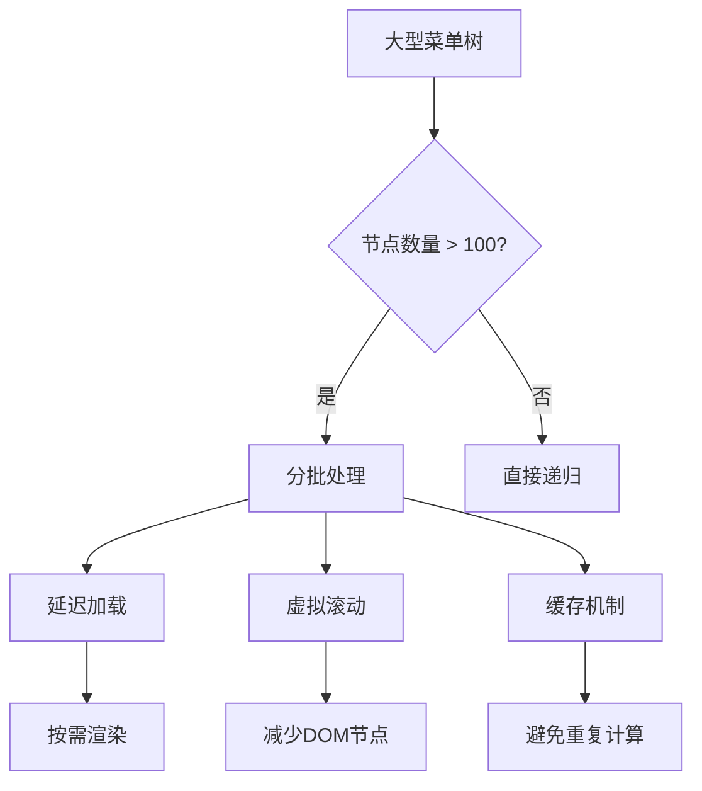

# 菜单递归过滤机制

<cite>
**本文档中引用的文件**
- [MenuProcessor.ts](file://src/router/core/MenuProcessor.ts)
- [index.ts](file://src/types/router/index.ts)
- [user.ts](file://src/store/modules/user.ts)
- [menu.ts](file://src/store/modules/menu.ts)
- [system.ts](file://src/router/modules/system.ts)
- [asyncRoutes.ts](file://src/router/routes/asyncRoutes.ts)
- [role-permission-dialog.vue](file://src/views/system/role/modules/role-permission-dialog.vue)
- [index.vue](file://src/views/system/menu/index.vue)
</cite>

## 目录
1. [概述](#概述)
2. [项目架构](#项目架构)
3. [核心组件分析](#核心组件分析)
4. [filterMenuByRoles方法详解](#filtermenubyroles方法详解)
5. [树形结构遍历技术](#树形结构遍历技术)
6. [浅拷贝与不可变性](#浅拷贝与不可变性)
7. [角色权限验证机制](#角色权限验证机制)
8. [三级菜单过滤示例](#三级菜单过滤示例)
9. [函数式编程优势](#函数式编程优势)
10. [性能优化策略](#性能优化策略)
11. [故障排除指南](#故障排除指南)
12. [总结](#总结)

## 概述

菜单递归过滤机制是Art Design Pro系统中权限控制的核心组件，负责根据用户角色动态过滤和生成菜单树。该机制通过递归遍历树形结构，结合函数式编程范式，实现了高效、可维护的菜单权限控制。

系统采用Vue 3 + TypeScript架构，支持前后端分离的权限控制模式，能够处理复杂的嵌套菜单结构，并确保在权限变更时的实时响应。

## 项目架构



**图表来源**
- [MenuProcessor.ts](file://src/router/core/MenuProcessor.ts#L17-L242)
- [user.ts](file://src/store/modules/user.ts#L50-L228)
- [menu.ts](file://src/store/modules/menu.ts#L41-L108)

**章节来源**
- [MenuProcessor.ts](file://src/router/core/MenuProcessor.ts#L1-L242)
- [index.ts](file://src/types/router/index.ts#L1-L81)

## 核心组件分析

### MenuProcessor类设计

MenuProcessor类是菜单递归过滤机制的核心控制器，负责整个菜单权限处理流程：



**图表来源**
- [MenuProcessor.ts](file://src/router/core/MenuProcessor.ts#L17-L242)
- [index.ts](file://src/types/router/index.ts#L74-L81)

### 数据结构定义

系统使用强类型定义确保菜单数据的一致性和安全性：

| 字段名 | 类型 | 描述 | 必填 |
|--------|------|------|------|
| id | number? | 菜单唯一标识符 | 否 |
| path | string | 路由路径 | 是 |
| name | string | 菜单名称 | 是 |
| meta | RouteMeta | 菜单元数据 | 是 |
| children | AppRouteRecord[]? | 子菜单列表 | 否 |
| component | string \| Function? | 组件路径或工厂函数 | 否 |

**章节来源**
- [index.ts](file://src/types/router/index.ts#L29-L81)

## filterMenuByRoles方法详解

### 方法签名与参数

```typescript
private filterMenuByRoles(menu: AppRouteRecord[], roles: string[]): AppRouteRecord[]
```

该方法接收两个参数：
- `menu`: 待过滤的菜单数组
- `roles`: 用户拥有的角色列表

### 核心实现逻辑



**图表来源**
- [MenuProcessor.ts](file://src/router/core/MenuProcessor.ts#L67-L81)

### 关键实现细节

1. **reduce函数的应用**：使用`reduce`替代传统的`for`循环，保持函数式编程风格
2. **角色验证逻辑**：通过`some`方法检查用户角色是否匹配菜单要求
3. **递归调用机制**：对每个菜单项的子菜单进行递归过滤
4. **累加器模式**：使用累积器`acc`收集符合条件的菜单项

**章节来源**
- [MenuProcessor.ts](file://src/router/core/MenuProcessor.ts#L67-L81)

## 树形结构遍历技术

### 递归算法原理

菜单递归过滤基于深度优先搜索（DFS）算法，按层级顺序处理树形结构：



**图表来源**
- [MenuProcessor.ts](file://src/router/core/MenuProcessor.ts#L74-L76)

### 遍历策略对比

| 遍历方式 | 时间复杂度 | 空间复杂度 | 适用场景 |
|----------|------------|------------|----------|
| 递归遍历 | O(n) | O(h) | 树形结构，层级较深 |
| 迭代遍历 | O(n) | O(w) | 广度优先，层级较浅 |
| 函数式遍历 | O(n) | O(n) | 需要保持不可变性 |

其中n为节点总数，h为树的高度，w为最大宽度。

**章节来源**
- [MenuProcessor.ts](file://src/router/core/MenuProcessor.ts#L67-L81)

## 浅拷贝与不可变性

### 浅拷贝操作的重要性

```typescript
const filteredItem = { ...item }
```

这行代码的关键作用：

1. **避免原地修改**：创建新的对象实例，不改变原始菜单配置
2. **保持数据完整性**：确保其他模块仍能访问未过滤的原始菜单
3. **支持撤销功能**：为可能的权限调整提供原始数据备份

### 不可变性保证



**图表来源**
- [MenuProcessor.ts](file://src/router/core/MenuProcessor.ts#L73-L73)

### 深层复制考虑

对于包含深层嵌套的菜单结构，系统采用以下策略：
- **浅拷贝children属性**：只复制引用，避免不必要的内存开销
- **递归处理子元素**：在需要时才进行深层复制
- **条件性复制**：仅在确实需要修改时才创建新对象

**章节来源**
- [MenuProcessor.ts](file://src/router/core/MenuProcessor.ts#L73-L78)

## 角色权限验证机制

### 权限验证算法

```typescript
const hasPermission = !itemRoles || itemRoles.some((role) => roles?.includes(role))
```

该表达式的逻辑含义：
1. **无角色限制**：如果菜单没有指定角色要求，则默认允许访问
2. **角色匹配**：检查用户角色列表中是否存在菜单所需的角色
3. **短路求值**：利用JavaScript的短路特性提高性能

### 权限继承规则



**图表来源**
- [MenuProcessor.ts](file://src/router/core/MenuProcessor.ts#L70-L70)

### 权限配置示例

| 菜单路径 | 角色要求 | 可见性 | 说明 |
|----------|----------|--------|------|
| /dashboard | admin,user | 显示 | 通用仪表板 |
| /admin/users | admin | 显示 | 管理员专用 |
| /system/settings | admin,manager | 显示 | 系统设置 |
| /system/logs | admin | 显示 | 日志查看 |

**章节来源**
- [system.ts](file://src/router/modules/system.ts#L58-L61)

## 三级菜单过滤示例

### 示例菜单结构

假设系统中有以下三级菜单结构：



**图表来源**
- [system.ts](file://src/router/modules/system.ts#L63-L149)

### 过滤过程演示

当用户角色为`['user']`时的过滤过程：

1. **第一级过滤**：
   - 系统管理：包含admin角色，用户无权限 → 隐藏
   - 其他一级菜单：无角色限制或包含user角色 → 显示

2. **第二级过滤**：
   - 用户管理：包含admin角色 → 隐藏
   - 菜单管理：包含admin角色 → 隐藏
   - 角色权限：包含admin角色 → 隐藏

3. **第三级过滤**：
   - 所有子菜单因父级隐藏而被完全过滤

最终结果：用户只能看到无角色限制的一级菜单。

**章节来源**
- [MenuProcessor.ts](file://src/router/core/MenuProcessor.ts#L67-L81)

## 函数式编程优势

### 不可变性保证

函数式编程范式带来的主要优势：



### 链式操作特性

系统支持多种函数式操作的组合：

| 操作类型 | 实现方式 | 性能影响 |
|----------|----------|----------|
| 过滤 | `filter()` | O(n) |
| 映射 | `map()` | O(n) |
| 归约 | `reduce()` | O(n) |
| 查找 | `find()` | O(n) |

### 代码可读性提升

函数式编程使代码更加直观：

```typescript
// 函数式写法
return menu.reduce((acc, item) => {
  if (hasPermission(item, roles)) {
    const filteredItem = { ...item }
    if (filteredItem.children?.length) {
      filteredItem.children = this.filterMenuByRoles(filteredItem.children, roles)
    }
    acc.push(filteredItem)
  }
  return acc
}, [])
```

**章节来源**
- [MenuProcessor.ts](file://src/router/core/MenuProcessor.ts#L67-L81)

## 性能优化策略

### 避免重复角色检查

```typescript
// 优化前：每次递归都检查用户角色
const hasPermission = itemRoles.some((role) => roles.includes(role))

// 优化后：提前获取用户角色集合
const userRoleSet = new Set(roles)
const hasPermission = !itemRoles || itemRoles.some((role) => userRoleSet.has(role))
```

### 大型菜单树优化

针对大型菜单树的性能优化策略：



### 内存使用优化

| 优化技术 | 实现方式 | 效果 |
|----------|----------|------|
| 对象池 | 复用菜单对象 | 减少GC压力 |
| 弱引用 | 缓存弱引用 | 自动垃圾回收 |
| 分片处理 | 分批渲染 | 降低峰值内存 |
| 增量更新 | 只更新变化部分 | 减少重绘开销 |

### 性能监控指标

```typescript
interface PerformanceMetrics {
  filterTime: number    // 过滤耗时
  memoryUsage: number   // 内存占用
  nodeCount: number     // 节点数量
  cacheHitRate: number  // 缓存命中率
}
```

**章节来源**
- [MenuProcessor.ts](file://src/router/core/MenuProcessor.ts#L67-L81)

## 故障排除指南

### 常见问题诊断

| 问题症状 | 可能原因 | 解决方案 |
|----------|----------|----------|
| 菜单权限不生效 | 角色配置错误 | 检查用户角色和菜单权限匹配 |
| 子菜单异常显示 | 父菜单权限缺失 | 确保父菜单权限正确设置 |
| 性能严重下降 | 菜单树过大 | 实施分批处理和缓存策略 |
| 内存泄漏 | 对象引用未释放 | 检查事件监听器和定时器清理 |

### 调试技巧

1. **启用详细日志**：
```typescript
console.log('过滤前菜单数量:', menu.length)
console.log('过滤后菜单数量:', result.length)
```

2. **性能分析**：
```typescript
const startTime = performance.now()
const result = this.filterMenuByRoles(menu, roles)
const endTime = performance.now()
console.log(`菜单过滤耗时: ${endTime - startTime}ms`)
```

3. **状态检查**：
```typescript
const checkMenuIntegrity = (menu: AppRouteRecord[]) => {
  return menu.every(item => {
    return item.path && typeof item.path === 'string'
  })
}
```

### 最佳实践建议

1. **角色命名规范**：使用清晰、一致的角色命名
2. **权限粒度控制**：合理划分菜单权限级别
3. **测试覆盖**：编写全面的单元测试
4. **监控告警**：建立性能监控机制

**章节来源**
- [MenuProcessor.ts](file://src/router/core/MenuProcessor.ts#L158-L212)

## 总结

菜单递归过滤机制是Art Design Pro系统权限控制的核心组件，通过精心设计的算法和架构，实现了高效、可维护的菜单权限管理。该机制的主要特点包括：

### 技术亮点

1. **递归算法**：优雅地处理树形结构的层次关系
2. **函数式编程**：保持代码的纯净性和可测试性
3. **不可变性**：确保数据安全和状态一致性
4. **性能优化**：通过多种策略应对大规模菜单树

### 应用价值

- **安全性**：精确控制用户访问权限
- **灵活性**：支持复杂的权限组合场景
- **可维护性**：清晰的代码结构便于后续开发
- **扩展性**：良好的架构支持功能扩展

### 发展方向

随着系统规模的增长，可以考虑以下优化方向：
- **智能缓存**：基于用户行为的权限缓存策略
- **异步处理**：大型菜单树的异步渲染机制
- **可视化配置**：图形化的权限配置界面
- **审计追踪**：完整的权限变更记录

这套菜单递归过滤机制为现代Web应用的权限控制提供了优秀的解决方案，值得在类似项目中借鉴和应用。