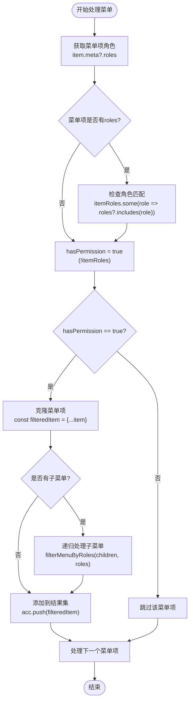
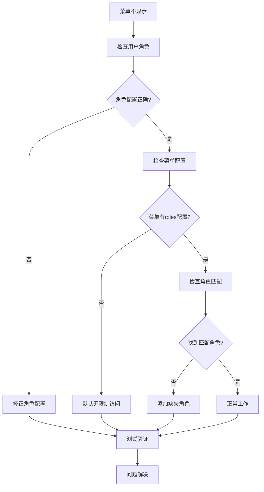

# 角色权限匹配逻辑

<cite>
**本文档引用的文件**
- [MenuProcessor.ts](file://src/router/core/MenuProcessor.ts)
- [index.ts](file://src/types/router/index.ts)
- [user.ts](file://src/store/modules/user.ts)
- [auth.ts](file://src/directives/core/auth.ts)
- [useAuth.ts](file://src/hooks/core/useAuth.ts)
- [dashboard.ts](file://src/router/modules/dashboard.ts)
- [system.ts](file://src/router/modules/system.ts)
- [switch-role/index.vue](file://src/views/examples/permission/switch-role/index.vue)
- [page-visibility/index.vue](file://src/views/examples/permission/page-visibility/index.vue)
</cite>

## 目录
1. [简介](#简介)
2. [系统架构概览](#系统架构概览)
3. [核心组件分析](#核心组件分析)
4. [角色权限匹配算法详解](#角色权限匹配算法详解)
5. [权限配置模式](#权限配置模式)
6. [实际应用场景](#实际应用场景)
7. [最佳实践与建议](#最佳实践与建议)
8. [故障排除指南](#故障排除指南)
9. [总结](#总结)

## 简介

Art Design Pro框架采用了一套完善的角色权限控制系统，通过MenuProcessor类中的filterMenuByRoles方法实现了基于角色的访问控制（RBAC）。该系统支持多种权限配置模式，包括不限制访问、单角色访问和多角色访问，为不同场景提供了灵活的权限管理方案。

## 系统架构概览


**图表来源**
- [MenuProcessor.ts](file://src/router/core/MenuProcessor.ts#L17-L240)
- [user.ts](file://src/store/modules/user.ts#L50-L236)

## 核心组件分析

### MenuProcessor类

MenuProcessor是权限控制系统的核心处理器，负责菜单数据的获取、过滤和处理。


**图表来源**
- [MenuProcessor.ts](file://src/router/core/MenuProcessor.ts#L17-L240)
- [index.ts](file://src/types/router/index.ts#L29-L80)

**章节来源**
- [MenuProcessor.ts](file://src/router/core/MenuProcessor.ts#L17-L240)
- [index.ts](file://src/types/router/index.ts#L29-L80)

### 用户状态管理

用户状态管理模块负责存储和管理用户信息，包括角色数组。


**图表来源**
- [user.ts](file://src/store/modules/user.ts#L50-L236)

**章节来源**
- [user.ts](file://src/store/modules/user.ts#L50-L236)

## 角色权限匹配算法详解

### filterMenuByRoles方法核心逻辑

filterMenuByRoles方法是角色权限匹配的核心实现，其算法逻辑如下：



**图表来源**
- [MenuProcessor.ts](file://src/router/core/MenuProcessor.ts#L66-L81)

### 关键匹配逻辑分析

#### 1. !itemRoles条件判断（默认访问权限）

当菜单项未定义roles字段时，系统自动赋予访问权限：

```typescript
// 条件判断：!itemRoles || itemRoles.some(...)
const hasPermission = !itemRoles || itemRoles.some((role) => roles?.includes(role))
```

**逻辑解释：**
- `!itemRoles`：如果菜单项没有定义roles属性，则视为无限制访问
- `itemRoles.some(...)`：如果有roles定义，则检查用户角色是否包含在内
- `roles?.includes(role)`：安全访问用户角色数组，防止undefined错误

#### 2. Array.some方法的角色包含性检查

```typescript
itemRoles.some((role) => roles?.includes(role))
```

**实现机制：**
- `Array.some()`：只要有一个角色匹配就返回true
- `roles?.includes(role)`：安全检查用户角色数组中是否包含菜单项要求的角色
- 支持多角色配置，只要用户拥有其中一个角色即可访问

#### 3. 布尔表达式安全访问机制

```typescript
roles?.includes(role)
```

**安全特性：**
- `?.` 可选链操作符：防止roles为undefined时抛出错误
- 类型安全：确保只有在roles存在时才执行includes方法
- 性能优化：避免不必要的函数调用

**章节来源**
- [MenuProcessor.ts](file://src/router/core/MenuProcessor.ts#L66-L81)

## 权限配置模式

### 1. 不限制访问（无roles）

**配置示例：**
```typescript
{
  path: 'public-page',
  name: 'PublicPage',
  component: '/examples/public',
  meta: {
    title: '公共页面',
    icon: 'ri:eye-line'
    // 未定义roles字段，表示无访问限制
  }
}
```

**特点：**
- 任何用户都可以访问
- 适用于公开页面、帮助文档等
- 默认行为，无需额外配置

### 2. 单角色访问（['admin']）

**配置示例：**
```typescript
{
  path: 'admin-dashboard',
  name: 'AdminDashboard',
  component: '/admin/dashboard',
  meta: {
    title: '管理员面板',
    icon: 'ri:shield-line',
    roles: ['R_ADMIN']  // 仅管理员可访问
  }
}
```

**特点：**
- 精确控制单一角色访问
- 适用于特定功能模块
- 实现简单的角色分离

### 3. 多角色访问（['admin', 'editor']）

**配置示例：**
```typescript
{
  path: 'content-management',
  name: 'ContentManagement',
  component: '/content/manage',
  meta: {
    title: '内容管理',
    icon: 'ri:edit-line',
    roles: ['R_ADMIN', 'R_EDITOR']  // 管理员和编辑均可访问
  }
}
```

**特点：**
- 支持多个角色同时访问
- 灵活的角色组合配置
- 适用于协作型功能模块

### 权限配置对比表

| 配置方式 | roles字段 | 访问规则 | 适用场景 |
|---------|----------|---------|---------|
| 无配置 | undefined | 无限制访问 | 公开页面、帮助文档 |
| 单角色 | ['admin'] | 必须拥有指定角色 | 特定功能模块 |
| 多角色 | ['admin', 'editor'] | 拥有任何一个角色即可 | 协作型功能 |

**章节来源**
- [dashboard.ts](file://src/router/modules/dashboard.ts#L8-L10)
- [system.ts](file://src/router/modules/system.ts#L8-L10)
- [system.ts](file://src/router/modules/system.ts#L17-L21)

## 实际应用场景

### 场景一：系统管理模块权限控制


**图表来源**
- [MenuProcessor.ts](file://src/router/core/MenuProcessor.ts#L42-L53)
- [user.ts](file://src/store/modules/user.ts#L62-L63)

### 场景二：角色切换演示

系统提供了角色切换功能，展示了不同角色的权限差异：

**超级管理员权限：**
- 可访问所有系统功能
- 拥有最高权限级别
- 可以管理其他角色

**管理员权限：**
- 可访问大部分管理功能
- 不能管理角色配置
- 可以管理用户和菜单

**普通用户权限：**
- 仅可访问基础功能
- 无管理权限
- 受严格的功能限制

**章节来源**
- [switch-role/index.vue](file://src/views/examples/permission/switch-role/index.vue#L91-L137)

### 场景三：页面级权限控制

```typescript
// 页面级权限控制示例
{
  path: 'page-visibility',
  name: 'PermissionPageVisibility',
  component: '/examples/permission/page-visibility',
  meta: {
    title: '页面级权限控制',
    roles: ['R_SUPER'], // 仅超级管理员可访问
    keepAlive: true
  }
}
```

**章节来源**
- [page-visibility/index.vue](file://src/views/examples/permission/page-visibility/index.vue#L39-L70)

## 最佳实践与建议

### 1. 角色命名规范

**推荐格式：**
- 使用前缀区分角色类型：`R_` 表示系统角色
- 使用语义化名称：`ADMIN`、`EDITOR`、`USER`
- 避免过于宽泛的名称：`MANAGER` vs `SYSTEM_MANAGER`

**示例：**
```typescript
// 推荐
roles: ['R_SUPER', 'R_ADMIN', 'R_USER']

// 避免
roles: ['manager', 'user', 'admin']
```

### 2. 权限配置策略

**最小权限原则：**
- 只授予完成任务所需的最小权限
- 避免过度授权
- 定期审查权限配置

**分层权限设计：**
```typescript
// 分层权限配置
const PERMISSION_LEVELS = {
  VIEW_ONLY: ['R_GUEST'],
  BASIC_ACCESS: ['R_USER'],
  MANAGE_ACCESS: ['R_ADMIN', 'R_EDITOR'],
  FULL_CONTROL: ['R_SUPER']
}
```

### 3. 性能优化建议

**路由懒加载：**
```typescript
// 推荐：按需加载组件
component: () => import('/system/user')

// 避免：一次性加载所有组件
component: '/system/user'
```

**权限缓存：**
```typescript
// 缓存用户权限信息
const cachedPermissions = new Map()

function getCachedPermissions(userId: string) {
  if (!cachedPermissions.has(userId)) {
    // 计算并缓存权限
    cachedPermissions.set(userId, calculatePermissions())
  }
  return cachedPermissions.get(userId)
}
```

### 4. 安全考虑

**输入验证：**
```typescript
// 验证角色数组格式
function validateRoles(roles: string[]): boolean {
  return Array.isArray(roles) && 
         roles.every(role => typeof role === 'string' && role.trim().length > 0)
}
```

**权限边界检查：**
```typescript
// 检查权限提升
function checkPermissionEscalation(currentRoles: string[], targetRoles: string[]): boolean {
  return targetRoles.every(role => currentRoles.includes(role))
}
```

## 故障排除指南

### 常见问题及解决方案

#### 1. 菜单不显示问题

**问题现象：**
- 用户登录后看不到某些菜单项
- 权限配置正确但菜单被过滤

**排查步骤：**


**解决方案：**
1. 检查用户角色是否正确设置
2. 验证菜单项的roles配置
3. 确认角色名称大小写一致
4. 测试角色匹配逻辑

#### 2. 权限验证失败

**问题现象：**
- 用户无法访问有权限的页面
- 权限检查总是返回false

**调试方法：**
```typescript
// 添加调试日志
console.log('用户角色:', userRoles)
console.log('菜单角色:', menuRoles)
console.log('角色匹配结果:', menuRoles.some(role => userRoles.includes(role)))
```

#### 3. 多角色配置问题

**问题现象：**
- 多角色配置不生效
- 只有第一个角色生效

**解决方案：**
```typescript
// 确保roles数组配置正确
meta: {
  roles: ['R_ADMIN', 'R_EDITOR'] // 注意逗号分隔
}
```

**章节来源**
- [MenuProcessor.ts](file://src/router/core/MenuProcessor.ts#L66-L81)

## 总结

Art Design Pro的角色权限匹配逻辑通过MenuProcessor类的filterMenuByRoles方法实现了高效、灵活的权限控制。该系统具有以下特点：

### 核心优势

1. **简洁高效的算法**：使用Array.some方法实现角色匹配，时间复杂度O(n)
2. **安全可靠的访问机制**：通过可选链操作符防止undefined错误
3. **灵活的配置模式**：支持无限制、单角色和多角色三种配置方式
4. **递归处理能力**：能够处理嵌套菜单结构的权限控制
5. **类型安全保障**：完整的TypeScript类型定义

### 技术亮点

- **默认访问权限**：未定义roles的菜单项自动获得访问权限
- **安全的角色匹配**：roles?.includes(role)确保类型安全
- **递归权限过滤**：支持复杂的嵌套菜单结构
- **响应式权限更新**：配合Vue响应式系统实时更新权限状态

### 应用价值

该权限系统为开发者提供了：
- **易于使用的API**：简洁的配置方式和清晰的权限逻辑
- **强大的扩展性**：支持各种复杂的权限场景
- **良好的性能表现**：高效的算法确保系统响应速度
- **完善的错误处理**：robust的错误处理机制

通过深入理解和正确使用这套角色权限匹配逻辑，开发者可以构建出安全、可靠、易维护的权限控制系统，满足各种复杂的应用场景需求。