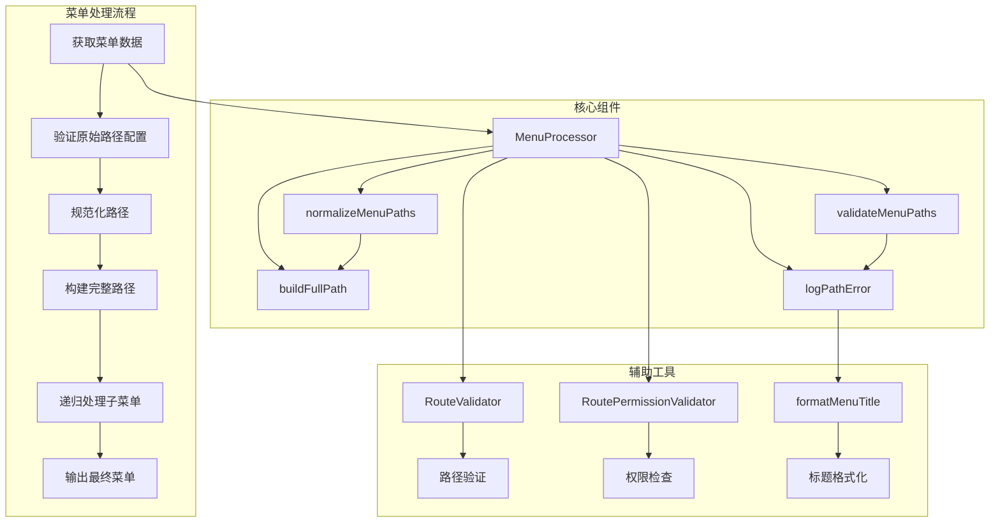
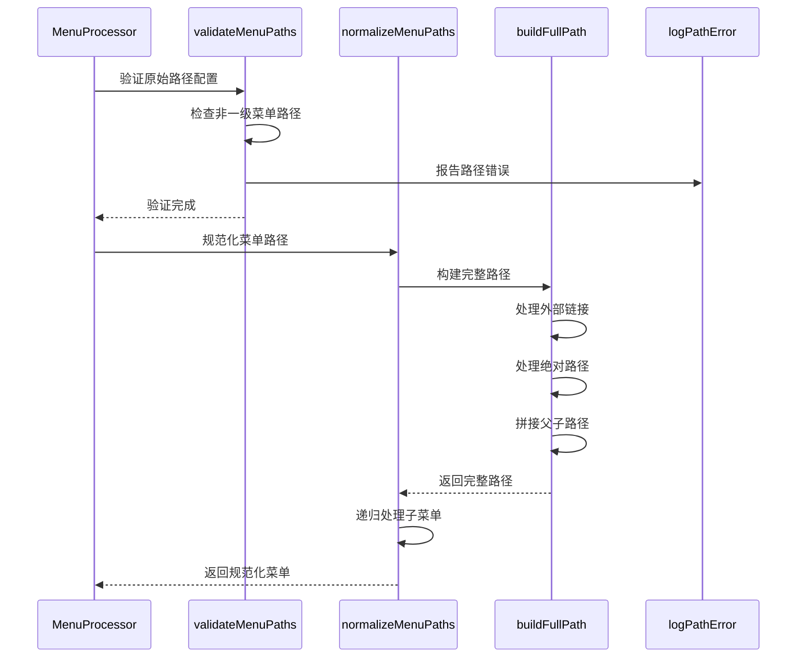
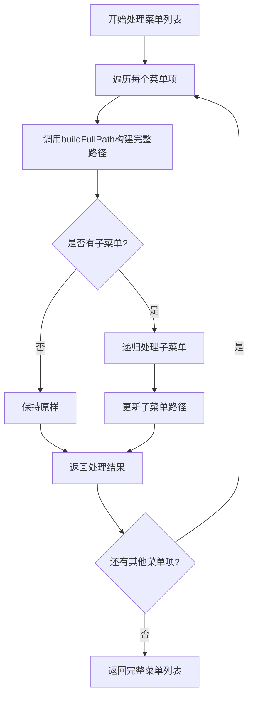
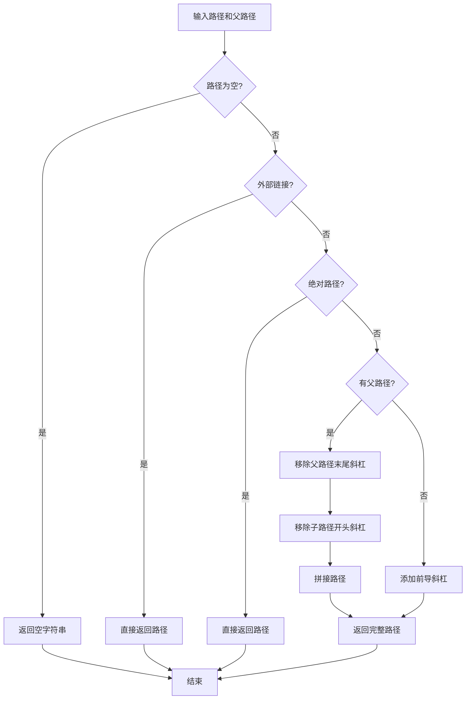
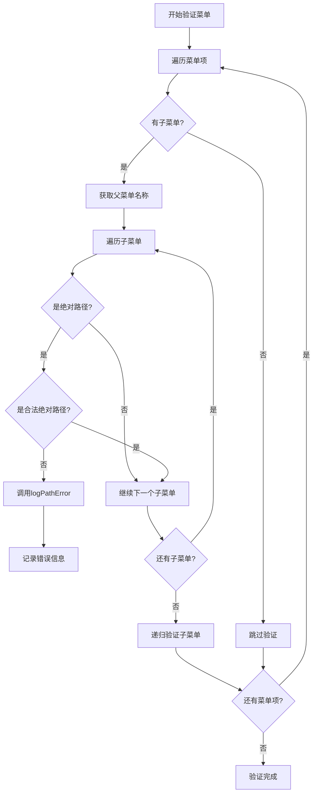
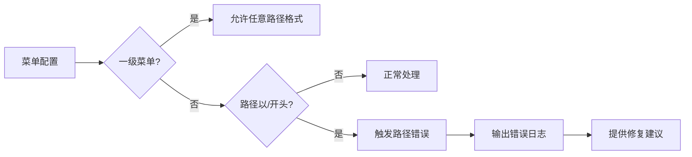
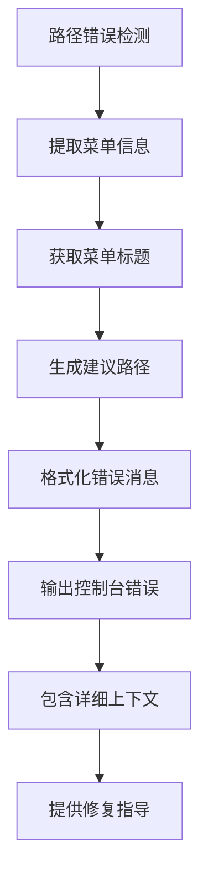

# 菜单路径规范化

<cite>
**本文档引用的文件**
- [MenuProcessor.ts](file://src/router/core/MenuProcessor.ts)
- [route.ts](file://src/utils/navigation/route.ts)
- [router.ts](file://src/utils/router.ts)
- [RouteValidator.ts](file://src/router/core/RouteValidator.ts)
- [RoutePermissionValidator.ts](file://src/router/core/RoutePermissionValidator.ts)
- [dashboard.ts](file://src/router/modules/dashboard.ts)
- [system.ts](file://src/router/modules/system.ts)
- [staticRoutes.ts](file://src/router/routes/staticRoutes.ts)
- [asyncRoutes.ts](file://src/router/routes/asyncRoutes.ts)
- [index.ts](file://src/router/modules/index.ts)
- [index.ts](file://src/types/router/index.ts)
</cite>

## 目录
1. [概述](#概述)
2. [核心架构](#核心架构)
3. [路径规范化流程](#路径规范化流程)
4. [核心方法详解](#核心方法详解)
5. [路径验证机制](#路径验证机制)
6. [错误处理与日志](#错误处理与日志)
7. [实际应用案例](#实际应用案例)
8. [性能考虑](#性能考虑)
9. [最佳实践](#最佳实践)
10. [总结](#总结)

## 概述

菜单路径规范化是Art Design Pro框架中的核心功能之一，负责将相对路径转换为完整路径，确保菜单跳转的正确性和一致性。该系统通过三个主要方法协同工作：`normalizeMenuPaths`、`validateMenuPaths`和`buildFullPath`，实现了完整的路径处理链路。

路径规范化的核心价值在于：
- **路径一致性**：确保所有菜单路径都采用统一的格式
- **跳转准确性**：避免因路径格式错误导致的导航失败
- **开发便利性**：简化开发者配置菜单的工作量
- **错误预防**：提前检测并报告路径配置错误

## 核心架构



**图表来源**
- [MenuProcessor.ts](file://src/router/core/MenuProcessor.ts#L22-L36)
- [RouteValidator.ts](file://src/router/core/RouteValidator.ts#L26-L43)
- [RoutePermissionValidator.ts](file://src/router/core/RoutePermissionValidator.ts#L28-L46)

## 路径规范化流程

路径规范化遵循严格的处理顺序，确保每个步骤都能正确执行：



**图表来源**
- [MenuProcessor.ts](file://src/router/core/MenuProcessor.ts#L158-L178)
- [MenuProcessor.ts](file://src/router/core/MenuProcessor.ts#L132-L147)
- [MenuProcessor.ts](file://src/router/core/MenuProcessor.ts#L217-L240)

**章节来源**
- [MenuProcessor.ts](file://src/router/core/MenuProcessor.ts#L22-L36)

## 核心方法详解

### normalizeMenuPaths方法

`normalizeMenuPaths`是路径规范化的核心方法，负责将相对路径转换为完整路径：



**图表来源**
- [MenuProcessor.ts](file://src/router/core/MenuProcessor.ts#L132-L147)

该方法的关键特性：
- **递归处理**：能够处理多层级的嵌套菜单结构
- **路径构建**：通过`buildFullPath`方法确保路径完整性
- **状态保持**：维护父路径信息以便正确拼接

### buildFullPath方法

`buildFullPath`是路径拼接的核心算法，处理各种路径格式的特殊情况：



**图表来源**
- [MenuProcessor.ts](file://src/router/core/MenuProcessor.ts#L217-L240)

路径拼接规则详解：

| 输入条件 | 处理逻辑 | 输出示例 |
|---------|---------|---------|
| 外部链接 | 直接返回，不做修改 | `https://example.com` |
| 绝对路径 | 直接返回，不做修改 | `/absolute/path` |
| 相对路径 + 父路径 | 拼接并去除多余斜杠 | `/parent/child` |
| 相对路径无父路径 | 添加前导斜杠 | `/child` |

### validateMenuPaths方法

路径验证机制确保非一级菜单不会错误地使用绝对路径：



**图表来源**
- [MenuProcessor.ts](file://src/router/core/MenuProcessor.ts#L158-L178)

**章节来源**
- [MenuProcessor.ts](file://src/router/core/MenuProcessor.ts#L132-L240)

## 路径验证机制

### 合法绝对路径检测

`isValidAbsolutePath`方法识别三种类型的合法绝对路径：

| 路径类型 | 检测条件 | 示例 |
|---------|---------|------|
| HTTP链接 | 以`http://`开头 | `http://example.com` |
| HTTPS链接 | 以`https://`开头 | `https://secure.example.com` |
| iframe路径 | 以`/outside/iframe/`开头 | `/outside/iframe/example` |

### 非一级菜单路径检测

系统严格区分一级菜单和非一级菜单的路径配置：



**图表来源**
- [MenuProcessor.ts](file://src/router/core/MenuProcessor.ts#L167-L173)

**章节来源**
- [MenuProcessor.ts](file://src/router/core/MenuProcessor.ts#L184-L189)
- [MenuProcessor.ts](file://src/router/core/MenuProcessor.ts#L158-L178)

## 错误处理与日志

### logPathError方法

当检测到路径配置错误时，`logPathError`提供详细的错误信息和修复建议：



**图表来源**
- [MenuProcessor.ts](file://src/router/core/MenuProcessor.ts#L195-L211)

### 错误信息格式

错误日志采用结构化的格式，便于开发者理解和修复：

```
[路由配置错误] 菜单 "系统管理" (name: System, path: /system/menu) 配置错误
  位置: 系统 > 菜单管理
  问题: 2级菜单的 path 不能以 / 开头
  当前配置: path: '/system/menu'
  应该改为: path: 'menu'
```

### 修复建议机制

系统自动计算合理的修复方案：

| 错误路径 | 建议路径 | 修复原理 |
|---------|---------|---------|
| `/system/menu` | `menu` | 移除父路径前缀 |
| `/dashboard/console` | `console` | 保留最后一段 |
| `/outside/iframe/example` | `iframe/example` | 保持iframe结构 |

**章节来源**
- [MenuProcessor.ts](file://src/router/core/MenuProcessor.ts#L195-L211)

## 实际应用案例

### 案例1：仪表板菜单配置

基于`dashboard.ts`模块的实际配置：

```typescript
// 原始配置（相对路径）
const dashboardRoutes: AppRouteRecord = {
  path: '/dashboard',
  children: [
    { path: 'console', name: 'Console' },
    { path: 'analysis', name: 'Analysis' },
    { path: 'ecommerce', name: 'Ecommerce' }
  ]
}

// 规范化后（完整路径）
const normalizedDashboard = [
  { path: '/dashboard', children: [
    { path: '/dashboard/console', name: 'Console' },
    { path: '/dashboard/analysis', name: 'Analysis' },
    { path: '/dashboard/ecommerce', name: 'Ecommerce' }
  ]}
]
```

### 案例2：系统管理菜单配置

基于`system.ts`模块的复杂嵌套配置：

```typescript
// 嵌套菜单结构
const systemRoutes: AppRouteRecord = {
  path: '/system',
  children: [
    { path: 'user', name: 'User' },
    { 
      path: 'nested', 
      children: [
        { path: 'menu1', name: 'NestedMenu1' },
        { 
          path: 'menu2', 
          children: [
            { path: 'menu2-1', name: 'NestedMenu2-1' }
          ] 
        }
      ] 
    }
  ]
}

// 生成的完整路径树
[
  { path: '/system', children: [
    { path: '/system/user', name: 'User' },
    { path: '/system/nested', children: [
      { path: '/system/nested/menu1', name: 'NestedMenu1' },
      { path: '/system/nested/menu2', children: [
        { path: '/system/nested/menu2/menu2-1', name: 'NestedMenu2-1' }
      ]}
    ]}
  ]}
]
```

### 案例3：路径配置错误示例

常见的路径配置错误及修复方案：

```typescript
// ❌ 错误配置：非一级菜单使用绝对路径
const badConfig: AppRouteRecord = {
  path: '/system',
  children: [
    { path: '/system/user', name: 'User' } // 错误：不应该以 / 开头
  ]
}

// ✅ 正确配置：相对路径
const goodConfig: AppRouteRecord = {
  path: '/system',
  children: [
    { path: 'user', name: 'User' } // 正确：相对路径
  ]
}
```

**章节来源**
- [dashboard.ts](file://src/router/modules/dashboard.ts#L3-L46)
- [system.ts](file://src/router/modules/system.ts#L3-L150)

## 性能考虑

### 时间复杂度分析

路径规范化算法的时间复杂度为O(n)，其中n是菜单项的总数：

| 操作 | 时间复杂度 | 说明 |
|-----|-----------|------|
| 单层菜单处理 | O(1) | 固定次数的操作 |
| 多层嵌套处理 | O(n) | 需要遍历所有菜单项 |
| 递归深度 | O(d) | d为最大嵌套深度 |
| 总体复杂度 | O(n×d) | 最坏情况下 |

### 内存使用优化

系统采用以下策略优化内存使用：

- **就地修改**：直接修改原始菜单对象，减少内存分配
- **惰性求值**：只在需要时才进行路径处理
- **缓存机制**：避免重复计算相同路径

### 批处理优化

对于大量菜单数据，系统支持批量处理：


## 最佳实践

### 路径命名规范

1. **使用相对路径**：非一级菜单应使用相对路径
2. **避免重复命名**：确保同一层级内的路径不重复
3. **语义化命名**：路径名应清晰表达功能含义

### 开发建议

1. **及时验证**：在开发阶段启用路径验证功能
2. **单元测试**：为菜单配置编写自动化测试
3. **文档同步**：保持菜单配置与文档的一致性

### 维护策略

1. **定期检查**：定期运行路径验证脚本
2. **版本控制**：将菜单配置纳入版本控制系统
3. **监控告警**：在生产环境中监控路径错误

## 总结

菜单路径规范化系统是Art Design Pro框架的重要组成部分，通过`normalizeMenuPaths`、`validateMenuPaths`和`buildFullPath`三个核心方法，实现了完整的路径处理链路。该系统具有以下特点：

- **完整性**：覆盖从验证到规范化的全流程
- **准确性**：确保路径格式的正确性和一致性  
- **可维护性**：提供详细的错误信息和修复建议
- **性能优化**：采用高效的算法和优化策略

通过合理使用这套路径规范化系统，开发者可以：
- 减少路径配置错误的发生
- 提高菜单导航的可靠性
- 简化开发和维护工作
- 提升用户体验质量

路径规范化不仅是技术实现，更是项目质量保证的重要手段，值得在实际开发中充分重视和应用。