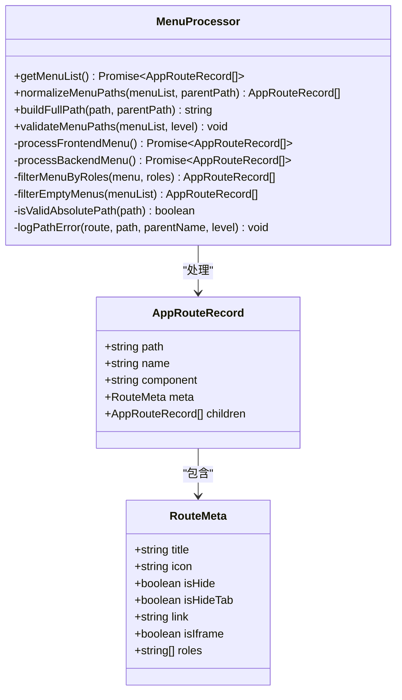
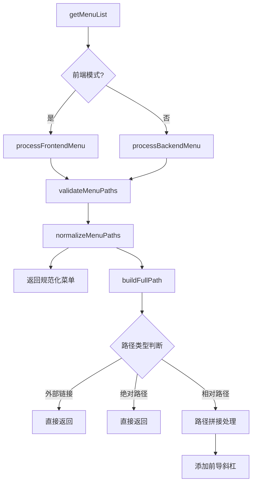
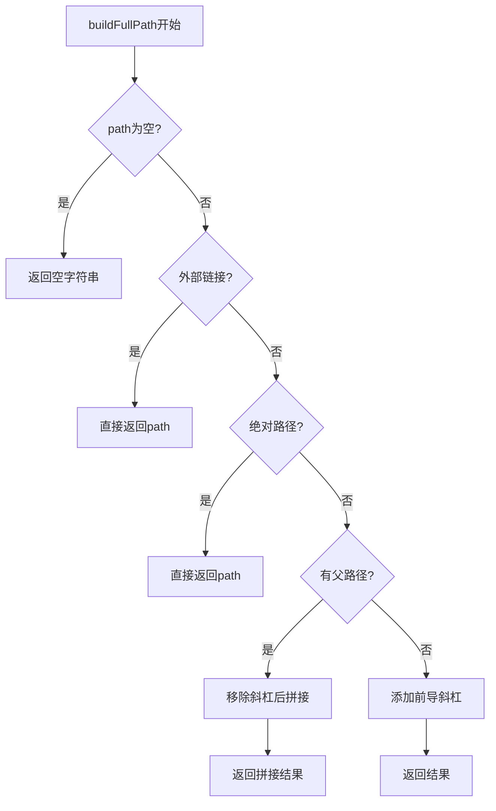
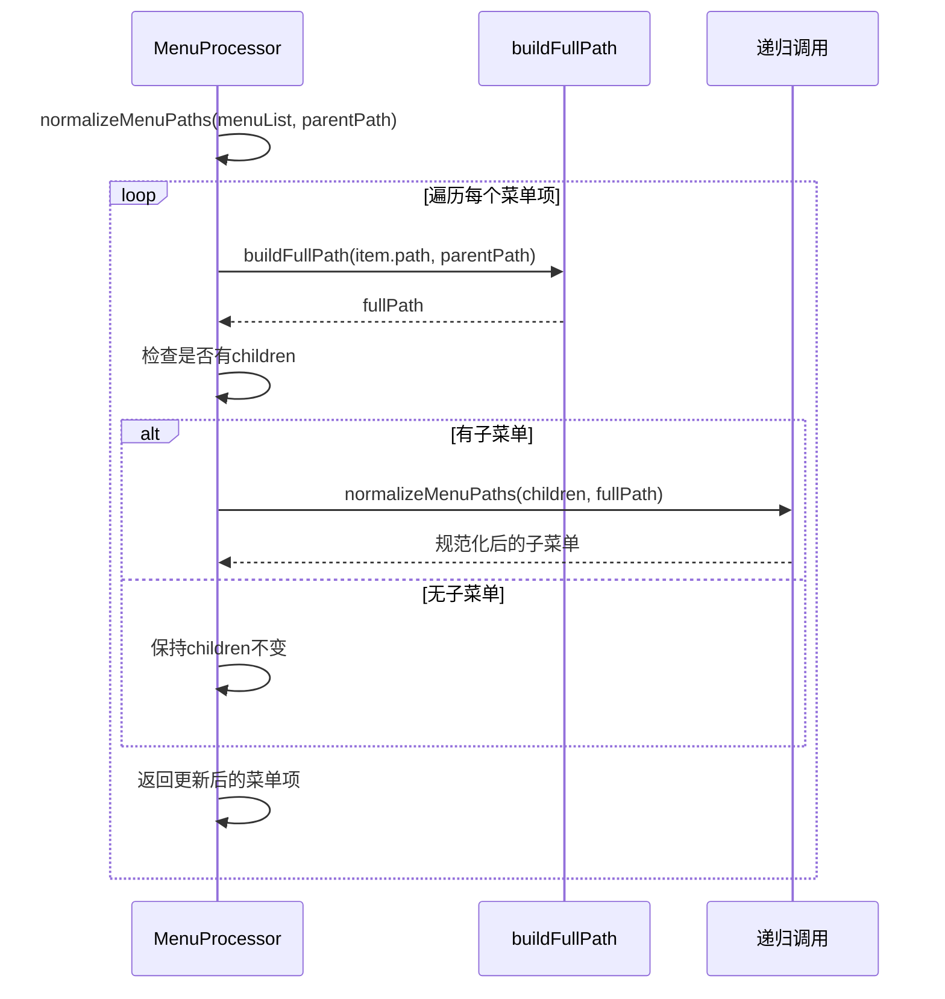
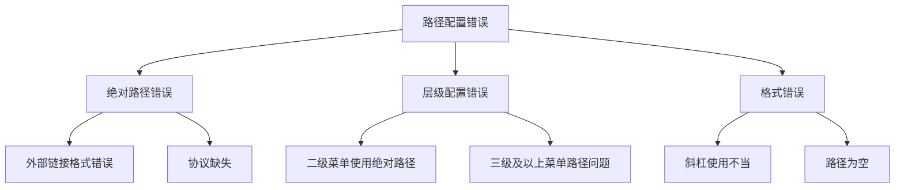

# 路径规范化处理

<cite>
**本文档引用的文件**
- [MenuProcessor.ts](file://src/router/core/MenuProcessor.ts)
- [dashboard.ts](file://src/router/modules/dashboard.ts)
- [system.ts](file://src/router/modules/system.ts)
- [staticRoutes.ts](file://src/router/routes/staticRoutes.ts)
- [asyncRoutes.ts](file://src/router/routes/asyncRoutes.ts)
- [routesAlias.ts](file://src/router/routesAlias.ts)
- [jump.ts](file://src/utils/navigation/jump.ts)
- [menu.ts](file://src/store/modules/menu.ts)
- [index.ts](file://src/router/index.ts)
</cite>

## 目录
1. [概述](#概述)
2. [核心架构](#核心架构)
3. [MenuProcessor类详解](#menuprocessor类详解)
4. [路径规范化机制](#路径规范化机制)
5. [buildFullPath函数深度解析](#buildfullpath函数深度解析)
6. [递归路径处理流程](#递归路径处理流程)
7. [实际应用示例](#实际应用示例)
8. [常见配置错误与修复](#常见配置错误与修复)
9. [性能考虑与优化](#性能考虑与优化)
10. [总结](#总结)

## 概述

路径规范化处理是Art Design Pro框架中路由系统的核心组件之一，负责将菜单项的相对路径转换为完整的、可正确跳转的路径。该机制通过`MenuProcessor`类中的`normalizeMenuPaths`方法实现，确保了动态路由加载和菜单导航中的一致性保障。

路径规范化的主要目标包括：
- **路径一致性**：确保所有菜单项都具有完整的、无歧义的路径
- **导航准确性**：保证用户点击菜单时能够正确跳转到目标页面
- **配置简化**：允许开发者使用相对路径配置菜单，系统自动处理路径拼接
- **错误检测**：识别并报告路径配置中的潜在问题

## 核心架构



**图表来源**
- [MenuProcessor.ts](file://src/router/core/MenuProcessor.ts#L17-L240)
- [index.ts](file://src/types/router/index.ts#L71-L81)

## MenuProcessor类详解

`MenuProcessor`类是路径规范化的核心控制器，提供了完整的菜单处理流水线。该类采用面向对象的设计模式，将复杂的路径处理逻辑封装在单一职责的类中。

### 主要职责

1. **菜单获取与处理**：根据前端模式或后端模式获取菜单数据
2. **路径规范化**：将相对路径转换为完整路径
3. **路径验证**：检测并报告路径配置错误
4. **递归处理**：支持多层级菜单的深度处理

### 核心方法概览



**图表来源**
- [MenuProcessor.ts](file://src/router/core/MenuProcessor.ts#L19-L40)

**章节来源**
- [MenuProcessor.ts](file://src/router/core/MenuProcessor.ts#L17-L240)

## 路径规范化机制

路径规范化是一个递归处理过程，通过`normalizeMenuPaths`方法实现。该方法遍历整个菜单树，为每个菜单项构建完整的路径。

### 处理流程

1. **输入验证**：检查菜单列表的有效性
2. **路径构建**：调用`buildFullPath`方法生成完整路径
3. **递归处理**：对子菜单进行相同处理
4. **结果返回**：返回包含完整路径的新菜单结构

### 关键特性

- **保持原结构**：不改变菜单的层次结构，只修改路径字段
- **类型安全**：确保返回类型与输入类型一致
- **错误容错**：对无效路径进行适当处理

**章节来源**
- [MenuProcessor.ts](file://src/router/core/MenuProcessor.ts#L131-L147)

## buildFullPath函数深度解析

`buildFullPath`函数是路径规范化的核心算法，负责处理各种路径类型的拼接逻辑。

### 函数签名与参数

该函数接受两个参数：
- `path: string`：当前菜单项的路径
- `parentPath: string`：父菜单项的完整路径

### 处理逻辑详解



**图表来源**
- [MenuProcessor.ts](file://src/router/core/MenuProcessor.ts#L216-L239)

### 斜杠处理策略

#### 移除父路径末尾斜杠
```typescript
const cleanParent = parentPath.replace(/\/$/, '')
```
- 使用正则表达式`/\/$/`匹配字符串末尾的斜杠
- 确保父路径末尾不会有多余的斜杠

#### 移除子路径开头斜杠
```typescript
const cleanChild = path.replace(/^\//, '')
```
- 使用正则表达式`/^\//`匹配字符串开头的斜杠
- 防止子路径以斜杠开头导致重复斜杠

#### 拼接逻辑
```typescript
return `${cleanParent}/${cleanChild}`
```
- 使用模板字符串进行路径拼接
- 自动添加一个斜杠分隔符

### 特殊路径处理

#### 根级路径自动添加前导斜杠
当没有父路径时，函数会自动为路径添加前导斜杠：
```typescript
return `/${path}`
```

#### 外部链接直接返回
对于HTTP/HTTPS链接，函数直接返回原路径，不做任何修改。

**章节来源**
- [MenuProcessor.ts](file://src/router/core/MenuProcessor.ts#L216-L239)

## 递归路径处理流程

路径规范化采用递归算法处理多层级菜单结构，确保每一层的路径都能正确拼接。

### 递归算法设计



**图表来源**
- [MenuProcessor.ts](file://src/router/core/MenuProcessor.ts#L131-L147)

### 递归终止条件

递归会在以下情况下终止：
1. **菜单项无子菜单**：`item.children?.length === 0`
2. **菜单项为叶子节点**：既没有子菜单，也没有有效的组件路径

### 路径传播机制

- **父路径传递**：每个子菜单都会接收父菜单的完整路径
- **路径继承**：子菜单的路径基于父路径进行拼接
- **独立处理**：每个菜单项的路径处理都是独立的

**章节来源**
- [MenuProcessor.ts](file://src/router/core/MenuProcessor.ts#L131-L147)

## 实际应用示例

### 示例1：基础路径拼接

假设有一个简单的两级菜单结构：

```typescript
// 原始菜单配置
const menu = [
  {
    path: '/dashboard',
    name: 'Dashboard',
    children: [
      {
        path: 'analysis',
        name: 'Analysis'
      }
    ]
  }
]

// 规范化后的结果
const normalizedMenu = [
  {
    path: '/dashboard',
    name: 'Dashboard',
    children: [
      {
        path: '/dashboard/analysis',
        name: 'Analysis'
      }
    ]
  }
]
```

### 示例2：多层级路径拼接

对于更复杂的嵌套结构：

```typescript
// 原始菜单配置
const complexMenu = [
  {
    path: '/system',
    name: 'System',
    children: [
      {
        path: 'user',
        name: 'User',
        children: [
          {
            path: 'profile',
            name: 'Profile'
          }
        ]
      }
    ]
  }
]

// 规范化后的结果
[
  {
    path: '/system',
    name: 'System',
    children: [
      {
        path: '/system/user',
        name: 'User',
        children: [
          {
            path: '/system/user/profile',
            name: 'Profile'
          }
        ]
      }
    ]
  }
]
```

### 示例3：斜杠处理演示

不同路径组合的处理效果：

| 原始父路径 | 原始子路径 | 规范化结果 |
|-----------|-----------|-----------|
| `/dashboard/` | `analysis` | `/dashboard/analysis` |
| `/dashboard` | `/analysis` | `/dashboard/analysis` |
| `/dashboard/` | `/analysis` | `/dashboard/analysis` |
| `dashboard` | `analysis` | `/dashboard/analysis` |

### 示例4：外部链接处理

对于外部链接和iframe路径，系统会保持原样：

```typescript
// 外部链接
const externalMenu = [
  {
    path: 'https://example.com',
    name: 'External',
    meta: { link: 'https://example.com' }
  }
]

// 规范化后保持不变
[
  {
    path: 'https://example.com',
    name: 'External',
    meta: { link: 'https://example.com' }
  }
]
```

**章节来源**
- [dashboard.ts](file://src/router/modules/dashboard.ts#L1-L46)
- [system.ts](file://src/router/modules/system.ts#L1-L150)

## 常见配置错误与修复

路径规范化系统内置了完善的错误检测机制，能够识别并报告常见的配置问题。

### 错误类型分类



### 二级菜单绝对路径错误

**错误示例**：
```typescript
const badMenu = [
  {
    path: '/system',
    name: 'System',
    children: [
      {
        path: '/user', // 错误：二级菜单不应使用绝对路径
        name: 'User'
      }
    ]
  }
]
```

**修复方案**：
```typescript
const goodMenu = [
  {
    path: '/system',
    name: 'System',
    children: [
      {
        path: 'user', // 正确：使用相对路径
        name: 'User'
      }
    ]
  }
]
```

### 绝对路径检测机制

系统通过`isValidAbsolutePath`方法检测合法的绝对路径：

```typescript
private isValidAbsolutePath(path: string): boolean {
  return (
    path.startsWith('http://') ||
    path.startsWith('https://') ||
    path.startsWith('/outside/iframe/')
  )
}
```

### 错误日志输出

当检测到路径配置错误时，系统会输出详细的错误信息：

```typescript
private logPathError(route: AppRouteRecord, path: string, parentName: string, level: number) {
  console.error(
    `[路由配置错误] 菜单 "${formatMenuTitle(menuTitle)}" (name: ${routeName}, path: ${path}) 配置错误\n` +
    `  位置: ${parentName} > ${routeName}\n` +
    `  问题: ${level + 1}级菜单的 path 不能以 / 开头\n` +
    `  当前配置: path: '${path}'\n` +
    `  应该改为: path: '${suggestedPath}'`
  )
}
```

### 修复建议

1. **检查路径层级**：确保二级菜单使用相对路径
2. **验证路径格式**：确认路径符合预期格式
3. **参考示例配置**：使用项目中的标准配置作为参考
4. **启用开发模式**：在开发环境中启用路径验证

**章节来源**
- [MenuProcessor.ts](file://src/router/core/MenuProcessor.ts#L149-L170)
- [MenuProcessor.ts](file://src/router/core/MenuProcessor.ts#L172-L190)

## 性能考虑与优化

路径规范化处理涉及递归操作和字符串处理，需要考虑性能优化。

### 时间复杂度分析

- **最坏情况**：O(n × d)，其中n是菜单项总数，d是最大深度
- **平均情况**：O(n)，每个菜单项只被处理一次
- **空间复杂度**：O(d)，递归调用栈的最大深度

### 优化策略

1. **早期终止**：对无效路径进行快速过滤
2. **缓存机制**：对重复路径进行缓存
3. **批量处理**：一次性处理整个菜单树
4. **懒加载**：按需加载菜单数据

### 性能监控

系统提供了路径验证功能，可以在开发阶段发现性能问题：

```typescript
// 性能友好的路径处理
private normalizeMenuPaths(menuList: AppRouteRecord[], parentPath = ''): AppRouteRecord[] {
  return menuList.map((item) => {
    // 快速路径：如果已经是完整路径，直接返回
    if (this.isValidAbsolutePath(item.path || '')) {
      return item
    }
    
    // 构建完整路径
    const fullPath = this.buildFullPath(item.path || '', parentPath)
    
    // 递归处理子菜单
    const children = item.children?.length
      ? this.normalizeMenuPaths(item.children, fullPath)
      : item.children
      
    return { ...item, path: fullPath, children }
  })
}
```

### 最佳实践

1. **合理设计菜单结构**：避免过深的嵌套层级
2. **使用相对路径**：减少路径配置的复杂性
3. **定期验证配置**：在开发阶段及时发现配置问题
4. **监控性能指标**：关注菜单加载时间

## 总结

路径规范化处理是Art Design Pro框架中路由系统的重要组成部分，通过`MenuProcessor`类实现了智能的路径转换和验证机制。

### 核心优势

1. **自动化处理**：开发者只需配置相对路径，系统自动处理完整路径
2. **错误预防**：内置路径验证机制，防止配置错误导致的导航问题
3. **灵活性**：支持多种路径类型和复杂的嵌套结构
4. **可维护性**：清晰的代码结构和完善的错误处理

### 技术特点

- **递归算法**：优雅地处理多层级菜单结构
- **正则表达式**：精确处理斜杠的移除和添加
- **类型安全**：完整的TypeScript类型定义
- **错误恢复**：对异常情况进行适当的处理

### 应用价值

路径规范化处理确保了：
- **导航准确性**：用户点击菜单时能够正确跳转
- **配置简化**：减少开发者的配置负担
- **系统稳定性**：防止因路径配置错误导致的运行时错误
- **用户体验**：提供一致、可靠的导航体验

通过深入理解和正确使用路径规范化机制，开发者可以构建更加稳定、易维护的路由系统，为用户提供优秀的导航体验。