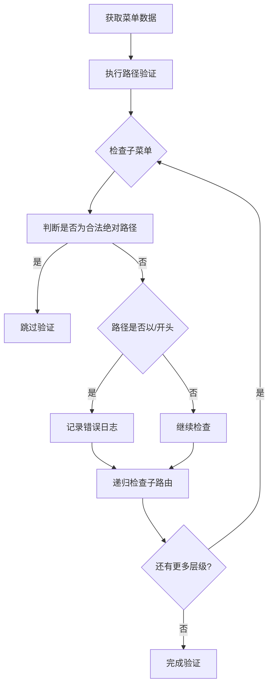

# 路径配置验证

<cite>
**本文档引用的文件**  
- [MenuProcessor.ts](file://src/router/core/MenuProcessor.ts)
- [router.ts](file://src/utils/router.ts)
- [system.ts](file://src/router/modules/system.ts)
- [asyncRoutes.ts](file://src/router/routes/asyncRoutes.ts)
- [IframeRouteManager.ts](file://src/router/core/IframeRouteManager.ts)
</cite>

## 目录
1. [路径验证机制概述](#路径验证机制概述)
2. [validateMenuPaths方法详解](#validatemenuPaths方法详解)
3. [合法绝对路径判断](#合法绝对路径判断)
4. [错误日志输出格式](#错误日志输出格式)
5. [典型错误案例与修复方案](#典型错误案例与修复方案)
6. [验证机制执行流程](#验证机制执行流程)

## 路径验证机制概述

路径配置验证机制是系统路由管理的重要组成部分，主要用于检测和防止菜单路径配置错误。该机制在菜单数据处理过程中执行，确保非一级菜单不使用以'/'开头的非法路径，从而避免路由匹配异常。验证机制通过递归遍历菜单树结构，在每一层级检查子菜单路径的合法性，并对发现的错误进行详细记录和提示。

**Section sources**
- [MenuProcessor.ts](file://src/router/core/MenuProcessor.ts#L21-L36)

## validateMenuPaths方法详解

`validateMenuPaths`方法是路径验证机制的核心，负责检测非一级菜单是否错误使用了以'/'开头的路径。该方法采用递归方式遍历整个菜单树结构，对每一层级的子菜单进行路径检查。

方法接收两个参数：`menuList`表示当前层级的菜单列表，`level`表示当前菜单层级（从1开始计数）。遍历过程中，对于每个包含子菜单的路由项，方法会检查其所有子菜单项的路径配置。

关键检查逻辑如下：首先判断子菜单路径是否为合法的绝对路径（通过`isValidAbsolutePath`方法），如果是则跳过验证；如果不是合法绝对路径且以'/'开头，则判定为配置错误，并调用`logPathError`方法记录错误信息。

该方法通过递归调用自身来检查更深层级的子路由，确保整个菜单树的所有层级都得到验证。

**Section sources**
- [MenuProcessor.ts](file://src/router/core/MenuProcessor.ts#L158-L177)

## 合法绝对路径判断

`isValidAbsolutePath`方法用于判断路径是否为合法的绝对路径，避免对特殊类型的路由进行误报。该方法定义了三种合法的绝对路径类型：

1. 以'http://'开头的外部链接
2. 以'https://'开头的外部链接
3. 以'/outside/iframe/'开头的iframe路由

这些特殊类型的路径虽然以'/'开头，但属于合法配置，因此在验证过程中需要被排除。这种方法确保了验证机制的准确性，不会将有效的外部链接或iframe嵌入页面误判为错误配置。

通过这种设计，系统既能防止普通菜单项错误使用绝对路径，又能支持外部资源的正常集成。

**Section sources**
- [MenuProcessor.ts](file://src/router/core/MenuProcessor.ts#L183-L189)

## 错误日志输出格式

当检测到非法路径配置时，`logPathError`方法会输出详细的错误日志，帮助开发者快速定位和解决问题。错误日志包含以下关键信息：

- **菜单标识**：显示菜单的标题（通过`formatMenuTitle`方法格式化）以及名称和路径信息
- **位置信息**：显示错误菜单在菜单树中的具体位置，格式为"父菜单 > 子菜单"
- **问题描述**：明确指出是哪一级菜单的path不能以'/'开头
- **当前配置**：显示当前错误的路径配置
- **修正建议**：提供正确的路径配置建议

日志采用多行格式输出，每条信息单独成行，提高了可读性。修正建议通过提取路径的最后一部分作为相对路径，例如将'/detail'建议改为'detail'。

**Section sources**
- [MenuProcessor.ts](file://src/router/core/MenuProcessor.ts#L194-L211)

## 典型错误案例与修复方案

以下是常见的路径配置错误案例及其修复方案：

**错误案例1：二级菜单使用绝对路径**
```typescript
{
  path: 'system',
  name: 'System',
  children: [
    {
      path: '/user',  // 错误：二级菜单不应以/开头
      name: 'User',
      component: '/system/user'
    }
  ]
}
```

**修复方案：**
```typescript
{
  path: 'system',
  name: 'System',
  children: [
    {
      path: 'user',  // 修复：移除开头的/
      name: 'User',
      component: '/system/user'
    }
  ]
}
```

**错误案例2：多级嵌套菜单路径错误**
```typescript
{
  path: 'nested',
  name: 'Nested',
  children: [
    {
      path: 'menu1',
      name: 'Menu1',
      children: [
        {
          path: '/menu1-1',  // 错误：三级菜单不应以/开头
          name: 'Menu1-1',
          component: '/system/nested/menu1-1'
        }
      ]
    }
  ]
}
```

**修复方案：**
```typescript
{
  path: 'nested',
  name: 'Nested',
  children: [
    {
      path: 'menu1',
      name: 'Menu1',
      children: [
        {
          path: 'menu1-1',  // 修复：移除开头的/
          name: 'Menu1-1',
          component: '/system/nested/menu1-1'
        }
      ]
    }
  ]
}
```

对于外部链接和iframe路由，可以合法使用以'/'开头的路径：
```typescript
{
  path: 'outside',
  name: 'Outside',
  children: [
    {
      path: 'https://example.com',  // 合法：外部链接
      name: 'External',
      meta: { link: 'https://example.com' }
    },
    {
      path: '/outside/iframe/report',  // 合法：iframe路由
      name: 'Report',
      meta: { isIframe: true }
    }
  ]
}
```

**Section sources**
- [system.ts](file://src/router/modules/system.ts#L13-L148)
- [asyncRoutes.ts](file://src/router/routes/asyncRoutes.ts#L9)

## 验证机制执行流程

路径验证机制的执行流程如下：

1. **菜单数据获取**：根据系统模式（前端控制或后端控制）获取原始菜单数据
2. **路径验证**：在规范化路径之前，调用`validateMenuPaths`方法对原始菜单配置进行验证
3. **递归检查**：从第一级菜单开始，逐层检查所有子菜单的路径配置
4. **错误处理**：对发现的非法路径配置，通过`logPathError`输出详细的错误日志
5. **路径规范化**：验证通过后，调用`normalizeMenuPaths`方法将相对路径转换为完整路径

整个流程确保了菜单路径配置的正确性，防止了因路径配置错误导致的路由匹配问题。验证机制在系统初始化时执行，为后续的路由注册和菜单渲染提供了可靠的基础。



**Diagram sources**
- [MenuProcessor.ts](file://src/router/core/MenuProcessor.ts#L21-L36)
- [MenuProcessor.ts](file://src/router/core/MenuProcessor.ts#L158-L177)

**Section sources**
- [MenuProcessor.ts](file://src/router/core/MenuProcessor.ts#L17-L240)
- [IframeRouteManager.ts](file://src/router/core/IframeRouteManager.ts#L12-L23)