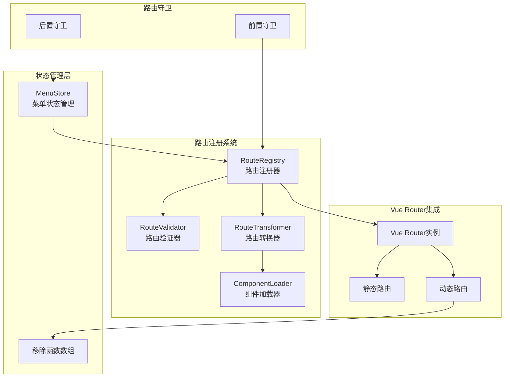
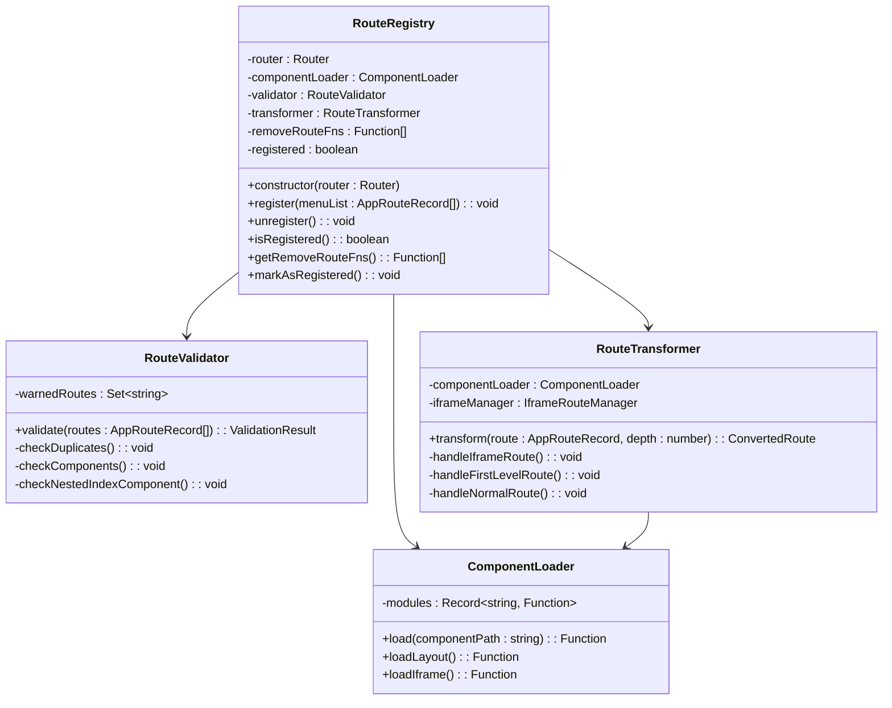
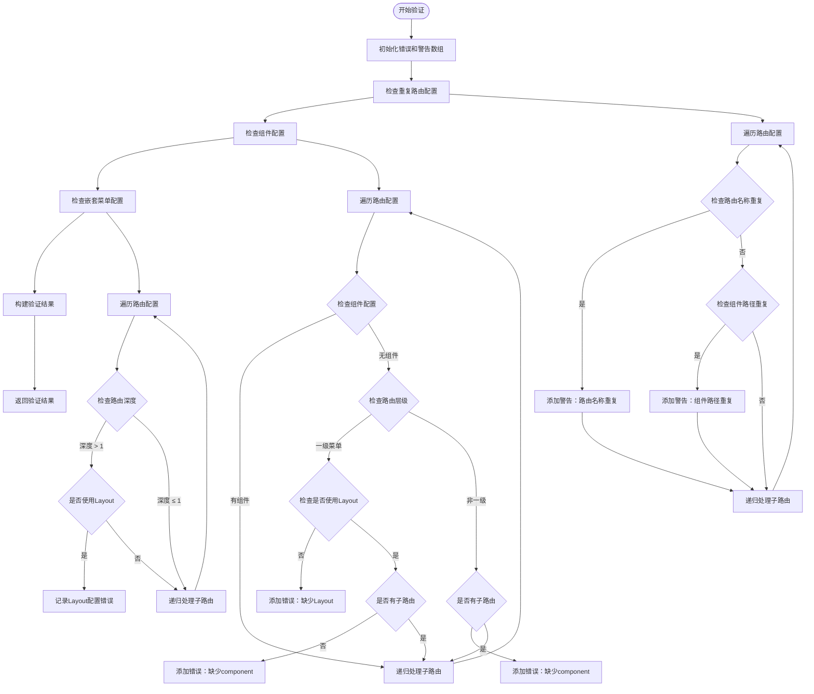
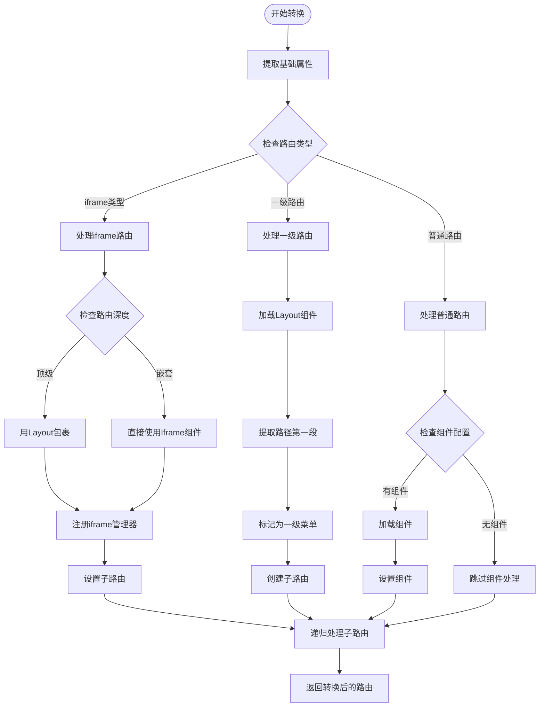
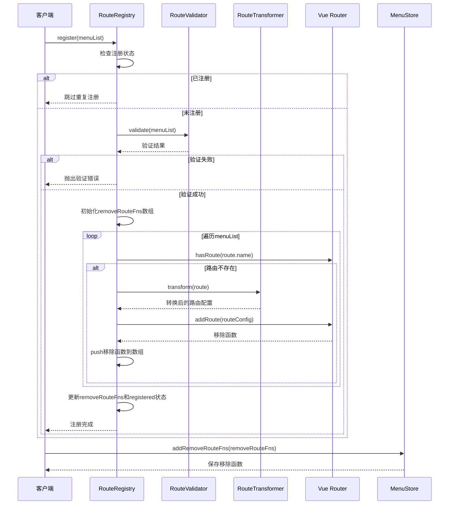
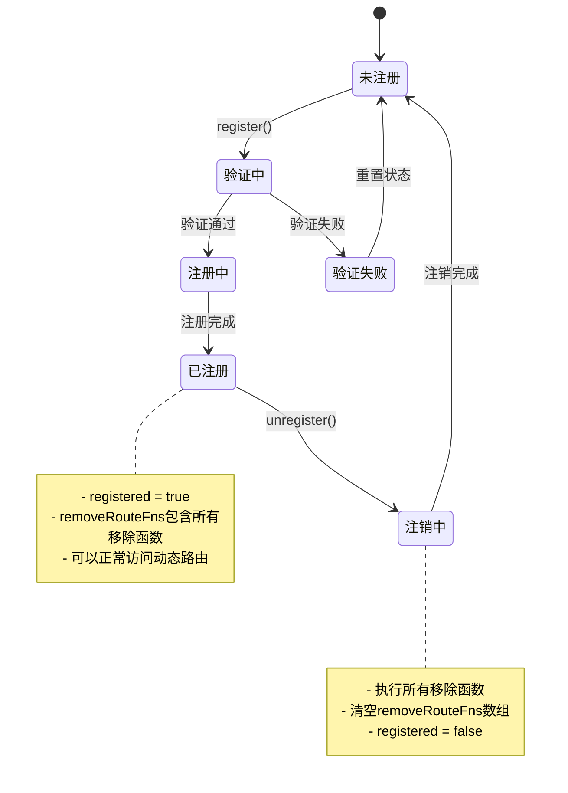
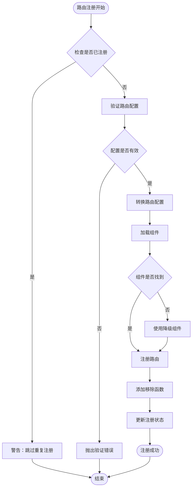

# 路由注册机制

<cite>
**本文档引用的文件**
- [RouteRegistry.ts](file://src/router/core/RouteRegistry.ts)
- [RouteValidator.ts](file://src/router/core/RouteValidator.ts)
- [RouteTransformer.ts](file://src/router/core/RouteTransformer.ts)
- [ComponentLoader.ts](file://src/router/core/ComponentLoader.ts)
- [routesAlias.ts](file://src/router/routesAlias.ts)
- [index.ts](file://src/router/index.ts)
- [menu.ts](file://src/store/modules/menu.ts)
- [beforeEach.ts](file://src/router/guards/beforeEach.ts)
- [staticRoutes.ts](file://src/router/routes/staticRoutes.ts)
- [dashboard.ts](file://src/router/modules/dashboard.ts)
- [router.ts](file://src/utils/router.ts)
</cite>

## 目录
1. [概述](#概述)
2. [系统架构](#系统架构)
3. [RouteRegistry核心类详解](#routeregistry核心类详解)
4. [路由验证机制](#路由验证机制)
5. [路由转换流程](#路由转换流程)
6. [动态路由注册过程](#动态路由注册过程)
7. [路由生命周期管理](#路由生命周期管理)
8. [错误处理与防护策略](#错误处理与防护策略)
9. [实际应用示例](#实际应用示例)
10. [性能优化考虑](#性能优化考虑)

## 概述

Art Design Pro框架采用了一套完整的动态路由注册机制，通过RouteRegistry类为核心，实现了灵活的路由管理系统。该机制支持运行时动态加载路由配置，自动验证路由合法性，并提供完善的路由生命周期管理功能。

### 核心特性

- **动态路由注册**：支持运行时动态加载和注册路由配置
- **完整性验证**：内置路由配置验证机制，确保路由配置的正确性
- **类型安全转换**：将应用路由记录转换为Vue Router原生格式
- **生命周期管理**：提供完整的路由注册和注销生命周期管理
- **内存泄漏防护**：通过移除函数管理机制防止内存泄漏

## 系统架构



**图表来源**
- [RouteRegistry.ts](file://src/router/core/RouteRegistry.ts#L16-L91)
- [RouteValidator.ts](file://src/router/core/RouteValidator.ts#L19-L188)
- [RouteTransformer.ts](file://src/router/core/RouteTransformer.ts#L21-L133)

## RouteRegistry核心类详解

RouteRegistry是整个路由注册机制的核心类，负责协调各个组件完成路由的注册、验证和管理任务。

### 类结构设计



**图表来源**
- [RouteRegistry.ts](file://src/router/core/RouteRegistry.ts#L16-L91)
- [RouteValidator.ts](file://src/router/core/RouteValidator.ts#L19-L188)
- [RouteTransformer.ts](file://src/router/core/RouteTransformer.ts#L21-L133)
- [ComponentLoader.ts](file://src/router/core/ComponentLoader.ts#L12-L83)

### 核心属性说明

| 属性 | 类型 | 描述 | 默认值 |
|------|------|------|--------|
| router | Router | Vue Router实例引用 | 必需 |
| componentLoader | ComponentLoader | 组件加载器实例 | 新实例 |
| validator | RouteValidator | 路由验证器实例 | 新实例 |
| transformer | RouteTransformer | 路由转换器实例 | 新实例 |
| removeRouteFns | Function[] | 路由移除函数数组 | [] |
| registered | boolean | 路由注册状态标志 | false |

**章节来源**
- [RouteRegistry.ts](file://src/router/core/RouteRegistry.ts#L17-L22)

## 路由验证机制

RouteValidator类负责验证路由配置的合法性，确保路由配置符合系统要求，避免潜在的运行时错误。

### 验证流程



**图表来源**
- [RouteValidator.ts](file://src/router/core/RouteValidator.ts#L26-L187)

### 验证规则详解

#### 1. 重复路由检测
- **路由名称重复**：同一应用内不允许存在相同名称的路由
- **组件路径重复**：同一父路径下的组件路径不能重复

#### 2. 组件配置验证
- **一级菜单**：必须指定Layout组件，除非是外链或iframe
- **非一级菜单**：如果没有子路由，则必须配置具体组件
- **外链和iframe**：特殊类型的路由配置要求

#### 3. 嵌套菜单配置
- **Layout组件限制**：只有一级菜单可以使用Layout组件
- **组件路径规范**：确保组件路径的正确性和唯一性

**章节来源**
- [RouteValidator.ts](file://src/router/core/RouteValidator.ts#L49-L179)

## 路由转换流程

RouteTransformer负责将应用路由记录转换为Vue Router原生格式，同时处理不同类型路由的特殊需求。

### 转换决策流程



**图表来源**
- [RouteTransformer.ts](file://src/router/core/RouteTransformer.ts#L33-L132)

### 路由类型处理

#### 1. iframe类型路由
- **顶级iframe**：使用Layout包裹，路径提取第一段
- **嵌套iframe**：直接使用Iframe组件，不进行额外包装
- **iframe管理**：自动注册到IframeRouteManager进行统一管理

#### 2. 一级路由处理
- **Layout包裹**：所有一级路由都使用Layout组件包裹
- **路径处理**：提取路径的第一段作为路由路径
- **子路由创建**：为每个一级路由创建对应的子路由

#### 3. 普通路由处理
- **组件加载**：根据配置路径动态加载对应组件
- **路径保持**：保持原始路径配置不变

**章节来源**
- [RouteTransformer.ts](file://src/router/core/RouteTransformer.ts#L69-L123)

## 动态路由注册过程

动态路由注册是整个系统的核心功能，通过RouteRegistry的register方法实现完整的路由注册流程。

### 注册流程图



**图表来源**
- [RouteRegistry.ts](file://src/router/core/RouteRegistry.ts#L34-L58)
- [beforeEach.ts](file://src/router/guards/beforeEach.ts#L231-L237)

### 注册步骤详解

#### 1. 状态检查
- **重复注册防护**：通过`registered`标志位防止重复注册
- **性能优化**：避免不必要的验证和转换操作

#### 2. 配置验证
- **完整性检查**：确保路由配置符合系统要求
- **错误报告**：提供详细的错误信息帮助开发者定位问题

#### 3. 路由转换
- **类型转换**：将应用路由记录转换为Vue Router格式
- **组件加载**：动态加载所需的Vue组件
- **路径处理**：处理路由路径的规范化

#### 4. 动态注册
- **逐个注册**：按顺序注册每个路由配置
- **移除函数收集**：收集每个路由的移除函数
- **状态更新**：更新注册状态和移除函数数组

**章节来源**
- [RouteRegistry.ts](file://src/router/core/RouteRegistry.ts#L34-L58)

## 路由生命周期管理

路由生命周期管理通过removeRouteFns数组和相关方法实现，确保路由的正确注册和注销，防止内存泄漏。

### 生命周期状态图



**图表来源**
- [RouteRegistry.ts](file://src/router/core/RouteRegistry.ts#L61-L90)

### 关键方法说明

#### 1. isRegistered方法
- **用途**：检查路由是否已成功注册
- **实现**：返回`registered`标志位状态
- **应用场景**：路由守卫中判断是否需要进行动态路由注册

#### 2. markAsRegistered方法
- **用途**：在错误处理场景中标记为已注册
- **实现**：直接设置`registered = true`
- **应用场景**：防止重复请求和错误处理

#### 3. getRemoveRouteFns方法
- **用途**：获取所有路由移除函数
- **实现**：返回`removeRouteFns`数组
- **应用场景**：状态管理中保存移除函数以便后续注销

#### 4. unregister方法
- **用途**：批量注销所有动态路由
- **实现**：执行所有移除函数并清空数组
- **应用场景**：用户登出或路由配置变更时

**章节来源**
- [RouteRegistry.ts](file://src/router/core/RouteRegistry.ts#L70-L90)

## 错误处理与防护策略

系统提供了多层次的错误处理和防护机制，确保路由系统的稳定性和可靠性。

### 错误处理层次



**图表来源**
- [RouteRegistry.ts](file://src/router/core/RouteRegistry.ts#L35-L58)

### 防护策略

#### 1. 重复注册防护
- **状态检查**：通过`registered`标志位防止重复注册
- **警告机制**：已注册时输出警告而非抛出错误
- **幂等性保证**：多次调用register方法不会产生副作用

#### 2. 配置验证防护
- **完整性检查**：确保所有必需字段都已配置
- **类型验证**：验证路由配置的数据类型正确性
- **语义检查**：检查路由配置的语义合理性

#### 3. 组件加载防护
- **降级处理**：组件加载失败时使用空组件或错误提示组件
- **路径容错**：支持多种组件路径格式
- **错误日志**：记录组件加载失败的详细信息

#### 4. 内存泄漏防护
- **移除函数管理**：通过removeRouteFns数组管理路由注销
- **及时清理**：unregister方法确保所有路由都被正确移除
- **状态同步**：注册和注销状态保持一致

**章节来源**
- [RouteRegistry.ts](file://src/router/core/RouteRegistry.ts#L35-L38)
- [RouteValidator.ts](file://src/router/core/RouteValidator.ts#L26-L43)

## 实际应用示例

以下展示了路由注册机制在实际项目中的应用流程和最佳实践。

### 完整的路由注册流程

基于项目中的实际实现，路由注册遵循以下标准流程：

#### 1. 路由守卫初始化
```typescript
// 在路由初始化时创建RouteRegistry实例
export function setupBeforeEachGuard(router: Router): void {
  routeRegistry = new RouteRegistry(router)
  
  router.beforeEach(async (to, from, next) => {
    try {
      await handleRouteGuard(to, from, next, router)
    } catch (error) {
      console.error('[RouteGuard] 路由守卫处理失败:', error)
      next({ name: 'Exception500' })
    }
  })
}
```

#### 2. 动态路由注册
```typescript
async function handleDynamicRoutes(
  to: RouteLocationNormalized,
  next: NavigationGuardNext,
  router: Router
): Promise<void> {
  try {
    // 1. 获取用户信息
    await fetchUserInfo()
    
    // 2. 获取菜单数据
    const menuList = await menuProcessor.getMenuList()
    
    // 3. 验证菜单数据
    if (!menuProcessor.validateMenuList(menuList)) {
      throw new Error('获取菜单列表失败，请重新登录')
    }
    
    // 4. 注册动态路由
    routeRegistry?.register(menuList)
    
    // 5. 保存菜单数据到 store
    const menuStore = useMenuStore()
    menuStore.setMenuList(menuList)
    menuStore.addRemoveRouteFns(routeRegistry?.getRemoveRouteFns() || [])
    
    next()
  } catch (error) {
    console.error('动态路由注册失败:', error)
    next({ name: 'Exception500' })
  }
}
```

#### 3. 路由注销处理
```typescript
// 用户登出时的路由清理
function handleLogout() {
  const menuStore = useMenuStore()
  
  // 清理动态路由
  menuStore.removeAllDynamicRoutes()
  
  // 重置状态
  routeRegistry?.markAsRegistered()
  
  // 导航到登录页
  router.push({ name: 'Login' })
}
```

### 路由配置示例

#### 基础路由配置
```typescript
export const dashboardRoutes: AppRouteRecord = {
  name: 'Dashboard',
  path: '/dashboard',
  component: '/index/index', // 使用Layout包裹
  meta: {
    title: 'menus.dashboard.title',
    icon: 'ri:pie-chart-line',
    roles: ['R_SUPER', 'R_ADMIN']
  },
  children: [
    {
      path: 'console',
      name: 'Console',
      component: '/dashboard/console',
      meta: {
        title: 'menus.dashboard.console',
        icon: 'ri:home-smile-2-line',
        keepAlive: false,
        fixedTab: true
      }
    }
  ]
}
```

#### iframe路由配置
```typescript
{
  path: '/external',
  component: '/index/index',
  meta: {
    title: '外部链接',
    icon: 'ri:link',
    isIframe: true
  }
}
```

**章节来源**
- [beforeEach.ts](file://src/router/guards/beforeEach.ts#L82-L100)
- [beforeEach.ts](file://src/router/guards/beforeEach.ts#L210-L237)
- [dashboard.ts](file://src/router/modules/dashboard.ts#L3-L46)

## 性能优化考虑

路由注册机制在设计时充分考虑了性能优化，通过多种策略提升系统响应速度和资源利用率。

### 性能优化策略

#### 1. 延迟加载优化
- **组件动态导入**：使用Vite的动态导入功能实现按需加载
- **懒加载机制**：只在需要时才加载对应的Vue组件
- **预加载策略**：对常用组件进行预加载优化

#### 2. 缓存机制
- **组件缓存**：ComponentLoader维护组件模块缓存
- **验证结果缓存**：避免重复的路由配置验证
- **路径解析缓存**：缓存路径解析结果减少计算开销

#### 3. 内存管理
- **及时清理**：unregister方法确保路由资源被及时释放
- **弱引用使用**：避免循环引用导致的内存泄漏
- **状态同步**：注册和注销状态保持同步

#### 4. 并发优化
- **异步处理**：路由注册采用异步方式避免阻塞主线程
- **批量操作**：一次性处理多个路由配置提高效率
- **错误隔离**：单个路由配置错误不影响其他路由的注册

### 性能监控指标

| 指标 | 目标值 | 监控方法 | 优化建议 |
|------|--------|----------|----------|
| 路由注册时间 | < 100ms | 控制台计时 | 减少验证复杂度 |
| 组件加载时间 | < 500ms | 网络面板监控 | 启用组件预加载 |
| 内存占用增长 | < 1MB/次 | 内存分析工具 | 及时清理移除函数 |
| 验证耗时占比 | < 10% | 性能分析 | 优化验证算法 |

**章节来源**
- [ComponentLoader.ts](file://src/router/core/ComponentLoader.ts#L13-L18)
- [RouteRegistry.ts](file://src/router/core/RouteRegistry.ts#L46-L58)

## 总结

Art Design Pro的路由注册机制通过RouteRegistry类实现了完整的动态路由管理系统，具有以下核心优势：

### 设计优势
- **模块化架构**：清晰的职责分离，便于维护和扩展
- **类型安全**：完整的TypeScript类型定义确保开发时的类型安全
- **错误防护**：多层次的错误处理和防护机制保证系统稳定性
- **性能优化**：多种性能优化策略确保良好的用户体验

### 应用价值
- **灵活性**：支持运行时动态路由配置，适应复杂的业务需求
- **可维护性**：清晰的代码结构和完善的注释便于团队协作
- **可扩展性**：模块化设计支持功能的灵活扩展和定制
- **可靠性**：完善的错误处理和防护机制确保系统稳定运行

这套路由注册机制不仅满足了当前项目的功能需求，更为未来的功能扩展和系统升级奠定了坚实的基础。