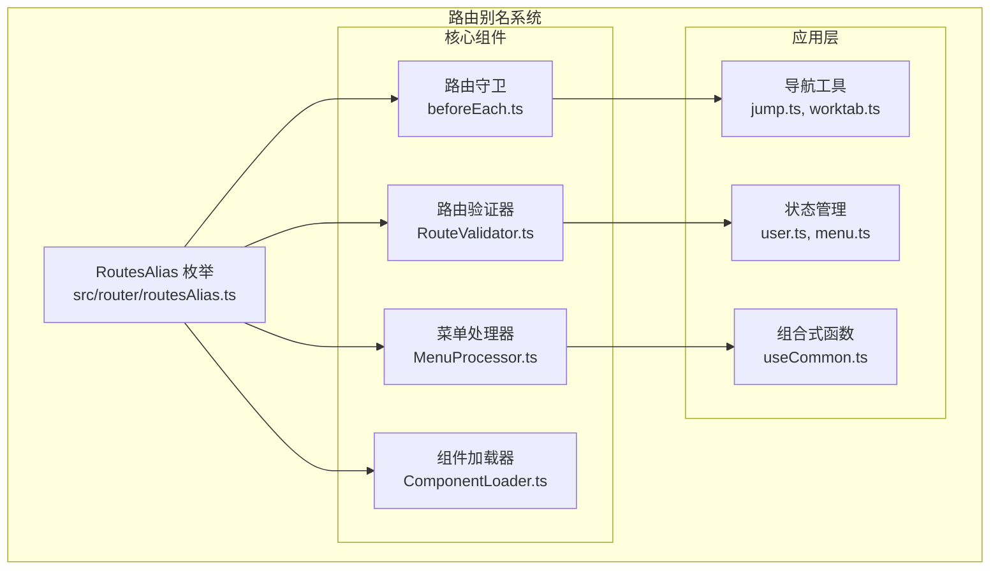
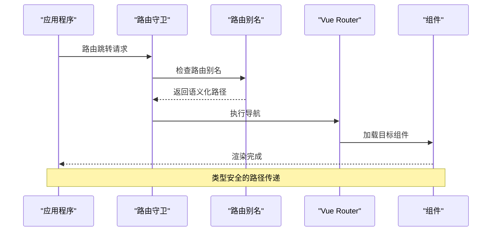
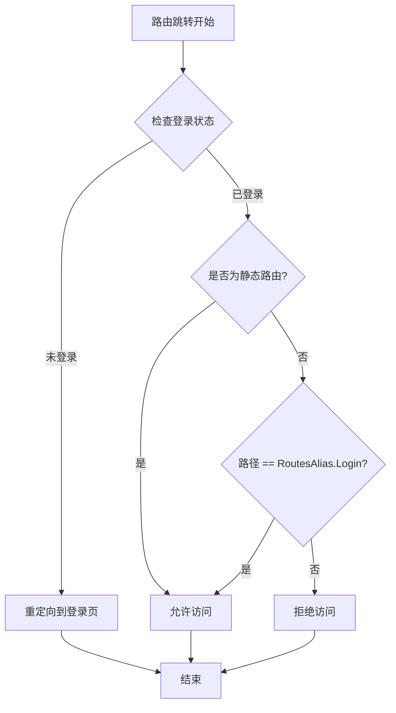
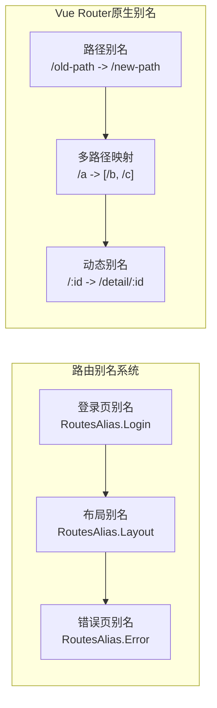
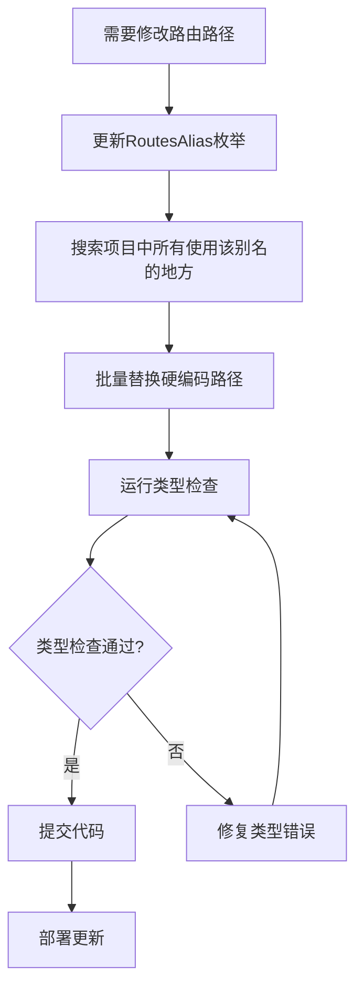

# 路由别名

<cite>
**本文档中引用的文件**
- [src/router/routesAlias.ts](file://src/router/routesAlias.ts)
- [src/router/index.ts](file://src/router/index.ts)
- [src/router/guards/beforeEach.ts](file://src/router/guards/beforeEach.ts)
- [src/router/guards/afterEach.ts](file://src/router/guards/afterEach.ts)
- [src/router/core/RouteValidator.ts](file://src/router/core/RouteValidator.ts)
- [src/router/core/MenuProcessor.ts](file://src/router/core/MenuProcessor.ts)
- [src/router/core/ComponentLoader.ts](file://src/router/core/ComponentLoader.ts)
- [src/types/router/index.ts](file://src/types/router/index.ts)
- [src/utils/router.ts](file://src/utils/router.ts)
- [src/utils/navigation/jump.ts](file://src/utils/navigation/jump.ts)
- [src/utils/navigation/worktab.ts](file://src/utils/navigation/worktab.ts)
- [src/hooks/core/useCommon.ts](file://src/hooks/core/useCommon.ts)
- [src/store/modules/user.ts](file://src/store/modules/user.ts)
</cite>

## 目录
1. [简介](#简介)
2. [路由别名系统架构](#路由别名系统架构)
3. [核心实现分析](#核心实现分析)
4. [实际应用场景](#实际应用场景)
5. [与Vue Router原生功能对比](#与vue-router原生功能对比)
6. [最佳实践指南](#最佳实践指南)
7. [代码示例](#代码示例)
8. [故障排除](#故障排除)
9. [总结](#总结)

## 简介

路由别名系统是Art Design Pro框架中的一个重要特性，它通过在`src/router/routesAlias.ts`中定义常量来集中管理关键的路由路径。这种设计模式显著提高了代码的可维护性和可读性，同时提供了类型安全保证和避免硬编码路径的风险。

路由别名系统的核心价值在于：
- **集中管理**：将所有重要路由路径统一定义在单一文件中
- **类型安全**：利用TypeScript的枚举类型提供编译时检查
- **可维护性**：一处修改，全局生效
- **可读性**：语义化的命名替代硬编码路径
- **避免错误**：减少路径拼写错误和不一致的问题

## 路由别名系统架构

### 系统组成结构



**图表来源**
- [src/router/routesAlias.ts](file://src/router/routesAlias.ts#L5-L8)
- [src/router/guards/beforeEach.ts](file://src/router/guards/beforeEach.ts#L46)
- [src/router/core/RouteValidator.ts](file://src/router/core/RouteValidator.ts#L75-L148)

### 数据流架构



**图表来源**
- [src/router/guards/beforeEach.ts](file://src/router/guards/beforeEach.ts#L169-L180)
- [src/utils/navigation/jump.ts](file://src/utils/navigation/jump.ts#L38-L41)

**章节来源**
- [src/router/routesAlias.ts](file://src/router/routesAlias.ts#L1-L9)
- [src/router/index.ts](file://src/router/index.ts#L1-L24)

## 核心实现分析

### RoutesAlias枚举定义

路由别名系统的核心是`RoutesAlias`枚举，它定义了系统中最重要的路由路径：

```typescript
export enum RoutesAlias {
  Layout = '/index/index', // 布局容器
  Login = '/auth/login'    // 登录页
}
```

这个简单的枚举提供了以下优势：
- **语义化命名**：`RoutesAlias.Layout`比`'/index/index'`更具可读性
- **类型安全**：编译时检查，防止拼写错误
- **集中管理**：所有关键路径都在一处定义
- **易于维护**：修改一处，全局生效

### 路由守卫中的应用

在路由守卫中，路由别名被广泛用于登录状态检查和权限验证：

```typescript
// 在beforeEach.ts中
if (userStore.isLogin || to.path === RoutesAlias.Login || isStaticRoute(to.path)) {
  return true
}
```

这种使用方式的优势：
- **清晰的业务逻辑**：明确区分登录页和其他静态路由
- **避免硬编码**：不再需要在多个地方重复写'/auth/login'
- **易于测试**：可以通过枚举值进行单元测试

### 路由验证器中的角色

路由验证器使用路由别名来确保路由配置的正确性：

```typescript
// 组件路径验证
if (componentPath !== RoutesAlias.Layout) {
  // 执行验证逻辑
}

// 嵌套路由验证
if (level > 1 && route.component === RoutesAlias.Layout) {
  // 报告配置错误
}
```

**章节来源**
- [src/router/routesAlias.ts](file://src/router/routesAlias.ts#L5-L8)
- [src/router/guards/beforeEach.ts](file://src/router/guards/beforeEach.ts#L169-L180)
- [src/router/core/RouteValidator.ts](file://src/router/core/RouteValidator.ts#L75-L148)

## 实际应用场景

### 1. 路由守卫中的权限控制

路由别名在路由守卫中发挥着关键作用，用于判断用户访问权限：



**图表来源**
- [src/router/guards/beforeEach.ts](file://src/router/guards/beforeEach.ts#L164-L180)

### 2. 菜单配置中的路径管理

在菜单处理器中，路由别名确保菜单配置的一致性：

```typescript
// 在MenuProcessor.ts中
if (item.component && item.component !== '' && item.component !== RoutesAlias.Layout) {
  return true
}
```

这种模式的好处：
- **配置一致性**：确保菜单项正确指向具体组件
- **错误预防**：避免将目录菜单错误配置为组件路径
- **维护便利**：一处修改影响所有相关配置

### 3. 组件加载中的路径解析

组件加载器使用路由别名来正确加载布局组件：

```typescript
// 在ComponentLoader.ts中
loadLayout(): () => Promise<any> {
  return () => import('@/views/index/index.vue')
}
```

### 4. 导航工具中的智能跳转

导航工具函数使用路由别名来提供智能的菜单跳转功能：

```typescript
// 在jump.ts中
export const handleMenuJump = (item: AppRouteRecord, jumpToFirst: boolean = false) => {
  if (!jumpToFirst || !item.children?.length) {
    return router.push(item.path)
  }
  
  // 递归查找第一个可见的子菜单
  const firstChild = findFirstLeafMenu(item.children)
  router.push(firstChild.path)
}
```

**章节来源**
- [src/router/guards/beforeEach.ts](file://src/router/guards/beforeEach.ts#L164-L180)
- [src/router/core/MenuProcessor.ts](file://src/router/core/MenuProcessor.ts#L111-L113)
- [src/utils/navigation/jump.ts](file://src/utils/navigation/jump.ts#L38-L61)

## 与Vue Router原生功能对比

### Vue Router原生别名功能

Vue Router提供了原生的别名功能，允许一个路径映射到多个URL：

```typescript
const routes = [
  {
    path: '/a',
    component: Parent,
    alias: ['/b', '/c']
  }
]
```

### 路由别名系统的优势对比

| 特性 | 路由别名系统 | Vue Router原生别名 |
|------|-------------|-------------------|
| **类型安全** | ✅ TypeScript枚举提供编译时检查 | ❌ 字符串路径，运行时错误风险 |
| **集中管理** | ✅ 单一文件定义所有别名 | ❌ 分散在各个路由配置中 |
| **语义化** | ✅ 有意义的枚举名称 | ❌ 直接使用路径字符串 |
| **可维护性** | ✅ 一处修改，全局生效 | ❌ 需要手动更新每个别名 |
| **错误预防** | ✅ 编译时发现拼写错误 | ❌ 运行时才发现问题 |
| **IDE支持** | ✅ 自动补全和类型提示 | ❌ 有限的IDE支持 |

### 使用场景差异



**图表来源**
- [src/router/routesAlias.ts](file://src/router/routesAlias.ts#L5-L8)

**章节来源**
- [src/router/routesAlias.ts](file://src/router/routesAlias.ts#L1-L9)

## 最佳实践指南

### 1. 命名规范

路由别名的命名应遵循以下规范：

```typescript
// ✅ 推荐：语义化命名
export enum RoutesAlias {
  Dashboard = '/dashboard',           // 仪表板页面
  UserProfile = '/user/profile',     // 用户资料页面
  Settings = '/settings',             // 设置页面
  NotFound = '/404',                 // 404页面
  Forbidden = '/403'                 // 403页面
}

// ❌ 不推荐：技术性命名
export enum RoutesAlias {
  P1 = '/dashboard',
  P2 = '/user/profile',
  P3 = '/settings'
}
```

### 2. 类型安全保证

充分利用TypeScript的类型系统：

```typescript
// 定义路由别名类型
export enum RoutesAlias {
  Layout = '/index/index',
  Login = '/auth/login'
}

// 在函数参数中使用类型约束
function navigateToLogin(): void {
  router.push(RoutesAlias.Login)
}

// 编译时检查
navigateToLogin() // 正确
navigateToLogin('/auth/login') // 错误：类型不匹配
```

### 3. 避免硬编码路径

```typescript
// ✅ 推荐：使用路由别名
router.push(RoutesAlias.Login)

// ❌ 不推荐：直接使用硬编码路径
router.push('/auth/login')
```

### 4. 扩展新的路由别名

添加新路由别名时的步骤：

```typescript
// 1. 在RoutesAlias中添加新别名
export enum RoutesAlias {
  Layout = '/index/index',
  Login = '/auth/login',
  AdminDashboard = '/admin/dashboard',    // 新增
  UserProfile = '/user/profile'           // 新增
}

// 2. 在相关组件中使用
import { RoutesAlias } from '@/router/routesAlias'

// 3. 在路由配置中验证
// （RouteValidator会自动检查新添加的别名）
```

### 5. 维护和更新策略



**章节来源**
- [src/router/routesAlias.ts](file://src/router/routesAlias.ts#L5-L8)

## 代码示例

### 示例1：在路由守卫中使用路由别名

```typescript
// src/router/guards/beforeEach.ts
import { RoutesAlias } from '../routesAlias'

export function setupBeforeEachGuard(router: Router): void {
  router.beforeEach(async (to, from, next) => {
    const userStore = useUserStore()
    
    // 使用路由别名进行登录状态检查
    if (userStore.isLogin || to.path === RoutesAlias.Login) {
      next()
      return
    }
    
    // 重定向到登录页，使用路由别名
    next({
      name: 'Login',
      query: { redirect: to.fullPath }
    })
  })
}
```

### 示例2：在菜单配置中使用路由别名

```typescript
// src/router/modules/dashboard.ts
import { RoutesAlias } from '@/router/routesAlias'

export const dashboardRoutes: AppRouteRecord = {
  path: '/dashboard',
  name: 'Dashboard',
  component: RoutesAlias.Layout, // 使用布局别名
  meta: {
    title: 'dashboard.title',
    icon: 'dashboard',
    keepAlive: true
  },
  children: [
    {
      path: 'analysis',
      name: 'DashboardAnalysis',
      component: '/dashboard/analysis', // 具体组件路径
      meta: {
        title: 'dashboard.analysis',
        icon: 'analysis',
        keepAlive: true
      }
    }
  ]
}
```

### 示例3：在组件中使用路由别名

```vue
<!-- src/components/LoginButton.vue -->
<script setup lang="ts">
import { RoutesAlias } from '@/router/routesAlias'
import { useRouter } from 'vue-router'

const router = useRouter()

const handleLoginClick = () => {
  // 使用路由别名进行导航
  router.push(RoutesAlias.Login)
}
</script>

<template>
  <button @click="handleLoginClick">登录</button>
</template>
```

### 示例4：在工具函数中使用路由别名

```typescript
// src/utils/navigation/jump.ts
import { RoutesAlias } from '@/router/routesAlias'

export const redirectToHomePage = (): void => {
  const { homePath } = useCommon()
  
  // 使用路由别名确保导航到正确的首页
  router.push(homePath.value || RoutesAlias.Login)
}

export const handleLogout = (): void => {
  // 退出登录后重定向到登录页
  router.push(RoutesAlias.Login)
}
```

### 示例5：在状态管理中使用路由别名

```typescript
// src/store/modules/user.ts
import { RoutesAlias } from '@/router/routesAlias'

export const useUserStore = defineStore('user', () => {
  const logOut = () => {
    // 清空用户信息并重定向到登录页
    router.push({
      name: 'Login',
      query: { redirect: router.currentRoute.value.fullPath }
    })
  }
  
  return { logOut }
})
```

**章节来源**
- [src/router/guards/beforeEach.ts](file://src/router/guards/beforeEach.ts#L86-L98)
- [src/router/modules/dashboard.ts](file://src/router/modules/dashboard.ts#L1-L24)
- [src/utils/navigation/jump.ts](file://src/utils/navigation/jump.ts#L38-L61)
- [src/store/modules/user.ts](file://src/store/modules/user.ts#L170-L175)

## 故障排除

### 常见问题及解决方案

#### 1. 类型错误：无法识别的路由别名

**问题**：TypeScript报告路由别名未定义或类型不匹配

**解决方案**：
```typescript
// 确保正确导入路由别名
import { RoutesAlias } from '@/router/routesAlias'

// 使用正确的类型
function navigateTo(path: string): void {
  router.push(path) // 正确
  router.push('/auth/login') // 错误：硬编码路径
}
```

#### 2. 路由跳转失败：路径不匹配

**问题**：使用路由别名后仍然出现路由跳转失败

**解决方案**：
```typescript
// 检查路由配置是否正确
import { RoutesAlias } from '@/router/routesAlias'

// 确保路由配置中使用了正确的路径
const routes = [
  {
    path: RoutesAlias.Login, // 使用路由别名
    component: () => import('@/views/auth/login/index.vue')
  }
]
```

#### 3. 菜单显示异常：路径配置错误

**问题**：菜单项显示异常或无法点击

**解决方案**：
```typescript
// 检查菜单配置中的路径
import { RoutesAlias } from '@/router/routesAlias'

const menuItems = [
  {
    path: RoutesAlias.Dashboard, // 确保路径正确
    name: 'Dashboard',
    meta: {
      title: 'dashboard.title',
      icon: 'dashboard'
    }
  }
]
```

#### 4. 组件加载失败：路径解析错误

**问题**：组件无法正确加载

**解决方案**：
```typescript
// 检查组件路径配置
import { RoutesAlias } from '@/router/routesAlias'

const route = {
  path: '/dashboard',
  component: RoutesAlias.Layout, // 确保使用正确的布局别名
  children: [
    {
      path: 'analysis',
      component: '/dashboard/analysis' // 具体组件路径
    }
  ]
}
```

### 调试技巧

#### 1. 路由别名使用追踪

```typescript
// 在开发环境中添加调试信息
import { RoutesAlias } from '@/router/routesAlias'

console.log('Login route:', RoutesAlias.Login)
console.log('Layout route:', RoutesAlias.Layout)
```

#### 2. 路由配置验证

```typescript
// 使用RouteValidator进行配置验证
import { RouteValidator } from '@/router/core/RouteValidator'

const validator = new RouteValidator()
const errors = validator.validate(routes)

if (errors.length > 0) {
  console.error('路由配置错误:', errors)
}
```

**章节来源**
- [src/router/core/RouteValidator.ts](file://src/router/core/RouteValidator.ts#L70-L188)

## 总结

路由别名系统是Art Design Pro框架中的一个精心设计的功能，它通过以下方式显著提升了项目的质量和开发体验：

### 核心价值

1. **类型安全**：利用TypeScript枚举提供编译时检查，避免运行时错误
2. **集中管理**：将所有重要路由路径统一定义，便于维护和更新
3. **语义化**：使用有意义的命名替代硬编码路径，提高代码可读性
4. **一致性**：确保整个项目中路由路径的一致性
5. **可扩展性**：易于添加新的路由别名和修改现有配置

### 应用范围

路由别名系统在以下场景中发挥重要作用：
- **路由守卫**：登录状态检查和权限验证
- **菜单配置**：菜单路径管理和导航控制
- **组件加载**：布局组件和页面组件的路径解析
- **导航工具**：智能跳转和路由导航
- **状态管理**：用户状态和路由状态的同步

### 最佳实践总结

1. **始终使用路由别名**：避免直接使用硬编码路径
2. **保持命名一致性**：使用语义化的枚举名称
3. **定期验证配置**：使用RouteValidator检查路由配置
4. **及时更新文档**：维护路由别名的使用指南
5. **测试覆盖**：为路由别名相关的功能编写单元测试

通过合理使用路由别名系统，开发者可以构建更加健壮、可维护和易读的应用程序，同时大大降低因路径错误导致的bug风险。这种设计模式体现了现代前端开发中对代码质量的追求和对开发者体验的关注。