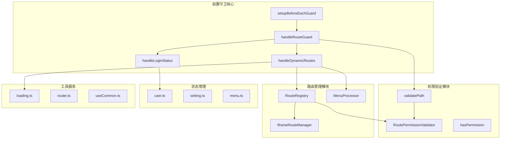
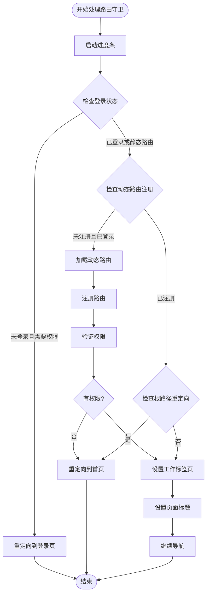
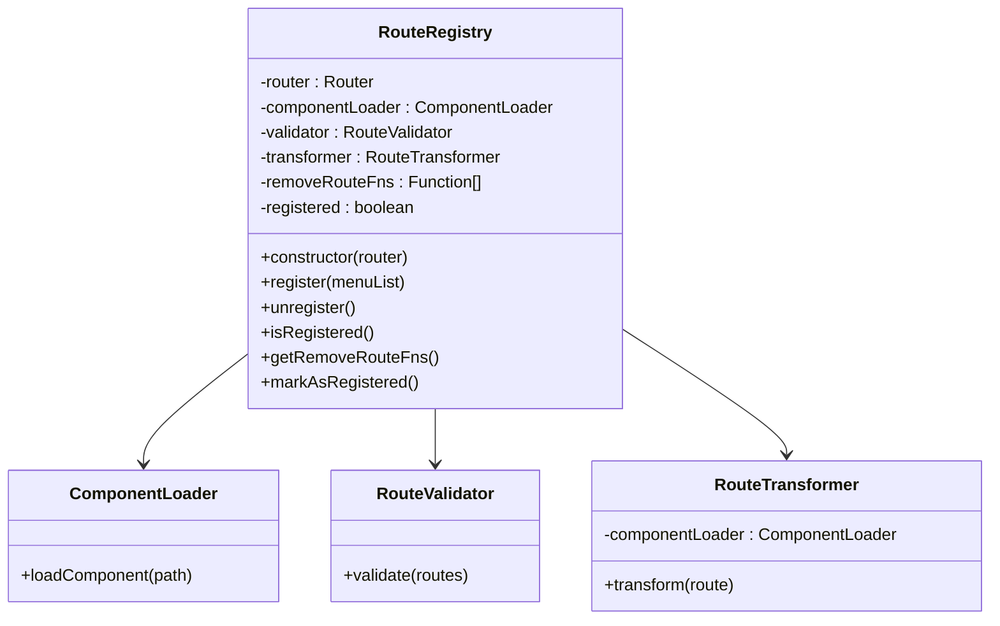
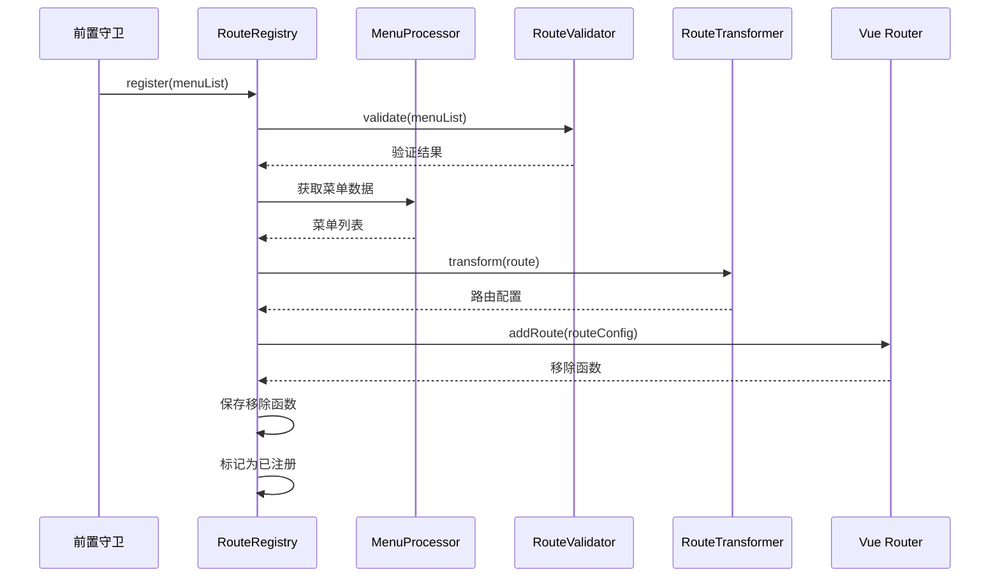
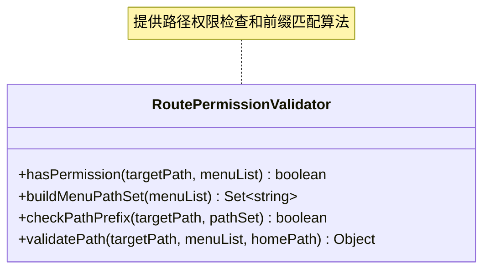
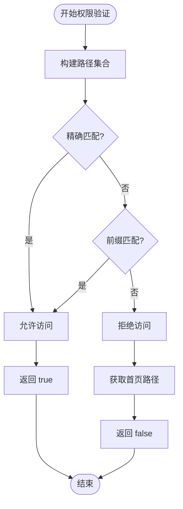
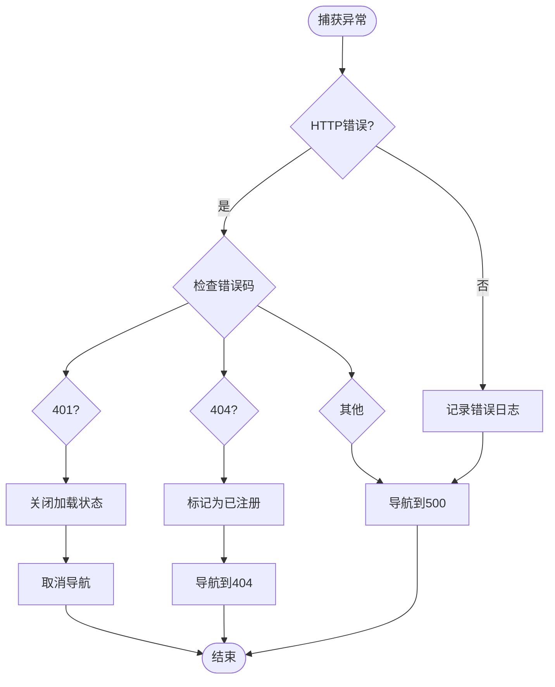

# 前置守卫

<cite>
**本文档引用的文件**
- [beforeEach.ts](file://src/router/guards/beforeEach.ts)
- [RoutePermissionValidator.ts](file://src/router/core/RoutePermissionValidator.ts)
- [RouteRegistry.ts](file://src/router/core/RouteRegistry.ts)
- [MenuProcessor.ts](file://src/router/core/MenuProcessor.ts)
- [IframeRouteManager.ts](file://src/router/core/IframeRouteManager.ts)
- [user.ts](file://src/store/modules/user.ts)
- [router.ts](file://src/utils/router.ts)
- [loading.ts](file://src/utils/ui/loading.ts)
- [useCommon.ts](file://src/hooks/core/useCommon.ts)
- [index.ts](file://src/types/router/index.ts)
- [routesAlias.ts](file://src/router/routesAlias.ts)
</cite>

## 目录
1. [简介](#简介)
2. [前置守卫架构概览](#前置守卫架构概览)
3. [setupBeforeEachGuard函数详解](#setupbeforeeachguard函数详解)
4. [handleRouteGuard核心流程](#handlerouteguard核心流程)
5. [登录状态检查机制](#登录状态检查机制)
6. [动态路由注册过程](#动态路由注册过程)
7. [权限验证流程](#权限验证流程)
8. [异常处理机制](#异常处理机制)
9. [性能优化与用户体验](#性能优化与用户体验)
10. [常见问题与解决方案](#常见问题与解决方案)
11. [总结](#总结)

## 简介

前置守卫是Vue Router中的重要功能，用于在路由导航前执行权限验证、状态检查和资源加载等操作。本文档深入分析Art Design Pro项目中的前置守卫实现，重点说明`setupBeforeEachGuard`函数的工作机制，以及如何通过`handleRouteGuard`函数处理导航前的权限验证流程。

前置守卫在整个应用的路由安全体系中扮演着关键角色，它负责：
- 用户登录状态验证和重定向
- 动态路由注册和权限控制
- 菜单数据获取和处理
- 页面标题设置和工作标签页管理
- 进度条和加载动画控制
- 错误处理和异常跳转

## 前置守卫架构概览

前置守卫的整体架构采用模块化设计，各组件职责明确，协同工作：



**图表来源**
- [beforeEach.ts](file://src/router/guards/beforeEach.ts#L82-L101)
- [RoutePermissionValidator.ts](file://src/router/core/RoutePermissionValidator.ts#L28-L120)
- [RouteRegistry.ts](file://src/router/core/RouteRegistry.ts#L16-L91)

## setupBeforeEachGuard函数详解

`setupBeforeEachGuard`函数是前置守卫的入口点，负责初始化整个守卫系统并设置Vue Router的全局前置守卫。

### 函数签名与初始化

该函数接收一个Router实例作为参数，创建必要的依赖实例：

```typescript
export function setupBeforeEachGuard(router: Router): void {
  // 初始化路由注册器
  routeRegistry = new RouteRegistry(router)
  
  router.beforeEach(async (to, from, next) => {
    try {
      await handleRouteGuard(to, from, next, router)
    } catch (error) {
      console.error('[RouteGuard] 路由守卫处理失败:', error)
      closeLoading()
      next({ name: 'Exception500' })
    }
  })
}
```

### 核心组件初始化

前置守卫初始化过程中创建了三个关键组件：

1. **RouteRegistry实例**：负责动态路由的注册和管理
2. **MenuProcessor实例**：处理菜单数据的获取和过滤
3. **Loading状态跟踪**：管理异步操作的加载状态

### 异常处理机制

前置守卫实现了完善的异常处理机制，当发生未预期的错误时，会：
- 记录详细的错误日志
- 关闭所有打开的加载状态
- 导航到500错误页面

**章节来源**
- [beforeEach.ts](file://src/router/guards/beforeEach.ts#L82-L101)

## handleRouteGuard核心流程

`handleRouteGuard`函数是前置守卫的核心逻辑，按照严格的顺序执行多个验证步骤：



**图表来源**
- [beforeEach.ts](file://src/router/guards/beforeEach.ts#L118-L158)

### 流程详解

1. **进度条启动**：根据设置决定是否显示进度条
2. **登录状态检查**：验证用户是否已登录
3. **动态路由处理**：首次访问时加载和注册动态路由
4. **根路径重定向**：处理根路径到首页的重定向
5. **权限验证**：检查目标路由的访问权限
6. **页面设置**：设置工作标签页和页面标题
7. **导航继续**：允许路由导航继续

**章节来源**
- [beforeEach.ts](file://src/router/guards/beforeEach.ts#L118-L158)

## 登录状态检查机制

登录状态检查是前置守卫的第一道防线，确保只有已登录用户才能访问受保护的路由。

### 检查逻辑

```typescript
function handleLoginStatus(
  to: RouteLocationNormalized,
  userStore: ReturnType<typeof useUserStore>,
  next: NavigationGuardNext
): boolean {
  // 已登录或访问登录页或静态路由，直接放行
  if (userStore.isLogin || to.path === RoutesAlias.Login || isStaticRoute(to.path)) {
    return true
  }

  // 未登录且访问需要权限的页面，跳转到登录页并携带 redirect 参数
  userStore.logOut()
  next({
    name: 'Login',
    query: { redirect: to.fullPath }
  })
  return false
}
```

### 静态路由识别

系统通过`isStaticRoute`函数识别静态路由，这些路由不需要权限验证：

```typescript
function isStaticRoute(path: string): boolean {
  const checkRoute = (routes: any[], targetPath: string): boolean => {
    return routes.some((route) => {
      const routePath = route.path
      const pattern = routePath.replace(/:[^/]+/g, '[^/]+').replace(/\*/g, '.*')
      const regex = new RegExp(`^${pattern}$`)
      
      if (regex.test(targetPath)) {
        return true
      }
      if (route.children && route.children.length > 0) {
        return checkRoute(route.children, targetPath)
      }
      return false
    })
  }
  
  return checkRoute(staticRoutes, path)
}
```

### 用户状态管理

登录状态检查依赖于`user.ts`中的用户状态管理模块，该模块提供了：

- `isLogin`计算属性：表示用户是否已登录
- `logOut()`方法：退出登录并清理状态
- `setLoginStatus()`方法：设置登录状态

**章节来源**
- [beforeEach.ts](file://src/router/guards/beforeEach.ts#L164-L181)
- [user.ts](file://src/store/modules/user.ts#L56-L91)

## 动态路由注册过程

动态路由注册是前置守卫的核心功能之一，它根据用户的权限动态生成可用的路由。

### RouteRegistry类架构



**图表来源**
- [RouteRegistry.ts](file://src/router/core/RouteRegistry.ts#L16-L91)

### 注册流程详解

动态路由注册遵循严格的流程：



**图表来源**
- [beforeEach.ts](file://src/router/guards/beforeEach.ts#L210-L275)
- [RouteRegistry.ts](file://src/router/core/RouteRegistry.ts#L32-L58)

### 菜单处理器

`MenuProcessor`负责菜单数据的获取和处理：

```typescript
class MenuProcessor {
  async getMenuList(): Promise<AppRouteRecord[]> {
    const { isFrontendMode } = useAppMode()
    let menuList: AppRouteRecord[]
    
    if (isFrontendMode.value) {
      menuList = await this.processFrontendMenu()
    } else {
      menuList = await this.processBackendMenu()
    }
    
    // 验证路径配置
    this.validateMenuPaths(menuList)
    // 规范化路径
    return this.normalizeMenuPaths(menuList)
  }
}
```

### 路径规范化

菜单路径规范化确保所有路由路径的一致性：

```typescript
private normalizeMenuPaths(menuList: AppRouteRecord[], parentPath = ''): AppRouteRecord[] {
  return menuList.map((item) => {
    const fullPath = this.buildFullPath(item.path || '', parentPath)
    const children = item.children?.length
      ? this.normalizeMenuPaths(item.children, fullPath)
      : item.children
      
    return {
      ...item,
      path: fullPath,
      children
    }
  })
}
```

**章节来源**
- [beforeEach.ts](file://src/router/guards/beforeEach.ts#L210-L275)
- [MenuProcessor.ts](file://src/router/core/MenuProcessor.ts#L22-L37)

## 权限验证流程

权限验证是前置守卫的核心功能，确保用户只能访问其具有权限的路由。

### RoutePermissionValidator类



**图表来源**
- [RoutePermissionValidator.ts](file://src/router/core/RoutePermissionValidator.ts#L28-L120)

### 权限检查算法

权限验证采用双重检查机制：

1. **精确匹配**：检查目标路径是否在权限集合中
2. **前缀匹配**：支持动态路由参数匹配（如 `/user/123` 匹配 `/user`）

```typescript
static hasPermission(targetPath: string, menuList: AppRouteRecord[]): boolean {
  // 根路径始终允许访问
  if (targetPath === '/') {
    return true
  }
  
  // 构建路径集合
  const pathSet = this.buildMenuPathSet(menuList)
  
  // 检查路径是否在集合中（精确匹配或前缀匹配）
  return pathSet.has(targetPath) || this.checkPathPrefix(targetPath, pathSet)
}
```

### 路径前缀匹配算法

```typescript
static checkPathPrefix(targetPath: string, pathSet: Set<string>): boolean {
  // 遍历路径集合，检查是否有前缀匹配
  for (const menuPath of pathSet) {
    if (targetPath.startsWith(`${menuPath}/`)) {
      return true
    }
  }
  return false
}
```

### 权限验证流程



**图表来源**
- [RoutePermissionValidator.ts](file://src/router/core/RoutePermissionValidator.ts#L35-L46)

**章节来源**
- [RoutePermissionValidator.ts](file://src/router/core/RoutePermissionValidator.ts#L28-L120)

## 异常处理机制

前置守卫实现了多层次的异常处理机制，确保系统的稳定性和用户体验。

### 错误分类与处理

系统根据不同的错误类型采用相应的处理策略：



**图表来源**
- [beforeEach.ts](file://src/router/guards/beforeEach.ts#L275-L296)

### 具体错误处理策略

1. **401未授权错误**：
   - 关闭加载状态
   - 取消当前导航
   - 用户会被自动登出

2. **404未找到错误**：
   - 标记路由为已注册（避免重复请求）
   - 导航到404页面
   - 记录接口配置错误

3. **其他错误**：
   - 导航到500服务器错误页面
   - 记录详细错误信息

### 异常页面导航

系统提供了三种异常页面：
- **403 Forbidden**：权限不足页面
- **404 Not Found**：页面不存在页面  
- **500 Internal Server Error**：服务器内部错误页面

**章节来源**
- [beforeEach.ts](file://src/router/guards/beforeEach.ts#L275-L296)

## 性能优化与用户体验

前置守卫在保证安全性的同时，也注重性能优化和用户体验。

### 加载状态管理

```typescript
// 显示loading
pendingLoading = true
loadingService.showLoading()

// 关闭loading
function closeLoading(): void {
  if (pendingLoading) {
    nextTick(() => {
      loadingService.hideLoading()
      pendingLoading = false
    })
  }
}
```

### 进度条控制

```typescript
// 启动进度条
if (settingStore.showNprogress) {
  NProgress.start()
}

// 结束进度条
NProgress.done()
```

### 页面标题设置

```typescript
// 设置页面标题
export const setPageTitle = (to: RouteLocationNormalized): void => {
  const { title } = to.meta
  if (title) {
    setTimeout(() => {
      document.title = `${formatMenuTitle(String(title))} - ${AppConfig.systemInfo.name}`
    }, 150)
  }
}
```

### 工作标签页管理

```typescript
// 设置工作标签页
import { setWorktab } from '@/utils/navigation'
setWorktab(to)
```

### 用户体验优化

1. **渐进式加载**：分步骤加载资源，避免阻塞
2. **即时反馈**：显示进度条和加载动画
3. **智能重定向**：根据用户状态智能重定向
4. **错误友好**：提供友好的错误页面和恢复选项

**章节来源**
- [beforeEach.ts](file://src/router/guards/beforeEach.ts#L106-L113)
- [router.ts](file://src/utils/router.ts#L30-L40)

## 常见问题与解决方案

### 路由循环重定向

**问题描述**：用户在登录后被不断重定向到登录页面

**原因分析**：
1. 用户令牌过期但未正确刷新
2. 登录状态检查逻辑错误
3. 路由配置冲突

**解决方案**：
```typescript
// 在handleLoginStatus中添加调试信息
console.log('[LoginCheck] 当前路由:', to.path)
console.log('[LoginCheck] 用户登录状态:', userStore.isLogin)
console.log('[LoginCheck] 静态路由:', isStaticRoute(to.path))
```

### 动态路由注册失败

**问题描述**：动态路由注册过程中出现错误

**排查步骤**：
1. 检查菜单数据格式是否正确
2. 验证路由配置的合法性
3. 确认网络请求是否成功

**解决方案**：
```typescript
// 在handleDynamicRoutes中添加详细日志
try {
  console.log('[DynamicRoutes] 开始获取用户信息')
  await fetchUserInfo()
  
  console.log('[DynamicRoutes] 开始获取菜单数据')
  const menuList = await menuProcessor.getMenuList()
  
  console.log('[DynamicRoutes] 菜单数据:', menuList)
  if (!menuProcessor.validateMenuList(menuList)) {
    throw new Error('获取菜单列表失败，请重新登录')
  }
  
  console.log('[DynamicRoutes] 开始注册路由')
  routeRegistry?.register(menuList)
} catch (error) {
  console.error('[DynamicRoutes] 注册失败:', error)
  // 详细记录错误信息
}
```

### 权限验证不准确

**问题描述**：用户能够访问无权限的页面

**排查方法**：
1. 检查RoutePermissionValidator的路径集合构建
2. 验证菜单数据的权限配置
3. 确认前缀匹配算法的正确性

**解决方案**：
```typescript
// 在validatePath中添加调试信息
const { path: validatedPath, hasPermission } = RoutePermissionValidator.validatePath(
  to.path,
  menuList,
  homePath.value || '/'
)

console.log('[PermissionCheck] 目标路径:', to.path)
console.log('[PermissionCheck] 权限验证结果:', hasPermission)
console.log('[PermissionCheck] 有效路径:', validatedPath)
```

### 加载状态异常

**问题描述**：加载动画无法正常关闭

**解决方案**：
```typescript
// 确保在所有分支都关闭加载状态
function closeLoading(): void {
  if (pendingLoading) {
    // 使用nextTick确保DOM更新完成
    nextTick(() => {
      try {
        loadingService.hideLoading()
      } catch (error) {
        console.error('[Loading] 关闭失败:', error)
      } finally {
        pendingLoading = false
      }
    })
  }
}
```

### 内存泄漏问题

**问题描述**：长时间使用后内存占用过高

**解决方案**：
```typescript
// 在resetRouterState中彻底清理
export function resetRouterState(delay: number): void {
  setTimeout(() => {
    try {
      routeRegistry?.unregister()
      IframeRouteManager.getInstance().clear()
      
      const menuStore = useMenuStore()
      menuStore.removeAllDynamicRoutes()
      menuStore.setMenuList([])
    } catch (error) {
      console.error('[RouterReset] 清理失败:', error)
    }
  }, delay)
}
```

## 总结

Art Design Pro项目的前置守卫系统是一个设计精良、功能完备的安全框架。它通过以下特点确保了系统的安全性和用户体验：

### 核心优势

1. **模块化设计**：清晰的职责分离，便于维护和扩展
2. **完善的异常处理**：多层次的错误处理机制
3. **性能优化**：渐进式加载和智能缓存
4. **用户体验**：流畅的导航和友好的错误提示
5. **安全性**：严格的权限验证和状态检查

### 技术亮点

- **动态路由注册**：根据用户权限动态生成可用路由
- **智能权限验证**：支持精确匹配和前缀匹配
- **状态管理集成**：与Pinia状态管理完美结合
- **类型安全**：完整的TypeScript类型定义
- **可扩展性**：良好的架构设计支持功能扩展

### 最佳实践

1. **严格的状态检查**：在每个关键节点进行状态验证
2. **完善的日志记录**：详细的错误日志便于问题排查
3. **优雅的错误处理**：提供友好的错误页面和恢复机制
4. **性能监控**：实时监控加载状态和性能指标
5. **用户体验优先**：在安全性和用户体验之间找到平衡

前置守卫系统不仅保障了应用的安全性，也为用户提供了流畅、可靠的导航体验。通过合理的架构设计和完善的异常处理机制，它成为了现代Web应用中权限管理的最佳实践之一。