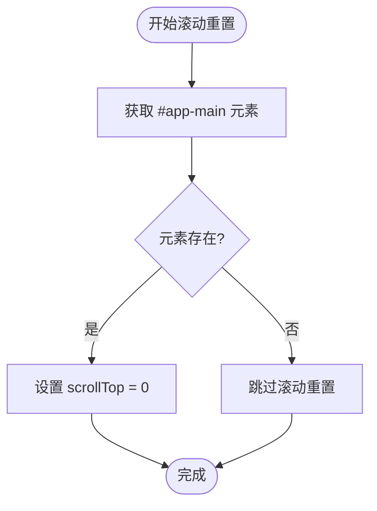

# 后置守卫

<cite>
**本文档引用的文件**
- [afterEach.ts](file://src/router/guards/afterEach.ts)
- [useCommon.ts](file://src/hooks/core/useCommon.ts)
- [loading.ts](file://src/utils/ui/loading.ts)
- [beforeEach.ts](file://src/router/guards/beforeEach.ts)
- [index.ts](file://src/router/index.ts)
- [router.ts](file://src/utils/router.ts)
- [main.ts](file://src/main.ts)
</cite>

## 目录
1. [简介](#简介)
2. [项目结构](#项目结构)
3. [核心组件](#核心组件)
4. [架构概览](#架构概览)
5. [详细组件分析](#详细组件分析)
6. [依赖关系分析](#依赖关系分析)
7. [性能考虑](#性能考虑)
8. [故障排除指南](#故障排除指南)
9. [结论](#结论)

## 简介

后置守卫（After Each Guard）是 Vue Router 中的重要功能，用于在路由导航完成后执行特定的处理逻辑。在 Art Design Pro 项目中，后置守卫主要负责页面滚动位置重置、进度条关闭和全局 loading 状态管理，为用户提供流畅的导航体验。

## 项目结构

后置守卫相关的核心文件组织如下：

**图表来源**
- [afterEach.ts](file://src/router/guards/afterEach.ts#L1-L35)
- [useCommon.ts](file://src/hooks/core/useCommon.ts#L21-L86)
- [loading.ts](file://src/utils/ui/loading.ts#L58-L84)
- [index.ts](file://src/router/index.ts#L15-L18)

**章节来源**
- [afterEach.ts](file://src/router/guards/afterEach.ts#L1-L35)
- [index.ts](file://src/router/index.ts#L1-L24)

## 核心组件

### setupAfterEachGuard 函数

`setupAfterEachGuard` 是后置守卫的主要实现函数，它接收一个 Vue Router 实例作为参数，在路由导航完成后执行以下操作：

1. **页面滚动重置**：调用 `scrollToTop()` 将页面滚动位置重置到顶部
2. **进度条管理**：关闭 NProgress 进度条并清理残留元素
3. **加载状态管理**：关闭全局 loading 遮罩

### useCommon 组合式函数

`useCommon` 提供了页面滚动控制的核心功能：

- **scrollToTop()**：快速将页面滚动到顶部
- **smoothScrollToTop()**：使用平滑动画滚动到顶部
- **scrollTo()**：滚动到指定位置

### loadingService 服务

`loadingService` 提供全局加载状态管理：

- **showLoading()**：显示全局加载动画
- **hideLoading()**：隐藏全局加载动画

**章节来源**
- [afterEach.ts](file://src/router/guards/afterEach.ts#L10-L34)
- [useCommon.ts](file://src/hooks/core/useCommon.ts#L21-L86)
- [loading.ts](file://src/utils/ui/loading.ts#L58-L84)

## 架构概览

后置守卫的整体架构体现了清晰的职责分离和模块化设计：

**图表来源**
- [afterEach.ts](file://src/router/guards/afterEach.ts#L13-L33)
- [useCommon.ts](file://src/hooks/core/useCommon.ts#L44-L49)
- [loading.ts](file://src/utils/ui/loading.ts#L78-L83)

## 详细组件分析

### setupAfterEachGuard 实现详解

#### 函数签名和依赖注入

**图表来源**
- [afterEach.ts](file://src/router/guards/afterEach.ts#L10-L11)
- [useCommon.ts](file://src/hooks/core/useCommon.ts#L21-L86)

#### 页面滚动重置机制

`scrollToTop()` 函数实现了精确的页面滚动重置：

**图表来源**
- [useCommon.ts](file://src/hooks/core/useCommon.ts#L44-L49)

#### NProgress 进度条关闭机制

进度条关闭采用了两阶段策略以确保视觉效果的一致性：

**图表来源**
- [afterEach.ts](file://src/router/guards/afterEach.ts#L18-L23)

#### loading 状态管理逻辑

全局 loading 状态管理通过 `nextTick` 和状态标志的配合实现：

**图表来源**
- [afterEach.ts](file://src/router/guards/afterEach.ts#L27-L32)
- [beforeEach.ts](file://src/router/guards/beforeEach.ts#L68-L77)

**章节来源**
- [afterEach.ts](file://src/router/guards/afterEach.ts#L10-L34)
- [useCommon.ts](file://src/hooks/core/useCommon.ts#L44-L49)

### useCommon 组合式函数深度分析

#### scrollToTop 功能实现

`scrollToTop()` 是最基础的滚动控制功能，它直接操作 DOM 元素的 `scrollTop` 属性：

- **目标元素**：`#app-main`，这是应用的主要内容容器
- **操作方式**：直接设置 `scrollTop = 0`
- **性能特点**：立即生效，无动画过渡

#### 平滑滚动功能

`smoothScrollToTop()` 提供了更友好的用户体验：

- **行为属性**：使用 `'smooth'` 行为实现动画效果
- **浏览器兼容**：现代浏览器支持的 CSS Scroll To View API
- **用户体验**：提供视觉上的滚动过渡效果

#### 滚动到指定位置

`scrollTo()` 函数提供了灵活的滚动控制：

- **参数支持**：接受目标位置和是否平滑滚动的布尔值
- **行为选择**：根据参数决定使用 `'smooth'` 或 `'auto'` 行为
- **应用场景**：适用于需要精确定位的滚动需求

**章节来源**
- [useCommon.ts](file://src/hooks/core/useCommon.ts#L44-L78)

### loadingService 服务架构

#### 单例模式设计

`loadingService` 采用单例模式确保全局唯一性：

**图表来源**
- [loading.ts](file://src/utils/ui/loading.ts#L52-L84)

#### 主题适配机制

loading 动画能够自动适配当前主题：

- **检测机制**：通过 `document.documentElement.classList.contains('dark')` 检测主题
- **背景色适配**：深色主题使用 `rgba(7, 7, 7, 0.85)`，浅色主题使用 `#fff`
- **实时更新**：每次显示时重新获取最新配置

**章节来源**
- [loading.ts](file://src/utils/ui/loading.ts#L37-L40)
- [loading.ts](file://src/utils/ui/loading.ts#L63-L83)

## 依赖关系分析

后置守卫的依赖关系体现了良好的模块化设计：

**图表来源**
- [afterEach.ts](file://src/router/guards/afterEach.ts#L1-L8)
- [useCommon.ts](file://src/hooks/core/useCommon.ts#L18-L20)

**章节来源**
- [afterEach.ts](file://src/router/guards/afterEach.ts#L1-L8)
- [index.ts](file://src/router/index.ts#L15-L18)

## 性能考虑

### 执行时序优化

后置守卫的操作遵循以下时序原则：

1. **立即执行**：滚动重置立即生效，无需等待
2. **异步处理**：进度条关闭采用异步方式，避免阻塞主线程
3. **批量操作**：loading 状态管理使用 `nextTick` 确保 DOM 更新完成

### 内存管理

- **DOM 元素清理**：NProgress 的 `remove()` 方法确保 DOM 元素被正确移除
- **状态重置**：`resetPendingLoading()` 防止内存泄漏
- **单例模式**：loadingService 避免重复创建实例

### 用户体验优化

- **视觉一致性**：平滑滚动提供更好的视觉体验
- **加载反馈**：及时关闭 loading 确保用户不会看到过期的加载状态
- **进度条清理**：600ms 延迟确保进度条动画完整播放

## 故障排除指南

### 常见问题及解决方案

#### 滚动位置不正确

**问题描述**：页面滚动位置没有正确重置到顶部

**可能原因**：
- `#app-main` 元素不存在或 ID 不正确
- 滚动容器被其他样式覆盖

**解决方案**：
- 检查 HTML 结构，确认主内容容器的 ID
- 验证 CSS 样式是否影响滚动行为

#### 进度条残留问题

**问题描述**：进度条动画结束后仍有残留元素

**可能原因**：
- `setTimeout` 延迟时间不足
- NProgress 配置冲突

**解决方案**：
- 确认 `NProgress.remove()` 在适当的时间调用
- 检查 NProgress 的全局配置

#### loading 状态异常

**问题描述**：全局 loading 无法正确关闭

**可能原因**：
- `getPendingLoading()` 返回错误状态
- `resetPendingLoading()` 未被调用

**解决方案**：
- 验证 `getPendingLoading()` 的返回值
- 确保 `resetPendingLoading()` 在适当位置调用

**章节来源**
- [afterEach.ts](file://src/router/guards/afterEach.ts#L18-L32)
- [loading.ts](file://src/utils/ui/loading.ts#L78-L83)

## 结论

Art Design Pro 项目的后置守卫系统展现了优秀的架构设计和用户体验优化：

### 核心优势

1. **模块化设计**：清晰的职责分离，便于维护和扩展
2. **性能优化**：合理的执行时序和内存管理
3. **用户体验**：流畅的页面切换和状态反馈
4. **可配置性**：支持进度条和 loading 状态的开关控制

### 最佳实践

- **组合式函数**：使用 `useCommon` 提供可复用的页面控制功能
- **状态管理**：通过 store 和标志位精确控制组件状态
- **异步处理**：合理使用 `nextTick` 确保 DOM 更新时机
- **资源清理**：及时清理 DOM 元素和状态，避免内存泄漏

### 应用场景示例

1. **页面导航**：从列表页跳转到详情页时自动滚动到顶部
2. **数据加载**：在大量数据请求完成后关闭全局 loading
3. **进度反馈**：在路由切换过程中提供视觉进度指示
4. **状态同步**：确保页面状态与用户操作保持一致

这套后置守卫系统为开发者提供了一个可靠的基础框架，可以在此基础上进行功能扩展和定制，满足不同业务场景的需求。