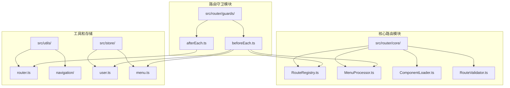
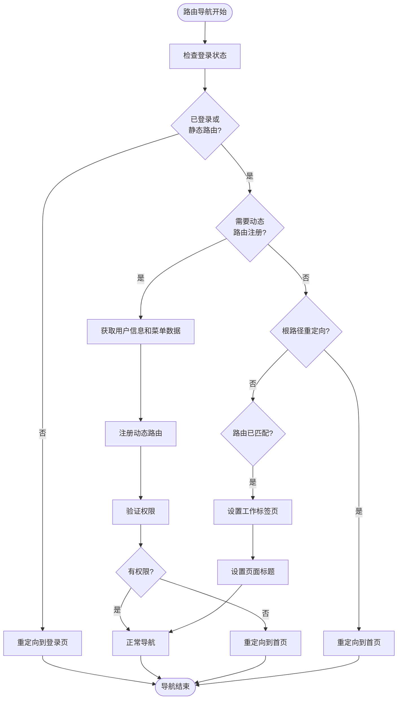
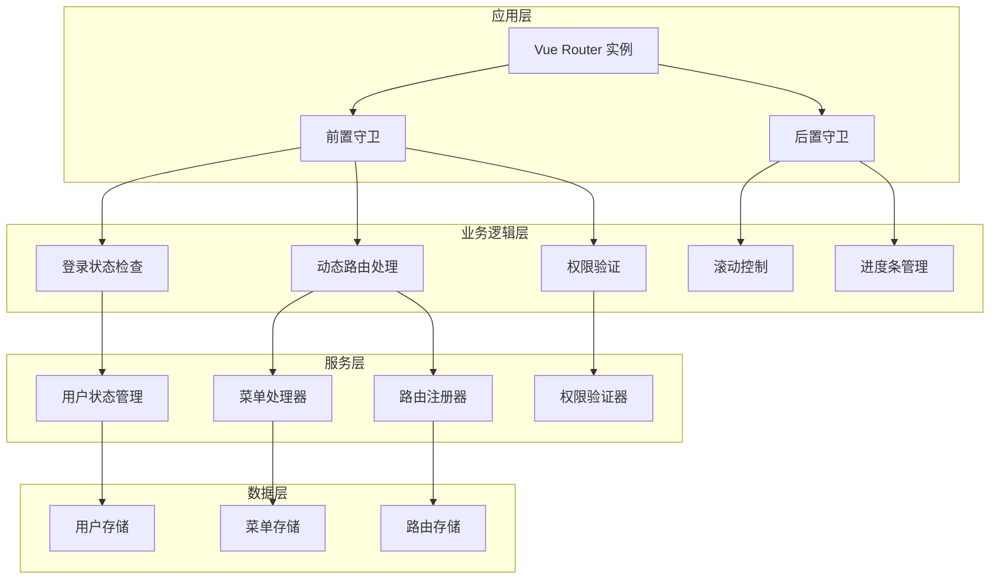
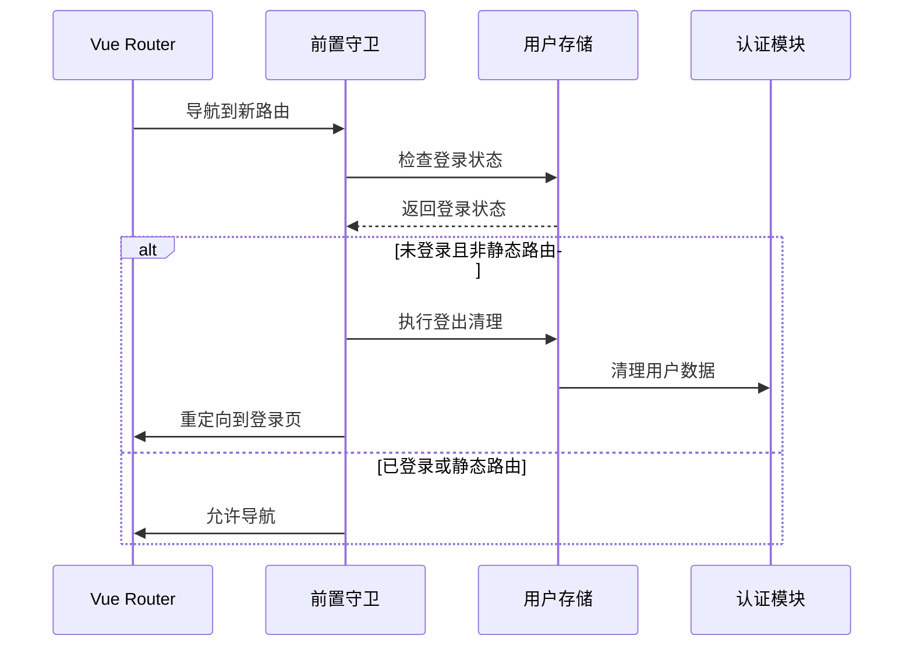
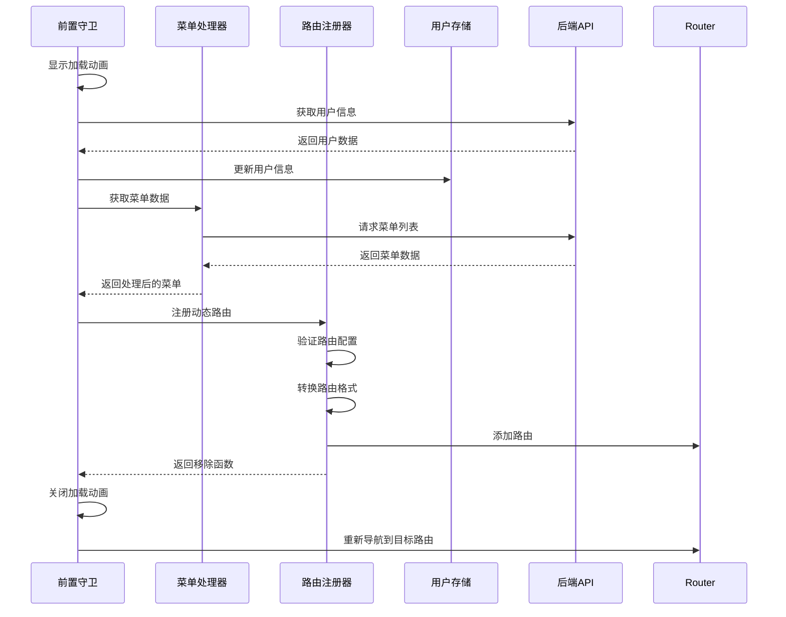
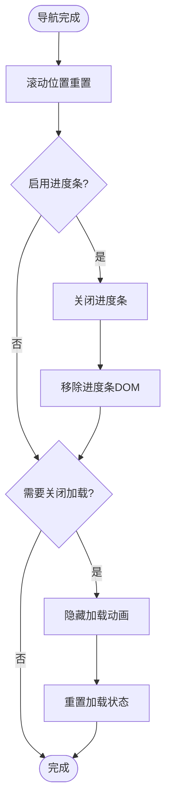
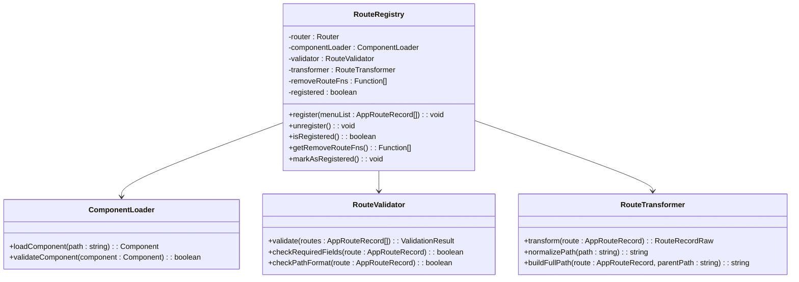
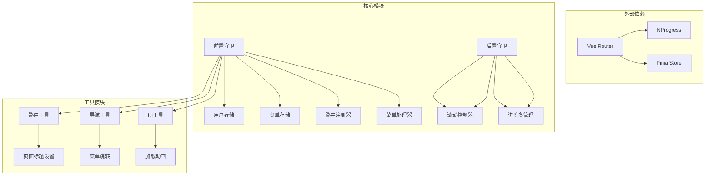

# 路由守卫

<cite>
**本文档引用的文件**
- [src/router/guards/beforeEach.ts](file://src/router/guards/beforeEach.ts)
- [src/router/guards/afterEach.ts](file://src/router/guards/afterEach.ts)
- [src/router/index.ts](file://src/router/index.ts)
- [src/store/modules/user.ts](file://src/store/modules/user.ts)
- [src/store/modules/menu.ts](file://src/store/modules/menu.ts)
- [src/router/core/RouteRegistry.ts](file://src/router/core/RouteRegistry.ts)
- [src/router/core/MenuProcessor.ts](file://src/router/core/MenuProcessor.ts)
- [src/utils/router.ts](file://src/utils/router.ts)
- [src/hooks/core/useCommon.ts](file://src/hooks/core/useCommon.ts)
- [src/utils/navigation/jump.ts](file://src/utils/navigation/jump.ts)
- [src/utils/ui/loading.ts](file://src/utils/ui/loading.ts)
- [src/router/routes/staticRoutes.ts](file://src/router/routes/staticRoutes.ts)
- [src/router/routesAlias.ts](file://src/router/routesAlias.ts)
</cite>

## 目录
1. [简介](#简介)
2. [项目结构](#项目结构)
3. [核心组件](#核心组件)
4. [架构概览](#架构概览)
5. [详细组件分析](#详细组件分析)
6. [依赖关系分析](#依赖关系分析)
7. [性能考虑](#性能考虑)
8. [故障排除指南](#故障排除指南)
9. [结论](#结论)

## 简介

Art Design Pro 的路由守卫系统是一个完整的导航控制解决方案，提供了强大的路由拦截、权限验证、动态路由注册和用户体验优化功能。该系统采用 Vue Router 的前置守卫和后置守卫机制，实现了细粒度的路由控制和状态管理。

路由守卫系统的核心价值在于：
- **安全性**：确保用户只能访问授权的路由
- **性能优化**：通过懒加载和动态路由减少初始包大小
- **用户体验**：提供流畅的导航体验和适当的加载指示
- **可维护性**：模块化的架构设计便于扩展和维护

## 项目结构

路由守卫相关的文件组织结构清晰，遵循功能模块化原则：



**图表来源**
- [src/router/guards/beforeEach.ts](file://src/router/guards/beforeEach.ts#L1-L361)
- [src/router/guards/afterEach.ts](file://src/router/guards/afterEach.ts#L1-L35)
- [src/router/core/RouteRegistry.ts](file://src/router/core/RouteRegistry.ts#L1-L91)

**章节来源**
- [src/router/guards/beforeEach.ts](file://src/router/guards/beforeEach.ts#L1-L50)
- [src/router/guards/afterEach.ts](file://src/router/guards/afterEach.ts#L1-L35)

## 核心组件

### 前置守卫 (beforeEach)

前置守卫是路由守卫系统的核心，负责在路由导航前执行各种验证和准备工作：

#### 主要功能
- **登录状态验证**：检查用户是否已登录，未登录则重定向到登录页面
- **动态路由注册**：首次访问时获取用户信息和菜单数据，动态注册路由
- **权限检查**：验证用户对目标路由的访问权限
- **页面标题设置**：根据路由元信息设置页面标题
- **根路径重定向**：将根路径重定向到配置的首页

#### 工作流程


**图表来源**
- [src/router/guards/beforeEach.ts](file://src/router/guards/beforeEach.ts#L118-L158)

### 后置守卫 (afterEach)

后置守卫在路由导航完成后执行，主要负责清理和用户体验优化：

#### 主要功能
- **页面滚动重置**：将页面滚动位置重置到顶部
- **进度条控制**：关闭顶部进度条
- **加载状态管理**：关闭动态路由加载动画

**章节来源**
- [src/router/guards/beforeEach.ts](file://src/router/guards/beforeEach.ts#L118-L297)
- [src/router/guards/afterEach.ts](file://src/router/guards/afterEach.ts#L1-L35)

## 架构概览

路由守卫系统采用分层架构设计，各层职责明确：



**图表来源**
- [src/router/index.ts](file://src/router/index.ts#L1-L24)
- [src/store/modules/user.ts](file://src/store/modules/user.ts#L1-L50)
- [src/store/modules/menu.ts](file://src/store/modules/menu.ts#L1-L50)

## 详细组件分析

### 前置守卫核心实现

前置守卫通过 `setupBeforeEachGuard` 函数进行初始化，该函数创建路由注册器实例并设置全局前置守卫。

#### 登录状态验证机制



**图表来源**
- [src/router/guards/beforeEach.ts](file://src/router/guards/beforeEach.ts#L164-L181)
- [src/store/modules/user.ts](file://src/store/modules/user.ts#L139-L175)

#### 动态路由注册流程

动态路由注册是前置守卫最复杂的部分，涉及多个步骤：



**图表来源**
- [src/router/guards/beforeEach.ts](file://src/router/guards/beforeEach.ts#L210-L275)
- [src/router/core/MenuProcessor.ts](file://src/router/core/MenuProcessor.ts#L22-L37)
- [src/router/core/RouteRegistry.ts](file://src/router/core/RouteRegistry.ts#L34-L58)

### 后置守卫实现

后置守卫相对简单，主要负责导航完成后的清理工作：



**图表来源**
- [src/router/guards/afterEach.ts](file://src/router/guards/afterEach.ts#L13-L33)

### 菜单处理器 (MenuProcessor)

菜单处理器负责菜单数据的获取、过滤和处理，支持前后端两种模式：

#### 前端模式 vs 后端模式

| 特性 | 前端模式 | 后端模式 |
|------|----------|----------|
| 数据来源 | 前端静态配置 | 后端API接口 |
| 权限控制 | 基于角色过滤 | 后端返回过滤结果 |
| 性能特点 | 初始加载快 | 按需加载 |
| 安全性 | 较低 | 较高 |
| 可配置性 | 高 | 中等 |

**章节来源**
- [src/router/core/MenuProcessor.ts](file://src/router/core/MenuProcessor.ts#L22-L62)

### 路由注册器 (RouteRegistry)

路由注册器是动态路由管理的核心组件：



**图表来源**
- [src/router/core/RouteRegistry.ts](file://src/router/core/RouteRegistry.ts#L16-L91)

**章节来源**
- [src/router/core/RouteRegistry.ts](file://src/router/core/RouteRegistry.ts#L16-L91)
- [src/router/core/MenuProcessor.ts](file://src/router/core/MenuProcessor.ts#L18-L242)

## 依赖关系分析

路由守卫系统的依赖关系复杂但层次清晰：



**图表来源**
- [src/router/guards/beforeEach.ts](file://src/router/guards/beforeEach.ts#L38-L54)
- [src/router/guards/afterEach.ts](file://src/router/guards/afterEach.ts#L1-L8)

### 关键依赖说明

1. **Vue Router**：提供路由导航和守卫机制
2. **Pinia**：状态管理，用于用户信息和菜单数据存储
3. **NProgress**：顶部进度条，提供视觉反馈
4. **Element Plus**：UI组件库，提供加载动画组件

**章节来源**
- [src/router/guards/beforeEach.ts](file://src/router/guards/beforeEach.ts#L38-L54)
- [src/router/guards/afterEach.ts](file://src/router/guards/afterEach.ts#L1-L8)

## 性能考虑

路由守卫系统在设计时充分考虑了性能优化：

### 懒加载机制
- **组件懒加载**：通过 `ComponentLoader` 实现按需加载
- **路由懒加载**：动态路由只在需要时才加载
- **菜单数据懒加载**：首次访问时才获取菜单数据

### 缓存策略
- **用户信息缓存**：登录后缓存用户信息，避免重复请求
- **路由注册状态缓存**：标记路由已注册，避免重复注册
- **菜单数据缓存**：在用户会话期间缓存菜单数据

### 性能监控
- **加载时间监控**：记录路由切换的耗时
- **内存使用监控**：定期清理不再使用的路由
- **错误率监控**：监控路由守卫的错误发生率

## 故障排除指南

### 常见问题及解决方案

#### 1. 无限重定向循环

**症状**：页面不断在两个路由之间跳转

**原因分析**：
- 前置守卫中存在逻辑错误
- 静态路由配置冲突
- 权限验证逻辑问题

**排查方法**：
```typescript
// 在前置守卫中添加调试日志
console.log('[RouteGuard] 导航到:', to.path);
console.log('[RouteGuard] 来自:', from.path);
console.log('[RouteGuard] 登录状态:', userStore.isLogin);
```

**解决方案**：
- 检查静态路由配置，确保不与动态路由冲突
- 验证权限验证逻辑，避免循环检查
- 使用 `next(false)` 取消不必要的导航

#### 2. 动态路由注册失败

**症状**：页面空白或404错误

**原因分析**：
- 后端API接口不可用
- 菜单数据格式错误
- 组件路径配置错误

**排查步骤**：
```typescript
// 检查API响应
try {
    const menuList = await menuProcessor.getMenuList();
    console.log('[RouteGuard] 菜单数据:', menuList);
} catch (error) {
    console.error('[RouteGuard] 获取菜单失败:', error);
}

// 验证路由配置
const validationResult = routeRegistry?.validator.validate(menuList);
if (!validationResult.valid) {
    console.error('[RouteGuard] 路由验证失败:', validationResult.errors);
}
```

#### 3. 加载动画卡住

**症状**：加载动画一直显示不消失

**原因分析**：
- 异常处理不完善
- 异步操作超时
- 状态重置逻辑错误

**解决方案**：
```typescript
// 确保在所有情况下都重置加载状态
function closeLoading(): void {
    if (pendingLoading) {
        nextTick(() => {
            loadingService.hideLoading();
            pendingLoading = false;
        });
    }
}
```

#### 4. 权限验证失效

**症状**：用户可以访问未授权的页面

**排查方法**：
- 检查 `RoutePermissionValidator` 的实现
- 验证菜单数据中的权限标识
- 确认用户角色信息正确

**章节来源**
- [src/router/guards/beforeEach.ts](file://src/router/guards/beforeEach.ts#L275-L296)
- [src/router/guards/beforeEach.ts](file://src/router/guards/beforeEach.ts#L348-L360)

### 调试技巧

#### 1. 启用详细日志
```typescript
// 在开发环境中启用详细日志
if (process.env.NODE_ENV === 'development') {
    console.log('[RouteGuard] 详细日志:', {
        to: to.path,
        from: from.path,
        isLogin: userStore.isLogin,
        registered: routeRegistry?.isRegistered()
    });
}
```

#### 2. 使用浏览器开发者工具
- **Network面板**：监控API请求
- **Console面板**：查看错误日志
- **Application面板**：检查存储状态

#### 3. 状态检查工具
```typescript
// 检查关键状态
function debugRouteState() {
    const userStore = useUserStore();
    const menuStore = useMenuStore();
    const settingStore = useSettingStore();
    
    console.group('路由守卫状态');
    console.log('用户登录状态:', userStore.isLogin);
    console.log('路由注册状态:', routeRegistry?.isRegistered());
    console.log('菜单数据:', menuStore.menuList);
    console.log('设置状态:', settingStore.$state);
    console.groupEnd();
}
```

## 结论

Art Design Pro 的路由守卫系统是一个设计精良、功能完备的导航控制系统。它通过前置守卫和后置守卫的协同工作，实现了安全、高效、用户体验良好的路由管理。

### 主要优势

1. **安全性**：完善的权限验证和登录状态检查
2. **性能**：懒加载和缓存策略优化加载性能
3. **可维护性**：模块化设计便于扩展和维护
4. **用户体验**：流畅的导航体验和适当的加载指示

### 最佳实践建议

1. **合理使用静态路由**：将不需要权限验证的路由设为静态路由
2. **优化API响应**：确保菜单数据API的响应速度
3. **完善错误处理**：为各种异常情况提供友好的错误提示
4. **定期性能监控**：监控路由守卫的性能指标

通过深入理解路由守卫的工作原理和最佳实践，开发者可以更好地利用这个系统构建安全、高效的单页应用。