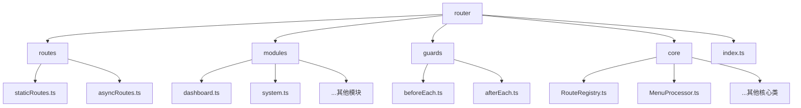
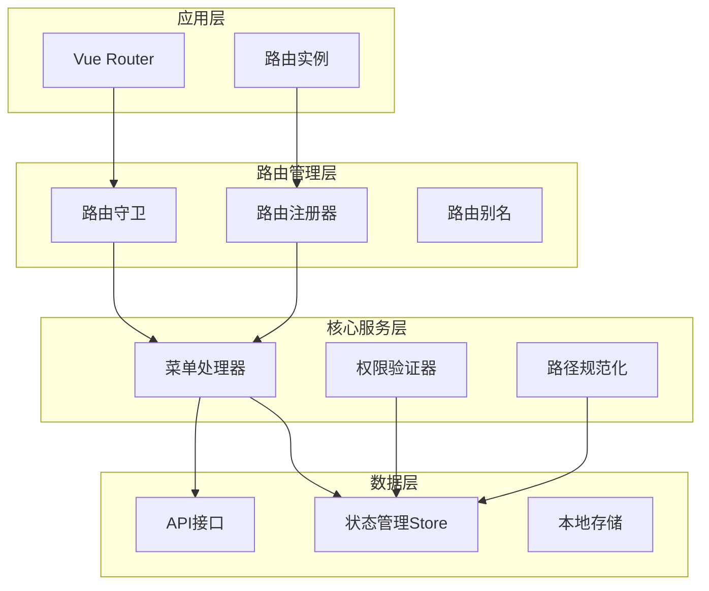
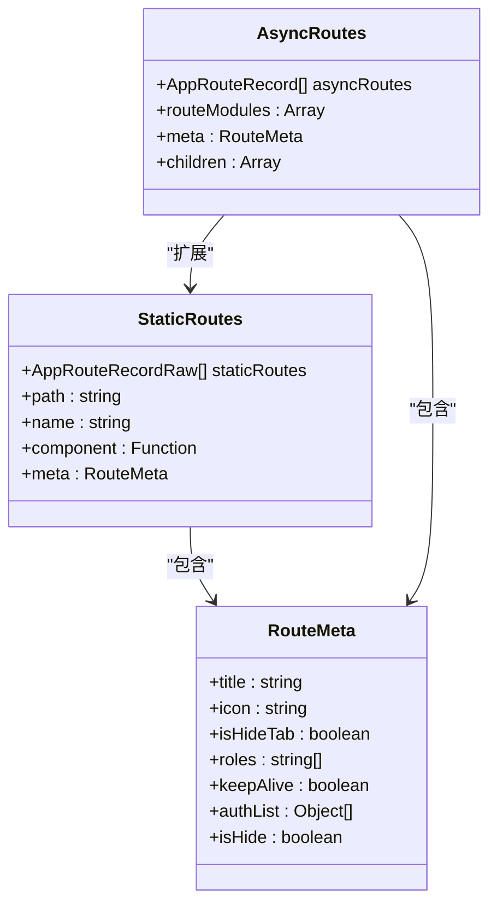
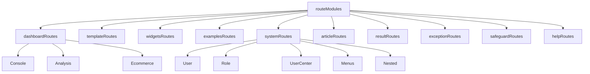
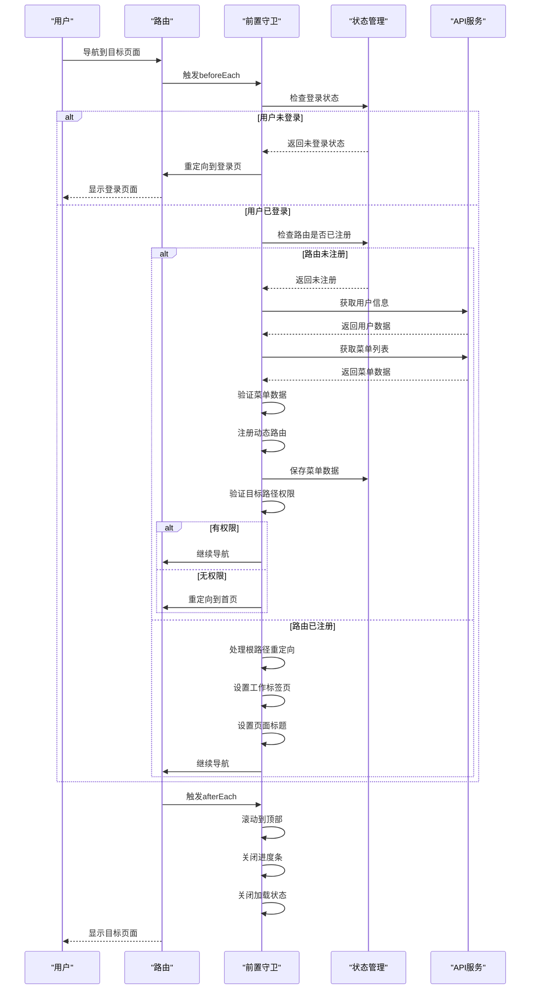
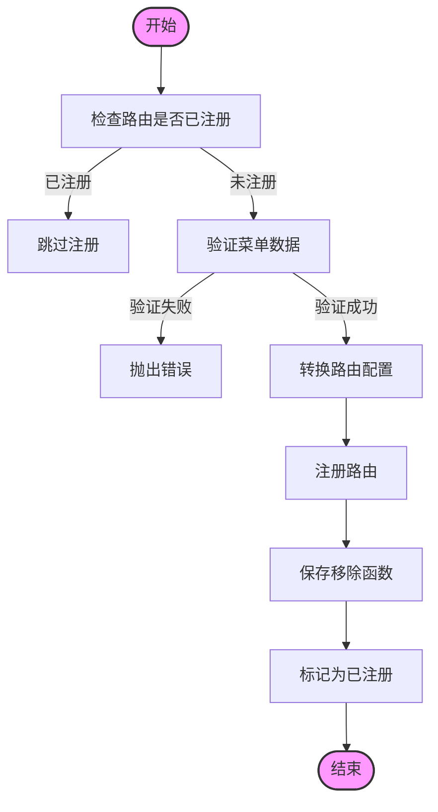
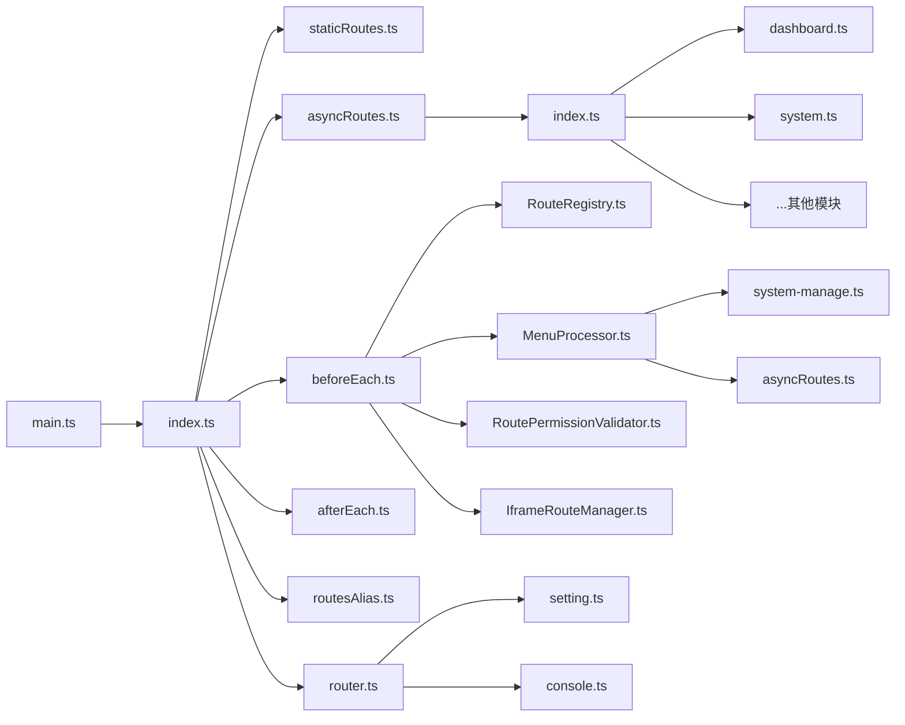

# 路由系统

<cite>
**本文档引用的文件**
- [index.ts](file://src/router/index.ts)
- [staticRoutes.ts](file://src/router/routes/staticRoutes.ts)
- [asyncRoutes.ts](file://src/router/routes/asyncRoutes.ts)
- [routesAlias.ts](file://src/router/routesAlias.ts)
- [beforeEach.ts](file://src/router/guards/beforeEach.ts)
- [afterEach.ts](file://src/router/guards/afterEach.ts)
- [index.ts](file://src/router/modules/index.ts)
- [dashboard.ts](file://src/router/modules/dashboard.ts)
- [system.ts](file://src/router/modules/system.ts)
- [RouteRegistry.ts](file://src/router/core/RouteRegistry.ts)
- [MenuProcessor.ts](file://src/router/core/MenuProcessor.ts)
- [router.ts](file://src/utils/router.ts)
- [index.ts](file://src/types/router/index.ts)
- [main.ts](file://src/main.ts)
</cite>

## 目录
1. [简介](#简介)
2. [项目结构](#项目结构)
3. [核心组件](#核心组件)
4. [架构概述](#架构概述)
5. [详细组件分析](#详细组件分析)
6. [依赖分析](#依赖分析)
7. [性能考虑](#性能考虑)
8. [故障排除指南](#故障排除指南)
9. [结论](#结论)

## 简介
本项目采用基于Vue Router的完整路由系统，实现了静态路由、动态路由和异步路由的综合管理。路由系统不仅支持基本的页面导航功能，还集成了权限控制、菜单管理、路由守卫等高级特性。系统通过模块化组织策略将路由配置分散到不同功能模块中，提高了代码的可维护性和扩展性。路由别名、路由元信息和嵌套路由等特性的使用，使得路由配置更加灵活和强大。

## 项目结构
项目路由系统采用分层和模块化的组织结构，将不同类型的路由配置分离到不同的目录和文件中，实现了清晰的关注点分离。

**Diagram sources**
- [src/router](file://src/router)

**Section sources**
- [src/router](file://src/router)

## 核心组件
路由系统的核心组件包括路由实例、静态路由配置、动态路由配置、路由守卫和路由工具函数。这些组件协同工作，实现了完整的路由管理功能。路由实例通过createRouter创建，使用createWebHashHistory作为路由历史模式。静态路由在应用启动时直接注册，而动态路由则根据用户权限在运行时动态注册。路由守卫负责导航过程中的权限验证和状态管理。

**Section sources**
- [index.ts](file://src/router/index.ts)
- [staticRoutes.ts](file://src/router/routes/staticRoutes.ts)
- [asyncRoutes.ts](file://src/router/routes/asyncRoutes.ts)
- [beforeEach.ts](file://src/router/guards/beforeEach.ts)
- [afterEach.ts](file://src/router/guards/afterEach.ts)

## 架构概述
路由系统采用分层架构设计，从上到下分为应用层、路由管理层、核心服务层和数据层。应用层通过Vue Router提供路由功能；路由管理层负责路由的注册、验证和管理；核心服务层提供菜单处理、权限验证等服务；数据层则通过API和Store管理路由相关的数据。

**Diagram sources**
- [index.ts](file://src/router/index.ts)
- [beforeEach.ts](file://src/router/guards/beforeEach.ts)
- [RouteRegistry.ts](file://src/router/core/RouteRegistry.ts)
- [MenuProcessor.ts](file://src/router/core/MenuProcessor.ts)

## 详细组件分析
### 静态路由与动态路由配置
系统将路由分为静态路由和动态路由两种类型。静态路由是不需要权限就能访问的路由，如登录页、注册页和错误页面。动态路由是需要权限才能访问的路由，用于渲染菜单和根据权限动态加载。

**Diagram sources**
- [staticRoutes.ts](file://src/router/routes/staticRoutes.ts)
- [asyncRoutes.ts](file://src/router/routes/asyncRoutes.ts)
- [index.ts](file://src/types/router/index.ts)

### 路由模块化组织策略
路由系统采用模块化组织策略，将不同功能模块的路由配置分离到独立的文件中。这种设计提高了代码的可维护性，使得每个模块的路由配置可以独立开发和测试。

**Diagram sources**
- [index.ts](file://src/router/modules/index.ts)
- [dashboard.ts](file://src/router/modules/dashboard.ts)
- [system.ts](file://src/router/modules/system.ts)

### 路由守卫工作流程
路由守卫是路由系统的核心控制机制，负责在导航过程中执行权限验证、状态管理和用户体验优化等任务。前置守卫在导航开始前执行，后置守卫在导航完成后执行。

**Diagram sources**
- [beforeEach.ts](file://src/router/guards/beforeEach.ts)
- [afterEach.ts](file://src/router/guards/afterEach.ts)

### 路由注册与权限控制
路由注册器负责动态路由的注册、验证和管理。它与菜单处理器协同工作，根据用户权限动态注册路由，实现细粒度的权限控制。

**Diagram sources**
- [RouteRegistry.ts](file://src/router/core/RouteRegistry.ts)
- [MenuProcessor.ts](file://src/router/core/MenuProcessor.ts)

## 依赖分析
路由系统与其他模块存在紧密的依赖关系，这些依赖关系构成了系统的整体架构。

**Diagram sources**
- [package.json](file://package.json)
- [src/router](file://src/router)

**Section sources**
- [package.json](file://package.json)
- [src/router](file://src/router)

## 性能考虑
路由系统在设计时充分考虑了性能优化，通过路由懒加载、缓存机制和高效的路由匹配算法来提升用户体验。

1. **路由懒加载**: 所有路由组件都采用动态导入方式，实现按需加载，减少初始加载时间。
2. **进度条优化**: 使用NProgress库显示导航进度，配置了合适的动画速度和效果，避免过度干扰用户。
3. **缓存策略**: 通过keepAlive元信息控制页面缓存，避免重复渲染和数据请求。
4. **批量注册**: 动态路由采用批量注册方式，减少路由更新的次数，提高性能。
5. **错误处理**: 完善的错误处理机制避免了因单个路由问题导致整个应用崩溃。

## 故障排除指南
### 常见路由问题及解决方案
1. **路由无法访问**: 检查路由path和name是否与现有路由冲突，确保没有重复定义。
2. **权限问题**: 确认用户角色是否包含访问该路由所需的权限，检查roles元信息配置。
3. **菜单不显示**: 检查路由的isHide元信息是否设置为true，确认用户角色有权限查看该菜单。
4. **页面标题不正确**: 检查meta.title配置是否正确，确认国际化键值是否存在。
5. **嵌套路由失效**: 确保父路由正确配置了children属性，子路由path不应以/开头。

### 调试技巧
1. 在浏览器控制台查看路由相关的错误信息和警告。
2. 使用Vue Devtools检查当前路由状态和路由匹配情况。
3. 在路由守卫中添加console.log调试信息，跟踪导航流程。
4. 检查网络请求，确认菜单数据API是否正常返回。
5. 查看浏览器地址栏和页面标题的变化，验证路由跳转是否正确。

**Section sources**
- [beforeEach.ts](file://src/router/guards/beforeEach.ts)
- [utils/router.ts](file://src/utils/router.ts)

## 结论
本路由系统采用现代化的设计理念和技术栈，实现了功能完整、性能优良、易于维护的路由管理方案。通过静态路由和动态路由的结合，满足了不同场景下的路由需求。模块化的组织策略提高了代码的可维护性，路由守卫和权限控制机制确保了系统的安全性。系统还充分考虑了用户体验，通过进度条、页面标题等细节提升了应用的整体品质。未来可以进一步优化路由预加载策略，引入更智能的缓存机制，持续提升应用性能。