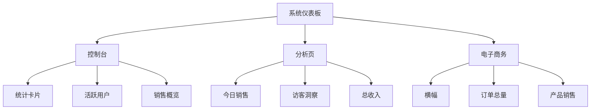
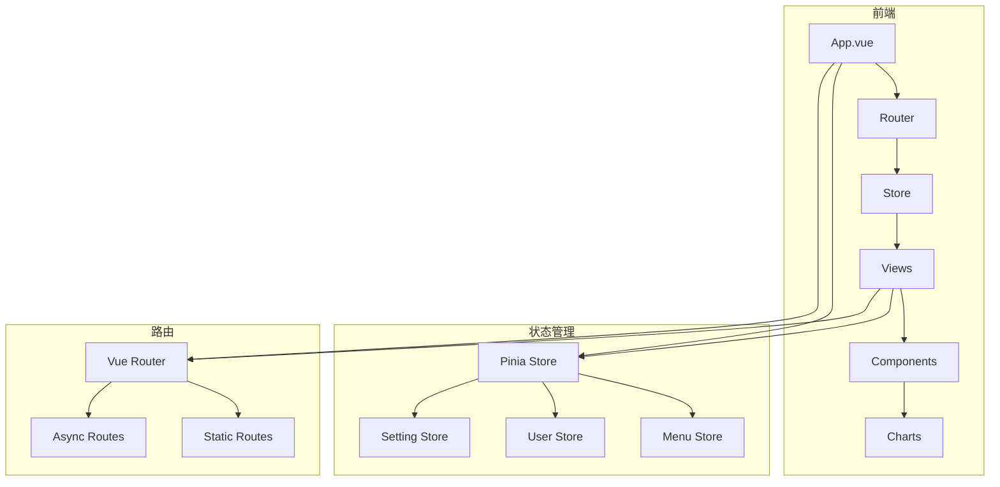
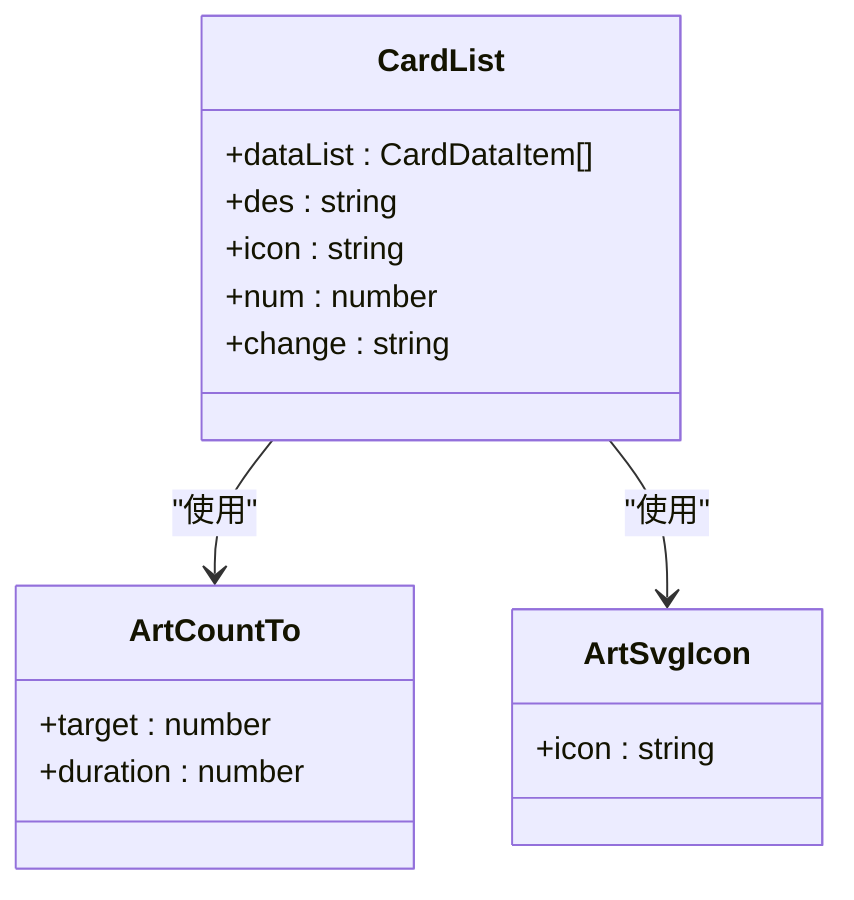
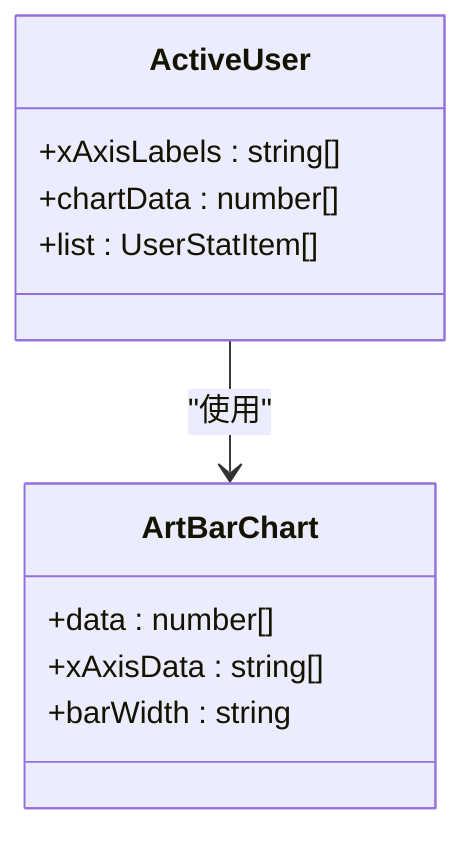
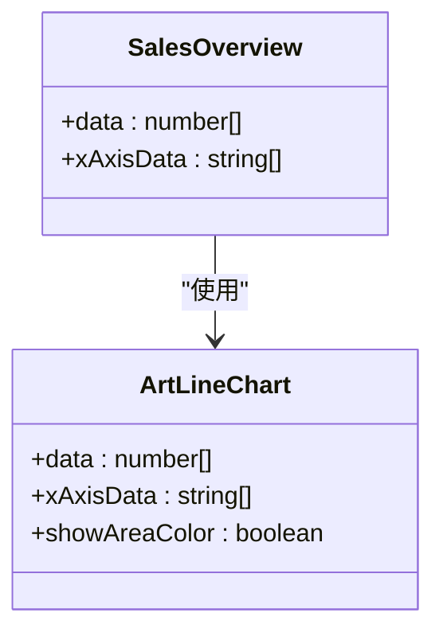
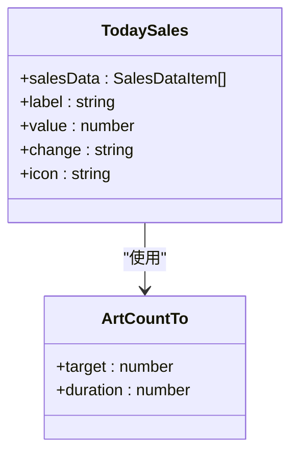
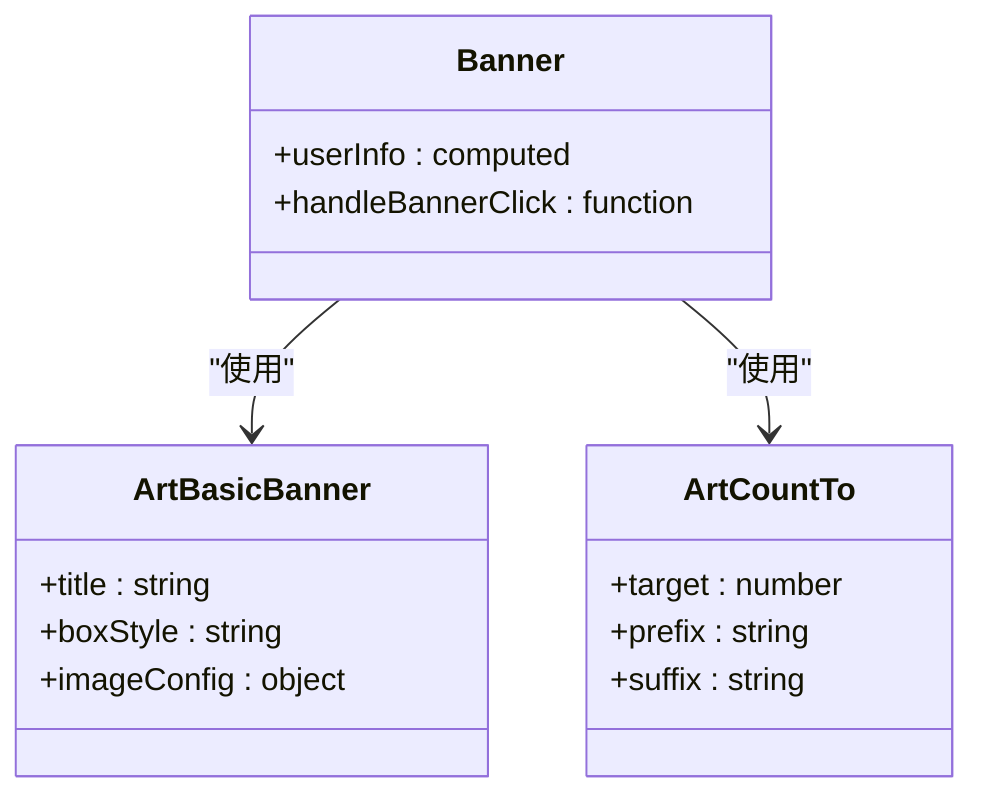
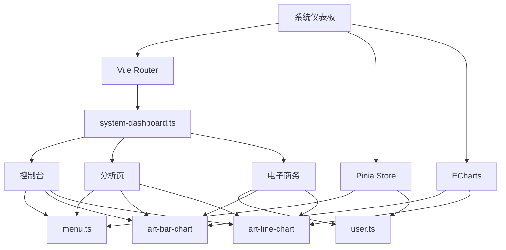

# 系统仪表板

<cite>
**本文档引用的文件**  
- [system-dashboard.ts](file://src/router/modules/system-dashboard.ts)
- [console/index.vue](file://src/views/dashboard/console/index.vue)
- [analysis/index.vue](file://src/views/dashboard/analysis/index.vue)
- [ecommerce/index.vue](file://src/views/dashboard/ecommerce/index.vue)
- [card-list.vue](file://src/views/dashboard/console/modules/card-list.vue)
- [active-user.vue](file://src/views/dashboard/console/modules/active-user.vue)
- [sales-overview.vue](file://src/views/dashboard/console/modules/sales-overview.vue)
- [today-sales.vue](file://src/views/dashboard/analysis/modules/today-sales.vue)
- [banner.vue](file://src/views/dashboard/ecommerce/modules/banner.vue)
- [art-bar-chart/index.vue](file://src/components/core/charts/art-bar-chart/index.vue)
- [art-line-chart/index.vue](file://src/components/core/charts/art-line-chart/index.vue)
- [menu.ts](file://src/store/modules/menu.ts)
- [main.ts](file://src/main.ts)
</cite>

## 目录

1. [简介](#简介)
2. [项目结构](#项目结构)
3. [核心组件](#核心组件)
4. [架构概览](#架构概览)
5. [详细组件分析](#详细组件分析)
6. [依赖分析](#依赖分析)
7. [性能考虑](#性能考虑)
8. [故障排除指南](#故障排除指南)
9. [结论](#结论)

## 简介

系统仪表板是为系统后台管理员（R_SUPER 角色）设计的综合管理平台，提供控制台、API 文档和系统管理功能。该仪表板集成了多种数据可视化组件，包括统计卡片、柱状图、折线图等，用于展示关键业务指标。系统采用 Vue 3 + TypeScript 技术栈，结合 Pinia 进行状态管理，Vue Router 实现路由控制，并使用 ECharts 提供强大的图表渲染能力。

## 项目结构

系统仪表板的文件结构遵循模块化设计原则，主要分为前端视图、路由配置、状态管理等部分。仪表板相关组件分布在 views 目录下，按功能划分为 console（控制台）、analysis（分析）和 ecommerce（电子商务）三个主要页面。

**图表来源**

- [console/index.vue](file://src/views/dashboard/console/index.vue)
- [analysis/index.vue](file://src/views/dashboard/analysis/index.vue)
- [ecommerce/index.vue](file://src/views/dashboard/ecommerce/index.vue)

**章节来源**

- [console/index.vue](file://src/views/dashboard/console/index.vue#L1-L42)
- [analysis/index.vue](file://src/views/dashboard/analysis/index.vue#L1-L51)
- [ecommerce/index.vue](file://src/views/dashboard/ecommerce/index.vue#L1-L78)

## 核心组件

系统仪表板的核心组件包括控制台、分析页和电子商务页面，每个页面由多个可复用的模块化组件构成。这些组件通过 ElRow 和 ElCol 进行响应式布局，确保在不同设备上都能良好显示。数据可视化通过 art-bar-chart 和 art-line-chart 等封装的 ECharts 组件实现，提供流畅的动画效果和交互体验。

**章节来源**

- [console/index.vue](file://src/views/dashboard/console/index.vue#L1-L42)
- [analysis/index.vue](file://src/views/dashboard/analysis/index.vue#L1-L51)
- [ecommerce/index.vue](file://src/views/dashboard/ecommerce/index.vue#L1-L78)

## 架构概览

系统采用前后端分离架构，前端基于 Vue 3 组合式 API，使用 Pinia 进行状态管理，Vue Router 实现路由控制。仪表板的权限控制通过路由元信息中的 roles 字段实现，确保只有系统管理员角色（R_SUPER）才能访问。

**图表来源**

- [main.ts](file://src/main.ts#L1-L25)
- [menu.ts](file://src/store/modules/menu.ts#L1-L110)
- [index.ts](file://src/router/index.ts#L1-L24)

## 详细组件分析

### 控制台分析

控制台页面是系统管理员的主要工作界面，包含多个数据可视化模块，提供系统运行状态的全面概览。

#### 统计卡片组件

**图表来源**

- [card-list.vue](file://src/views/dashboard/console/modules/card-list.vue#L1-L75)
- [console/index.vue](file://src/views/dashboard/console/index.vue#L32)

#### 活跃用户组件

**图表来源**

- [active-user.vue](file://src/views/dashboard/console/modules/active-user.vue#L1-L48)
- [art-bar-chart/index.vue](file://src/components/core/charts/art-bar-chart/index.vue#L1-L204)

#### 销售概览组件

**图表来源**

- [sales-overview.vue](file://src/views/dashboard/console/modules/sales-overview.vue#L1-L44)
- [art-line-chart/index.vue](file://src/components/core/charts/art-line-chart/index.vue#L1-L372)

**章节来源**

- [console/index.vue](file://src/views/dashboard/console/index.vue#L1-L42)
- [card-list.vue](file://src/views/dashboard/console/modules/card-list.vue#L1-L75)
- [active-user.vue](file://src/views/dashboard/console/modules/active-user.vue#L1-L48)
- [sales-overview.vue](file://src/views/dashboard/console/modules/sales-overview.vue#L1-L44)

### 分析页分析

分析页提供更深入的业务数据分析，包含今日销售、访客洞察、总收入等多个模块。

#### 今日销售组件

**图表来源**

- [today-sales.vue](file://src/views/dashboard/analysis/modules/today-sales.vue#L1-L87)

**章节来源**

- [analysis/index.vue](file://src/views/dashboard/analysis/index.vue#L1-L51)
- [today-sales.vue](file://src/views/dashboard/analysis/modules/today-sales.vue#L1-L87)

### 电子商务分析

电子商务页面为电商场景提供专门的数据展示，包含横幅、订单总量、产品销售等模块。

#### 横幅组件

**图表来源**

- [banner.vue](file://src/views/dashboard/ecommerce/modules/banner.vue#L1-L66)

**章节来源**

- [ecommerce/index.vue](file://src/views/dashboard/ecommerce/index.vue#L1-L78)
- [banner.vue](file://src/views/dashboard/ecommerce/modules/banner.vue#L1-L66)

## 依赖分析

系统仪表板的组件之间存在清晰的依赖关系，通过模块化设计实现了高内聚低耦合。核心依赖包括路由控制、状态管理和图表渲染。

**图表来源**

- [system-dashboard.ts](file://src/router/modules/system-dashboard.ts#L1-L76)
- [menu.ts](file://src/store/modules/menu.ts#L1-L110)
- [art-bar-chart/index.vue](file://src/components/core/charts/art-bar-chart/index.vue#L1-L204)
- [art-line-chart/index.vue](file://src/components/core/charts/art-line-chart/index.vue#L1-L372)

**章节来源**

- [system-dashboard.ts](file://src/router/modules/system-dashboard.ts#L1-L76)
- [menu.ts](file://src/store/modules/menu.ts#L1-L110)

## 性能考虑

系统在性能方面进行了多项优化，包括图表动画的阶梯式加载、数据监听的防抖处理、以及资源的按需加载。图表组件使用了虚拟滚动和数据分片技术，确保在大数据量下仍能保持流畅的用户体验。同时，通过 Pinia 的状态管理，避免了不必要的组件重新渲染。

## 故障排除指南

当系统仪表板出现显示异常时，可按照以下步骤进行排查：

1. 检查用户角色是否为 R_SUPER，确保有访问权限
2. 查看浏览器控制台是否有 JavaScript 错误
3. 检查网络请求是否正常，特别是数据接口
4. 验证图表数据格式是否符合预期
5. 确认 ECharts 库是否正确加载

**章节来源**

- [system-dashboard.ts](file://src/router/modules/system-dashboard.ts#L1-L76)
- [main.ts](file://src/main.ts#L1-L25)

## 结论

系统仪表板是一个功能完整、架构清晰的管理界面，通过模块化设计和组件复用，实现了高效的数据展示和交互体验。系统采用现代前端技术栈，具有良好的可维护性和扩展性，为系统管理员提供了全面的系统监控和管理能力。
