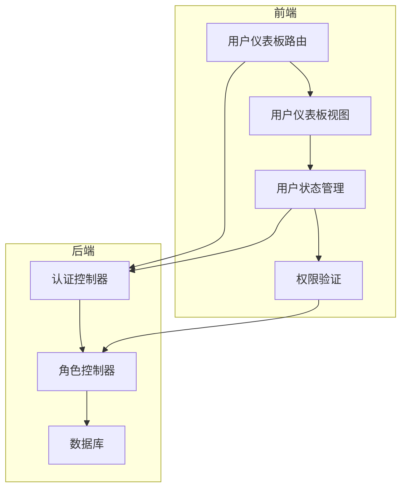
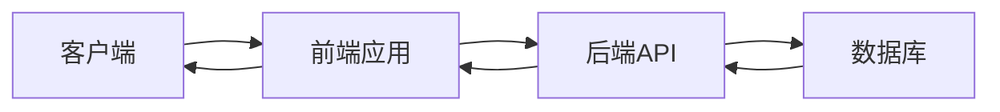
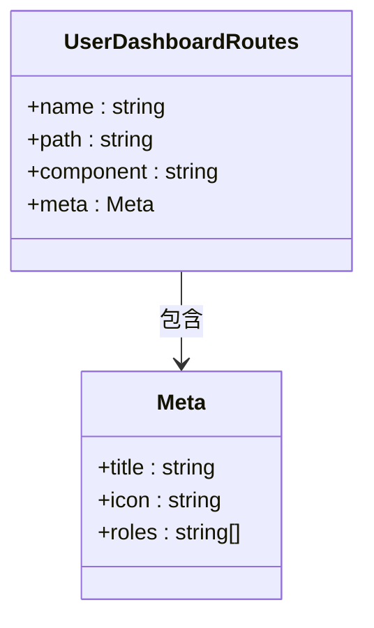
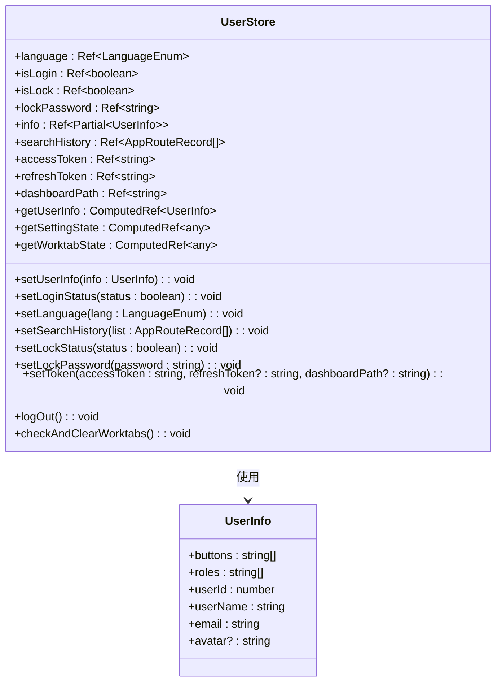
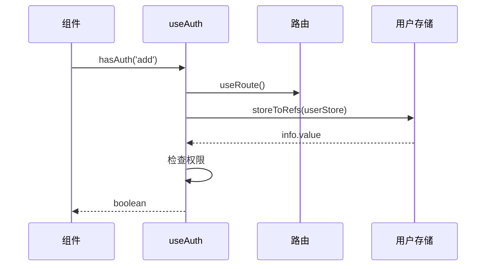
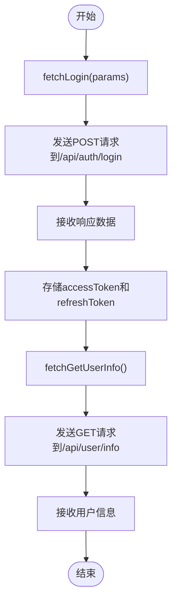
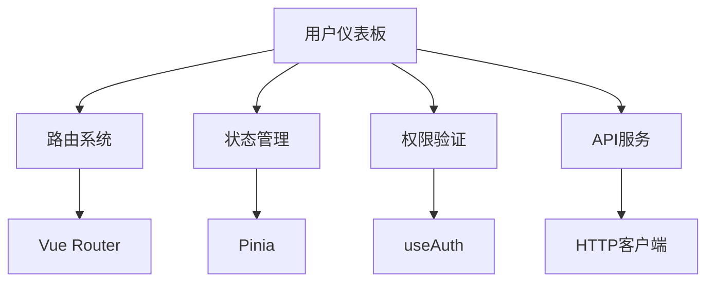

# 用户仪表板

<cite>
**本文档引用的文件**
- [user-dashboard.ts](file://src/router/modules/user-dashboard.ts)
- [index.vue](file://src/views/user/dashboard/console/index.vue)
- [user.ts](file://src/store/modules/user.ts)
- [useAuth.ts](file://src/hooks/core/useAuth.ts)
- [auth.ts](file://src/api/auth.ts)
- [api.d.ts](file://src/types/api/api.d.ts)
- [init-database.sql](file://scripts/init-database.sql)
- [role.controller.ts](file://backend/src/controllers/role.controller.ts)
</cite>

## 目录

1. [简介](#简介)
2. [项目结构](#项目结构)
3. [核心组件](#核心组件)
4. [架构概述](#架构概述)
5. [详细组件分析](#详细组件分析)
6. [依赖分析](#依赖分析)
7. [性能考虑](#性能考虑)
8. [故障排除指南](#故障排除指南)
9. [结论](#结论)
10. [附录](#附录)（如有必要）

## 简介

用户仪表板是虚拟币数据分析系统的核心功能模块，为系统管理员（R_ADMIN）和普通用户（R_USER）提供工作台界面。该模块通过角色权限控制访问，实现了用户状态管理、权限验证和路由控制等核心功能。系统通过JWT认证机制确保安全性，并根据用户角色动态分配控制台路径。

## 项目结构

用户仪表板的实现涉及前端和后端多个模块的协同工作。前端主要包含路由配置、视图组件和状态管理，后端则负责用户认证、角色管理和数据持久化。

**图表来源**

- [user-dashboard.ts](file://src/router/modules/user-dashboard.ts#L1-L29)
- [index.vue](file://src/views/user/dashboard/console/index.vue#L1-L31)
- [user.ts](file://src/store/modules/user.ts#L1-L249)
- [role.controller.ts](file://backend/src/controllers/role.controller.ts#L51-L101)

**章节来源**

- [user-dashboard.ts](file://src/router/modules/user-dashboard.ts#L1-L29)
- [index.vue](file://src/views/user/dashboard/console/index.vue#L1-L31)

## 核心组件

用户仪表板的核心组件包括路由配置、视图组件、状态管理和权限验证。路由配置定义了用户仪表板的访问路径和权限要求，视图组件提供了用户界面，状态管理维护用户会话信息，权限验证确保只有授权用户才能访问特定功能。

**章节来源**

- [user-dashboard.ts](file://src/router/modules/user-dashboard.ts#L1-L29)
- [index.vue](file://src/views/user/dashboard/console/index.vue#L1-L31)
- [user.ts](file://src/store/modules/user.ts#L1-L249)
- [useAuth.ts](file://src/hooks/core/useAuth.ts#L1-L75)

## 架构概述

用户仪表板采用前后端分离架构，前端使用Vue 3和Pinia实现组件化开发和状态管理，后端使用Express框架提供RESTful API。系统通过JWT进行身份认证，角色权限控制访问资源。

**图表来源**

- [user-dashboard.ts](file://src/router/modules/user-dashboard.ts#L1-L29)
- [auth.ts](file://src/api/auth.ts#L1-L30)
- [role.controller.ts](file://backend/src/controllers/role.controller.ts#L51-L101)

## 详细组件分析

### 用户仪表板路由分析

用户仪表板路由配置定义了访问路径、组件映射和权限要求。路由模块确保只有具有R_ADMIN或R_USER角色的用户才能访问该工作台。

**图表来源**

- [user-dashboard.ts](file://src/router/modules/user-dashboard.ts#L1-L29)

### 用户状态管理分析

用户状态管理模块使用Pinia存储用户登录状态、个人信息、语言设置等。该模块实现了状态持久化，确保用户刷新页面后仍保持登录状态。

**图表来源**

- [user.ts](file://src/store/modules/user.ts#L50-L249)

### 权限验证分析

权限验证模块提供统一的权限检查功能，支持前端和后端两种权限模式。该模块根据用户角色和权限标识决定是否显示特定功能。

**图表来源**

- [useAuth.ts](file://src/hooks/core/useAuth.ts#L43-L74)

**章节来源**

- [useAuth.ts](file://src/hooks/core/useAuth.ts#L1-L75)

### 认证接口分析

认证接口提供用户登录和获取用户信息的功能。系统通过HTTP请求与后端API交互，获取访问令牌和用户信息。

**图表来源**

- [auth.ts](file://src/api/auth.ts#L8-L29)

**章节来源**

- [auth.ts](file://src/api/auth.ts#L1-L30)

## 依赖分析

用户仪表板模块依赖于多个核心组件，包括路由系统、状态管理、权限验证和API服务。这些组件通过明确的接口进行交互，确保系统的可维护性和扩展性。

**图表来源**

- [user-dashboard.ts](file://src/router/modules/user-dashboard.ts#L1-L29)
- [user.ts](file://src/store/modules/user.ts#L50-L249)
- [useAuth.ts](file://src/hooks/core/useAuth.ts#L43-L74)
- [auth.ts](file://src/api/auth.ts#L8-L29)

**章节来源**

- [user-dashboard.ts](file://src/router/modules/user-dashboard.ts#L1-L29)
- [user.ts](file://src/store/modules/user.ts#L1-L249)
- [useAuth.ts](file://src/hooks/core/useAuth.ts#L1-L75)
- [auth.ts](file://src/api/auth.ts#L1-L30)

## 性能考虑

用户仪表板在设计时考虑了性能优化，包括状态持久化减少重复请求、权限验证的缓存机制以及组件的按需加载。系统通过localStorage存储用户状态，避免每次访问都重新认证。

## 故障排除指南

当用户无法访问仪表板时，应首先检查用户角色是否为R_ADMIN或R_USER。如果角色正确但仍无法访问，检查JWT令牌是否有效，以及后端服务是否正常运行。对于权限问题，确认用户角色的dashboardPath配置是否正确。

**章节来源**

- [user.ts](file://src/store/modules/user.ts#L153-L188)
- [role.controller.ts](file://backend/src/controllers/role.controller.ts#L51-L101)

## 结论

用户仪表板是一个功能完整、安全可靠的系统模块，通过角色权限控制和JWT认证机制确保了系统的安全性。该模块的设计考虑了可扩展性和维护性，为未来功能的添加提供了良好的基础。

## 附录

### 角色与控制台路径映射

| 角色代码 | 角色名称   | 控制台路径                |
| -------- | ---------- | ------------------------- |
| R_SUPER  | 超级管理员 | /system/dashboard/console |
| R_ADMIN  | 系统管理员 | /user/dashboard/console   |
| R_USER   | 普通用户   | /user/dashboard/console   |

**章节来源**

- [init-database.sql](file://scripts/init-database.sql#L35-L39)
