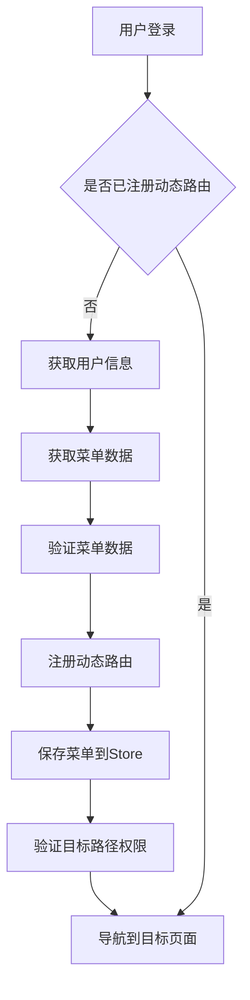
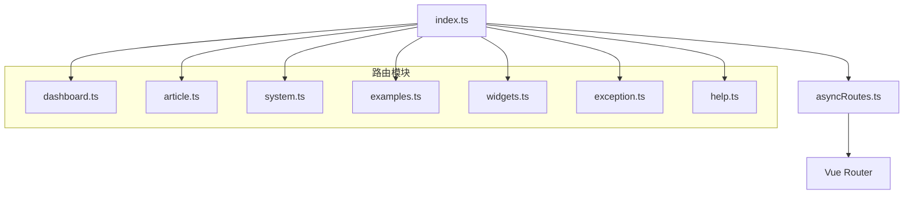
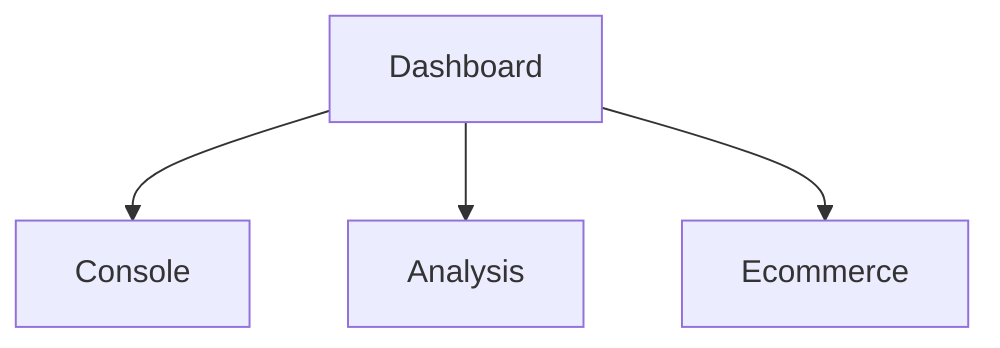
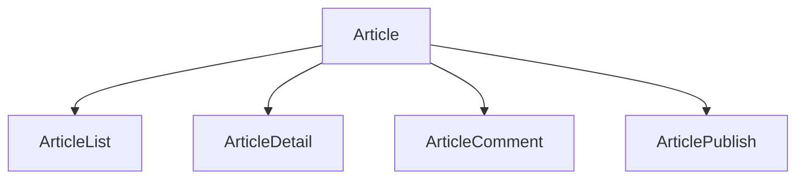
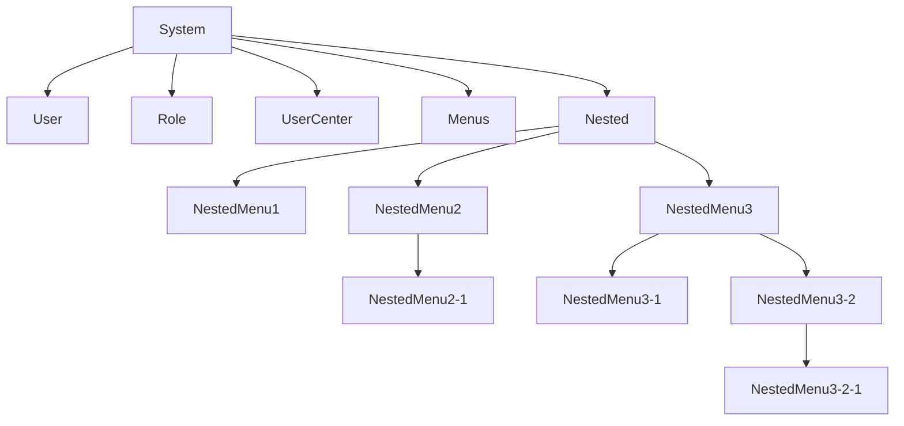
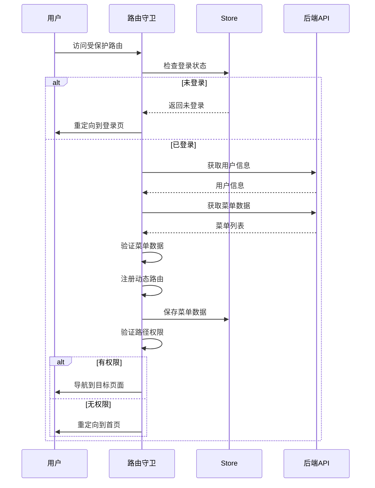

# 动态路由

<cite>
**本文档引用文件**  
- [asyncRoutes.ts](file://src/router/routes/asyncRoutes.ts)
- [index.ts](file://src/router/modules/index.ts)
- [dashboard.ts](file://src/router/modules/dashboard.ts)
- [article.ts](file://src/router/modules/article.ts)
- [system.ts](file://src/router/modules/system.ts)
- [examples.ts](file://src/router/modules/examples.ts)
- [widgets.ts](file://src/router/modules/widgets.ts)
- [exception.ts](file://src/router/modules/exception.ts)
- [help.ts](file://src/router/modules/help.ts)
- [types/router/index.ts](file://src/types/router/index.ts)
- [beforeEach.ts](file://src/router/guards/beforeEach.ts)
- [RoutePermissionValidator.ts](file://src/router/core/RoutePermissionValidator.ts)
- [RouteRegistry.ts](file://src/router/core/RouteRegistry.ts)
- [ComponentLoader.ts](file://src/router/core/ComponentLoader.ts)
- [staticRoutes.ts](file://src/router/routes/staticRoutes.ts)
</cite>

## 目录
1. [简介](#简介)
2. [动态路由实现机制](#动态路由实现机制)
3. [模块化组织策略](#模块化组织策略)
4. [核心特点分析](#核心特点分析)
5. [模块路由结构与组织方式](#模块路由结构与组织方式)
6. [新增功能模块路由最佳实践](#新增功能模块路由最佳实践)
7. [权限管理系统集成](#权限管理系统集成)
8. [路由懒加载性能优势](#路由懒加载性能优势)
9. [常见错误解决方案](#常见错误解决方案)

## 简介

动态路由是本项目权限控制和菜单管理的核心机制。它通过模块化的方式组织需要权限验证才能访问的路由，实现了菜单显示控制和路由动态加载的功能。与静态路由不同，动态路由在用户登录后根据权限动态注册，确保了系统的安全性和灵活性。

## 动态路由实现机制

动态路由的核心实现位于 `src/router/routes/asyncRoutes.ts` 文件中，通过导入 `routeModules` 来聚合所有功能模块的路由配置。



**动态路由注册流程图**

**Diagram sources**  
- [asyncRoutes.ts](file://src/router/routes/asyncRoutes.ts)
- [beforeEach.ts](file://src/router/guards/beforeEach.ts)
- [RouteRegistry.ts](file://src/router/core/RouteRegistry.ts)

**Section sources**  
- [asyncRoutes.ts](file://src/router/routes/asyncRoutes.ts#L1-L10)

## 模块化组织策略

项目采用模块化策略组织动态路由，所有功能模块的路由配置都存放在 `src/router/modules/` 目录下，通过 `index.ts` 文件统一导出。



**模块化路由组织结构图**

**Diagram sources**  
- [index.ts](file://src/router/modules/index.ts)
- [asyncRoutes.ts](file://src/router/routes/asyncRoutes.ts)

**Section sources**  
- [index.ts](file://src/router/modules/index.ts#L1-L28)

## 核心特点分析

动态路由具有以下核心特点：

- **权限验证**：需要用户登录并具有相应权限才能访问
- **菜单控制**：路由配置直接决定菜单的显示内容
- **动态加载**：在用户登录后动态注册到 Vue Router
- **权限分级**：支持角色权限和操作权限双重控制

```mermaid
classDiagram
class AppRouteRecord {
+name : string
+path : string
+component : string | Function
+meta : RouteMeta
+children : AppRouteRecord[]
}
class RouteMeta {
+title : string
+icon : string
+roles : string[]
+keepAlive : boolean
+authList : Array<{title : string, authMark : string}>
+isHide : boolean
+isHideTab : boolean
+fixedTab : boolean
+activePath : string
}
AppRouteRecord --> RouteMeta : "包含"
```

**动态路由数据结构**

**Diagram sources**  
- [types/router/index.ts](file://src/types/router/index.ts)
- [dashboard.ts](file://src/router/modules/dashboard.ts)

**Section sources**  
- [types/router/index.ts](file://src/types/router/index.ts#L23-L81)

## 模块路由结构与组织方式

各模块路由文件遵循统一的结构规范，以 `src/router/modules/` 目录下的文件为例：

### 仪表盘模块 (dashboard.ts)



**仪表盘模块路由结构**

**Diagram sources**  
- [dashboard.ts](file://src/router/modules/dashboard.ts)

**Section sources**  
- [dashboard.ts](file://src/router/modules/dashboard.ts#L1-L46)

### 文章模块 (article.ts)



**文章模块路由结构**

**Diagram sources**  
- [article.ts](file://src/router/modules/article.ts)

**Section sources**  
- [article.ts](file://src/router/modules/article.ts#L1-L61)

### 系统管理模块 (system.ts)



**系统管理模块路由结构**

**Diagram sources**  
- [system.ts](file://src/router/modules/system.ts)

**Section sources**  
- [system.ts](file://src/router/modules/system.ts#L1-L150)

## 新增功能模块路由最佳实践

### 路径命名规范

- 使用小写字母和连字符（kebab-case）命名
- 路径层级不超过三级
- 避免与静态路由冲突

### 组件引用规范

- 使用相对路径引用组件，格式为 `/模块名/功能名`
- 支持自动解析 `index.vue` 文件
- 组件路径不包含文件扩展名

### meta信息配置

```typescript
meta: {
  title: '国际化键名', // 必填，用于菜单显示
  icon: '图标名称', // 可选，菜单图标
  roles: ['R_SUPER', 'R_ADMIN'], // 可选，角色权限
  keepAlive: true, // 可选，是否缓存组件
  authList: [{ title: '操作名称', authMark: '权限标识' }], // 可选，操作权限
  isHide: false, // 可选，是否在菜单中隐藏
  isHideTab: false, // 可选，是否在标签页中隐藏
  fixedTab: false, // 可选，是否固定标签页
  activePath: '/父级路径' // 可选，激活菜单路径
}
```

**Section sources**  
- [examples.ts](file://src/router/modules/examples.ts#L1-L136)
- [widgets.ts](file://src/router/modules/widgets.ts#L1-L147)

## 权限管理系统集成

动态路由与权限管理系统深度集成，通过路由守卫实现完整的权限控制流程。



**权限验证流程**

**Diagram sources**  
- [beforeEach.ts](file://src/router/guards/beforeEach.ts)
- [RoutePermissionValidator.ts](file://src/router/core/RoutePermissionValidator.ts)

**Section sources**  
- [beforeEach.ts](file://src/router/guards/beforeEach.ts#L1-L361)
- [RoutePermissionValidator.ts](file://src/router/core/RoutePermissionValidator.ts#L1-L120)

## 路由懒加载性能优势

项目通过组件懒加载和动态路由注册机制，实现了显著的性能优化。

### 懒加载实现


**组件懒加载机制**

**Diagram sources**  
- [ComponentLoader.ts](file://src/router/core/ComponentLoader.ts)
- [RouteRegistry.ts](file://src/router/core/RouteRegistry.ts)

**Section sources**  
- [ComponentLoader.ts](file://src/router/core/ComponentLoader.ts#L1-L83)

### 性能优势

1. **首屏加载优化**：仅加载必要的静态路由组件
2. **按需加载**：用户访问特定功能时才加载对应组件
3. **内存优化**：未访问的组件不会占用内存
4. **网络优化**：减少初始请求的资源大小

## 常见错误解决方案

### 路由无法访问

**问题原因**：
- 用户权限不足
- 路由配置错误
- 组件路径不存在

**解决方案**：
1. 检查用户角色是否包含 `meta.roles` 中的权限
2. 验证路由路径是否与其他路由冲突
3. 确认组件文件路径是否正确

### 组件无法加载

**问题原因**：
- 组件路径配置错误
- 文件不存在或命名不规范

**解决方案**：
1. 检查组件路径是否以 `/` 开头
2. 确认组件文件是否存在于 `views` 目录下
3. 验证文件命名是否符合 kebab-case 规范

### 菜单显示异常

**问题原因**：
- `meta.isHide` 配置错误
- 国际化键名不存在
- 图标名称错误

**解决方案**：
1. 检查 `meta.isHide` 是否设置为 `true`
2. 验证 `meta.title` 的国际化键名是否在语言文件中定义
3. 确认 `meta.icon` 的图标名称是否正确

**Section sources**  
- [staticRoutes.ts](file://src/router/routes/staticRoutes.ts#L1-L73)
- [exception.ts](file://src/router/modules/exception.ts#L1-L47)
- [help.ts](file://src/router/modules/help.ts)