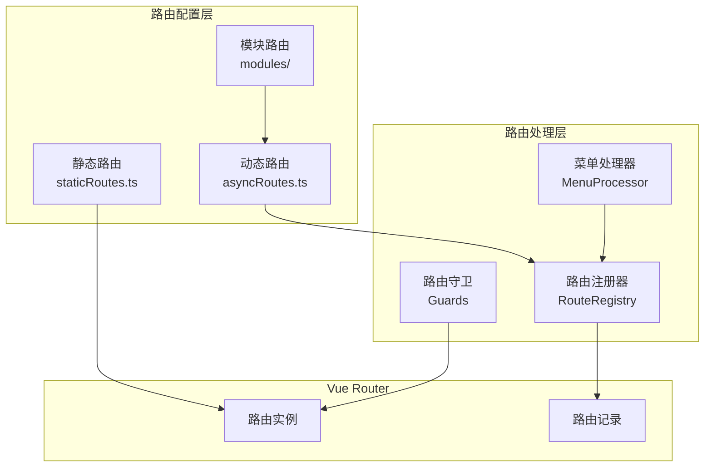
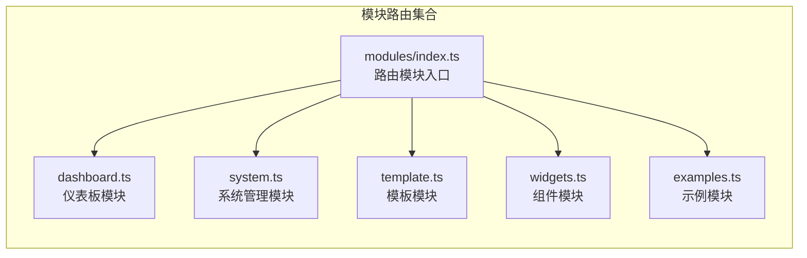
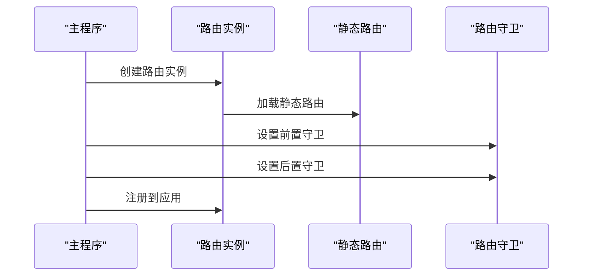
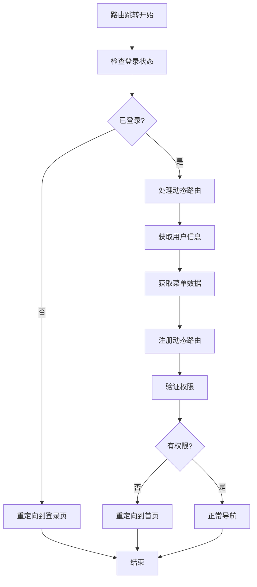
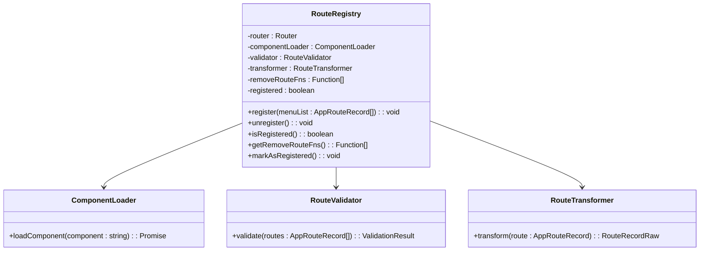
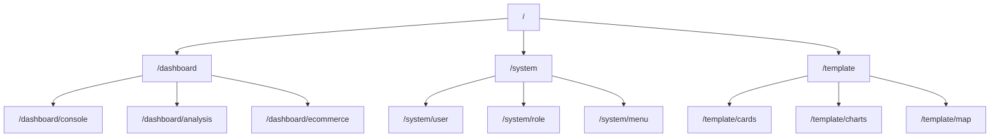

# 路由配置

<cite>
**本文档引用的文件**
- [src/router/routes/staticRoutes.ts](file://src/router/routes/staticRoutes.ts)
- [src/router/routes/asyncRoutes.ts](file://src/router/routes/asyncRoutes.ts)
- [src/router/index.ts](file://src/router/index.ts)
- [src/router/routesAlias.ts](file://src/router/routesAlias.ts)
- [src/router/modules/index.ts](file://src/router/modules/index.ts)
- [src/router/modules/dashboard.ts](file://src/router/modules/dashboard.ts)
- [src/router/modules/system.ts](file://src/router/modules/system.ts)
- [src/router/modules/template.ts](file://src/router/modules/template.ts)
- [src/types/router/index.ts](file://src/types/router/index.ts)
- [src/utils/router.ts](file://src/utils/router.ts)
- [src/router/guards/beforeEach.ts](file://src/router/guards/beforeEach.ts)
- [src/router/guards/afterEach.ts](file://src/router/guards/afterEach.ts)
- [src/router/core/RouteRegistry.ts](file://src/router/core/RouteRegistry.ts)
- [src/router/core/MenuProcessor.ts](file://src/router/core/MenuProcessor.ts)
</cite>

## 目录
1. [项目概述](#项目概述)
2. [路由架构设计](#路由架构设计)
3. [静态路由配置](#静态路由配置)
4. [动态路由配置](#动态路由配置)
5. [路由实例创建](#路由实例创建)
6. [路由守卫机制](#路由守卫机制)
7. [路由核心功能](#路由核心功能)
8. [最佳实践指南](#最佳实践指南)
9. [故障排除](#故障排除)
10. [总结](#总结)

## 项目概述

Art Design Pro 采用基于 Vue Router 4 的现代化路由架构，支持静态路由和动态路由两种模式。系统通过模块化的路由组织方式，实现了灵活的权限控制和菜单生成机制。

### 核心特性

- **双模式路由**：支持静态路由（公开访问）和动态路由（权限控制）
- **模块化组织**：按功能模块划分路由配置，便于维护和扩展
- **权限控制**：基于角色的细粒度权限管理
- **懒加载**：组件懒加载优化应用性能
- **国际化支持**：路由标题支持多语言切换

## 路由架构设计

系统采用分层架构设计，将路由配置分为多个层次：



**图表来源**
- [src/router/routes/staticRoutes.ts](file://src/router/routes/staticRoutes.ts#L1-L73)
- [src/router/routes/asyncRoutes.ts](file://src/router/routes/asyncRoutes.ts#L1-L10)
- [src/router/modules/index.ts](file://src/router/modules/index.ts#L1-L28)

## 静态路由配置

### 配置文件结构

静态路由位于 [`src/router/routes/staticRoutes.ts`](file://src/router/routes/staticRoutes.ts)，包含不需要权限验证即可访问的路由。

### 配置规则

| 属性 | 类型 | 必填 | 说明 |
|------|------|------|------|
| path | string | 是 | 路由路径，支持动态参数和通配符 |
| name | string | 是 | 路由名称，必须唯一 |
| component | Function | 是 | 组件懒加载函数 |
| meta | RouteMeta | 是 | 路由元信息配置 |

### 元信息字段详解

| 字段 | 类型 | 默认值 | 说明 |
|------|------|--------|------|
| title | string | - | 路由标题，支持国际化键值 |
| icon | string | - | 菜单图标，使用图标库名称 |
| isHide | boolean | false | 是否在菜单中隐藏 |
| isHideTab | boolean | false | 是否在标签页中隐藏 |
| keepAlive | boolean | false | 是否启用组件缓存 |
| roles | string[] | - | 角色权限列表 |
| authList | Array | - | 按钮级权限配置 |

### 示例配置

```typescript
// 登录页面配置
{
  path: '/auth/login',
  name: 'Login',
  component: () => import('@views/auth/login/index.vue'),
  meta: { title: 'menus.login.title', isHideTab: true }
}
```

**章节来源**
- [src/router/routes/staticRoutes.ts](file://src/router/routes/staticRoutes.ts#L1-L73)
- [src/types/router/index.ts](file://src/types/router/index.ts#L29-L80)

## 动态路由配置

### 模块化组织策略

动态路由采用模块化组织方式，每个功能模块都有独立的路由配置文件。



**图表来源**
- [src/router/modules/index.ts](file://src/router/modules/index.ts#L1-L28)
- [src/router/modules/dashboard.ts](file://src/router/modules/dashboard.ts#L1-L46)
- [src/router/modules/system.ts](file://src/router/modules/system.ts#L1-L150)

### 路由模块导入机制

[`src/router/routes/asyncRoutes.ts`](file://src/router/routes/asyncRoutes.ts) 通过 `routeModules` 导入所有模块路由：

```typescript
import { routeModules } from '../modules'
export const asyncRoutes: AppRouteRecord[] = routeModules
```

### 模块路由配置示例

以仪表板模块为例，展示层级路由配置：

```typescript
export const dashboardRoutes: AppRouteRecord = {
  name: 'Dashboard',
  path: '/dashboard',
  component: '/index/index',
  meta: {
    title: 'menus.dashboard.title',
    icon: 'ri:pie-chart-line',
    roles: ['R_SUPER', 'R_ADMIN']
  },
  children: [
    {
      path: 'console',
      name: 'Console',
      component: '/dashboard/console',
      meta: {
        title: 'menus.dashboard.console',
        icon: 'ri:home-smile-2-line',
        keepAlive: false,
        fixedTab: true
      }
    }
  ]
}
```

**章节来源**
- [src/router/routes/asyncRoutes.ts](file://src/router/routes/asyncRoutes.ts#L1-L10)
- [src/router/modules/index.ts](file://src/router/modules/index.ts#L16-L27)
- [src/router/modules/dashboard.ts](file://src/router/modules/dashboard.ts#L3-L46)

## 路由实例创建

### 创建过程

路由实例创建位于 [`src/router/index.ts`](file://src/router/index.ts)，采用 Hash 模式：



**图表来源**
- [src/router/index.ts](file://src/router/index.ts#L8-L20)

### Hash 模式配置

系统使用 Hash 模式路由，避免服务器配置复杂性：

```typescript
export const router = createRouter({
  history: createWebHashHistory(),
  routes: staticRoutes
})
```

### 初始化流程

1. **创建路由实例**：使用 Hash 历史记录
2. **配置进度条**：集成 NProgress 进度条
3. **设置守卫**：注册前置和后置守卫
4. **应用注册**：将路由注册到 Vue 应用

**章节来源**
- [src/router/index.ts](file://src/router/index.ts#L1-L24)

## 路由守卫机制

### 守卫类型

系统实现完整的路由守卫机制，包括前置守卫和后置守卫。



**图表来源**
- [src/router/guards/beforeEach.ts](file://src/router/guards/beforeEach.ts#L118-L275)

### 前置守卫功能

前置守卫 [`src/router/guards/beforeEach.ts`](file://src/router/guards/beforeEach.ts) 实现以下功能：

1. **登录状态验证**：检查用户是否已登录
2. **动态路由注册**：首次访问时注册动态路由
3. **权限控制**：验证用户对目标路由的访问权限
4. **页面标题设置**：动态设置页面标题
5. **根路径重定向**：处理根路径跳转

### 后置守卫功能

后置守卫 [`src/router/guards/afterEach.ts`](file://src/router/guards/afterEach.ts) 负责：

1. **滚动到顶部**：页面跳转后滚动到顶部
2. **进度条控制**：完成路由跳转后的进度条处理
3. **加载效果关闭**：关闭前置守卫中的加载效果

**章节来源**
- [src/router/guards/beforeEach.ts](file://src/router/guards/beforeEach.ts#L1-L361)
- [src/router/guards/afterEach.ts](file://src/router/guards/afterEach.ts#L1-L35)

## 路由核心功能

### 路由注册器

[`src/router/core/RouteRegistry.ts`](file://src/router/core/RouteRegistry.ts) 负责动态路由的注册和管理：



**图表来源**
- [src/router/core/RouteRegistry.ts](file://src/router/core/RouteRegistry.ts#L16-L90)

### 菜单处理器

[`src/router/core/MenuProcessor.ts`](file://src/router/core/MenuProcessor.ts) 处理菜单数据的获取和过滤：

1. **前端模式**：使用本地路由配置进行权限过滤
2. **后端模式**：从服务器获取菜单数据
3. **路径规范化**：将相对路径转换为完整路径
4. **空菜单过滤**：移除无效的菜单项

### 路径验证机制

系统实现了严格的路径验证机制，防止配置错误：

```typescript
// 验证非一级菜单不能使用绝对路径
private validateMenuPaths(menuList: AppRouteRecord[], level = 1): void {
  menuList.forEach((route) => {
    if (!route.children?.length) return
    
    route.children.forEach((child) => {
      const childPath = child.path || ''
      if (childPath.startsWith('/') && !this.isValidAbsolutePath(childPath)) {
        this.logPathError(child, childPath, parentName, level)
      }
    })
  })
}
```

**章节来源**
- [src/router/core/RouteRegistry.ts](file://src/router/core/RouteRegistry.ts#L1-L91)
- [src/router/core/MenuProcessor.ts](file://src/router/core/MenuProcessor.ts#L1-L242)

## 最佳实践指南

### 静态路由配置最佳实践

1. **路径命名规范**
   - 使用小写字母和连字符
   - 避免与动态路由路径冲突
   - 使用语义化的路径名称

2. **组件懒加载**
   ```typescript
   component: () => import('@views/path/to/component.vue')
   ```

3. **元信息配置**
   - 使用国际化键值作为标题
   - 正确设置 `isHideTab` 属性
   - 合理配置 `keepAlive` 缓存策略

### 动态路由配置最佳实践

1. **模块化组织**
   - 按功能模块划分路由
   - 使用清晰的模块命名
   - 保持模块间的独立性

2. **权限控制**
   ```typescript
   meta: {
     title: 'menus.module.title',
     icon: 'icon-name',
     roles: ['R_SUPER', 'R_ADMIN'] // 角色权限
   }
   ```

3. **层级路由设计**
   ```typescript
   // 父路由
   {
     path: 'parent',
     name: 'Parent',
     component: '/parent',
     meta: { title: '父级菜单' }
   }
   
   // 子路由
   {
     path: 'child',
     name: 'Child',
     component: '/parent/child',
     meta: { title: '子级菜单' }
   }
   ```

### 路由层级结构建议



### 避免常见问题

1. **路径冲突**
   - 确保静态路由和动态路由路径不重复
   - 使用不同的命名空间区分功能模块

2. **权限配置**
   - 正确设置 `roles` 权限字段
   - 验证权限继承关系

3. **组件加载**
   - 使用正确的组件路径格式
   - 确保组件文件存在

**章节来源**
- [src/router/routes/staticRoutes.ts](file://src/router/routes/staticRoutes.ts#L9-L12)
- [src/router/modules/dashboard.ts](file://src/router/modules/dashboard.ts#L3-L46)
- [src/router/core/MenuProcessor.ts](file://src/router/core/MenuProcessor.ts#L158-L211)

## 故障排除

### 常见问题及解决方案

1. **路由无法访问**
   - 检查路由是否正确注册
   - 验证用户权限配置
   - 确认组件路径是否正确

2. **菜单显示异常**
   - 检查 `meta` 配置是否完整
   - 验证国际化键值是否存在
   - 确认图标名称是否正确

3. **权限控制失效**
   - 检查 `roles` 配置
   - 验证用户角色信息
   - 确认权限验证逻辑

### 调试技巧

1. **路由注册状态检查**
   ```typescript
   // 检查路由是否已注册
   console.log(router.hasRoute('routeName'))
   ```

2. **菜单数据验证**
   ```typescript
   // 验证菜单列表格式
   const menuProcessor = new MenuProcessor()
   const isValid = menuProcessor.validateMenuList(menuList)
   ```

3. **路径配置检查**
   ```typescript
   // 检查路径配置错误
   const registry = new RouteRegistry(router)
   registry.register(menuList) // 会自动验证配置
   ```

**章节来源**
- [src/router/guards/beforeEach.ts](file://src/router/guards/beforeEach.ts#L275-L296)
- [src/router/core/MenuProcessor.ts](file://src/router/core/MenuProcessor.ts#L124-L126)

## 总结

Art Design Pro 的路由系统采用了现代化的设计理念，通过静态路由和动态路由的结合，实现了灵活的权限控制和良好的用户体验。

### 系统优势

1. **模块化设计**：清晰的模块划分便于维护和扩展
2. **权限控制**：基于角色的细粒度权限管理
3. **性能优化**：组件懒加载和缓存策略
4. **开发友好**：完善的类型定义和验证机制
5. **国际化支持**：完整的多语言路由标题支持

### 技术特点

- **TypeScript 支持**：完整的类型定义确保开发安全
- **Vue Router 4**：利用最新版本的功能特性
- **模块化架构**：遵循单一职责原则
- **可扩展性**：易于添加新的功能模块

通过合理的配置和遵循最佳实践，开发者可以快速构建功能丰富、性能优异的路由系统，为用户提供流畅的应用体验。