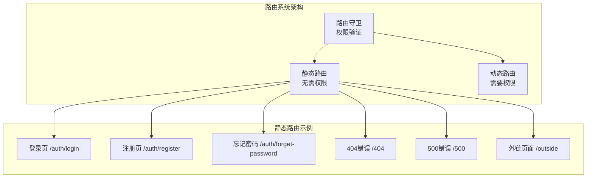
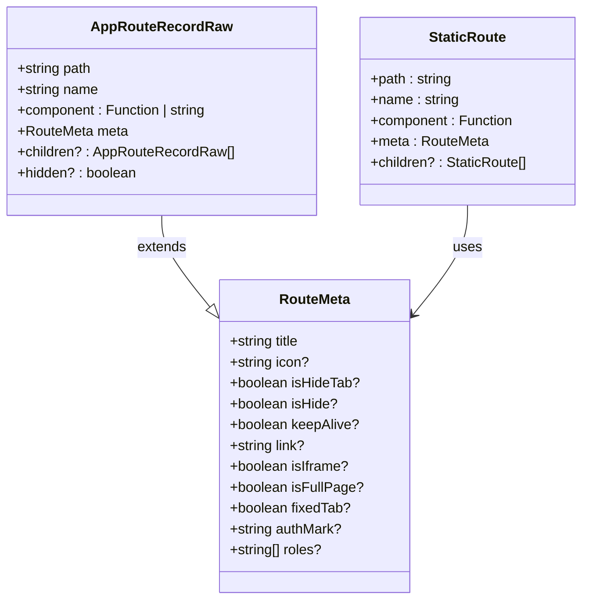
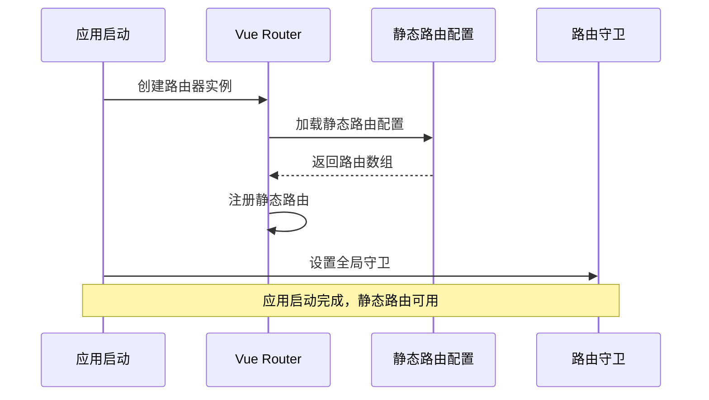

# 静态路由详细文档

<cite>
**本文档引用的文件**
- [staticRoutes.ts](file://src/router/routes/staticRoutes.ts)
- [index.ts](file://src/router/index.ts)
- [asyncRoutes.ts](file://src/router/routes/asyncRoutes.ts)
- [router.ts](file://src/utils/router.ts)
- [index.ts](file://src/types/router/index.ts)
- [beforeEach.ts](file://src/router/guards/beforeEach.ts)
- [afterEach.ts](file://src/router/guards/afterEach.ts)
- [routesAlias.ts](file://src/router/routesAlias.ts)
- [index.ts](file://src/router/modules/index.ts)
- [worktab.ts](file://src/store/modules/worktab.ts)
- [login/index.vue](file://src/views/auth/login/index.vue)
- [404/index.vue](file://src/views/exception/404/index.vue)
- [zh.json](file://src/locales/langs/zh.json)
</cite>

## 目录
1. [概述](#概述)
2. [静态路由特点](#静态路由特点)
3. [路由配置结构](#路由配置结构)
4. [meta字段详解](#meta字段详解)
5. [实际配置示例](#实际配置示例)
6. [路由注册机制](#路由注册机制)
7. [注意事项](#注意事项)
8. [常见问题排查](#常见问题排查)
9. [最佳实践](#最佳实践)

## 概述

静态路由是Art Design Pro框架中的一种特殊路由类型，它不需要权限验证即可访问，主要用于系统的基础功能页面，如登录、注册、错误页面等公共路由。静态路由在应用启动时就已注册，与动态路由相对应，后者需要用户登录和权限验证才能访问。



**图表来源**
- [staticRoutes.ts](file://src/router/routes/staticRoutes.ts#L13-L72)
- [beforeEach.ts](file://src/router/guards/beforeEach.ts#L169-L171)

**章节来源**
- [staticRoutes.ts](file://src/router/routes/staticRoutes.ts#L1-L73)
- [index.ts](file://src/router/index.ts#L1-L24)

## 静态路由特点

### 核心特性

1. **无需权限验证**：任何用户都可以直接访问静态路由
2. **预注册机制**：在应用启动时就已注册到Vue Router中
3. **基础功能页面**：主要包含登录、注册、错误处理等公共页面
4. **快速访问**：由于无需权限验证，访问速度更快

### 与其他路由的区别

| 特性 | 静态路由 | 动态路由 |
|------|----------|----------|
| 权限要求 | 无需权限 | 需要登录和权限 |
| 注册时机 | 应用启动时预注册 | 用户登录后动态注册 |
| 访问速度 | 快速访问 | 需要权限验证 |
| 页面类型 | 登录、注册、错误页面 | 业务功能页面 |
| 路由数量 | 固定少量 | 根据权限动态变化 |

**章节来源**
- [staticRoutes.ts](file://src/router/routes/staticRoutes.ts#L3-L12)
- [asyncRoutes.ts](file://src/router/routes/asyncRoutes.ts#L1-L10)

## 路由配置结构

### 基本结构

静态路由的配置遵循Vue Router的标准结构，同时扩展了自定义的meta字段：

```typescript
interface StaticRoute {
  path: string;
  name: string;
  component: () => Promise<any>;
  meta: RouteMeta;
  children?: StaticRoute[];
}
```

### 类型定义

系统定义了专门的路由类型来确保配置的正确性：



**图表来源**
- [index.ts](file://src/types/router/index.ts#L29-L80)
- [staticRoutes.ts](file://src/router/routes/staticRoutes.ts#L13-L72)

**章节来源**
- [index.ts](file://src/types/router/index.ts#L29-L80)
- [staticRoutes.ts](file://src/router/routes/staticRoutes.ts#L13-L72)

## meta字段详解

### 核心属性

#### title属性
- **作用**：设置页面标题，在浏览器标签栏显示
- **国际化支持**：支持使用`menus.`开头的翻译键值
- **格式**：可以是直接的字符串或翻译键值

#### isHideTab属性
- **作用**：控制页面是否在标签页中显示
- **默认值**：`false`（在标签页中显示）
- **使用场景**：登录、注册、错误页面等不需要标签页的页面

### 其他常用属性

| 属性名 | 类型 | 默认值 | 说明 |
|--------|------|--------|------|
| icon | string | - | 页面图标，用于菜单显示 |
| isHide | boolean | false | 是否在菜单中隐藏 |
| keepAlive | boolean | false | 是否缓存页面组件 |
| link | string | - | 外部链接地址 |
| isIframe | boolean | false | 是否为iframe页面 |
| fixedTab | boolean | false | 是否为固定标签页 |
| isFullPage | boolean | false | 是否为全屏页面 |
| authMark | string | - | 权限标识符 |
| roles | string[] | - | 可访问的角色列表 |

### 实际使用示例

```typescript
// 登录页面配置
{
  path: '/auth/login',
  name: 'Login',
  component: () => import('@views/auth/login/index.vue'),
  meta: { 
    title: 'menus.login.title',      // 国际化标题
    isHideTab: true                  // 不在标签页中显示
  }
}

// 外链页面配置
{
  path: '/outside',
  name: 'Outside',
  meta: { 
    title: 'menus.outside.title',    // 国际化标题
    isHideTab: false                 // 在标签页中显示
  },
  children: [
    {
      path: '/outside/iframe/:path',
      name: 'Iframe',
      component: () => import('@/views/outside/Iframe.vue'),
      meta: { 
        title: 'iframe'                 // 直接字符串标题
      }
    }
  ]
}
```

**章节来源**
- [index.ts](file://src/types/router/index.ts#L29-L80)
- [staticRoutes.ts](file://src/router/routes/staticRoutes.ts#L22-L71)

## 实际配置示例

### 基础页面配置

以下是静态路由中最常见的几种页面配置：

#### 登录页面
```typescript
{
  path: '/auth/login',
  name: 'Login',
  component: () => import('@views/auth/login/index.vue'),
  meta: { 
    title: 'menus.login.title',
    isHideTab: true
  }
}
```

#### 注册页面
```typescript
{
  path: '/auth/register',
  name: 'Register',
  component: () => import('@views/auth/register/index.vue'),
  meta: { 
    title: 'menus.register.title', 
    isHideTab: true 
  }
}
```

#### 错误页面
```typescript
// 404页面
{
  path: '/404',
  name: 'Exception404',
  component: () => import('@views/exception/404/index.vue'),
  meta: { 
    title: '404', 
    isHideTab: true 
  }
}

// 500页面
{
  path: '/500',
  name: 'Exception500',
  component: () => import('@views/exception/500/index.vue'),
  meta: { 
    title: '500', 
    isHideTab: true 
  }
}
```

### 嵌套路由配置

对于需要嵌套的页面，如外链页面：

```typescript
{
  path: '/outside',
  component: () => import('@views/index/index.vue'),
  name: 'Outside',
  meta: { 
    title: 'menus.outside.title' 
  },
  children: [
    {
      path: '/outside/iframe/:path',
      name: 'Iframe',
      component: () => import('@/views/outside/Iframe.vue'),
      meta: { 
        title: 'iframe' 
      }
    }
  ]
}
```

### 添加新静态路由的完整示例

假设我们要添加一个新的帮助页面：

```typescript
// 1. 在staticRoutes.ts中添加配置
{
  path: '/help',
  name: 'Help',
  component: () => import('@views/help/index.vue'),
  meta: { 
    title: 'menus.help.title',
    isHideTab: false,
    icon: 'help-outline',
    keepAlive: true
  }
}

// 2. 在国际化文件中添加翻译
{
  "menus": {
    "help": {
      "title": "帮助中心"
    }
  }
}
```

**章节来源**
- [staticRoutes.ts](file://src/router/routes/staticRoutes.ts#L22-L71)
- [zh.json](file://src/locales/langs/zh.json#L211-L225)

## 路由注册机制

### 注册流程

静态路由的注册过程如下：



**图表来源**
- [index.ts](file://src/router/index.ts#L8-L12)
- [beforeEach.ts](file://src/router/guards/beforeEach.ts#L82-L101)

### 路由守卫中的静态路由识别

系统通过`isStaticRoute`函数来判断路由是否为静态路由：

```typescript
function isStaticRoute(path: string): boolean {
  const checkRoute = (routes: any[], targetPath: string): boolean => {
    return routes.some((route) => {
      // 处理动态路由参数匹配
      const routePath = route.path
      const pattern = routePath.replace(/:[^/]+/g, '[^/]+').replace(/\*/g, '.*')
      const regex = new RegExp(`^${pattern}$`)
      
      if (regex.test(targetPath)) {
        return true
      }
      if (route.children && route.children.length > 0) {
        return checkRoute(route.children, targetPath)
      }
      return false
    })
  }
  
  return checkRoute(staticRoutes, path)
}
```

### 动态路由注册对比

静态路由与动态路由的注册机制差异：

| 方面 | 静态路由 | 动态路由 |
|------|----------|----------|
| 注册时机 | 应用启动时 | 用户登录后 |
| 注册方式 | 直接添加到router | 通过RouteRegistry管理 |
| 权限验证 | 无需验证 | 需要权限验证 |
| 路由数量 | 固定 | 根据权限动态变化 |
| 性能影响 | 启动时一次性加载 | 按需加载 |

**章节来源**
- [index.ts](file://src/router/index.ts#L8-L12)
- [beforeEach.ts](file://src/router/guards/beforeEach.ts#L183-L205)

## 注意事项

### 路径和名称冲突

#### 最重要注意事项
**路径和名称不能与动态路由冲突**，否则会导致路由冲突无法访问。

```typescript
// ❌ 错误示例：与动态路由冲突
{
  path: '/dashboard',  // 与动态路由冲突
  name: 'Dashboard',   // 与动态路由冲突
  component: () => import('@views/dashboard/index.vue'),
  meta: { title: '仪表盘' }
}

// ✅ 正确示例：使用不同的路径
{
  path: '/public-dashboard',  // 修改路径避免冲突
  name: 'PublicDashboard',
  component: () => import('@views/dashboard/index.vue'),
  meta: { title: '仪表盘' }
}
```

### 路由命名规范

1. **路径命名**：使用小写字母和连字符，避免与动态路由冲突
2. **名称命名**：使用PascalCase，确保唯一性
3. **国际化键值**：使用`menus.`前缀，便于维护

### 组件懒加载

所有静态路由都采用懒加载方式：

```typescript
// ✅ 推荐：懒加载组件
component: () => import('@views/auth/login/index.vue')

// ❌ 不推荐：同步导入
// component: () => require('@views/auth/login/index.vue')
```

### 标签页配置

根据页面类型合理配置`isHideTab`属性：

```typescript
// 登录、注册、错误页面：isHideTab: true
meta: { title: '登录', isHideTab: true }

// 业务页面：isHideTab: false
meta: { title: '用户管理', isHideTab: false }
```

**章节来源**
- [staticRoutes.ts](file://src/router/routes/staticRoutes.ts#L10-L11)
- [beforeEach.ts](file://src/router/guards/beforeEach.ts#L183-L205)

## 常见问题排查

### 路由不生效

#### 问题现象
- 页面无法访问
- 出现404错误
- 路由配置被忽略

#### 排查步骤

1. **检查路径冲突**
```typescript
// 检查是否与动态路由冲突
console.log(isStaticRoute('/auth/login')) // 应该返回true
```

2. **验证组件路径**
```typescript
// 确认组件路径正确
try {
  const component = await import('@views/auth/login/index.vue')
  console.log('组件加载成功')
} catch (error) {
  console.error('组件加载失败:', error)
}
```

3. **检查路由配置语法**
```typescript
// 确保配置符合TypeScript类型要求
const route: AppRouteRecord = {
  path: '/test',
  name: 'Test',
  component: () => import('@views/test/index.vue'),
  meta: { title: '测试' }
}
```

### 页面无法加载

#### 问题现象
- 页面空白或报错
- 组件加载失败
- 控制台有错误信息

#### 解决方案

1. **检查组件导出**
```typescript
// 确保组件正确导出
<script setup>
defineOptions({ name: 'Login' }) // 必须与路由name对应
</script>
```

2. **检查依赖注入**
```typescript
// 确保必要的store和hooks已正确注入
import { useUserStore } from '@/store/modules/user'
```

3. **检查样式文件**
```typescript
// 确保样式文件正确引入
<style scoped>
@import '@/assets/styles/custom/login.scss';
</style>
```

### 标题不显示

#### 问题现象
- 浏览器标题不正确
- 国际化标题显示键值而非内容

#### 排查方法

1. **检查国际化配置**
```typescript
// 确认翻译键值存在
$t('menus.login.title') // 应该返回"登录"
```

2. **检查setPageTitle函数**
```typescript
// 确认标题设置逻辑正常
import { setPageTitle } from '@/utils/router'
setPageTitle(route)
```

### 标签页显示问题

#### 问题现象
- 页面应该在标签页中显示但没有
- 标签页显示了不应该显示的页面

#### 解决方案

1. **检查isHideTab配置**
```typescript
// 登录页面：不需要标签页
meta: { title: '登录', isHideTab: true }

// 业务页面：需要标签页
meta: { title: '用户管理', isHideTab: false }
```

2. **检查工作标签页状态**
```typescript
// 确认工作标签页store状态正确
import { useWorktabStore } from '@/store/modules/worktab'
const worktabStore = useWorktabStore()
console.log(worktabStore.opened)
```

**章节来源**
- [beforeEach.ts](file://src/router/guards/beforeEach.ts#L183-L205)
- [router.ts](file://src/utils/router.ts#L29-L61)
- [worktab.ts](file://src/store/modules/worktab.ts#L35-L41)

## 最佳实践

### 路由组织结构

1. **按功能分组**
```typescript
// 按功能模块组织路由
const staticRoutes = [
  // 认证相关
  {
    path: '/auth/login',
    name: 'Login',
    component: () => import('@views/auth/login/index.vue'),
    meta: { title: 'menus.login.title', isHideTab: true }
  },
  {
    path: '/auth/register',
    name: 'Register',
    component: () => import('@views/auth/register/index.vue'),
    meta: { title: 'menus.register.title', isHideTab: true }
  },
  
  // 异常页面
  {
    path: '/404',
    name: 'Exception404',
    component: () => import('@views/exception/404/index.vue'),
    meta: { title: '404', isHideTab: true }
  },
  {
    path: '/500',
    name: 'Exception500',
    component: () => import('@views/exception/500/index.vue'),
    meta: { title: '500', isHideTab: true }
  }
]
```

2. **统一的meta配置风格**
```typescript
// 统一的meta配置模板
const baseMeta = {
  isHideTab: true,
  keepAlive: false,
  icon: undefined
}

const staticRoutes = [
  {
    path: '/auth/login',
    name: 'Login',
    component: () => import('@views/auth/login/index.vue'),
    meta: { 
      ...baseMeta,
      title: 'menus.login.title'
    }
  }
]
```

### 性能优化

1. **合理使用懒加载**
```typescript
// 对于大型页面组件使用懒加载
component: () => import('@views/complex-page/index.vue') // 推荐
// 避免同步加载大组件
// component: () => require('@views/complex-page/index.vue')
```

2. **组件缓存策略**
```typescript
// 对于频繁访问的页面启用缓存
meta: { 
  title: '仪表盘',
  isHideTab: false,
  keepAlive: true // 启用组件缓存
}
```

### 国际化支持

1. **统一的翻译键值命名**
```typescript
// 使用标准化的翻译键值
meta: { title: 'menus.login.title' }
meta: { title: 'menus.register.title' }
meta: { title: 'menus.forgetPassword.title' }
```

2. **提供默认翻译**
```typescript
// 在国际化文件中提供默认翻译
{
  "menus": {
    "login": {
      "title": "登录"
    },
    "register": {
      "title": "注册"
    }
  }
}
```

### 错误处理

1. **优雅的错误页面**
```typescript
// 确保有完善的错误页面
{
  path: '/:pathMatch(.*)*',
  name: 'Exception404',
  component: () => import('@views/exception/404/index.vue'),
  meta: { 
    title: '404', 
    isHideTab: true 
  }
}
```

2. **开发环境的调试支持**
```typescript
// 开发环境可以添加调试信息
if (process.env.NODE_ENV === 'development') {
  console.log('Static routes loaded:', staticRoutes)
}
```

### 测试建议

1. **路由配置测试**
```typescript
// 单元测试路由配置
describe('Static Routes', () => {
  it('should have unique names', () => {
    const names = staticRoutes.map(route => route.name)
    expect(new Set(names).size).toBe(names.length)
  })
  
  it('should have valid components', async () => {
    for (const route of staticRoutes) {
      const component = await route.component()
      expect(component).toBeDefined()
    }
  })
})
```

2. **功能测试**
```typescript
// 端到端测试路由功能
test('static routes should be accessible', async ({ page }) => {
  await page.goto('/auth/login')
  await expect(page).toHaveTitle(/登录/)
})
```

**章节来源**
- [staticRoutes.ts](file://src/router/routes/staticRoutes.ts#L13-L72)
- [index.ts](file://src/types/router/index.ts#L29-L80)