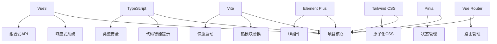
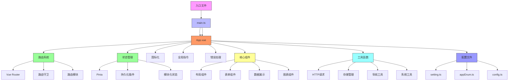

# 项目概述

<cite>
**本文档引用的文件**  
- [README.md](file://README.md)
- [package.json](file://package.json)
- [vite.config.ts](file://vite.config.ts)
- [main.ts](file://src/main.ts)
- [App.vue](file://src/App.vue)
- [router/index.ts](file://src/router/index.ts)
- [store/index.ts](file://src/store/index.ts)
- [setting.ts](file://src/config/setting.ts)
- [useTable.ts](file://src/hooks/core/useTable.ts)
- [appEnum.ts](file://src/enums/appEnum.ts)
- [index.ts](file://src/types/common/index.ts)
- [clean-dev.ts](file://scripts/clean-dev.ts)
- [tsconfig.json](file://tsconfig.json)
- [art-settings-panel/index.vue](file://src/components/core/layouts/art-settings-panel/index.vue)
</cite>

## 目录
1. [项目定位与目标](#项目定位与目标)
2. [核心价值主张与设计哲学](#核心价值主张与设计哲学)
3. [技术选型与架构](#技术选型与架构)
4. [安装与配置流程](#安装与配置流程)
5. [主要特性与功能亮点](#主要特性与功能亮点)
6. [适用场景](#适用场景)
7. [学习路径指引](#学习路径指引)
8. [项目架构视图](#项目架构视图)

## 项目定位与目标

Art Design Pro 是一个融合了设计美学与高效开发的后台管理系统模板，旨在帮助开发者快速构建专业级的应用程序。该项目定位为一个现代化的Vue3后台管理解决方案，通过精心设计的UI界面和流畅的交互体验，为开发者提供一个开箱即用的开发基础。

项目的核心目标是降低后台管理系统的开发门槛，通过提供一套完整的、可复用的组件库和功能模块，使开发者能够专注于业务逻辑的实现而非基础架构的搭建。无论是初创企业还是大型组织，Art Design Pro都致力于成为其数字化转型过程中的可靠技术伙伴。

**Section sources**
- [README.md](file://README.md#L1-L105)

## 核心价值主张与设计哲学

Art Design Pro 的核心价值主张体现在其对用户体验和开发效率的双重关注。项目的设计哲学强调"形式追随功能"，在确保系统功能性的同时，追求极致的视觉美感和交互流畅性。

项目特别注重界面设计的现代感，采用平滑的交互效果，从按钮点击到主题切换，再到页面过渡和图表动画，均提供了媲美商业产品的用户体验。这种设计理念不仅提升了用户的操作满意度，也增强了系统的专业形象。

在开发效率方面，项目内置了高效的API，如useTable和ArtForm，显著提高了开发速度。同时，项目提供了清晰的架构和全面的文档，使得即使是后端开发者也能轻松上手使用。

**Section sources**
- [README.md](file://README.md#L16-L28)

## 技术选型与架构

Art Design Pro 采用了现代化的前端技术栈，包括Vue3、TypeScript、Vite、Element Plus和Tailwind CSS等关键技术。这些技术的集成方式和协同工作机制构成了项目的技术基石。

Vue3作为核心框架，提供了响应式系统和组合式API，使得代码组织更加灵活。TypeScript的引入增强了代码的可维护性和类型安全性。Vite作为构建工具，提供了快速的开发服务器启动和热模块替换功能。

Element Plus作为UI组件库，提供了丰富的预设组件，而Tailwind CSS则提供了原子化的CSS类，两者结合实现了高度可定制的界面设计。项目通过Vite插件系统实现了这些技术的无缝集成，如通过unplugin-auto-import实现API的自动导入，通过unplugin-vue-components实现组件的按需加载。



**Diagram sources**
- [package.json](file://package.json#L54-L80)
- [vite.config.ts](file://vite.config.ts#L68-L100)
- [tsconfig.json](file://tsconfig.json#L1-L28)

**Section sources**
- [package.json](file://package.json#L54-L80)
- [vite.config.ts](file://vite.config.ts#L1-L157)
- [tsconfig.json](file://tsconfig.json#L1-L28)

## 安装与配置流程

Art Design Pro 提供了清晰的安装、配置和启动流程，确保开发者能够快速搭建开发环境并开始工作。

### 开发环境搭建

首先确保系统中安装了Node.js（版本>=20.19.0）和pnpm（版本>=8.8.0）。项目对开发环境有明确的版本要求，以保证最佳的兼容性和性能表现。

### 依赖安装

使用pnpm包管理器安装项目依赖：
```bash
pnpm install
```
如果安装失败，可以尝试使用以下命令：
```bash
pnpm install --ignore-scripts
```

### 本地运行

安装完成后，启动本地开发环境：
```bash
pnpm dev
```
这将启动Vite开发服务器，并自动打开浏览器窗口。

### 生产构建

当需要构建生产版本时，执行：
```bash
pnpm build
```
此命令会执行类型检查并进行生产环境构建。

### 清理开发版本

项目提供了一键清理脚本，用于快速移除演示数据，获取一个准备就绪的基础项目：
```bash
pnpm clean:dev
```

**Section sources**
- [README.md](file://README.md#L50-L72)
- [package.json](file://package.json#L10-L20)
- [scripts/clean-dev.ts](file://scripts/clean-dev.ts#L1-L839)

## 主要特性与功能亮点

Art Design Pro 具备多项显著的特性和功能亮点，使其在众多后台管理系统模板中脱颖而出。

### 丰富的组件库

项目内置了高质量的组件，涵盖数据展示、表单处理等多个业务场景。组件库包括：
- **图表组件**：柱状图、折线图、饼图、雷达图等
- **卡片组件**：数据列表卡、统计卡、时间轴列表卡等
- **表单组件**：搜索栏、按钮表格、拖拽验证等
- **布局组件**：面包屑、头部栏、侧边栏菜单等

### 高效的开发工具

项目提供了多个实用的API来提升开发效率：
- **useTable**：企业级表格数据管理方案，封装了数据获取、分页控制、搜索功能、缓存系统等常见需求
- **ArtForm**：高效的表单处理组件，简化了表单验证和数据提交流程

### 智能设置面板

通过`art-settings-panel`组件，用户可以实时调整系统设置，包括：
- 菜单类型和布局
- 主题颜色和模式
- 界面显示选项
- 功能开关配置

### 多语言支持

项目内置了中英文语言包，支持国际化需求。通过`vue-i18n`实现语言切换功能，便于构建面向全球用户的应用。

### 响应式设计

采用Tailwind CSS实现响应式布局，确保系统在不同设备和屏幕尺寸下都能提供良好的用户体验。

**Section sources**
- [README.md](file://README.md#L22-L26)
- [src/components/core/layouts/art-settings-panel/index.vue](file://src/components/core/layouts/art-settings-panel/index.vue#L1-L73)
- [src/hooks/core/useTable.ts](file://src/hooks/core/useTable.ts#L1-L200)
- [src/locales/langs/zh.json](file://src/locales/langs/zh.json)
- [src/locales/langs/en.json](file://src/locales/langs/en.json)

## 适用场景

Art Design Pro 适用于多种业务场景，特别适合需要快速构建专业后台管理系统的项目。

### 企业管理后台

适用于各类企业的内部管理系统，如人力资源管理、客户关系管理、项目管理等。其丰富的组件库和灵活的配置选项能够满足复杂的企业管理需求。

### 数据分析平台

凭借强大的图表组件和数据展示能力，Art Design Pro非常适合构建数据分析和可视化平台。系统管理模块中的用户、角色、菜单管理功能为数据分析平台提供了完善的权限控制机制。

### 内容管理系统

对于需要管理大量内容的网站或应用，Art Design Pro提供了文章管理、评论管理等功能模块，配合富文本编辑器组件，能够快速搭建内容管理系统。

### SaaS应用

作为SaaS应用的前端模板，Art Design Pro的多语言支持、主题定制和响应式设计特性能够满足不同客户的需求，帮助开发者快速交付高质量的产品。

### 开发者工具

对于需要构建开发者工具或技术平台的项目，Art Design Pro提供了代码高亮、拖拽上传、富文本编辑等实用组件，降低了开发复杂工具类应用的难度。

**Section sources**
- [README.md](file://README.md#L16-L28)
- [src/views](file://src/views)

## 学习路径指引

Art Design Pro 为不同水平的开发者提供了清晰的学习路径指引。

### 初学者路径

对于前端开发初学者，建议按照以下步骤学习：
1. **环境搭建**：首先完成开发环境的搭建，熟悉项目的基本结构
2. **基础组件**：学习使用Element Plus的基础组件，理解Vue3的组合式API
3. **路由配置**：了解Vue Router的使用方法，学习如何配置路由和导航
4. **状态管理**：掌握Pinia状态管理的基本用法
5. **组件开发**：尝试开发简单的自定义组件，理解组件间的通信机制

### 进阶开发者路径

对于有经验的开发者，可以深入探索以下高级特性：
1. **useTable深入**：研究useTable的实现原理，了解其如何封装复杂的表格数据管理逻辑
2. **主题定制**：学习如何通过Tailwind CSS和SCSS变量实现深度的主题定制
3. **性能优化**：分析Vite配置，了解如何通过代码分割、懒加载等技术优化应用性能
4. **插件开发**：研究unplugin系列插件的使用，理解如何实现API和组件的自动导入
5. **构建流程**：深入了解Vite的构建流程，掌握生产环境构建的优化技巧

### 专家级开发者路径

对于专家级开发者，可以关注以下深度技术点：
1. **缓存系统**：研究tableCache的实现，了解如何设计高效的请求缓存机制
2. **错误处理**：分析全局错误处理策略，学习如何构建健壮的错误处理系统
3. **持久化存储**：深入理解pinia-plugin-persistedstate的使用，掌握状态持久化的最佳实践
4. **自动化脚本**：研究clean-dev.ts脚本，学习如何编写复杂的自动化任务
5. **架构设计**：分析项目的整体架构，理解如何设计可扩展、可维护的大型前端应用

**Section sources**
- [src/hooks/core/useTable.ts](file://src/hooks/core/useTable.ts#L1-L200)
- [src/store/index.ts](file://src/store/index.ts#L1-L53)
- [src/router/index.ts](file://src/router/index.ts#L1-L24)
- [src/config/setting.ts](file://src/config/setting.ts#L1-L110)
- [scripts/clean-dev.ts](file://scripts/clean-dev.ts#L1-L839)

## 项目架构视图

Art Design Pro 采用分层架构设计，各主要模块之间有着清晰的关系和交互模式。



**Diagram sources**
- [src/main.ts](file://src/main.ts#L1-L25)
- [src/App.vue](file://src/App.vue#L1-L35)
- [src/router/index.ts](file://src/router/index.ts#L1-L24)
- [src/store/index.ts](file://src/store/index.ts#L1-L53)
- [src/config/setting.ts](file://src/config/setting.ts#L1-L110)
- [src/enums/appEnum.ts](file://src/enums/appEnum.ts#L1-L82)

**Section sources**
- [src/main.ts](file://src/main.ts#L1-L25)
- [src/App.vue](file://src/App.vue#L1-L35)
- [src/router/index.ts](file://src/router/index.ts#L1-L24)
- [src/store/index.ts](file://src/store/index.ts#L1-L53)
- [src/config/setting.ts](file://src/config/setting.ts#L1-L110)
- [src/enums/appEnum.ts](file://src/enums/appEnum.ts#L1-L82)