# 插件系统架构文档

<cite>
**本文档中引用的文件**
- [src/plugins/index.ts](file://src/plugins/index.ts)
- [src/plugins/echarts.ts](file://src/plugins/echarts.ts)
- [src/main.ts](file://src/main.ts)
- [src/store/index.ts](file://src/store/index.ts)
- [src/utils/sys/error-handle.ts](file://src/utils/sys/error-handle.ts)
- [src/utils/sys/upgrade.ts](file://src/utils/sys/upgrade.ts)
- [src/utils/storage/storage-key-manager.ts](file://src/utils/storage/storage-key-manager.ts)
- [src/hooks/core/useChart.ts](file://src/hooks/core/useChart.ts)
- [src/types/component/chart.ts](file://src/types/component/chart.ts)
- [src/components/core/charts/art-line-chart/index.vue](file://src/components/core/charts/art-line-chart/index.vue)
- [src/components/core/charts/art-scatter-chart/index.vue](file://src/components/core/charts/art-scatter-chart/index.vue)
- [src/components/core/charts/art-map-chart/index.vue](file://src/components/core/charts/art-map-chart/index.vue)
- [src/config/index.ts](file://src/config/index.ts)
- [package.json](file://package.json)
</cite>

## 目录
1. [概述](#概述)
2. [插件系统架构](#插件系统架构)
3. [ECharts可视化库集成](#echarts可视化库集成)
4. [插件注册机制](#插件注册机制)
5. [全局属性和服务](#全局属性和服务)
6. [错误处理机制](#错误处理机制)
7. [兼容性保障措施](#兼容性保障措施)
8. [自定义插件开发指南](#自定义插件开发指南)
9. [性能监控与资源管理](#性能监控与资源管理)
10. [最佳实践与建议](#最佳实践与建议)

## 概述

Art Design Pro采用模块化的插件系统架构，通过统一的插件入口集中管理第三方库的封装和配置。该系统提供了灵活的扩展机制，支持按需加载、懒加载和全局属性注入等功能，确保应用的高性能和可维护性。

### 核心特性

- **模块化设计**：每个插件独立封装，便于维护和扩展
- **按需加载**：支持组件级别的按需导入，优化打包体积
- **全局注册**：通过Vue的app.use()方法统一注册插件
- **错误处理**：完善的错误捕获和处理机制
- **兼容性保障**：版本管理和降级方案
- **性能优化**：懒加载和资源管理策略

## 插件系统架构

### 整体架构设计

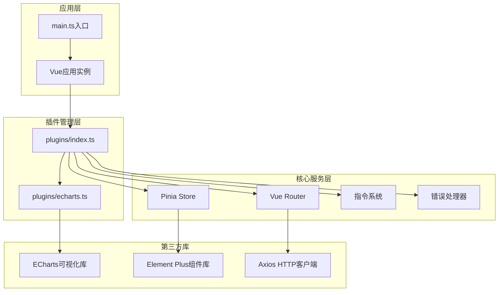

**图表来源**
- [src/main.ts](file://src/main.ts#L1-L25)
- [src/plugins/index.ts](file://src/plugins/index.ts#L1-L7)

### 插件组织结构

插件系统采用分层架构设计，每个插件模块负责特定的功能领域：

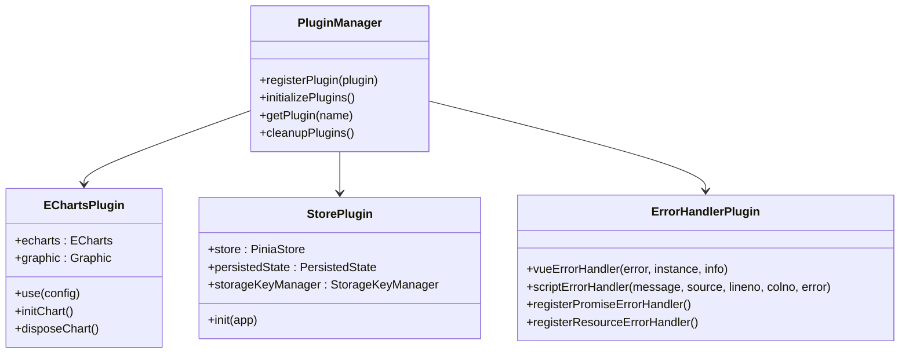

**图表来源**
- [src/plugins/echarts.ts](file://src/plugins/echarts.ts#L1-L77)
- [src/store/index.ts](file://src/store/index.ts#L1-L53)
- [src/utils/sys/error-handle.ts](file://src/utils/sys/error-handle.ts#L1-L103)

**章节来源**
- [src/plugins/index.ts](file://src/plugins/index.ts#L1-L7)
- [src/main.ts](file://src/main.ts#L1-L25)

## ECharts可视化库集成

### 懒加载策略

ECharts插件实现了精细的按需导入策略，只注册项目中实际使用的图表类型和组件，显著减小打包体积。

#### 图表类型按需导入

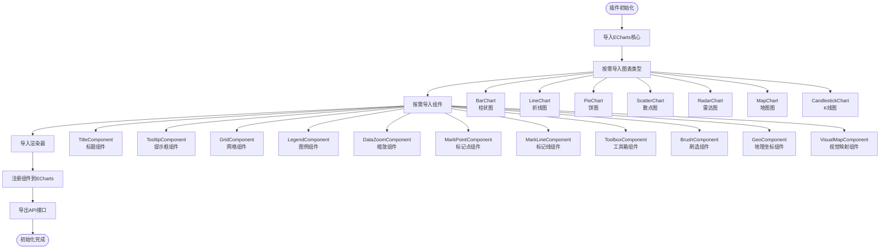

**图表来源**
- [src/plugins/echarts.ts](file://src/plugins/echarts.ts#L12-L69)

### 主题注入机制

ECharts插件集成了完整的主题系统，支持深色/浅色模式自动切换：

#### 主题配置架构

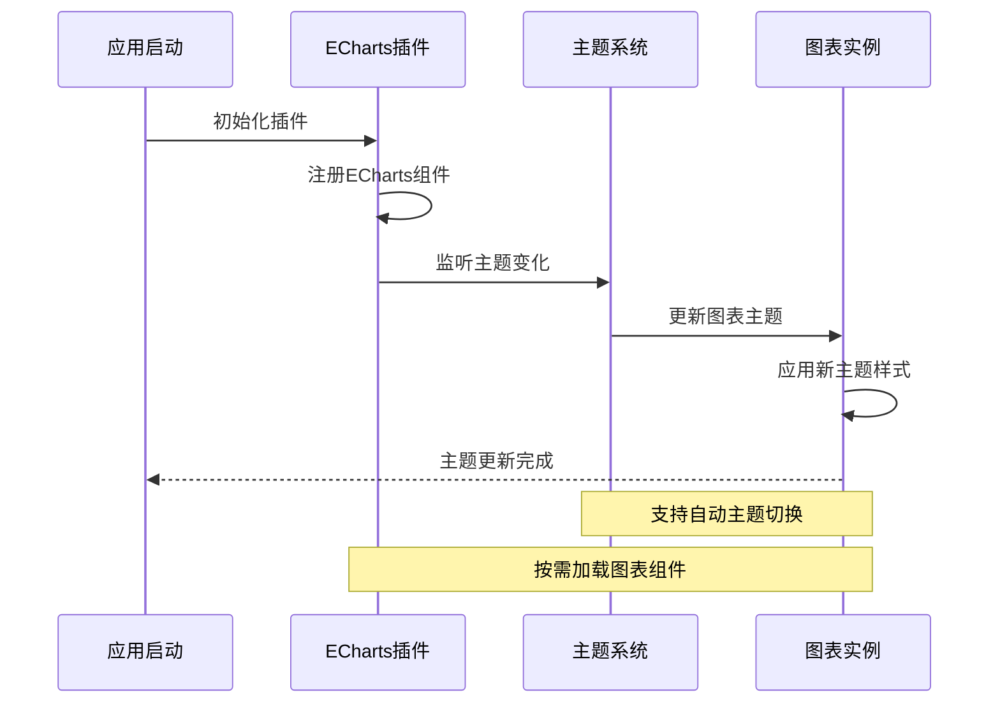

**图表来源**
- [src/hooks/core/useChart.ts](file://src/hooks/core/useChart.ts#L1-L676)
- [src/types/component/chart.ts](file://src/types/component/chart.ts#L1-L69)

### 全局属性调用

插件通过Vue的全局属性机制，在应用实例上注入$echarts属性，提供统一的图表操作接口：

#### 图表渲染流程

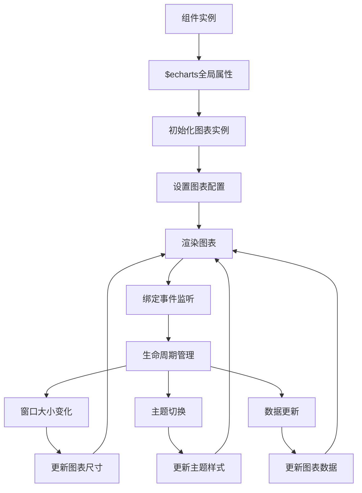

**图表来源**
- [src/components/core/charts/art-line-chart/index.vue](file://src/components/core/charts/art-line-chart/index.vue#L1-L200)
- [src/components/core/charts/art-scatter-chart/index.vue](file://src/components/core/charts/art-scatter-chart/index.vue#L1-L59)

**章节来源**
- [src/plugins/echarts.ts](file://src/plugins/echarts.ts#L1-L77)
- [src/hooks/core/useChart.ts](file://src/hooks/core/useChart.ts#L1-L676)

## 插件注册机制

### app.use()方法挂载

Art Design Pro通过Vue的app.use()方法统一管理插件的注册和初始化过程：

#### 注册流程设计

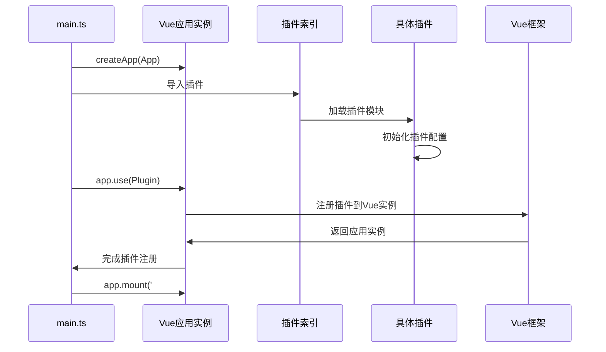

**图表来源**
- [src/main.ts](file://src/main.ts#L18-L25)

### 全局范围功能服务

插件系统不仅提供图表功能，还通过全局属性和组合式API的形式提供可复用的功能服务：

#### 全局服务架构

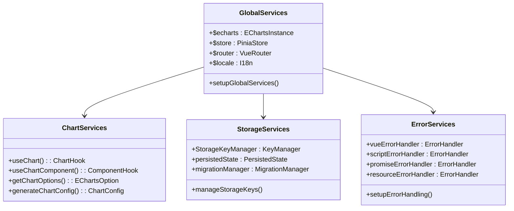

**图表来源**
- [src/store/index.ts](file://src/store/index.ts#L1-L53)
- [src/utils/sys/error-handle.ts](file://src/utils/sys/error-handle.ts#L1-L103)

**章节来源**
- [src/main.ts](file://src/main.ts#L18-L25)
- [src/store/index.ts](file://src/store/index.ts#L48-L53)

## 全局属性和服务

### 插件入口函数设计

每个插件都遵循统一的入口函数设计模式，提供标准化的初始化和配置接口：

#### 插件接口规范

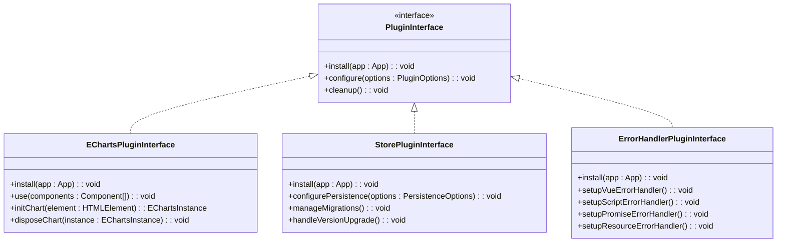

**图表来源**
- [src/plugins/echarts.ts](file://src/plugins/echarts.ts#L1-L77)
- [src/store/index.ts](file://src/store/index.ts#L48-L53)
- [src/utils/sys/error-handle.ts](file://src/utils/sys/error-handle.ts#L97-L103)

### 组合式API设计

插件系统提供了丰富的组合式API，简化了复杂功能的使用：

#### useChart Hook设计

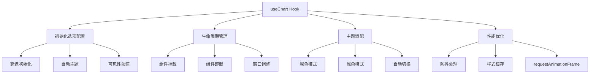

**图表来源**
- [src/hooks/core/useChart.ts](file://src/hooks/core/useChart.ts#L85-L622)

**章节来源**
- [src/hooks/core/useChart.ts](file://src/hooks/core/useChart.ts#L1-L676)
- [src/types/component/chart.ts](file://src/types/component/chart.ts#L1-L69)

## 错误处理机制

### 统一错误捕获

插件系统实现了多层次的错误处理机制，确保应用的稳定性和用户体验：

#### 错误处理架构

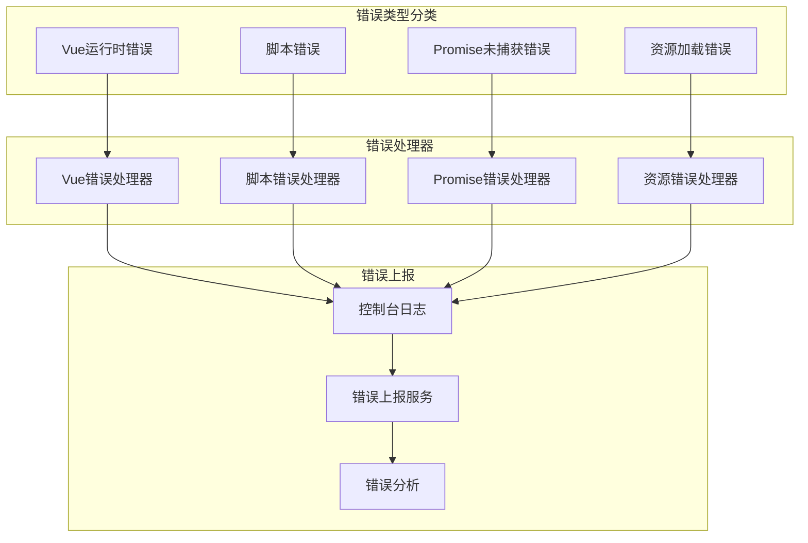

**图表来源**
- [src/utils/sys/error-handle.ts](file://src/utils/sys/error-handle.ts#L37-L102)

### 错误恢复策略

插件系统提供了多种错误恢复策略，确保应用在异常情况下仍能正常运行：

#### 错误恢复流程

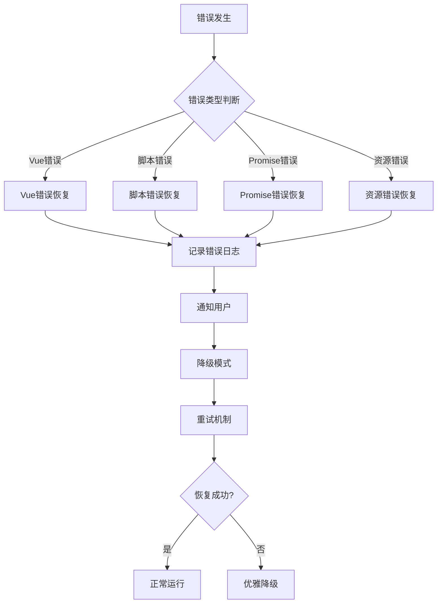

**图表来源**
- [src/utils/sys/error-handle.ts](file://src/utils/sys/error-handle.ts#L37-L102)

**章节来源**
- [src/utils/sys/error-handle.ts](file://src/utils/sys/error-handle.ts#L1-L103)

## 兼容性保障措施

### 版本管理机制

插件系统实现了完整的版本管理机制，确保不同版本间的兼容性和数据迁移：

#### 版本管理架构

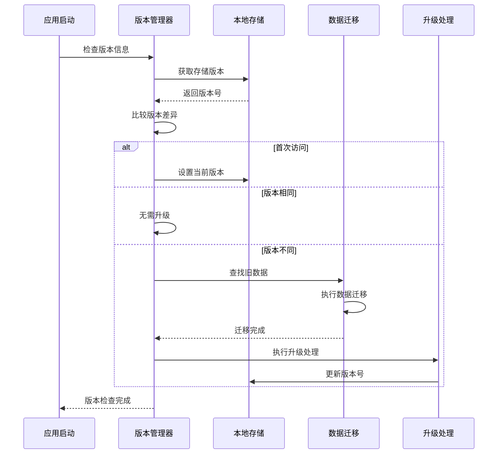

**图表来源**
- [src/utils/sys/upgrade.ts](file://src/utils/sys/upgrade.ts#L232-L277)

### 数据迁移策略

插件系统提供了智能的数据迁移策略，确保版本升级过程中数据的完整性和一致性：

#### 数据迁移流程

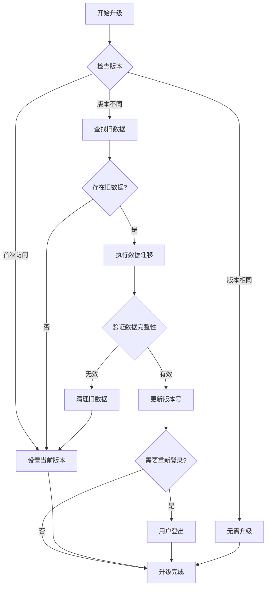

**图表来源**
- [src/utils/sys/upgrade.ts](file://src/utils/sys/upgrade.ts#L232-L277)

### 降级方案设计

当插件出现不兼容或故障时，系统提供了完整的降级方案：

#### 降级策略矩阵

| 功能模块 | 主要功能 | 降级策略 | 影响范围 |
|---------|---------|---------|---------|
| ECharts插件 | 图表渲染 | 使用基础图表组件 | 图表显示受限 |
| Store插件 | 状态管理 | 使用内存状态 | 数据持久化失效 |
| Router插件 | 路由导航 | 使用静态路由 | 页面跳转受限 |
| Directive插件 | 指令系统 | 禁用相关指令 | 功能特性受限 |

**章节来源**
- [src/utils/sys/upgrade.ts](file://src/utils/sys/upgrade.ts#L54-L277)
- [src/utils/storage/storage-key-manager.ts](file://src/utils/storage/storage-key-manager.ts#L1-L98)

## 自定义插件开发指南

### 插件开发流程

开发自定义插件需要遵循标准的开发流程，确保插件的质量和兼容性：

#### 插件开发步骤

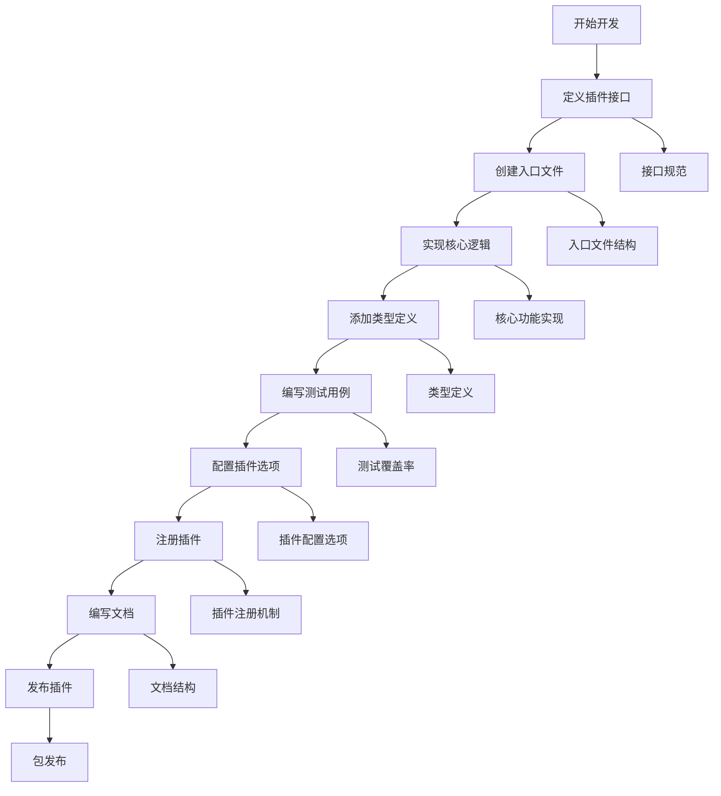

### 插件模板设计

以下是标准的插件开发模板：

#### 基础插件结构

```typescript
// plugins/custom-plugin.ts
import type { App } from 'vue'

export interface CustomPluginOptions {
  // 插件配置选项
  apiKey?: string
  debug?: boolean
  timeout?: number
}

export class CustomPlugin {
  private options: CustomPluginOptions
  
  constructor(options: CustomPluginOptions = {}) {
    this.options = {
      debug: false,
      timeout: 5000,
      ...options
    }
  }
  
  install(app: App): void {
    // 注册全局属性
    app.config.globalProperties.$custom = this.createCustomAPI()
    
    // 注册组合式API
    app.provide('customAPI', this.createCustomAPI())
    
    // 注册指令
    app.directive('custom', this.createCustomDirective())
    
    // 初始化插件
    this.initialize()
  }
  
  private createCustomAPI() {
    return {
      // API方法
      fetchData: this.fetchData.bind(this),
      processData: this.processData.bind(this),
      cleanup: this.cleanup.bind(this)
    }
  }
  
  private initialize() {
    // 插件初始化逻辑
  }
  
  private async fetchData(url: string) {
    // 数据获取逻辑
  }
  
  private processData(data: any) {
    // 数据处理逻辑
  }
  
  private cleanup() {
    // 清理资源
  }
}

// 导出插件工厂函数
export function createCustomPlugin(options?: CustomPluginOptions) {
  return new CustomPlugin(options)
}
```

### 插件注册全局属性

插件可以通过多种方式注册全局属性：

#### 全局属性注册方式

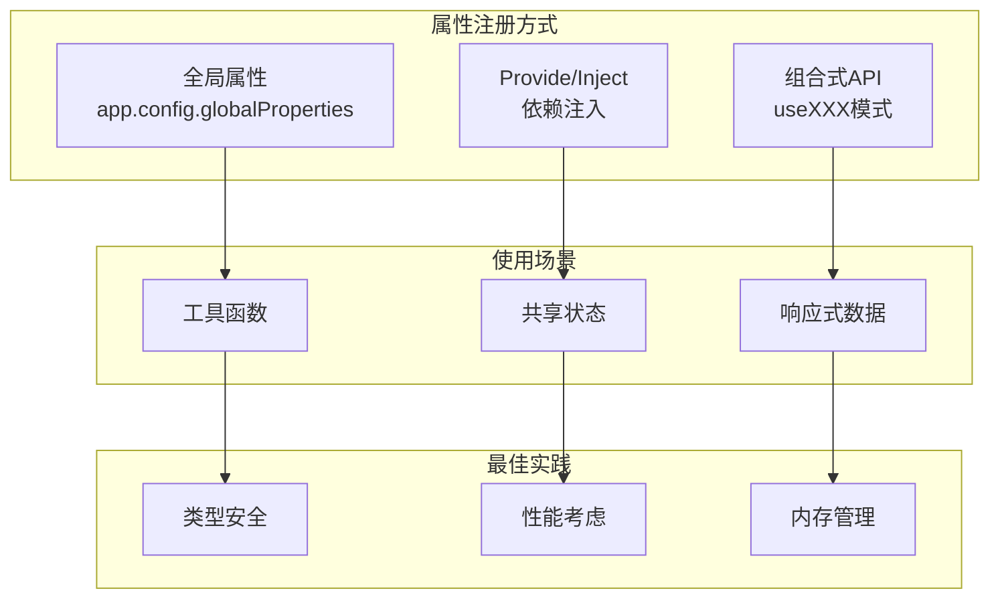

**章节来源**
- [src/plugins/echarts.ts](file://src/plugins/echarts.ts#L1-L77)
- [src/store/index.ts](file://src/store/index.ts#L48-L53)

## 性能监控与资源管理

### 性能监控指标

插件系统实现了全面的性能监控机制，跟踪关键性能指标：

#### 性能监控架构

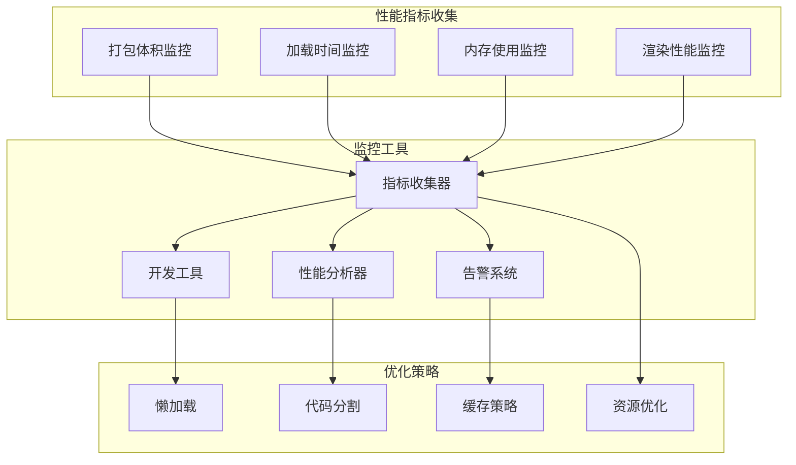

### 资源占用评估

插件系统提供了详细的资源占用评估方法：

#### 资源评估矩阵

| 资源类型 | 评估指标 | 监控方法 | 优化建议 |
|---------|---------|---------|---------|
| 内存占用 | 堆内存使用量 | Memory API | 对象池化、及时清理 |
| CPU使用率 | 计算密集度 | Performance API | 防抖、节流、Web Workers |
| 网络请求 | 请求数量和大小 | Network API | 请求合并、压缩传输 |
| 存储空间 | 本地存储使用量 | Storage API | 清理过期数据、压缩存储 |

### 性能优化策略

插件系统采用了多种性能优化策略：

#### 优化策略流程

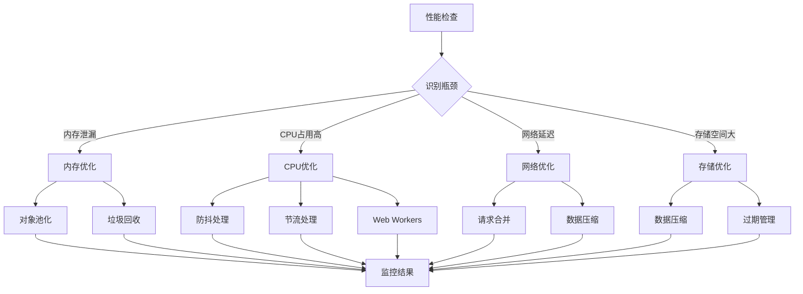

**章节来源**
- [src/hooks/core/useChart.ts](file://src/hooks/core/useChart.ts#L561-L582)
- [src/utils/sys/upgrade.ts](file://src/utils/sys/upgrade.ts#L232-L277)

## 最佳实践与建议

### 插件设计原则

基于Art Design Pro的插件系统架构，总结出以下设计原则：

#### 设计原则矩阵

| 原则类别 | 具体原则 | 实现方法 | 验证标准 |
|---------|---------|---------|---------|
| 模块化 | 单一职责 | 功能分离、接口清晰 | 每个插件专注单一功能 |
| 可扩展性 | 开放封闭 | 接口抽象、钩子机制 | 易于扩展新功能 |
| 可维护性 | 代码规范 | 类型安全、单元测试 | 代码质量达标 |
| 性能优化 | 按需加载 | 懒加载、代码分割 | 性能指标符合要求 |
| 兼容性 | 向后兼容 | 版本管理、降级策略 | 不影响现有功能 |

### 开发建议

#### 插件开发最佳实践

```mermaid
mindmap
root((插件开发最佳实践))
设计阶段
接口设计
明确职责边界
统一命名规范
完整类型定义
架构设计
模块化结构
依赖管理
错误处理
实现阶段
代码质量
类型安全
单元测试
文档完善
性能考虑
懒加载实现
内存管理
缓存策略
发布阶段
版本控制
语义化版本
变更日志
兼容性声明
测试验证
功能测试
性能测试
兼容性测试
```

### 常见问题解决

#### 问题诊断流程

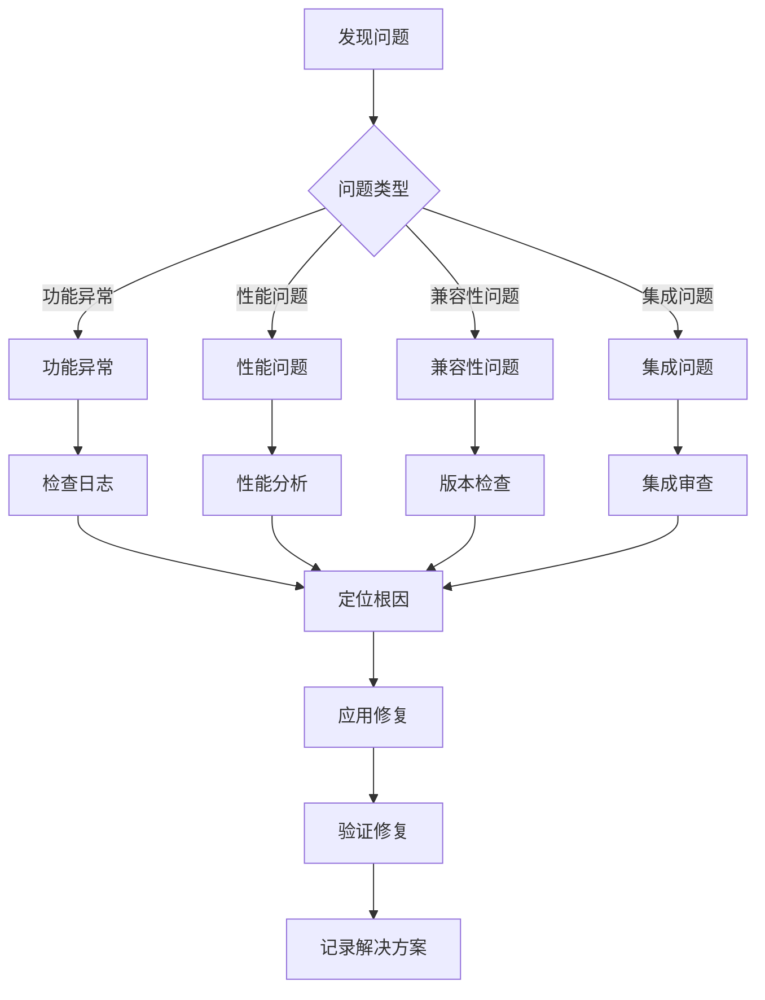

### 未来发展方向

插件系统将继续朝着更加智能化和自动化的方向发展：

#### 发展趋势

- **AI辅助开发**：利用AI生成插件代码和配置
- **自动化测试**：智能测试用例生成和执行
- **性能预测**：基于机器学习的性能预测模型
- **智能优化**：自动化的性能优化建议和实施
- **生态建设**：构建插件生态系统和共享平台

通过持续的优化和改进，Art Design Pro的插件系统将为开发者提供更加高效、稳定和易用的开发体验。