# 组合式函数

<cite>
**本文档中引用的文件**
- [src/hooks/index.ts](file://src/hooks/index.ts)
- [src/hooks/core/useAuth.ts](file://src/hooks/core/useAuth.ts)
- [src/hooks/core/useTheme.ts](file://src/hooks/core/useTheme.ts)
- [src/hooks/core/useTable.ts](file://src/hooks/core/useTable.ts)
- [src/hooks/core/useTableHeight.ts](file://src/hooks/core/useTableHeight.ts)
- [src/hooks/core/useCommon.ts](file://src/hooks/core/useCommon.ts)
- [src/hooks/core/useChart.ts](file://src/hooks/core/useChart.ts)
- [src/hooks/core/useLayoutHeight.ts](file://src/hooks/core/useLayoutHeight.ts)
- [src/hooks/core/useAppMode.ts](file://src/hooks/core/useAppMode.ts)
- [src/hooks/core/useTableColumns.ts](file://src/hooks/core/useTableColumns.ts)
- [src/views/examples/tables/basic.vue](file://src/views/examples/tables/basic.vue)
- [src/views/system/user/index.vue](file://src/views/system/user/index.vue)
- [src/views/system/menu/index.vue](file://src/views/system/menu/index.vue)
- [src/views/examples/permission/button-auth/index.vue](file://src/views/examples/permission/button-auth/index.vue)
- [src/views/examples/permission/page-visibility/index.vue](file://src/views/examples/permission/page-visibility/index.vue)
- [src/directives/core/auth.ts](file://src/directives/core/auth.ts)
</cite>

## 目录
1. [简介](#简介)
2. [项目结构](#项目结构)
3. [核心组件](#核心组件)
4. [架构概览](#架构概览)
5. [详细组件分析](#详细组件分析)
6. [依赖关系分析](#依赖关系分析)
7. [性能考虑](#性能考虑)
8. [故障排除指南](#故障排除指南)
9. [结论](#结论)

## 简介

Art Design Pro 是一个基于 Vue 3 Composition API 的企业级后台管理系统，采用了现代化的组合式函数（Composition API Hooks）设计模式。这套设计模式通过将状态逻辑、副作用处理和跨组件通信封装在独立的组合式函数中，实现了高度的模块化和可复用性。

组合式函数是 Vue 3 中引入的一种新的逻辑组织方式，它允许开发者将相关的状态、逻辑和副作用封装在一起，形成独立的功能单元。在 Art Design Pro 中，这种设计模式被广泛应用于权限管理、主题切换、表格数据管理、图表渲染等核心功能模块。

## 项目结构

Art Design Pro 的组合式函数采用模块化的组织结构，主要分布在 `src/hooks` 目录下：

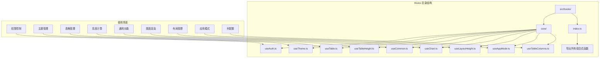

**图表来源**
- [src/hooks/index.ts](file://src/hooks/index.ts#L1-L33)
- [src/hooks/core/useAuth.ts](file://src/hooks/core/useAuth.ts#L1-L75)
- [src/hooks/core/useTheme.ts](file://src/hooks/core/useTheme.ts#L1-L175)

**章节来源**
- [src/hooks/index.ts](file://src/hooks/index.ts#L1-L33)

## 核心组件

Art Design Pro 中的组合式函数可以分为以下几个核心类别：

### 权限控制类
- **useAuth**: 统一的权限验证管理，支持前端和后端两种权限模式
- **useAppMode**: 应用访问模式管理，区分前端权限控制和后端权限控制

### 主题管理类
- **useTheme**: 系统主题管理，支持亮色、暗色和自动模式
- **useChart**: ECharts 图表管理，自动处理图表生命周期和主题适配

### 数据管理类
- **useTable**: 企业级表格数据管理方案，封装了完整的表格开发需求
- **useTableColumns**: 表格列配置管理，支持动态列控制
- **useTableHeight**: 表格高度自动计算
- **useCommon**: 通用功能集合，包括页面刷新、滚动控制等

### 布局管理类
- **useLayoutHeight**: 页面布局高度管理
- **useAutoLayoutHeight**: 自动查找元素的布局高度管理

**章节来源**
- [src/hooks/core/useAuth.ts](file://src/hooks/core/useAuth.ts#L1-L75)
- [src/hooks/core/useTheme.ts](file://src/hooks/core/useTheme.ts#L1-L175)
- [src/hooks/core/useTable.ts](file://src/hooks/core/useTable.ts#L1-L737)
- [src/hooks/core/useCommon.ts](file://src/hooks/core/useCommon.ts#L1-L88)

## 架构概览

Art Design Pro 的组合式函数架构采用了分层设计，每一层都有明确的职责和边界：

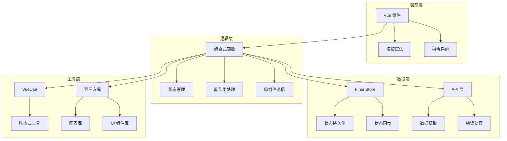

**图表来源**
- [src/hooks/core/useAuth.ts](file://src/hooks/core/useAuth.ts#L33-L46)
- [src/hooks/core/useTable.ts](file://src/hooks/core/useTable.ts#L20-L22)
- [src/hooks/core/useTheme.ts](file://src/hooks/core/useTheme.ts#L42-L44)

## 详细组件分析

### useAuth - 权限验证管理

`useAuth` 是 Art Design Pro 中最重要的组合式函数之一，负责统一的权限验证功能。它支持前端和后端两种权限模式，能够根据当前应用模式自动适配不同的权限验证策略。

#### 核心功能架构

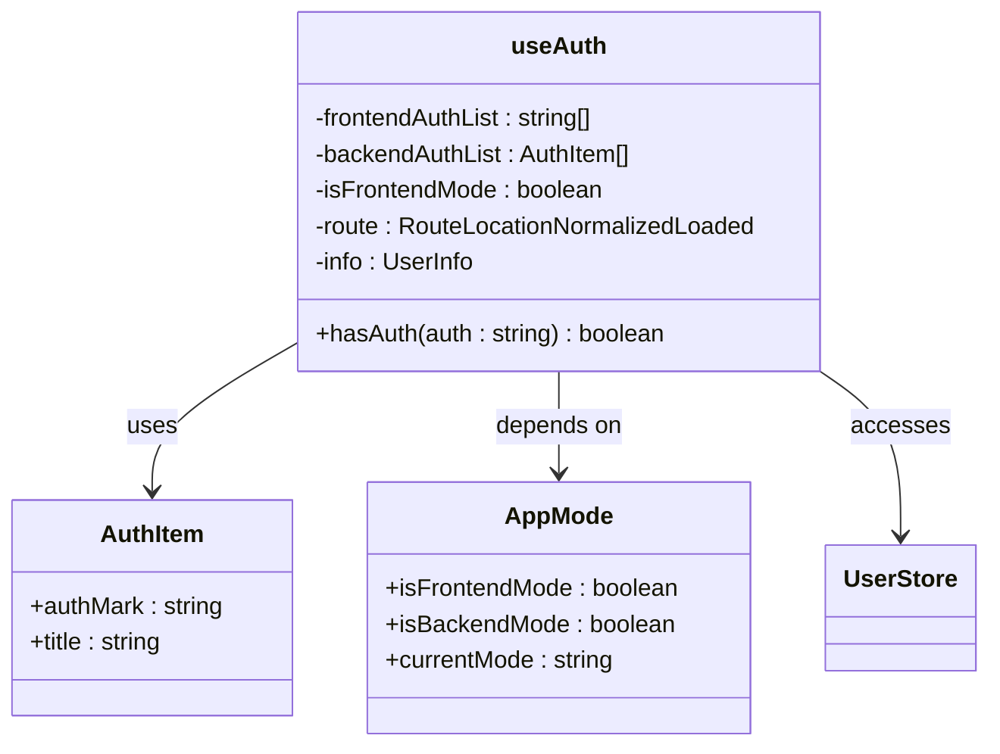

**图表来源**
- [src/hooks/core/useAuth.ts](file://src/hooks/core/useAuth.ts#L39-L74)

#### 权限验证流程

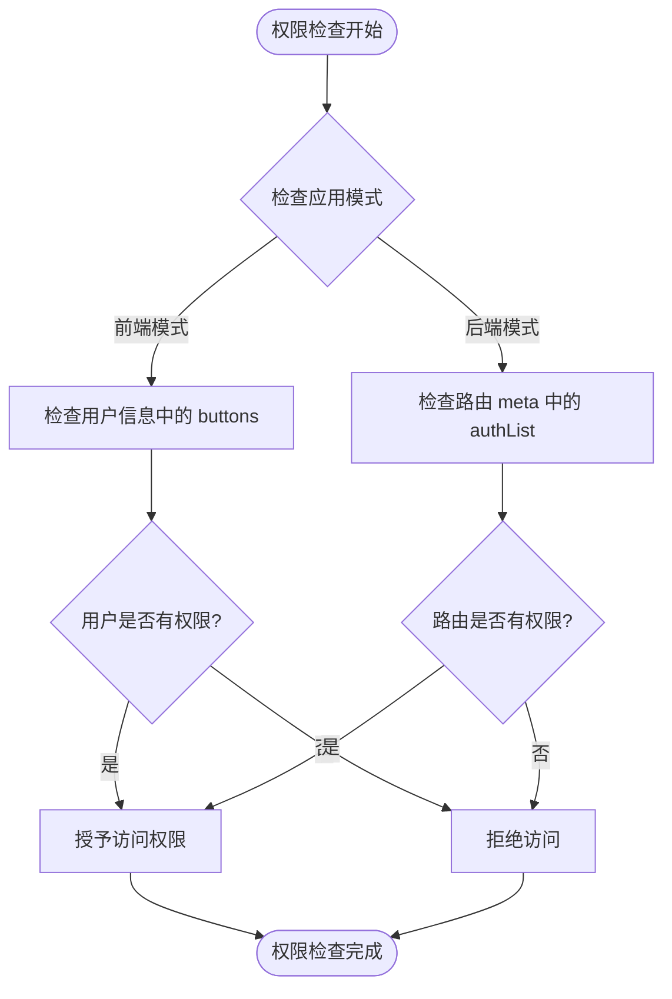

**图表来源**
- [src/hooks/core/useAuth.ts](file://src/hooks/core/useAuth.ts#L61-L69)

#### 使用示例

在模板中使用权限指令：

```vue
<template>
  <!-- 基于 v-auth 指令的权限控制 -->
  <el-button v-auth="'add'">新增用户</el-button>
  
  <!-- 基于 hasAuth 方法的编程式权限控制 -->
  <el-button :disabled="!hasAuth('edit')">编辑</el-button>
</template>

<script setup>
import { useAuth } from '@/hooks/core/useAuth'

const { hasAuth } = useAuth()

// 在逻辑中使用权限检查
if (hasAuth('admin')) {
  // 执行管理员操作
}
</script>
```

**章节来源**
- [src/hooks/core/useAuth.ts](file://src/hooks/core/useAuth.ts#L1-L75)
- [src/views/examples/permission/button-auth/index.vue](file://src/views/examples/permission/button-auth/index.vue#L137-L146)

### useTheme - 系统主题管理

`useTheme` 提供了完整的主题切换和管理功能，支持亮色、暗色和自动三种主题模式。它不仅处理主题切换的视觉效果，还自动调整主题色的明暗变体，并优化切换过程中的过渡效果。

#### 主题切换机制

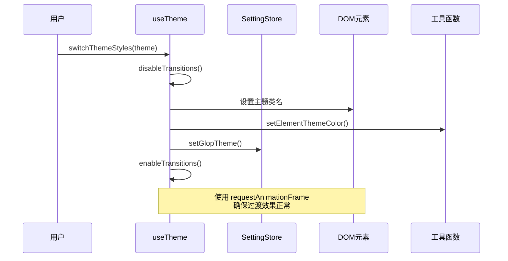

**图表来源**
- [src/hooks/core/useTheme.ts](file://src/hooks/core/useTheme.ts#L61-L98)

#### 主题初始化流程

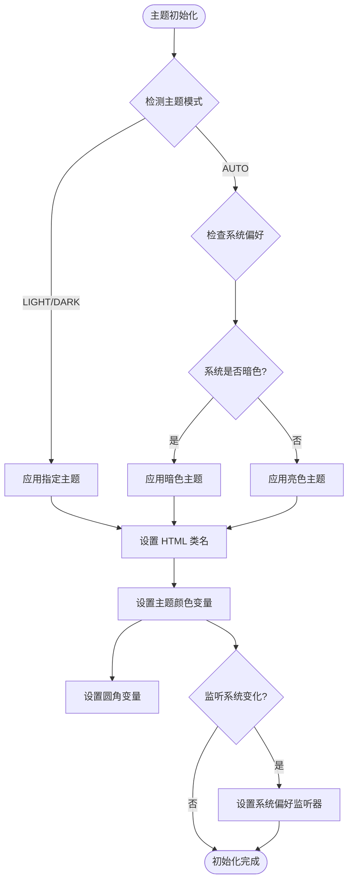

**图表来源**
- [src/hooks/core/useTheme.ts](file://src/hooks/core/useTheme.ts#L129-L174)

**章节来源**
- [src/hooks/core/useTheme.ts](file://src/hooks/core/useTheme.ts#L1-L175)

### useTable - 企业级表格数据管理

`useTable` 是 Art Design Pro 中最复杂的组合式函数，提供了完整的表格数据管理解决方案。它封装了表格开发中的所有常见需求，包括数据获取、分页控制、搜索功能、缓存系统、刷新策略等。

#### 核心架构设计

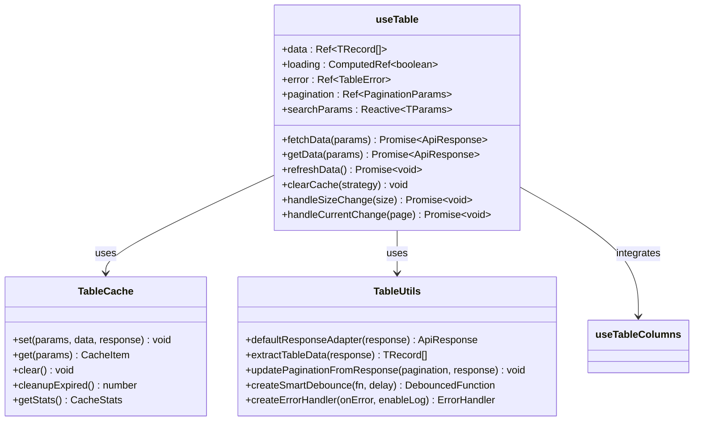

**图表来源**
- [src/hooks/core/useTable.ts](file://src/hooks/core/useTable.ts#L115-L731)

#### 数据流处理机制

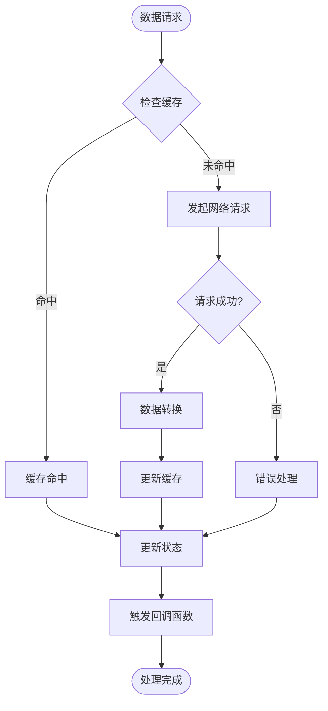

**图表来源**
- [src/hooks/core/useTable.ts](file://src/hooks/core/useTable.ts#L278-L411)

#### 缓存系统设计

`useTable` 实现了一个智能的缓存系统，支持多种缓存策略和清理策略：

| 缓存策略 | 描述 | 使用场景 |
|---------|------|----------|
| CLEAR_ALL | 清空所有缓存 | 全量刷新、用户登出 |
| CLEAR_CURRENT | 清空当前搜索条件的缓存 | 搜索操作、参数变更 |
| CLEAR_PAGINATION | 清空分页相关缓存 | 新增数据后刷新 |
| KEEP_ALL | 保持缓存不变 | 轻量刷新、定时更新 |

**章节来源**
- [src/hooks/core/useTable.ts](file://src/hooks/core/useTable.ts#L1-L737)

### useTableHeight - 表格高度自动计算

`useTableHeight` 专门负责表格容器的高度计算，确保表格在不同布局场景下都能正确显示。它根据表格头部、分页器等元素的高度动态调整容器高度，避免出现滚动条或布局错乱。

#### 高度计算算法

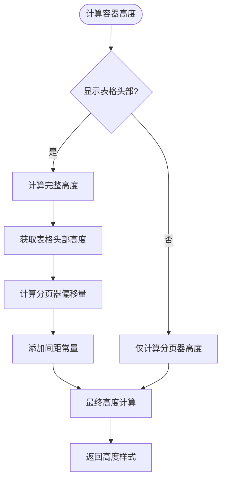

**图表来源**
- [src/hooks/core/useTableHeight.ts](file://src/hooks/core/useTableHeight.ts#L44-L66)

**章节来源**
- [src/hooks/core/useTableHeight.ts](file://src/hooks/core/useTableHeight.ts#L1-L106)

### useChart - ECharts 图表管理

`useChart` 提供了完整的 ECharts 图表生命周期管理和配置能力，自动处理图表初始化、更新、销毁、主题切换、响应式调整等复杂逻辑。

#### 图表生命周期管理

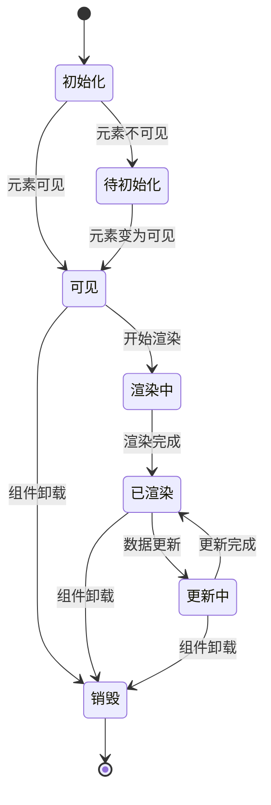

**图表来源**
- [src/hooks/core/useChart.ts](file://src/hooks/core/useChart.ts#L436-L581)

**章节来源**
- [src/hooks/core/useChart.ts](file://src/hooks/core/useChart.ts#L1-L746)

## 依赖关系分析

Art Design Pro 中的组合式函数之间存在复杂的依赖关系，形成了一个有机的整体：

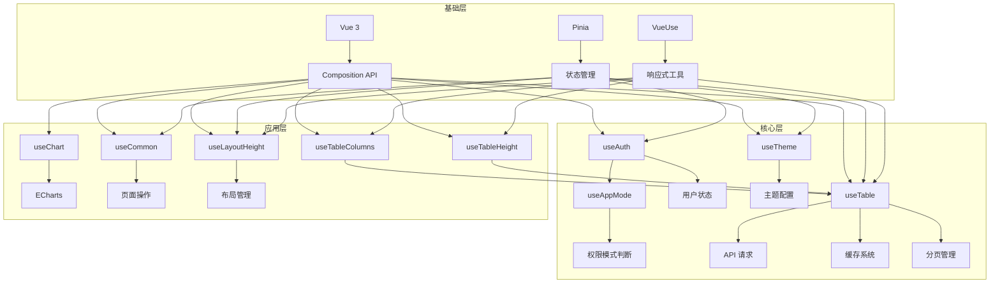

**图表来源**
- [src/hooks/core/useAuth.ts](file://src/hooks/core/useAuth.ts#L33-L46)
- [src/hooks/core/useTable.ts](file://src/hooks/core/useTable.ts#L20-L22)
- [src/hooks/core/useTheme.ts](file://src/hooks/core/useTheme.ts#L34-L44)

### 关键依赖关系

1. **useAuth 依赖 useAppMode 和 Pinia Store**
   - `useAppMode` 提供权限模式判断
   - Pinia Store 提供用户状态信息

2. **useTable 依赖多个工具模块**
   - `useTableColumns` 提供列配置管理
   - `useTableHeight` 提供高度计算
   - VueUse 提供响应式工具

3. **useChart 依赖主题系统**
   - `useTheme` 提供主题适配
   - ECharts 库提供图表渲染

**章节来源**
- [src/hooks/core/useAuth.ts](file://src/hooks/core/useAuth.ts#L33-L46)
- [src/hooks/core/useTable.ts](file://src/hooks/core/useTable.ts#L20-L22)
- [src/hooks/core/useChart.ts](file://src/hooks/core/useChart.ts#L54-L90)

## 性能考虑

在 Art Design Pro 中，组合式函数的设计充分考虑了性能优化，采用了多种策略来避免内存泄漏和不必要的重渲染：

### 内存管理策略

1. **自动清理机制**
   - 组件卸载时自动清理定时器和监听器
   - 请求取消控制器确保旧请求不会造成内存泄漏
   - 缓存系统定期清理过期数据

2. **响应式优化**
   - 使用 `readonly()` 包装只读状态
   - 合理使用 `computed()` 避免重复计算
   - 避免在组合式函数中创建不必要的响应式对象

3. **缓存优化**
   - 智能缓存策略，支持多种清理策略
   - 缓存大小限制，防止内存溢出
   - 延迟清理机制，平衡性能和内存使用

### 性能监控

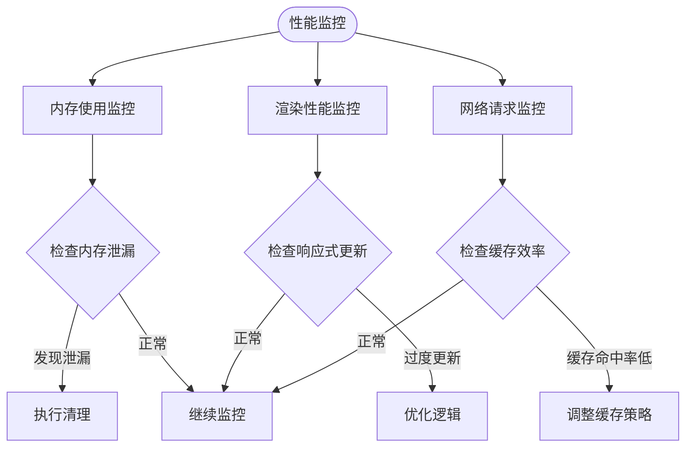

## 故障排除指南

### 常见问题及解决方案

#### 权限控制问题

**问题**: 按钮权限不生效
**原因**: 应用模式配置错误或权限数据未正确加载
**解决方案**:
1. 检查 `.env` 文件中的 `VITE_ACCESS_MODE` 配置
2. 确认用户状态中的权限数据是否正确
3. 验证路由配置中的权限列表

#### 表格数据加载问题

**问题**: 表格数据不显示或加载缓慢
**原因**: API 请求失败、缓存配置不当或分页参数错误
**解决方案**:
1. 检查 API 接口返回格式是否符合预期
2. 验证 `responseAdapter` 配置是否正确
3. 检查分页参数配置

#### 主题切换问题

**问题**: 主题切换后样式不生效
**原因**: CSS 变量未正确更新或主题配置错误
**解决方案**:
1. 检查主题颜色配置是否正确
2. 验证 CSS 变量绑定是否生效
3. 确认主题切换逻辑是否正确执行

**章节来源**
- [src/hooks/core/useAuth.ts](file://src/hooks/core/useAuth.ts#L61-L69)
- [src/hooks/core/useTable.ts](file://src/hooks/core/useTable.ts#L278-L411)
- [src/hooks/core/useTheme.ts](file://src/hooks/core/useTheme.ts#L61-L98)

## 结论

Art Design Pro 的组合式函数设计体现了现代 Vue.js 开发的最佳实践。通过将状态逻辑、副作用处理和跨组件通信封装在独立的组合式函数中，实现了高度的模块化和可复用性。

### 设计优势

1. **高度模块化**: 每个组合式函数都有明确的职责边界
2. **强类型支持**: 完整的 TypeScript 类型定义
3. **性能优化**: 智能缓存、响应式优化和内存管理
4. **易于测试**: 独立的功能单元便于单元测试
5. **扩展性强**: 清晰的接口设计支持功能扩展

### 最佳实践总结

1. **合理使用解构**: 从组合式函数中解构需要的状态和方法
2. **注意依赖关系**: 理解组合式函数之间的依赖关系
3. **性能监控**: 定期检查内存使用和渲染性能
4. **错误处理**: 完善的错误处理和降级机制
5. **类型安全**: 充分利用 TypeScript 的类型推导能力

这套组合式函数设计模式不仅提高了开发效率，也为项目的长期维护奠定了坚实的基础。随着项目的发展，这种设计模式将继续发挥重要作用，支撑系统的持续演进和优化。