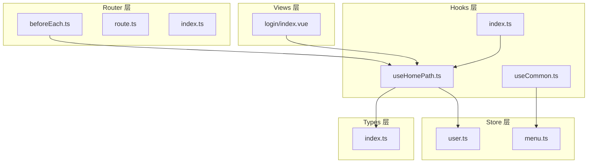
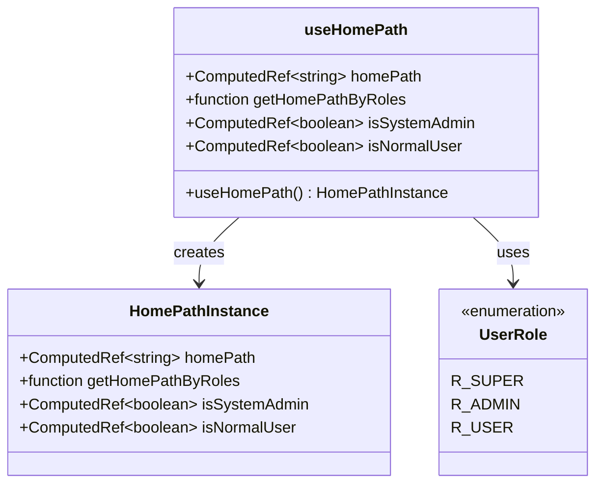
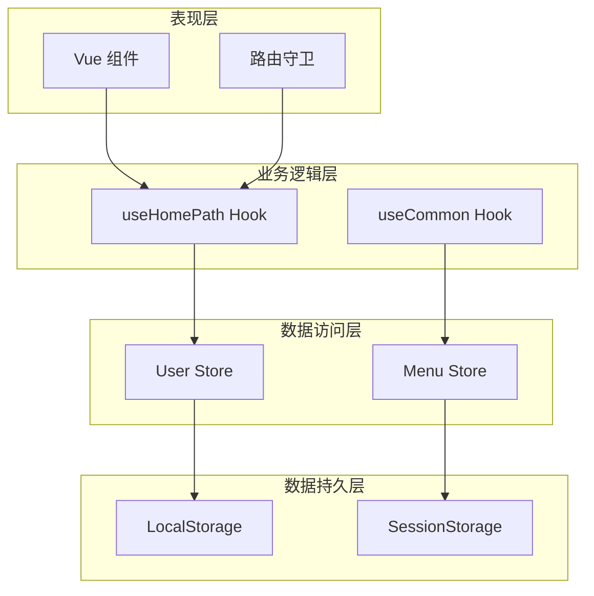
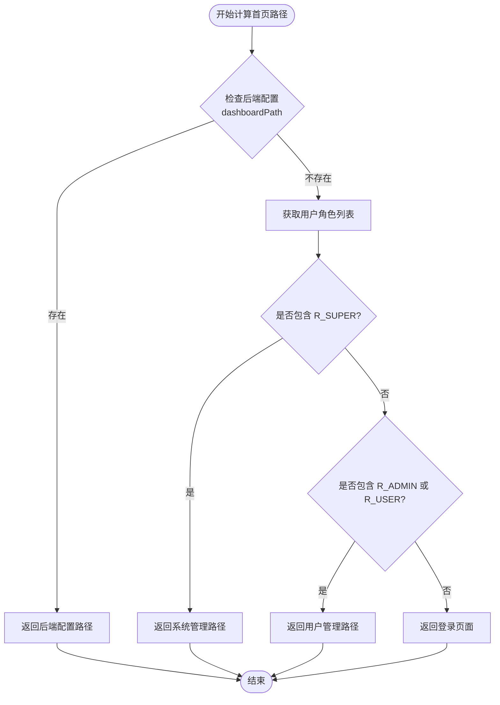
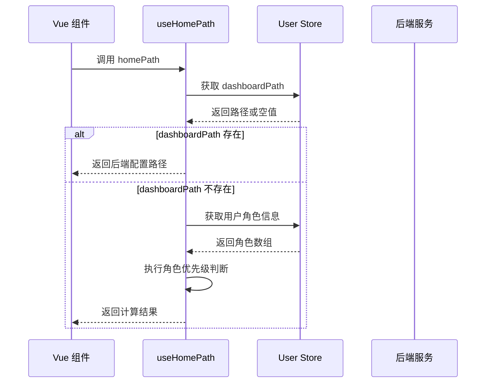
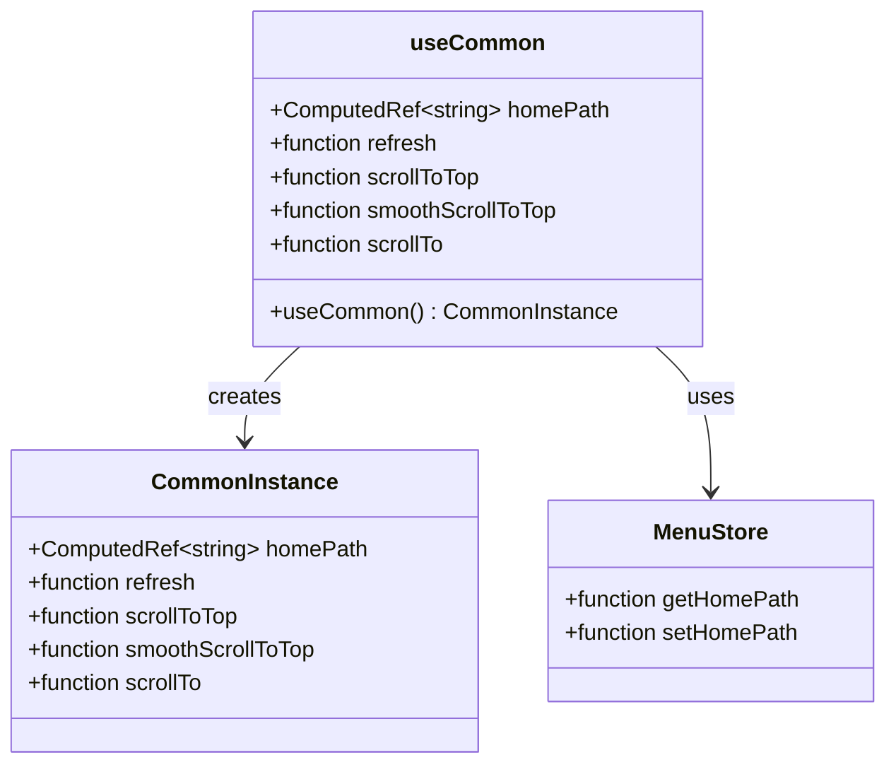
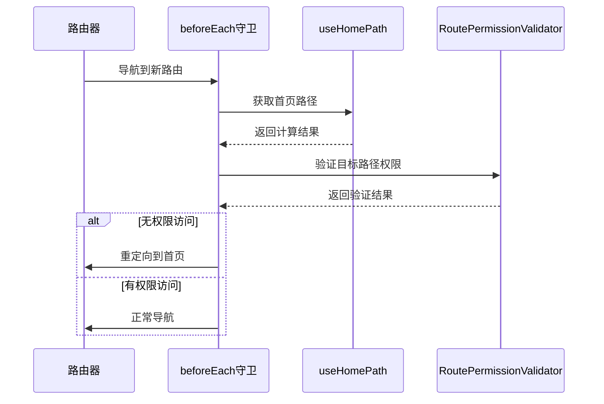
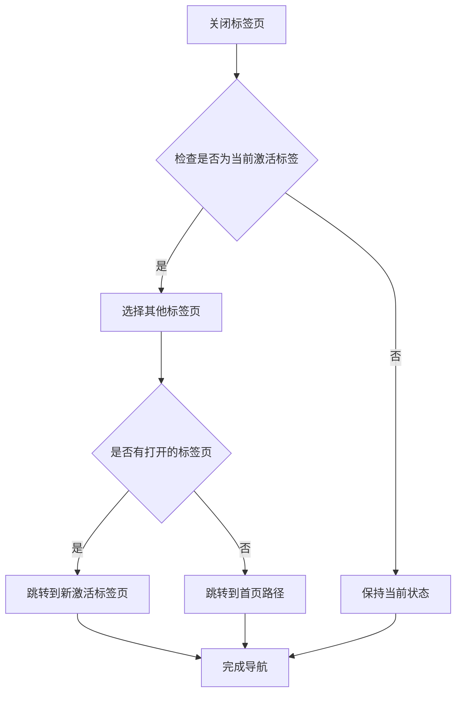
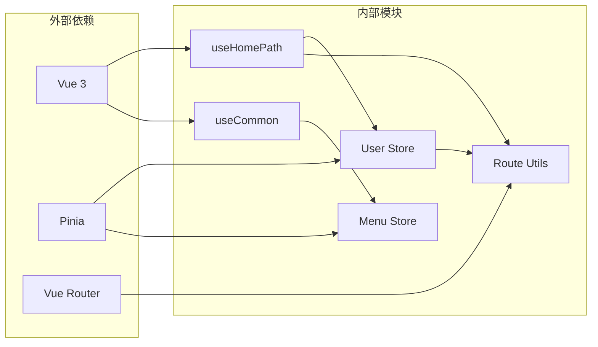
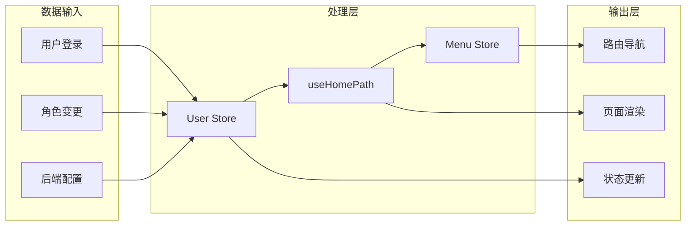

# Use Home Path

<cite>
**本文档中引用的文件**
- [useHomePath.ts](file://src/hooks/core/useHomePath.ts)
- [useCommon.ts](file://src/hooks/core/useCommon.ts)
- [user.ts](file://src/store/modules/user.ts)
- [menu.ts](file://src/store/modules/menu.ts)
- [index.ts](file://src/hooks/index.ts)
- [beforeEach.ts](file://src/router/guards/beforeEach.ts)
- [route.ts](file://src/utils/navigation/route.ts)
- [index.ts](file://src/router/index.ts)
- [worktab.ts](file://src/store/modules/worktab.ts)
- [index.vue](file://src/views/auth/login/index.vue)
- [index.ts](file://src/types/common/index.ts)
</cite>

## 目录

1. [简介](#简介)
2. [项目结构](#项目结构)
3. [核心组件](#核心组件)
4. [架构概览](#架构概览)
5. [详细组件分析](#详细组件分析)
6. [依赖关系分析](#依赖关系分析)
7. [性能考虑](#性能考虑)
8. [故障排除指南](#故障排除指南)
9. [结论](#结论)

## 简介

"Use Home Path" 是 Art Design Pro 前端框架中的一个核心功能模块，专门负责管理系统首页路径的动态计算和管理。该模块通过组合式函数的形式提供灵活的首页路径解决方案，支持基于用户角色的动态路由分配、后端配置的优先级处理以及响应式的路径管理机制。

该功能的主要特点包括：

- **角色驱动的路径分配**：根据用户角色自动计算合适的首页路径
- **后端优先级处理**：优先使用后端返回的 dashboardPath 配置
- **响应式状态管理**：基于 Vue 3 的 computed 属性实现响应式路径更新
- **权限验证集成**：与路由守卫和权限系统深度集成
- **灵活的扩展性**：支持静态方法和组合式函数两种使用方式

## 项目结构

"Use Home Path" 功能在整个项目中的组织结构如下：



**图表来源**

- [useHomePath.ts](file://src/hooks/core/useHomePath.ts#L1-L85)
- [useCommon.ts](file://src/hooks/core/useCommon.ts#L1-L88)
- [user.ts](file://src/store/modules/user.ts#L1-L249)

**章节来源**

- [useHomePath.ts](file://src/hooks/core/useHomePath.ts#L1-L85)
- [useCommon.ts](file://src/hooks/core/useCommon.ts#L1-L88)
- [index.ts](file://src/hooks/index.ts#L1-L39)

## 核心组件

### useHomePath 组合式函数

`useHomePath` 是整个功能的核心，提供了完整的首页路径管理能力：



**图表来源**

- [useHomePath.ts](file://src/hooks/core/useHomePath.ts#L40-L84)
- [index.ts](file://src/types/common/index.ts#L101-L132)

### 用户角色类型定义

系统定义了三种主要用户角色，每种角色对应不同的首页路径：

| 角色类型 | 权限级别   | 默认首页路径                | 用途描述         |
| -------- | ---------- | --------------------------- | ---------------- |
| R_SUPER  | 最高权限   | `/system/dashboard/console` | 系统管理员后台   |
| R_ADMIN  | 管理员权限 | `/user/dashboard/console`   | 普通用户管理界面 |
| R_USER   | 基础权限   | `/user/dashboard/console`   | 普通用户个人中心 |

**章节来源**

- [useHomePath.ts](file://src/hooks/core/useHomePath.ts#L19-L35)
- [index.ts](file://src/types/common/index.ts#L101-L132)

## 架构概览

"Use Home Path" 功能采用分层架构设计，确保各层职责清晰、耦合度低：



**图表来源**

- [useHomePath.ts](file://src/hooks/core/useHomePath.ts#L40-L84)
- [user.ts](file://src/store/modules/user.ts#L50-L249)
- [menu.ts](file://src/store/modules/menu.ts#L41-L110)

## 详细组件分析

### useHomePath 核心实现

#### 响应式路径计算机制

`useHomePath` 组合式函数实现了智能的路径计算逻辑：



**图表来源**

- [useHomePath.ts](file://src/hooks/core/useHomePath.ts#L47-L56)

#### 角色优先级算法

系统实现了严格的用户角色优先级处理机制：



**图表来源**

- [useHomePath.ts](file://src/hooks/core/useHomePath.ts#L47-L56)
- [user.ts](file://src/store/modules/user.ts#L61-L72)

**章节来源**

- [useHomePath.ts](file://src/hooks/core/useHomePath.ts#L40-L84)

### useCommon 通用功能集成

`useCommon` 组合式函数提供了更高级的首页路径管理功能：



**图表来源**

- [useCommon.ts](file://src/hooks/core/useCommon.ts#L22-L88)
- [menu.ts](file://src/store/modules/menu.ts#L60-L72)

**章节来源**

- [useCommon.ts](file://src/hooks/core/useCommon.ts#L1-L88)

### 路由守卫集成

系统在路由守卫中深度集成了首页路径功能：



**图表来源**

- [beforeEach.ts](file://src/router/guards/beforeEach.ts#L245-L251)
- [beforeEach.ts](file://src/router/guards/beforeEach.ts#L335-L346)

**章节来源**

- [beforeEach.ts](file://src/router/guards/beforeEach.ts#L245-L251)
- [beforeEach.ts](file://src/router/guards/beforeEach.ts#L335-L346)

### 工作台标签页管理

首页路径功能还与工作台标签页系统紧密集成：



**图表来源**

- [worktab.ts](file://src/store/modules/worktab.ts#L208-L213)

**章节来源**

- [worktab.ts](file://src/store/modules/worktab.ts#L200-L220)

## 依赖关系分析

### 模块间依赖关系



**图表来源**

- [useHomePath.ts](file://src/hooks/core/useHomePath.ts#L10-L13)
- [useCommon.ts](file://src/hooks/core/useCommon.ts#L18-L21)

### 数据流分析

系统中的数据流向体现了清晰的单向数据流原则：



**图表来源**

- [user.ts](file://src/store/modules/user.ts#L134-L146)
- [menu.ts](file://src/store/modules/menu.ts#L60-L72)

**章节来源**

- [useHomePath.ts](file://src/hooks/core/useHomePath.ts#L10-L13)
- [user.ts](file://src/store/modules/user.ts#L50-L249)
- [menu.ts](file://src/store/modules/menu.ts#L41-L110)

## 性能考虑

### 响应式性能优化

系统采用了多种性能优化策略：

1. **computed 缓存机制**：利用 Vue 3 的响应式系统自动缓存计算结果
2. **懒加载计算**：只有在访问 `homePath` 时才执行计算逻辑
3. **最小化依赖追踪**：精确追踪用户角色变化，避免不必要的重新计算

### 内存管理

- **自动清理**：组件卸载时自动清理响应式依赖
- **弱引用**：避免循环引用导致的内存泄漏
- **及时释放**：在适当时机释放不再需要的计算结果

## 故障排除指南

### 常见问题及解决方案

#### 1. 首页路径未正确跳转

**症状**：登录后仍然停留在根路径 `/`

**可能原因**：

- 用户角色未正确设置
- 后端 dashboardPath 配置缺失
- 路由守卫未正确执行

**解决方案**：

```typescript
// 检查用户角色
console.log(useUserStore().getUserInfo.roles)

// 检查 dashboardPath
console.log(useUserStore().dashboardPath)

// 检查路由守卫日志
// 在 beforeEach.ts 中添加调试信息
```

#### 2. 角色权限不生效

**症状**：用户登录后跳转到错误的首页路径

**诊断步骤**：

1. 验证用户角色配置
2. 检查角色优先级顺序
3. 确认后端返回的 dashboardPath

**章节来源**

- [useHomePath.ts](file://src/hooks/core/useHomePath.ts#L19-L35)
- [beforeEach.ts](file://src/router/guards/beforeEach.ts#L335-L346)

### 调试技巧

1. **使用 Vue DevTools**：监控 `useHomePath` 的计算结果
2. **添加日志输出**：在关键位置添加 console.log
3. **检查网络请求**：确认后端 API 返回的 dashboardPath
4. **验证用户状态**：确保用户登录状态正确

## 结论

"Use Home Path" 功能作为 Art Design Pro 框架的核心特性，成功实现了灵活、可扩展的首页路径管理系统。该功能具有以下优势：

### 技术优势

1. **模块化设计**：清晰的职责分离和良好的封装
2. **响应式架构**：充分利用 Vue 3 的响应式系统
3. **类型安全**：完整的 TypeScript 类型定义
4. **性能优化**：智能的缓存和计算优化

### 功能特性

1. **角色驱动**：基于用户角色的智能路径分配
2. **后端优先**：支持后端配置的灵活定制
3. **权限集成**：与整个系统的权限体系无缝集成
4. **扩展性强**：支持多种使用场景和扩展需求

### 应用价值

该功能不仅解决了前端首页路径管理的技术难题，更为整个系统的用户体验奠定了坚实基础。通过合理的抽象和设计，它为开发者提供了简洁易用的 API，同时保证了系统的灵活性和可维护性。

未来的发展方向包括：

- 更细粒度的权限控制
- 更丰富的路径配置选项
- 更完善的错误处理机制
- 更好的性能监控和分析
