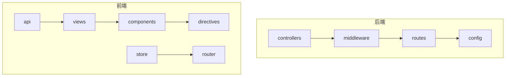
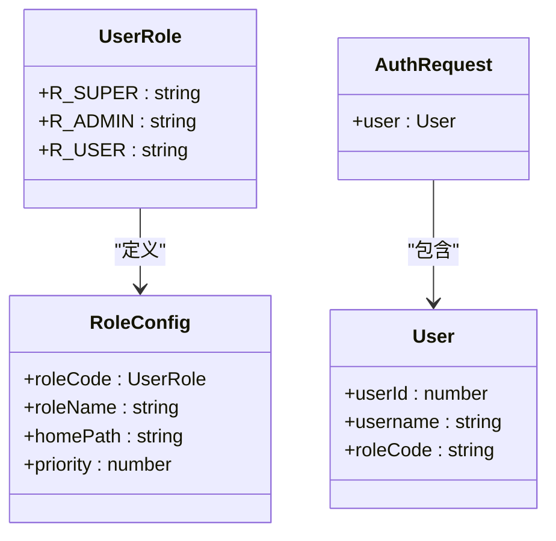
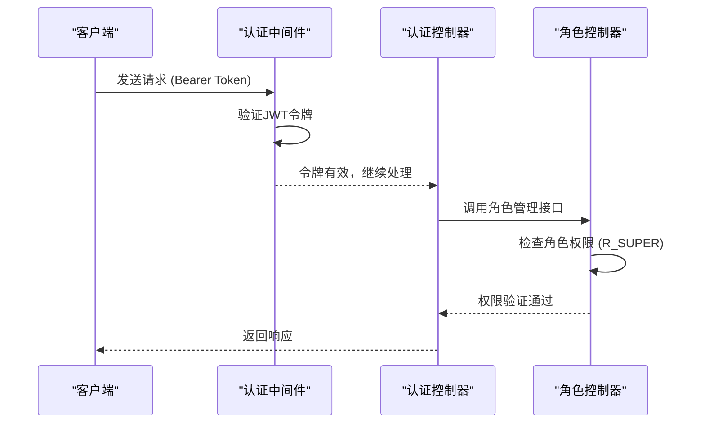
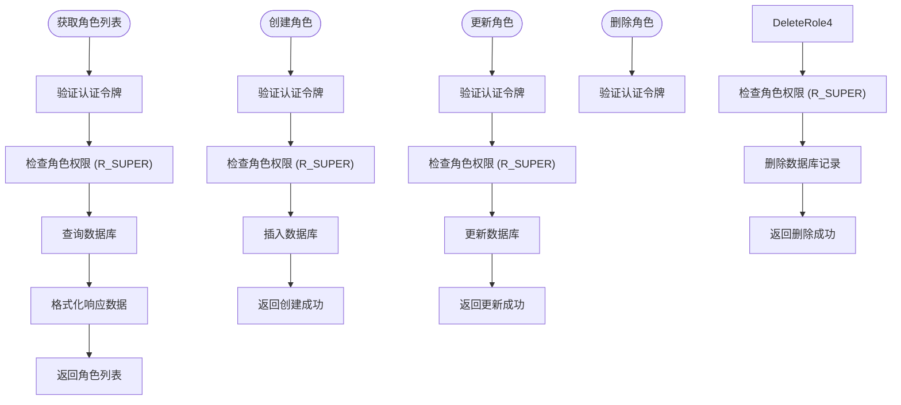
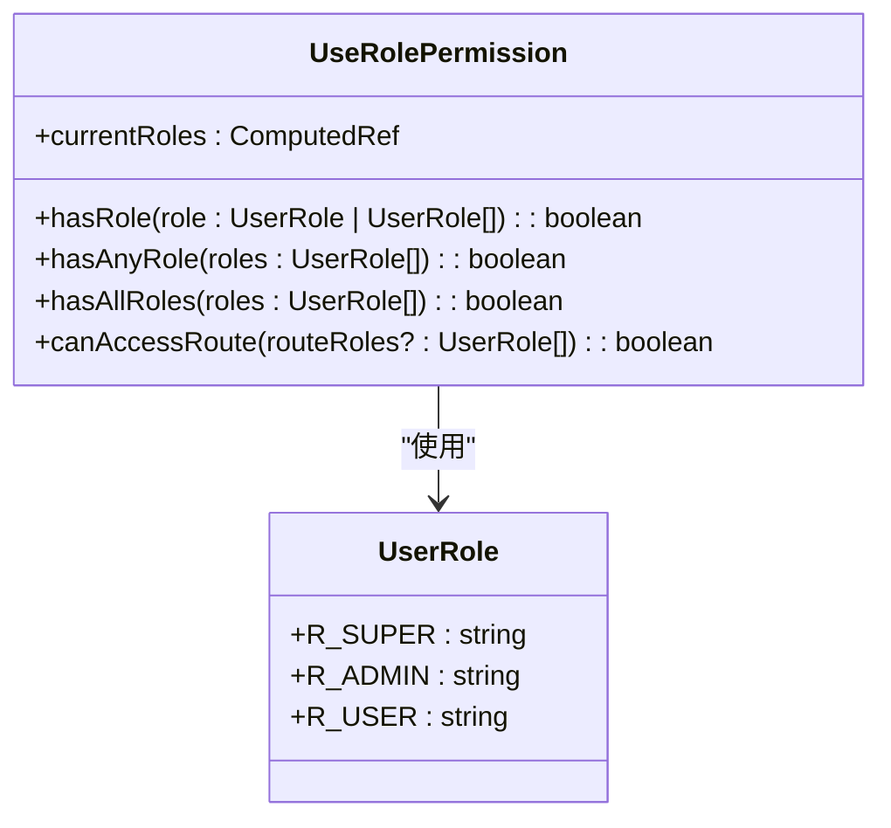
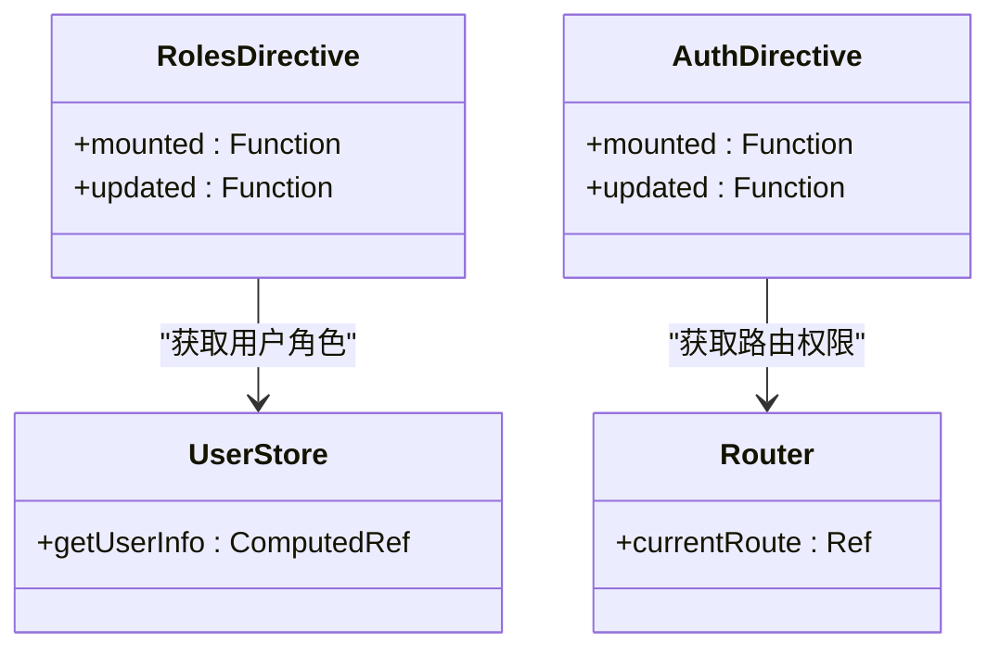
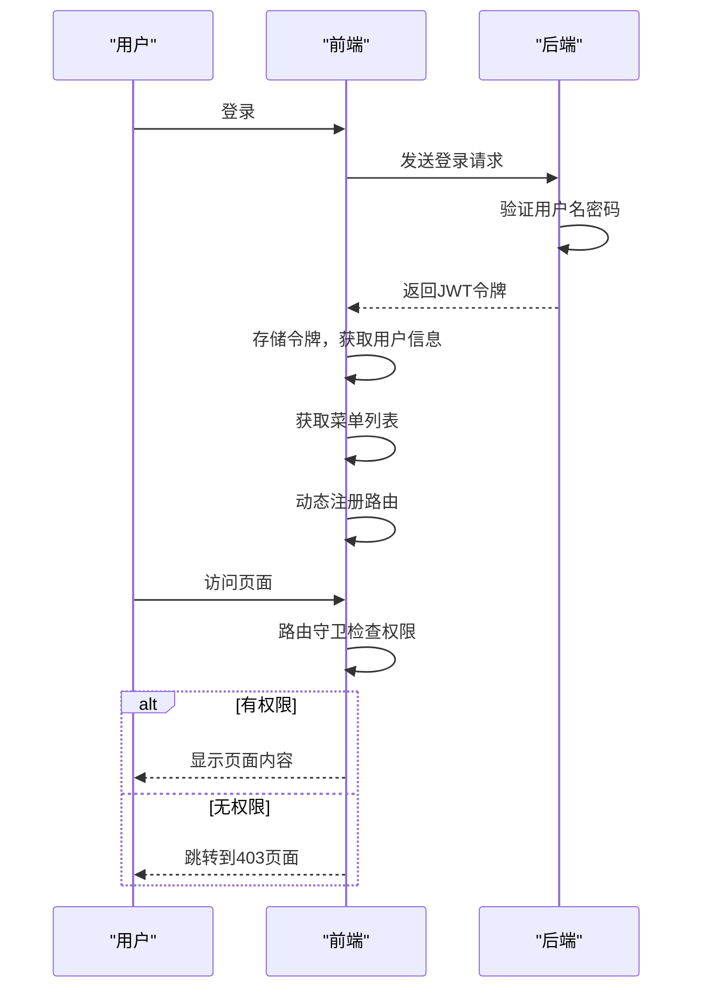
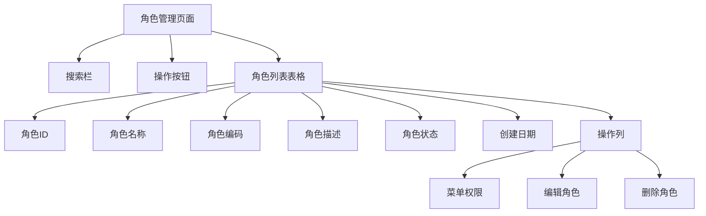
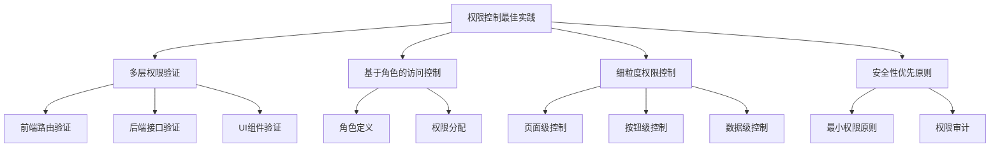

# 使用角色权限

<cite>
**本文档引用的文件**
- [role.controller.ts](file://backend/src/controllers/role.controller.ts)
- [auth.middleware.ts](file://backend/src/middleware/auth.middleware.ts)
- [useRolePermission.ts](file://src/hooks/core/useRolePermission.ts)
- [roles.ts](file://src/directives/core/roles.ts)
- [auth.ts](file://src/directives/core/auth.ts)
- [user.ts](file://src/store/modules/user.ts)
- [beforeEach.ts](file://src/router/guards/beforeEach.ts)
- [RoutePermissionValidator.ts](file://src/router/core/RoutePermissionValidator.ts)
- [index.ts](file://src/types/common/index.ts)
- [button-auth/index.vue](file://src/views/examples/permission/button-auth/index.vue)
- [page-visibility/index.vue](file://src/views/system/role/index.vue)
</cite>

## 目录

1. [简介](#简介)
2. [项目结构](#项目结构)
3. [核心权限机制](#核心权限机制)
4. [后端权限控制](#后端权限控制)
5. [前端权限控制](#前端权限控制)
6. [权限验证流程](#权限验证流程)
7. [角色管理功能](#角色管理功能)
8. [最佳实践](#最佳实践)

## 简介

本项目实现了一套完整的角色权限控制系统，采用前后端分离的架构设计。系统定义了三级角色权限模型，通过JWT认证和细粒度的权限控制，确保不同用户只能访问其被授权的功能和数据。权限控制覆盖了路由级别、页面级别和按钮级别，提供了灵活且安全的访问控制机制。

## 项目结构

项目采用典型的前后端分离架构，后端使用Node.js + Express + MySQL，前端使用Vue 3 + TypeScript + Pinia。权限相关的核心文件分布在前后端的不同目录中。

**图源**

- [role.controller.ts](file://backend/src/controllers/role.controller.ts)
- [auth.middleware.ts](file://backend/src/middleware/auth.middleware.ts)
- [useRolePermission.ts](file://src/hooks/core/useRolePermission.ts)

## 核心权限机制

系统实现了基于角色的访问控制（RBAC）模型，定义了三种角色：超级管理员（R_SUPER）、系统管理员（R_ADMIN）和普通用户（R_USER）。权限控制分为前端和后端两个层面，确保安全性。

**图源**

- [index.ts](file://src/types/common/index.ts)
- [auth.middleware.ts](file://backend/src/middleware/auth.middleware.ts)

## 后端权限控制

后端通过Express中间件实现JWT认证和角色权限验证。所有需要权限的接口都必须通过认证中间件和授权中间件的检查。

### 认证与授权中间件

后端使用`auth.middleware.ts`文件中的`authenticate`和`authorize`中间件来处理认证和授权。`authenticate`中间件负责验证JWT令牌，`authorize`中间件负责检查用户角色是否具有访问特定接口的权限。

**图源**

- [auth.middleware.ts](file://backend/src/middleware/auth.middleware.ts)
- [role.controller.ts](file://backend/src/controllers/role.controller.ts)

### 角色管理接口

角色管理模块提供了四个核心接口，全部需要超级管理员权限才能访问。这些接口用于角色的增删改查操作。

**图源**

- [role.controller.ts](file://backend/src/controllers/role.controller.ts)
- [role.routes.ts](file://backend/src/routes/role.routes.ts)

## 前端权限控制

前端实现了多层次的权限控制机制，包括路由级别、页面级别和按钮级别的权限控制。通过组合式函数、自定义指令和状态管理，提供了灵活的权限验证能力。

### 组合式函数权限验证

`useRolePermission.ts`提供了基于角色的权限验证组合式函数，支持单个角色、任意角色和所有角色的验证。

**图源**

- [useRolePermission.ts](file://src/hooks/core/useRolePermission.ts)
- [index.ts](file://src/types/common/index.ts)

### 自定义指令权限控制

前端实现了两个自定义指令：`v-roles`和`v-auth`，分别用于基于角色和基于权限码的DOM元素控制。

**图源**

- [roles.ts](file://src/directives/core/roles.ts)
- [auth.ts](file://src/directives/core/auth.ts)
- [user.ts](file://src/store/modules/user.ts)

## 权限验证流程

系统的权限验证流程涵盖了从用户登录到页面访问的完整过程，确保每个环节都有相应的权限检查。

**图源**

- [beforeEach.ts](file://src/router/guards/beforeEach.ts)
- [RoutePermissionValidator.ts](file://src/router/core/RoutePermissionValidator.ts)

## 角色管理功能

角色管理功能提供了完整的角色CRUD操作界面，包括角色列表、搜索、新增、编辑和删除功能。

### 角色管理界面

角色管理页面使用了`ArtTable`组件展示角色列表，支持分页、排序和搜索功能。通过`RoleEditDialog`和`RolePermissionDialog`组件实现角色的编辑和权限配置。

**图源**

- [index.vue](file://src/views/system/role/index.vue)
- [role-search.vue](file://src/views/system/role/modules/role-search.vue)

## 最佳实践

系统实现了一系列权限控制的最佳实践，确保了系统的安全性和可维护性。

1. **多层权限验证**：在前端路由、后端接口、UI组件等多个层面实施权限控制
2. **基于角色的访问控制**：采用RBAC模型，通过角色分配权限，简化权限管理复杂度
3. **细粒度权限控制**：支持页面级、按钮级、数据级等多种粒度的权限控制
4. **安全性优先原则**：始终遵循最小权限原则，确保用户只能访问必要的功能和数据

**图源**

- [page-visibility/index.vue](file://src/views/examples/permission/page-visibility/index.vue)
