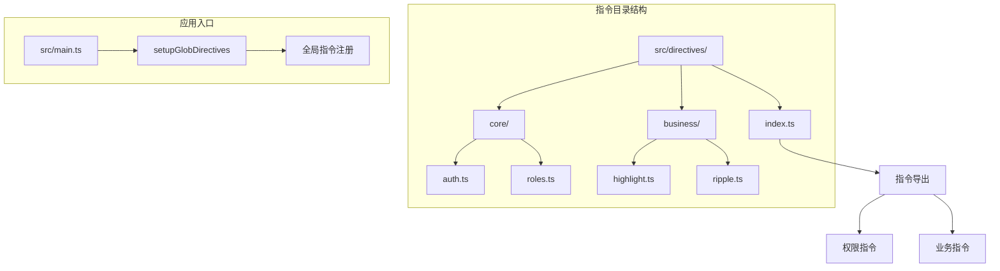
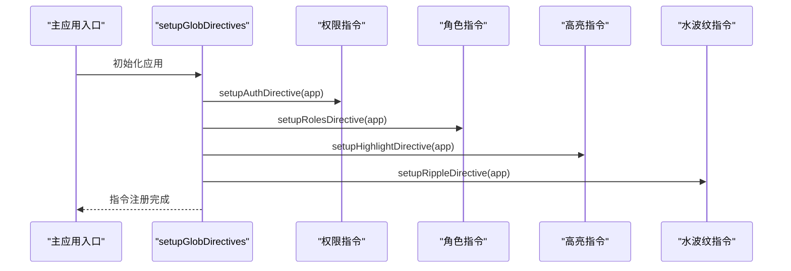
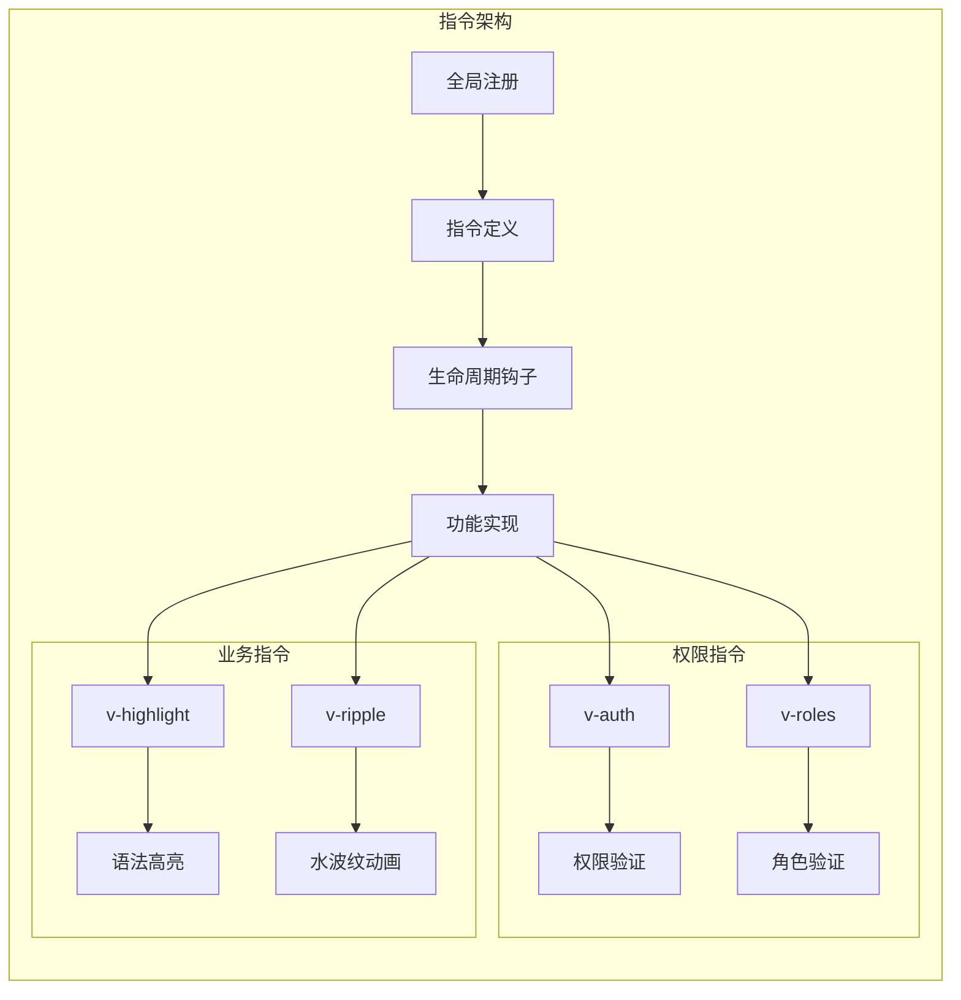
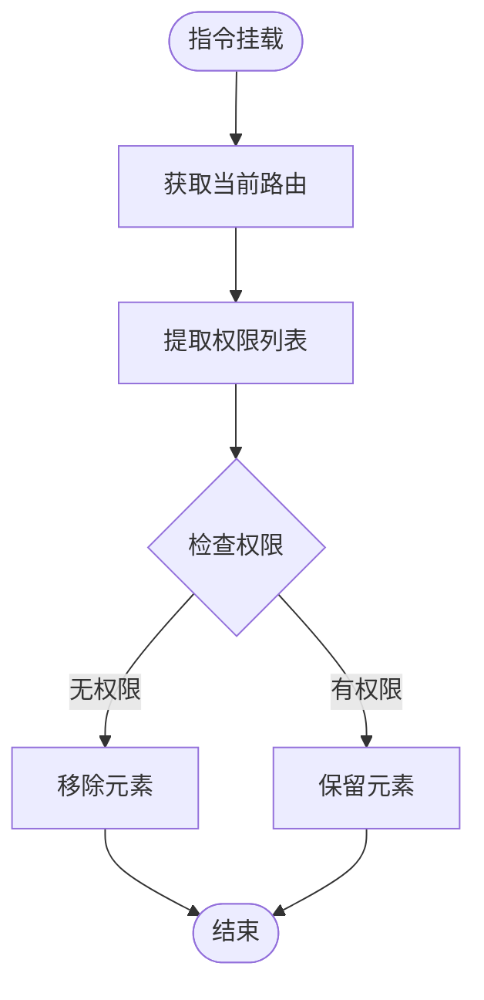
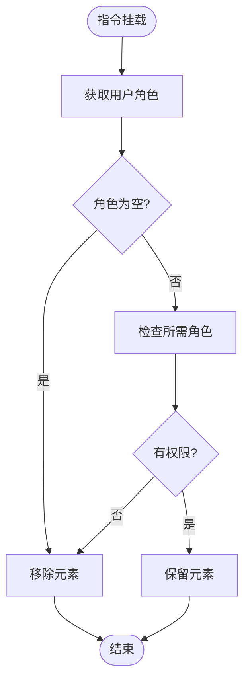
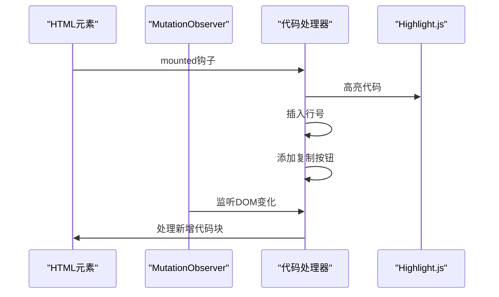
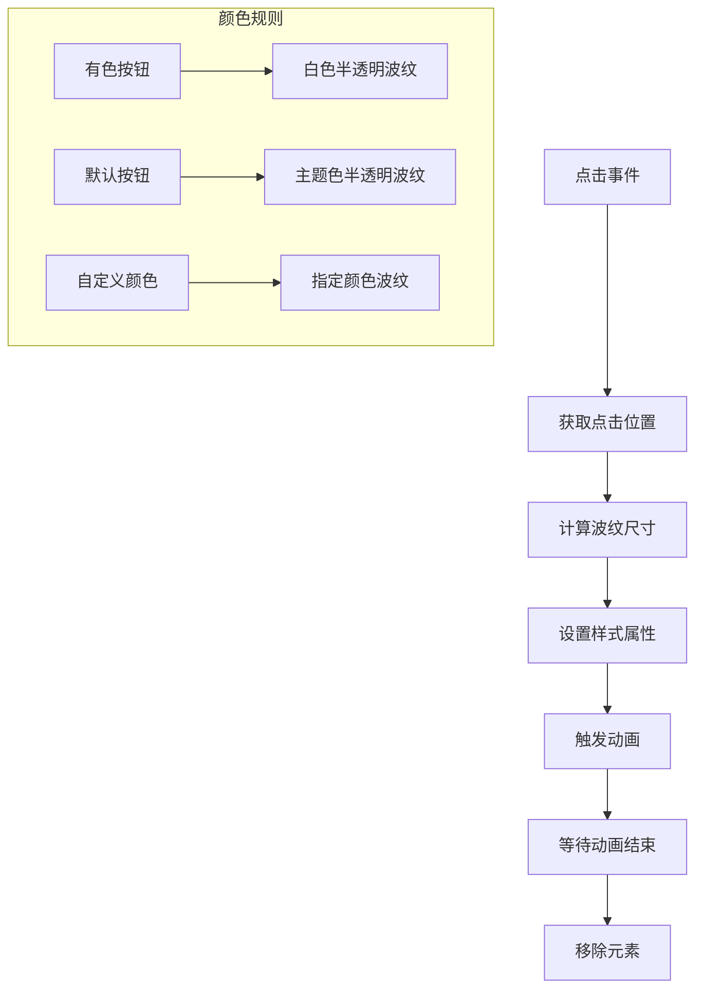
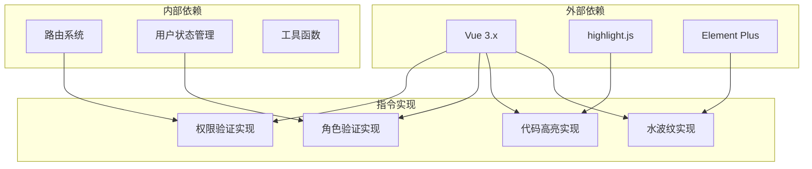

# 自定义指令

<cite>
**本文档引用的文件**
- [src/directives/index.ts](file://src/directives/index.ts)
- [src/directives/core/auth.ts](file://src/directives/core/auth.ts)
- [src/directives/core/roles.ts](file://src/directives/core/roles.ts)
- [src/directives/business/highlight.ts](file://src/directives/business/highlight.ts)
- [src/directives/business/ripple.ts](file://src/directives/business/ripple.ts)
- [src/main.ts](file://src/main.ts)
- [src/views/examples/permission/button-auth/index.vue](file://src/views/examples/permission/button-auth/index.vue)
- [src/views/examples/permission/page-visibility/index.vue](file://src/views/examples/permission/page-visibility/index.vue)
</cite>

## 目录
1. [简介](#简介)
2. [项目结构](#项目结构)
3. [核心组件](#核心组件)
4. [架构概览](#架构概览)
5. [详细组件分析](#详细组件分析)
6. [依赖关系分析](#依赖关系分析)
7. [性能考虑](#性能考虑)
8. [故障排除指南](#故障排除指南)
9. [结论](#结论)

## 简介

Art Design Pro框架提供了完整的自定义指令系统，用于增强Vue应用程序的功能性和用户体验。该系统包含两类指令：核心权限指令（auth、roles）和业务功能指令（highlight、ripple）。这些指令通过统一的全局注册机制进行管理，为开发者提供了简洁而强大的权限控制和交互增强功能。

## 项目结构

自定义指令的组织结构清晰明确，分为核心指令和业务指令两大类别：



**图表来源**
- [src/directives/index.ts](file://src/directives/index.ts#L1-L13)
- [src/main.ts](file://src/main.ts#L18-L21)

**章节来源**
- [src/directives/index.ts](file://src/directives/index.ts#L1-L13)
- [src/main.ts](file://src/main.ts#L18-L21)

## 核心组件

### 全局指令注册系统

指令系统的核心是统一的注册机制，通过`setupGlobDirectives`函数实现所有指令的全局注册：



**图表来源**
- [src/directives/index.ts](file://src/directives/index.ts#L7-L12)
- [src/main.ts](file://src/main.ts#L20)

### 指令分类体系

指令系统按功能分为两个主要类别：

| 类别 | 指令 | 功能描述 | 使用场景 |
|------|------|----------|----------|
| 权限控制 | v-auth | 基于权限标识的细粒度控制 | 按钮、功能模块级别的权限控制 |
| 权限控制 | v-roles | 基于用户角色的粗粒度控制 | 页面、功能模块级别的角色控制 |
| 业务增强 | v-highlight | 代码语法高亮和复制功能 | 代码展示、技术文档场景 |
| 业务增强 | v-ripple | Material Design风格水波纹效果 | 按钮、卡片等交互元素的视觉反馈 |

**章节来源**
- [src/directives/index.ts](file://src/directives/index.ts#L1-L13)

## 架构概览

自定义指令系统采用模块化设计，每个指令都有独立的功能实现和生命周期管理：



**图表来源**
- [src/directives/core/auth.ts](file://src/directives/core/auth.ts#L61-L64)
- [src/directives/core/roles.ts](file://src/directives/core/roles.ts#L82-L85)
- [src/directives/business/highlight.ts](file://src/directives/business/highlight.ts#L183-L244)
- [src/directives/business/ripple.ts](file://src/directives/business/ripple.ts#L47-L110)

## 详细组件分析

### 权限控制指令

#### v-auth指令 - 细粒度权限控制

v-auth指令实现了基于权限标识的细粒度权限控制，适用于后端权限控制模式。



**图表来源**
- [src/directives/core/auth.ts](file://src/directives/core/auth.ts#L42-L52)

**核心特性：**
- **权限验证**：基于路由meta中的authList权限列表进行验证
- **DOM控制**：无权限时直接移除DOM元素，而非隐藏
- **响应式更新**：权限变更时自动更新元素状态
- **错误处理**：优雅处理权限验证失败的情况

**使用示例：**
```vue
<!-- 只有拥有 'add' 权限的用户才能看到新增按钮 -->
<el-button v-auth="'add'">新增</el-button>

<!-- 只有拥有 'edit' 权限的用户才能看到编辑按钮 -->
<el-button v-auth="'edit'">编辑</el-button>

<!-- 只有拥有 'delete' 权限的用户才能看到删除按钮 -->
<el-button v-auth="'delete'">删除</el-button>
```

**章节来源**
- [src/directives/core/auth.ts](file://src/directives/core/auth.ts#L1-L69)

#### v-roles指令 - 角色权限控制

v-roles指令基于用户角色进行权限控制，提供粗粒度的角色访问控制。



**图表来源**
- [src/directives/core/roles.ts](file://src/directives/core/roles.ts#L54-L73)

**核心特性：**
- **多角色支持**：支持单个角色或多个角色组合
- **角色验证**：只要用户拥有指定角色中的任意一个就显示
- **智能配色**：自动识别按钮类型，使用合适的波纹颜色
- **自定义颜色**：支持通过参数自定义波纹颜色

**使用示例：**
```vue
<!-- 单个角色 - 只有超级管理员可见 -->
<el-button v-roles="'R_SUPER'">超级管理员功能</el-button>

<!-- 多个角色 - 超级管理员或普通管理员可见 -->
<el-button v-roles="['R_SUPER', 'R_ADMIN']">管理员功能</el-button>

<!-- 应用到任意元素 -->
<div v-roles="['R_SUPER', 'R_ADMIN', 'R_USER']">
  所有登录用户可见的内容
</div>
```

**章节来源**
- [src/directives/core/roles.ts](file://src/directives/core/roles.ts#L1-L90)

### 业务功能指令

#### v-highlight指令 - 代码高亮增强

v-highlight指令为代码块提供语法高亮、行号显示和一键复制功能。



**图表来源**
- [src/directives/business/highlight.ts](file://src/directives/business/highlight.ts#L183-L244)

**核心特性：**
- **语法高亮**：基于highlight.js自动识别并高亮代码
- **行号显示**：自动为每行代码添加行号
- **一键复制**：提供复制按钮，点击即可复制代码（自动过滤行号）
- **性能优化**：批量处理代码块，避免阻塞渲染
- **动态监听**：使用MutationObserver监听新增代码块
- **防重复处理**：自动标记已处理的代码块，避免重复处理

**使用示例：**
```vue
<!-- 基础用法 -->
<div v-highlight v-html="codeContent"></div>

<!-- 配合Markdown渲染 -->
<div v-highlight>
  <pre><code class="language-javascript">
    const hello = 'world';
    console.log(hello);
  </code></pre>
</div>
```

**章节来源**
- [src/directives/business/highlight.ts](file://src/directives/business/highlight.ts#L1-L249)

#### v-ripple指令 - 水波纹效果

v-ripple指令为元素添加Material Design风格的水波纹点击效果。



**图表来源**
- [src/directives/business/ripple.ts](file://src/directives/business/ripple.ts#L48-L108)

**核心特性：**
- **水波纹动画**：点击时从点击位置扩散圆形波纹
- **自适应大小**：根据元素尺寸自动调整波纹大小和动画时长
- **智能配色**：自动识别按钮类型，使用合适的波纹颜色
- **自定义颜色**：支持通过参数自定义波纹颜色
- **性能优化**：使用requestAnimationFrame和自动清理机制

**使用示例：**
```vue
<!-- 基础用法 - 使用默认颜色 -->
<el-button v-ripple>点击我</el-button>

<!-- 自定义颜色 -->
<el-button v-ripple="{ color: 'rgba(255, 0, 0, 0.3)' }">自定义颜色</el-button>

<!-- 应用到任意元素 -->
<div v-ripple class="custom-card">卡片内容</div>
```

**章节来源**
- [src/directives/business/ripple.ts](file://src/directives/business/ripple.ts#L1-L115)

## 依赖关系分析

指令系统的依赖关系清晰明确，各指令之间相互独立，通过Vue的指令系统进行统一管理：



**图表来源**
- [src/directives/core/auth.ts](file://src/directives/core/auth.ts#L35-L36)
- [src/directives/core/roles.ts](file://src/directives/core/roles.ts#L47-L48)
- [src/directives/business/highlight.ts](file://src/directives/business/highlight.ts#L44-L45)

**章节来源**
- [src/directives/core/auth.ts](file://src/directives/core/auth.ts#L35-L36)
- [src/directives/core/roles.ts](file://src/directives/core/roles.ts#L47-L48)
- [src/directives/business/highlight.ts](file://src/directives/business/highlight.ts#L44-L45)

## 性能考虑

### 权限指令性能优化

权限指令在设计时充分考虑了性能因素：

- **懒加载策略**：指令只在需要时才进行权限验证
- **缓存机制**：权限验证结果在组件生命周期内保持有效
- **批量处理**：多个权限检查可以合并处理
- **内存管理**：及时清理不需要的权限验证资源

### 业务指令性能优化

业务指令采用了多种性能优化策略：

#### v-highlight性能优化
- **批量处理**：每次最多处理10个代码块，避免长时间阻塞
- **延迟处理**：使用requestAnimationFrame分批处理
- **重试机制**：自动重试处理失败的代码块
- **智能监听**：只在有新代码块时才触发处理

#### v-ripple性能优化
- **requestAnimationFrame**：使用浏览器优化的动画帧
- **自动清理**：动画结束后自动移除DOM元素
- **事件委托**：合理使用事件委托减少事件监听器数量

## 故障排除指南

### 常见问题及解决方案

#### 指令不生效

**问题现象**：指令应用后没有预期的效果

**可能原因**：
1. 指令未正确注册
2. 权限验证失败
3. DOM元素被提前移除

**解决方案**：
```typescript
// 检查指令是否正确注册
console.log(app._context.directives)

// 检查权限验证逻辑
console.log('当前路由权限:', router.currentRoute.value.meta.authList)
console.log('用户角色:', useUserStore().getUserInfo.roles)
```

#### 权限判断失败

**问题现象**：权限验证结果与预期不符

**可能原因**：
1. 权限数据未正确加载
2. 权限标识不匹配
3. 路由权限配置错误

**解决方案**：
```typescript
// 检查权限数据
const userStore = useUserStore()
console.log('用户权限:', userStore.info.buttons)
console.log('路由权限配置:', route.meta.authList)

// 手动测试权限
import { useAuth } from '@/hooks/core/useAuth'
const { hasAuth } = useAuth()
console.log('权限检查结果:', hasAuth('specific_permission'))
```

#### 水波纹效果异常

**问题现象**：v-ripple效果不正常或消失

**可能原因**：
1. 元素尺寸计算错误
2. 样式冲突
3. 动画时间设置不当

**解决方案**：
```css
/* 确保元素有正确的定位 */
.v-ripple-element {
  position: relative;
  overflow: hidden;
}

/* 避免样式冲突 */
.v-ripple-element .ripple {
  pointer-events: none;
}
```

#### 代码高亮功能失效

**问题现象**：v-highlight指令无法正确高亮代码

**可能原因**：
1. highlight.js未正确安装
2. 代码块结构不符合要求
3. MutationObserver监听失败

**解决方案**：
```javascript
// 检查highlight.js是否可用
import hljs from 'highlight.js'
console.log('highlight.js版本:', hljs.version)

// 手动触发高亮
const codeBlocks = document.querySelectorAll('pre code')
codeBlocks.forEach(block => hljs.highlightElement(block))
```

### 调试技巧

#### 权限指令调试

1. **权限数据检查**：通过浏览器开发者工具检查用户权限数据
2. **路由权限验证**：确认路由meta配置正确
3. **指令生命周期**：监控指令的mounted和updated钩子

#### 业务指令调试

1. **DOM结构检查**：验证指令应用后的DOM结构
2. **事件监听**：检查点击事件是否正确绑定
3. **样式验证**：确认CSS样式正确应用

## 结论

Art Design Pro的自定义指令系统提供了完整而强大的功能扩展能力。通过合理的分类设计、统一的注册机制和完善的生命周期管理，该系统能够满足现代Web应用的各种需求。

### 主要优势

1. **功能丰富**：涵盖权限控制和交互增强两大核心领域
2. **易于使用**：简洁的API设计，开箱即用
3. **性能优化**：针对不同场景进行了专门的性能优化
4. **扩展性强**：模块化设计便于功能扩展和维护

### 最佳实践建议

1. **权限控制**：根据业务需求选择合适的权限控制方式
2. **性能监控**：定期检查指令的性能表现
3. **错误处理**：完善错误处理机制，提升用户体验
4. **文档维护**：保持指令使用文档的及时更新

通过合理使用这些自定义指令，开发者可以构建出功能强大、用户体验优秀的现代化Web应用程序。