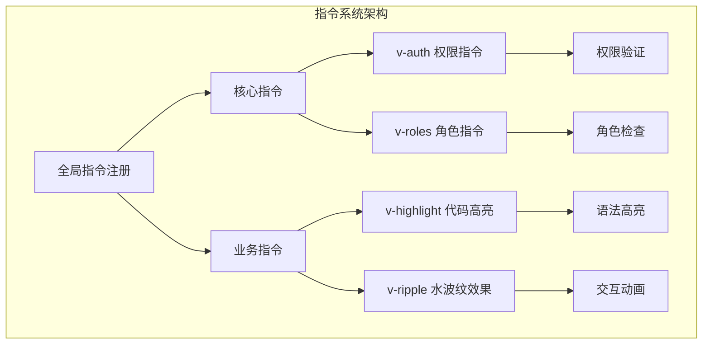
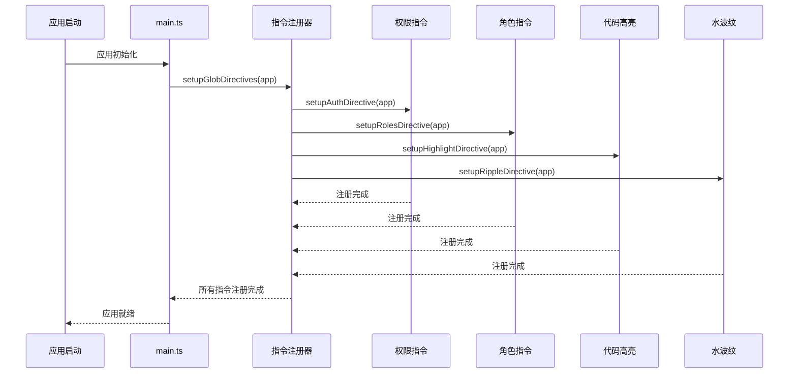
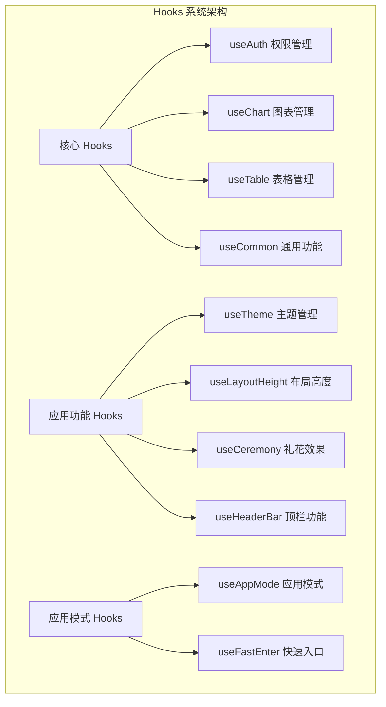
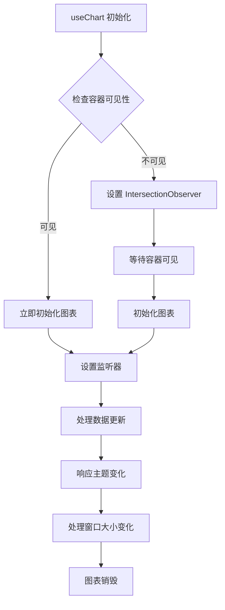
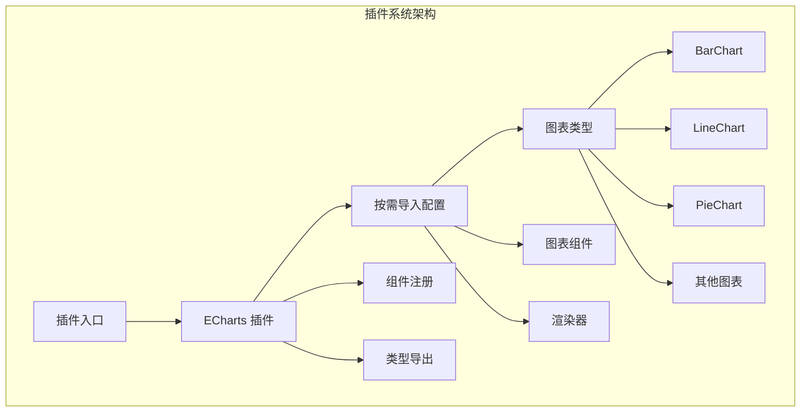
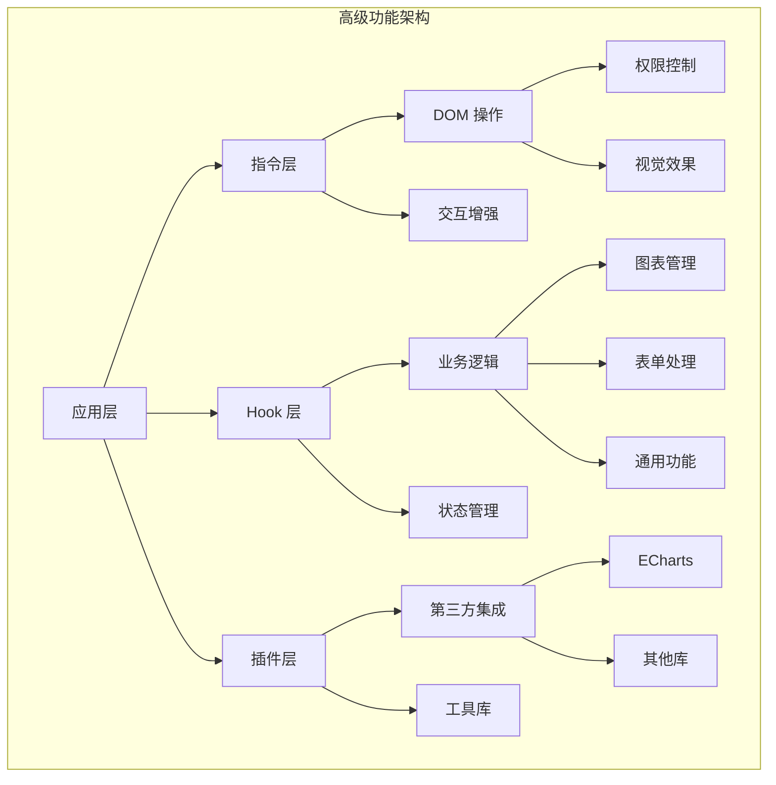
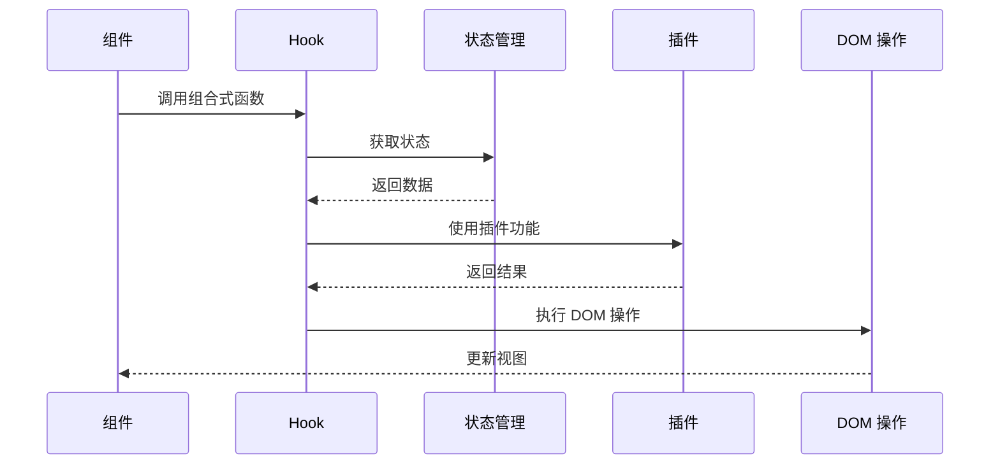

# 高级功能

<cite>
**本文档引用的文件**
- [src/directives/index.ts](file://src/directives/index.ts)
- [src/hooks/index.ts](file://src/hooks/index.ts)
- [src/plugins/index.ts](file://src/plugins/index.ts)
- [src/plugins/echarts.ts](file://src/plugins/echarts.ts)
- [src/directives/core/auth.ts](file://src/directives/core/auth.ts)
- [src/directives/business/highlight.ts](file://src/directives/business/highlight.ts)
- [src/directives/business/ripple.ts](file://src/directives/business/ripple.ts)
- [src/directives/core/roles.ts](file://src/directives/core/roles.ts)
- [src/hooks/core/useChart.ts](file://src/hooks/core/useChart.ts)
- [src/hooks/core/useAuth.ts](file://src/hooks/core/useAuth.ts)
- [src/main.ts](file://src/main.ts)
- [src/types/component/chart.ts](file://src/types/component/chart.ts)
- [src/components/core/charts/art-bar-chart/index.vue](file://src/components/core/charts/art-bar-chart/index.vue)
- [src/components/core/forms/art-form/index.vue](file://src/components/core/forms/art-form/index.vue)
- [src/store/modules/user.ts](file://src/store/modules/user.ts)
</cite>

## 目录
1. [简介](#简介)
2. [自定义指令系统](#自定义指令系统)
3. [组合式函数(hooks)系统](#组合式函数hooks系统)
4. [插件系统](#插件系统)
5. [高级功能架构](#高级功能架构)
6. [最佳实践与设计模式](#最佳实践与设计模式)
7. [性能优化与调试](#性能优化与调试)
8. [总结](#总结)

## 简介

Art Design Pro 提供了一套完整的高级功能体系，包括自定义指令、组合式函数和插件系统。这些功能不仅提升了开发效率，还确保了代码的可维护性和可扩展性。本文档将深入解析这些高级功能的实现机制、使用场景和最佳实践。

## 自定义指令系统

### 系统概述

自定义指令系统是 Vue.js 的重要特性，Art Design Pro 通过精心设计的指令架构，提供了强大的 DOM 操作和交互增强能力。



**图表来源**
- [src/directives/index.ts](file://src/directives/index.ts#L7-L12)
- [src/directives/core/auth.ts](file://src/directives/core/auth.ts#L61-L68)
- [src/directives/core/roles.ts](file://src/directives/core/roles.ts#L82-L89)

### 核心指令

#### 权限指令 (v-auth)

权限指令基于后端权限控制模式，提供细粒度的操作权限管理。

**主要特性：**
- 基于路由 meta 中的权限列表进行验证
- DOM 元素的直接移除而非隐藏
- 响应式权限更新
- 自动移除无权限元素

**实现原理：**
指令在 mounted 和 updated 生命周期钩子中执行权限检查，当用户不具有相应权限时，直接从 DOM 中移除元素。

**使用示例：**
```vue
<el-button v-auth="'add'">新增</el-button>
<el-button v-auth="'edit'">编辑</el-button>
<el-button v-auth="'delete'">删除</el-button>
```

**章节来源**
- [src/directives/core/auth.ts](file://src/directives/core/auth.ts#L1-L69)

#### 角色指令 (v-roles)

角色指令提供基于用户角色的权限控制，适用于粗粒度的权限管理。

**主要特性：**
- 支持单个或多个角色验证
- 任意角色匹配即可显示
- 自动移除无权限元素
- 响应式角色更新

**实现机制：**
指令从用户状态管理中获取当前用户的角色列表，与指令要求的角色进行匹配，决定元素的显示状态。

**使用示例：**
```vue
<!-- 单个角色 -->
<el-button v-roles="'R_SUPER'">超级管理员功能</el-button>

<!-- 多个角色 -->
<el-button v-roles="['R_SUPER', 'R_ADMIN']">管理员功能</el-button>

<!-- 任意元素 -->
<div v-roles="['R_SUPER', 'R_ADMIN', 'R_USER']">
  所有登录用户可见的内容
</div>
```

**章节来源**
- [src/directives/core/roles.ts](file://src/directives/core/roles.ts#L1-L90)

### 业务指令

#### 代码高亮指令 (v-highlight)

代码高亮指令为代码块提供语法高亮、行号显示和一键复制功能。

**核心功能：**
- 基于 highlight.js 的语法高亮
- 自动生成行号显示
- 一键复制功能（过滤行号）
- 性能优化的批量处理
- 动态监听 DOM 变化

**性能优化策略：**
- 批量处理：每次处理最多 10 个代码块
- 延迟处理：使用 requestAnimationFrame 分批处理
- 重试机制：自动重试处理失败的代码块
- 智能监听：使用 MutationObserver 监听新增代码块

**章节来源**
- [src/directives/business/highlight.ts](file://src/directives/business/highlight.ts#L1-L249)

#### 水波纹指令 (v-ripple)

水波纹指令为元素添加 Material Design 风格的点击效果。

**主要特性：**
- 点击时从点击位置扩散圆形波纹
- 自适应大小和动画时长
- 智能配色系统
- 自定义颜色支持
- 性能优化的自动清理

**实现细节：**
- 使用相对定位和 overflow hidden
- 动态计算波纹尺寸和动画时间
- 基于按钮类型的智能颜色选择
- requestAnimationFrame 优化动画性能

**章节来源**
- [src/directives/business/ripple.ts](file://src/directives/business/ripple.ts#L1-L115)

### 指令注册与管理

指令系统采用集中管理模式，在主应用中统一注册所有指令。



**图表来源**
- [src/main.ts](file://src/main.ts#L19-L21)
- [src/directives/index.ts](file://src/directives/index.ts#L7-L12)

**章节来源**
- [src/directives/index.ts](file://src/directives/index.ts#L1-L13)
- [src/main.ts](file://src/main.ts#L1-L25)

## 组合式函数(hooks)系统

### 系统架构

组合式函数系统提供了可复用的业务逻辑封装，遵循 Vue 3 的 Composition API 设计理念。



**图表来源**
- [src/hooks/index.ts](file://src/hooks/index.ts#L1-L33)

### useChart 图表管理

useChart 是最复杂的组合式函数之一，提供了完整的 ECharts 图表生命周期管理。

**核心功能：**
- 图表生命周期自动管理
- 主题自动适配
- 响应式尺寸调整
- 空状态优雅处理
- 统一的样式配置

**高级特性：**
- IntersectionObserver 支持延迟加载
- 防抖处理的窗口大小变化
- requestAnimationFrame 优化
- 性能监控和调试支持

**使用模式：**



**图表来源**
- [src/hooks/core/useChart.ts](file://src/hooks/core/useChart.ts#L430-L448)

**章节来源**
- [src/hooks/core/useChart.ts](file://src/hooks/core/useChart.ts#L1-L746)

### useAuth 权限验证

useAuth 提供统一的权限验证功能，支持前端和后端两种权限模式。

**双模式支持：**
- 前端模式：从用户信息中获取按钮权限列表
- 后端模式：从路由 meta 配置中获取权限列表

**实现特点：**
- 自动适配权限模式
- 前端和后端权限验证统一接口
- 响应式权限状态管理

**章节来源**
- [src/hooks/core/useAuth.ts](file://src/hooks/core/useAuth.ts#L1-L75)

### useCommon 通用功能

useCommon 提供了一系列通用的工具函数和状态管理功能，包括：
- 系统信息获取
- 设备检测
- 状态码处理
- 错误处理

### useTable 表格管理

useTable 提供了完整的表格数据管理解决方案，包括：
- 数据加载和缓存
- 分页管理
- 排序和筛选
- 行选择和批量操作

### 组合式函数设计原则

1. **单一职责**：每个 Hook 只负责一个特定的功能领域
2. **可复用性**：设计时考虑跨组件的通用需求
3. **响应式**：充分利用 Vue 3 的响应式系统
4. **类型安全**：提供完整的 TypeScript 类型定义
5. **性能优化**：内置防抖、节流等性能优化机制

**章节来源**
- [src/hooks/index.ts](file://src/hooks/index.ts#L1-L33)

## 插件系统

### 系统概述

插件系统采用模块化设计，集中管理第三方库的封装和配置，目前主要集成了 ECharts 图表库。



**图表来源**
- [src/plugins/echarts.ts](file://src/plugins/echarts.ts#L11-L77)

### ECharts 插件集成

ECharts 插件展示了如何集成第三方库的最佳实践。

**按需导入策略：**
- 只导入实际使用的图表类型
- 减少打包体积约 80%
- 按需注册组件和渲染器

**配置特点：**
- 统一的组件注册流程
- 完整的 TypeScript 类型支持
- 常用工具函数导出

**使用方式：**
```typescript
// 导入 ECharts 实例
import { echarts } from '@/plugins/echarts'

// 导入类型定义
import type { EChartsOption, BarSeriesOption } from '@/plugins/echarts'

// 使用图形工具
import { graphic } from '@/plugins/echarts'
```

**章节来源**
- [src/plugins/echarts.ts](file://src/plugins/echarts.ts#L1-L77)

### 插件扩展机制

插件系统设计为可扩展架构，支持添加新的第三方库集成：

1. **模块化组织**：每个插件独立管理
2. **统一入口**：通过 plugins/index.ts 集中管理
3. **类型安全**：提供完整的类型定义
4. **按需加载**：支持 Tree Shaking

**章节来源**
- [src/plugins/index.ts](file://src/plugins/index.ts#L1-L7)

## 高级功能架构

### 整体架构设计



### 数据流与依赖关系



**图表来源**
- [src/hooks/core/useChart.ts](file://src/hooks/core/useChart.ts#L651-L652)
- [src/store/modules/user.ts](file://src/store/modules/user.ts#L70-L72)

### 类型系统设计

高级功能采用了完善的 TypeScript 类型系统：

| 功能模块 | 类型特点 | 设计目标 |
|---------|---------|---------|
| 指令系统 | Directive 类型定义 | 确保指令行为一致性 |
| Hook 系统 | 泛型接口设计 | 支持多种数据类型 |
| 插件系统 | 模块类型声明 | 第三方库类型安全 |
| 组件系统 | Props 类型约束 | 组件间通信类型安全 |

**章节来源**
- [src/types/component/chart.ts](file://src/types/component/chart.ts#L1-L325)

## 最佳实践与设计模式

### 自定义指令最佳实践

#### 1. 生命周期钩子使用

```typescript
// 推荐：正确使用生命周期钩子
const directive: Directive = {
  mounted(el, binding) {
    // 初始化逻辑
  },
  updated(el, binding) {
    // 更新逻辑
  },
  unmounted(el) {
    // 清理逻辑
  }
}
```

#### 2. 性能优化策略

- **防抖处理**：对于频繁触发的操作使用防抖
- **批量处理**：大量 DOM 操作时使用批量处理
- **内存泄漏防护**：及时清理事件监听器和定时器

#### 3. 错误处理

```typescript
// 推荐：完善的错误处理
function safeExecute(fn: () => void) {
  try {
    fn()
  } catch (error) {
    console.warn('指令执行失败:', error)
  }
}
```

### 组合式函数设计模式

#### 1. 响应式状态管理

```typescript
// 推荐：使用 ref 和 computed
export function useFeature() {
  const state = ref<State>({ /* 初始状态 */ })
  const computedState = computed(() => {/* 计算逻辑 */})
  
  return {
    state,
    computedState,
    // 方法...
  }
}
```

#### 2. 依赖注入模式

```typescript
// 推荐：明确的依赖关系
export function useChart(options: UseChartOptions = {}) {
  const { initOptions, initDelay } = options
  const chartRef = ref<HTMLElement>()
  
  return {
    chartRef,
    initChart,
    updateChart
  }
}
```

#### 3. 类型安全设计

```typescript
// 推荐：完整的类型定义
interface UseChartOptions {
  initOptions?: EChartsOption
  initDelay?: number
}

export function useChart(options: UseChartOptions = {})
```

### 插件系统扩展指南

#### 1. 插件开发规范

```typescript
// 插件结构示例
export const myPlugin = {
  install(app: App) {
    // 插件安装逻辑
  }
}

export type { MyPluginTypes } from './types'
```

#### 2. 类型定义标准

```typescript
// 类型定义示例
export interface MyPluginOptions {
  // 配置选项
}

export interface MyPluginAPI {
  // 公共 API
}
```

### 设计模式应用

#### 1. 观察者模式

指令系统大量使用观察者模式：
- MutationObserver 监听 DOM 变化
- Vue 响应式系统自动追踪依赖
- 事件总线模式

#### 2. 工厂模式

Hook 系统使用工厂模式创建不同类型的管理器：
- useChartComponent 工厂函数
- useTable 工厂函数
- useAuth 工厂函数

#### 3. 策略模式

权限验证系统使用策略模式：
- 前端权限策略
- 后端权限策略
- 混合权限策略

**章节来源**
- [src/directives/core/auth.ts](file://src/directives/core/auth.ts#L42-L68)
- [src/hooks/core/useChart.ts](file://src/hooks/core/useChart.ts#L625-L746)

## 性能优化与调试

### 性能监控指标

| 性能指标 | 监控方法 | 优化目标 |
|---------|---------|---------|
| 指令执行时间 | console.time | < 16ms (1帧) |
| 内存使用 | Memory API | 避免内存泄漏 |
| DOM 操作频率 | MutationObserver | 减少不必要的重绘 |
| 图表渲染性能 | requestAnimationFrame | 流畅的动画效果 |

### 性能优化技术

#### 1. 指令性能优化

```typescript
// 防抖处理示例
const debouncedHandler = debounce((el: HTMLElement) => {
  // 批量处理逻辑
}, 100)

// 批量处理示例
function processBatch(items: HTMLElement[], batchSize: number = 10) {
  const chunks = chunk(items, batchSize)
  chunks.forEach((chunk, index) => {
    setTimeout(() => {
      chunk.forEach(processItem)
    }, index * 10)
  })
}
```

#### 2. Hook 性能优化

```typescript
// 计算属性缓存
const memoizedCalculation = computed(() => {
  // 复杂计算逻辑
})

// 防抖和节流
const debouncedUpdate = debounce(updateChart, 300)
const throttledResize = throttle(handleResize, 100)
```

#### 3. 插件性能优化

```typescript
// 按需加载示例
const loadPlugin = async () => {
  const module = await import('./plugin')
  return module.default
}
```

### 调试技巧

#### 1. 开发工具集成

```typescript
// Vue DevTools 集成
export function useDebuggableHook() {
  const debug = ref(false)
  
  if (process.env.NODE_ENV === 'development') {
    // 开发环境调试功能
  }
  
  return { debug }
}
```

#### 2. 错误边界处理

```typescript
// 错误边界示例
function withErrorBoundary(fn: Function) {
  return (...args: any[]) => {
    try {
      return fn(...args)
    } catch (error) {
      console.error('操作失败:', error)
      // 错误恢复逻辑
    }
  }
}
```

#### 3. 性能分析

```typescript
// 性能分析工具
export function usePerformanceMonitor() {
  const metrics = ref({
    renderTime: 0,
    memoryUsage: 0,
    cpuUsage: 0
  })
  
  // 性能监控逻辑
  return metrics
}
```

### 调试工具推荐

1. **Vue DevTools**：监控组件状态和性能
2. **浏览器开发者工具**：分析网络请求和内存使用
3. **Performance 面板**：分析渲染性能
4. **Memory 面板**：检测内存泄漏

**章节来源**
- [src/directives/business/highlight.ts](file://src/directives/business/highlight.ts#L133-L158)
- [src/hooks/core/useChart.ts](file://src/hooks/core/useChart.ts#L112-L132)

## 总结

Art Design Pro 的高级功能体系体现了现代前端开发的最佳实践：

### 核心优势

1. **模块化设计**：清晰的职责分离和模块边界
2. **类型安全**：完整的 TypeScript 支持
3. **性能优化**：多层次的性能优化策略
4. **可扩展性**：良好的扩展机制和设计模式
5. **开发体验**：丰富的开发工具和调试支持

### 技术特色

- **指令系统**：灵活的 DOM 操作和交互增强
- **Hook 系统**：强大的业务逻辑封装和复用
- **插件系统**：优雅的第三方库集成方案

### 应用价值

这套高级功能体系不仅提升了开发效率，更重要的是建立了可维护、可扩展的代码架构，为大型项目的长期发展奠定了坚实基础。通过合理运用这些功能，开发者可以构建出高质量、高性能的现代化 Web 应用程序。